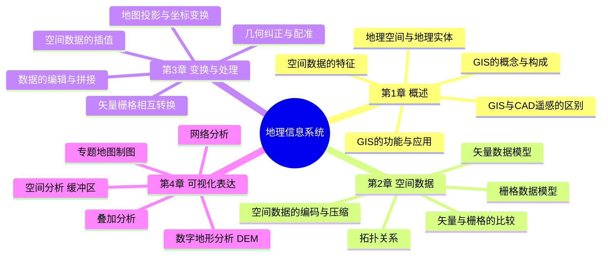
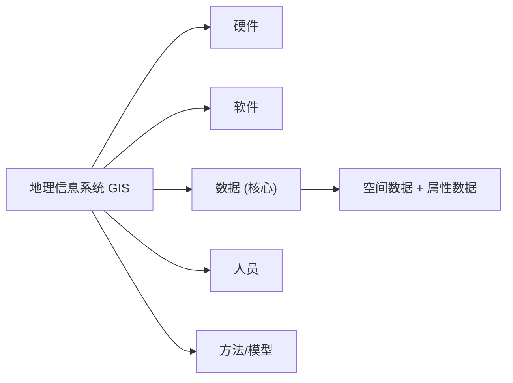
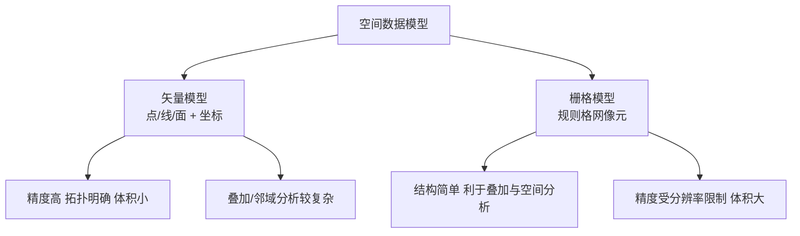

# 地理信息系统 GIS · 核心例题精解 · 图示深化

> 本篇为**深化层**：在「综合复习资料」之上，逐章给出**名词解释 / 简答 / 计算与分析例题 + 参考答案**，并配**思维导图 / 流程示意图**（mermaid 矢量图，非纯文字）。
> GIS 计算遵循"先判数据模型 → 列公式/流程 → 代入参数 → 得值与解释"四步。

---

## 全课知识结构 · 思维导图

---

## 第 1 章 · GIS 概述

### 体系示意 · GIS 五大构成

### 例题 1-1（名词解释）
**题**：什么是地理信息系统（GIS）？它与 CAD、遥感（RS）的本质区别是什么？
**参考答案**：
- GIS 是在计算机软硬件支持下，对**地理空间数据**进行**采集、存储、管理、分析、表达**的技术系统。
- 与 **CAD** 区别：CAD 侧重图形绘制、缺乏**空间拓扑与属性关联及空间分析**；GIS 强调**空间分析与决策**。
- 与 **RS** 区别：RS 侧重**数据获取**（影像）；GIS 侧重数据的**管理与分析**，二者互补（RS 是 GIS 的重要数据源）。

### 例题 1-2（简答）
**题**：空间数据有哪些基本特征？
**参考答案**：① **空间特征（定位）**——位置与几何形态；② **属性特征（非空间）**——质量与数量描述；③ **时间特征**——动态变化；④ **空间关系（拓扑）**——邻接、关联、包含等。

---

## 第 2 章 · 空间数据模型

### 对比示意 · 矢量 vs 栅格

### 例题 2-1（名词解释）
**题**：什么是拓扑关系？为什么 GIS 需要拓扑？
**参考答案**：拓扑关系是空间对象间**不随图形拉伸/旋转而改变的空间关系**，主要有**关联、邻接、包含**。意义：① 无需坐标即可判断**邻接、连通**；② 支持**网络分析、面域提取、多边形叠加**；③ 保证数据**一致性与完整性**（无缝、无重叠）。

### 例题 2-2（计算 · 栅格数据量）
**题**：某区域 $10\ \mathrm{km}\times 8\ \mathrm{km}$，栅格分辨率（像元边长）$=10\ \mathrm{m}$，每像元用 $1$ 字节存储。求栅格行列数与未压缩数据量（MB）。
**解**：
1. 列数 $=\dfrac{10000}{10}=1000$，行数 $=\dfrac{8000}{10}=800$。
2. 像元总数 $=1000\times800=8.0\times10^{5}$。
3. 数据量 $=8.0\times10^{5}\ \mathrm{B}=\dfrac{8.0\times10^{5}}{1024^2}\approx 0.76\ \mathrm{MB}$。

$$\boxed{1000\times800\ 像元,\ \approx 0.76\ \mathrm{MB}}$$
> 推论：分辨率提高一倍（$5\ \mathrm{m}$），像元数变 $4$ 倍，数据量约 $3.05\ \mathrm{MB}$——**精度与存储的权衡**。

### 例题 2-3（简答）
**题**：游程编码（行程编码 RLE）为何能压缩栅格数据？适用于何种数据？
**参考答案**：RLE 将一行中**连续相同值的像元**记为"(属性值, 重复个数)"，对**同值像元成片聚集**的数据（如土地利用、分类图）压缩率高；对**取值频繁变化**的数据（如高程连续面）压缩效果差甚至膨胀。

---

## 第 3 章 · 空间数据的变换与处理

### 流程示意 · 地图投影与坐标变换

### 例题 3-1（名词解释）
**题**：什么是地图投影？投影会带来哪些变形？
**参考答案**：地图投影是将**地球椭球面上的经纬网**按一定数学法则展绘到**平面**上的方法。必然产生**长度、角度、面积**变形；按变形性质分为**等角（正形）投影、等积投影、任意投影（含等距）**，应用中按需取舍（如航海用等角墨卡托，统计制图常用等积）。

### 例题 3-2（计算 · 比例尺与分辨率匹配）
**题**：某栅格地图比例尺 $1:50000$，若按"图上 $0.1\ \mathrm{mm}$ 对应一个像元"选取分辨率，地面分辨率应取多少米？
**解**：地面分辨率 $=0.1\ \mathrm{mm}\times 50000=0.1\times10^{-3}\ \mathrm{m}\times5\times10^{4}=5\ \mathrm{m}$。

$$\boxed{地面分辨率 \approx 5\ \mathrm{m}}$$

### 例题 3-3（简答）
**题**：矢量转栅格、栅格转矢量各自的关键问题是什么？
**参考答案**：
- **矢量→栅格（栅格化）**：核心是**像元属性赋值**（中心点法、面积占优法），关键问题是**分辨率选择**与**边界锯齿/信息损失**。
- **栅格→矢量（矢量化）**：经**二值化→细化（骨架化）→跟踪→拓扑重建**，关键问题是**线条平滑与拓扑正确性**。

---

## 第 4 章 · 空间分析与可视化表达

### 流程示意 · 叠加分析

### 例题 4-1（名词解释）
**题**：什么是缓冲区分析？什么是叠加分析？各举一应用。
**参考答案**：
- **缓冲区分析**：以点/线/面对象为中心，建立**一定宽度的邻近多边形**。应用：河流两侧 $200\ \mathrm{m}$ 划定**水源保护带**。
- **叠加分析**：将**多个图层在空间上叠合**，生成兼具各层属性的新图层。应用：坡度图 × 土地利用图 → **建设用地适宜性评价**。

### 例题 4-2（计算 · 反距离加权插值 IDW）
**题**：用 IDW（幂指数 $p=2$）由两个已知点估计点 P 的高程。点 A 高程 $100\ \mathrm{m}$、距 P $2\ \mathrm{m}$；点 B 高程 $130\ \mathrm{m}$、距 P $4\ \mathrm{m}$。
**解**：权重 $w_i=1/d_i^{2}$：$w_A=1/4=0.25$，$w_B=1/16=0.0625$。
$$Z_P=\frac{w_A Z_A+w_B Z_B}{w_A+w_B}=\frac{0.25\times100+0.0625\times130}{0.25+0.0625}=\frac{25+8.125}{0.3125}\approx 106\ \mathrm{m}$$

$$\boxed{Z_P\approx 106\ \mathrm{m}\ (\text{距离近的 A 权重大，估值更靠近 A})}$$

### 例题 4-3（计算 · 坡度）
**题**：DEM 中相邻两点水平距离 $30\ \mathrm{m}$，高程差 $15\ \mathrm{m}$。求该方向坡度（度）。
**解**：$\tan\theta=\dfrac{\Delta h}{\Delta L}=\dfrac{15}{30}=0.5\Rightarrow \theta=\arctan 0.5\approx 26.6^\circ$。

$$\boxed{坡度 \approx 26.6^\circ}$$

---

> **正言若反**：分析不离数据模型，模型不离坐标系，坐标系不离原始 PDF 课件之图。本篇为"上机/考场都用得上"的一层；遇疑，回归「综合复习资料」与各章图示。
