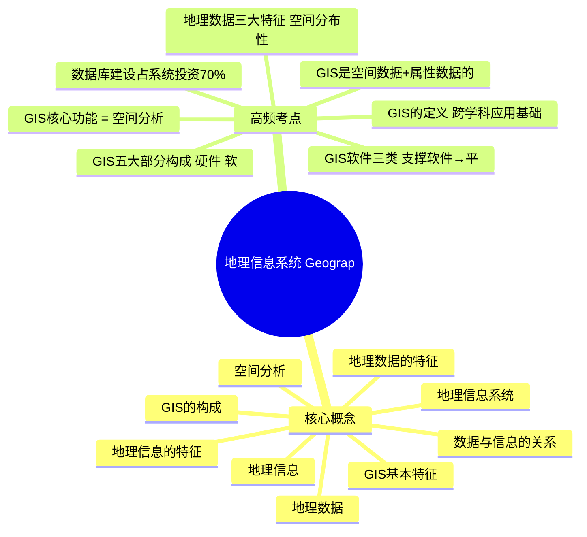

# 地理信息系统 · 第 1 章 · 地理信息系统 Geographic Information System, GIS · 素材

> 教师: 黄源生 · 学期: 2026春
> 章下 PDF: 2 个 · 总页: 180
> 主版: 第 2 节 · 90 页

---

## 主版课件 · 第 2 节

> `002-地理信息系统 Geographic Information System, GIS（2）-地理信息系统 Geographic Information System, GIS.pdf`

<details><summary>展开 90 页图链</summary>

- [p001](../002-地理信息系统 Geographic Information System, GIS（2）-地理信息系统 Geographic Information System, GIS/page_001.jpg)  · 地理信息系统
- [p002](../002-地理信息系统 Geographic Information System, GIS（2）-地理信息系统 Geographic Information System, GIS/page_002.jpg)  · 教材 费通意等教育“十一五”滨家经统划教材
- [p003](../002-地理信息系统 Geographic Information System, GIS（2）-地理信息系统 Geographic Information System, GIS/page_003.jpg)  · 授课目标
- [p004](../002-地理信息系统 Geographic Information System, GIS（2）-地理信息系统 Geographic Information System, GIS/page_004.jpg)  · 实验课程简介
- [p005](../002-地理信息系统 Geographic Information System, GIS（2）-地理信息系统 Geographic Information System, GIS/page_005.jpg)  · >GIS能干什么？
- [p006](../002-地理信息系统 Geographic Information System, GIS（2）-地理信息系统 Geographic Information System, GIS/page_006.jpg)  · 龙港新城控制性详细规划 02-用地规划图（修编后）
- [p007](../002-地理信息系统 Geographic Information System, GIS（2）-地理信息系统 Geographic Information System, GIS/page_007.jpg)  · 预期效果 采样/研究区地图
- [p008](../002-地理信息系统 Geographic Information System, GIS（2）-地理信息系统 Geographic Information System, GIS/page_008.jpg)  · 预期效果 采样/研究区地图
- [p009](../002-地理信息系统 Geographic Information System, GIS（2）-地理信息系统 Geographic Information System, GIS/page_009.jpg)  · 预期效果 污染物浓度空间可视化
- [p010](../002-地理信息系统 Geographic Information System, GIS（2）-地理信息系统 Geographic Information System, GIS/page_010.jpg)  · 预期效果 污染物浓度空间可视化
- [p011](../002-地理信息系统 Geographic Information System, GIS（2）-地理信息系统 Geographic Information System, GIS/page_011.jpg)  · 第一讲
- [p012](../002-地理信息系统 Geographic Information System, GIS（2）-地理信息系统 Geographic Information System, GIS/page_012.jpg)  · 本章内容
- [p013](../002-地理信息系统 Geographic Information System, GIS（2）-地理信息系统 Geographic Information System, GIS/page_013.jpg)  · GIS能干什么
- [p014](../002-地理信息系统 Geographic Information System, GIS（2）-地理信息系统 Geographic Information System, GIS/page_014.jpg)  · GIS应用案例
- [p015](../002-地理信息系统 Geographic Information System, GIS（2）-地理信息系统 Geographic Information System, GIS/page_015.jpg)  · 、GIS应用案例
- [p016](../002-地理信息系统 Geographic Information System, GIS（2）-地理信息系统 Geographic Information System, GIS/page_016.jpg)  · GIS应用案例
- [p017](../002-地理信息系统 Geographic Information System, GIS（2）-地理信息系统 Geographic Information System, GIS/page_017.jpg)  · GIS应用案例
- [p018](../002-地理信息系统 Geographic Information System, GIS（2）-地理信息系统 Geographic Information System, GIS/page_018.jpg)  · GIS应用案例
- [p019](../002-地理信息系统 Geographic Information System, GIS（2）-地理信息系统 Geographic Information System, GIS/page_019.jpg)  · GIS应用案例
- [p020](../002-地理信息系统 Geographic Information System, GIS（2）-地理信息系统 Geographic Information System, GIS/page_020.jpg)  · GIS应用案例 苏州河重金属
- [p021](../002-地理信息系统 Geographic Information System, GIS（2）-地理信息系统 Geographic Information System, GIS/page_021.jpg)  · GIS应用案例 苏州河重金属
- [p022](../002-地理信息系统 Geographic Information System, GIS（2）-地理信息系统 Geographic Information System, GIS/page_022.jpg)  · GIS应用案例 东江上游集水区土壤侵蚀
- [p023](../002-地理信息系统 Geographic Information System, GIS（2）-地理信息系统 Geographic Information System, GIS/page_023.jpg)  · GIS应用案例 东江上游集水区土壤侵蚀
- [p024](../002-地理信息系统 Geographic Information System, GIS（2）-地理信息系统 Geographic Information System, GIS/page_024.jpg)  · 一、GIS应用案例 农村排水模式优化
- [p025](../002-地理信息系统 Geographic Information System, GIS（2）-地理信息系统 Geographic Information System, GIS/page_025.jpg)  · GIS应用案例 开始
- [p026](../002-地理信息系统 Geographic Information System, GIS（2）-地理信息系统 Geographic Information System, GIS/page_026.jpg)  · GIS应用案例 市政排水模式优化
- [p027](../002-地理信息系统 Geographic Information System, GIS（2）-地理信息系统 Geographic Information System, GIS/page_027.jpg)  · 二、地理信息系统
- [p028](../002-地理信息系统 Geographic Information System, GIS（2）-地理信息系统 Geographic Information System, GIS/page_028.jpg)  · 二、 地理信息系统
- [p029](../002-地理信息系统 Geographic Information System, GIS（2）-地理信息系统 Geographic Information System, GIS/page_029.jpg)  · 地理信息系统
- [p030](../002-地理信息系统 Geographic Information System, GIS（2）-地理信息系统 Geographic Information System, GIS/page_030.jpg)  · 二、地理信息系统
- [p031](../002-地理信息系统 Geographic Information System, GIS（2）-地理信息系统 Geographic Information System, GIS/page_031.jpg)  · 二、 地理信息系统
- [p032](../002-地理信息系统 Geographic Information System, GIS（2）-地理信息系统 Geographic Information System, GIS/page_032.jpg)  · 二、 地理信息系统
- [p033](../002-地理信息系统 Geographic Information System, GIS（2）-地理信息系统 Geographic Information System, GIS/page_033.jpg)  · 二、 地理信息系统
- [p034](../002-地理信息系统 Geographic Information System, GIS（2）-地理信息系统 Geographic Information System, GIS/page_034.jpg)  · 二、 地理信息系统
- [p035](../002-地理信息系统 Geographic Information System, GIS（2）-地理信息系统 Geographic Information System, GIS/page_035.jpg)  · 二、地理信息系统
- [p036](../002-地理信息系统 Geographic Information System, GIS（2）-地理信息系统 Geographic Information System, GIS/page_036.jpg)  · 二、地理信息系统
- [p037](../002-地理信息系统 Geographic Information System, GIS（2）-地理信息系统 Geographic Information System, GIS/page_037.jpg)  · 二、地理信息系统
- [p038](../002-地理信息系统 Geographic Information System, GIS（2）-地理信息系统 Geographic Information System, GIS/page_038.jpg)  · 二、 地理信息系统
- [p039](../002-地理信息系统 Geographic Information System, GIS（2）-地理信息系统 Geographic Information System, GIS/page_039.jpg)  · 二、 地理信息系统
- [p040](../002-地理信息系统 Geographic Information System, GIS（2）-地理信息系统 Geographic Information System, GIS/page_040.jpg)  · 二、 地理信息系统
- [p041](../002-地理信息系统 Geographic Information System, GIS（2）-地理信息系统 Geographic Information System, GIS/page_041.jpg)  · 二、地理信息系统
- [p042](../002-地理信息系统 Geographic Information System, GIS（2）-地理信息系统 Geographic Information System, GIS/page_042.jpg)  · 二、地理信息系统
- [p043](../002-地理信息系统 Geographic Information System, GIS（2）-地理信息系统 Geographic Information System, GIS/page_043.jpg)  · 二、地理信息系统
- [p044](../002-地理信息系统 Geographic Information System, GIS（2）-地理信息系统 Geographic Information System, GIS/page_044.jpg)  · 二、地理信息系统
- [p045](../002-地理信息系统 Geographic Information System, GIS（2）-地理信息系统 Geographic Information System, GIS/page_045.jpg)  · 二、地理信息系统
- [p046](../002-地理信息系统 Geographic Information System, GIS（2）-地理信息系统 Geographic Information System, GIS/page_046.jpg)  · 二、地理信息系统
- [p047](../002-地理信息系统 Geographic Information System, GIS（2）-地理信息系统 Geographic Information System, GIS/page_047.jpg)  · 二、地理信息系统
- [p048](../002-地理信息系统 Geographic Information System, GIS（2）-地理信息系统 Geographic Information System, GIS/page_048.jpg)  · 二、地理信息系统
- [p049](../002-地理信息系统 Geographic Information System, GIS（2）-地理信息系统 Geographic Information System, GIS/page_049.jpg)  · 二、 地理信息系统
- [p050](../002-地理信息系统 Geographic Information System, GIS（2）-地理信息系统 Geographic Information System, GIS/page_050.jpg)  · 二、 地理信息系统
- [p051](../002-地理信息系统 Geographic Information System, GIS（2）-地理信息系统 Geographic Information System, GIS/page_051.jpg)  · 二、 地理信息系统
- [p052](../002-地理信息系统 Geographic Information System, GIS（2）-地理信息系统 Geographic Information System, GIS/page_052.jpg)  · 二、 地理信息系统
- [p053](../002-地理信息系统 Geographic Information System, GIS（2）-地理信息系统 Geographic Information System, GIS/page_053.jpg)  · 二、地理信息系统
- [p054](../002-地理信息系统 Geographic Information System, GIS（2）-地理信息系统 Geographic Information System, GIS/page_054.jpg)  · 二、地理信息系统
- [p055](../002-地理信息系统 Geographic Information System, GIS（2）-地理信息系统 Geographic Information System, GIS/page_055.jpg)  · 二、 地理信息系统
- [p056](../002-地理信息系统 Geographic Information System, GIS（2）-地理信息系统 Geographic Information System, GIS/page_056.jpg)  · 二、 地理信息系统
- [p057](../002-地理信息系统 Geographic Information System, GIS（2）-地理信息系统 Geographic Information System, GIS/page_057.jpg)  · 二、 地理信息系统
- [p058](../002-地理信息系统 Geographic Information System, GIS（2）-地理信息系统 Geographic Information System, GIS/page_058.jpg)  · 二、地理信息系统
- [p059](../002-地理信息系统 Geographic Information System, GIS（2）-地理信息系统 Geographic Information System, GIS/page_059.jpg)  · 二、地理信息系统
- [p060](../002-地理信息系统 Geographic Information System, GIS（2）-地理信息系统 Geographic Information System, GIS/page_060.jpg)  · 二、 地理信息系统
- [p061](../002-地理信息系统 Geographic Information System, GIS（2）-地理信息系统 Geographic Information System, GIS/page_061.jpg)  · 二、1 地理信息系统
- [p062](../002-地理信息系统 Geographic Information System, GIS（2）-地理信息系统 Geographic Information System, GIS/page_062.jpg)  · 二、 地理信息系统
- [p063](../002-地理信息系统 Geographic Information System, GIS（2）-地理信息系统 Geographic Information System, GIS/page_063.jpg)  · 二、地理信息系统
- [p064](../002-地理信息系统 Geographic Information System, GIS（2）-地理信息系统 Geographic Information System, GIS/page_064.jpg)  · 三、GIS空间分析
- [p065](../002-地理信息系统 Geographic Information System, GIS（2）-地理信息系统 Geographic Information System, GIS/page_065.jpg)  · 三、（ GIS空间分析
- [p066](../002-地理信息系统 Geographic Information System, GIS（2）-地理信息系统 Geographic Information System, GIS/page_066.jpg)  · 四、ArcGIS 10 概述
- [p067](../002-地理信息系统 Geographic Information System, GIS（2）-地理信息系统 Geographic Information System, GIS/page_067.jpg)  · ArcGIS的三个基础模块
- [p068](../002-地理信息系统 Geographic Information System, GIS（2）-地理信息系统 Geographic Information System, GIS/page_068.jpg)  · 》空间数据
- [p069](../002-地理信息系统 Geographic Information System, GIS（2）-地理信息系统 Geographic Information System, GIS/page_069.jpg)  · ArcMap10.6 ArcCatalog10.6 Toolbox
- [p070](../002-地理信息系统 Geographic Information System, GIS（2）-地理信息系统 Geographic Information System, GIS/page_070.jpg)  · 四、ArcGIS 10 概述
- [p071](../002-地理信息系统 Geographic Information System, GIS（2）-地理信息系统 Geographic Information System, GIS/page_071.jpg)  · 四、ArcGIS 10 概述
- [p072](../002-地理信息系统 Geographic Information System, GIS（2）-地理信息系统 Geographic Information System, GIS/page_072.jpg)  · 四、ArcGIS 10 概述
- [p073](../002-地理信息系统 Geographic Information System, GIS（2）-地理信息系统 Geographic Information System, GIS/page_073.jpg)  · 四、ArcGIS 10 概述
- [p074](../002-地理信息系统 Geographic Information System, GIS（2）-地理信息系统 Geographic Information System, GIS/page_074.jpg)  · 四、ArcGIS 10 概述
- [p075](../002-地理信息系统 Geographic Information System, GIS（2）-地理信息系统 Geographic Information System, GIS/page_075.jpg)  · GIS数据共享网站
- [p076](../002-地理信息系统 Geographic Information System, GIS（2）-地理信息系统 Geographic Information System, GIS/page_076.jpg)  · 五、环境地理信息系统
- [p077](../002-地理信息系统 Geographic Information System, GIS（2）-地理信息系统 Geographic Information System, GIS/page_077.jpg)  · 五、环境地理信息系统
- [p078](../002-地理信息系统 Geographic Information System, GIS（2）-地理信息系统 Geographic Information System, GIS/page_078.jpg)  · 五、环境地理信息系统
- [p079](../002-地理信息系统 Geographic Information System, GIS（2）-地理信息系统 Geographic Information System, GIS/page_079.jpg)  · 五、环境地理信息系统
- [p080](../002-地理信息系统 Geographic Information System, GIS（2）-地理信息系统 Geographic Information System, GIS/page_080.jpg)  · 五、环境地理信息系统
- [p081](../002-地理信息系统 Geographic Information System, GIS（2）-地理信息系统 Geographic Information System, GIS/page_081.jpg)  · 五、环境地理信息系统
- [p082](../002-地理信息系统 Geographic Information System, GIS（2）-地理信息系统 Geographic Information System, GIS/page_082.jpg)  · 五、环境地理信息系统
- [p083](../002-地理信息系统 Geographic Information System, GIS（2）-地理信息系统 Geographic Information System, GIS/page_083.jpg)  · 五、环境地理信息系统
- [p084](../002-地理信息系统 Geographic Information System, GIS（2）-地理信息系统 Geographic Information System, GIS/page_084.jpg)  · 五、环境地理信息系统
- [p085](../002-地理信息系统 Geographic Information System, GIS（2）-地理信息系统 Geographic Information System, GIS/page_085.jpg)  · 五、环境地理信息系统
- [p086](../002-地理信息系统 Geographic Information System, GIS（2）-地理信息系统 Geographic Information System, GIS/page_086.jpg)  · 五、环境地理信息系统
- [p087](../002-地理信息系统 Geographic Information System, GIS（2）-地理信息系统 Geographic Information System, GIS/page_087.jpg)  · 五、环境地理信息系统
- [p088](../002-地理信息系统 Geographic Information System, GIS（2）-地理信息系统 Geographic Information System, GIS/page_088.jpg)  · 五、 环境地理信息系统
- [p089](../002-地理信息系统 Geographic Information System, GIS（2）-地理信息系统 Geographic Information System, GIS/page_089.jpg)  · 五、环境地理信息系统
- [p090](../002-地理信息系统 Geographic Information System, GIS（2）-地理信息系统 Geographic Information System, GIS/page_090.jpg)  · 课后思考

</details>

<details><summary>展开 90 页图文对照（每图配其识别文本）</summary>

**p001** 

地理信息系统
Geographic Information System, GIS
在环境/生态科学中的应用
授课老师：黄源生副教授
办公室：学院楼309室
联系方式：
电话：13452085128
QQ:534720018
邮箱：
ysh_huang@xju.edu.cr

---

**p002** 

教材 费通意等教育“十一五”滨家经统划教材
地理信息系统
地理信息系统，刘耀林，中国农业出
刘耀林 王编
版社，2018
参考教材
>ArcGIS地理信息系统空间分析实验教程（第二版）
>ArcGIS地理信息系统教程（第七版）
QGIS和通用工具
>ArcGISProPython编程
地理息系统理论与应用丛书 WILEY PocktaArcGIS ArcGISPro
地理信息系统空间分析 实验教程（第二版） ArcGIS Python编程
地理信息系统教程 Python forArcGISProMastoring rEGIS. aTQGIS and GenericToolsQGIS和通用工具
[法]Nclas Baghda

---

**p003** 

授课目标
》了解地理信息系统（GIS）的基本原理、理论;
>掌握常见GIS软件（ArcGIS）的基本操作;
》了解地理信息系统在环境科学中的应用。
考核方法
》考勤10%，请假、迟到5'/次，早退10'/次，旷课20/次；
>作业20%，实验报告、课程汇报（4人）；
GIS软件的一些有趣的功能、实际应用等（主题自选）
>期末考试70%（闭卷）。

---

**p004** 

实验课程简介
序号 实验项目名称 实验内容
熟悉软件的菜单、图形操作界面及基本
GIS软件概述及基本操作
操作方法
掌握点、线、面矢量数据的创建，包括
2 矢量数据创建
几何形状和属性。
掌握矢量数据编辑的基本方法，矢量数
3 空间数据编辑与处理
据坐标转换的基本方法。
掌握如何进行地图布局；熟悉如何将各
专题地图和地图制图输出
种地图元素添加到布局中的方法
掌握缓冲区分析、叠加分析的基本操作
市区择房分析
和用途
熟悉栅格距离制图、表面分、栅格计算
学校选址
器、重分类
污染物空间插值 掌握数据转换、空间插值操作
8 综合数据处理模型构建 掌握ModelBuilder的使用
总学时 16

---

**p005** 

>GIS能干什么？
在环境专业中有什么应用价值？

---

**p006** 

龙港新城控制性详细规划 02-用地规划图（修编后）
>GIS能干什么？
滨江湿地 公园
在环境专业中有什么 03006001200m
应用价值？
图例 市山地生态用障
西北都水乡生态区 市级生志间
H区生态电路 生态保护红线
自然保护S 重要地
主干天道 级行政中心
干网
山体公司
A2 行政办公用地 其地商务用地 留白用地 51交通组用地 幼儿器 变市站
图 教育科研用地 文化设施用地 541 加油加气站用地 乐康体用地 H23港口用地 工业用地 541公共交通场站用地 542社会停车场用地 广播电用地 环境设洲用地 ①小学 共热设施 信设所
A4 A 医行卫生用地 体育用池 其他服务设集用地 水城 W 新型产业用地 一类工业用地 其他交通设施用地 供应设施用地 排水用地 陈卫用地 业学校 高中 污水设第
例 社会福利用地 行政商务合用地 G 公园绿地 农林用地 三类工业用地 二类工业用地 供水用地 供电用地 防洪用地 防用地 P社会停车场垃圾转运站 公交首末站消防站
本核不作为事仅的体院 商业用地 商务用地 G3 广场用地 防护绿地 R2 二类住用地 报务设宽用地 供燃气用地 供热用地 W 物清仓储用地 规划围 加加气交 共水设
温州市城市规划设计研究院有限公司

---

**p007** 

预期效果 采样/研究区地图
113°20'0"E 114°0'0"E 114°40'0"E 115°20'0"E 116°0'0"EChina NResearch Area25°0'0"NHigh-intensity HumanActivity Area 24°30'0"NWaterareaRiverReservoir5001,000 2,000km Elevstion/m 24°0'0"NThePearl RiverBasin 161
ThePearlRiverBasin 14 23°300"N23°0'O"NRiver 2550 100kmThePearl RiverBasin 0125250 500km DThe Dong RiverBasin113°200"E 114°0'0"E 114°40'0"E 115°20'0"E 116°00"E

---

**p008** 

预期效果 采样/研究区地图
115°200"E 115°220"E 115°240"E 115°260"E24°32'0"N24°30'0"NChina24°28'0"NLegendFengshuba Reservoir 24°26'0"N24°24'0"N1.25 2.5 km115°200"E 115°220"E 115°240"E 115°260"E

---

**p009** 

预期效果 污染物浓度空间可视化
NO.o01 12030'0"E 120°40'0"E 120050'0"E N0.0015 N0.0.10
Cao mak LI a Cao LakeNo.o201
Wu-Song River Wu-SongRiverLegend (μg/L)
10.23-16.62 R4 K416.63-29.4929.50-39.7839.79-76.04 ChengLake N.0.01015 Legend(mg/kg) ChengLakeN.o.01e176.05-162.36 4,900 N.0.o1o1
P4 Sediment P4
Taihu Lake Taipu RiverP3PA Taihu Lake aipuRiveN..0.015 R7 R8 Taipu River N.0.001
N0.0o1E Taipu River Taipu River R7 N.0.001E12030'0"E 120°40'0"E 120050'0"E120°400"F. 10.050071
矢量数据符号化

---

**p010** 

预期效果 污染物浓度空间可视化
空间插值计算
0.113 0.098 0.117 0.530.094 0.500.107 0.090 0.112 0.470.101 0.107 0,449800 0.102 0.410.095 0.082 0.0970.089 Middlewater 0.38
Surface watcr 0.078 Bottomwater 0.092 Porc water 0.350.088 0.076 0.090 0.3020.085 0.074 0.087 0.2840.082 0.071 0.083 0.2660.078 0.080 0.2480.075 0.068 0.076 0.230
Surfacewater 0.072 Middle water 0.065 Bottomwatcr 0.073 Pore watcr 0.212

---

**p011** 

第一讲
地理信息系统概论

---

**p012** 

本章内容
、GIS应用案例
二、地理信息系统
三、GIS空间分析
四、ArcGIS10概述
五、环境地理信息系统

---

**p013** 

GIS能干什么
数据编辑
与更新
数据采集
与输入 数据存储
与管理
空间查询
登加分析
GIS能作 空间查询
与分析
什么？ 缓冲区分析
网络分析
地形分析
数据显示
与输出

---

**p014** 

GIS应用案例
CoronaVirus2019 （2020)
内家古
≥100001000-9999100-09910-991-9 数据空间可视化

---

**p015** 

、GIS应用案例
英国伦敦霍乱溯源（19世纪）
JohnSnow约翰·斯诺 （1813-1858），英国麻醉
学家、流行病学家
确认Thebroadstreet水井是该次霍乱疫情的源头
空间数据可视化 空间插值
The BroadStreetWell

---

**p016** 

GIS应用案例
TropicalForestTemperateForestBorealForestSavannaTundraSemi-Desert/Desert/lce0-10%
10-20%
20-30%
30-40%
40-50%
50-60%
60-70%
70-80%
80-90%
90-100%
FOLEYJA,DEFRIESR,ASNERGP,etal.Globalconsequencesoflanduse[J].Science,2005,309（5734):570-574.

---

**p017** 

GIS应用案例
BrowningGreeningFrequency(%) 32
0 -20-15-10-50510152025
<-19 -12 -8 -5 -3 2 5 8 11 13 >18
TrendinannualaverageLAl(1o-m²perm²perdecade)
Fig.1|MapoftrendsinannualaverageMoDISLAlfor20o0-2017.Statisticallysignificanttrends(Mann-Kendalltest,P<0.1)arecolour-coded.Greyareasshowvegetatedlandwithstatisticallyinsignificanttrends.Whiteareasdepictbarrenlands,permanentice-coveredareas,permanentwetlandsandbuilt-upareas.Blueareasrepresentwater.Theinsetshowsthefrequencydistributionofstatisticallysignificanttrends.Thehighlightedgreeningareasinredcirclesmostlyoverlapwithcroplands,withtheexceptionofcirclenumber4.SimilarpatternsareseenatP≤0.o5andthesevengreeningclustersarevisibleevenatP<O.o1.
CHENC,PARKT,WANGX,et al.China andIndia leadingreeningof theworld through land-usemanagement[J].NatureSustainability,2019,2(2):122-129.

---

**p018** 

GIS应用案例
a 160W 140°W 120°W 100W 80W M.09 40°W 20°W 20°E 100°E 120°E 140°E 160°E180° 40°E 60°E 80°E 180°
30°N10°N10°S30°S50°S70°SSoilerosion2012 0 2500 5000
Mgha-1yr-1 km0-1 1-3 3-5 5-1010-2020-50 >50 NodataBORRELLIPROBINSONDA,FLEISCHERLR,etal.Anassessmentoftheglobalimpactof21stcenturyandusechangeon soil erosion[J].Nature Communications,2017,8(1):2013.

---

**p019** 

GIS应用案例
a 160°W 140W 120W 100°W 20°W 100°E 120°E 140°E 160°E180° 80W M.09 40°W 20°E 40°E 60°E 3.08 180°
830°N10°N10°S30°S50°S70°SSoilerosionchangebaselinescenario(2001-2012) 0 2500 5000
S-> -5--2.5-2.5--0.5-0.5-00-0.50.5-2.52.5-5 >5 NodataBORRELLIPROBINSONDA,FLEISCHERLR,etal.Anassessmentoftheglobalimpactof21stcenturyandusechangeonsoilerosion[J].NatureCommunications,2017,8(1):2013.

---

**p020** 

GIS应用案例 苏州河重金属
latitude longitude Type31.42167 120.455 Rural Area31.39111 120.5028 Rural Area31.44639 120.5353 Rural Area120°30'0"E 120°40'0"E 120°50'0"E 31.49417 120.5761 Rural AreaL1 31.44028 120.6322 RuralAreaCaoLake 31.4525 120.7742 Rural Area31.34861 120.5767 Urban Area1.2 31.37444 120.6106 UrbanAreaR YangchengLake 31.30694 120.5686 UrbanArea31.31056 120.6056 UrbanArea31.31833 120.61 Urban AreaC3 31.32472 120.6403 Urban AreaC8 31.34361 120.6483 UrbanArea31.34 120.7189 UrbanAreaC9 Wu-Song River 31.29611 120.6097 Urban AreaR2 R4 31.29444 120.6283 UrbanArea31.30889 120.6344 Urban AreaR3 31.28833 120.6461 UrbanArea31.26333 120.5881 UrbanAreaLegend ChengLake 31.25944 120.6042 UrbanArea31.23861 120.6583 SuburbArea
★ City System 31.26361 120.7744 Suburb AreaReservoirSystem SuburbAreaRiverSystem Jinghang Canal 31.17917 120.6567
River 31.19833 120.7211 Suburb AreaLake 31.19028 120.8211 Suburb AreaTaihu Lake 31.10972 120.6753 Suburb Area31.1025 120.6578 Suburb AreaPP5 P4 31.06472 120.6669 SuburbAreaN.0.0010 TaipuRiver R7 31.0025 120.6483 SuburbAreaR8 R9 31.00889 120.4864 SuburbArea30.99389 120.675 SuburbArea120°40'0"F. 120°50'0"F. 3099944 120.7375 Suburh AreaFig.1-Samplingmap of the city-river-reservoir system.C1-C9:CitySystem,CiS;R1-R9:RiverSystem,RiS;P1-P5andL1-L4:
ReservoirSystem,ReS.

---

**p021** 

GIS应用案例 苏州河重金属
Name Alti Long utumn,ng/vinter,ng/Ispring,ng/Lummer,ng pring,ng/gummer,ng/utumn,ng/wmter,ng/Lsprmg,ng/lummer,n
鹤溪大桥 31.42167 120.455 317.64 345.5977413.413 22.626
浒青路 31.39111 120.5028 248.51 1173.002 806.843 46.60475 30.680
西塘河桥 31.44639120.5353 207.35 259.8876 502.8195 894.4551904.13 2373.3843.0242827.68722 21.8975 44.6195
漕湖 31.49417 120.5761 39.28 252.2499424.555 33.68775 45.1122
人民桥 31.44028120.6322 312.20 678.2084 437.2139 45.972 34.1875
阳澄湖 31.4525 120.7742 53.53 52.6209
联城桥 3134861 1205767 40630594.70771551.33435.5807312.02404 25.828 54.064
N.0.00015 120°30'0"E 120°40'0"E 1200500"E Nuo.001 N0.001
LI a LICaoLak CaolakeNo.07010 No.02015
Wu-Song River Wu-SongRiverLegend (μg/L)
。 10.23-16.62 R2 T416.63-29.49
? 29.50-39.78
N.0.ole15 39.79-76.04 ChengLake No.olo1 Legend(mg/kg)
76.05-162.36 N.0.01o1 4,900 N.0.01olTaihu Lake TaipuRiverPPA TaihnLake aipuRiveeN.0.0c1 R7 R8Taipu River N0.0ol5
N.0.01 Taipu River Taipu River R72R8 0.0130.00071 120°40'0"E 1200500"E120°40′0"F.
Fig.2-Spatial distributionofheavymetalsinthreephases.(a)surfacewater;(b)SPMandsediment.
太浦河大桥 30.99389 120.675 269.274343.5504366.7255 226.695219.4869497.10289.85846513.0193225.1312530.9446
黎里东大桥 30.99944120.73753 329.758252.9385432.712232.5375122.56571534963105241322.09293369745155568

---

**p022** 

GIS应用案例 东江上游集水区土壤侵蚀
114°00E 114°400°E 115°200E 114°00°E 114400E 115°200E 114°00°E 114°400E 115°200°E 114°0′0°E 114°400E 115°200E 114°00°E 114°400°E 115°200°E1999 2004 2009 2014 2017
NOsS N.0.SS.
NO.S+.7 Legend Legend Legend Legend Legend N.0.S07
ASlight BLight ASlight ASligh ASlight ASlightCModeratc CModerat BLight CModerate BLight CModerate BLight CModerate BLightD Severe EVery severe 01530 60km EVery severe D Severe DSevere D Severe DSevereFExtremely severe FExtremely severe 01530 60km EVery severe FExtremely severe 01530 60km EVery severe FExtremely severe 01530 60km EVery severe FExtremely severe 01530 209 N.0017114°00E 114°400°E 115°200°E 114°00°E 114°400°E 115°200°E 114°00°E 114°400E 115°200E 114°0′0°E 114°400°E 115°200°E 114°00°E 114°400°E 115°200ERUSLE公式 A =K·L·S·P·E REP114°00E 114400E 115°200E 114°00E 114400E 115°200E 114°00E 114400E 115°200E 114°00E 114°400E 115°200E 11400E 114°400E 115°200E1999 2004 2009 2014 2017
N0.5SLegend Legend Legend Legend Legendt/km2 0-1500 t/km2 t/km2 t/km2 t/km21500-3000 1500-3000 0-1500 1500-3000 0-1500 1500-3000 0-1500 1500-3000 0-15003000-4500 4500-6000 01530 60km 3000-4500 4500-6000 01530 60km 3000-4500 4500-6000 01530 60km 3000-4500 4500-6000 01530 60km 3000-4500 4500-6000 01530 60 km
>6000 >6000 >6000 >6000 >6000114°00"E 114°400"E 115200E 114°00E 114°400E 115°200E 3.00.11 114°400"E 115°200E 114°00"E 114°400E 115°200"E 114°00E 114°400E 115200EC-Fix模型：植被固碳量 流域水污染

---

**p023** 

GIS应用案例 东江上游集水区土壤侵蚀
114°400"E 115°20'0"E 116°0'0"E 114°400"E 115°20'0"E 116°0'0"E 114°400"E 115°20'0"E 0.0911
Soil Erosion Changes Vegetation Coverage Changes1999-2017 N Carbon Capture Changes 1999-2017 1999-2017 25°0'0"NN0.005724°300"N24°300N24°00"N24°00"N23°300"N23°300"N Legend Legend LegendUnchanged Increased UnchangedInceased Unchanged DecreasedDecreased 15 30 09 Decreased 15 30 60km Changed 15 30 60 km 23°0'0"N11400"E 114°400"E 115°200"E 114°0'0"E 114°400"E 115°200"E 114°00"E 114°400"E 115°200"E800 (a) 2000 1.0 100 (@) SoilErosion- -Rainfall--NDVI 300 1.0
SoilErosionll RainfalNNDVI700600 1600 0.8 80 240 0.8
Soil Erosion(x10t) Soil Erosion(x10+1)
500 Rainfall(mm) Rainfall(mm)
1200 0.6 NDVI 60 180 0.6 NDVI400300 800 0.4 120 0.4200 400 0.2 20 60 021001999 2004 2009 2014 2017 J0.0 0.0
Month

---

**p024** 

一、GIS应用案例 农村排水模式优化
农村污水治理规划框架 地表水水质 数值高程数据
水质数据 DEM数据 居民聚集区图斑数据 农村居民人口
输入数据
流域集水区 地形地貌特征 农村居民人口空间分
布图 农村居民星落图庚数据 Y.R 人口密度
RuST出水排放标准 农村居民空间分布
模式
基础参数
农村居民生活污水 数据库
排放量核算
结果输出
RuST设备及配套 图例
管材需求量 输入
总投资金额及金额 区域拆分
拆分 关键输出
>基于GIS的计算框架
ArcGISTatle To Excel

---

**p025** 

GIS应用案例 开始
预处理模块 空间聚类分析
空间叠置分析
污水管网优化
居民点模式数据筛选
未处理点模式子集
未处理节点
最邻近节点计算 ↑
污水管网优化
扩展模块 处理设施优选
造价核算
造价最优污水处理系统
型让算： 施工设计 ArcGIS 所有节点均接入
国区 污水处理设施？
HETOR 10 高线 所有子区域计算完毕？
未处理的最大规模处理系统
潜在合并系统分析
python 潜在合并可能
b1) b2)
施工设计 污水管网优化
合并模块 (MM) 处理设施优选
c2) 造价核算
造价更低？
》管网设计、工艺优选 元
所有可能检查完毕？
是
所有系统检查完毕？
>算法设计、代码编写 输出污水处理最佳方案
结束

---

**p026** 

GIS应用案例 市政排水模式优化
SewagepipelinesDiameter(m)
0.2-0.30.4-0.60.7-1.01.1-1.6
WWTPs(12)
>借助GIS读写数据；算法设计、代码编写

---

**p027** 

二、地理信息系统
2.1信息与地理信息 数据和信息
数据：是人类在认识世界和改造世界过程中，定
性或定量对事物和环境描述的直接或间接原始记
录，是一种未经加工的原始资料。
信息：是用数据来表示事件、事物、现象等的内
容、数量或特征，从而向人们（或系统）提供关
于现实世界新的事实和知识
信息
加工处理
数据
数据元余

---

**p028** 

二、 地理信息系统
2.1信息与地理信息 数据和信息
信息来源于数据，是数据内涵的意义和数据内容
的解释。信息是一种客观存在，而数据是客观对
象的一种表示，其本身并不是信息。
数据所蕴涵的信息不会自动呈现出来，需要利
用一种技术，如统计、解译、编码等对其解释，
信息才能呈现出来。
信息是数据的表达，数据是信息的载体。
编号 鸡蛋体积 频数
1 62.14
... ......
300 58.23
体积（立方厘米）
现实世界中的对象 描述事物特征的数据 从数据中统计得到的信息

---

**p029** 

地理信息系统
2.1信息与地理信息 数据和信息
114°00"E 114°400°E 115°200E 114°00E 114°400E 115200E 114°0E 114°400E 115°200E 114°00E 114°400E 115°200E 11400E 114400E 115°200E1999 2004 2009 2014 2017
NOSS. N.O.SS.ZN.007.
Legend Legend Legend Legend Legend N.0.S7
ASlight ASlight ASlight ASlight ASlightCModerate BLight CModerate BLight CModerate BLight BLight CModerate CModerate BLightD Severe EVery severe 01530 60km D Severe EVery severc 01530 60 km D Severe EVery severe 01530 60km D Severc D SevereFExtremely severe FExtremely severe FExtremely severe FExtremely severe EVery severe 01530 60 km FExtremely severe EVery severe 01530  09 N001.711400"E 114400°E 115200E 114°00°E 114400E 115200°E 114°00°E 114400"E 115°200°E 114°00E 114°400E 115°200E 30011 114400E 115°200E800 (a) 2000 1.07001600 0.8
Soil Erosion(x10*) 600500 1200 Rainfall(mm) 0.6400 NDVI300 800 0.4200 400 0.21001999 2004 2009 2014 2017 0.0

---

**p030** 

二、地理信息系统
2.1信息与地理信息一地理数据和地理信息
》地理数据：与地理环境要素有关的事物/现象的数
量、质量、分布特征、联系和规律等的数字、文
字、图像和图形等总称。
地理信息：有关地理实体和地理现象的性质、特
征和运动/变化状态的表征和一切有用的知识，它
是对表达地理特征和地理现象之间关系的地理数
据的解释。

---

**p031** 

二、 地理信息系统
2.1信息与地理信息— 地理数据的特征
地理数据相比常规数据，
具有一些独有的特征，主
要包括： 属性
定位 数据
数据
空间上的分布性
时域
数据
时间上的序列性
数量上的海量性
地理对象或地理现
载体的多样性
象的数据描述
位置和属性的对应性

---

**p032** 

二、 地理信息系统
2.1信息与地理信息— 地理数据的特征
空间数据 属性数据
Name Address Town St.

---

**p033** 

二、 地理信息系统
2.1信息与地理信息一 地理数据的特征
空间数据 属性数据
Name Alti Long utumn,ng/winter,ng/Ispring,ng/Lummer,ng12030'0"E 120°400"E 12050'0"E 鹤溪大桥 31.42167 120.455 317.64 345.5977413.413527.462
a 浒青路 31.39111120.5028 248.51 1173.002806.843711.1685
西塘河桥 31.44639120.5353 207.35 259.8876 502.8195894.455
漕湖 31.49417120.5761 39.28 252.2499 424.555 397.021
人民桥 31.44028120.6322 312.20 678.2084437.2139160.966
阳澄湖 31.4525120.7742 53.53 840.8927258.1396598.7045
N.o.o7o10 联城桥 31.34861120.5767 403.9381 650.4731308.4395 406.305
塔影桥 31.37444120.6106467.42441445.932 495.421 597.2
Wu-SongRiver 何山桥 31.30694120.5686549.8601 636.2775502.422 453.6725
Legend (μg/L)
10.23-16.62 R2 中市桥 南新桥 31.31056 120.6056 452.9659 871.4124 467.4905 591.84616.63-29.49 31.31833 120.611678.874735.1736 905.731 694.67429.50-39.78 娄门桥 31.32472120.64031305.836531.9348 591.841 470.83
N.o.olele hengLake N0.01c1e 外塘河大桥
76.05 -162.36 跨塘大桥 31.34 5
泰让桥 31.29611120.6097268.3996 262.7185 566.1995 335.4255
大云桥 5
兴市桥 31.30889120.6344548.9965377.4075 991.714258.6455
Taihu Lake TapuRiver 觅渡桥 31.28833120.64611754.961324.0539 902.9 329.6365
石湖大桥
N.o.0e1 R7 R8 TaipuRiver 友联运河大桥31.25944120.6042561.1573378.9517487.8525687.5335
尹山大桥 31.23861120.6583349.5529282.2571009.469592.374120°30'0"E 120°40°0"E 1200500"E 吴淞江大桥 31.26361120.7744403.9513273.2996265.8405597.663
江陵大桥 31.17917120.6567318.913249.2123 686.6185 369.5325

---

**p034** 

二、 地理信息系统
2.1信息与地理信息- 地理数据的特征
》作为信息的一种，地
空间相
理信息具备信息的基 关性
本特征，即信息的客
观性、适用性、可传 空间层
特征 空间区
次性 域性
输性和共享性；但从
其本身而言，地理信
空间多
息还具有一些独特的
样性
特性：

---

**p035** 

二、地理信息系统
2.2地理信息系统一定义
>地理信息系统（GeographicInformationSystem或Geo-InformationSystem，简称GIS）
既是跨地球科学、空间科学、信息科学和计算
机科学的一门应用基础学科，又是一项工程应
用技术。它是以地学原理为依托，在计算机软
硬件的支持下，研究空间数据的采集、处理、
存储、管理、分析、建模和显示的相关理论方
法和应用技术，以解决复杂的管理、规划和决
策等问题。

---

**p036** 

二、地理信息系统
2.2地理信息系统一内涵
GIS处理/管理的对象：地理空间实体数据及其关
系，包括空间定位数据、图形数据、遥感图像数
据、属性数据等，主要用于分析和处理一定区域
内分布的各种现象（物种、污染物）和过程（群
落演变、污染扩散），解决各种复杂地学问题。
GIS的操作对象：点、线、面、体这类有空间位
置和空间形态特征的空间数据。
GIS的技术优势在于它的数据综合、模拟与分析
评价能力。

---

**p037** 

二、地理信息系统
2.2地理信息系统 基本特征
数据的空间定位特征：有别于其他数据的本
质特征；
空间关系处理的复杂性：图像、空间关系、
属性数据。
海量数据管理的能力：空间对象本身具有海
量数据、分析过程产生海量数据。

---

**p038** 

二、 地理信息系统
2.2地理信息系统 基本特征
空间数据 属性数据
Name Address Town St. ZipGIS IS
是
空间数据和属性数据的综合体

---

**p039** 

二、 地理信息系统
2.3GIS的构成
>GIS功能的实现需要一定的环境支持，GIS运行
环境包括计算机硬件系统、软件系统、空间数据、
地学模型和管理与应用人员五大部分
硬件系统 软件系统
构建 应用
地学模型 空间数据
应用人员

---

**p040** 

二、 地理信息系统
2.3.1计算机硬件系统
计算机硬件是计算机系统中的实际物理装置的总
称，是GIS的物理外壳。可以是电子的、电的、
磁的、机械的、光的原件或装置。
数字摄影测量仪器
外部存储器 内部存储器
全站仪 专用设备
存储设备 绘图仪
输入设备 处理设备 输出设备 打印机
数字化仪
终端
扫描仪 常规设备
服务器 工作站
鼠标键盘

---

**p041** 

二、地理信息系统
2.3.2计算机软件系统
》GIS运行所必需的各种程序，包括三类：
GIS支撑软件：GIS运行所必需的各种软件环
境，如操作系统、数据库。
GIS平台软件包括GIS功能所必需的各种处理
软件和扩展开发包，如ArcGIS、QGIS等。
GIS应用软件一般是在GIS平台软件的基础上，
通过二次开发所形成的具体的应用软件，一般
是面向应用部门的。

---

**p042** 

二、地理信息系统
2.3.2计算机软件系统
土地资源管理系统
其它行业应用系统
GIS应用软件
平台软件 平台SDKGIS平台软件
其它平台组件
GIS支撑软件 操作系统 数据库系统
其它支撑软件

---

**p043** 

二、地理信息系统
2.3.3 地理空间数据
数据是GIS的核
心内容。地理空
间数据是指以地 遥感监测数据 GPS及物联网
相关数据
球表面空间位置
为参照的自然、 空间数据库
社会和人文景观
社会调查数据 社交媒体数据
数据，可以是图
形、图像、文件、
表格和数字等。 交通时空数据 传统地图数据

---

**p044** 

二、地理信息系统
2.3.3地理空间数据
》不同用途的GIS，其地理空间数据的种类、精度
均会有所不同，一般都包括以下三种信息：
几何坐标：标识空间对象在自然界中的位置；
空间关系：如距离、方位、拓扑关系等；
非几何属性：
①定性：名称、类型、特性等，如土地利用、土壤种类；
②定量：数量和等级，如面积、人口数量等

---

**p045** 

二、地理信息系统
2.3.4地学模型
源数据
>GIS的地学模型是根据
数据1 填洼模型
具体的地学目标和问
题，①以GIS已有的
相格水系提取模型 数据2
操作和方法为基础，
构建能够表达或模拟
河流分级 水系矢里化
特定现象的计算机模
型；②无已有工具或
分级河网 矢量河网
算法，基于计算机编
基于ArcGIS的河网
程语言构建.... 提取模型
河网提取模型

---

**p046** 

二、地理信息系统
2.3.5应用人员
》人员是GIS中的重要
构成因素。地理信息
系统从其设计、建立、
项目管理 系统开发
人员 人员
运行和维护的整个生
命周期，都离不开人
GIS普通
用户
的作用。仅有系统的 科学研究 软件设计
人员 人员
软硬件、数据和模型
构不成完整的地理信
数据维护
人员
息系统。

---

**p047** 

二、地理信息系统
2.4GIS功能与应用
>GIS以数字形式表示自然界，具有完备的空间特
性，它可以存储和处理不同地理发展时期的大
量地理数据，具有极强的空间信息综合分析能
力，是地理分析的有力工具。
GIS不仅要管理大量复杂的地理数据
还要完成地理分析、评价、预测和辅助决策的任
务。

---

**p048** 

二、地理信息系统
2.4.1数据采集与输入
>将外部数据传输到GIS内部，并将数据从外部格
式转化为便于处理的内部格式的过程
确保GIS数据在内容和空间上的完整性、数值逻辑
一致性和正确性；
GIS数据库的建设占整个系统建设投资的70%;
重要GIS研究内容：数据共享和自动化数据输入

---

**p049** 

二、 地理信息系统
2.4.1 娄 数据采集与输入
遥感传感器
模拟地图 影像数据
地面测量与
足 历史数据
计算机媒介 存储介质
数字化仪
扫描仪
表格 矢量数据 栅格数据

---

**p050** 

二、 地理信息系统
2.4.1数据采集与输入

---

**p051** 

二、 地理信息系统
2.4.2数据编辑与更新
数据编辑主要包括：图形编辑和属性编辑
图形编辑：包括拓扑关系、几何图形、图幅拼
接、投影变换以及误差校正等；
属性编辑：属性表编辑，结合数据库完成。
数据获取
数据入库
Editing and error correction Geocoding

---

**p052** 

二、 地理信息系统
2.4.2数据编辑与更新

---

**p053** 

二、地理信息系统
2.4.2数据编辑与更新
>数据编辑主要包括：图形编辑和属性编辑
图形编辑：包括拓扑关系、几何图形、图幅拼
接、投影变换以及误差校正等；
属性编辑：属性表编辑。
数据更新：以新记录数据替代数据库中相对应
的原有数据项或记录。
空间实体是动态发展的，空间数据只反映其瞬
时特征。

---

**p054** 

二、地理信息系统
2.4.3数据存储与管理
》建立空间数据库的关键步骤，涉及空间数据和
属性数据的组织。
空间数据组织方式：矢量模型、栅格模型、混合
模型（矢量/栅格）；
数据结构决定系统的功能；
如何将空间数据和属性数据融为一体？

---

**p055** 

二、 地理信息系统
2.4.3数据存储与管理
如何将空间数据和属 Name Alti Long utumn,ng/vinter,ng/Ispring,ng/Lummer,ng
鹤溪大桥 31.42167 120.455 317.64 345.5977413.413527.462
性数据融为一体？ 浒青路 31.39111 120.5028 248.51 1173.002806.843 711.1685
西塘河桥 31.44639 120.5353 207.35 259.8876502.8195 894.455
漕湖 31.49417120.5761 39.28 252.2499424.555 397.021120°30'0"E 120°400"E 120°500"E 人民桥 31.44028 120.6322 312.20 678.2084437.2139 160.9660.00.1 a
阳澄湖 31.4525 120.7742 53.53 840.8927258.1396 598.7045
联城桥 31.34861 120.5767 403.9381 650.4731308.4395 406.305
塔影桥 31.37444120.6106467.42441445.932495.421 597.2
何山桥 31.30694120.5686549.8601636.2775502.422 453.6725
南新桥 591.846
中市桥 31.31833 120.61 1678.874735.1736905.731 694.674
Wu-Song River 娄门桥 31.32472120.64031305.836531.9348591.841 470.83
Legend (μg/L) 外塘河大桥 31.34361120.6483364.0045468.7547 938.638 257.237510.23-16.6216.63 -29.49 跨塘大桥 31.34 120.7189326.253285.1374411.3755 753.42529.50-39.78 泰让桥
N.0.olelf 39.79 -76.04 N.0.olel 大云桥 31.29444120.6283 2578.363332.59151134.215 347.735576.05-162.36 兴市桥 31.30889120.6344548.9965377.4075 991.714 258.6455
觅渡桥 31.28833120.64611754.961324.0539 902.9 329.6365
石湖大桥 463.2005
Taihu Lake Talpu River 友联运河大桥 31.25944120.6042 561.1573378.9517 487.8525687.5335
尹山大桥 31.23861120.6583349.5529282.2571009.469 592.374
N0.01 Rs Taipu River Nuo.0elc 吴淞江大桥 31.26361120.7744403.9513273.2996265.8405 597.663
江陵大桥 31.17917120.6567318.913249.2123686.6185 369.5325120°300E 120°40°0°E 1200500"E

---

**p056** 

二、 地理信息系统
2.4.3数据存储与管理
栅格数据
矢量数据
组织规则
表格、多媒
体等数据
空间数据库

---

**p057** 

二、 地理信息系统
2.4.4空间数据分析与处理
如何造
呢？
300 600km
空间数据 （原料）
图
中原城市群 城市人口联系中城市山车丰马城市 北部湾城市群 关中平原域市
兰西城市群 哈长城市样 京津复城市联包多控城市群 海城市路 天山北坡城市
GIS空间查询与 时中城市科 成淮城市群 辽中南城市都山西中部城市路
武汉城市群 长株源城市群宁复沿黄城市部 长三角城市群湖峡两岸城市路
空间分析 （工具）

---

**p058** 

二、地理信息系统
2.4.5空间数据分析与处理
》空间查询是GIS以及许多其他自动化地理数据
处理系统应具备的最基本的分析功能
）一个功能强大的GIS软件，应该设计一些空间查
询语言，满足常见的空间查询的要求。
》空间分析是GIS的核心功能，也是GIS与其他计
算机系统的根本区别
》模型分析是在GIS的支持下，分析和解决现实世
界中与空间相关的问题，它是GIS应用深化的
重要标志。

---

**p059** 

二、地理信息系统
2.4.5数据与图形的交互显示
》GIS为用户提供了许多表达地理数据的工具。
可以是计算机屏幕显示；
也可以是诸如报告、表格、地图等硬拷贝图件；
可以通过人机交互方式来选择显示对象的形式
尤其要强调的是GIS的地图输出功能
可以输出全要素地图，也可以根据用户需要，输
出各种专题图、统计图等。

---

**p060** 

二、 地理信息系统
2.4.5数据与图形的交互显示
表格
501:1万坡度分级
初格占总数百分比（%） 40 □0-385 口3-530 日8-15 5-825 15-2525-35
目35-45
专题地图 10 图45-605-3 8-15 15-2525-35 35-45
坡度分级（1：5万）
统计图

---

**p061** 

二、1 地理信息系统
2.4.6应用模型与系统开发功能
空气指数地图
>GIS在各行各业的应用越 AQI PM PMOS NO
来越广泛，常规GIS无法 严壹污染 全国
中度污染 重度污染
轻度污染
满足各类型的应用需求。 俄罗斯
GIS具有相应的二次开发 系
斯坦 蒙古
功能，用于开发满足特定
行业需求的应用模型或应 中华人民共和国 韩国
用软件系统。 加拉国
印度
泰国
GIS的二次开发功能包通
斯里兰卡
常会提供完整的API和开 新加坡 印度尼西亚
1000km
高德地师
发环境。

---

**p062** 

二、 地理信息系统
2.4.6应用模型与系统开发功能
应用领域 应用功能 应用领域 应用功能
地方管理 公共服务 网络管理
社会经济/政府
交通规划 服务提供
社会服务规划 电力与通信
城市管理 紧急维护
援助与发展 环境管理 垃圾填埋场选择
国防、警务 目标位置识别 矿物分布制图
战术支持决策 污染检测
智能数据集成 自然灾害评估
国土安全与防恐 灾害管理和救济
商业 市场份额分析 资源管理
运输车辆管理 环境影响评估
保险 非点源污染负荷评估
零售点位置 环境管理与规划

---

**p063** 

二、地理信息系统
2.4GIS技术与发展
物联网与智慧城市：传感器实时、动态获取信息，
为城市空间物联信息的应用提供基础
云平台与数据中心：空间数据来源的广泛性、数
据的多源性和应用的复杂性
》大数据与并行运算：多源、异构、海量和实时动
态的空间数据
机器学习与人工智能：计算机通过学习、自我完
善，使挖掘和预测的结果更加准确

---

**p064** 

三、GIS空间分析
>基于GIS的空间分析是GIS区别于其他信息系
统的主要特色，也是评价GIS功能的主要特征
之一。
》GIS集成了多学科的最新技术，如关系数据库
管理、高效图形算法、插值、区划和网络分析
等，为GIS空间分析提供了强大的工具。
》基于GIS空间分析的不同角度和层次：
按空间数据结构类型；
按分析对象的维数；
按分析的复杂性程度。

---

**p065** 

三、（ GIS空间分析
4.1常用GIS软件
商业软件 口开源软件
ArcGIS QGISMapInfo GRASS GISSuperMap GDAL/ OGRESRI GIS MapInfoSuperMap GDALGRASS GIS

---

**p066** 

四、ArcGIS 10 概述
最常用软件 ArcGIS4.2ArcGIS软件平台
ArcCatalog10.6
ArcMap10.6
ArcGISDesktop10.6HelpArcGISDesktop10.6WebHelpArcCatalog10.6
Arc ArcGlobe 10.6
ArcMap10.6
GIS TM ArcScene10.6
ESRI ToolboxIDLE(Python GUI)
License ManagerReference GuideArcScene10.6 Module DocsMXD DoctorPython(command line)
ArcGlobe10.6 Python Manuals

---

**p067** 

ArcGIS的三个基础模块
ArcMap10.6 ArcCatalog10.6 Toolbox
>ArcMap是ArcGIS桌面系统的核心应用程序，用
于显示、查询、编辑和分析地图数据，具有地图
制图的所有功能 数据视图和布局视图。
>ArcCatalog是空间数据资源管理器，用于浏览、
搜索、组织和管理空间数据，可以创建和管理地
理数据库。
》Geoprocessing地理处理框架，具有强大的空间数
据处理和分析功能，由ToolBox、ModelBuilder、
Python（ArcPy）组成。

---

**p068** 

》空间数据
ArcMap10.6 ArcCatalog10.6 Toolbox
》矢量数据 CN-sheng-A.dbf DBF文件
CN-sheng-A.prj PRJ文件
CN-sheng-A.shp Shapefile CN-sheng-A.sbn SBN文件
ArcGIS软件中的矢量数据， CN-sheng-A.sbx SBX文件
CN-sheng-A.shp AutoCAD形源代码
离散数据，行政区划、植
CN-sheng-A.shx AutoCAD编译的形
被覆盖、土地利用 SHX
栅格数据 Extract_dem30m1.tif.xml XML文档
Extractdem30m1.tfw TFW文件
Extractdem30m1.tif fRasterDataset Extractdem30m1.tif TIF文件
Extractdem30m1.tif.aux.xml XML文档
ArcGIS软件中的栅格数据，
Extract_dem30m1.tif.vat.cpg CPG文件
连续数据，数值高程、空 Extractdem30m1.tif.vat.dbf DBF文件
气质量等

---

**p069** 

ArcMap10.6 ArcCatalog10.6 Toolbox
》矢量数据
CN-sheng-A.shp ShapefileArcGIS软件中的矢量数据，
离散数据，行政区划、植
被覆盖、土地利用
栅格数据
Extractdem30m1.tif RasterDatasetArcGIS软件中的栅格数据：
连续数据，数值高程、空
气质量等

---

**p070** 

四、ArcGIS 10 概述
ArcCatalog4.3ArcGIS桌面软件
ArcCatalog10.6
ArcCatalog-ArcEditor-C:\gisclass\mgisdata\OregonFileEditViewGoGeoprocessing Customize Windows Help
品
Location:C:\gisclassmgisdata\OregonCatalogTree Contents Preview Description
田 Metadata oregondata.mdbNewProject L720021127av2.bil
日 Oregon L720021127av2.prj
日 oregondata.mdb myairports.lyrQQsection_locator MyCounties.lyrGrantCty MyOregon.lyrTransportation MyOregonStuff.lyrcities ORprecipnormals.xlsORstations.xlscounties rocksamples.xlsxgtopo1km rocksampleskey.xlsx
田 gtoposhd samplelocalities.shphospitalslandcovermajcitiesparksprecip

---

**p071** 

四、ArcGIS 10 概述
4.3ArcGIS桌面软件 ArcMapArcMap10.6
labelskills.mxd-ArcMap-ArcEditor 回 XFile EditView Bookmarks Insert Selection Geoprocessing Customize Windows Help1:614,690
Editor Labeling` FastTable Of Contents DanvaasPeabody Salerh ArcToolboxWilmington larblehead
日 Layers Reading
日 Capitals Burlington Wabyrn SaugusPOP2007 Stonshan Melose10,000 MaldenRelvereCatalog
☆ 100,000 Megtoro 。 Winthrop1,000,000 Maynard Walthanmo Watertoyr BostonNewtoBEn HullMajorCities Hudson
。 Marlberough Mitor Quinoy
日 MajorRoads Framingham Dedham Braintreg WeymouthUSCounties Randolph1Dot=10,000 Norwood AbingtonPOP2010111thCongress Brodkton
口 MfordUSStates
口
Drawing|口A Arial 20 n1935543.48549471.3Meters

---

**p072** 

四、ArcGIS 10 概述
4.3ArcGIS桌面软件 ToolBoxToolboxArcCatalog-ArcEditor-C:\gisclass\mgisdata\Oregon X ArcToolbox XFileEditViewGoGeoprocessing Customize Windows Help ArcToolbox3DAnalyst ToolsLocation:C:\gisclassmgisdata\Oregon labelskills.mxd-ArcMap-ArcEditorCatalog Tree X Content FileEdit ViewBookmarksInsertSelection Geoprocessing Custor AnalysisToolsMetadata Uoreg +-1:614.690 Extract
日Oregon 田 NewProject L720 区限 一
日□ oregondata.mdb L720 ClipEditorGrantCty QQsection_locator mya Myd Table OfContents X SelectTransportation MydMyd Layers mington Rea TableSelect
回ORp 日 Capitals Buringtor Overlaycounties @ORs POP2007 Stoner +
gtopo1km 回rock 10,000 Proximity
田gtoposhd 回rock sam ☆ 100,000 LexingtonEvhospitals Statisticslandcover 1,000,000 Maynard ArlingtonBelm WathanhaNewtog Wale CartographyToolsmajcities MajorCities Hudsonparks Marberough Conversion Toolsprecip MajorRoads FraminghamIIL. + DataManagementToolsUSCounties1Dot=10,000 + Geocoding ToolsArcCatalog 111th Congress POP2010 GeostatisticalAnalystTools
口 Mdord + LinearReferencingToolsUS States
口 回 + Spatial AnalystToolsArcCatalog10.6 Drawing·AAia 20
+ Spatial StatisticsToolsArcMapArcMap10.6

---

**p073** 

四、ArcGIS 10 概述
空间分析内容列表
名称 主要内容
裁剪、选择、拆分等
分析工具（analysis 相交、联合、判别等
tools) 缓冲区、邻近分析、点距离
>频度、汇总统计等
矢量数据空间分析（缓冲区分析、叠置分析、网络分析）
栅格数据空间分析（距离制图、表面分析、密度制图、统计
分析、重分类、栅格计算）
空间分析工具 空间统计分析（空间插值、创建统计表面等）
(spatial analyst 水文分析（河网提取、流域分割、汇流累积量计算、水流长
tools) 度计算等）
地下水分析（达西分析、粒子追踪、多孔渗流等）
√多变量分析、空间插值
数学、地图代数
网络分析（network 构建和维护网络数据集
analyst) 网络分析（成本路径、最近设施点、服务区、多路径派发等）

---

**p074** 

四、ArcGIS 10 概述
空间分析内容列表
名称 主要内容
聚类分析、空间自相关
度量地理分布（中心、中位数中心、方向分布）
空间统计（spatial 渲染（属性渲染、带渲染的热点分析、带渲染的聚类分析、计数
statistics) 渲染）
空间关系建模（回归、最小二乘、空间权矩阵、网络空间权重）
聚类分布制图（热点分析、聚类和异常值分析）
地统计分析 插值（多项式内插、反距离加权内插、局部多项式插值法等）
数据探索分析工具和各种克里金插值（地统计分析向导）
(geostatistical
地统计工具（交叉验证、半变异函数灵敏度、邻域选择）
analyst) 采样网络设计
转换工具
重分类及TIN工具
3D分析（3D √表面生成（栅格、TIN表面）
表面分析（表面积与体积、提取等值线、计算坡度与坡向、可
analyst)
视性分析、提取断面与表面阴影等）
3D临近、3D内部、3D相交等
√天际线、天际线图、构造通视线等

---

**p075** 

GIS数据共享网站
>ArcGIS Online (not all downloadable)
>National Aeronautics and Space Administration
>地理空间数据云
>资源环境科学与数据中心
>国家冰川冻土沙漠科学数据中心
>国家生态数据中心资源共享服务平台

---

**p076** 

五、环境地理信息系统
5.1环境GIS应用模式
》环境科学研究工具：环境科学研究的辅助手段；
针对环境GIS的空间分析功能，获得环境科学分
析结果
》环境管理：将GIS技术与具体环境管理业务工作
结合起来，建立长期、稳定和高效运行的业务化
服务系统 环境规划与管理
》公众服务

---

**p077** 

五、环境地理信息系统
5.2环境GIS空间信息查询与处理
空气指数地图 全部 空气指数地图
AQI PM PM. SO NO CO PM SO NO
>污染源空间信息：点/线
严童污染 本市 全国
重度污染 中度污染
轻度污染镇
污染源数据变化趋势、 长山子镇
柏杨河乡 俄罗斯
>环境质量空间信息：监 安宁渠镇 米东区
芦草沟乡
气质量监测信息、城市 文
乌鲁木齐地窝 堡国际机场 新市 130 蒙古
屯河区 112
自然生态空间信息：务 176 石人沟 中华人民共和国 韩国
乌鲁木齐市 EE
化、生物多样性、土地 天山区
124 拉国
流失) 泰国 精值
越南
新加坡 印度尼西亚
喜德地圖

---

**p078** 

五、环境地理信息系统
5.3环境GIS应用需求
》①污染控制：污染源分布情况、排污企业基本情况、
排污口等，动态查询辖区内或流域内纳污状况。
>(②环境监测：监测点(断面)分布和环境监测质量信
息的GIS表达与处理；掌握监测点绝对或相对污染
情况，提供监测对象的污染程度分析和专题图。
>③建设项目管理：辅助进行建设项目审核和环境污
染控制、确定建设项目影响范围、寻找废物处理最
短路径、审核工业污染源达标排放等。

---

**p079** 

五、环境地理信息系统
5.3环境GIS应用需求
>④环境规划：编辑和修改各种综合规划、区域规
划、流域规划水环境规划以及自然保护区规划等，
为环境规划的制定提供技术手段
>5污染源、环境质量远程监控：收集环境监测数
据并进行识别、计算，反映监控污染源的实时污
染指标信息，对实施监控的污染源进行跟踪表述
动态直观的显示监控污染源的实时状态和污染物
排放情况，使重点污染源的远程监控可视化。

---

**p080** 

五、环境地理信息系统
5.3环境GIS应用需求
>6环境质量现状评价：直观反映出区域中受污染的
程度以及空间分布情况。
>自然生态现状与变化调查分析：自然生态环境现
状与变化的调查分析，如对土地利用、水土流失、
沙漠化、森林砍伐等进行分类解析，面积计算和信
息查询、专题制图等。
>8城市定量考核：制作环境质量、污染控制和城市
建设三部分指标的信息查询和专题制图

---

**p081** 

五、环境地理信息系统
5.3环境GIS应用需求
>9应急预警预报：对事故风险源的地理位置及其
属性、事故敏感区域单位位置及其属性进行有效
管理。提供污染事故的大气、河流污染扩散的模
拟过程和应急方案
》10流域管理：对于整个流域的空间信息进行综合
管理，对流域水质污染状况进行分析与评价。根
据河流上监测断面的监测数据评价整条河流的水
质状况以及排放到该条河流工业污染源贡献率。

---

**p082** 

五、环境地理信息系统
5.4环境GIS功能需求
>①环境空间数据处理功能：环境GIS应具备调整
数据结构，灵活组织数据内容的功能；需考虑环
境空间数据与环保业务属性数据的分离/统一存储
策略。
>②环境空间数据分析功能：具备从已有数据中获
得（挖掘）对环境管理有用的信息或规律性知识
的能力；环境GIS首先必备空间数据查询分析功
能（属性或空间查询）。

---

**p083** 

五、环境地理信息系统
5.4环境GIS功能需求
>③环境空间数据维护功能：环境空间数据的多样
性和应用的广泛性决定了环境GIS需要较强的数
据维护功能，包括图层、图形（编辑、显示）、
客户请求、数据访问等功能。
》④环境应用功能：动态查询和显示、制作环境功
能区专题地图、环境质量评价等；多与环境空间
信息专题数据产品生产和发布；环境管理与规划
决策方面应用较少

---

**p084** 

五、环境地理信息系统
襄阳市樊城区七里河黑臭水体整治工程监控中心项目
：樊城区七里河黑臭水体整治智慧水务平台 首页 管网管理 黑臭水体治理 视频监控子系统 污水处理厂监督 巴 2023.06.14 系统管理员
黑臭水体评价 污水厂基本信息
河道新面 水质程度 更新时间 标准处理水量 服务范
中航大道 2023-06-1412:01:00 鱼梁洲 30万 吴城片、襄州片区 工艺
富康路以南区域
普泊沟汇入点 V 2023-06-1412:01:00 标准处理水堂 20万td 服务范摄 城片 改良型AO 核心工艺
西 中欧西路 2023-05-22 16:24:00 标准处理水量 服务范 核心工艺
东津 10万td 东津区 取气生物减池
自 吴一禁站 TV 2023-06-1412:01:00
园 卧龙大道 NEW IBER R 污水厂水质达标 观音园
注：指2小时更新 新烽光电 进水水质 出水水质 来达标
河道斯面监测
实时水位 瞬时流量 招标名称 水质评价 2时狗
0.331 pHn 7.16 2023-06-1401:50:000.0 0.0
m mh ms COD 7.6 一级A 2023-06-1401:50:00
际名称 水级评价 0.04 -级A 2023-06-1401:50:00
注度 107.3 2023-06-1412:01:00 总码 0.113 -级A 2023-06-1401:50:00
L00 I类 2023-06-1412:01:00 本月报警统计 污水处理厂
p值 8.02 2023-06-1412:01:00
总氨 I类 2023-06-1412:01:00
治裤氢 7.8 I类 2023-06-1412:01:00 雨水系统 雨水管网 口雨水检香拌 口雨水菱子 日雨水用门 而水检修井
电导率 468.0 污水系统 污水营网 口男水检直井 口污水菱子 口污水检排井
2023-06-1412:01:00 合流系统 合流营网 口台查井 口台 合流草水井 故障报警 消缺报警
0.314 VK 2023-06-1412:01:00 排水设临 为水处理厂 污水泵站 口排海站 可分站 排口

---

**p085** 

五、环境地理信息系统
襄阳市樊城区七里河黑臭水体整治工程监控中心项目
樊城区七里河黑臭水体整治智慧水务平台 首页 管网管理 黑突水体治理 视频监控子系统 污水处理厂监督 2023.06.14 系统管理员
自
自建小学 品农工品球大酒店 阳市封动保健员
蔡阳市第十三中学
七国河黑身水体 月充连黑身水体 南果黑身水体 ? 阿道水版 诚量水位
NEW IBER
站点名称 水位（m) 新烽光电 S速(m/s) 小时水量（mm） 累计论（m） 爱测时间
中航大道 0.28 0.03 346.615 4074616.01962 2023-06-141350:00
营沱沟汇入点 1.178 0.0 0.0 6756931.33538 2023-06-141355:00
中国西路 0.124 0.031 201.071 61455226441 2023-06-1413:55:00
奖一采站 0.289 0.026 553.451 459308320888 2023-06-1413:55:00
卧龙大道 0.492 0.334 5957218 1369566276936 2023-06-141355:00

---

**p086** 

五、环境地理信息系统
襄阳市樊城区七里河黑臭水体整治工程监控中心项目
三樊城区七里河黑臭水体整治智慧水务平台 首页 管网管理子系统 黑臭水体治理 污水处理厂监管 视频监控子系统 系统管理 10:362020/01/06星期四
厂站工情实时监测 出水口 鱼梁洲污水处理厂 观音阁污水处理厂 东津污水处理厂 RTU监测设备运行情况
标名标 监送售 水质评价 盗时间 进水口通行时长 出水口运行时长 日异常次数
365 小时 325 小时 263 次
COD 123mg/L 17:05 次
刻然 123mg/ 类 17:05 60 60
总码 123mg/L 川员 17:05 40
总翼 123mg/L VA 17:05 20
PH 123 VA 17:05 00 12:00 14:00 14:00
进水口水质超势 当月监测指标报警统计
SS PH 总 一总氮
单位 R SSNEW IBER PH13 总磷
新 烽 电 总量 总复
光 氨氮
00 0:00 1:00 2:00 4:00 5:00
出水口水质趋势 1780 进出水瞬时流量 当月监测指标达标率
进水流量 正龙效 一进水洗量 一出水洗量
SS H 一总贺 一氨 指标名称 合格率
20 单位 SS 90%
单位 超标效
PH 82%
1780 进水流量：64000 总砖 75%
出水流量 正常数 出水流量：5000020 总知 79%
00 超标数 氨氮 %980:00 1:00 2:00 3:00 4:00 5:00 1月 2月 3月 4月 5月 6月 7月 9月 10月 11月 12月

---

**p087** 

五、环境地理信息系统
襄阳市樊城区七里河黑臭水体整治工程监控中心项目
：樊城区七里河黑臭水体整治智慧水务平台 颜 管网管理 黑泉水体治理 视频监控子系统 污水处理厂监督 2023.06.14 系统管理员
政指管理 在线5#水质监测 站点输号 信号强度（百分比） 电量（百分比） 电源电压（代特） 冰位1（米） 盗速1（米/粉）
普沁沟汇入点
实时监刻 在线6液位流量监测 在线6水质监测 1911500171 2023-06-1414:00:00 62 78.0 120 NaN 0.0
服表管理 中原酒路
在续7#液位流量监测 选择日期： 2023-06-11 2023-06-14 Q搜索 山导出
报警管理 南线7#水质监测
奖一泵站 表格展示 时形展示 数据统计
排水设施 在线8液位流量监测
在线8水质监测 累计诊量（立方米） COD皇克升) 总（皇克升） 总（皇克/升） 氨斯（空克/升） PHn
管网管理 卧龙大道 在线9液位流量监测
2776826.18368 82.5 2.403 24.84 15.72 7.01
运维管理 汉江北泵站 在线10#液位流基监测 2776617.12384 82.5 2.403 24.84 15.72 7.01
配置管理 长虹北路 2776408.39168 82.5 2.403 24.84 15.72 7.01
在线11液位流量监测 2776199.9872 82.5 2.403 24.84 15.72 7.01
系统设置 奖效路
在线12液位流量益测 2775999.11936 825 2.403 24.84 15.72 7.01
春路 2775790.05952 82.5 2.403 24.84 15.72 7.01
在线13液位烧基监测
小清河入同口 2775581.65504 82.5 2.403 24.84 15.72 7.01
在线14液位流量益测 2775380.45952 825 2.403 24.84 15.72 7.01
在域14水质监测 2775171.72736 82.5 2.403 24.84 15.72 7.01
污水处理厂
鱼梁州 2774962 33984 82.5 2.403 24.84 15.72 7.01
在线鱼梁洲亏水厂进水水质监测 共1033条 10条/页 104
在鱼梁州污水厂出水水质道测 前注 页
观音司 ?
在域观音调污水厂进水水质盗测 NEWIBER
在盛音污水厂出水水质道测 新烽光电
东津
在域东津污水厂进水水质蓝测
在东津污水厂出水水质监测

---

**p088** 

五、 环境地理信息系统
绿网 检索 彩像 环境风险指数排行榜 数据开放 8 EN
地表水
用边监测站数量 33个
监商新面 水质
地下水冰磨河水源地 3KM
水河塘厂泉 3KM
西北诺河-水塔河七幼桥 3KM 1类
水洱七坊桥 4KM
西北诸河七坊桥 4KM1类
旦示更多
水质不达标 回
黑臭河流
回
超标污染物分布
五日生化需氨景 化学需氧量
水质图例
乌省木齐市水唐沟区 搜卖位面

---

**p089** 

五、环境地理信息系统
乌鲁木齐市 空气指数地图 全部 城市列表
新疆维吾尔自治区水83> 史新时间01/0917:00 AQI PMs PM SO: NO 0 CO 实时 今日 昨日 本月 今年 去年
风场地图号 严重污染 本市 2024/01/0918:26 数值降序 数值升序
重度污染 中度污染
长山子镇 序号 全国 城市 AQIV 首要污染物
优 良 G215 265 新疆 乌鲁木齐市
108 108 细瓶粒物
柏杨河乡 辽宁 阜新市
轻度
安宁渠镇 2 广东 清远市
首要污物：PM 米东区
健康提示 242 07 芦草沟乡 新造 阿勒泰地区
晴-7°℃1级45% 312 阿坝州
G7 四川
X G3003 内蒙古 赤峰市
乌鲁木齐地窝 堡国际机场 新市130
屯河区 112 西藏 昌都市
176 广东 韶关市
86 82 石人沟
乌鲁木齐市 83 8 山西 大同市
天山区 内蒙古 乌兰察布市
12410 河北 张家口市
11 黑龙江 大兴安岭地区
今天 79-118 明天 88-132 12 内蒙吉 锡林郭勒盟
首要污染物：PMNO 首要污染物：PM.NO 13 海南 倍州市
-12-0°℃晴 8--1°C晴 G30 G30 14 西藏 山南市
10km 15 内蒙古 呼伦贝尔市
逐小时预报 高德地图
16 西藏 鄂曲地区

---

**p090** 

课后思考
GIS在环境科学与工程专业中有何应用？
数据编辑
与更新
数据采集
与输入 数据存储
与管理
空间查询
叠加分析
GIS能作 空间查询
与分析
什么？ 缓冲区分析
网络分析
地形分析
数据显示
与输出

---

</details>

## 辅版课件

> 共 1 个辅版（同章不同次/不同侧重）。每辅版仅列前 3 页之链，余者参 主版 即可。

### 辅 1 · 第 1 节 · 90 页

> `001-地理信息系统 Geographic Information System, GIS-地理信息系统 Geographic Information System, GIS.pdf` · 涉章 [1]

- [p001](../001-地理信息系统 Geographic Information System, GIS-地理信息系统 Geographic Information System, GIS/page_001.jpg)  · 地理信息系统
- [p002](../001-地理信息系统 Geographic Information System, GIS-地理信息系统 Geographic Information System, GIS/page_002.jpg)  · 教材 费通意等教育“十一五”滨家经统划教材
- [p003](../001-地理信息系统 Geographic Information System, GIS-地理信息系统 Geographic Information System, GIS/page_003.jpg)  · 授课目标
- ...余 87 页, 参 [`001-地理信息系统 Geographic Information System, GIS-地理信息系统 Geographic Information System, GIS/`](../001-地理信息系统 Geographic Information System, GIS-地理信息系统 Geographic Information System, GIS/)

---

## 思维导图 · LLM 生成

### Markmap（Typora / markmap.js / Obsidian 可渲染）

```markmap
# 地理信息系统 Geographic Inform
## 核心概念
- 地理信息系统
- 地理数据
- 地理信息
- 数据与信息的关系
- 地理数据的特征
- 地理信息的特征
- GIS的构成
- GIS基本特征
- 空间分析
## 高频考点
- GIS的定义 跨学科应用基础+工程技术 研究
- GIS五大部分构成 硬件 软件 数据 模型 
- GIS核心功能 = 空间分析
- GIS是空间数据+属性数据的综合体
- 地理数据三大特征 空间分布性 时间序列性 海
- 数据库建设占系统投资70%
- GIS软件三类 支撑软件→平台软件→应用软件
```

### Mermaid（GitHub Markdown 可渲染）



---

## 复习要点 · 已填充

> 基于 OCR 全文自动提取，人工校核待补。

### 一、核心概念（名词解释）

- [x] **地理信息系统（GIS）**：既是跨地球科学、空间科学、信息科学和计算机科学的一门应用基础学科，又是一项工程应用技术。以地学原理为依托，在计算机软硬件支持下，研究空间数据的采集、处理、存储、管理、分析、建模和显示。
- [x] **地理数据**：与地理环境要素有关的事物/现象的数量、质量、分布特征、联系和规律等的数字、文字、图像和图形总称。
- [x] **地理信息**：有关地理实体和地理现象的性质、特征和运动/变化状态的表征和一切有用的知识，是对地理数据的解释。
- [x] **数据与信息的关系**：信息来源于数据，是数据内涵的意义；信息是数据的表达，数据是信息的载体。
- [x] **地理数据的特征**：空间上的分布性、时间上的序列性、数量上的海量性、载体的多样性、位置和属性的对应性。
- [x] **地理信息的特征**：空间相关性、空间层次性、空间区域性、空间多样性。
- [x] **GIS的构成**：五大部分——计算机硬件系统、软件系统、空间数据、地学模型、应用人员。
- [x] **GIS基本特征**：数据的空间定位特征、空间关系处理的复杂性、海量数据管理的能力；GIS是空间数据和属性数据的综合体。
- [x] **空间分析**：GIS的核心功能，也是GIS与其他计算机系统的根本区别。

### 二、关键公式 / 模型

- [x] **RUSLE公式**（通用土壤流失方程）：A = R·K·L·S·C·P，用于土壤侵蚀量估算
- [x] **C-Fix模型**：植被固碳量估算模型
- [x] **GIS功能链**：数据采集与输入 → 数据编辑与更新 → 数据存储与管理 → 空间查询与分析 → 数据与图形的交互显示 → 应用模型与系统开发

### 三、重要案例 / 实验 / 例题

- [x] **John Snow霍乱溯源**（1854伦敦）：空间数据可视化+空间插值，确认Broad Street水井为霍乱源头
- [x] **COVID-19疫情地图**：数据空间可视化
- [x] **苏州河重金属空间分布**：采样点地图+空间插值+污染物浓度可视化
- [x] **东江上游土壤侵蚀**：RUSLE模型+时序变化分析
- [x] **农村排水模式优化**：基于GIS的计算框架——空间聚类→空间叠置→管网优化→处理设施优选→造价核算

### 四、高频考点（速记）

1. GIS的定义（必考）：跨学科应用基础+工程技术，研究空间数据采集→显示全链路
2. GIS五大部分构成：硬件、软件、数据、模型、人员
3. GIS核心功能 = 空间分析（区别于其他系统的根本标志）
4. GIS是空间数据+属性数据的综合体
5. 地理数据三大特征：空间分布性、时间序列性、海量性
6. 数据库建设占系统投资70%
7. GIS软件三类：支撑软件（OS/DB）→平台软件（ArcGIS/QGIS）→应用软件（二次开发）

### 五、思考题 / 自测

- [x] 题：GIS与一般信息系统的本质区别是什么？
  答：GIS处理空间数据和属性数据的综合体，核心在于空间分析功能。
- [x] 题：为什么说空间分析是GIS的核心功能？
  答：空间分析是GIS区别于其他计算机系统的根本区别，也是评价GIS功能的主要特征。
- [x] 题：GIS在环境科学中有哪些应用？
  答：污染物空间可视化、土壤侵蚀评估、水质监测、排水模式优化等。

### 六、与前后章之关联

- 承前章：本章为GIS基础概念，无前章
- 启后章：为第二章空间数据组织、第三章空间数据转换与处理提供理论框架
