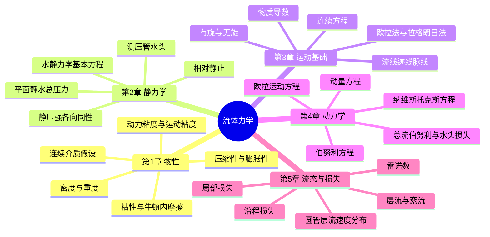
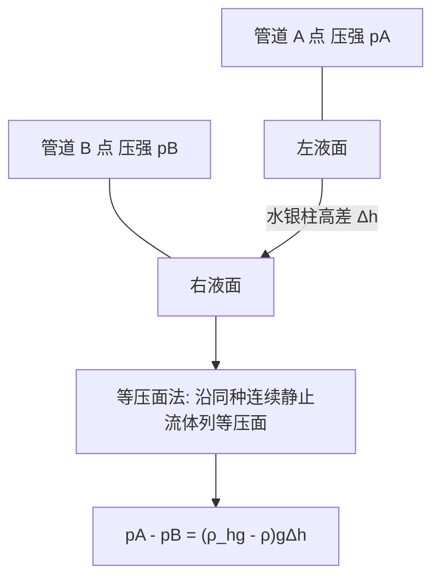
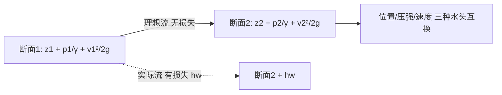
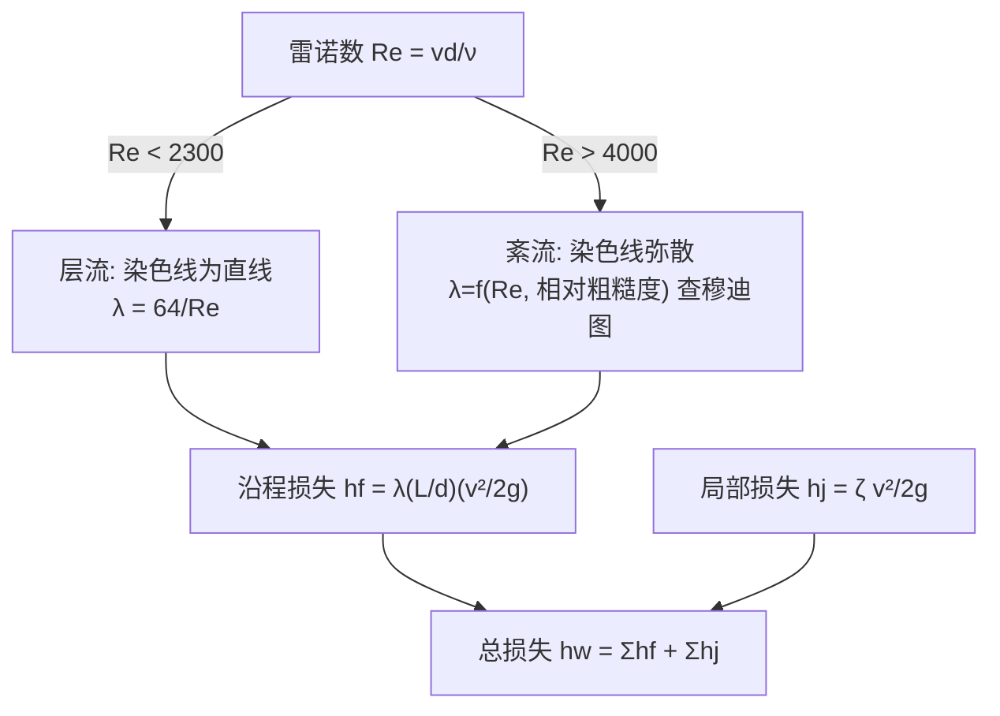

# 流体力学 · 核心例题精解 · 图示深化

> 本篇为**深化层**：在「综合复习资料」的概念与公式之上，逐章给出**典型例题 + 完整解题步骤 + 最终答案**，并配**思维导图 / 原理示意图**（mermaid 矢量图，非纯文字）。
> 解题遵循"先判类型 → 列控制方程 → 代入边界 → 得数与校核"四步。

---

## 全课知识结构 · 思维导图

---

## 第 1 章 · 流体及其主要物理性质

### 原理示意 · 牛顿内摩擦

### 例题 1-1（粘性·平行平板）

**题**：两平行平板间距 $h=2\ \text{mm}$，充满动力粘度 $\mu=0.8\ \mathrm{Pa\cdot s}$ 的油。上板以 $U=1.5\ \text{m/s}$ 匀速平移，下板固定，板面积 $A=0.5\ \text{m}^2$。求维持上板运动所需的力 $F$。

**解**：
1. 类型：粘性切应力（牛顿内摩擦定律），平板间速度近似线性分布。
2. 速度梯度 $\dfrac{du}{dy}=\dfrac{U}{h}=\dfrac{1.5}{0.002}=750\ \text{s}^{-1}$。
3. 切应力 $\tau=\mu\dfrac{du}{dy}=0.8\times 750=600\ \text{Pa}$。
4. 所需力 $F=\tau A=600\times 0.5=300\ \text{N}$。

$$\boxed{F=\mu\,\frac{U}{h}\,A=300\ \text{N}}$$

### 例题 1-2（运动粘度·单位换算）

**题**：某液体密度 $\rho=850\ \text{kg/m}^3$，运动粘度 $\nu=4\times10^{-5}\ \text{m}^2/\text{s}$。求其动力粘度 $\mu$。

**解**：由 $\nu=\dfrac{\mu}{\rho}\Rightarrow \mu=\rho\nu=850\times4\times10^{-5}=0.034\ \mathrm{Pa\cdot s}$。

$$\boxed{\mu=\rho\nu=3.4\times10^{-2}\ \mathrm{Pa\cdot s}}$$

> 校核：$1\ \mathrm{Pa\cdot s}=1\ \mathrm{kg/(m\cdot s)}$，$\mathrm{kg/m^3}\times\mathrm{m^2/s}=\mathrm{kg/(m\cdot s)}$ ✓

### 例题 1-3（体积弹性模量）

**题**：水的体积弹性模量 $K=2.1\times10^{9}\ \text{Pa}$。压强升高 $\Delta p=5\ \text{MPa}$ 时，体积相对变化 $\Delta V/V$ 为多少？

**解**：由 $K=-\dfrac{\Delta p}{\Delta V/V}\Rightarrow \dfrac{\Delta V}{V}=-\dfrac{\Delta p}{K}=-\dfrac{5\times10^{6}}{2.1\times10^{9}}\approx-2.4\times10^{-3}$。

$$\boxed{\Delta V/V\approx-0.24\%}$$ 说明水可近似视为不可压缩。

---

## 第 2 章 · 流体静力学

### 原理示意 · U 形压差计

### 例题 2-1（水静力学基本方程）

**题**：开口水箱中，水面下 $h=3.5\ \text{m}$ 处的相对压强（表压）为多少？($\rho=1000\ \text{kg/m}^3$, $g=9.8\ \text{m/s}^2$)

**解**：相对压强 $p=\rho g h=1000\times9.8\times3.5=34300\ \text{Pa}$。

$$\boxed{p=\rho g h=34.3\ \text{kPa}}$$

### 例题 2-2（平面静水总压力 + 压力中心）

**题**：竖直矩形闸门宽 $b=2\ \text{m}$、高 $a=3\ \text{m}$，顶边与水面齐平。求作用于闸门的静水总压力 $P$ 及压力中心位置 $y_D$。

**解**：
1. 形心淹深 $h_c=y_c=\dfrac{a}{2}=1.5\ \text{m}$，面积 $A=ab=6\ \text{m}^2$。
2. 总压力 $P=\rho g h_c A=1000\times9.8\times1.5\times6=88200\ \text{N}=88.2\ \text{kN}$。
3. 矩形对形心轴惯性矩 $I_c=\dfrac{b a^3}{12}=\dfrac{2\times3^3}{12}=4.5\ \text{m}^4$。
4. 压力中心 $y_D=y_c+\dfrac{I_c}{y_c A}=1.5+\dfrac{4.5}{1.5\times6}=1.5+0.5=2.0\ \text{m}$。

$$\boxed{P=88.2\ \text{kN},\quad y_D=2.0\ \text{m}\ (\text{距水面，位于形心之下})}$$

### 例题 2-3（U 形水银压差计）

**题**：水管中 A、B 两点接 U 形水银压差计，水银面高差 $\Delta h=0.25\ \text{m}$。水 $\rho=1000$、水银 $\rho_{Hg}=13600\ \text{kg/m}^3$。求 $p_A-p_B$（两测点等高）。

**解**：沿等压面法，$p_A-p_B=(\rho_{Hg}-\rho)g\Delta h=(13600-1000)\times9.8\times0.25=30870\ \text{Pa}$。

$$\boxed{p_A-p_B\approx30.9\ \text{kPa}}$$

---

## 第 3 章 · 流体运动基础

### 例题 3-1（由速度场求加速度）

**题**：定常流速度场 $u=2x$, $v=-2y$（单位 SI）。求点 $(1,1)$ 处的加速度。

**解**：定常流 $\partial/\partial t=0$，只有迁移加速度。
$$a_x=u\frac{\partial u}{\partial x}+v\frac{\partial u}{\partial y}=2x\cdot2+(-2y)\cdot0=4x$$
$$a_y=u\frac{\partial v}{\partial x}+v\frac{\partial v}{\partial y}=0+(-2y)(-2)=4y$$
在 $(1,1)$：$a_x=4$, $a_y=4\ \text{m/s}^2$，合加速度 $|a|=\sqrt{4^2+4^2}=4\sqrt2\approx5.66\ \text{m/s}^2$。

$$\boxed{a=(4,4)\ \text{m/s}^2,\ |a|\approx5.66\ \text{m/s}^2}$$

### 例题 3-2（连续方程判定）

**题**：不可压缩流动 $u=3x$, $v=ay$。求常数 $a$ 使流动满足连续性。

**解**：不可压缩连续方程 $\dfrac{\partial u}{\partial x}+\dfrac{\partial v}{\partial y}=0\Rightarrow 3+a=0\Rightarrow a=-3$。

$$\boxed{a=-3}$$

### 例题 3-3（有旋/无旋判别）

**题**：判断 $u=2y$, $v=0$ 的流动是否有旋。

**解**：$\omega_z=\dfrac12\left(\dfrac{\partial v}{\partial x}-\dfrac{\partial u}{\partial y}\right)=\dfrac12(0-2)=-1\neq0$，**有旋流**（简单剪切流动含旋转）。

$$\boxed{\omega_z=-1\ \text{rad/s}\neq0\Rightarrow\text{有旋}}$$

---

## 第 4 章 · 流体动力学基础

### 原理示意 · 伯努利能量守恒

### 例题 4-1（文丘里 / 伯努利 + 连续）

**题**：水平文丘里管，进口直径 $d_1=0.1\ \text{m}$、喉部 $d_2=0.05\ \text{m}$。进口流速 $v_1=2\ \text{m/s}$。求进口与喉部的压强差 $p_1-p_2$（理想流）。

**解**：
1. 连续方程：$v_2=v_1\left(\dfrac{d_1}{d_2}\right)^2=2\times(2)^2=8\ \text{m/s}$。
2. 水平管 $z_1=z_2$，伯努利：$\dfrac{p_1-p_2}{\rho}=\dfrac{v_2^2-v_1^2}{2}=\dfrac{8^2-2^2}{2}=30\ \text{J/kg}$。
3. $p_1-p_2=\rho\times30=1000\times30=30000\ \text{Pa}$。

$$\boxed{p_1-p_2=\tfrac12\rho(v_2^2-v_1^2)=30\ \text{kPa}}$$

### 例题 4-2（托里拆利·孔口出流）

**题**：水箱液面距小孔中心 $H=1.8\ \text{m}$，求理想出流速度 $v$。

**解**：自由液面与孔口处均为大气压，伯努利化简得 $v=\sqrt{2gH}=\sqrt{2\times9.8\times1.8}=\sqrt{35.28}\approx5.94\ \text{m/s}$。

$$\boxed{v=\sqrt{2gH}\approx5.94\ \text{m/s}}$$

### 例题 4-3（动量方程·弯管受力）

**题**：水平 $90^\circ$ 弯管，管径不变，流量 $Q=0.02\ \text{m}^3/\text{s}$，管内流速 $v=4\ \text{m/s}$，表压近似为 0（仅求动量项）。求水流对弯管的合力大小（取 $\beta=1$）。

**解**：
1. 进口动量沿 $x$：$\dot M_x=\rho Q v=1000\times0.02\times4=80\ \text{N}$。
2. 出口动量沿 $y$，大小同为 $80\ \text{N}$。
3. 对管的作用力与流体受力反向，合力 $R=\sqrt{(\rho Qv)^2+(\rho Qv)^2}=80\sqrt2\approx113\ \text{N}$。

$$\boxed{R=\sqrt2\,\rho Q v\approx113\ \text{N},\ \text{方向沿弯管角平分线指向外侧}}$$

---

## 第 5 章 · 层流、紊流及其能量损失

### 原理示意 · 流态判别与损失

### 例题 5-1（流态判别）

**题**：圆管 $d=0.05\ \text{m}$，水流速 $v=0.04\ \text{m/s}$，运动粘度 $\nu=1.0\times10^{-6}\ \text{m}^2/\text{s}$。判别流态。

**解**：$Re=\dfrac{vd}{\nu}=\dfrac{0.04\times0.05}{1.0\times10^{-6}}=2000<2300$，为**层流**。

$$\boxed{Re=2000<2300\Rightarrow\text{层流}}$$

### 例题 5-2（达西公式·沿程损失）

**题**：上例中管长 $L=20\ \text{m}$，求沿程水头损失 $h_f$。

**解**：
1. 层流 $\lambda=\dfrac{64}{Re}=\dfrac{64}{2000}=0.032$。
2. $h_f=\lambda\dfrac{L}{d}\dfrac{v^2}{2g}=0.032\times\dfrac{20}{0.05}\times\dfrac{0.04^2}{2\times9.8}$。
3. $=0.032\times400\times\dfrac{0.0016}{19.6}=12.8\times8.16\times10^{-5}\approx1.04\times10^{-3}\ \text{m}$。

$$\boxed{h_f\approx1.0\times10^{-3}\ \text{m}=1.0\ \text{mm 水柱}}$$

### 例题 5-3（圆管层流·最大与平均流速）

**题**：圆管层流速度分布 $u=u_{max}\left[1-(r/R)^2\right]$。证明平均流速 $v=\tfrac12 u_{max}$，并由上题 $v=0.04$ 求 $u_{max}$。

**解**：
$$v=\frac{1}{\pi R^2}\int_0^R u_{max}\Big[1-\frac{r^2}{R^2}\Big]2\pi r\,dr=\frac{2u_{max}}{R^2}\int_0^R\Big(r-\frac{r^3}{R^2}\Big)dr=\frac{2u_{max}}{R^2}\Big(\frac{R^2}{2}-\frac{R^2}{4}\Big)=\frac{u_{max}}{2}$$
故 $u_{max}=2v=2\times0.04=0.08\ \text{m/s}$。

$$\boxed{v=\tfrac12u_{max},\quad u_{max}=0.08\ \text{m/s}}$$

---

> **正言若反**：例题不离公式，公式不离概念，概念不离原始 PDF 之图。本篇为"用得上"的一层；遇疑，回归「综合复习资料」与各章素材。
