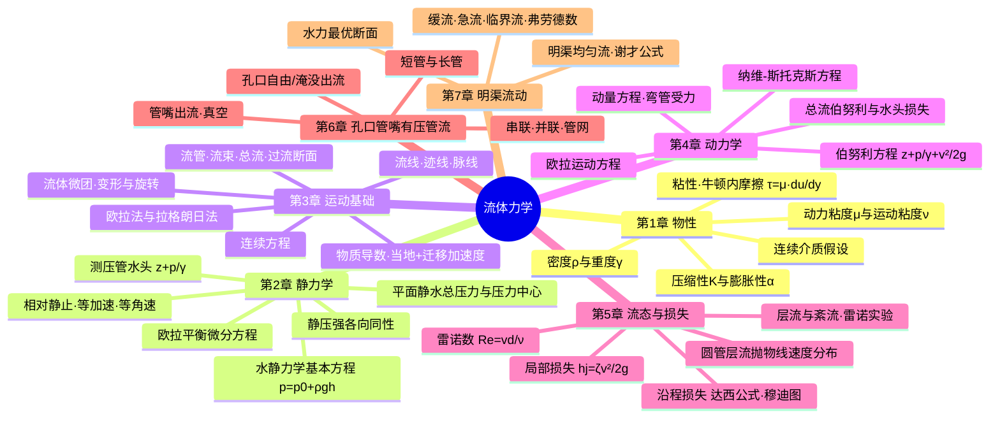
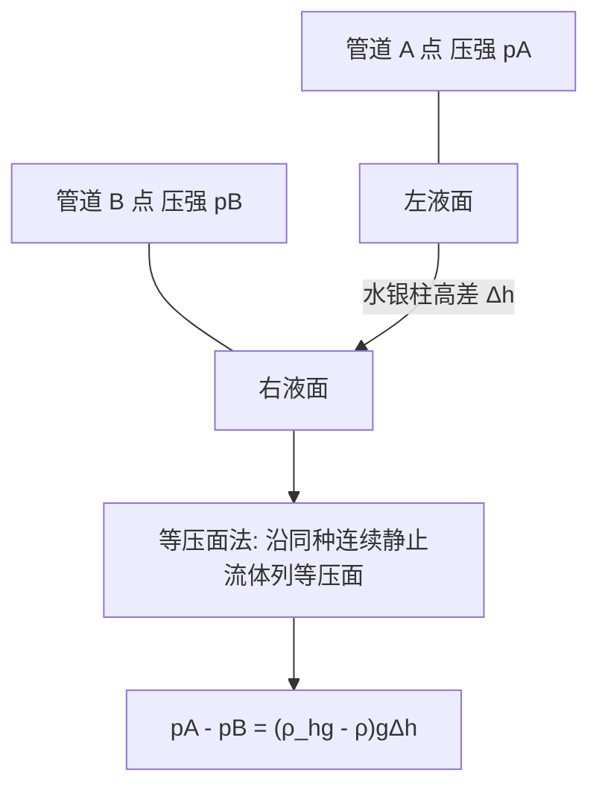
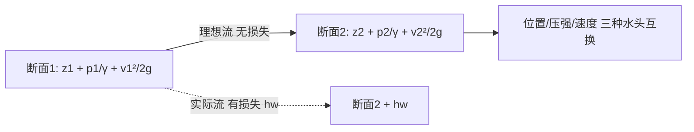
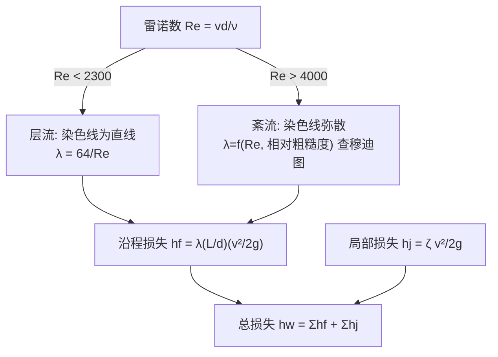
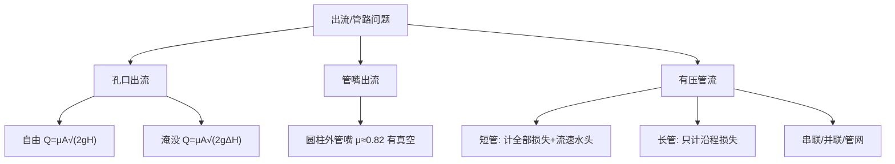

# 流体力学 · 核心例题精解 · 图文深化（PDF 原页直插 · 大幅扩充版）

> 本篇为**深化层**：在「综合复习资料」的概念与公式之上，**逐章直插课件 PDF 的核心原页**（真实截图），做到**图文结合**——左有原理图、右有公式与例题，遇疑即可回归原图。
> 解题遵循"**先判类型 → 列控制方程 → 代入边界 → 得数与校核**"四步。
> 覆盖全 7 章：① 物性 ② 静力学 ③ 运动基础 ④ 动力学 ⑤ 层流紊流与损失 ⑥ 孔口管嘴有压管流 ⑦ 明渠流动。
>
> *图片取自课件原页（教师 曾强 · 2026 春）；如某图未加载，会显示占位符 ▤，可在「原始课件 · 页图」分组查原页。*

---

## 全课知识结构 · 思维导图

### 符号 · 单位速查表

| 量 | 符号 | SI 单位 | 关键关系 |
|---|---|---|---|
| 密度 | $\rho$ | $\mathrm{kg/m^3}$ | 水 $\approx1000$ |
| 重度 | $\gamma$ | $\mathrm{N/m^3}$ | $\gamma=\rho g$，水 $\approx9.8\times10^3$ |
| 动力粘度 | $\mu$ | $\mathrm{Pa\cdot s}$ | $\tau=\mu\,du/dy$ |
| 运动粘度 | $\nu$ | $\mathrm{m^2/s}$ | $\nu=\mu/\rho$ |
| 压强 | $p$ | $\mathrm{Pa}$ | $1\ \mathrm{atm}=101.3\ \mathrm{kPa}=10.33\ \mathrm{mH_2O}$ |
| 体积弹性模量 | $K$ | $\mathrm{Pa}$ | $K=-\Delta p/(\Delta V/V)$ |
| 流量 | $Q$ | $\mathrm{m^3/s}$ | $Q=vA$ |
| 雷诺数 | $Re$ | 无量纲 | $Re=vd/\nu$ |
| 弗劳德数 | $Fr$ | 无量纲 | $Fr=v/\sqrt{gh}$ |

---

## 第 1 章 · 流体及其主要物理性质

### 核心 PDF 原页（图文结合）

*▲ 原页 · 连续介质假设：把流体看成连续充满空间、无空隙的介质，物理量（ρ、p、v）成为空间与时间的连续函数——这是全部场论分析的前提。*

*▲ 原页 · 密度定义 $\rho=\lim_{\Delta V\to\Delta V'}\Delta m/\Delta V$ 与水的密度随温度变化（4 ℃ 时最大）。*

*▲ 原页 · 牛顿内摩擦定律：平行平板间流体被上板带动，速度沿法向线性分布 $u=Uy/h$，切应力 $\tau=\mu\,du/dy$。* 例题 1-1 即据此页。

*▲ 原页 · 牛顿流体 vs 非牛顿流体的 $\tau\sim du/dy$ 流变曲线，及粘度随温度的变化（液体降温升、气体升温升）。*

*▲ 原页 · 压缩性：体积弹性模量 $K$ 的定义与水的近似不可压缩性。* 例题 1-3 即据此页。

### 核心公式速记

- 重度 $\gamma=\rho g$；运动粘度 $\nu=\mu/\rho$。
- 牛顿内摩擦定律 $\tau=\mu\dfrac{du}{dy}$，拉力 $F=\tau A=\mu\dfrac{U}{h}A$。
- 体积弹性模量 $K=-\dfrac{\Delta p}{\Delta V/V}=\rho\dfrac{dp}{d\rho}$；体积膨胀系数 $\alpha_V=\dfrac{1}{V}\dfrac{\partial V}{\partial T}$。

### 原理示意 · 牛顿内摩擦

### 例题 1-1（粘性·平行平板）

**题**：两平行平板间距 $h=2\ \text{mm}$，充满动力粘度 $\mu=0.8\ \mathrm{Pa\cdot s}$ 的油。上板以 $U=1.5\ \text{m/s}$ 匀速平移，下板固定，板面积 $A=0.5\ \text{m}^2$。求维持上板运动所需的力 $F$。

**解**：
1. 类型：粘性切应力（牛顿内摩擦定律），平板间速度近似线性分布。
2. 速度梯度 $\dfrac{du}{dy}=\dfrac{U}{h}=\dfrac{1.5}{0.002}=750\ \text{s}^{-1}$。
3. 切应力 $\tau=\mu\dfrac{du}{dy}=0.8\times 750=600\ \text{Pa}$。
4. 所需力 $F=\tau A=600\times 0.5=300\ \text{N}$。

$$\boxed{F=\mu\,\frac{U}{h}\,A=300\ \text{N}}$$

### 例题 1-2（运动粘度·单位换算）

**题**：某液体密度 $\rho=850\ \text{kg/m}^3$，运动粘度 $\nu=4\times10^{-5}\ \text{m}^2/\text{s}$。求其动力粘度 $\mu$。

**解**：由 $\nu=\dfrac{\mu}{\rho}\Rightarrow \mu=\rho\nu=850\times4\times10^{-5}=0.034\ \mathrm{Pa\cdot s}$。

$$\boxed{\mu=\rho\nu=3.4\times10^{-2}\ \mathrm{Pa\cdot s}}$$

> 校核：$1\ \mathrm{Pa\cdot s}=1\ \mathrm{kg/(m\cdot s)}$，$\mathrm{kg/m^3}\times\mathrm{m^2/s}=\mathrm{kg/(m\cdot s)}$ ✓

### 例题 1-3（体积弹性模量）

**题**：水的体积弹性模量 $K=2.1\times10^{9}\ \text{Pa}$。压强升高 $\Delta p=5\ \text{MPa}$ 时，体积相对变化 $\Delta V/V$ 为多少？

**解**：由 $K=-\dfrac{\Delta p}{\Delta V/V}\Rightarrow \dfrac{\Delta V}{V}=-\dfrac{\Delta p}{K}=-\dfrac{5\times10^{6}}{2.1\times10^{9}}\approx-2.4\times10^{-3}$。

$$\boxed{\Delta V/V\approx-0.24\%}$$ 说明水可近似视为不可压缩。

### 例题 1-4（圆筒间隙·旋转粘性力矩）★ 新增

**题**：内圆筒半径 $r=0.1\ \text{m}$、高 $L=0.2\ \text{m}$，与外筒间隙 $\delta=1\ \text{mm}$ 充满 $\mu=0.1\ \mathrm{Pa\cdot s}$ 的油。内筒以角速度 $\omega=10\ \text{rad/s}$ 旋转。求所需扭矩 $M$（间隙小，速度线性分布）。

**解**：
1. 筒壁线速度 $U=\omega r=10\times0.1=1\ \text{m/s}$，间隙内 $du/dy\approx U/\delta=1/0.001=1000\ \text{s}^{-1}$。
2. 切应力 $\tau=\mu\,du/dy=0.1\times1000=100\ \text{Pa}$。
3. 侧面积 $A=2\pi r L=2\pi\times0.1\times0.2=0.1257\ \text{m}^2$，切向力 $F=\tau A=12.57\ \text{N}$。
4. 扭矩 $M=F\cdot r=12.57\times0.1=1.26\ \text{N\cdot m}$。

$$\boxed{M=\mu\frac{\omega r}{\delta}\,(2\pi r L)\,r\approx1.26\ \text{N·m}}$$

### 易错点 · 第 1 章

- **动力粘度 $\mu$ 与运动粘度 $\nu$ 勿混**：$\nu=\mu/\rho$，单位 $\mathrm{m^2/s}$。
- 牛顿内摩擦 $\tau$ 与**速度梯度**成正比，与速度本身无关；与压强无关。
- 液体粘度随温度**升高而降低**，气体相反。

---

## 第 2 章 · 流体静力学

### 核心 PDF 原页（图文结合）

*▲ 原页 · 静压强特性：取微元四面体证明任一点静压强「各向同性」（$p_x=p_y=p_z=p_n$），与作用面方位无关。*

*▲ 原页 · 静止流体平衡微分方程（欧拉平衡方程）$\dfrac{1}{\rho}\nabla p=\vec f$ 的微元推导。*

*▲ 原页 · 测压管水头 $z+p/\gamma=\text{const}$ 的几何意义（位置水头+压强水头）与能量意义（单位重量流体的势能）。*

*▲ 原页 · U 形管测压计/压差计：用等压面法沿同种连续静止流体列方程。* 例题 2-3 即据此页。

*▲ 原页 · 平面静水总压力 $P=\rho g h_c A$ 与压力中心 $y_D=y_c+I_c/(y_c A)$（含形心惯性矩 $I_c$）。* 例题 2-2 即据此页。

*▲ 原页 · 相对静止：等角速度旋转容器，自由液面为「旋转抛物面」，等压面随之弯曲。*

### 核心公式速记

- 水静力学基本方程 $p=p_0+\rho g h$；测压管水头 $z+\dfrac{p}{\gamma}=\text{const}$。
- 等压面法（U 形管）：沿同种连续静止流体，同高度处压强相等。
- 平面总压力 $P=\rho g h_c A=p_c A$；压力中心 $y_D=y_c+\dfrac{I_c}{y_c A}$（矩形 $I_c=\dfrac{ba^3}{12}$）。
- 等加速直线运动等压面斜率 $\tan\theta=-a/g$；等角速旋转 $z=\dfrac{\omega^2 r^2}{2g}+\text{C}$。

### 原理示意 · U 形压差计

### 例题 2-1（水静力学基本方程）

**题**：开口水箱中，水面下 $h=3.5\ \text{m}$ 处的相对压强（表压）为多少？($\rho=1000\ \text{kg/m}^3$, $g=9.8\ \text{m/s}^2$)

**解**：相对压强 $p=\rho g h=1000\times9.8\times3.5=34300\ \text{Pa}$。

$$\boxed{p=\rho g h=34.3\ \text{kPa}}$$

### 例题 2-2（平面静水总压力 + 压力中心）

**题**：竖直矩形闸门宽 $b=2\ \text{m}$、高 $a=3\ \text{m}$，顶边与水面齐平。求作用于闸门的静水总压力 $P$ 及压力中心位置 $y_D$。

**解**：
1. 形心淹深 $h_c=y_c=\dfrac{a}{2}=1.5\ \text{m}$，面积 $A=ab=6\ \text{m}^2$。
2. 总压力 $P=\rho g h_c A=1000\times9.8\times1.5\times6=88200\ \text{N}=88.2\ \text{kN}$。
3. 矩形对形心轴惯性矩 $I_c=\dfrac{b a^3}{12}=\dfrac{2\times3^3}{12}=4.5\ \text{m}^4$。
4. 压力中心 $y_D=y_c+\dfrac{I_c}{y_c A}=1.5+\dfrac{4.5}{1.5\times6}=1.5+0.5=2.0\ \text{m}$。

$$\boxed{P=88.2\ \text{kN},\quad y_D=2.0\ \text{m}\ (\text{距水面，位于形心之下})}$$

### 例题 2-3（U 形水银压差计）

**题**：水管中 A、B 两点接 U 形水银压差计，水银面高差 $\Delta h=0.25\ \text{m}$。水 $\rho=1000$、水银 $\rho_{Hg}=13600\ \text{kg/m}^3$。求 $p_A-p_B$（两测点等高）。

**解**：沿等压面法，$p_A-p_B=(\rho_{Hg}-\rho)g\Delta h=(13600-1000)\times9.8\times0.25=30870\ \text{Pa}$。

$$\boxed{p_A-p_B\approx30.9\ \text{kPa}}$$

### 例题 2-4（等加速直线运动·自由液面）★ 新增

**题**：盛水敞口容器以水平加速度 $a=2.45\ \text{m/s}^2$ 向右运动。求自由液面与水平面的夹角 $\theta$。

**解**：相对静止时质量力为重力 $g$ 与惯性力 $-a$ 的合力，自由液面垂直于合力，故 $\tan\theta=\dfrac{a}{g}=\dfrac{2.45}{9.8}=0.25$。

$$\boxed{\theta=\arctan(a/g)=\arctan0.25\approx14.0^\circ}$$

### 易错点 · 第 2 章

- 总压力用**形心淹深** $h_c$ 算大小，但作用点（压力中心）在形心**之下** $y_D>y_c$。
- U 形管必须找**同种、连续、静止**流体的等压面才能跨接。
- 表压 = 绝对压 − 大气压；真空度 = 大气压 − 绝对压。

---

## 第 3 章 · 流体运动基础

### 核心 PDF 原页（图文结合）

*▲ 原页 · 流线/迹线/脉线的可视化（含 CFD 渲染）：流线是某瞬时处处与速度相切的曲线。*

*▲ 原页 · 流线一般不相交（驻点、奇点除外），不能突然转折；流线密集处流速大。*

*▲ 原页 · 流管/流束/总流/过流断面概念，及流量 $Q=\int_A u\,dA=vA$ 与断面平均流速 $v$。*

*▲ 原页 · 流体微团的平移、线变形、角变形与旋转——亥姆霍兹速度分解。*

*▲ 原页 · 连续性方程的微元控制体推导：不可压缩流 $\nabla\cdot\vec v=0$。* 例题 3-2 即据此页。

### 核心公式速记

- 物质导数 $\dfrac{D\phi}{Dt}=\underbrace{\dfrac{\partial\phi}{\partial t}}_{\text{当地}}+\underbrace{(\vec v\cdot\nabla)\phi}_{\text{迁移}}$。
- 加速度 $a_x=\dfrac{\partial u}{\partial t}+u\dfrac{\partial u}{\partial x}+v\dfrac{\partial u}{\partial y}+w\dfrac{\partial u}{\partial z}$。
- 不可压缩连续方程 $\dfrac{\partial u}{\partial x}+\dfrac{\partial v}{\partial y}+\dfrac{\partial w}{\partial z}=0$；总流连续 $v_1A_1=v_2A_2$。
- 涡量 $\omega_z=\dfrac12\left(\dfrac{\partial v}{\partial x}-\dfrac{\partial u}{\partial y}\right)$；$\omega=0$ 为无旋流。

### 例题 3-1（由速度场求加速度）

**题**：定常流速度场 $u=2x$, $v=-2y$（单位 SI）。求点 $(1,1)$ 处的加速度。

**解**：定常流 $\partial/\partial t=0$，只有迁移加速度。
$$a_x=u\frac{\partial u}{\partial x}+v\frac{\partial u}{\partial y}=2x\cdot2+(-2y)\cdot0=4x$$
$$a_y=u\frac{\partial v}{\partial x}+v\frac{\partial v}{\partial y}=0+(-2y)(-2)=4y$$
在 $(1,1)$：$a_x=4$, $a_y=4\ \text{m/s}^2$，合加速度 $|a|=\sqrt{4^2+4^2}=4\sqrt2\approx5.66\ \text{m/s}^2$。

$$\boxed{a=(4,4)\ \text{m/s}^2,\ |a|\approx5.66\ \text{m/s}^2}$$

### 例题 3-2（连续方程判定）

**题**：不可压缩流动 $u=3x$, $v=ay$。求常数 $a$ 使流动满足连续性。

**解**：不可压缩连续方程 $\dfrac{\partial u}{\partial x}+\dfrac{\partial v}{\partial y}=0\Rightarrow 3+a=0\Rightarrow a=-3$。

$$\boxed{a=-3}$$

### 例题 3-3（有旋/无旋判别）

**题**：判断 $u=2y$, $v=0$ 的流动是否有旋。

**解**：$\omega_z=\dfrac12\left(\dfrac{\partial v}{\partial x}-\dfrac{\partial u}{\partial y}\right)=\dfrac12(0-2)=-1\neq0$，**有旋流**（简单剪切流动含旋转）。

$$\boxed{\omega_z=-1\ \text{rad/s}\neq0\Rightarrow\text{有旋}}$$

### 例题 3-4（总流连续方程·变径管）★ 新增

**题**：管道由 $d_1=0.2\ \text{m}$ 渐缩到 $d_2=0.1\ \text{m}$，进口流速 $v_1=1.5\ \text{m/s}$。求出口流速 $v_2$ 与流量 $Q$。

**解**：
1. 连续方程 $v_1A_1=v_2A_2\Rightarrow v_2=v_1\left(\dfrac{d_1}{d_2}\right)^2=1.5\times(2)^2=6\ \text{m/s}$。
2. 流量 $Q=v_1A_1=1.5\times\dfrac{\pi}{4}(0.2)^2=1.5\times0.0314=0.0471\ \text{m}^3/\text{s}$。

$$\boxed{v_2=6\ \text{m/s},\quad Q\approx47.1\ \text{L/s}}$$

### 易错点 · 第 3 章

- **流线**（同一瞬时各点切线）≠ **迹线**（同一质点轨迹）；定常流时二者重合。
- 加速度含**当地 + 迁移**两项，定常流当地项为零但迁移项不一定为零。
- 连续方程对不可压缩定常流恒成立，与是否有粘性无关。

---

## 第 4 章 · 流体动力学基础

### 核心 PDF 原页（图文结合）

*▲ 原页 · 理想流体欧拉运动方程：微元体受质量力与压强合力，$\vec f-\dfrac1\rho\nabla p=\dfrac{D\vec v}{Dt}$。*

*▲ 原页 · 沿流线伯努利方程 $z+\dfrac{p}{\gamma}+\dfrac{v^2}{2g}=\text{const}$，三种水头（位置/压强/速度）互换的能量意义。*

*▲ 原页 · 总流伯努利方程：在**渐变流**断面间列 $z_1+\dfrac{p_1}{\gamma}+\dfrac{\alpha_1 v_1^2}{2g}=z_2+\dfrac{p_2}{\gamma}+\dfrac{\alpha_2 v_2^2}{2g}+h_w$。*

*▲ 原页 · 伯努利方程应用：皮托管测点速、文丘里管/孔板测流量。*

*▲ 原页 · 总流动量方程 $\sum\vec F=\rho Q(\beta_2\vec v_2-\beta_1\vec v_1)$，用于求弯管、喷嘴等的受力。* 例题 4-3 即据此页。

*▲ 原页 · 实际（粘性）流体的纳维-斯托克斯方程 $\rho\dfrac{D\vec v}{Dt}=\rho\vec f-\nabla p+\mu\nabla^2\vec v$。*

### 核心公式速记

- 理想流伯努利（沿流线）$z+\dfrac{p}{\gamma}+\dfrac{v^2}{2g}=\text{const}$。
- 实际总流伯努利 $z_1+\dfrac{p_1}{\gamma}+\dfrac{\alpha_1 v_1^2}{2g}=z_2+\dfrac{p_2}{\gamma}+\dfrac{\alpha_2 v_2^2}{2g}+h_w$。
- 托里拆利孔口出流 $v=\sqrt{2gH}$；皮托管 $v=\sqrt{2g\Delta h}$。
- 总流动量方程 $\sum\vec F=\rho Q(\beta_2\vec v_2-\beta_1\vec v_1)$。

### 原理示意 · 伯努利能量守恒

### 例题 4-1（文丘里 / 伯努利 + 连续）

**题**：水平文丘里管，进口直径 $d_1=0.1\ \text{m}$、喉部 $d_2=0.05\ \text{m}$。进口流速 $v_1=2\ \text{m/s}$。求进口与喉部的压强差 $p_1-p_2$（理想流）。

**解**：
1. 连续方程：$v_2=v_1\left(\dfrac{d_1}{d_2}\right)^2=2\times(2)^2=8\ \text{m/s}$。
2. 水平管 $z_1=z_2$，伯努利：$\dfrac{p_1-p_2}{\rho}=\dfrac{v_2^2-v_1^2}{2}=\dfrac{8^2-2^2}{2}=30\ \text{J/kg}$。
3. $p_1-p_2=\rho\times30=1000\times30=30000\ \text{Pa}$。

$$\boxed{p_1-p_2=\tfrac12\rho(v_2^2-v_1^2)=30\ \text{kPa}}$$

### 例题 4-2（托里拆利·孔口出流）

**题**：水箱液面距小孔中心 $H=1.8\ \text{m}$，求理想出流速度 $v$。

**解**：自由液面与孔口处均为大气压，伯努利化简得 $v=\sqrt{2gH}=\sqrt{2\times9.8\times1.8}=\sqrt{35.28}\approx5.94\ \text{m/s}$。

$$\boxed{v=\sqrt{2gH}\approx5.94\ \text{m/s}}$$

### 例题 4-3（动量方程·弯管受力）

**题**：水平 $90^\circ$ 弯管，管径不变，流量 $Q=0.02\ \text{m}^3/\text{s}$，管内流速 $v=4\ \text{m/s}$，表压近似为 0（仅求动量项）。求水流对弯管的合力大小（取 $\beta=1$）。

**解**：
1. 进口动量沿 $x$：$\dot M_x=\rho Q v=1000\times0.02\times4=80\ \text{N}$。
2. 出口动量沿 $y$，大小同为 $80\ \text{N}$。
3. 对管的作用力与流体受力反向，合力 $R=\sqrt{(\rho Qv)^2+(\rho Qv)^2}=80\sqrt2\approx113\ \text{N}$。

$$\boxed{R=\sqrt2\,\rho Q v\approx113\ \text{N},\ \text{方向沿弯管角平分线指向外侧}}$$

### 例题 4-4（皮托管测流速）★ 新增

**题**：皮托管插入水流，测得驻点（全压）与静压的水柱高差 $\Delta h=0.20\ \text{m}$。求该点流速 $v$。

**解**：由驻点伯努利 $\dfrac{p_s-p}{\gamma}=\dfrac{v^2}{2g}=\Delta h\Rightarrow v=\sqrt{2g\Delta h}=\sqrt{2\times9.8\times0.20}=\sqrt{3.92}\approx1.98\ \text{m/s}$。

$$\boxed{v=\sqrt{2g\Delta h}\approx1.98\ \text{m/s}}$$

### 易错点 · 第 4 章

- 伯努利方程要求**沿同一流线 / 渐变流断面、不可压缩、定常**；实际流别忘加水头损失 $h_w$。
- 动量方程是**矢量式**，先定坐标正向，受力含压力、重力、约束反力。
- 动能修正系数 $\alpha$（层流 2、紊流≈1）、动量修正系数 $\beta$ 勿混。

---

## 第 5 章 · 层流、紊流及其能量损失

### 核心 PDF 原页（图文结合）

*▲ 原页 · 雷诺实验装置：染色线在层流时为直线、紊流时弥散，揭示流态由 $Re$ 判别。*

*▲ 原页 · 圆管层流的**抛物线**速度分布 $u=u_{max}[1-(r/R)^2]$，平均流速 $v=\tfrac12 u_{max}$。* 例题 5-3 即据此页。

*▲ 原页 · 穆迪图（Moody chart）：沿程阻力系数 $\lambda=f(Re,\ \varepsilon/d)$ 的查图工具，紊流区据此取 $\lambda$。*

*▲ 原页 · 局部损失：突然扩大/缩小、弯头、阀门等处 $h_j=\zeta\dfrac{v^2}{2g}$，突扩波达公式 $h_j=\dfrac{(v_1-v_2)^2}{2g}$。*

### 核心公式速记

- 雷诺数 $Re=\dfrac{vd}{\nu}$：圆管 $Re<2300$ 层流，$Re>4000$ 紊流。
- 沿程损失（达西-魏斯巴赫）$h_f=\lambda\dfrac{L}{d}\dfrac{v^2}{2g}$；层流 $\lambda=\dfrac{64}{Re}$。
- 局部损失 $h_j=\zeta\dfrac{v^2}{2g}$；总损失 $h_w=\sum h_f+\sum h_j$。
- 圆管层流 $u=u_{max}[1-(r/R)^2]$，$v=\tfrac12 u_{max}$，$\alpha=2$。

### 原理示意 · 流态判别与损失

### 例题 5-1（流态判别）

**题**：圆管 $d=0.05\ \text{m}$，水流速 $v=0.04\ \text{m/s}$，运动粘度 $\nu=1.0\times10^{-6}\ \text{m}^2/\text{s}$。判别流态。

**解**：$Re=\dfrac{vd}{\nu}=\dfrac{0.04\times0.05}{1.0\times10^{-6}}=2000<2300$，为**层流**。

$$\boxed{Re=2000<2300\Rightarrow\text{层流}}$$

### 例题 5-2（达西公式·沿程损失）

**题**：上例中管长 $L=20\ \text{m}$，求沿程水头损失 $h_f$。

**解**：
1. 层流 $\lambda=\dfrac{64}{Re}=\dfrac{64}{2000}=0.032$。
2. $h_f=\lambda\dfrac{L}{d}\dfrac{v^2}{2g}=0.032\times\dfrac{20}{0.05}\times\dfrac{0.04^2}{2\times9.8}$。
3. $=0.032\times400\times\dfrac{0.0016}{19.6}=12.8\times8.16\times10^{-5}\approx1.04\times10^{-3}\ \text{m}$。

$$\boxed{h_f\approx1.0\times10^{-3}\ \text{m}=1.0\ \text{mm 水柱}}$$

### 例题 5-3（圆管层流·最大与平均流速）

**题**：圆管层流速度分布 $u=u_{max}\left[1-(r/R)^2\right]$。证明平均流速 $v=\tfrac12 u_{max}$，并由上题 $v=0.04$ 求 $u_{max}$。

**解**：
$$v=\frac{1}{\pi R^2}\int_0^R u_{max}\Big[1-\frac{r^2}{R^2}\Big]2\pi r\,dr=\frac{2u_{max}}{R^2}\int_0^R\Big(r-\frac{r^3}{R^2}\Big)dr=\frac{2u_{max}}{R^2}\Big(\frac{R^2}{2}-\frac{R^2}{4}\Big)=\frac{u_{max}}{2}$$
故 $u_{max}=2v=2\times0.04=0.08\ \text{m/s}$。

$$\boxed{v=\tfrac12u_{max},\quad u_{max}=0.08\ \text{m/s}}$$

### 例题 5-4（局部损失·突然扩大）★ 新增

**题**：水管由 $v_1=3\ \text{m/s}$ 突然扩大到 $v_2=1.2\ \text{m/s}$。求突扩局部水头损失 $h_j$（波达公式）。

**解**：$h_j=\dfrac{(v_1-v_2)^2}{2g}=\dfrac{(3-1.2)^2}{2\times9.8}=\dfrac{1.8^2}{19.6}=\dfrac{3.24}{19.6}\approx0.165\ \text{m}$。

$$\boxed{h_j=\frac{(v_1-v_2)^2}{2g}\approx0.17\ \text{m 水柱}}$$

### 易错点 · 第 5 章

- 判别流态用**圆管临界 $Re_c\approx2300$**；非圆管用水力半径 $R=A/\chi$，$Re=vR/\nu$（临界约 500）。
- 层流 $\lambda=64/Re$ 仅适用层流；紊流必须查**穆迪图**或经验公式。
- 沿程损失沿管长**均匀累积**，局部损失集中在断面突变处。

---

## 第 6 章 · 孔口、管嘴出流与有压管流 ★ 新增整章

### 核心 PDF 原页（图文结合）

*▲ 原页 · 孔口出流分类：自由出流（出流入大气）与淹没出流（出流入下游液体），收缩断面与流速系数 $\varphi$、流量系数 $\mu$。*

*▲ 原页 · 圆柱形、收缩形、扩张形等管嘴出流类型及其流量系数差异（圆柱外伸管嘴因真空增大流量）。*

*▲ 原页 · 串联管道（流量相同、损失叠加）与并联管道（损失相同、流量分配）的水力计算。*

*▲ 原页 · 枝状管网与环状管网概述：节点流量平衡、环路水头平衡。*

### 核心公式速记

- 孔口自由出流 $Q=\mu A\sqrt{2gH}$（$\mu$ 流量系数，薄壁圆孔约 0.62）。
- 孔口淹没出流 $Q=\mu A\sqrt{2g\Delta H}$（$\Delta H$ 为上下游水位差）。
- 圆柱形外管嘴 $Q=\mu_n A\sqrt{2gH}$，$\mu_n\approx0.82>\mu_{\text{孔口}}$。
- 长管（忽略局部与流速水头）$H=h_f=\lambda\dfrac{L}{d}\dfrac{v^2}{2g}$；短管需计全部损失与流速水头。

### 原理示意 · 出流与管路类型

### 例题 6-1（薄壁孔口自由出流）

**题**：水箱壁上薄壁圆孔，面积 $A=20\ \text{cm}^2$，孔心淹深 $H=2\ \text{m}$，流量系数 $\mu=0.62$。求出流流量 $Q$。

**解**：
1. $A=20\ \text{cm}^2=2\times10^{-3}\ \text{m}^2$，$\sqrt{2gH}=\sqrt{2\times9.8\times2}=\sqrt{39.2}=6.26\ \text{m/s}$。
2. $Q=\mu A\sqrt{2gH}=0.62\times2\times10^{-3}\times6.26=7.76\times10^{-3}\ \text{m}^3/\text{s}$。

$$\boxed{Q=\mu A\sqrt{2gH}\approx7.8\ \text{L/s}}$$

### 例题 6-2（长管沿程损失·定水头出流）

**题**：长直管道 $L=500\ \text{m}$、$d=0.2\ \text{m}$、$\lambda=0.025$，上下游水位差 $H=10\ \text{m}$（按长管，忽略局部损失与流速水头）。求管中流速 $v$ 与流量 $Q$。

**解**：
1. 长管 $H=\lambda\dfrac{L}{d}\dfrac{v^2}{2g}\Rightarrow v=\sqrt{\dfrac{2gH}{\lambda L/d}}=\sqrt{\dfrac{2\times9.8\times10}{0.025\times500/0.2}}$。
2. $\lambda L/d=0.025\times2500=62.5$；$v=\sqrt{\dfrac{196}{62.5}}=\sqrt{3.136}\approx1.77\ \text{m/s}$。
3. $Q=vA=1.77\times\dfrac{\pi}{4}(0.2)^2=1.77\times0.0314\approx0.0556\ \text{m}^3/\text{s}$。

$$\boxed{v\approx1.77\ \text{m/s},\quad Q\approx55.6\ \text{L/s}}$$

### 易错点 · 第 6 章

- 自由出流用淹深 $H$，淹没出流用上下游**水位差** $\Delta H$。
- 短管 vs 长管：长管忽略局部损失与流速水头，短管全计。
- 并联管段**水头损失相等**，总流量为各段之和；串联管段**流量相等**，损失叠加。

---

## 第 7 章 · 明渠流动 ★ 新增整章

### 核心 PDF 原页（图文结合）

*▲ 原页 · 明渠（有自由表面、靠重力驱动）的棱柱体渠道断面：矩形、梯形等，水面宽 $B$、过流面积 $A$、湿周 $\chi$、水力半径 $R=A/\chi$。*

*▲ 原页 · 明渠均匀流基本公式——谢才公式 $v=C\sqrt{Ri}$，$Q=AC\sqrt{Ri}$，谢才系数 $C=\dfrac{1}{n}R^{1/6}$（曼宁）。*

*▲ 原页 · 水力最优断面：过流面积一定时湿周最小（水力半径最大）→ 输水能力最大；梯形最优 $\beta=2(\sqrt{1+m^2}-m)$。*

*▲ 原页 · 明渠流态：缓流/急流/临界流由弗劳德数 $Fr=v/\sqrt{gh}$ 判别（$Fr<1$ 缓流，$>1$ 急流）。*

### 核心公式速记

- 水力半径 $R=\dfrac{A}{\chi}$（$\chi$ 湿周）。
- 谢才公式 $v=C\sqrt{Ri}$，流量 $Q=AC\sqrt{Ri}$；曼宁 $C=\dfrac{1}{n}R^{1/6}$。
- 弗劳德数 $Fr=\dfrac{v}{\sqrt{gh}}$：$Fr<1$ 缓流、$Fr=1$ 临界流、$Fr>1$ 急流。

### 例题 7-1（矩形明渠·谢才公式求流量）

**题**：矩形渠宽 $b=2\ \text{m}$、水深 $h=1\ \text{m}$、底坡 $i=0.0004$、粗糙系数 $n=0.025$。求流量 $Q$。

**解**：
1. 过流面积 $A=bh=2\times1=2\ \text{m}^2$，湿周 $\chi=b+2h=2+2=4\ \text{m}$，水力半径 $R=A/\chi=2/4=0.5\ \text{m}$。
2. 谢才系数 $C=\dfrac{1}{n}R^{1/6}=\dfrac{1}{0.025}\times0.5^{1/6}=40\times0.891=35.6\ \text{m}^{1/2}/\text{s}$。
3. $v=C\sqrt{Ri}=35.6\times\sqrt{0.5\times0.0004}=35.6\times\sqrt{2\times10^{-4}}=35.6\times0.01414=0.503\ \text{m/s}$。
4. $Q=vA=0.503\times2=1.01\ \text{m}^3/\text{s}$。

$$\boxed{Q=AC\sqrt{Ri}\approx1.0\ \text{m}^3/\text{s}}$$

### 例题 7-2（流态判别·弗劳德数）

**题**：上例渠中 $v=0.503\ \text{m/s}$、$h=1\ \text{m}$。判别流态。

**解**：$Fr=\dfrac{v}{\sqrt{gh}}=\dfrac{0.503}{\sqrt{9.8\times1}}=\dfrac{0.503}{3.13}=0.161<1$，为**缓流**。

$$\boxed{Fr\approx0.16<1\Rightarrow\text{缓流}}$$

### 易错点 · 第 7 章

- 明渠**有自由表面**、靠重力驱动；有压管流无自由表面、靠压差驱动。
- 水力半径 $R=A/\chi$，湿周只算**与水接触**的周界（不含自由水面）。
- 弗劳德数判别缓急流：缓流受下游控制，急流受上游控制。

---

## 期末综合大题 · 串联多章

**题**：水从大水箱经一段长管流入大气。水箱水面距管道出口高差 $H=8\ \text{m}$，管长 $L=50\ \text{m}$、$d=0.1\ \text{m}$、$\lambda=0.03$，进口局部损失系数 $\zeta_1=0.5$、出口 $\zeta_2=1.0$。求管中流速 $v$ 与流量 $Q$。

**解**（伯努利 + 损失，断面取水面 1 与出口 2）：
1. 列总流伯努利：$H=\dfrac{v^2}{2g}+h_w$，其中出口动能 $\dfrac{v^2}{2g}$、$h_w=\left(\lambda\dfrac{L}{d}+\zeta_1+\zeta_2\right)\dfrac{v^2}{2g}$。
   （注：出口 $\zeta_2=1.0$ 项即代表出口动能损失，故合并写）
2. $H=\left(\lambda\dfrac{L}{d}+\zeta_1+1.0\right)\dfrac{v^2}{2g}$。
3. $\lambda\dfrac{L}{d}=0.03\times\dfrac{50}{0.1}=15$；系数和 $=15+0.5+1.0=16.5$。
4. $v=\sqrt{\dfrac{2gH}{16.5}}=\sqrt{\dfrac{2\times9.8\times8}{16.5}}=\sqrt{\dfrac{156.8}{16.5}}=\sqrt{9.50}\approx3.08\ \text{m/s}$。
5. $Q=vA=3.08\times\dfrac{\pi}{4}(0.1)^2=3.08\times7.85\times10^{-3}\approx0.0242\ \text{m}^3/\text{s}$。

$$\boxed{v\approx3.08\ \text{m/s},\quad Q\approx24.2\ \text{L/s}}$$

---

## 期末速记口诀

- **物性**：粘度看梯度（$\tau=\mu\,du/dy$），运动粘度除密度（$\nu=\mu/\rho$）。
- **静力**：压强各向同，形心算总压，压心在下方。
- **运动**：流线切速度，连续 $vA$ 守，加速分当地与迁移。
- **动力**：能量伯努利（三水头），受力动量定理（矢量），实际别忘水头损失。
- **损失**：先算 $Re$ 判流态，沿程达西查穆迪，局部 $\zeta\,v^2/2g$。
- **管流**：自由淹深、淹没水位差；长管只沿程、短管全都算。
- **明渠**：谢才 $C\sqrt{Ri}$，最优湿周小，缓急看 $Fr$。

---

> **正言若反**：例题不离公式，公式不离概念，概念不离原始 PDF 之图。本篇为"用得上"的一层；图已直插，遇疑回归「原始课件 · 页图」与各章素材、综合复习资料。
