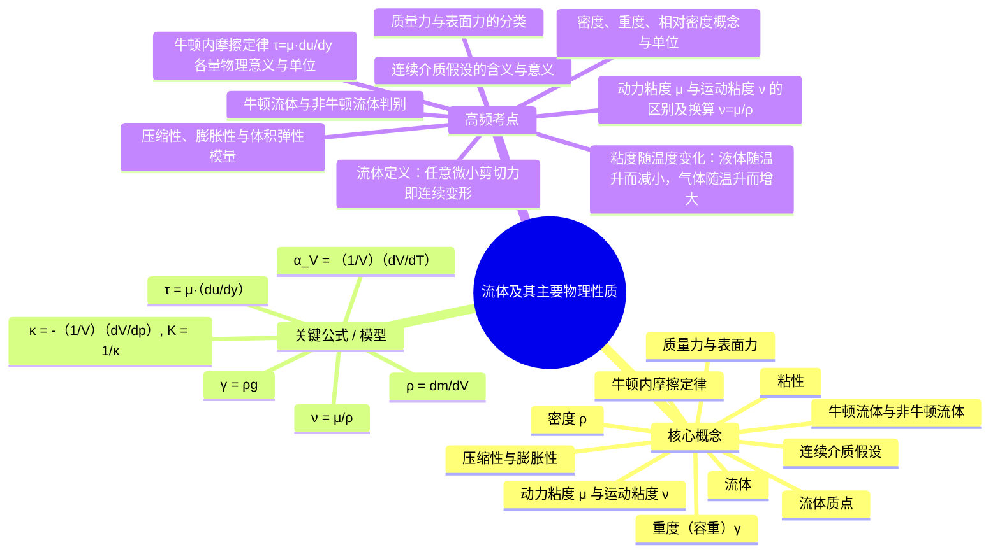
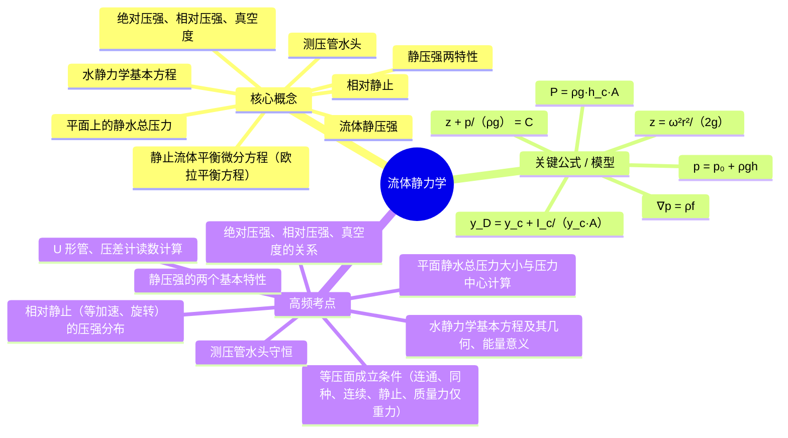
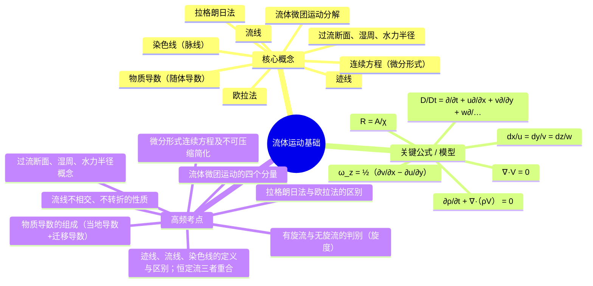
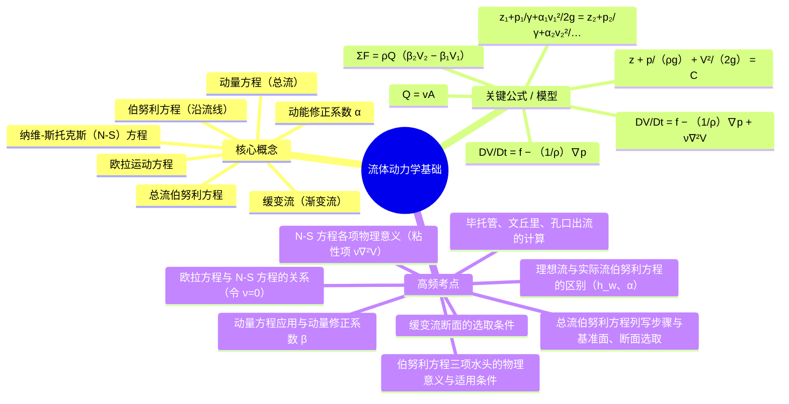
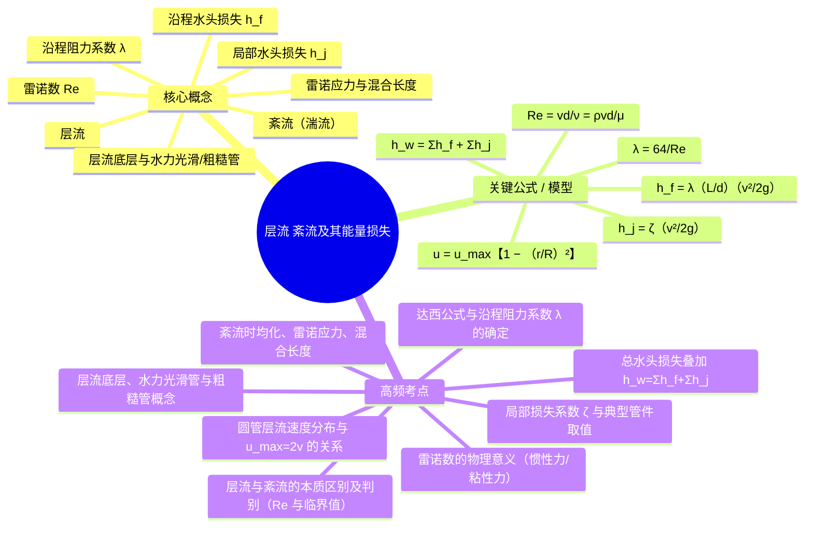

# 流体力学 · 期末复习全集（整合一炉）

> 教师: 曾强 · 学期: 2026春
> 完成度：复习要点 **5/5** 章 · 思维导图 **5/5** 章 · 自测 **89** 项（含思考题）· 速记卡 **43** 张 · 模拟卷 **23** 题
> 学习法（Dunlosky 2013）：**提取练习** g≈0.50–0.63、**间隔重复** g≈0.48–0.68 为最高效；故本集先精要、后闭卷自测、再间隔速记。
> 用法：① 读总纲定节律 → ② 通读分章精要建图谱 → ③ 闭卷做自测题库与模拟卷（先答后展开对照）→ ④ 速记卡按 1/3/7/14 天间隔复习 → ⑤ 临考扫速查。
> 溯源：图文/原图/全文 OCR 见同目录 [`_综合复习资料.md`](./_综合复习资料.md)。

---

## 〇 · 备考总纲（节律与路径）

> 教师：曾强 · 学期：2026春
> 生成于 2026-06-12 · 目标考试日 **2026-07-03**（共 21 天）
> 章数：5 · 已填要点：5 章

> *为学者日益，闻道者日损。* —— 复习非求多读，而求记牢；记牢之法，已有实证。

---

### 一 · 复习之道（实证为据）

> 据 Dunlosky et al. 2013（《Psychological Science in the Public Interest》）与 Carpenter, Pan & Butler 2022（《Nature Reviews Psychology》）：

| 技法 | 效用 | 怎么做 |
|---|---|---|
| **提取练习**（自测/默写） | **高** | 合上书，先答 `自测题库.md`，再对照——别只重读 |
| **间隔重复**（分散练习） | **高** | 按下方日历，隔日/隔周回提取，别考前突击一次 |
| 交错练习 | 中 | 按下方“交错刷题序”混章做题，别一章刷到底 |
| 自我解释 / 追问“为什么” | 中 | 每个考点问自己“为什么成立、与上一章何关” |
| 双重编码（图像） | 中 | 看/画每章思维导图，文字配图记 |
| 高亮 · 重读 · 摘抄 | **低** | 感觉努力实则低效，不作为主手段 |

### 二 · 三段备考（先懂 → 后测 → 终模考）

- **一轮·通读理解**（2026-06-12 → 2026-06-22 · 11 天）：逐章通读图文 + 画/看思维导图，求懂而非背
- **二轮·提取自测**（2026-06-23 → 2026-06-29 · 7 天）：闭卷做自测题与填空卡，错题标记
- **三轮·模考查漏**（2026-06-30 → 2026-07-03 · 4 天）：限时模拟卷 + 错点专项 + 易错点重背

### 三 · 间隔重复日历（首学 + 1/3/7/14 天回提取）

| 日期 | 当日任务 |
|---|---|
| 2026-06-12 | 📖 首学：第 1 章 流体及其主要物理性质 |
| 2026-06-13 | 🔁 提取复习：第 1 章 流体及其主要物理性质 |
| 2026-06-14 | 📖 首学：第 2 章 流体静力学 |
| 2026-06-15 | 🔁 提取复习：第 1 章 流体及其主要物理性质<br>🔁 提取复习：第 2 章 流体静力学 |
| 2026-06-16 | 📖 首学：第 3 章 流体运动基础 |
| 2026-06-17 | 🔁 提取复习：第 2 章 流体静力学<br>🔁 提取复习：第 3 章 流体运动基础 |
| 2026-06-18 | 📖 首学：第 4 章 流体动力学基础 |
| 2026-06-19 | 🔁 提取复习：第 1 章 流体及其主要物理性质<br>🔁 提取复习：第 3 章 流体运动基础<br>🔁 提取复习：第 4 章 流体动力学基础 |
| 2026-06-20 | 📖 首学：第 5 章 层流、紊流及其能量损失 |
| 2026-06-21 | 🔁 提取复习：第 2 章 流体静力学<br>🔁 提取复习：第 4 章 流体动力学基础<br>🔁 提取复习：第 5 章 层流、紊流及其能量损失 |
| 2026-06-23 | 🔁 提取复习：第 3 章 流体运动基础<br>🔁 提取复习：第 5 章 层流、紊流及其能量损失 |
| 2026-06-25 | 🔁 提取复习：第 4 章 流体动力学基础 |
| 2026-06-26 | 🔁 提取复习：第 1 章 流体及其主要物理性质 |
| 2026-06-27 | 🔁 提取复习：第 5 章 层流、紊流及其能量损失 |
| 2026-06-28 | 🔁 提取复习：第 2 章 流体静力学 |
| 2026-06-30 | 🔁 提取复习：第 3 章 流体运动基础 |
| 2026-07-02 | 🔁 提取复习：第 4 章 流体动力学基础<br>🔁 提取复习：第 5 章 层流、紊流及其能量损失 |

> 📖 = 首次学习（求懂）；🔁 = 闭卷提取复习（求牢）。错过某日，顺延即可，勿弃。

### 四 · 交错刷题序（三轮 · 混章不连刷）

1. 第 1 章 流体及其主要物理性质 → 第 2 章 流体静力学 → 第 3 章 流体运动基础 → 第 4 章 流体动力学基础 → 第 5 章 层流、紊流及其能量损失
2. 第 2 章 流体静力学 → 第 3 章 流体运动基础 → 第 4 章 流体动力学基础 → 第 5 章 层流、紊流及其能量损失 → 第 1 章 流体及其主要物理性质
3. 第 3 章 流体运动基础 → 第 4 章 流体动力学基础 → 第 5 章 层流、紊流及其能量损失 → 第 1 章 流体及其主要物理性质 → 第 2 章 流体静力学

### 五 · 每日提取清单（贴在桌前）

- [ ] 今日“首学”章：通读图文 + 看思维导图（求懂）
- [ ] 今日“回提取”章：**闭卷**做 `自测题库.md` 对应题，再对照订正
- [ ] 过一遍 `速记卡.md`（答不出的标记，明日优先）
- [ ] 把每个考点用“一句话”向自己解释“为什么”（自我解释）

### 六 · 元认知自查（别被“熟悉感”骗了）

> *知不知，尚矣；不知不知，病矣。*

- “读过了”≠“答得出”。判断标准只有一个：**合上书能否复述/默写**。
- 越是“看着眼熟”的内容越危险——优先去**自测**它，而非重读它。
- 每轮自测后，把答错/卡壳的章节，提前到下一日的“回提取”。

### 七 · 配套材料

- `自测题库.md` —— 闭卷提取题（按章 · 答案默藏）
- `速记卡.md` —— 填空卡（适合碎片时间 + 间隔重复）
- `../_素材/_综合复习资料.md` —— 图文 + 思维导图全本
- `../_素材/_期末速查.md` —— 一页速查表

---

## 一 · 期末速查（考前一张表）

> 一页之表，含各章关键概念、公式、考点。已吸纳 5/5 章复习要点。

| 章 | 标题 | 核心概念（≤3） | 关键公式 / 模型 | 高频考点 |
| ---: | ---- | -------------- | ---------------- | -------- |
| 1 | 流体及其主要物理性质 | 流体：在任意微小剪切力作用下都会连续变形（流动）的物质，是气体与液体的统称。  *（要：静止流体不能承受剪切力，只能承受压力）*；连续介质假设：把流体看作由无数流体质点连续、无间隙地充满所占空间的介质，使各物理量成为时空的连续函数。  *（要：宏观处理微观，是流体力学的建模基础）*；流体质点：宏观上足够小、微观上仍含大量分子的流体微团。  *（要：连续介质的基本单元）* |  | 流体定义：任意微小剪切力即连续变形；连续介质假设的含义与意义；牛顿内摩擦定律 τ=μ·du/dy 各量物理意义与单位 |
| 2 | 流体静力学 | 流体静压强：静止流体中单位面积上所受的法向压力，方向沿作用面内法线。  *（要：静止时只有压应力）*；静压强两特性：①方向垂直并指向受压面；②同一点上各方向压强大小相等（各向同性）。  *（要：考试常考的两条基本性质）*；静止流体平衡微分方程（欧拉平衡方程）：单位质量流体所受质量力与压强梯度平衡：f=(1/ρ)∇p。  *（要：静力学的普遍方程）* |  | 静压强的两个基本特性；水静力学基本方程及其几何、能量意义；绝对压强、相对压强、真空度的关系 |
| 3 | 流体运动基础 | 拉格朗日法：跟踪每个流体质点，以其初始位置为标识描述其运动轨迹与物理量随时间变化。  *（要：着眼质点）*；欧拉法：着眼空间固定点，描述流场各点物理量随时空的变化（场的方法）。  *（要：工程上最常用）*；迹线：单个流体质点在一段时间内运动的轨迹线。  *（要：拉格朗日观点）* |  | 拉格朗日法与欧拉法的区别；迹线、流线、染色线的定义与区别；恒定流三者重合；流线不相交、不转折的性质 |
| 4 | 流体动力学基础 | 欧拉运动方程：理想流体（无粘）的动力学微分方程：DV/Dt=f−(1/ρ)∇p。  *（要：忽略粘性）*；伯努利方程（沿流线）：理想不可压缩定常流沿流线 z+p/(ρg)+V²/(2g)=C。  *（要：三项为位置、压强、速度水头，机械能守恒）*；缓变流（渐变流）：流线近乎平行、曲率与夹角很小的流动，过流断面上压强近似按静压分布。  *（要：选断面的前提）* |  | 伯努利方程三项水头的物理意义与适用条件；理想流与实际流伯努利方程的区别（h_w、α）；总流伯努利方程列写步骤与基准面、断面选取 |
| 5 | 层流、紊流及其能量损失 | 层流：流体分层有序流动、各层互不掺混的流态，发生在雷诺数较小时。  *（要：雷诺实验中染色线为直线）*；紊流（湍流）：流体质点存在不规则脉动、相互剧烈掺混的流态，发生在雷诺数较大时。  *（要：染色线弥散）*；雷诺数 Re：Re=ρvd/μ=vd/ν，惯性力与粘性力之比，用于判别流态。  *（要：圆管下临界 Re≈2300）* |  | 层流与紊流的本质区别及判别（Re 与临界值）；雷诺数的物理意义（惯性力/粘性力）；达西公式与沿程阻力系数 λ 的确定 |

### 易错速记（错过即列）

| # | 易错点 | 正确表述 | 出处（章·页） |
| --: | ------ | -------- | ------------ |
| 1 |  |  |  |
| 2 |  |  |  |
| 3 |  |  |  |
| 4 |  |  |  |
| 5 |  |  |  |
| 6 |  |  |  |
| 7 |  |  |  |
| 8 |  |  |  |
| 9 |  |  |  |
| 10 |  |  |  |

### 名词速对（≤30）

| 术语 | 释义 | 章 |
| ---- | ---- | ---: |
| 流体 | 在任意微小剪切力作用下都会连续变形（流动）的物质，是气体与液体的统称。  *（要：静止流体不能承受剪切力，只能承受压力）* | 1 |
| 连续介质假设 | 把流体看作由无数流体质点连续、无间隙地充满所占空间的介质，使各物理量成为时空的连续函数。  *（要：宏观处理微观，是流体力学的建模基础）* | 1 |
| 流体质点 | 宏观上足够小、微观上仍含大量分子的流体微团。  *（要：连续介质的基本单元）* | 1 |
| 流体静压强 | 静止流体中单位面积上所受的法向压力，方向沿作用面内法线。  *（要：静止时只有压应力）* | 2 |
| 静压强两特性 | ①方向垂直并指向受压面；②同一点上各方向压强大小相等（各向同性）。  *（要：考试常考的两条基本性质）* | 2 |
| 静止流体平衡微分方程（欧拉平衡方程） | 单位质量流体所受质量力与压强梯度平衡：f=(1/ρ)∇p。  *（要：静力学的普遍方程）* | 2 |
| 拉格朗日法 | 跟踪每个流体质点，以其初始位置为标识描述其运动轨迹与物理量随时间变化。  *（要：着眼质点）* | 3 |
| 欧拉法 | 着眼空间固定点，描述流场各点物理量随时空的变化（场的方法）。  *（要：工程上最常用）* | 3 |
| 迹线 | 单个流体质点在一段时间内运动的轨迹线。  *（要：拉格朗日观点）* | 3 |
| 欧拉运动方程 | 理想流体（无粘）的动力学微分方程：DV/Dt=f−(1/ρ)∇p。  *（要：忽略粘性）* | 4 |
| 伯努利方程（沿流线） | 理想不可压缩定常流沿流线 z+p/(ρg)+V²/(2g)=C。  *（要：三项为位置、压强、速度水头，机械能守恒）* | 4 |
| 缓变流（渐变流） | 流线近乎平行、曲率与夹角很小的流动，过流断面上压强近似按静压分布。  *（要：选断面的前提）* | 4 |
| 层流 | 流体分层有序流动、各层互不掺混的流态，发生在雷诺数较小时。  *（要：雷诺实验中染色线为直线）* | 5 |
| 紊流（湍流） | 流体质点存在不规则脉动、相互剧烈掺混的流态，发生在雷诺数较大时。  *（要：染色线弥散）* | 5 |
| 雷诺数 Re | Re=ρvd/μ=vd/ν，惯性力与粘性力之比，用于判别流态。  *（要：圆管下临界 Re≈2300）* | 5 |

---

## 二 · 分章精要（要点 + 思维导图）

### 第 1 章 · 流体及其主要物理性质

> 素材：[_第01章_流体及其主要物理性质.md](./_第01章_流体及其主要物理性质.md) · 主版 63 页

#### 一、核心概念

- **流体**：在任意微小剪切力作用下都会连续变形（流动）的物质，是气体与液体的统称。  *（要：静止流体不能承受剪切力，只能承受压力）*
- **连续介质假设**：把流体看作由无数流体质点连续、无间隙地充满所占空间的介质，使各物理量成为时空的连续函数。  *（要：宏观处理微观，是流体力学的建模基础）*
- **流体质点**：宏观上足够小、微观上仍含大量分子的流体微团。  *（要：连续介质的基本单元）*
- **密度 ρ**：单位体积流体所具有的质量，ρ=dm/dV，单位 kg/m³。  *（要：水约 1000 kg/m³）*
- **重度（容重）γ**：单位体积流体所受的重力，γ=ρg，单位 N/m³。  *（要：与密度差一个 g）*
- **粘性**：流体内部相邻流层间产生内摩擦、阻碍相对运动的性质。  *（要：只有流体运动时才表现，静止时不显现）*
- **牛顿内摩擦定律**：切应力与速度梯度成正比：τ=μ·du/dy。  *（要：粘性流体切应力的本构关系）*
- **动力粘度 μ 与运动粘度 ν**：μ 反映流体粘性大小（Pa·s）；ν=μ/ρ 综合考虑惯性（m²/s）。  *（要：ν 用于雷诺数等运动学分析）*
- **牛顿流体与非牛顿流体**：切应力与速度梯度呈线性关系者为牛顿流体（如水、空气），否则为非牛顿流体。  *（要：判别看 τ~du/dy 是否线性过原点）*
- **压缩性与膨胀性**：压缩性：体积随压强增大而减小；膨胀性：体积随温度升高而增大。  *（要：液体常视为不可压缩）*
- **质量力与表面力**：质量力作用于流体全部质量（重力、惯性力）；表面力作用于流体表面（压力、切力）。  *（要：受力分析的两大类）*

#### 二、关键公式 / 模型

| 公式 | 含义 |
|------|------|
| `ρ = dm/dV` | 密度定义，单位 kg/m³ |
| `γ = ρg` | 重度（容重），单位 N/m³ |
| `τ = μ·(du/dy)` | 牛顿内摩擦定律，切应力正比于速度梯度 |
| `ν = μ/ρ` | 运动粘度，单位 m²/s |
| `κ = -(1/V)(dV/dp), K = 1/κ` | 体积压缩系数与体积弹性模量 |
| `α_V = (1/V)(dV/dT)` | 体积膨胀系数 |

#### 三、重要案例 / 例题

- 20℃ 时水的动力粘度 μ≈1.005×10⁻³ Pa·s，密度 ρ≈998 kg/m³。
- 平行平板间线性流动：du/dy=U/h，由牛顿内摩擦定律算切应力 τ=μU/h。
- 蜂蜜与水：粘度相差数千倍，直观说明粘性差异。

#### 四、高频考点（速记）

1. 流体定义：任意微小剪切力即连续变形
2. 连续介质假设的含义与意义
3. 牛顿内摩擦定律 τ=μ·du/dy 各量物理意义与单位
4. 动力粘度 μ 与运动粘度 ν 的区别及换算 ν=μ/ρ
5. 粘度随温度变化：液体随温升而减小，气体随温升而增大
6. 牛顿流体与非牛顿流体判别
7. 密度、重度、相对密度概念与单位
8. 压缩性、膨胀性与体积弹性模量
9. 质量力与表面力的分类

#### 五、思考题 / 自测

- **Q**：为什么说静止流体不能承受剪切力？
  **A**：静止流体中任何微小剪切力都会引起连续变形，故静止时切应力必为零，只能承受法向压应力。

- **Q**：动力粘度与运动粘度有何区别与联系？
  **A**：μ 直接反映流体粘性大小（Pa·s）；ν=μ/ρ 把密度（惯性）一并考虑（m²/s），常用于雷诺数等运动学分析。

- **Q**：为什么液体与气体的粘度随温度变化规律相反？
  **A**：液体粘性主要来自分子间引力，升温引力减弱故 μ 降低；气体粘性主要来自分子动量交换，升温热运动加剧故 μ 升高。


#### 六、与前后章之关联

- **承前**：全课起点，建立流体的连续介质模型与基本物性参数。
- **启后**：粘性是第 5 章沿程损失与第 4 章 N-S 方程之源；密度、压强为第 2 章静力学之基。

<details><summary>🧠 思维导图（markmap / mermaid）</summary>

### Markmap（Typora / markmap.js / Obsidian 可渲染）

```markmap
# 流体及其主要物理性质
## 核心概念
- 流体
- 连续介质假设
- 流体质点
- 密度 ρ
- 重度（容重）γ
- 粘性
- 牛顿内摩擦定律
- 动力粘度 μ 与运动粘度 ν
- 牛顿流体与非牛顿流体
- 压缩性与膨胀性
- 质量力与表面力
## 关键公式 / 模型
- ρ = dm/dV
- γ = ρg
- τ = μ·(du/dy)
- ν = μ/ρ
- κ = -(1/V)(dV/dp), K = 1/κ
- α_V = (1/V)(dV/dT)
## 高频考点
- 流体定义：任意微小剪切力即连续变形
- 连续介质假设的含义与意义
- 牛顿内摩擦定律 τ=μ·du/dy 各量物理意义与单位
- 动力粘度 μ 与运动粘度 ν 的区别及换算 ν=μ/ρ
- 粘度随温度变化：液体随温升而减小，气体随温升而增大
- 牛顿流体与非牛顿流体判别
- 密度、重度、相对密度概念与单位
- 压缩性、膨胀性与体积弹性模量
- 质量力与表面力的分类
```

### Mermaid（GitHub Markdown 可渲染）



</details>

---

### 第 2 章 · 流体静力学

> 素材：[_第02章_流体静力学.md](./_第02章_流体静力学.md) · 主版 41 页

#### 一、核心概念

- **流体静压强**：静止流体中单位面积上所受的法向压力，方向沿作用面内法线。  *（要：静止时只有压应力）*
- **静压强两特性**：①方向垂直并指向受压面；②同一点上各方向压强大小相等（各向同性）。  *（要：考试常考的两条基本性质）*
- **静止流体平衡微分方程（欧拉平衡方程）**：单位质量流体所受质量力与压强梯度平衡：f=(1/ρ)∇p。  *（要：静力学的普遍方程）*
- **水静力学基本方程**：重力场中 p=p₀+ρgh，压强随深度线性增加。  *（要：等压面为水平面）*
- **测压管水头**：z+p/(ρg)=常数，位置水头与压强水头之和守恒。  *（要：几何意义与能量意义）*
- **绝对压强、相对压强、真空度**：以绝对真空为零点为绝对压强；以当地大气压为零点为相对压强（表压）；相对压强为负时其绝对值为真空度。  *（要：p_abs=p_atm+p_相对）*
- **相对静止**：流体相对容器无相对运动但整体有加速度（等加速直线、等角速度旋转）。  *（要：需把惯性力计入质量力，等压面不再水平）*
- **平面上的静水总压力**：P=ρg·h_c·A，作用点（压力中心）位于形心之下。  *（要：y_D=y_c+I_c/(y_c·A)）*

#### 二、关键公式 / 模型

| 公式 | 含义 |
|------|------|
| `∇p = ρf` | 静止流体平衡微分方程（欧拉平衡方程） |
| `p = p₀ + ρgh` | 重力场水静力学基本方程 |
| `z + p/(ρg) = C` | 测压管水头守恒 |
| `P = ρg·h_c·A` | 作用在平面上的静水总压力，h_c 为形心淹深 |
| `y_D = y_c + I_c/(y_c·A)` | 压力中心位置，恒在形心之下 |
| `z = ω²r²/(2g)` | 等角速度旋转时自由液面（抛物面） |

#### 三、重要案例 / 例题

- U 形水银压差计测量管道两点压强差。
- 矩形闸门所受静水总压力大小及压力中心位置计算。
- 等角速度旋转容器内自由液面呈旋转抛物面。

#### 四、高频考点（速记）

1. 静压强的两个基本特性
2. 水静力学基本方程及其几何、能量意义
3. 绝对压强、相对压强、真空度的关系
4. 等压面成立条件（连通、同种、连续、静止、质量力仅重力）
5. 测压管水头守恒
6. 平面静水总压力大小与压力中心计算
7. 相对静止（等加速、旋转）的压强分布
8. U 形管、压差计读数计算

#### 五、思考题 / 自测

- **Q**：为什么静压强具有各向同性？
  **A**：对微元四面体作受力平衡分析，忽略高阶小量（质量力）后可证任一点各方向压强大小相等。

- **Q**：压力中心为何总在形心之下？
  **A**：压强随深度线性增大，下部受压更大使合力作用点下移，由 y_D=y_c+I_c/(y_c·A)>y_c 可知。

- **Q**：相对静止与绝对静止有何区别？
  **A**：相对静止时流体相对容器不动但整体有加速度，须把惯性力计入质量力，等压面不再水平（如旋转呈抛物面）。


#### 六、与前后章之关联

- **承前**：运用第 1 章密度、压强、质量力等概念。
- **启后**：压强概念贯穿第 4 章伯努利方程；平衡方程是第 4 章欧拉运动方程在静止时的特例。

<details><summary>🧠 思维导图（markmap / mermaid）</summary>

### Markmap（Typora / markmap.js / Obsidian 可渲染）

```markmap
# 流体静力学
## 核心概念
- 流体静压强
- 静压强两特性
- 静止流体平衡微分方程（欧拉平衡方程）
- 水静力学基本方程
- 测压管水头
- 绝对压强、相对压强、真空度
- 相对静止
- 平面上的静水总压力
## 关键公式 / 模型
- ∇p = ρf
- p = p₀ + ρgh
- z + p/(ρg) = C
- P = ρg·h_c·A
- y_D = y_c + I_c/(y_c·A)
- z = ω²r²/(2g)
## 高频考点
- 静压强的两个基本特性
- 水静力学基本方程及其几何、能量意义
- 绝对压强、相对压强、真空度的关系
- 等压面成立条件（连通、同种、连续、静止、质量力仅重力）
- 测压管水头守恒
- 平面静水总压力大小与压力中心计算
- 相对静止（等加速、旋转）的压强分布
- U 形管、压差计读数计算
```

### Mermaid（GitHub Markdown 可渲染）



</details>

---

### 第 3 章 · 流体运动基础

> 素材：[_第03章_流体运动基础.md](./_第03章_流体运动基础.md) · 主版 48 页

#### 一、核心概念

- **拉格朗日法**：跟踪每个流体质点，以其初始位置为标识描述其运动轨迹与物理量随时间变化。  *（要：着眼质点）*
- **欧拉法**：着眼空间固定点，描述流场各点物理量随时空的变化（场的方法）。  *（要：工程上最常用）*
- **迹线**：单个流体质点在一段时间内运动的轨迹线。  *（要：拉格朗日观点）*
- **流线**：某时刻流场中处处与速度矢量相切的曲线。  *（要：恒定流时迹线与流线重合，流线不相交、不转折）*
- **染色线（脉线）**：相继通过同一空间点的所有质点在某时刻连成的线。  *（要：实验观察用）*
- **过流断面、湿周、水力半径**：过流断面与流速垂直；湿周为断面上与流体接触的固壁周长；水力半径 R=A/χ。  *（要：总流几何参数）*
- **流体微团运动分解**：亥姆霍兹速度分解定理：微团运动=平移+旋转+线变形+角变形。  *（要：四种基本运动）*
- **物质导数（随体导数）**：D/Dt=∂/∂t+(V·∇)，含当地导数（时变）与迁移导数（位变）。  *（要：随质点运动的变化率）*
- **连续方程（微分形式）**：质量守恒：∂ρ/∂t+∇·(ρV)=0；不可压缩时 ∇·V=0。  *（要：任何流动都满足）*

#### 二、关键公式 / 模型

| 公式 | 含义 |
|------|------|
| `dx/u = dy/v = dz/w` | 流线微分方程 |
| `D/Dt = ∂/∂t + u∂/∂x + v∂/∂y + w∂/∂z` | 物质导数（当地+迁移） |
| `∂ρ/∂t + ∇·(ρV) = 0` | 微分形式连续方程 |
| `∇·V = 0` | 不可压缩流体连续方程 |
| `ω_z = ½(∂v/∂x − ∂u/∂y)` | 流体微团绕 z 轴的旋转角速度 |
| `R = A/χ` | 水力半径，A 过流面积，χ 湿周 |

#### 三、重要案例 / 例题

- 由给定速度场判别定常/非定常、均匀/非均匀流。
- 由速度场求加速度，分清当地加速度与迁移加速度。
- 计算旋度判别有旋流与无旋流。

#### 四、高频考点（速记）

1. 拉格朗日法与欧拉法的区别
2. 迹线、流线、染色线的定义与区别；恒定流三者重合
3. 流线不相交、不转折的性质
4. 物质导数的组成（当地导数+迁移导数）
5. 流体微团运动的四个分量
6. 有旋流与无旋流的判别（旋度）
7. 微分形式连续方程及不可压缩简化
8. 过流断面、湿周、水力半径概念

#### 五、思考题 / 自测

- **Q**：定常流中迁移加速度为何可不为零？
  **A**：定常流 ∂/∂t=0，但质点流经空间不同点速度仍可改变，(V·∇)V≠0，故有迁移加速度（如收缩管中加速）。

- **Q**：流线与迹线何时重合？
  **A**：在恒定（定常）流场中，流线形状不随时间变化，质点沿流线运动，二者重合。

- **Q**：如何判别流动是否有旋？
  **A**：计算速度场旋度 ∇×V，若处处为零则为无旋（有势）流，否则为有旋流。


#### 六、与前后章之关联

- **承前**：在第 1 章连续介质、第 2 章场概念基础上建立运动描述方法。
- **启后**：连续方程与运动学概念为第 4 章动力学方程（伯努利、动量、N-S）奠定基础。

<details><summary>🧠 思维导图（markmap / mermaid）</summary>

### Markmap（Typora / markmap.js / Obsidian 可渲染）

```markmap
# 流体运动基础
## 核心概念
- 拉格朗日法
- 欧拉法
- 迹线
- 流线
- 染色线（脉线）
- 过流断面、湿周、水力半径
- 流体微团运动分解
- 物质导数（随体导数）
- 连续方程（微分形式）
## 关键公式 / 模型
- dx/u = dy/v = dz/w
- D/Dt = ∂/∂t + u∂/∂x + v∂/∂y + w∂/∂z
- ∂ρ/∂t + ∇·(ρV) = 0
- ∇·V = 0
- ω_z = ½(∂v/∂x − ∂u/∂y)
- R = A/χ
## 高频考点
- 拉格朗日法与欧拉法的区别
- 迹线、流线、染色线的定义与区别；恒定流三者重合
- 流线不相交、不转折的性质
- 物质导数的组成（当地导数+迁移导数）
- 流体微团运动的四个分量
- 有旋流与无旋流的判别（旋度）
- 微分形式连续方程及不可压缩简化
- 过流断面、湿周、水力半径概念
```

### Mermaid（GitHub Markdown 可渲染）



</details>

---

### 第 4 章 · 流体动力学基础

> 素材：[_第04章_流体动力学基础.md](./_第04章_流体动力学基础.md) · 主版 56 页

#### 一、核心概念

- **欧拉运动方程**：理想流体（无粘）的动力学微分方程：DV/Dt=f−(1/ρ)∇p。  *（要：忽略粘性）*
- **伯努利方程（沿流线）**：理想不可压缩定常流沿流线 z+p/(ρg)+V²/(2g)=C。  *（要：三项为位置、压强、速度水头，机械能守恒）*
- **缓变流（渐变流）**：流线近乎平行、曲率与夹角很小的流动，过流断面上压强近似按静压分布。  *（要：选断面的前提）*
- **总流伯努利方程**：z₁+p₁/γ+α₁v₁²/2g = z₂+p₂/γ+α₂v₂²/2g + h_w。  *（要：含动能修正系数 α 与水头损失 h_w）*
- **动能修正系数 α**：用断面平均流速计算动能与真实动能之比的修正系数，α≥1。  *（要：层流 α=2，紊流 α≈1.05）*
- **动量方程（总流）**：ΣF=ρQ(β₂V₂−β₁V₁)，求流体对边界的作用力。  *（要：β 为动量修正系数）*
- **纳维-斯托克斯（N-S）方程**：粘性不可压缩流体运动方程：DV/Dt=f−(1/ρ)∇p+ν∇²V。  *（要：比欧拉方程多粘性项 ν∇²V）*

#### 二、关键公式 / 模型

| 公式 | 含义 |
|------|------|
| `DV/Dt = f − (1/ρ)∇p` | 理想流体欧拉运动方程 |
| `z + p/(ρg) + V²/(2g) = C` | 沿流线伯努利方程（理想流） |
| `z₁+p₁/γ+α₁v₁²/2g = z₂+p₂/γ+α₂v₂²/2g + h_w` | 总流伯努利方程（实际流） |
| `ΣF = ρQ(β₂V₂ − β₁V₁)` | 总流动量方程 |
| `DV/Dt = f − (1/ρ)∇p + ν∇²V` | 纳维-斯托克斯方程 |
| `Q = vA` | 流量连续关系 |

#### 三、重要案例 / 例题

- 文丘里流量计、毕托管测速：伯努利方程的典型应用。
- 孔口出流 v=√(2gH)（托里拆利公式）。
- 水流对弯管、喷嘴的冲击力：动量方程求解。

#### 四、高频考点（速记）

1. 伯努利方程三项水头的物理意义与适用条件
2. 理想流与实际流伯努利方程的区别（h_w、α）
3. 总流伯努利方程列写步骤与基准面、断面选取
4. 动量方程应用与动量修正系数 β
5. 缓变流断面的选取条件
6. 毕托管、文丘里、孔口出流的计算
7. N-S 方程各项物理意义（粘性项 ν∇²V）
8. 欧拉方程与 N-S 方程的关系（令 ν=0）

#### 五、思考题 / 自测

- **Q**：伯努利方程的适用条件有哪些？
  **A**：理想流体（或忽略粘性）、不可压缩、定常流动、沿同一流线（无旋时可推广到全流场）、质量力仅为重力。

- **Q**：总流伯努利方程为何要引入 α 与 h_w？
  **A**：实际断面流速分布不均，需用动能修正系数 α 修正动能项；粘性导致机械能沿程损失 h_w，故较理想方程多此两项。

- **Q**：动量方程与伯努利方程各解决什么问题？
  **A**：伯努利方程（能量）求压强与流速关系；动量方程求流体与边界间的作用力，二者常联立求解。


#### 六、与前后章之关联

- **承前**：运用第 3 章连续方程与物质导数；欧拉运动方程是第 2 章平衡方程的运动推广。
- **启后**：水头损失 h_w（沿程+局部）的计算在第 5 章展开；N-S 方程是粘性流动分析的基础。

<details><summary>🧠 思维导图（markmap / mermaid）</summary>

### Markmap（Typora / markmap.js / Obsidian 可渲染）

```markmap
# 流体动力学基础
## 核心概念
- 欧拉运动方程
- 伯努利方程（沿流线）
- 缓变流（渐变流）
- 总流伯努利方程
- 动能修正系数 α
- 动量方程（总流）
- 纳维-斯托克斯（N-S）方程
## 关键公式 / 模型
- DV/Dt = f − (1/ρ)∇p
- z + p/(ρg) + V²/(2g) = C
- z₁+p₁/γ+α₁v₁²/2g = z₂+p₂/γ+α₂v₂²/2g + h_w
- ΣF = ρQ(β₂V₂ − β₁V₁)
- DV/Dt = f − (1/ρ)∇p + ν∇²V
- Q = vA
## 高频考点
- 伯努利方程三项水头的物理意义与适用条件
- 理想流与实际流伯努利方程的区别（h_w、α）
- 总流伯努利方程列写步骤与基准面、断面选取
- 动量方程应用与动量修正系数 β
- 缓变流断面的选取条件
- 毕托管、文丘里、孔口出流的计算
- N-S 方程各项物理意义（粘性项 ν∇²V）
- 欧拉方程与 N-S 方程的关系（令 ν=0）
```

### Mermaid（GitHub Markdown 可渲染）



</details>

---

### 第 5 章 · 层流、紊流及其能量损失

> 素材：[_第05章_层流、紊流及其能量损失.md](./_第05章_层流、紊流及其能量损失.md) · 主版 42 页

#### 一、核心概念

- **层流**：流体分层有序流动、各层互不掺混的流态，发生在雷诺数较小时。  *（要：雷诺实验中染色线为直线）*
- **紊流（湍流）**：流体质点存在不规则脉动、相互剧烈掺混的流态，发生在雷诺数较大时。  *（要：染色线弥散）*
- **雷诺数 Re**：Re=ρvd/μ=vd/ν，惯性力与粘性力之比，用于判别流态。  *（要：圆管下临界 Re≈2300）*
- **沿程水头损失 h_f**：沿等直径管路因粘性沿程产生的能量损失，h_f=λ(L/d)(v²/2g)（达西公式）。  *（要：与管长成正比）*
- **沿程阻力系数 λ**：层流 λ=64/Re；紊流与 Re 及相对粗糙度有关（穆迪图）。  *（要：层流只与 Re 有关）*
- **局部水头损失 h_j**：管件、断面突变处产生的能量损失，h_j=ζ(v²/2g)。  *（要：ζ 为局部阻力系数）*
- **雷诺应力与混合长度**：紊流脉动产生的附加（时均）切应力即雷诺应力；普朗特混合长度理论用于描述其大小。  *（要：紊流损失大于层流之因）*
- **层流底层与水力光滑/粗糙管**：紧贴壁面的极薄层流层为层流底层；其厚度与壁面粗糙凸起相对大小决定水力光滑或粗糙。  *（要：决定 λ 的取值规律）*

#### 二、关键公式 / 模型

| 公式 | 含义 |
|------|------|
| `Re = vd/ν = ρvd/μ` | 雷诺数，判别流态 |
| `h_f = λ(L/d)(v²/2g)` | 达西-魏斯巴赫沿程损失公式 |
| `λ = 64/Re` | 圆管层流沿程阻力系数 |
| `h_j = ζ(v²/2g)` | 局部水头损失 |
| `u = u_max[1 − (r/R)²]` | 圆管层流速度抛物线分布 |
| `h_w = Σh_f + Σh_j` | 总水头损失（沿程+局部叠加） |

#### 三、重要案例 / 例题

- 雷诺实验：通过染色线观察层流向紊流的转捩，确定临界雷诺数。
- 圆管层流（哈根-泊肃叶流）：流量与压降、粘度的关系。
- 突然扩大局部损失：包达公式 h_j=(v₁−v₂)²/(2g)。

#### 四、高频考点（速记）

1. 层流与紊流的本质区别及判别（Re 与临界值）
2. 雷诺数的物理意义（惯性力/粘性力）
3. 达西公式与沿程阻力系数 λ 的确定
4. 局部损失系数 ζ 与典型管件取值
5. 圆管层流速度分布与 u_max=2v 的关系
6. 紊流时均化、雷诺应力、混合长度
7. 层流底层、水力光滑管与粗糙管概念
8. 总水头损失叠加 h_w=Σh_f+Σh_j

#### 五、思考题 / 自测

- **Q**：雷诺数的物理意义及临界值是什么？
  **A**：Re 表征惯性力与粘性力之比；圆管下临界 Re≈2300，Re<2300 为层流，更大时转为紊流。

- **Q**：为什么紊流的沿程损失比层流大？
  **A**：紊流脉动产生附加雷诺切应力，能量耗散显著增强，且 λ 对壁面粗糙度敏感，故损失大于层流。

- **Q**：圆管层流中平均流速与最大流速是什么关系？
  **A**：速度按抛物线分布，平均流速 v=½u_max，即最大流速是平均流速的 2 倍。


#### 六、与前后章之关联

- **承前**：运用第 1 章粘性概念与第 4 章总流伯努利方程中的水头损失项 h_w。
- **启后**：全课收尾，沿程与局部损失计算直接服务于管路水力计算等工程实践。

<details><summary>🧠 思维导图（markmap / mermaid）</summary>

### Markmap（Typora / markmap.js / Obsidian 可渲染）

```markmap
# 层流 紊流及其能量损失
## 核心概念
- 层流
- 紊流（湍流）
- 雷诺数 Re
- 沿程水头损失 h_f
- 沿程阻力系数 λ
- 局部水头损失 h_j
- 雷诺应力与混合长度
- 层流底层与水力光滑/粗糙管
## 关键公式 / 模型
- Re = vd/ν = ρvd/μ
- h_f = λ(L/d)(v²/2g)
- λ = 64/Re
- h_j = ζ(v²/2g)
- u = u_max[1 − (r/R)²]
- h_w = Σh_f + Σh_j
## 高频考点
- 层流与紊流的本质区别及判别（Re 与临界值）
- 雷诺数的物理意义（惯性力/粘性力）
- 达西公式与沿程阻力系数 λ 的确定
- 局部损失系数 ζ 与典型管件取值
- 圆管层流速度分布与 u_max=2v 的关系
- 紊流时均化、雷诺应力、混合长度
- 层流底层、水力光滑管与粗糙管概念
- 总水头损失叠加 h_w=Σh_f+Σh_j
```

### Mermaid（GitHub Markdown 可渲染）



</details>

---

## 三 · 自测题库（闭卷 · 提取练习）

> 先闭卷作答，再展开折叠区对照。错题回到对应章精要复盘。

> 共 84 道结构化提取题（不含思考题与脚手架）。

> **用法**：先合上书答，再展开“参考答案”对照。**提取**比重读有效得多。
> 答错/卡壳处，回 `_综合复习资料.md` 对应章精看，并标入次日复习。

---

### 第 1 章 · 流体及其主要物理性质

**Q1（名词解释）** 流体？

<details><summary>参考答案</summary>

在任意微小剪切力作用下都会连续变形（流动）的物质，是气体与液体的统称。  *（要：静止流体不能承受剪切力，只能承受压力）*

</details>

**Q2（名词解释）** 连续介质假设？

<details><summary>参考答案</summary>

把流体看作由无数流体质点连续、无间隙地充满所占空间的介质，使各物理量成为时空的连续函数。  *（要：宏观处理微观，是流体力学的建模基础）*

</details>

**Q3（名词解释）** 流体质点？

<details><summary>参考答案</summary>

宏观上足够小、微观上仍含大量分子的流体微团。  *（要：连续介质的基本单元）*

</details>

**Q4（名词解释）** 密度 ρ？

<details><summary>参考答案</summary>

单位体积流体所具有的质量，ρ=dm/dV，单位 kg/m³。  *（要：水约 1000 kg/m³）*

</details>

**Q5（名词解释）** 重度（容重）γ？

<details><summary>参考答案</summary>

单位体积流体所受的重力，γ=ρg，单位 N/m³。  *（要：与密度差一个 g）*

</details>

**Q6（名词解释）** 粘性？

<details><summary>参考答案</summary>

流体内部相邻流层间产生内摩擦、阻碍相对运动的性质。  *（要：只有流体运动时才表现，静止时不显现）*

</details>

**Q7（名词解释）** 牛顿内摩擦定律？

<details><summary>参考答案</summary>

切应力与速度梯度成正比：τ=μ·du/dy。  *（要：粘性流体切应力的本构关系）*

</details>

**Q8（名词解释）** 动力粘度 μ 与运动粘度 ν？

<details><summary>参考答案</summary>

μ 反映流体粘性大小（Pa·s）；ν=μ/ρ 综合考虑惯性（m²/s）。  *（要：ν 用于雷诺数等运动学分析）*

</details>

**Q9（名词解释）** 牛顿流体与非牛顿流体？

<details><summary>参考答案</summary>

切应力与速度梯度呈线性关系者为牛顿流体（如水、空气），否则为非牛顿流体。  *（要：判别看 τ~du/dy 是否线性过原点）*

</details>

**Q10（名词解释）** 压缩性与膨胀性？

<details><summary>参考答案</summary>

压缩性：体积随压强增大而减小；膨胀性：体积随温度升高而增大。  *（要：液体常视为不可压缩）*

</details>

**Q11（名词解释）** 质量力与表面力？

<details><summary>参考答案</summary>

质量力作用于流体全部质量（重力、惯性力）；表面力作用于流体表面（压力、切力）。  *（要：受力分析的两大类）*

</details>

**Q12（考点·闭卷默写）** 请展开论述：流体定义：任意微小剪切力即连续变形

<details><summary>提示 / 要点</summary>

对照本章“高频考点 / 核心概念”作答；要点：流体定义：任意微小剪切力即连续变形

</details>

**Q13（考点·闭卷默写）** 请展开论述：连续介质假设的含义与意义

<details><summary>提示 / 要点</summary>

对照本章“高频考点 / 核心概念”作答；要点：连续介质假设的含义与意义

</details>

**Q14（考点·闭卷默写）** 请展开论述：牛顿内摩擦定律 τ=μ·du/dy 各量物理意义与单位

<details><summary>提示 / 要点</summary>

对照本章“高频考点 / 核心概念”作答；要点：牛顿内摩擦定律 τ=μ·du/dy 各量物理意义与单位

</details>

**Q15（考点·闭卷默写）** 请展开论述：动力粘度 μ 与运动粘度 ν 的区别及换算 ν=μ/ρ

<details><summary>提示 / 要点</summary>

对照本章“高频考点 / 核心概念”作答；要点：动力粘度 μ 与运动粘度 ν 的区别及换算 ν=μ/ρ

</details>

**Q16（考点·闭卷默写）** 请展开论述：粘度随温度变化：液体随温升而减小，气体随温升而增大

<details><summary>提示 / 要点</summary>

对照本章“高频考点 / 核心概念”作答；要点：粘度随温度变化：液体随温升而减小，气体随温升而增大

</details>

**Q17（考点·闭卷默写）** 请展开论述：牛顿流体与非牛顿流体判别

<details><summary>提示 / 要点</summary>

对照本章“高频考点 / 核心概念”作答；要点：牛顿流体与非牛顿流体判别

</details>

**Q18（考点·闭卷默写）** 请展开论述：密度、重度、相对密度概念与单位

<details><summary>提示 / 要点</summary>

对照本章“高频考点 / 核心概念”作答；要点：密度、重度、相对密度概念与单位

</details>

**Q19（考点·闭卷默写）** 请展开论述：压缩性、膨胀性与体积弹性模量

<details><summary>提示 / 要点</summary>

对照本章“高频考点 / 核心概念”作答；要点：压缩性、膨胀性与体积弹性模量

</details>

**Q20（考点·闭卷默写）** 请展开论述：质量力与表面力的分类

<details><summary>提示 / 要点</summary>

对照本章“高频考点 / 核心概念”作答；要点：质量力与表面力的分类

</details>

**思考题（综合应用）**

<details><summary>题与参考答案</summary>

- **Q**：为什么说静止流体不能承受剪切力？
  **A**：静止流体中任何微小剪切力都会引起连续变形，故静止时切应力必为零，只能承受法向压应力。

- **Q**：动力粘度与运动粘度有何区别与联系？
  **A**：μ 直接反映流体粘性大小（Pa·s）；ν=μ/ρ 把密度（惯性）一并考虑（m²/s），常用于雷诺数等运动学分析。

- **Q**：为什么液体与气体的粘度随温度变化规律相反？
  **A**：液体粘性主要来自分子间引力，升温引力减弱故 μ 降低；气体粘性主要来自分子动量交换，升温热运动加剧故 μ 升高。

</details>

### 第 2 章 · 流体静力学

**Q1（名词解释）** 流体静压强？

<details><summary>参考答案</summary>

静止流体中单位面积上所受的法向压力，方向沿作用面内法线。  *（要：静止时只有压应力）*

</details>

**Q2（名词解释）** 静压强两特性？

<details><summary>参考答案</summary>

①方向垂直并指向受压面；②同一点上各方向压强大小相等（各向同性）。  *（要：考试常考的两条基本性质）*

</details>

**Q3（名词解释）** 静止流体平衡微分方程（欧拉平衡方程）？

<details><summary>参考答案</summary>

单位质量流体所受质量力与压强梯度平衡：f=(1/ρ)∇p。  *（要：静力学的普遍方程）*

</details>

**Q4（名词解释）** 水静力学基本方程？

<details><summary>参考答案</summary>

重力场中 p=p₀+ρgh，压强随深度线性增加。  *（要：等压面为水平面）*

</details>

**Q5（名词解释）** 测压管水头？

<details><summary>参考答案</summary>

z+p/(ρg)=常数，位置水头与压强水头之和守恒。  *（要：几何意义与能量意义）*

</details>

**Q6（名词解释）** 绝对压强、相对压强、真空度？

<details><summary>参考答案</summary>

以绝对真空为零点为绝对压强；以当地大气压为零点为相对压强（表压）；相对压强为负时其绝对值为真空度。  *（要：p_abs=p_atm+p_相对）*

</details>

**Q7（名词解释）** 相对静止？

<details><summary>参考答案</summary>

流体相对容器无相对运动但整体有加速度（等加速直线、等角速度旋转）。  *（要：需把惯性力计入质量力，等压面不再水平）*

</details>

**Q8（名词解释）** 平面上的静水总压力？

<details><summary>参考答案</summary>

P=ρg·h_c·A，作用点（压力中心）位于形心之下。  *（要：y_D=y_c+I_c/(y_c·A)）*

</details>

**Q9（考点·闭卷默写）** 请展开论述：静压强的两个基本特性

<details><summary>提示 / 要点</summary>

对照本章“高频考点 / 核心概念”作答；要点：静压强的两个基本特性

</details>

**Q10（考点·闭卷默写）** 请展开论述：水静力学基本方程及其几何、能量意义

<details><summary>提示 / 要点</summary>

对照本章“高频考点 / 核心概念”作答；要点：水静力学基本方程及其几何、能量意义

</details>

**Q11（考点·闭卷默写）** 请展开论述：绝对压强、相对压强、真空度的关系

<details><summary>提示 / 要点</summary>

对照本章“高频考点 / 核心概念”作答；要点：绝对压强、相对压强、真空度的关系

</details>

**Q12（考点·闭卷默写）** 请展开论述：等压面成立条件（连通、同种、连续、静止、质量力仅重力）

<details><summary>提示 / 要点</summary>

对照本章“高频考点 / 核心概念”作答；要点：等压面成立条件（连通、同种、连续、静止、质量力仅重力）

</details>

**Q13（考点·闭卷默写）** 请展开论述：测压管水头守恒

<details><summary>提示 / 要点</summary>

对照本章“高频考点 / 核心概念”作答；要点：测压管水头守恒

</details>

**Q14（考点·闭卷默写）** 请展开论述：平面静水总压力大小与压力中心计算

<details><summary>提示 / 要点</summary>

对照本章“高频考点 / 核心概念”作答；要点：平面静水总压力大小与压力中心计算

</details>

**Q15（考点·闭卷默写）** 请展开论述：相对静止（等加速、旋转）的压强分布

<details><summary>提示 / 要点</summary>

对照本章“高频考点 / 核心概念”作答；要点：相对静止（等加速、旋转）的压强分布

</details>

**Q16（考点·闭卷默写）** 请展开论述：U 形管、压差计读数计算

<details><summary>提示 / 要点</summary>

对照本章“高频考点 / 核心概念”作答；要点：U 形管、压差计读数计算

</details>

**思考题（综合应用）**

<details><summary>题与参考答案</summary>

- **Q**：为什么静压强具有各向同性？
  **A**：对微元四面体作受力平衡分析，忽略高阶小量（质量力）后可证任一点各方向压强大小相等。

- **Q**：压力中心为何总在形心之下？
  **A**：压强随深度线性增大，下部受压更大使合力作用点下移，由 y_D=y_c+I_c/(y_c·A)>y_c 可知。

- **Q**：相对静止与绝对静止有何区别？
  **A**：相对静止时流体相对容器不动但整体有加速度，须把惯性力计入质量力，等压面不再水平（如旋转呈抛物面）。

</details>

### 第 3 章 · 流体运动基础

**Q1（名词解释）** 拉格朗日法？

<details><summary>参考答案</summary>

跟踪每个流体质点，以其初始位置为标识描述其运动轨迹与物理量随时间变化。  *（要：着眼质点）*

</details>

**Q2（名词解释）** 欧拉法？

<details><summary>参考答案</summary>

着眼空间固定点，描述流场各点物理量随时空的变化（场的方法）。  *（要：工程上最常用）*

</details>

**Q3（名词解释）** 迹线？

<details><summary>参考答案</summary>

单个流体质点在一段时间内运动的轨迹线。  *（要：拉格朗日观点）*

</details>

**Q4（名词解释）** 流线？

<details><summary>参考答案</summary>

某时刻流场中处处与速度矢量相切的曲线。  *（要：恒定流时迹线与流线重合，流线不相交、不转折）*

</details>

**Q5（名词解释）** 染色线（脉线）？

<details><summary>参考答案</summary>

相继通过同一空间点的所有质点在某时刻连成的线。  *（要：实验观察用）*

</details>

**Q6（名词解释）** 过流断面、湿周、水力半径？

<details><summary>参考答案</summary>

过流断面与流速垂直；湿周为断面上与流体接触的固壁周长；水力半径 R=A/χ。  *（要：总流几何参数）*

</details>

**Q7（名词解释）** 流体微团运动分解？

<details><summary>参考答案</summary>

亥姆霍兹速度分解定理：微团运动=平移+旋转+线变形+角变形。  *（要：四种基本运动）*

</details>

**Q8（名词解释）** 物质导数（随体导数）？

<details><summary>参考答案</summary>

D/Dt=∂/∂t+(V·∇)，含当地导数（时变）与迁移导数（位变）。  *（要：随质点运动的变化率）*

</details>

**Q9（名词解释）** 连续方程（微分形式）？

<details><summary>参考答案</summary>

质量守恒：∂ρ/∂t+∇·(ρV)=0；不可压缩时 ∇·V=0。  *（要：任何流动都满足）*

</details>

**Q10（考点·闭卷默写）** 请展开论述：拉格朗日法与欧拉法的区别

<details><summary>提示 / 要点</summary>

对照本章“高频考点 / 核心概念”作答；要点：拉格朗日法与欧拉法的区别

</details>

**Q11（考点·闭卷默写）** 请展开论述：迹线、流线、染色线的定义与区别；恒定流三者重合

<details><summary>提示 / 要点</summary>

对照本章“高频考点 / 核心概念”作答；要点：迹线、流线、染色线的定义与区别；恒定流三者重合

</details>

**Q12（考点·闭卷默写）** 请展开论述：流线不相交、不转折的性质

<details><summary>提示 / 要点</summary>

对照本章“高频考点 / 核心概念”作答；要点：流线不相交、不转折的性质

</details>

**Q13（考点·闭卷默写）** 请展开论述：物质导数的组成（当地导数+迁移导数）

<details><summary>提示 / 要点</summary>

对照本章“高频考点 / 核心概念”作答；要点：物质导数的组成（当地导数+迁移导数）

</details>

**Q14（考点·闭卷默写）** 请展开论述：流体微团运动的四个分量

<details><summary>提示 / 要点</summary>

对照本章“高频考点 / 核心概念”作答；要点：流体微团运动的四个分量

</details>

**Q15（考点·闭卷默写）** 请展开论述：有旋流与无旋流的判别（旋度）

<details><summary>提示 / 要点</summary>

对照本章“高频考点 / 核心概念”作答；要点：有旋流与无旋流的判别（旋度）

</details>

**Q16（考点·闭卷默写）** 请展开论述：微分形式连续方程及不可压缩简化

<details><summary>提示 / 要点</summary>

对照本章“高频考点 / 核心概念”作答；要点：微分形式连续方程及不可压缩简化

</details>

**Q17（考点·闭卷默写）** 请展开论述：过流断面、湿周、水力半径概念

<details><summary>提示 / 要点</summary>

对照本章“高频考点 / 核心概念”作答；要点：过流断面、湿周、水力半径概念

</details>

**思考题（综合应用）**

<details><summary>题与参考答案</summary>

- **Q**：定常流中迁移加速度为何可不为零？
  **A**：定常流 ∂/∂t=0，但质点流经空间不同点速度仍可改变，(V·∇)V≠0，故有迁移加速度（如收缩管中加速）。

- **Q**：流线与迹线何时重合？
  **A**：在恒定（定常）流场中，流线形状不随时间变化，质点沿流线运动，二者重合。

- **Q**：如何判别流动是否有旋？
  **A**：计算速度场旋度 ∇×V，若处处为零则为无旋（有势）流，否则为有旋流。

</details>

### 第 4 章 · 流体动力学基础

**Q1（名词解释）** 欧拉运动方程？

<details><summary>参考答案</summary>

理想流体（无粘）的动力学微分方程：DV/Dt=f−(1/ρ)∇p。  *（要：忽略粘性）*

</details>

**Q2（名词解释）** 伯努利方程（沿流线）？

<details><summary>参考答案</summary>

理想不可压缩定常流沿流线 z+p/(ρg)+V²/(2g)=C。  *（要：三项为位置、压强、速度水头，机械能守恒）*

</details>

**Q3（名词解释）** 缓变流（渐变流）？

<details><summary>参考答案</summary>

流线近乎平行、曲率与夹角很小的流动，过流断面上压强近似按静压分布。  *（要：选断面的前提）*

</details>

**Q4（名词解释）** 总流伯努利方程？

<details><summary>参考答案</summary>

z₁+p₁/γ+α₁v₁²/2g = z₂+p₂/γ+α₂v₂²/2g + h_w。  *（要：含动能修正系数 α 与水头损失 h_w）*

</details>

**Q5（名词解释）** 动能修正系数 α？

<details><summary>参考答案</summary>

用断面平均流速计算动能与真实动能之比的修正系数，α≥1。  *（要：层流 α=2，紊流 α≈1.05）*

</details>

**Q6（名词解释）** 动量方程（总流）？

<details><summary>参考答案</summary>

ΣF=ρQ(β₂V₂−β₁V₁)，求流体对边界的作用力。  *（要：β 为动量修正系数）*

</details>

**Q7（名词解释）** 纳维-斯托克斯（N-S）方程？

<details><summary>参考答案</summary>

粘性不可压缩流体运动方程：DV/Dt=f−(1/ρ)∇p+ν∇²V。  *（要：比欧拉方程多粘性项 ν∇²V）*

</details>

**Q8（考点·闭卷默写）** 请展开论述：伯努利方程三项水头的物理意义与适用条件

<details><summary>提示 / 要点</summary>

对照本章“高频考点 / 核心概念”作答；要点：伯努利方程三项水头的物理意义与适用条件

</details>

**Q9（考点·闭卷默写）** 请展开论述：理想流与实际流伯努利方程的区别（h_w、α）

<details><summary>提示 / 要点</summary>

对照本章“高频考点 / 核心概念”作答；要点：理想流与实际流伯努利方程的区别（h_w、α）

</details>

**Q10（考点·闭卷默写）** 请展开论述：总流伯努利方程列写步骤与基准面、断面选取

<details><summary>提示 / 要点</summary>

对照本章“高频考点 / 核心概念”作答；要点：总流伯努利方程列写步骤与基准面、断面选取

</details>

**Q11（考点·闭卷默写）** 请展开论述：动量方程应用与动量修正系数 β

<details><summary>提示 / 要点</summary>

对照本章“高频考点 / 核心概念”作答；要点：动量方程应用与动量修正系数 β

</details>

**Q12（考点·闭卷默写）** 请展开论述：缓变流断面的选取条件

<details><summary>提示 / 要点</summary>

对照本章“高频考点 / 核心概念”作答；要点：缓变流断面的选取条件

</details>

**Q13（考点·闭卷默写）** 请展开论述：毕托管、文丘里、孔口出流的计算

<details><summary>提示 / 要点</summary>

对照本章“高频考点 / 核心概念”作答；要点：毕托管、文丘里、孔口出流的计算

</details>

**Q14（考点·闭卷默写）** 请展开论述：N-S 方程各项物理意义（粘性项 ν∇²V）

<details><summary>提示 / 要点</summary>

对照本章“高频考点 / 核心概念”作答；要点：N-S 方程各项物理意义（粘性项 ν∇²V）

</details>

**Q15（考点·闭卷默写）** 请展开论述：欧拉方程与 N-S 方程的关系（令 ν=0）

<details><summary>提示 / 要点</summary>

对照本章“高频考点 / 核心概念”作答；要点：欧拉方程与 N-S 方程的关系（令 ν=0）

</details>

**思考题（综合应用）**

<details><summary>题与参考答案</summary>

- **Q**：伯努利方程的适用条件有哪些？
  **A**：理想流体（或忽略粘性）、不可压缩、定常流动、沿同一流线（无旋时可推广到全流场）、质量力仅为重力。

- **Q**：总流伯努利方程为何要引入 α 与 h_w？
  **A**：实际断面流速分布不均，需用动能修正系数 α 修正动能项；粘性导致机械能沿程损失 h_w，故较理想方程多此两项。

- **Q**：动量方程与伯努利方程各解决什么问题？
  **A**：伯努利方程（能量）求压强与流速关系；动量方程求流体与边界间的作用力，二者常联立求解。

</details>

### 第 5 章 · 层流、紊流及其能量损失

**Q1（名词解释）** 层流？

<details><summary>参考答案</summary>

流体分层有序流动、各层互不掺混的流态，发生在雷诺数较小时。  *（要：雷诺实验中染色线为直线）*

</details>

**Q2（名词解释）** 紊流（湍流）？

<details><summary>参考答案</summary>

流体质点存在不规则脉动、相互剧烈掺混的流态，发生在雷诺数较大时。  *（要：染色线弥散）*

</details>

**Q3（名词解释）** 雷诺数 Re？

<details><summary>参考答案</summary>

Re=ρvd/μ=vd/ν，惯性力与粘性力之比，用于判别流态。  *（要：圆管下临界 Re≈2300）*

</details>

**Q4（名词解释）** 沿程水头损失 h_f？

<details><summary>参考答案</summary>

沿等直径管路因粘性沿程产生的能量损失，h_f=λ(L/d)(v²/2g)（达西公式）。  *（要：与管长成正比）*

</details>

**Q5（名词解释）** 沿程阻力系数 λ？

<details><summary>参考答案</summary>

层流 λ=64/Re；紊流与 Re 及相对粗糙度有关（穆迪图）。  *（要：层流只与 Re 有关）*

</details>

**Q6（名词解释）** 局部水头损失 h_j？

<details><summary>参考答案</summary>

管件、断面突变处产生的能量损失，h_j=ζ(v²/2g)。  *（要：ζ 为局部阻力系数）*

</details>

**Q7（名词解释）** 雷诺应力与混合长度？

<details><summary>参考答案</summary>

紊流脉动产生的附加（时均）切应力即雷诺应力；普朗特混合长度理论用于描述其大小。  *（要：紊流损失大于层流之因）*

</details>

**Q8（名词解释）** 层流底层与水力光滑/粗糙管？

<details><summary>参考答案</summary>

紧贴壁面的极薄层流层为层流底层；其厚度与壁面粗糙凸起相对大小决定水力光滑或粗糙。  *（要：决定 λ 的取值规律）*

</details>

**Q9（考点·闭卷默写）** 请展开论述：层流与紊流的本质区别及判别（Re 与临界值）

<details><summary>提示 / 要点</summary>

对照本章“高频考点 / 核心概念”作答；要点：层流与紊流的本质区别及判别（Re 与临界值）

</details>

**Q10（考点·闭卷默写）** 请展开论述：雷诺数的物理意义（惯性力/粘性力）

<details><summary>提示 / 要点</summary>

对照本章“高频考点 / 核心概念”作答；要点：雷诺数的物理意义（惯性力/粘性力）

</details>

**Q11（考点·闭卷默写）** 请展开论述：达西公式与沿程阻力系数 λ 的确定

<details><summary>提示 / 要点</summary>

对照本章“高频考点 / 核心概念”作答；要点：达西公式与沿程阻力系数 λ 的确定

</details>

**Q12（考点·闭卷默写）** 请展开论述：局部损失系数 ζ 与典型管件取值

<details><summary>提示 / 要点</summary>

对照本章“高频考点 / 核心概念”作答；要点：局部损失系数 ζ 与典型管件取值

</details>

**Q13（考点·闭卷默写）** 请展开论述：圆管层流速度分布与 u_max=2v 的关系

<details><summary>提示 / 要点</summary>

对照本章“高频考点 / 核心概念”作答；要点：圆管层流速度分布与 u_max=2v 的关系

</details>

**Q14（考点·闭卷默写）** 请展开论述：紊流时均化、雷诺应力、混合长度

<details><summary>提示 / 要点</summary>

对照本章“高频考点 / 核心概念”作答；要点：紊流时均化、雷诺应力、混合长度

</details>

**Q15（考点·闭卷默写）** 请展开论述：层流底层、水力光滑管与粗糙管概念

<details><summary>提示 / 要点</summary>

对照本章“高频考点 / 核心概念”作答；要点：层流底层、水力光滑管与粗糙管概念

</details>

**Q16（考点·闭卷默写）** 请展开论述：总水头损失叠加 h_w=Σh_f+Σh_j

<details><summary>提示 / 要点</summary>

对照本章“高频考点 / 核心概念”作答；要点：总水头损失叠加 h_w=Σh_f+Σh_j

</details>

**思考题（综合应用）**

<details><summary>题与参考答案</summary>

- **Q**：雷诺数的物理意义及临界值是什么？
  **A**：Re 表征惯性力与粘性力之比；圆管下临界 Re≈2300，Re<2300 为层流，更大时转为紊流。

- **Q**：为什么紊流的沿程损失比层流大？
  **A**：紊流脉动产生附加雷诺切应力，能量耗散显著增强，且 λ 对壁面粗糙度敏感，故损失大于层流。

- **Q**：圆管层流中平均流速与最大流速是什么关系？
  **A**：速度按抛物线分布，平均流速 v=½u_max，即最大流速是平均流速的 2 倍。

</details>

---

## 四 · 速记卡（间隔重复 · cloze）

> 按 1/3/7/14 天间隔复习；遮答自测，凭回忆而非「眼熟」。

> 共 43 张卡。

> 碎片时间用：看正面回忆背面，答不出的打 ✗，按间隔重复优先复习。

---

### 第 1 章 · 流体及其主要物理性质

- ____：在任意微小剪切力作用下都会连续变形（流动）的物质，是气体与液体的统称。  *（要：静止流体不能承受剪切力，只能承受压力）*
  - <details><summary>答案</summary> 流体 </details>
- ____：把流体看作由无数流体质点连续、无间隙地充满所占空间的介质，使各物理量成为时空的连续函数。  *（要：宏观处理微观，是流体力学的建模基础）*
  - <details><summary>答案</summary> 连续介质假设 </details>
- ____：宏观上足够小、微观上仍含大量分子的流体微团。  *（要：连续介质的基本单元）*
  - <details><summary>答案</summary> 流体质点 </details>
- ____：单位体积流体所具有的质量，ρ=dm/dV，单位 kg/m³。  *（要：水约 1000 kg/m³）*
  - <details><summary>答案</summary> 密度 ρ </details>
- ____：单位体积流体所受的重力，γ=ρg，单位 N/m³。  *（要：与密度差一个 g）*
  - <details><summary>答案</summary> 重度（容重）γ </details>
- ____：流体内部相邻流层间产生内摩擦、阻碍相对运动的性质。  *（要：只有流体运动时才表现，静止时不显现）*
  - <details><summary>答案</summary> 粘性 </details>
- ____：切应力与速度梯度成正比：τ=μ·du/dy。  *（要：粘性流体切应力的本构关系）*
  - <details><summary>答案</summary> 牛顿内摩擦定律 </details>
- ____：μ 反映流体粘性大小（Pa·s）；ν=μ/ρ 综合考虑惯性（m²/s）。  *（要：ν 用于雷诺数等运动学分析）*
  - <details><summary>答案</summary> 动力粘度 μ 与运动粘度 ν </details>
- ____：切应力与速度梯度呈线性关系者为牛顿流体（如水、空气），否则为非牛顿流体。  *（要：判别看 τ~du/dy 是否线性过原点）*
  - <details><summary>答案</summary> 牛顿流体与非牛顿流体 </details>
- ____：压缩性：体积随压强增大而减小；膨胀性：体积随温度升高而增大。  *（要：液体常视为不可压缩）*
  - <details><summary>答案</summary> 压缩性与膨胀性 </details>
- ____：质量力作用于流体全部质量（重力、惯性力）；表面力作用于流体表面（压力、切力）。  *（要：受力分析的两大类）*
  - <details><summary>答案</summary> 质量力与表面力 </details>

### 第 2 章 · 流体静力学

- ____：静止流体中单位面积上所受的法向压力，方向沿作用面内法线。  *（要：静止时只有压应力）*
  - <details><summary>答案</summary> 流体静压强 </details>
- ____：①方向垂直并指向受压面；②同一点上各方向压强大小相等（各向同性）。  *（要：考试常考的两条基本性质）*
  - <details><summary>答案</summary> 静压强两特性 </details>
- ____：单位质量流体所受质量力与压强梯度平衡：f=(1/ρ)∇p。  *（要：静力学的普遍方程）*
  - <details><summary>答案</summary> 静止流体平衡微分方程（欧拉平衡方程） </details>
- ____：重力场中 p=p₀+ρgh，压强随深度线性增加。  *（要：等压面为水平面）*
  - <details><summary>答案</summary> 水静力学基本方程 </details>
- ____：z+p/(ρg)=常数，位置水头与压强水头之和守恒。  *（要：几何意义与能量意义）*
  - <details><summary>答案</summary> 测压管水头 </details>
- ____：以绝对真空为零点为绝对压强；以当地大气压为零点为相对压强（表压）；相对压强为负时其绝对值为真空度。  *（要：p_abs=p_atm+p_相对）*
  - <details><summary>答案</summary> 绝对压强、相对压强、真空度 </details>
- ____：流体相对容器无相对运动但整体有加速度（等加速直线、等角速度旋转）。  *（要：需把惯性力计入质量力，等压面不再水平）*
  - <details><summary>答案</summary> 相对静止 </details>
- ____：P=ρg·h_c·A，作用点（压力中心）位于形心之下。  *（要：y_D=y_c+I_c/(y_c·A)）*
  - <details><summary>答案</summary> 平面上的静水总压力 </details>

### 第 3 章 · 流体运动基础

- ____：跟踪每个流体质点，以其初始位置为标识描述其运动轨迹与物理量随时间变化。  *（要：着眼质点）*
  - <details><summary>答案</summary> 拉格朗日法 </details>
- ____：着眼空间固定点，描述流场各点物理量随时空的变化（场的方法）。  *（要：工程上最常用）*
  - <details><summary>答案</summary> 欧拉法 </details>
- ____：单个流体质点在一段时间内运动的轨迹线。  *（要：拉格朗日观点）*
  - <details><summary>答案</summary> 迹线 </details>
- ____：某时刻流场中处处与速度矢量相切的曲线。  *（要：恒定流时迹线与流线重合，流线不相交、不转折）*
  - <details><summary>答案</summary> 流线 </details>
- ____：相继通过同一空间点的所有质点在某时刻连成的线。  *（要：实验观察用）*
  - <details><summary>答案</summary> 染色线（脉线） </details>
- ____：过流断面与流速垂直；湿周为断面上与流体接触的固壁周长；水力半径 R=A/χ。  *（要：总流几何参数）*
  - <details><summary>答案</summary> 过流断面、湿周、水力半径 </details>
- ____：亥姆霍兹速度分解定理：微团运动=平移+旋转+线变形+角变形。  *（要：四种基本运动）*
  - <details><summary>答案</summary> 流体微团运动分解 </details>
- ____：D/Dt=∂/∂t+(V·∇)，含当地导数（时变）与迁移导数（位变）。  *（要：随质点运动的变化率）*
  - <details><summary>答案</summary> 物质导数（随体导数） </details>
- ____：质量守恒：∂ρ/∂t+∇·(ρV)=0；不可压缩时 ∇·V=0。  *（要：任何流动都满足）*
  - <details><summary>答案</summary> 连续方程（微分形式） </details>

### 第 4 章 · 流体动力学基础

- ____：理想流体（无粘）的动力学微分方程：DV/Dt=f−(1/ρ)∇p。  *（要：忽略粘性）*
  - <details><summary>答案</summary> 欧拉运动方程 </details>
- ____：理想不可压缩定常流沿流线 z+p/(ρg)+V²/(2g)=C。  *（要：三项为位置、压强、速度水头，机械能守恒）*
  - <details><summary>答案</summary> 伯努利方程（沿流线） </details>
- ____：流线近乎平行、曲率与夹角很小的流动，过流断面上压强近似按静压分布。  *（要：选断面的前提）*
  - <details><summary>答案</summary> 缓变流（渐变流） </details>
- ____：z₁+p₁/γ+α₁v₁²/2g = z₂+p₂/γ+α₂v₂²/2g + h_w。  *（要：含动能修正系数 α 与水头损失 h_w）*
  - <details><summary>答案</summary> 总流伯努利方程 </details>
- ____：用断面平均流速计算动能与真实动能之比的修正系数，α≥1。  *（要：层流 α=2，紊流 α≈1.05）*
  - <details><summary>答案</summary> 动能修正系数 α </details>
- ____：ΣF=ρQ(β₂V₂−β₁V₁)，求流体对边界的作用力。  *（要：β 为动量修正系数）*
  - <details><summary>答案</summary> 动量方程（总流） </details>
- ____：粘性不可压缩流体运动方程：DV/Dt=f−(1/ρ)∇p+ν∇²V。  *（要：比欧拉方程多粘性项 ν∇²V）*
  - <details><summary>答案</summary> 纳维-斯托克斯（N-S）方程 </details>

### 第 5 章 · 层流、紊流及其能量损失

- ____：流体分层有序流动、各层互不掺混的流态，发生在雷诺数较小时。  *（要：雷诺实验中染色线为直线）*
  - <details><summary>答案</summary> 层流 </details>
- ____：流体质点存在不规则脉动、相互剧烈掺混的流态，发生在雷诺数较大时。  *（要：染色线弥散）*
  - <details><summary>答案</summary> 紊流（湍流） </details>
- ____：Re=ρvd/μ=vd/ν，惯性力与粘性力之比，用于判别流态。  *（要：圆管下临界 Re≈2300）*
  - <details><summary>答案</summary> 雷诺数 Re </details>
- ____：沿等直径管路因粘性沿程产生的能量损失，h_f=λ(L/d)(v²/2g)（达西公式）。  *（要：与管长成正比）*
  - <details><summary>答案</summary> 沿程水头损失 h_f </details>
- ____：层流 λ=64/Re；紊流与 Re 及相对粗糙度有关（穆迪图）。  *（要：层流只与 Re 有关）*
  - <details><summary>答案</summary> 沿程阻力系数 λ </details>
- ____：管件、断面突变处产生的能量损失，h_j=ζ(v²/2g)。  *（要：ζ 为局部阻力系数）*
  - <details><summary>答案</summary> 局部水头损失 h_j </details>
- ____：紊流脉动产生的附加（时均）切应力即雷诺应力；普朗特混合长度理论用于描述其大小。  *（要：紊流损失大于层流之因）*
  - <details><summary>答案</summary> 雷诺应力与混合长度 </details>
- ____：紧贴壁面的极薄层流层为层流底层；其厚度与壁面粗糙凸起相对大小决定水力光滑或粗糙。  *（要：决定 λ 的取值规律）*
  - <details><summary>答案</summary> 层流底层与水力光滑/粗糙管 </details>

---

## 五 · 期末模拟卷（限时 · 闭卷）

> 计时闭卷完成，再展开答案对照；契合真考之提取情境。

> 教师: 曾强 · 学期: 2026春
> 自《最终复习资料》自举而生，仅作复习自测。
> 出题时刻：2026-06-12 16:04:17

---

### 一、单项选择题（共 10 题）

**1.** 流体区别于固体的最本质特征是
  - A. 密度比固体小
  - B. 在任意微小剪切力作用下都会连续变形（流动）
  - C. 没有质量
  - D. 不可压缩

<details><summary>📝 参考答案（先闭卷作答，再展开对照）</summary>

答：**B**  　解析：流体在任意微小剪切力下即连续变形，静止流体不能承受剪切力。

</details>

**2.** 连续介质假设的核心思想是
  - A. 流体由分子间断分布构成
  - B. 把流体看作连续无间隙充满空间的介质，物理量为时空连续函数
  - C. 流体不可压缩
  - D. 流体无粘性

<details><summary>📝 参考答案（先闭卷作答，再展开对照）</summary>

答：**B**  　解析：连续介质假设以宏观处理微观，是流体力学建模的基础。

</details>

**3.** 牛顿内摩擦定律 τ=μ(du/dy) 中，μ 称为
  - A. 运动粘度
  - B. 动力粘度
  - C. 体积弹性模量
  - D. 表面张力系数

<details><summary>📝 参考答案（先闭卷作答，再展开对照）</summary>

答：**B**  　解析：μ 为动力粘度，单位 Pa·s；运动粘度 ν=μ/ρ。

</details>

**4.** 液体的动力粘度随温度升高的变化趋势是
  - A. 增大
  - B. 减小
  - C. 不变
  - D. 先增大后减小

<details><summary>📝 参考答案（先闭卷作答，再展开对照）</summary>

答：**B**  　解析：液体粘性源于分子内聚力，温升使其减小；气体相反（随温升增大）。

</details>

**5.** 静止流体中某点的压强
  - A. 随方向不同而不同
  - B. 各方向相等，是标量
  - C. 只沿铅垂方向存在
  - D. 与深度无关

<details><summary>📝 参考答案（先闭卷作答，再展开对照）</summary>

答：**B**  　解析：静压强各向同性，仅为位置的函数。

</details>

**6.** 静止液体中压强随深度的变化规律为 p=p₀+ρgh，说明
  - A. 压强随深度线性增大
  - B. 压强随深度减小
  - C. 压强与深度无关
  - D. 压强随深度指数增大

<details><summary>📝 参考答案（先闭卷作答，再展开对照）</summary>

答：**A**  　解析：水静力学基本方程，等压面为水平面。

</details>

**7.** 理想不可压缩定常流沿流线满足的方程是
  - A. 连续方程
  - B. 伯努利方程 z+p/(ρg)+V²/(2g)=C
  - C. 动量方程
  - D. 傅里叶定律

<details><summary>📝 参考答案（先闭卷作答，再展开对照）</summary>

答：**B**  　解析：伯努利方程是机械能守恒沿流线的表达。

</details>

**8.** 总流伯努利方程相比理想流多出 α 与 h_w 两项，其原因是
  - A. 断面流速分布不均需 α 修正动能、粘性导致水头损失 h_w
  - B. 流体可压缩
  - C. 流动非定常
  - D. 重力变化

<details><summary>📝 参考答案（先闭卷作答，再展开对照）</summary>

答：**A**  　解析：α 为动能修正系数，h_w 为机械能沿程损失。

</details>

**9.** 判别管流为层流还是紊流的准则数是
  - A. 弗劳德数 Fr
  - B. 雷诺数 Re
  - C. 马赫数 Ma
  - D. 欧拉数 Eu

<details><summary>📝 参考答案（先闭卷作答，再展开对照）</summary>

答：**B**  　解析：圆管临界雷诺数约 2300，Re<2300 为层流。

</details>

**10.** 圆管层流沿程水头损失与平均流速的关系是
  - A. 与流速一次方成正比
  - B. 与流速平方成正比
  - C. 与流速无关
  - D. 与流速立方成正比

<details><summary>📝 参考答案（先闭卷作答，再展开对照）</summary>

答：**A**  　解析：层流 h_f∝v（泊肃叶定律）；紊流粗糙区 h_f∝v²。

</details>

### 二、填空题（共 5 题）

**1.** 流体的两个基本物性参数是密度 ρ 和 ___。

<details><summary>📝 参考答案</summary>

答：**粘性（动力粘度 μ）**

</details>

**2.** 运动粘度 ν 与动力粘度 μ、密度 ρ 的关系为 ν=___。

<details><summary>📝 参考答案</summary>

答：**μ/ρ**

</details>

**3.** 测量小段速度常用毕托管，测量管道流量常用 ___ 流量计。

<details><summary>📝 参考答案</summary>

答：**文丘里**

</details>

**4.** 圆管流动的临界雷诺数约为 ___。

<details><summary>📝 参考答案</summary>

答：**2300**

</details>

**5.** 沿程水头损失的计算公式为达西公式 h_f=λ(l/d)·___。

<details><summary>📝 参考答案</summary>

答：**v²/(2g)**

</details>

### 三、名词解释（共 4 题）

**1.** 连续介质假设

<details><summary>📝 参考答案</summary>

答：把流体视为由无数流体质点连续无间隙充满空间的介质，使密度、压强、速度等成为时空的连续函数，便于用连续函数与微分方程描述流动。

</details>

**2.** 动能修正系数 α

<details><summary>📝 参考答案</summary>

答：用断面平均流速计算的动能与按真实流速分布计算的动能之比，α≥1；层流 α=2，紊流 α≈1.05。

</details>

**3.** 缓变流（渐变流）

<details><summary>📝 参考答案</summary>

答：流线近乎平行、曲率与夹角都很小的流动，过流断面近似为平面且其上压强按静压规律分布，是选取计算断面的前提。

</details>

**4.** 水头损失

<details><summary>📝 参考答案</summary>

答：实际流体因粘性做功而损失的单位重量流体机械能，分沿程损失 h_f 与局部损失 h_j 两类，总和为 h_w。

</details>

### 四、简答题（共 3 题）

**1.** 简述伯努利方程的适用条件。

<details><summary>📝 参考答案（答要点）</summary>

答要点：理想流体（或可忽略粘性）、不可压缩、定常流动、沿同一流线（无旋时可推广到全流场）、质量力仅为重力。

</details>

**2.** 层流与紊流的本质区别是什么？如何判别？

<details><summary>📝 参考答案（答要点）</summary>

答要点：层流各流层互不掺混、质点沿平行轨迹运动；紊流质点随机脉动、强烈掺混。以雷诺数 Re=vd/ν 判别，圆管 Re<2300 为层流，Re 较大为紊流。

</details>

**3.** 总流动量方程能解决什么问题？写出基本形式。

<details><summary>📝 参考答案（答要点）</summary>

答要点：求流体与边界间的相互作用力（如水流对弯管、喷嘴的冲击力）。形式 ΣF=ρQ(β₂V₂−β₁V₁)，β 为动量修正系数。

</details>

### 五、论述题（共 1 题）

**1.** 试以伯努利方程与动量方程为主线，论述如何分析一段变径弯管中流体对管壁的作用力，并说明两方程各自的作用与联立思路。

<details><summary>📝 参考答案（答框架）</summary>

答框架：①以伯努利方程（能量守恒）联立连续方程 Q=v₁A₁=v₂A₂，求出进出口断面的压强与流速关系；②取控制体，列总流动量方程 ΣF=ρQ(β₂V₂−β₁V₁)，外力含两断面压力 p₁A₁、p₂A₂、重力与管壁反作用力 R；③将能量方程求得的压强代入动量方程，解出管壁对流体的作用力，再由牛顿第三定律得流体对管壁的力。要点：能量方程定压强流速，动量方程定作用力，二者必须联立；注意动量、动能修正系数与方向投影。

</details>

---

> 正言若反：模拟卷宜与原图、章 md 互参，方知所考之实。

---

> **正言若反**：全集为用，底层为体。凡疑处，复归 [`_综合复习资料.md`](./_综合复习资料.md) 之图文与原始 PDF。
