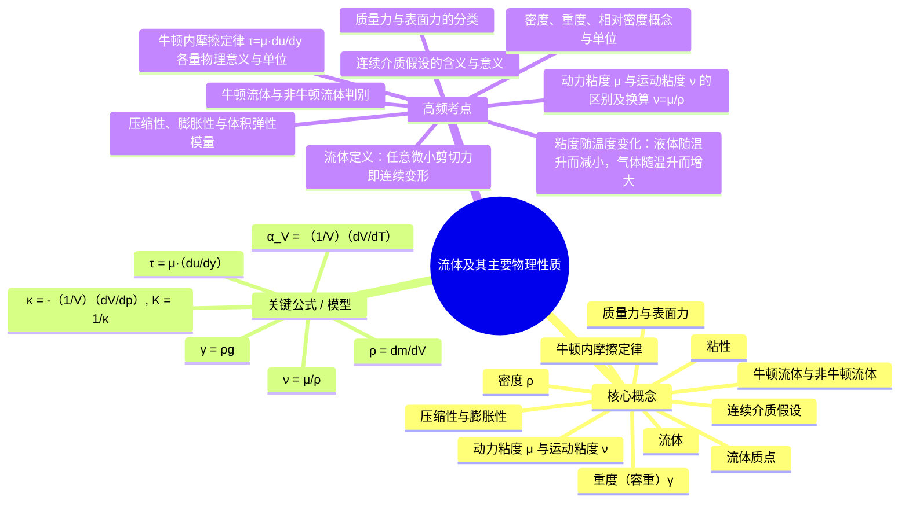

# 流体力学 · 第 1 章 · 流体及其主要物理性质 · 素材

> 教师: 曾强 · 学期: 2026春
> 章下 PDF: 2 个 · 总页: 125
> 主版: 第 1 节 · 63 页

---

## 主版课件 · 第 1 节

> `001-开学第一课-《流体力学》 第一章 流体及其主要物理性质.pdf`

<details><summary>展开 63 页图链</summary>

- [p001](../001-开学第一课-《流体力学》 第一章 流体及其主要物理性质/page_001.jpg)  · 《流体力学》
- [p002](../001-开学第一课-《流体力学》 第一章 流体及其主要物理性质/page_002.jpg)  · 1.1本章主要内容
- [p003](../001-开学第一课-《流体力学》 第一章 流体及其主要物理性质/page_003.jpg)  · 1.1流体的定义
- [p004](../001-开学第一课-《流体力学》 第一章 流体及其主要物理性质/page_004.jpg)  · 1.1 流体的定义
- [p005](../001-开学第一课-《流体力学》 第一章 流体及其主要物理性质/page_005.jpg)  · 1.1流体的定义
- [p006](../001-开学第一课-《流体力学》 第一章 流体及其主要物理性质/page_006.jpg)  · 1.2流体力学的任务与发展简史
- [p007](../001-开学第一课-《流体力学》 第一章 流体及其主要物理性质/page_007.jpg)  · 1.2流体力学的任务与发展简史
- [p008](../001-开学第一课-《流体力学》 第一章 流体及其主要物理性质/page_008.jpg)  · 1.2流体力学的任务与发展简史
- [p009](../001-开学第一课-《流体力学》 第一章 流体及其主要物理性质/page_009.jpg)  · 1.2流体力学的任务与发展简史
- [p010](../001-开学第一课-《流体力学》 第一章 流体及其主要物理性质/page_010.jpg)  · 1.2流体力学的任务与发展简史
- [p011](../001-开学第一课-《流体力学》 第一章 流体及其主要物理性质/page_011.jpg)  · 1.2流体力学的任务与发展简史
- [p012](../001-开学第一课-《流体力学》 第一章 流体及其主要物理性质/page_012.jpg)  · 1.2流体力学的任务与发展简史
- [p013](../001-开学第一课-《流体力学》 第一章 流体及其主要物理性质/page_013.jpg)  · 1.2流体力学的任务与发展简史
- [p014](../001-开学第一课-《流体力学》 第一章 流体及其主要物理性质/page_014.jpg)  · 1.2流体力学的任务与发展简史
- [p015](../001-开学第一课-《流体力学》 第一章 流体及其主要物理性质/page_015.jpg)  · 1.2流体力学的任务与发展简史
- [p016](../001-开学第一课-《流体力学》 第一章 流体及其主要物理性质/page_016.jpg)  · 1.2流体力学的任务与发展简史
- [p017](../001-开学第一课-《流体力学》 第一章 流体及其主要物理性质/page_017.jpg)  · 1.2流体力学的任务与发展简史
- [p018](../001-开学第一课-《流体力学》 第一章 流体及其主要物理性质/page_018.jpg)  · 1.2流体力学的任务与发展简史
- [p019](../001-开学第一课-《流体力学》 第一章 流体及其主要物理性质/page_019.jpg)  · 1.2流体力学的任务与发展简史
- [p020](../001-开学第一课-《流体力学》 第一章 流体及其主要物理性质/page_020.jpg)  · 1.2流体力学的任务与发展简史
- [p021](../001-开学第一课-《流体力学》 第一章 流体及其主要物理性质/page_021.jpg)  · 1.2流体力学的任务与发展简史
- [p022](../001-开学第一课-《流体力学》 第一章 流体及其主要物理性质/page_022.jpg)  · 1.2流体力学的任务与发展简史
- [p023](../001-开学第一课-《流体力学》 第一章 流体及其主要物理性质/page_023.jpg)  · 1.2流体力学的任务与发展简史
- [p024](../001-开学第一课-《流体力学》 第一章 流体及其主要物理性质/page_024.jpg)  · 1.2流体力学的任务与发展简史
- [p025](../001-开学第一课-《流体力学》 第一章 流体及其主要物理性质/page_025.jpg)  · 1.2流体力学的任务与发展简史
- [p026](../001-开学第一课-《流体力学》 第一章 流体及其主要物理性质/page_026.jpg)  · 1.2流体力学的任务与发展简史
- [p027](../001-开学第一课-《流体力学》 第一章 流体及其主要物理性质/page_027.jpg)  · 1.2流体力学的任务与发展简史
- [p028](../001-开学第一课-《流体力学》 第一章 流体及其主要物理性质/page_028.jpg)  · 1.2流体力学的任务与发展简史
- [p029](../001-开学第一课-《流体力学》 第一章 流体及其主要物理性质/page_029.jpg)  · 1.3连续介质假设
- [p030](../001-开学第一课-《流体力学》 第一章 流体及其主要物理性质/page_030.jpg)  · 1.3连续介质假设
- [p031](../001-开学第一课-《流体力学》 第一章 流体及其主要物理性质/page_031.jpg)  · 1.3连续介质假设
- [p032](../001-开学第一课-《流体力学》 第一章 流体及其主要物理性质/page_032.jpg)  · 1.3连续介质假设
- [p033](../001-开学第一课-《流体力学》 第一章 流体及其主要物理性质/page_033.jpg)  · 1.3连续介质假设
- [p034](../001-开学第一课-《流体力学》 第一章 流体及其主要物理性质/page_034.jpg)  · 1.3连续介质假设
- [p035](../001-开学第一课-《流体力学》 第一章 流体及其主要物理性质/page_035.jpg)  · 1.4流体的密度
- [p036](../001-开学第一课-《流体力学》 第一章 流体及其主要物理性质/page_036.jpg)  · 1.4流体的密度
- [p037](../001-开学第一课-《流体力学》 第一章 流体及其主要物理性质/page_037.jpg)  · 1.4流体的密度
- [p038](../001-开学第一课-《流体力学》 第一章 流体及其主要物理性质/page_038.jpg)  · 1.5流体的粘性
- [p039](../001-开学第一课-《流体力学》 第一章 流体及其主要物理性质/page_039.jpg)  · 1.5流体的粘性
- [p040](../001-开学第一课-《流体力学》 第一章 流体及其主要物理性质/page_040.jpg)  · 1.5流体的粘性
- [p041](../001-开学第一课-《流体力学》 第一章 流体及其主要物理性质/page_041.jpg)  · 1.5流体的粘性
- [p042](../001-开学第一课-《流体力学》 第一章 流体及其主要物理性质/page_042.jpg)  · 1.5流体的粘性
- [p043](../001-开学第一课-《流体力学》 第一章 流体及其主要物理性质/page_043.jpg)  · 1.5流体的粘性
- [p044](../001-开学第一课-《流体力学》 第一章 流体及其主要物理性质/page_044.jpg)  · 1.5流体的粘性
- [p045](../001-开学第一课-《流体力学》 第一章 流体及其主要物理性质/page_045.jpg)  · 1.5流体的粘性
- [p046](../001-开学第一课-《流体力学》 第一章 流体及其主要物理性质/page_046.jpg)  · 1.5流体的粘性
- [p047](../001-开学第一课-《流体力学》 第一章 流体及其主要物理性质/page_047.jpg)  · 1.5流体的粘性
- [p048](../001-开学第一课-《流体力学》 第一章 流体及其主要物理性质/page_048.jpg)  · 1.5流体的粘性
- [p049](../001-开学第一课-《流体力学》 第一章 流体及其主要物理性质/page_049.jpg)  · 1.5流体的粘性
- [p050](../001-开学第一课-《流体力学》 第一章 流体及其主要物理性质/page_050.jpg)  · 1.5流体的粘性
- [p051](../001-开学第一课-《流体力学》 第一章 流体及其主要物理性质/page_051.jpg)  · 1.5流体的粘性
- [p052](../001-开学第一课-《流体力学》 第一章 流体及其主要物理性质/page_052.jpg)  · 1.5流体的粘性
- [p053](../001-开学第一课-《流体力学》 第一章 流体及其主要物理性质/page_053.jpg)  · 1.6流体的可压缩性与膨胀性
- [p054](../001-开学第一课-《流体力学》 第一章 流体及其主要物理性质/page_054.jpg)  · 1.6流体的可压缩性与膨胀性
- [p055](../001-开学第一课-《流体力学》 第一章 流体及其主要物理性质/page_055.jpg)  · 1.6流体的可压缩性与膨胀性
- [p056](../001-开学第一课-《流体力学》 第一章 流体及其主要物理性质/page_056.jpg)  · 1.6流体的可压缩性与膨胀性
- [p057](../001-开学第一课-《流体力学》 第一章 流体及其主要物理性质/page_057.jpg)  · 1.6流体的可压缩性与膨胀性
- [p058](../001-开学第一课-《流体力学》 第一章 流体及其主要物理性质/page_058.jpg)  · 1.6流体的可压缩性与膨胀性
- [p059](../001-开学第一课-《流体力学》 第一章 流体及其主要物理性质/page_059.jpg)  · 1.7作用在流体上的力
- [p060](../001-开学第一课-《流体力学》 第一章 流体及其主要物理性质/page_060.jpg)  · 1.7作用在流体上的力
- [p061](../001-开学第一课-《流体力学》 第一章 流体及其主要物理性质/page_061.jpg)  · 本章小结
- [p062](../001-开学第一课-《流体力学》 第一章 流体及其主要物理性质/page_062.jpg)  · 第一章作业-复习题
- [p063](../001-开学第一课-《流体力学》 第一章 流体及其主要物理性质/page_063.jpg)  · 第一章作业-习题

</details>

<details><summary>展开 63 页图文对照（每图配其识别文本）</summary>

**p001** 

《流体力学》
第一章流体及其主要物理性质

---

**p002** 

1.1本章主要内容
1.1流体的定义
1.2流体力学的任务与发展简史
1.3连续介质模型
1.4流体的密度
1.5 流体的粘性
1.6流体的可压缩性
1.7作用在流体上的力

---

**p003** 

1.1流体的定义
一、流体与人类活动
外部环境：
地球表面75%被水覆盖；
地球上方厚达17000m空气；
城市供暖、供排水系统等公共设施
飞机、汽车等交通工具；
水电、风能、潮汐能等。
内部环境：
人体血液循环、肺部气血循环等。

---

**p004** 

1.1 流体的定义
二 流体的定义
可将自然界所有物质的存在状态分为固体和流体。流体
是具有流动性的物质。 流动性指在任何微小切应力持续作用下
会连续变形的特性 形状 体积 压力 拉力 剪切力
固体
液体
气体
D D D"
(a固体 (b流体

---

**p005** 

1.1流体的定义
三、 液体与气体的区别
气体的流动性更好：
+ 气体
液体
气体的可压缩性更大：
原因：
空气
气体的分子间距大 容易压缩；气体分子间的吸引力小
分子可自由运动，易流动。

---

**p006** 

1.2流体力学的任务与发展简史
一、流体力学的任务
研究流体运动规律及其应用的一门学科，分类为：
理论流体力学：倾向于严谨的数学推导。
工程流体力学：流体力学理论在工程中的实际应用。
水力学：倾向于研究水流的流动规律。
60年代以前：研究流体的动量传递问题；研究流体的运
动规律及其与固体、液体或大气界面之间的相互作用力问题
60年代以后：研究解决能源、环境保护、化工与石油等
领域的流体力学问题，多学科交互融合。

---

**p007** 

1.2流体力学的任务与发展简史
二、 流体力学的发展简史
两三干以前，通过孔口出流的原理发明了刻漏、铜壶
滴漏 （西汉时期的计时工具）。
漏：指带孔的壶
刻：指附有刻度的浮箭
滴漏：由水滴规律制造
刻漏 滴
漏

---

**p008** 

1.2流体力学的任务与发展简史
二、 流体力学的发展简史
公元前250年，修建了都江堰、郑国渠和灵渠等水利工程
都江堰工程：
壹旅游
宝瓶口：将岷江江水分流部
鱼嘴
分进入成都平原，防洪、减旱；
鱼嘴：东部地势较西部高江
水难以流入宝瓶口，进行二期鱼
江
嘴工程；
宝瓶口
飞沙堰：丰水期内江造成径
流大及泥沙淤积，修建飞沙堰。
只有内江水可以进入成者

---

**p009** 

1.2流体力学的任务与发展简史
二 流体力学的发展简史
灌溉：鱼嘴分水内江， 内江河床低，外江河床高，枯水
期有6成水量进入内江，用于灌溉。
壹旅 喜旅游
外江 内江
宝瓶口

---

**p010** 

1.2流体力学的任务与发展简史
二 流体力学的发展简史
泄洪：宝瓶口狭窄，丰水期、 洪水期宝瓶口水面水位怡
高，高于飞沙堰的水量通过飞沙堰分流至外江。
喜旅游 壹旅荐
宝瓶口
江 玉垒
飞沙堰
宝瓶口
飞沙堰人
水面就会上升，当水面超过旁边的飞沙堰时

---

**p011** 

1.2流体力学的任务与发展简史
二 流体力学的发展简史
排沙：弯道环流原理，澄澈的表层水流向凹地，浑浊的
底层水流向凸地，大量泥沙流向外江；狭窄的宝瓶口和离堆作
用在飞沙堰附近形成漩涡，大量沙石甩出飞沙堰。剩余沙石在
对面回水区沉淀，河工每年淘出。
壹旅游 壹旅游
外江 内江
宝瓶口

---

**p012** 

1.2流体力学的任务与发展简史
二、流体力学的发展简史
创建期：
西汉司马迁的《史记?河渠书》， “于蜀，蜀守冰凿离堆
辟沫水之害，穿二江成都之中。此渠皆可行舟；有余则用概浸
百姓飨（xiang）其利。至于所过，往往引l其水益用概田畴之
渠，以万亿计，然莫足数也。
所谓“凿离堆”，指开凿都江堰的宝瓶口工程。都江堰
在创建之初，只有分水鱼嘴和宝瓶口两个工程。

---

**p013** 

1.2流体力学的任务与发展简史
二、流体力学的发展简史
逐步完善期 （汉代至唐代）：
北魏时期的 《水经注》“李冰作大堰于此，壅江作，
有左右口，谓之（jian）期，入郸江、检江，以行舟”。
《新唐书·地理志》记载：导江“有侍郎堰，其东百丈堰
弓江水以溉彭、益田，龙朔中筑。又有小堰，长安初筑。
唐代都江堰灌区不仅延伸至成都平原南部甚至岷江中游
而且灌区的管理组织体系和管理制度进一步完善，形成了严格
的岁修制度。

---

**p014** 

1.2流体力学的任务与发展简史
二、流体力学的发展简史
成熟期 （宋元明清）：两宋时期，有关都江堰的文字记
载可知都江堰主体工程包括象鼻、离堆、侍郎堰、支水和摄水
等，其中“象鼻”指的就是鱼嘴，“离堆”即宝瓶口，“侍郎
堰”指具有泄洪和排沙功能的飞沙堰，“支水”和“摄水”等
辅助设施大致相当于导流堤、拦河低堰等。至此，拥有分水、
导流、引引水和溢洪排沙综合功能的工程体系的形成，标志着都
江堰作为一项综合性的水利工程进入了成熟期。

---

**p015** 

1.2流体力学的任务与发展简史
二、流体力学的发展简史
承前启后期（20世纪30年代-80年代）
1935年，都江堪鱼嘴首先改用混凝土浇筑，鱼嘴成为都
江堰水利工程中第一个传统工程结构与现代水工结构的结合物。
飞沙堰、鱼尾、金刚堤等工程设施陆续用混凝土浇筑，意味着
现代水利技术、建筑材料与古老的水利工程型式在都江堰这一
水利工程上结合，都江堰成为一处古老与现代、多种技术集于
一身的持续发展的水利工程
都江堰：古老的灌溉、泄洪、排沙水利工程

---

**p016** 

1.2流体力学的任务与发展简史
二、流体力学的发展简史
从世界上看，流体力学发展经历了不同时期：
公元前250年
文艺复兴时期
16世纪初
17世纪，工业革命开始，科学迅速发展
18世纪-19世纪
19世纪末至20世纪中叶
20世纪中叶至今

---

**p017** 

1.2流体力学的任务与发展简史
二、流体力学的发展简史
公元前250年：希腊的阿基米德提出了“论浮体” 古代
文艺复兴时期，16世纪初，达芬奇倡导用实验方法了解
水流形态（《论水的流动和水的测量》）；意大利伽利略的比萨
斜塔实验：轻重不同的物体，从同一高度坠落，加速度一样，
它们将同时着地
托里拆利用实验测出了大气压强，给出了孔口泄流公式
法国帕斯卡提出液体中压力传递的定律：不可压缩静止流体中
点受外力产生压强增值后，此压强增值瞬时间传至静正流
体各点。

---

**p018** 

1.2流体力学的任务与发展简史
二 流体力学的发展简史
17世纪，工业革命开始：英国牛顿在大量实验观察基础
F 提出了牛顿三大运动定律和方有引1力定律；发明了微积分
-表达物理量的瞬时变化；提出了粘性流体内摩擦定律；形成
了牛顿力学。
第一定律 Gmm2 万有
引力 dtF= dm v+m duF=μAdt 第二定律 dy 内摩
擦定律
第三定律

---

**p019** 

1.2流体力学的任务与发展简史
二、流体力学的发展简史
18世纪-19世纪：
1730年，法国工程师皮托发明了测量流量的皮托管；
1738年，瑞士数学家伯努利将牛顿力学与流体物性、压
强概念结合，推导出不可压缩理想流体运动的能量方程-伯努
利方程。
pV pV
-+pgz2=P+ -+pgZ
不可压缩无粘流动沿流线的机械能转化与守恒定律。

---

**p020** 

1.2流体力学的任务与发展简史
二、流体力学的发展简史
18世纪-19世纪：
1752年，法国达朗贝尔研究阻力时通过达朗贝尔谬
（悖论），发现无粘性理想流体的局限性，促进了对粘性流体的
研究，首先提出了连续性方程。
理论预测：在不可压缩、无粘性、非旋转的理想流体中，
一个物体以恒定速度运动时，所受的阻力为零
现实观察：实际物体（如飞机、球体）在流体（如空气或水）
中运动时，明显受到阻力，这一矛盾为“达朗贝尔悖论
脖论源于理论中忽略流体粘性

---

**p021** 

1.2流体力学的任务与发展简史
二、流体力学的发展简史
18世纪-19世纪：
1753年，瑞士的欧拉提出了流体的连续性假设；提出了
描述流体的欧拉方法；建立了理想流体运动微分方程；研究理
想流体无旋运动，提出速度势的概念。
1783年，法国的拉格朗日提出描述流体运动的拉格朗日
方法；引引进了流函数概念。
1823年，法国的纳维和英国的斯托克斯建立了粘性流体
运动微分方程-N-S方程，提供了研究实际流体运动的基础。

---

**p022** 

1.2流体力学的任务与发展简史
二、流体力学的发展简史
18世纪-19世纪：
1822年，傅里叶和菲克与牛顿内摩擦定律相对应，提出
了傅里叶热传导公式和菲克第一定律，为研究流体的传质、传
热问题提供了依据
dT （热传导）
热 dxJ=-D （质量传递）
r=H （牛顿内磨搽定律）

---

**p023** 

1.2流体力学的任务与发展简史
二、流体力学的发展简史
18世纪-19世纪：
实验水力学发展：
法国的谢才通过大量实验提出明渠流量计算公式：
Q=W·C√R·J
意大利文丘里发明了文丘里流量计

---

**p024** 

1.2流体力学的任务与发展简史
二、流体力学的发展简史
18世纪-19世纪：
实验水力学发展：
法国的达西 （地下水渗流）、德国的魏斯巴赫 (流体阻
力）、英国的曼宁 （明渠断面平均流速） 等实验水利学研究成
果仍在应用。
局限性：不能解决复杂的工程问题；古典流体力学与实
验水力学长期分离。

---

**p025** 

1.2流体力学的任务与发展简史
二、流体力学的发展简史
19世纪末-20世纪中叶：
古典流体力学与实验水力学结合，形成现代流体力学
1882年，英国的雷诺首先阐明了相似原理，促进了理论
和实验的结合；进行了圆管实验，发现了流体流动的两种流态：
层流和湍流（流），提出了判别标准-雷诺数。
Turbulent dpuregion R=
Bufferlayer uViscous sublayerNotto ScaleLaminar Transition Turbulent

---

**p026** 

1.2流体力学的任务与发展简史
二、流体力学的发展简史
19世纪末-20世纪中叶：
引入了湍流应力（雷诺应力），采用时均方法建立了不
可压缩实际流体的瑞流运动方程 （雷诺方程），为瑞流理论研
究提供了基础。
1892年，1904年，英国的瑞利首次提出用量纲分析求流
动相似准则，促进了理论分析和实验研究相结合。
1887年，奥地利的马赫对可压缩气体研究作出了重要贡
献，后人将表征可压缩性的系数定义为马赫数 （流动速度与当
地音速之比）。

---

**p027** 

1.2流体力学的任务与发展简史
二、流体力学的发展简史
19世纪末-20世纪中叶：
1904年，德国普朗特创立了边界层理论，为解决边界复
杂的实际流体运动开辟了途径。
1921年，匈牙利的冯卡门导出边界层的动量积分方程
可解决一些壁面边界层问题。
1932年，德莱顿用热线流速计成功测量到湍流的脉动流
速。
1933年，德国尼古拉兹测定了人工粗造管道，补充了边
界层理论，推导了湍流半经验公式

---

**p028** 

1.2流体力学的任务与发展简史
二、流体力学的发展简史
20世纪中叶至今：
1946年，第一台电子计算机研制成功，使得数值计算方
法解决流体力学问题成为可能并迅速发展。
100 A2175
典型的数值模拟软件：
FLUENTCOMSOLT-H-M-C （多物理场耦合）
Thermo-Hydro-Mechanical-Chemical

---

**p029** 

1.3连续介质假设
一、问题提出
从分子物理学：构成流体的物质实体是大量分子，大量
分子处于离散状态且做热运动。
流体力学研究的问题是流体的宏观平衡与运动规律，其
描述均为宏观物理量（速度、压强、密度、力、温度），其定
义基于分子微观性质的统计平均。因而存在两个问题：
1）流体力学关注的宏观问题并不关注实际物质的微观状
态和行为-研究问题与研究对象脱节。
2）实际构成流体最小物质实体是大量离散分子，流体力
学宏观问题研究需借助数学微积分，变量须是连续函数。

---

**p030** 

1.3连续介质假设
二、连续介质假设
为解决上述问题，需要对流体的物质实体进行模型化-连
续介质模型假设，主要对流体物质最小实体进行模化。
引I入特征体积AV*概念，特征体积的定义需要满足一定
条件：基于特征体积所包含的分子的统计平均得到的宏观变量
值是稳定的。如何达到或满足这个条件？
以与特征体积尺度有关系的流体的宏观变量-密度为例加
以说明：

---

**p031** 

1.3连续介质假设
二、连续介质假设
p(kg/m)
如右图小圆圈所示，其包含
100 小尺度宏观变
量的不稳定性 大尺度宏观变量的
的分子量较少，特征体积边界处 不稳定性
有分子进出，其数量与特征体积 p=1kg/m² 100
p=1.1
内总分子数量级相当，导致统计 p=1.2 10 0.01
p=1.3
平均得到的密度值波动剧烈
相反，蓝色特征体积比较大 4V* 特征体积
宏观物理量密度在空间上受温度影响其分布也是变化的 1-
1.3），即特征体积取得太大时，其宏观变量值是不确定的。

---

**p032** 

1.3连续介质假设
二、连续介质假设
基于上述现象，微观上，特征体尺度要保证基于统计平
均的宏观量的确定性主要在于和流体分子自由程的尺度比较；
宏观上，特征体尺度的确定在于其内部宏观变量的变化相对于
研究问题尺度上该变化是否可以忽略。由此得到定义特征体积
必须满足：
在宏观上充分小一特征尺度<<流动问题特征长度
（数学上可近似为一没有维度的点）
在微观上充分大一特征尺度>>分子平均自由程
（保证特征体包含大量分子，统计平均宏观变量值稳定）

---

**p033** 

1.3连续介质假设
二、连续介质假设
流体质点：特征体所包含的流体分子集合称为流体质点
流体质点 fluidparticle
微小特征体，包含大量分子，具有确定的宏观统
计特性
从空间上：分子平均自由程<<流体质点尺度<<流动问
题特征长度；
从时间上：微观性质统计平均后可得到稳定值的时间<统
计平均时间<<流动问题的特征时间。

---

**p034** 

1.3连续介质假设
二、连续介质假设
流体力学连续介质模型假设：
1）假设组成流体最小物质实体是质点
不是流体分子；
2)1 假设流体是由无限多流体质点连绵不断组成 质点间
无间隙。流体是连续的，流体宏观变量分布也是连续的。
适用条件：针对所研究问题，流体质点是否可定义，分
子自由程是否远小于特征尺寸。
不适用：大气边缘稀薄气体的飞行器；微小通道内流体
的流动问题。

---

**p035** 

1.4流体的密度
一、密度的定义
密度是流体的重要属性，对流体的运动特性具有重要影
响。
流体质点的密度等于特征体包含的流体分子的质量与特
征体体积之比其数学定义：
p= limv→△vVdV
相对密度：工程上将某液体的密度与4℃水的密度
（1000kg/m3）的比值称为相对密度：

---

**p036** 

1.4流体的密度
二、引起密度变化的参数
流体密度是压强与温度的函数=（x,y，=），压强与温度的
变化引起密度的变化：
+pde opdT dp -op/edp+ oplPdTop OT op OT
右式压力系数项：Ev= 0p / p
（体积模量/压缩系数）
右式温度系数项：β= （热膨胀系数）

---

**p037** 

1.4流体的密度
例题1-1：由于温室效应，地球表面平均温度升高。海洋受热
后，海水膨胀导致海平面升高。设海洋平均水深3800m，平
均热膨胀系数为1.6*10-4K-1度。试计算海洋水温增加1K时引
起的海平面上升高度。
△h=hβT=3800×1.6×10-4×1=0.608m

---

**p038** 

1.5流体的粘性
一、 、流体粘性的定义
对流体流动最具影响的属性有流体的粘性和可压缩性。什么
是粘性？粘性的定义是什么？实验（牛顿），如下图：
图中上下两个无限长平板，平
板间为流体，下平板固定不动。在 u=Uto时刻，上平板施加向右的力F，在 u+△uF作用下，上平板以速度u匀速向右 h
运动，平板间的流体一起向右运动
B u=0
，在垂直方向自上而下流体的速度越来越小。
为什么平板间与平板没有接触的流体会发生运动？-流体粘性

---

**p039** 

1.5流体的粘性
流体粘性的定义
该层流体文带动下一层流体向右运动；
流体上
牛顿平板试验
以上下两层间流体微元作研究对象，流
体微元上面受到了上层流体向右的剪切力作 C u=U no-slip condition
用，下面受到了下层流体向左的剪切力作用 u+u
。在剪切力作用下，流体微元发生变形。剪 h u p2
切变形产生的力的方向与上层流体和下层流 T2
体加载给流体微元的切向力相反。 B u=0 no-slipcondition
现来。 本质上+ 粘性是流体抵抗剪切变形（相对运动）的一种属性

---

**p040** 

1.5流体的粘性
二、流体粘性的产生原因
液体：相邻两分子间距离一般是分子引力与斥力平衡的距离
当相邻分子偏离平衡距离时，如果距离增大表现为引力，减小表
现为斤力
右图：静止时分子间处于平衡距离， 不
表现有力的存在；当上层流体向右运动时
下两层流体相邻两层分子间距离增加
分子间引1力增加；对上层流体，分子间引1力
向左，阻碍上层流体向右运动；对下层流体
，分子间引力向右，拉动下层流体向右运动
机制：流体微元剪切变形一分子间距离增加一分子间引力增
加一阻止分子间距离改变。内摩擦抵抗变形宏观表现流体的粘性。

---

**p041** 

1.5流体的粘性
二、流体粘性的产生原因
气体：分子间距较大，分子间引力可忽略，分子无时无刻作
无规则热运动。
右图：上层流体向右速度为u+Au， u+△u
层流体向右速度为u；由于气体无规则运动
上、下流体交界面有气体分子穿过。穿
过交界面的分子与上下层气体分子存在动量交换：在下层区域从
上层来的具有较大向右速度的分子把动量交换给下层速度较低的
分子，动量交换产生的作用力向右，推动下层分子向右运动；在
上层区域从下层来的具有较小向右速度的分子与上层分子发生动
量交换，动量交换产生的作用力向左，阻碍上层流体向右运动。
机制：分子热运动一不同层间分子动量交换一气体的粘性力。

---

**p042** 

1.5流体的粘性
三、牛顿内摩擦定律
由粘性产生机理，粘性的宏观表现为层之间的切应力；
层间的粘性应力可视为层间摩擦力。层间摩擦力大小等于多少？
影响因素有哪些？
u=U no-slipcondition
由牛顿平板实验，由于流体粘性 u+△u
与板界面处流体速度近似与板的运动
速度相同，即满足无滑移边界条件 B u=0 无滑移条件
则上板界面处流体速度为U，下板界面处流体速度为0。上板
界面流体受平板向右的切应力，板则受到向左的切应力，两作
用力平衡。单位面积流体切应力=F/A

---

**p043** 

1.5流体的粘性
三、牛顿内摩擦定律
牛顿平板实验上下板间距很小，切应力与U/h成正比：
为动力粘性系数，近似为常数，其值与流体种类有关。
平板实验结果推广到任意层段流体：
右图：在y方向存在x方向流体速度 ap(np+n
差，层间存在相互运动。由牛顿实验结
果得：
n=1 ，切应力与速度梯度成正比，与速度无关。

---

**p044** 

1.5流体的粘性
三、牛顿内摩擦定律
粘性应力分布与流体速度分布：
牛顿平板实验满足下述实验条件：1）平板作匀速运动；
平板间流体也作匀速运动；2）在 在流体运动方向没有压差，即
平板间流体在运动方向等压。
牛顿平板试验
取平板间任一流体微元，作受 u=U no-slipcondition
力分析。忽略重力影响，流体微元 u+△u T1
所受合力为Fu=0 no-slip condition

---

**p045** 

1.5流体的粘性
三、牛顿内摩擦定律
分析流体微元F由以下力构成：
牛顿平板试验
、上面流体因速度大于流体微元速
F C u=Uno-slip condition
度带动流体向右运动的粘性应力； u+△u Ti
下面流体因速度小于流体微元速 h pi p2
度阻碍流体微元向右运动的粘性应力；
B u=0no-slip condition
左边流体对流体微元的压力；
右边流体对流体微元的压力 由实验条件？=P2
则： t=t=t=const
∑F=p△y-p2y+△x-tx=0

---

**p046** 

1.5流体的粘性
三、牛顿内摩擦定律
流体速度分布：
由牛顿摩擦定律 得 ，对速度在y（0，h）
范围内积分得：=ky+C y由0,u=0;y=h,u=U ，得速
度分布公式：
结论：在牛顿实验条件下（匀速，等压），平板间流体
粘性切应力为常数；平板间流体流速在y方向呈线性分布。
实际流体流动方向不是等压，y方向速度不是线性分布。

---

**p047** 

1.5流体的粘性
三、牛顿内摩擦定律
由相对运动得到流体内摩擦定律：=u du 由流体粘性定义可知
流体内部粘性应力（内摩擦力）本质上来自流体剪切变形。
由剪切变形分析流体粘性应力： 10（ng+n)
如右图所示流体微元，流体在y方向速度
梯度为，微元下面质点速度为，，上面质点 oy
速度为u，经过s，时间，微元上面质点运动
了元 （u+u）下面质点运动了 由于上下质点速度差，原矩形流体微
经 ”时间后变为蓝色平行四边形微元。其微元变形的角度为 ，角变
形为t ，有：
Su8t da ，粘性切应力与角变形率
atan8a=
8y dt

---

**p048** 

1.5流体的粘性
三、牛顿内摩擦定律
牛顿摩擦定律可得动力粘性系数表达式：
0.024 2.0
du / dy 1.00.022
反应流体真实粘性大小 0.020 甘油
n 宽气 1x10-
0.018 机油
动力粘性系数受到温度影响： (10w)
粘度/0.001Pa-s 0.016 二氧化碳 1x10
粘度/Pa·s
液体：温度增加，粘性降低； 0.0140.012 甲烧 1×10
气体：温度增加，粘性增大。 乙烷
0.010 丙烷 汽油
0.008 1x100.006 一戊烷 n-丁烷
j-丁烷 1x100.004 20 40 60 80100 20 0 20 4060 80 100
温度/℃ 温度/℃

---

**p049** 

1.5流体的粘性
三、牛顿内摩擦定律
温度对液体、气体粘性影响的差异？
由流体粘性产生的机理不同：
液体：粘性产生的机理是分子内聚力 （分子间引力）。
温度升高，分子内聚力减弱，液体粘性减小。
气体：粘性产生的机理是分子热运动产生的动量交换
温度升高，分子热运动剧烈，分子间动量交换增加，宏观表现
为气体的粘性增大。

---

**p050** 

1.5流体的粘性
三、 牛顿内摩擦定律
除流体动力粘性系数，还有与粘性相关的参数-运动粘性
系数：
动力粘性系数μ 运动粘性系数
(m2/s)
水 1.002×10-3 1.004×10-6
运动粘性系数反映流体运动特性
空气 1.82x10-5 1.51×10-5
不能真实反应流体粘性大小。
牙膏T>0（塑）
牛顿流体：符合牛顿内摩擦定律的
淀粉糊（胀）
流体。 (动力粘性系数为常数)
to 水
非牛顿流体：动力粘性系数不为常
纸浆（假塑）
数的流体。
du/dy

---

**p051** 

1.5流体的粘性
四、理想流体与粘性流体概念
理想流体：动力粘性系数为零的流体。
粘性流体：动力粘性系数不为零的流体
实际流体均为粘性流体，粘性是流体的属性，不存在纯粹的
理想流体。
工程应用中根据问题角度与粘性大小考虑是否忽略粘性：
1）粘性力与其他力比较较小，可忽略粘性力；
2）粘性力虽不是很小，但对所研究问题影响小（如绕流升
力），可忽略粘性力。
理想流体理论虽成功解决某些问题，但解释不了绕流阻力等
问题。

---

**p052** 

1.5流体的粘性
例题1-2：两无限大平行平板相距8=0.3mm，其间充满均匀
牛顿流体，流体粘度为6.5*10-4Pa·s，上板以U=0.3m/s速度
在自身平板内运动，下板静止，两板间流体速度呈线性分布，
求上下平板受到的切应力。
解：
0.36.5×10-4 =0.65Pa0.3x10-3

---

**p053** 

1.6流体的可压缩性与膨胀性
、液体的可压缩性与膨胀性
液体的可压缩性：压力变化下流体的体积或密度发生变化的
物理属性。（压强增大，体积减小，密度增大；压强减小，体积增
大，密度减小)。
一般以体积压缩系数，度量流体压缩性：
(1) m=pVdv dpdm = d(pV)= pdV +Vdp=0 2
dv 1v_dpl pdp dpdp dp
（液体的弹
/dp A/Ap

---

**p054** 

1.6流体的可压缩性与膨胀性
一、液体的可压缩性与膨胀性
液体的膨胀性：在一定压强下，温度增加1K或1°C时，液
体体积的相对增加率。
一般以体膨胀系数，度量液体的膨胀性：
dV / VKy (5) m=pVdm=d(pV)=pdV+Vdp=0
A/AP d/dpKy= dT dT 6
可视为一定压强下，密度相对减小率。

---

**p055** 

1.6流体的可压缩性与膨胀性
一、液体的可压缩性与膨胀性
液体无状态方程与热力过程方程，无法确定压强变化与
密度和体积相对变化率的关系。通过实验方法确定液体体积弹
性模量与压强的关系。
右图为一活塞封闭的圆
柱体，内部充满液体。通过
改变力F，测量体积变化，绘
制压强与体积变化率曲线 AIA
体积弹性模量与温度有关 温度(C) 0 10 20 50 100
Ev(Pa) 2.02×109 2.1×109 2.18×109 2.29×109 2.07×109

---

**p056** 

1.6流体的可压缩性与膨胀性
气体的可压缩性与膨胀性
气体与液体不同，具有显著的压缩性和膨胀性
气体压强、温度、比体积满足理想气体状态方程：
P =RTpV=RT (7) (8)
对于等温过程：
代入（3）式得：
dV /v dp/ p

---

**p057** 

1.6流体的可压缩性与膨胀性
气体的可压缩性与膨胀性
对于等压过程：p=constpV=RT PT=p2T2
将p= m 代入=RT 得：
mRT dV mR
=4 绝热过
P dT p
程： ppVy const
代入球：/vKy= Ky E=p
（体胀系数）

---

**p058** 

1.6流体的可压缩性与膨胀性
三、可压缩与不可压缩流体
不可压缩流体：流体体积弹性模量为无穷大。若同一种
流体密度为常数，则为均匀不可压缩流体。
工程应用上：
液体：通常为不可压缩流体。（水击、水下爆炸须考虑
为可压缩流体）
气体：通常为可压缩流体。（低速、温差不大时视为不
可压缩流体）

---

**p059** 

1.7作用在流体上的力
一 、质量力
流体力学是研究流体在力作用下的宏观平衡与运动规律
作用在流体上的力有哪些？
采用隔离体法研究流体的受力：隔离体
内流体受力按作用方式分为：
质量力：流体所处外力场作用在隔离体
所有流体质点的力。如隔离体质量与密度分
布均匀，质量力大小与隔离体体积相关，也
称体积力。单位质量力：}=1im △F ，是时间与空间的函数。

---

**p060** 

1.7作用在流体上的力
二、表面力
外部流体或物体作用在取定封闭界面的力，为接触力。
其值与封闭表面积成正比。通常用表面应力描述：
P, = △P AP
通常，表面应力与表面微元外法线并不重
合，可分解为： AL AS
垂直于表面的法向应力 （正应力）
平行于表面的切向应力 (切应力)
表面应力是微元空间位置与时间的函数，可积分求得。

---

**p061** 

本章小结
流体的定义
连续介质模型假说
流体的粘性 (理想流体、粘性流体、牛顿流体）
流体的可压缩性 （可压缩性流体、不可压缩性流体）
流体的作用力（质量力、表面力）
作业：
P14页，复习思考题：1-6、1-10
P15页，习题：1-3

---

**p062** 

第一章作业-复习题
1-6.流体的粘性与哪些因素有关它们随温度是如何变化的？
答：流体的粘性与流体种类、温度、压力有关。
随温度增加，液体的粘性减小、气体的粘性增加
1-10.作用在流体上的力可以分为哪两类？ 两者有何区别？
答：作用在流体上的力可分为质量里和表面力。
区别：质量力为非接触力，表面力为接触力；质量力与
质量成正比；表面力与面积成正比。

---

**p063** 

第一章作业-习题
1-3.一平板在油面上作水平运动，如图所示。已知平板运动速
度V=1m/s，板与固定边界的距离8=5mm，油的粘度
u=0.1Pa·s，求作用在平板单位面积的粘滞阻力。
解：假设板间流体流速分布是线性的，则板间
流体速度梯度为：duV 1m / s
=200s-1
dy 5×10-3m
由牛顿内摩擦定律 =1 可得作用在单位面平板的粘滞阻力：
= 0. 1Pa· s x 200s = 20Pa

---

</details>

## 辅版课件

> 共 1 个辅版（同章不同次/不同侧重）。每辅版仅列前 3 页之链，余者参 主版 即可。

### 辅 1 · 第 2 节 · 62 页

> `002-《流体力学》 第一章 流体及其主要物理性质-《流体力学》 第一章 流体及其主要物理性质.pdf` · 涉章 [1]

- [p001](../002-《流体力学》 第一章 流体及其主要物理性质-《流体力学》 第一章 流体及其主要物理性质/page_001.jpg)  · 1.5流体的粘性
- [p002](../002-《流体力学》 第一章 流体及其主要物理性质-《流体力学》 第一章 流体及其主要物理性质/page_002.jpg)  · 1.1本章主要内容
- [p003](../002-《流体力学》 第一章 流体及其主要物理性质-《流体力学》 第一章 流体及其主要物理性质/page_003.jpg)  · 1.1流体的定义
- ...余 59 页, 参 [`002-《流体力学》 第一章 流体及其主要物理性质-《流体力学》 第一章 流体及其主要物理性质/`](../002-《流体力学》 第一章 流体及其主要物理性质-《流体力学》 第一章 流体及其主要物理性质/)

---

## 思维导图 · LLM 生成

### Markmap（Typora / markmap.js / Obsidian 可渲染）

```markmap
# 流体及其主要物理性质
## 核心概念
- 流体
- 连续介质假设
- 流体质点
- 密度 ρ
- 重度（容重）γ
- 粘性
- 牛顿内摩擦定律
- 动力粘度 μ 与运动粘度 ν
- 牛顿流体与非牛顿流体
- 压缩性与膨胀性
- 质量力与表面力
## 关键公式 / 模型
- ρ = dm/dV
- γ = ρg
- τ = μ·(du/dy)
- ν = μ/ρ
- κ = -(1/V)(dV/dp), K = 1/κ
- α_V = (1/V)(dV/dT)
## 高频考点
- 流体定义：任意微小剪切力即连续变形
- 连续介质假设的含义与意义
- 牛顿内摩擦定律 τ=μ·du/dy 各量物理意义与单位
- 动力粘度 μ 与运动粘度 ν 的区别及换算 ν=μ/ρ
- 粘度随温度变化：液体随温升而减小，气体随温升而增大
- 牛顿流体与非牛顿流体判别
- 密度、重度、相对密度概念与单位
- 压缩性、膨胀性与体积弹性模量
- 质量力与表面力的分类
```

### Mermaid（GitHub Markdown 可渲染）



## 复习要点 · LLM 协填

### 一、核心概念

- **流体**：在任意微小剪切力作用下都会连续变形（流动）的物质，是气体与液体的统称。  *（要：静止流体不能承受剪切力，只能承受压力）*
- **连续介质假设**：把流体看作由无数流体质点连续、无间隙地充满所占空间的介质，使各物理量成为时空的连续函数。  *（要：宏观处理微观，是流体力学的建模基础）*
- **流体质点**：宏观上足够小、微观上仍含大量分子的流体微团。  *（要：连续介质的基本单元）*
- **密度 ρ**：单位体积流体所具有的质量，ρ=dm/dV，单位 kg/m³。  *（要：水约 1000 kg/m³）*
- **重度（容重）γ**：单位体积流体所受的重力，γ=ρg，单位 N/m³。  *（要：与密度差一个 g）*
- **粘性**：流体内部相邻流层间产生内摩擦、阻碍相对运动的性质。  *（要：只有流体运动时才表现，静止时不显现）*
- **牛顿内摩擦定律**：切应力与速度梯度成正比：τ=μ·du/dy。  *（要：粘性流体切应力的本构关系）*
- **动力粘度 μ 与运动粘度 ν**：μ 反映流体粘性大小（Pa·s）；ν=μ/ρ 综合考虑惯性（m²/s）。  *（要：ν 用于雷诺数等运动学分析）*
- **牛顿流体与非牛顿流体**：切应力与速度梯度呈线性关系者为牛顿流体（如水、空气），否则为非牛顿流体。  *（要：判别看 τ~du/dy 是否线性过原点）*
- **压缩性与膨胀性**：压缩性：体积随压强增大而减小；膨胀性：体积随温度升高而增大。  *（要：液体常视为不可压缩）*
- **质量力与表面力**：质量力作用于流体全部质量（重力、惯性力）；表面力作用于流体表面（压力、切力）。  *（要：受力分析的两大类）*

### 二、关键公式 / 模型

| 公式 | 含义 |
|------|------|
| `ρ = dm/dV` | 密度定义，单位 kg/m³ |
| `γ = ρg` | 重度（容重），单位 N/m³ |
| `τ = μ·(du/dy)` | 牛顿内摩擦定律，切应力正比于速度梯度 |
| `ν = μ/ρ` | 运动粘度，单位 m²/s |
| `κ = -(1/V)(dV/dp), K = 1/κ` | 体积压缩系数与体积弹性模量 |
| `α_V = (1/V)(dV/dT)` | 体积膨胀系数 |

### 三、重要案例 / 例题

- 20℃ 时水的动力粘度 μ≈1.005×10⁻³ Pa·s，密度 ρ≈998 kg/m³。
- 平行平板间线性流动：du/dy=U/h，由牛顿内摩擦定律算切应力 τ=μU/h。
- 蜂蜜与水：粘度相差数千倍，直观说明粘性差异。

### 四、高频考点（速记）

1. 流体定义：任意微小剪切力即连续变形
2. 连续介质假设的含义与意义
3. 牛顿内摩擦定律 τ=μ·du/dy 各量物理意义与单位
4. 动力粘度 μ 与运动粘度 ν 的区别及换算 ν=μ/ρ
5. 粘度随温度变化：液体随温升而减小，气体随温升而增大
6. 牛顿流体与非牛顿流体判别
7. 密度、重度、相对密度概念与单位
8. 压缩性、膨胀性与体积弹性模量
9. 质量力与表面力的分类

### 五、思考题 / 自测

- **Q**：为什么说静止流体不能承受剪切力？
  **A**：静止流体中任何微小剪切力都会引起连续变形，故静止时切应力必为零，只能承受法向压应力。

- **Q**：动力粘度与运动粘度有何区别与联系？
  **A**：μ 直接反映流体粘性大小（Pa·s）；ν=μ/ρ 把密度（惯性）一并考虑（m²/s），常用于雷诺数等运动学分析。

- **Q**：为什么液体与气体的粘度随温度变化规律相反？
  **A**：液体粘性主要来自分子间引力，升温引力减弱故 μ 降低；气体粘性主要来自分子动量交换，升温热运动加剧故 μ 升高。


### 六、与前后章之关联

- **承前**：全课起点，建立流体的连续介质模型与基本物性参数。
- **启后**：粘性是第 5 章沿程损失与第 4 章 N-S 方程之源；密度、压强为第 2 章静力学之基。

