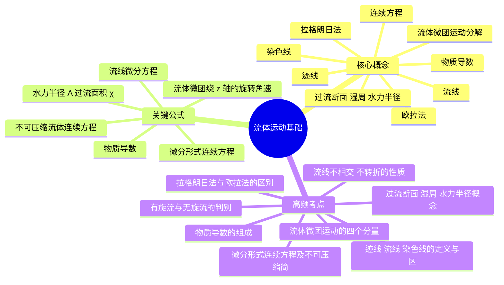

# 流体力学 · 第 3 章 · 流体运动基础 · 素材

> 教师: 曾强 · 学期: 2026春
> 章下 PDF: 2 个 · 总页: 96
> 主版: 第 7 节 · 48 页

---

## 主版课件 · 第 7 节

> `007-《流体力学》 第三章 流体运动基础（2）-《流体力学》 第三章 流体运动基础.pdf`

<details><summary>展开 48 页图链</summary>

- [p001](../007-《流体力学》 第三章 流体运动基础（2）-《流体力学》 第三章 流体运动基础/page_001.jpg)  · 《流体力学》
- [p002](../007-《流体力学》 第三章 流体运动基础（2）-《流体力学》 第三章 流体运动基础/page_002.jpg)  · 第1-第2章主要内容小结
- [p003](../007-《流体力学》 第三章 流体运动基础（2）-《流体力学》 第三章 流体运动基础/page_003.jpg)  · 第1-第2章主要内容小结
- [p004](../007-《流体力学》 第三章 流体运动基础（2）-《流体力学》 第三章 流体运动基础/page_004.jpg)  · 本章主要内容
- [p005](../007-《流体力学》 第三章 流体运动基础（2）-《流体力学》 第三章 流体运动基础/page_005.jpg)  · 3.1描述流体运动的两种方法
- [p006](../007-《流体力学》 第三章 流体运动基础（2）-《流体力学》 第三章 流体运动基础/page_006.jpg)  · 3.1描述流体运动的两种方法
- [p007](../007-《流体力学》 第三章 流体运动基础（2）-《流体力学》 第三章 流体运动基础/page_007.jpg)  · 3.1描述流体运动的两种方法
- [p008](../007-《流体力学》 第三章 流体运动基础（2）-《流体力学》 第三章 流体运动基础/page_008.jpg)  · 3.1描述流体运动的两种方法
- [p009](../007-《流体力学》 第三章 流体运动基础（2）-《流体力学》 第三章 流体运动基础/page_009.jpg)  · 3.1描述流体运动的两种方法
- [p010](../007-《流体力学》 第三章 流体运动基础（2）-《流体力学》 第三章 流体运动基础/page_010.jpg)  · 3.1 描述流体运动的两种方法
- [p011](../007-《流体力学》 第三章 流体运动基础（2）-《流体力学》 第三章 流体运动基础/page_011.jpg)  · 3.1描述流体运动的两种方法
- [p012](../007-《流体力学》 第三章 流体运动基础（2）-《流体力学》 第三章 流体运动基础/page_012.jpg)  · 3.1描述流体运动的两种方法
- [p013](../007-《流体力学》 第三章 流体运动基础（2）-《流体力学》 第三章 流体运动基础/page_013.jpg)  · 3.2流场、迹线、流线、染色线
- [p014](../007-《流体力学》 第三章 流体运动基础（2）-《流体力学》 第三章 流体运动基础/page_014.jpg)  · 3.2流场、迹线、流线、染色线
- [p015](../007-《流体力学》 第三章 流体运动基础（2）-《流体力学》 第三章 流体运动基础/page_015.jpg)  · 3.2流场、迹线、流线、染色线
- [p016](../007-《流体力学》 第三章 流体运动基础（2）-《流体力学》 第三章 流体运动基础/page_016.jpg)  · 3.2流场、迹线、流线、染色线
- [p017](../007-《流体力学》 第三章 流体运动基础（2）-《流体力学》 第三章 流体运动基础/page_017.jpg)  · 3.2流场、迹线、流线、染色线
- [p018](../007-《流体力学》 第三章 流体运动基础（2）-《流体力学》 第三章 流体运动基础/page_018.jpg)  · 3.2流场、迹线、流线、染色线
- [p019](../007-《流体力学》 第三章 流体运动基础（2）-《流体力学》 第三章 流体运动基础/page_019.jpg)  · 3.2流场、迹线、流线、染色线
- [p020](../007-《流体力学》 第三章 流体运动基础（2）-《流体力学》 第三章 流体运动基础/page_020.jpg)  · 3.2流场、迹线、流线、染色线
- [p021](../007-《流体力学》 第三章 流体运动基础（2）-《流体力学》 第三章 流体运动基础/page_021.jpg)  · 3.2流场、迹线、流线、染色线
- [p022](../007-《流体力学》 第三章 流体运动基础（2）-《流体力学》 第三章 流体运动基础/page_022.jpg)  · 3.2流场、迹线、流线、染色线
- [p023](../007-《流体力学》 第三章 流体运动基础（2）-《流体力学》 第三章 流体运动基础/page_023.jpg)  · 3.2流场、迹线、流线、染色线
- [p024](../007-《流体力学》 第三章 流体运动基础（2）-《流体力学》 第三章 流体运动基础/page_024.jpg)  · 3.3流管等流体基本概念
- [p025](../007-《流体力学》 第三章 流体运动基础（2）-《流体力学》 第三章 流体运动基础/page_025.jpg)  · 3.3流管等流体基本概念
- [p026](../007-《流体力学》 第三章 流体运动基础（2）-《流体力学》 第三章 流体运动基础/page_026.jpg)  · 3.3流管等流体基本概念
- [p027](../007-《流体力学》 第三章 流体运动基础（2）-《流体力学》 第三章 流体运动基础/page_027.jpg)  · 3.4流体微团的运动与变形
- [p028](../007-《流体力学》 第三章 流体运动基础（2）-《流体力学》 第三章 流体运动基础/page_028.jpg)  · 3.4流体微团的运动与变形
- [p029](../007-《流体力学》 第三章 流体运动基础（2）-《流体力学》 第三章 流体运动基础/page_029.jpg)  · 3.4流体微团的运动与变形
- [p030](../007-《流体力学》 第三章 流体运动基础（2）-《流体力学》 第三章 流体运动基础/page_030.jpg)  · 3.4流体微团的运动与变形
- [p031](../007-《流体力学》 第三章 流体运动基础（2）-《流体力学》 第三章 流体运动基础/page_031.jpg)  · 3.4流体微团的运动与变形
- [p032](../007-《流体力学》 第三章 流体运动基础（2）-《流体力学》 第三章 流体运动基础/page_032.jpg)  · 3.4流体微团的运动与变形
- [p033](../007-《流体力学》 第三章 流体运动基础（2）-《流体力学》 第三章 流体运动基础/page_033.jpg)  · 3.4流体微团的运动与变形
- [p034](../007-《流体力学》 第三章 流体运动基础（2）-《流体力学》 第三章 流体运动基础/page_034.jpg)  · 3.5物质导数
- [p035](../007-《流体力学》 第三章 流体运动基础（2）-《流体力学》 第三章 流体运动基础/page_035.jpg)  · 3.5物质导数
- [p036](../007-《流体力学》 第三章 流体运动基础（2）-《流体力学》 第三章 流体运动基础/page_036.jpg)  · 3.5物质导数
- [p037](../007-《流体力学》 第三章 流体运动基础（2）-《流体力学》 第三章 流体运动基础/page_037.jpg)  · 3.5物质导数
- [p038](../007-《流体力学》 第三章 流体运动基础（2）-《流体力学》 第三章 流体运动基础/page_038.jpg)  · 3.5物质导数
- [p039](../007-《流体力学》 第三章 流体运动基础（2）-《流体力学》 第三章 流体运动基础/page_039.jpg)  · 3.5物质导数
- [p040](../007-《流体力学》 第三章 流体运动基础（2）-《流体力学》 第三章 流体运动基础/page_040.jpg)  · 3.5物质导数
- [p041](../007-《流体力学》 第三章 流体运动基础（2）-《流体力学》 第三章 流体运动基础/page_041.jpg)  · 3.5物质导数
- [p042](../007-《流体力学》 第三章 流体运动基础（2）-《流体力学》 第三章 流体运动基础/page_042.jpg)  · 3.6微分形式的连续方程
- [p043](../007-《流体力学》 第三章 流体运动基础（2）-《流体力学》 第三章 流体运动基础/page_043.jpg)  · 3.6微分形式的连续方程
- [p044](../007-《流体力学》 第三章 流体运动基础（2）-《流体力学》 第三章 流体运动基础/page_044.jpg)  · 3.6微分形式的连续方程
- [p045](../007-《流体力学》 第三章 流体运动基础（2）-《流体力学》 第三章 流体运动基础/page_045.jpg)  · 3.6微分形式的连续方程
- [p046](../007-《流体力学》 第三章 流体运动基础（2）-《流体力学》 第三章 流体运动基础/page_046.jpg)  · 3.6微分形式的连续方程
- [p047](../007-《流体力学》 第三章 流体运动基础（2）-《流体力学》 第三章 流体运动基础/page_047.jpg)  · 3.6微分形式的连续方程
- [p048](../007-《流体力学》 第三章 流体运动基础（2）-《流体力学》 第三章 流体运动基础/page_048.jpg)  · 本章小结

</details>

<details><summary>展开 48 页图文对照（每图配其识别文本）</summary>

**p001** 

《流体力学》
第三章流体运动基础

---

**p002** 

第1-第2章主要内容小结
第1章流体及其物理性质
连续介质假设：特征体积，流体质点。
2) 流体粘性：粘性产生原因，牛顿内摩擦定律 du3） 作用在流体上的力：质量力，表面力。

---

**p003** 

第1-第2章主要内容小结
第2章流体静力学
流体的静压强：与方位无关，是位置的函数。
2) 流体平衡微分方程： f--Vp=0
（欧拉平衡方程）
3） 帕斯卡定律：F=
4 重力场静止流体压强基本方程、几何意义、能量意义：
-pg +Zdz pg5）压强测量：绝对压强，计示压强。

---

**p004** 

本章主要内容
3.1描述流体运动的两种方法
3.2流场、迹线、流线、染色线
3.3流管等基本流动概念
3.4流体微团的运动与变形
3.5物质导数
3.6微分形式的连续方程

---

**p005** 

3.1描述流体运动的两种方法
一、拉格朗日方法
跟踪流体质点-拉格朗日方法：着眼于流体质点 设法描
述出每个质点自始自终的规律，即位置随时间的变化规律。知
道所有流体质点规律，则整个流体的运动获态即可清楚
可用手机运动App记录跑步过程类比，运动App可记录
什么时间、什么位置、跑多少步及消耗的能量等信息，只要查
看沿程跑步信息，即可描述整个跑步过程。
在流体力学中，观察者跟随流体质点运动， 描述流体质
点运动规律。直角坐标系中，在时间t=0时，每个质点均真有
一组唯一的坐标.（x=a,y=bz=c），那么流体质点初始坐标
（a,b,c）可以用来作为不同质点的区分标志

---

**p006** 

3.1描述流体运动的两种方法
一、拉格朗日方法
流体运动中，每个流体质点（a，b，c）其运动坐标随时间t
有一定变化规律，不同质点变化规律不尽相同。运动过程中，
每个流体质点位置矢量是其初始位置和时间的函数。设初始时
间某质点标记为（a，b，c），则该质点的物理量为：
n=n(a,b,c,t) a，b，c，t为拉格朗日变量
固定初始位置坐标（a,b,c），时间t为变量。得到某一
确定流体质点随时间运动规律：F（a，b，c,t)） 固定时间t，变
化不同位置a,b，c，得到同一时刻不同质点位置分布规律。对
流体质点位置矢量对时间求导(a,b,c,t) o²r(a,b,c,t)
10 Ot²

---

**p007** 

3.1描述流体运动的两种方法
一、拉格朗日方法
在初始时刻，紧密毗邻的具有不同初始坐标 （a,b,c）的
无数流体质点组成了一个具有确定流体质点、确定流体参数的
质点系。运动过程中，质点系各个质点位移、速度、加速度等
不尽相同。
经过时间t后，随流体质点运动，质点系位置、边界形状
包围空间的大小均发生变化，但该质点系在流通过程中仍然是
具有流动参数的物质实体-系统，即某一确定流体质点的集合。
特点：与外界无质量交换；随流体质点运动而运动；边
界形状、包围空间大小随流体质点运动变化；拉格朗日方法概
念。

---

**p008** 

3.1描述流体运动的两种方法
二 欧拉方法
研究流体运动时，可以通过对流场内固定空间位置的参
数进行研究-欧拉方法。流动空间充满连续流体质点，每个质
点具有一定物理量，流动空间内则形成物理量连续分布的场
每个流体质点在确定时刻，占据确定位置，从而具有确定物理
量。
欧拉法：以数学场论为基础，着眼于仁
场的分布规律的流体运动描述方法。
用运动场跑圈计时类比：固定空间位置
观测流体质点运动规律的方法

---

**p009** 

3.1描述流体运动的两种方法
二、欧拉方法
欧拉方法中，用空间位置坐标x，yz和时间变量t描述流场
中流体运动规律，即描述空间某点流体运动物理量随时间变化
规律及由某点到另一点时该物理量的变化。空间位置为
（x,yz），则物理量空间分布r:) ，x,y,z,t为欧拉变
数。
固定点观察到的是不同流体质点的变化，无法直接观测
和记录同一质点之前和之后的详细历史，无法像拉格朗日方法
那样直接给出每个质点的位置随时间的变化

---

**p010** 

3.1 描述流体运动的两种方法
欧拉方法
固定点可测出不同时刻经过该点的流体质点速度，因此
采用速度矢量描述空间一点流体运动的变化：
V=V(x,y,Z,t)
其他状态函数：
P=P（x,y,Z,t)
T=T(x,y,z,t)
固定空间坐标x,yz，时间t为变量，得到空间某点物理量
随时间的变化。
固定时间t，变化不同空间位置，得到某时刻物理量在空
间的分布规律。

---

**p011** 

3.1描述流体运动的两种方法
欧拉方法
控制体：指流场某一确定的空间区域 其相对于坐标系
具有固定位置。控制体的边界面称为控制面。流体质点可按自
身运动规律穿越控制面自由出入控制体。
特点：
1 控制面上可与外界有质量交换
2) 控制体空间位置相对于参照系
不变;
3）控制体边界形状、 包围空间大
小是确定的（如教室）；
4）欧拉方法下的概念CV、CS。

---

**p012** 

3.1描述流体运动的两种方法
二、 欧拉方法
欧拉方法较拉格朗日方法更常用，原因在于：固定空间
点物理量在实际操作中易于测量；实际问题求解需要；朗格朗
日方法描述质点特征复杂
拉格朗日方法-流体质点-系统。位置矢量是流体质点初
始位置坐标的函数，不是空间位置坐标点的函数，不是场。
欧拉方法-确定的空间质点-控制体。各物理量是空间位
置点和时间的函数，得到的是各物理量在场上的分布。

---

**p013** 

3.2流场、迹线、流线、染色线
一、流场-定常流与非定常流
定常流动：流场内每一点上物理量不随时间变化而改变
称为定常场，对应的流动为定常流动；否则，称为非定常场，
对应的流动为非定常流动
n=n(x,y,z)
如右上图，若注入的水量等于排出的水量
液面下各处压强不随时间变化而改变-定常流
如右下图，随排水过程进行，液面不断下
降，液面下各点随时间变化而改变-非定常流。

---

**p014** 

3.2流场、迹线、流线、染色线
一、流场-定常流与非定常流
如右图飞机风洞实验，固定不动时
飞机周围绕流流场参数随时间稳定不变
定常流；俯仰、扭转时飞机周围流场参
数随时间变化-非定常流。
定常流-非定常流转化：如下图，将坐
标系固定在海洋平面，由于船舶行驶过程
的扰动，海洋呈现非定常流动；若坐标系
固定在船舶，周围流场视为定常流

---

**p015** 

3.2流场、迹线、流线、染色线
一、流场-均匀流与非均匀流
均匀场：某时刻流场内各空间点上物理量一样，称为均
匀场，对应的流动为均匀流；否则，为非均匀场，对应的流动
为非均匀流
均匀场中各空间点物理量可能随时间变化而改变，但不
随空间位置变化而改变 on On on =0 ，或(t)
Ox Oy900000000000 汽轮机 赛车周
70000060000000000 内压强场 围流场
400000300000200000100000

---

**p016** 

3.2流场、迹线、流线、染色线
一、流场-均匀流与非均匀流
流体力学中，依据流动物理量与坐标依赖关系将流动分
为一维、二维、三维流动。如速度场是三个空间坐标和时间的
函数称为非定常三维流动。
工程上把三维流动简化为二维或一维流动：
长均匀圆管内任一截面流速均匀
分布，速度为r的函数-一维流动。
渐扩通道，z方向无限长，垂直z
轴任意平面速度场相同，是×，y的函数。

---

**p017** 

3.2流场、迹线、流线、染色线
二、 迹线
迹线-就是流体质点在空间运动时描绘的迹线（流星，足
球）
如流体质点的空间坐标为x,y,z，则流体质点速度可计算
为： dz
=u(x,y,2,t), =v（x,y,z,t), =w(x,y,z,t)
dt dt
积分上述方程，用t=0时x=Xo，
程：y=y(xyo20t)
Z=2(x0yo,2ot)

---

**p018** 

3.2流场、迹线、流线、染色线
二、迹线
例题：设一流场，其 其=欧，v拉-y表，w达式
为 ，求t=0时过M（-1,-1)点的迹线。
解：由题干，得：
dy =v(x,y，z,t)=-y+t dz =w(x,y,z,t)=0
dt dt
积分,x=Ce-t-1 y=Ce-'+t-1
代入t=0时，x=-1，y=-1，得：
x+y=-2 (迹线方程）

---

**p019** 

3.2流场、迹线、流线、染色线
三、流线
流线：某一瞬时流场中一条假想曲线，该曲线上各点速度方
向和曲线上该点切线方向重合。同一时刻不同流体质点组成的曲
线，给出了该时刻不同流体质点的运动方向。
设ll=cbi+chyj+dzk 为流线上某点线无=ui+yi+wk 为该点的速度
矢量，根据流线定义，流速与线元平行x测aaxb=[a2b3-a3b2,a3b1-ab3, a1b2
dlxV=[chw-dzv,dzu-cbw,cbv-cyu]=0
dx dy dzu(x,y,z,t) v（x,y,2,t) w(x,y,z,t)
t积分时作常数处理，x,yz为自变量。

---

**p020** 

3.2流场、迹线、流线、染色线
三、流线
迹线与流线意义不同：同一质点在不同时刻空间位置连
线的曲线（迹线） ）.；同一时刻不同质点组成的曲线（流线）
定常流动时，流线与迹线重合；非定常流一般不重合。
一般情况，流线不能相交与转折
奇点 驻
点

---

**p021** 

3.2流场、迹线、流线、染色线
三、流线
一般情况，流线走向与疏密反映了某瞬时流场内流体速
度方向与大小。
流线密的地方流速大

---

**p022** 

3.2流场、迹线、流线、染色线
三、流线
例题：设一流场，其 其=欧，v拉-y表，w达式
为 ，求t=0时过M（-1，-1)）点的流线。
解：由流线方程：
pxp dx dyn V x+t -y+t
积分得：
In(x+t)+ln(-y+t)=C
代入初始值，得：
xy=1 (流线) (迹
线)

---

**p023** 

3.2流场、迹线、流线、染色线
四、染色线
染色线：在实验中为直接观察流场结构，通常采用流场
显示计时直观显示流场结构。
定常流动下，注入流体质点紧院
其前面流体质点运动，形成一条稳定
的染色线，与通过该空间点的迹线和 色线
流线重合。
非定常流动，迹线、流线、染色
线一般不会相互重合。 烟线

---

**p024** 

3.3流管等流体基本概念
一、流管
流管：在流场中做一封闭且不自相交的曲线C。某瞬时通
过该曲线的流线构成管状表面称为流管。
流管元：曲线C无限小。流管为
无数流管元的组合
流束：微小流管中流线的总和
定常流动时，流管形状不变，类
似于固定管道。
总流：流管内所有流线的总和。

---

**p025** 

3.3流管等流体基本概念
二、质量流量
流束不论大小都由流体组成，其具有体积、质量、动量、
动能。流管和流线只有几何形状，没有体积和质量。
过流断面：与总流所有流线相垂直的界面。
质量流量：单位时间通过流管过流界面的
流体质量。
m=JoVdA
若流体速度、密度在过流断面均匀分布：
m=pVA dA

---

**p026** 

3.3流管等流体基本概念
三、体积流量与平均流速
体积流量：单位时间通过流管过流断面的流体体积。
Q={vdA
若速度在过流断面均匀分布，则：
Q=VA dA
平均流速：假设过流断面各点速度相等，通过流量与实
际流量相等
平均流速计算流量是准确的，计算动量、动能需修正。

---

**p027** 

3.4流体微团的运动与变形
流体微团运动描述
连续介质模型中，流体质点是组成流体的最小物质实体
没有线尺度，不存在变形运动。
流体微团：指由大量流体质点构成的微小单元，有线尺
度，微团内流体质点发生相对运动时会引起变形、旋转。
若存在速度梯度，各质点 1+
平动 线变形
运动速度不同，微团平动的同
时发生旋转、变形。
可看作4个简单运动的复合 流体微团
复合运动 旋转 角变形

---

**p028** 

3.4流体微团的运动与变形
二、线变形
考虑正六面体流体微团，边长分别为xy,z 假设速度
梯度只有 在xoy平面，B、O点在x方向
du ne
度为，A、C点在x方向速度为 Sx +11 0x -8xOx 8y
速度不同会引起OA、BC线拉伸， +11 0xne 8x
在?时间内伸长量为 Sx St 则x方向流
体微团相对变形率：1d（ox） 8x8t8x p Sx St
同理，y、z方向相对变形率 0.1.0 ow 0

---

**p029** 

3.4流体微团的运动与变形
二、线变形
下面考察线变形下流体微团体积变化：
速度梯度只有时，时间内流体微团的体积增量为：
8x 8y8z8t 流体微团初始体积为x8y8z ，体积膨胀率
为: oxSx 8y8z8t Bd(8t) OxST 1p 8x8y8z St
如速度梯度项同时有 ，则线变 Aau 8x)8t
形引起流体微团总相对集体膨胀率为：
AS ip oxoyoz
（速度散度）；不可压缩流体：

---

**p030** 

3.4流体微团的运动与变形
三、旋转
当存在交叉导数，如 ou V
会引起流体微团的旋转和角
变形。简化问题，考虑x，y平面内流体的运动。
如右上图A、O、B各点速度分布 St + ne
时间后，OA、OB分别转过角度sa，部B
到达OA＇、OB' OA旋转角速度： 0vV+ 0x Sx0 8x ASa St （逆时针为 ouOx B B 0yVO =lim limSt→0 St St→0 St
同理： Ou （顺时针为

---

**p031** 

3.4流体微团的运动与变形
三、旋转
规定相互垂直的流体线OA、OB的角速度?B 的平均值
W为流体微团绕z轴的旋转角速度度，且逆时针为正，则：
Ov ne
同理，流体微团绕x轴、y轴的旋转角速度：
v i,j,kOu OxOZ MA`n

---

**p032** 

3.4流体微团的运动与变形
三、旋转
流体力学中，是否有旋/无旋流动是以流体微团是否旋转
确定的，=0 为无旋流动。
无旋 有旋

---

**p033** 

3.4流体微团的运动与变形
三、角变形
由无旋运动 Ou Ov 时，流体微团像刚体绕z轴旋转。否
则，流体旋转的同时发生角变形。设OA、OB夹角
Sy=8a+8β （若角度减小为正）
OA、OB的角变形率为：
St- St21 Sa+8 Ox oy ne
=lim lim limSt→0St St→0 8t St→0 St oy Ox
同理可得y、z轴，z、x轴间角变形率：
ow duowOy x0ZO

---

**p034** 

3.5物质导数
一、欧拉法描述流体质点的加速度
拉格朗日方法中流体质点的速度与加速度可用其位置知
量对时间的一阶和二阶偏导数表示：
V=oF(a,b,c,t) ²r(a,b,c,t)
10 Ot²
位置天量是时间和质点初始位置的函数，针对的同一质
点，求导时a,b，c不变。故是对时间的偏导。
欧拉法在流体力学中常用，求解流场参数，而非流体质
点参数，其速度、加速度如何求解？

---

**p035** 

3.5物质导数
一、欧拉法描述流体质点的加速度
在欧拉法中给出空间点的速度=v(x,y,z,t），其是x,y,z,t的
函数，其对时间的偏导数并不是流体质点的加速度，而是某一
空间点上速度对时间的变化率。
假设流体质点在时刻处于，y，2 z，其速度可表示为：
V=V(x,y,z,t)
在+8t 时刻，流体质点移动到邻近点8x,y+8y，z+8z
其速度为：
V=v(x+8x,y+8y,z+8z,t+8t)

---

**p036** 

3.5物质导数
f(c) 泰勒级数展开
一 、欧拉法描述流体质点的加速度 111|2
—co）f'（xo)
由加速度定义：单位时间速度变化率，则： -co)²f"（co)
V(x+8x,y+oy,z+8z,t+8t)-V(x,y,z,t)
a= lim C-2o)f(n)（xo）
St→0 St
将=v（x+8x,y+8y,z+8z,t+8t) 对（x,y,z）点和时间t 做泰
勒级数展开，略去高阶无穷小项，得：
vV(x+8x,y+8y,z+8z,t+8t)≈V(x,y,z,t)+ 8t+ Sx+ Sy+ SzOt Ox oy
则：
ov A0 A0 40
St+ Sx+ Sy+ SzOt Ox oy Z0
a=limSt→0 St

---

**p037** 

3.5物质导数
欧拉法描述流体质点的加速度
则： OvSt+ Sx+ Sy+ Sz 40 oVSyot Ox oy Ae SZa=lim a=limSt→0 St St-0 Ot Ox St St OZ St
式中 8x 8y Sz DV ov 4eSt u M aSt St Dt 10 Ox
速度的物质导数 （质点
导数) OV
右侧第1项为本地加速度，若速度场为定常场
后3项为迁移加速度，表示由场的非均匀性引起的速度变
化率 三三顶之和为零

---

**p038** 

3.5物质导数
、欧拉法描述流体质点的加速度
管道流动中，当地加速度发生在开关阀门，迁移加速度发生
在管道几何形状变化附近
如图：水从大容器下端通过均直
管道和喷嘴流出，分析： H
定常流：
B：匀速直线运动，无当地加
速度和迁移加速度。
C：加速运动，存在迁移加速度
非定常流：AB：速度变化存在当地加速度，无迁移加速度
C：速度变化，存在当地加速度和迁移加速度。

---

**p039** 

3.5物质导数
二、物质导数
物质导数不仅可用于描述流体质点加速度，还可描述质
点任意矢量和标量物理量N对时间的变化率-称之为物理量N的
物质导数。可类比流体质点加速度表达式描述：
DNON ON ONDt n+ +v +WOt Ox
物质导数：空间点上物理量N随时间的变化率，由物理
场的非定常性引起。拉格朗日观点的概念，给出欧拉变量表达
式。
物理量N的变化率。

---

**p040** 

3.5物质导数
二、 物质导数
例题：已知速度场u=2xt，v=-2yt，求流体质点的a，，
解：可直接代入物质导数表达式：
nenene Ou
+u一 -+v- +W10 x Oy Ozax=2x+2xt×2t=2x+4xt²
Ov Ov
+v +WOt ox oy Oza=-2y+（-2yt)（-2t)=-2y+4yt²

---

**p041** 

3.5物质导数
二 物质导数
不可压缩流体物质导数：流体不可压缩的实质是流体在
运动中密度保持不变，即：
Dp_op op p opn+ M- 0 Vp=0 (t)d=dDt Ot Ox oy
表示密度是时间的函数，与空间坐标无关
只表示流体质点密度在运动中保持不变，并不表示
质点密度相同。若流体同时又为均质，由=0 及密度梯度均
为零，购=0 ，即密度场必然是定常的，得：
p=const

---

**p042** 

3.6微分形式的连续方程
微元控制体质量守恒
如图，在流场内取一六面体微元控制体，其边长分别为：
xyz，六面体中心密度为
三个坐标轴速度分量为"，y"，假设- (pu)&r (pu)&rpu+ ox
六面体无源、无汇，根据质量守恒
定律：
控制体内流量质量增长率+界面流出控制体质量流量=0
考虑x方向流动：过六面体中心垂直x轴的单位面积质量
流量为！，运用泰勒级数展开并略去高阶项得左、右表面单
位面积通过质量流量分别为：pu-- o(pu)Sx xg (nd)eox2 +nd

---

**p043** 

3.6微分形式的连续方程
、微元控制体质量守恒
两式同乘以垂直x轴的过流面积y8x，再用右侧表面流出的
质量流量减去左侧表面流入的质量流量，即得x方向净流出控
8x8y8z
同理，得yz方向净流出控制体的质量流量：
0(pv) 0(ow)
8x8y8z 8x8y8z
微元控制体内流体质量为：p8x8y8z，随时间变化率： 8x8y8z
根据质量守恒定律：
op (nd)e (ad)e (pw)
8x8y8z+ 8x8y8z+ 8x8y8z+ 8x8y8z=0
ot x0 oy Z0

---

**p044** 

3.6微分形式的连续方程
微分形式的连续方程
op (nd)e 0(pv) (md)e8x8y8z+ 8x8y8z+ 8x8y8z+ 8x8y8z=0
Ot Ox Oy Z0
op (nd)e 0(pv) 0(pw)
Ot （微分形式的连续方程）
Ox oy Z0
Dp op nd (4d)e o(pw) （密度的物质导数）
Dt 10 Ox Z0
对于不可压缩流体 Dp 2=0 ，容易得出速度梯度：
(pu)o(pv)o(pw)
十 对定常流、非定常流均适用。
Ox oy Z0

---

**p045** 

3.6微分形式的连续方程
二、 微分形式的连续方程
流体运动的连续方程是质量守恒定律在流体力学中的具
体表达式，连续方程表明：
1）只有满足连续方程的流体在实际中才可能存在
2) 连续方程反映了流体密度与速度之间的制约关系。
3）连续方程对理想流体和粘性流体均适用。

---

**p046** 

3.6微分形式的连续方程
微分形式的连续方程
例题1：假设一个不可压缩流场的速度分布？=t+3xv=2t-2yW=4y+z-3 ，问此流动是否存在？
解：由速度分布得：
Ou OvOx Qz
由于连续性方程式实际流体必须满足的条件：
no Ov =3-2+1=2≠0
Ox Oy Oz
故该流动在实际中不可能存在

---

**p047** 

3.6微分形式的连续方程
二 微分形式的连续方程
例题2：不可压缩流体的平面定常流动，x方向速度分量
为 u=x²+y y=0 v=0
日 ，求y方向的速度分量。
解：根据题干：
oxoy Ov=-2xy+f（x)
积分得:y=0 v=0
将初值=-2x时， 代入，得y方向得速度分量：

---

**p048** 

本章小结
描述流体运动的拉格朗日方法、欧拉方法
流管等基本流动概念
流体微团的运动与变形
物质导数
微分形式的连续方程
作业：
1） 复习思考题：P71页，3-1、3-2、3-32）习题：P73页，3-9

---

</details>

## 辅版课件

> 共 1 个辅版（同章不同次/不同侧重）。每辅版仅列前 3 页之链，余者参 主版 即可。

### 辅 1 · 第 6 节 · 48 页

> `006-《流体力学》 第三章 流体运动基础-《流体力学》 第三章 流体运动基础.pdf` · 涉章 [3]

- [p001](../006-《流体力学》 第三章 流体运动基础-《流体力学》 第三章 流体运动基础/page_001.jpg)  · 《流体力学》
- [p002](../006-《流体力学》 第三章 流体运动基础-《流体力学》 第三章 流体运动基础/page_002.jpg)  · 第1-第2章主要内容小结
- [p003](../006-《流体力学》 第三章 流体运动基础-《流体力学》 第三章 流体运动基础/page_003.jpg)  · 第1-第2章主要内容小结
- ...余 45 页, 参 [`006-《流体力学》 第三章 流体运动基础-《流体力学》 第三章 流体运动基础/`](../006-《流体力学》 第三章 流体运动基础-《流体力学》 第三章 流体运动基础/)

---

## 思维导图 · LLM 生成

### Markmap（Typora / markmap.js / Obsidian 可渲染）

```markmap
# 流体运动基础
## 核心概念
- 拉格朗日法
- 欧拉法
- 迹线
- 流线
- 染色线
- 过流断面 湿周 水力半径
- 流体微团运动分解
- 物质导数
- 连续方程
## 关键公式 / 模型
- 流线微分方程
- 物质导数
- 微分形式连续方程
- 不可压缩流体连续方程
- 流体微团绕 z 轴的旋转角速度
- 水力半径 A 过流面积 χ 湿周
## 高频考点
- 拉格朗日法与欧拉法的区别
- 迹线 流线 染色线的定义与区别 恒定流三者重
- 流线不相交 不转折的性质
- 物质导数的组成
- 流体微团运动的四个分量
- 有旋流与无旋流的判别
- 微分形式连续方程及不可压缩简化
- 过流断面 湿周 水力半径概念
```

### Mermaid（GitHub Markdown 可渲染）



---

## 复习要点 · LLM 协填

### 一、核心概念

- **拉格朗日法**：跟踪每个流体质点，以其初始位置为标识描述其运动轨迹与物理量随时间变化。  *（要：着眼质点）*
- **欧拉法**：着眼空间固定点，描述流场各点物理量随时空的变化（场的方法）。  *（要：工程上最常用）*
- **迹线**：单个流体质点在一段时间内运动的轨迹线。  *（要：拉格朗日观点）*
- **流线**：某时刻流场中处处与速度矢量相切的曲线。  *（要：恒定流时迹线与流线重合，流线不相交、不转折）*
- **染色线（脉线）**：相继通过同一空间点的所有质点在某时刻连成的线。  *（要：实验观察用）*
- **过流断面、湿周、水力半径**：过流断面与流速垂直；湿周为断面上与流体接触的固壁周长；水力半径 R=A/χ。  *（要：总流几何参数）*
- **流体微团运动分解**：亥姆霍兹速度分解定理：微团运动=平移+旋转+线变形+角变形。  *（要：四种基本运动）*
- **物质导数（随体导数）**：D/Dt=∂/∂t+(V·∇)，含当地导数（时变）与迁移导数（位变）。  *（要：随质点运动的变化率）*
- **连续方程（微分形式）**：质量守恒：∂ρ/∂t+∇·(ρV)=0；不可压缩时 ∇·V=0。  *（要：任何流动都满足）*

### 二、关键公式 / 模型

| 公式 | 含义 |
|------|------|
| `dx/u = dy/v = dz/w` | 流线微分方程 |
| `D/Dt = ∂/∂t + u∂/∂x + v∂/∂y + w∂/∂z` | 物质导数（当地+迁移） |
| `∂ρ/∂t + ∇·(ρV) = 0` | 微分形式连续方程 |
| `∇·V = 0` | 不可压缩流体连续方程 |
| `ω_z = ½(∂v/∂x − ∂u/∂y)` | 流体微团绕 z 轴的旋转角速度 |
| `R = A/χ` | 水力半径，A 过流面积，χ 湿周 |

### 三、重要案例 / 例题

- 由给定速度场判别定常/非定常、均匀/非均匀流。
- 由速度场求加速度，分清当地加速度与迁移加速度。
- 计算旋度判别有旋流与无旋流。

### 四、高频考点（速记）

1. 拉格朗日法与欧拉法的区别
2. 迹线、流线、染色线的定义与区别；恒定流三者重合
3. 流线不相交、不转折的性质
4. 物质导数的组成（当地导数+迁移导数）
5. 流体微团运动的四个分量
6. 有旋流与无旋流的判别（旋度）
7. 微分形式连续方程及不可压缩简化
8. 过流断面、湿周、水力半径概念

### 五、思考题 / 自测

- **Q**：定常流中迁移加速度为何可不为零？
  **A**：定常流 ∂/∂t=0，但质点流经空间不同点速度仍可改变，(V·∇)V≠0，故有迁移加速度（如收缩管中加速）。

- **Q**：流线与迹线何时重合？
  **A**：在恒定（定常）流场中，流线形状不随时间变化，质点沿流线运动，二者重合。

- **Q**：如何判别流动是否有旋？
  **A**：计算速度场旋度 ∇×V，若处处为零则为无旋（有势）流，否则为有旋流。


### 六、与前后章之关联

- **承前**：在第 1 章连续介质、第 2 章场概念基础上建立运动描述方法。
- **启后**：连续方程与运动学概念为第 4 章动力学方程（伯努利、动量、N-S）奠定基础。

