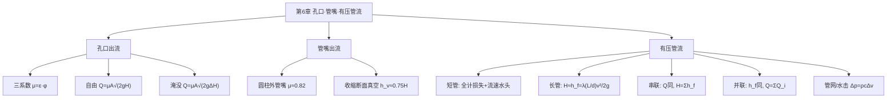

# 流体力学 · 第6章 · 孔口、管嘴流动与有压管流 · 素材

> 本章把第4章能量方程（伯努利方程）落到工程出流与管路计算上：从一个小孔的出流，到加一段短管的管嘴，再到整条有压管道、管网，逐级建立"水头 → 流速 → 流量"的定量关系。

## 复习要点 · LLM 协填

### 一、核心概念

- **孔口出流**：流体经容器壁上的孔口流出。按壁厚分**薄壁孔口**（壁厚不影响流束、只在孔缘接触）与**厚壁孔口**；按下游分**自由出流**（流入大气）与**淹没出流**（流入下游液体）。 *（要：判别用"出流去向"——入大气=自由，入液体=淹没）*
- **收缩断面**：流束流出孔口后因惯性继续收缩，在孔口下游约 0.5d 处达最小断面（收缩断面 c-c），该处流速最大、压强近似大气压。 *（要：能量方程与流量计算都取收缩断面）*
- **收缩系数 ε**：收缩断面面积 A_c 与孔口面积 A 之比 ε=A_c/A，薄壁圆孔约 0.64。 *（要：ε<1，是流量系数小于 1 的主因之一）*
- **流速系数 φ**：实际流速与理想流速之比 φ=v_c/√(2gH)=1/√(1+ζ)，薄壁圆孔约 0.97。 *（要：反映孔口局部阻力 ζ）*
- **流量系数 μ**：μ=εφ，把收缩与阻力一并计入，薄壁圆孔约 0.62。 *（要：μ=εφ 是孔口三系数的核心关系）*
- **管嘴出流**：在孔口外接一段长 3~4 倍孔径的短管（管嘴）。圆柱形外管嘴内部出现收缩断面后又充满管壁，**收缩断面处形成真空**，等效作用水头增大，故 μ_n≈0.82 > μ_孔口。 *（要：管嘴比同直径孔口流量大约 1.32 倍）*
- **管嘴内真空**：圆柱形外管嘴收缩断面真空度 h_v≈0.75H，故作用水头 H 不宜过大（H>9m 左右真空被破坏、退化为孔口出流）。 *（要：真空是管嘴增流的物理原因，也是其工作上限）*
- **有压管流（满管流）**：管道横断面被液体充满、压强一般不等于大气压、靠压差驱动。按损失计算方式分**短管**（局部损失、流速水头与沿程损失同量级，须全计）与**长管**（沿程损失占绝对主导，局部损失与流速水头可忽略）。 *（要：长管 L/d 很大时才成立，工程上常以 L/d>1000 为界）*
- **串联管道**：不同管径管段首尾相接，各段**流量相同**（连续性），总水头损失为各段之和 H=Σh_fi。 *（要：串联——流量同，损失加）*
- **并联管道**：两节点间多条管路并行，各支路**水头损失相等**（同起终点水头差），总流量为各支路之和 Q=ΣQ_i。 *（要：并联——损失同，流量分）*
- **管网**：枝状管网（无环、按节点流量平衡逐段推算）与环状管网（有环、需同时满足节点流量平衡 ΣQ=0 与环路水头平衡 Σh_f=0，常用哈代-克罗斯迭代）。 *（要：环网两大平衡条件）*
- **水击（水锤）**：有压管中流速骤变（如阀门快速关闭）引起压强急剧升降并沿管传播的现象。 *（要：直接水击 Δp=ρcΔv，c 为压力波速；危害大，须缓闭或设调压设施）*

### 二、关键公式 / 模型

| 公式 | 含义 |
|------|------|
| `μ = ε·φ` | 流量系数=收缩系数×流速系数 |
| `Q = μA√(2gH)` | 孔口自由出流（H 为孔心淹深） |
| `Q = μA√(2gΔH)` | 孔口淹没出流（ΔH 为上下游水位差） |
| `φ = 1/√(1+ζ)` | 流速系数与局部阻力系数关系 |
| `Q = μ_n·A√(2gH), μ_n≈0.82` | 圆柱形外管嘴出流 |
| `h_v ≈ 0.75H` | 圆柱形外管嘴收缩断面真空度 |
| `H = (1+Σζ+λL/d)·v²/(2g)` | 短管：作用水头=流速水头+局部+沿程 |
| `H = h_f = λ(L/d)·v²/(2g)` | 长管：作用水头≈沿程损失 |
| `串联 Q=常数, H=Σh_fi` | 串联管道关系 |
| `并联 h_f相同, Q=ΣQ_i` | 并联管道关系 |
| `Δp = ρcΔv` | 直接水击（瞬时关阀）压强升高 |

### 三、重要案例 / 例题

- 水箱侧壁薄壁圆孔出流，已知 H、A、μ 求 Q（μ=0.62）。
- 圆柱形外管嘴 vs 同径孔口：μ_n/μ≈0.82/0.62≈1.32，流量增大约三成。
- 长直输水管按长管公式由水位差 H 反求流速 v 与流量 Q。
- 串联管道按各段沿程损失叠加求总水头；并联管道按水头损失相等分配流量。

### 四、高频考点（速记）

1. 孔口三系数 ε、φ、μ 的定义与关系 μ=εφ，薄壁圆孔的典型值（0.64 / 0.97 / 0.62）
2. 自由出流与淹没出流的判别及作用水头（淹深 H vs 水位差 ΔH）
3. 收缩断面位置（约 0.5d）与其上压强近似大气压
4. 圆柱形外管嘴 μ_n≈0.82 大于孔口的物理原因（收缩断面真空）及作用水头上限
5. 短管与长管的判别与计算差异（是否计局部损失与流速水头）
6. 串联（流量相同、损失叠加）与并联（损失相等、流量分配）管道计算
7. 枝状与环状管网的平衡条件（节点流量平衡、环路水头平衡）
8. 水击概念、直接水击压强 Δp=ρcΔv 及其防护（缓闭阀、调压塔/室）

### 五、思考题 / 自测

- **Q**：为什么孔口的流量系数 μ 总是小于 1？
  **A**：因为存在收缩（ε<1）与局部阻力（φ<1）两重削减，μ=εφ，二者皆小于 1 故 μ<1，薄壁圆孔 μ≈0.64×0.97≈0.62。

- **Q**：同样的孔径与水头，为什么圆柱形外管嘴的流量比孔口大？
  **A**：管嘴内流束先收缩后又扩充满管，收缩断面处形成真空，相当于增大了出流的有效作用水头，故 μ_n≈0.82>μ_孔口≈0.62，流量增大约 1.32 倍。

- **Q**：长管计算为什么可以忽略局部损失与流速水头？
  **A**：长管 L/d 很大，沿程损失 h_f 随管长线性累积、量级远大于局部损失与流速水头（后两者只与 v²/2g 同量级），忽略后误差很小，使计算大为简化。

- **Q**：串联与并联管道在流量与水头损失上各有什么规律？
  **A**：串联——各段流量相同、总水头损失为各段之和；并联——各支路水头损失相等、总流量为各支路流量之和。

### 六、与前后章之关联

- **承前**：直接以第 4 章能量方程（伯努利方程）为基础，在收缩断面与出口断面间列能量方程导出出流公式；沿程与局部损失沿用第 5 章 h_f=λ(L/d)v²/2g 与 h_j=ζv²/2g。
- **启后**：有压管流的水头—流量关系是给水排水、水泵管路、水力机械等工程计算的直接基础；与第 7 章明渠（无压流）形成"有压/无压"两大流动类型的对照。

## 思维导图 · LLM 生成

### Mermaid（GitHub Markdown 可渲染）

