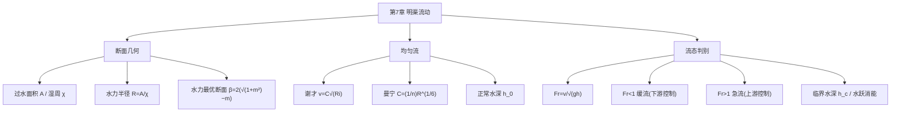

# 流体力学 · 第7章 · 明渠流动 · 素材

> 明渠流动是具有自由表面、靠重力沿底坡驱动的流动（河渠、排水沟、渡槽）。本章核心是均匀流的谢才公式、断面几何（水力半径、水力最优断面）与流态判别（弗劳德数、缓流/急流/临界流）。

## 复习要点 · LLM 协填

### 一、核心概念

- **明渠流动**：具有**自由表面**（表面压强为大气压）、靠**重力**沿渠底坡降驱动的流动。与有压管流的本质区别在于有无自由面。 *（要：自由表面+重力驱动=明渠；满管+压差驱动=有压管）*
- **棱柱形渠道**：断面形状与尺寸沿程不变的渠道（如矩形、梯形、圆形）。 *（要：棱柱形渠道才可能形成均匀流）*
- **过水断面 A**：垂直于流动方向、被水充满的断面面积。 *（要：随水深变化）*
- **湿周 χ**：过水断面上固体边界与水接触的周长（不含自由水面）。 *（要：自由水面不算湿周）*
- **水力半径 R**：R=A/χ，过水断面面积与湿周之比，是综合反映断面输水能力的几何量。 *（要：R 越大，过流能力越强）*
- **底坡 i**：渠底沿流向的高程降落率 i=sinθ≈tanθ（小坡）。 *（要：均匀流时水面坡=水力坡=底坡）*
- **均匀流**：水深、断面、流速沿程不变的明渠流，须棱柱形渠道、恒定流量、正坡且足够长。此时重力分量与摩阻平衡。 *（要：均匀流水深称正常水深 h_0）*
- **谢才公式**：明渠（及有压管）均匀流基本经验公式 v=C√(Ri)，流量 Q=AC√(Ri)。 *（要：明渠均匀流计算的核心式）*
- **谢才系数 C / 曼宁公式**：C=(1/n)R^(1/6)（曼宁/Manning），n 为渠床糙率系数（光滑混凝土约 0.013，土渠约 0.025）。 *（要：n 越大越粗糙、流速越小）*
- **水力最优断面**：过水面积一定时，使湿周最小（水力半径最大、过流能力最强）的断面。半圆形最优；梯形最优边坡满足 β=b/h=2(√(1+m²)−m)。 *（要：最优=湿周最小=R 最大）*
- **弗劳德数 Fr**：Fr=v/√(gh̄)（h̄ 为平均水深），惯性力与重力之比，用于判别流态。 *（要：Fr 是明渠流态的判据，类比管流的雷诺数）*
- **流态：缓流 / 临界流 / 急流**：Fr<1 缓流（下游扰动可上溯，受下游控制）；Fr=1 临界流；Fr>1 急流（扰动不能上溯，受上游控制）。 *（要：缓流受下游控制、急流受上游控制）*
- **临界水深 h_c**：使 Fr=1 的水深，矩形渠 h_c=∛(αq²/g)（q 为单宽流量）。 *（要：实际水深>h_c 为缓流，<h_c 为急流）*
- **水跃**：急流过渡到缓流时水面骤然跃升、伴随强烈紊动与能量损失的局部现象。 *（要：消能工的常见形式）*

### 二、关键公式 / 模型

| 公式 | 含义 |
|------|------|
| `R = A/χ` | 水力半径=过水面积/湿周 |
| `v = C√(Ri)` | 谢才公式（流速） |
| `Q = AC√(Ri)` | 谢才公式（流量） |
| `C = (1/n)R^(1/6)` | 曼宁公式求谢才系数 |
| `矩形 A=bh, χ=b+2h` | 矩形渠几何量 |
| `梯形 A=(b+mh)h, χ=b+2h√(1+m²)` | 梯形渠几何量（m 为边坡系数） |
| `Fr = v/√(g·h̄)` | 弗劳德数，判别流态 |
| `h_c = ∛(αq²/g)` | 矩形渠临界水深（q=Q/b 单宽流量） |
| `β = b/h = 2(√(1+m²)−m)` | 水力最优梯形断面宽深比 |

### 三、重要案例 / 例题

- 矩形渠已知 b、h、i、n，用谢才—曼宁公式求 Q。
- 由所得 v、h 计算 Fr 判别缓流/急流。
- 梯形渠按水力最优条件 β=2(√(1+m²)−m) 设计断面尺寸。
- 矩形渠由单宽流量 q 求临界水深 h_c，并与实际水深比较判别流态。

### 四、高频考点（速记）

1. 明渠流动与有压管流的本质区别（自由表面、重力驱动）
2. 过水断面 A、湿周 χ、水力半径 R=A/χ 的定义与计算（矩形、梯形）
3. 谢才公式 v=C√(Ri)、Q=AC√(Ri) 及各量意义
4. 曼宁公式 C=(1/n)R^(1/6) 与糙率 n 的影响
5. 均匀流条件与正常水深 h_0
6. 水力最优断面概念，梯形最优宽深比 β=2(√(1+m²)−m)
7. 弗劳德数 Fr=v/√(gh) 与缓流/临界流/急流判别（含上下游控制）
8. 临界水深 h_c 的计算与水跃消能

### 五、思考题 / 自测

- **Q**：明渠流动与有压管流的根本区别是什么？
  **A**：明渠有自由表面（表面为大气压）、靠重力沿底坡驱动；有压管满管无自由面、靠压差驱动。故明渠水深可变、断面随之变化，是其计算的特殊性所在。

- **Q**：水力半径为什么能综合反映断面的过流能力？
  **A**：R=A/χ 把"过水面积大（输水多）"与"湿周小（摩阻边界少）"两个有利因素合为一个指标，R 越大代表单位阻力边界承担的过水面积越大、过流能力越强，故谢才公式以 R 为特征长度。

- **Q**：弗劳德数 Fr 的物理意义？缓流与急流有何控制特征？
  **A**：Fr=v/√(gh) 表惯性力与重力之比，也等于流速与微幅重力波波速之比。Fr<1（缓流）时扰动波能向上游传播，水流受下游边界条件控制；Fr>1（急流）时扰动不能上溯，受上游控制；Fr=1 为临界流。

- **Q**：为什么半圆形是水力最优断面？
  **A**：过水面积一定时，半圆形的湿周最短，水力半径 R=A/χ 最大，谢才公式给出的输水能力最强。工程上因施工与稳定原因多用接近最优的梯形断面，其最优宽深比 β=2(√(1+m²)−m)。

### 六、与前后章之关联

- **承前**：沿用第 5 章沿程损失思想（均匀流时重力分量与摩阻平衡，水力坡 J=底坡 i），谢才公式与达西公式同源；过水断面、流量等概念来自第 3 章运动学。
- **启后**：明渠（无压、重力驱动）与第 6 章有压管流（满管、压差驱动）构成水力学两大流动类型，共同支撑给水排水、河道与水利工程的水力计算，是全课工程应用的收口。

## 思维导图 · LLM 生成

### Mermaid（GitHub Markdown 可渲染）

