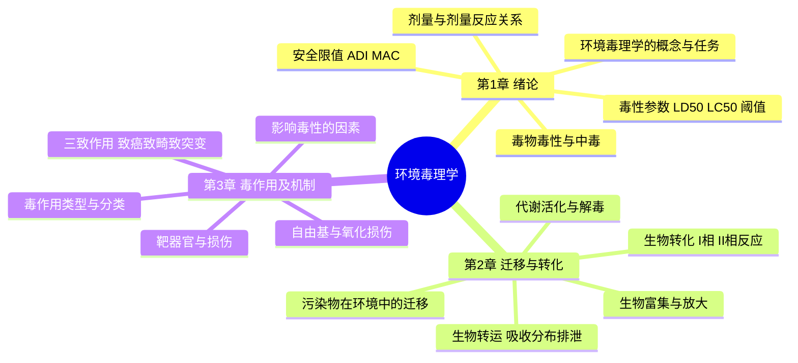
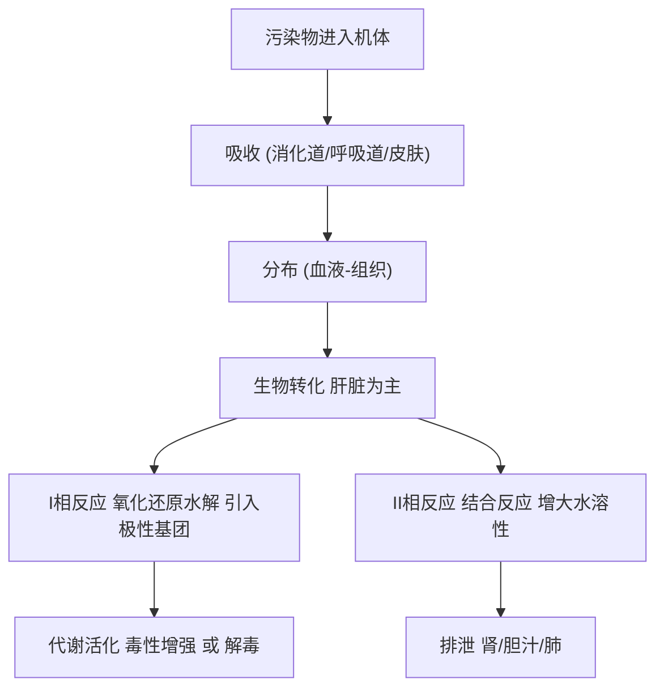
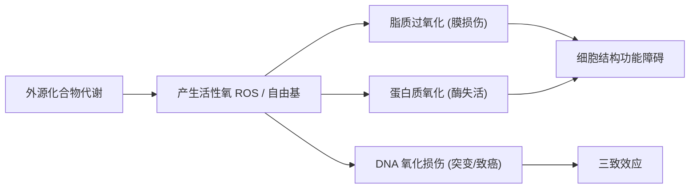
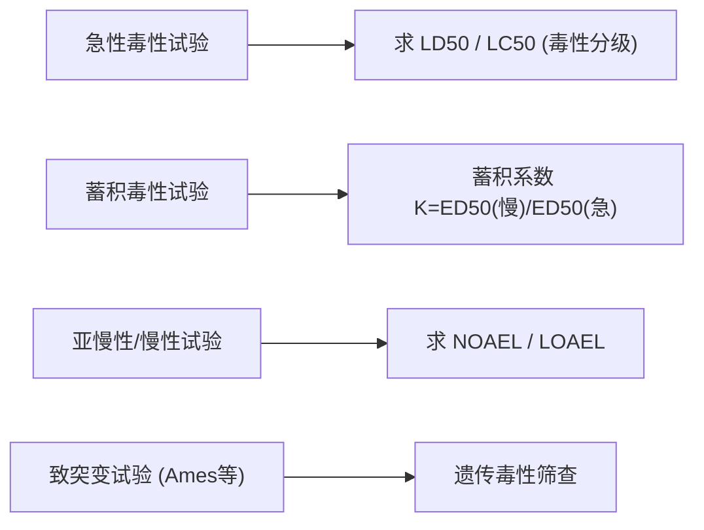

# 环境毒理学 · 核心例题精解 · 图示深化

> 本篇为**深化层**：在「最终复习资料」之上，逐章给出**名词解释 / 简答 / 计算例题 + 参考答案**，并配**思维导图 / 机制示意图**（mermaid 矢量图，非纯文字）。
> 毒理计算遵循"先判指标 → 列公式 → 代入数据 → 得值与毒性分级"四步。

---

## 全课知识结构 · 思维导图

---

## 第 1 章 · 绪论与基本概念

### 原理示意 · 剂量–反应关系

### 例题 1-1（名词解释）
**题**：解释 LD₅₀、阈剂量、最大无作用剂量（NOAEL）。
**参考答案**：
- **LD₅₀（半数致死剂量）**：引起一群受试动物**半数（50%）死亡**所需的剂量，单位 $\mathrm{mg/kg}$；数值越小，**急性毒性越强**。
- **阈剂量（最小有作用剂量 LOAEL）**：能引起机体**可观察到的有害效应**的最低剂量。
- **最大无作用剂量（NOAEL）**：在规定条件下，**未观察到任何有害效应**的最高剂量，是制定安全限值的基础。

### 例题 1-2（简答）
**题**：剂量–效应关系与剂量–反应关系有何区别？
**参考答案**：
- **剂量–效应关系**：剂量与**个体（或器官）某一量化效应强度**（如酶活性、体重变化）的关系，纵轴是**计量资料**。
- **剂量–反应关系**：剂量与**群体中出现某一质反应的个体比例**（如死亡率%）的关系，纵轴是**计数/百分率**，曲线常呈 **S 形**。

### 例题 1-3（计算 · 安全限值）
**题**：某农药动物实验得 $\mathrm{NOAEL}=10\ \mathrm{mg/(kg\cdot d)}$，取安全系数 $SF=100$。求每日允许摄入量 ADI；若成人体重 $60\ \mathrm{kg}$，求每日允许总摄入量。
**解**：
1. $\mathrm{ADI}=\dfrac{\mathrm{NOAEL}}{SF}=\dfrac{10}{100}=0.1\ \mathrm{mg/(kg\cdot d)}$。
2. 每日允许总量 $=\mathrm{ADI}\times BW=0.1\times 60=6\ \mathrm{mg/d}$。

$$\boxed{\mathrm{ADI}=0.1\ \mathrm{mg/(kg\cdot d)},\quad 每日允许总摄入\approx 6\ \mathrm{mg/d}}$$

---

## 第 2 章 · 污染物在环境中（机体内）的迁移与转化

### 原理示意 · 生物转运与生物转化

### 例题 2-1（名词解释）
**题**：解释生物转化的 I 相与 II 相反应；什么是"代谢活化"？
**参考答案**：
- **I 相反应**：**氧化、还原、水解**，向分子引入或暴露 $-OH$、$-NH_2$、$-COOH$ 等极性基团（主力为肝微粒体 **细胞色素 P450** 系统）。
- **II 相反应**：**结合反应**（与葡萄糖醛酸、硫酸、谷胱甘肽等结合），显著增大**水溶性**，利于排泄、通常降低毒性。
- **代谢活化**：少数外源化合物经生物转化后**毒性反而增强**（生成活性中间体，如苯并芘经 P450 活化为致癌的环氧化物），称代谢活化（生物活化）。

### 例题 2-2（计算 · 生物富集系数 BCF）
**题**：某有机污染物在水中浓度 $C_w=0.5\ \mathrm{\mu g/L}$，鱼体内浓度 $C_b=2500\ \mathrm{\mu g/kg}$。求生物富集系数 BCF（设 $1\ \mathrm{L}$ 水 $\approx 1\ \mathrm{kg}$）。
**解**：$BCF=\dfrac{C_b}{C_w}=\dfrac{2500}{0.5}=5000$。

$$\boxed{BCF=5000\ (\text{属高富集物质，}BCF>1000)}$$
> 提示：BCF 越大，沿食物链**生物放大**风险越高，脂溶性强、难降解物（如 DDT、PCBs）尤甚。

### 例题 2-3（简答）
**题**：什么是生物富集、生物积累与生物放大？
**参考答案**：
- **生物富集**：生物**直接从环境介质**（水/土）中摄取并蓄积污染物，使体内浓度高于环境。
- **生物积累**：生物在**整个生长期**内通过环境与食物**持续蓄积**，浓度随时间升高。
- **生物放大**：污染物沿**食物链/食物网**逐营养级传递，**高营养级生物体内浓度显著高于低营养级**。

---

## 第 3 章 · 毒作用及其机制

### 原理示意 · 自由基氧化损伤链

### 例题 3-1（名词解释）
**题**：什么是"三致作用"？三者的关系如何？
**参考答案**：指外源化合物的**致突变（致畸前提）、致癌、致畸**作用。
- **致突变**：引起遗传物质 DNA 结构或数量改变；
- **致癌**：诱发细胞恶性转化形成肿瘤；
- **致畸**：作用于胚胎发育导致后代畸形。
关系：**致突变常是致癌、致畸的分子基础**（体细胞突变→致癌；生殖细胞/胚胎期突变→致畸或遗传损害），故三者机制相互关联。

### 例题 3-2（简答）
**题**：影响化学物质毒性的主要因素有哪些？
**参考答案**：① **化学物质因素**（结构、理化性质、纯度、脂/水溶性）；② **机体因素**（种属、性别、年龄、营养与健康、遗传与个体差异）；③ **接触条件**（剂量、途径、期限与频率）；④ **环境因素**（温度、湿度）；⑤ **联合作用**（相加、协同、拮抗、独立）。

### 例题 3-3（计算 · 联合毒性判别）
**题**：A、B 两毒物单独 LD₅₀ 分别为 $200$、$300\ \mathrm{mg/kg}$。混合后实测混合物 LD₅₀ 使等毒性配比下"相加预期"明显偏离：实测联合毒性指数 $K=\dfrac{\text{预期等效剂量}}{\text{实测等效剂量}}=2.0$。判断联合作用类型。
**解**：以相加作用为基准（$K\approx1$）：
- $K>1$（实测毒性 **强于** 相加预期）→ **协同作用**；
- $K<1$ → **拮抗作用**；
- $K\approx1$ → **相加作用**。
本题 $K=2.0>1$。

$$\boxed{K=2.0>1\ \Rightarrow\ \text{协同作用（毒性增强）}}$$

---

## 第 4–5 章 · 毒作用影响因素与常用实验方法

### 流程示意 · 毒性测试与终点

### 例题 4-1（计算 · 蓄积系数）
**题**：某物质一次染毒 $LD_{50(急)}=100\ \mathrm{mg/kg}$；多次小剂量累积致半数死亡的总量 $ED_{50(累)}=300\ \mathrm{mg/kg}$。求蓄积系数 $K$ 并判断蓄积性。
**解**：$K=\dfrac{ED_{50(累)}}{LD_{50(急)}}=\dfrac{300}{100}=3$。判别标准：$K<1$ 高度蓄积，$1\le K<3$ 中等，$3\le K<5$ 轻度，$K\ge5$ 蓄积不明显。

$$\boxed{K=3\ \Rightarrow\ \text{轻度蓄积（处于轻度下限）}}$$

### 例题 5-1（简答）
**题**：Ames 试验的原理是什么？用于检测何种毒性？
**参考答案**：Ames 试验以**鼠伤寒沙门氏菌组氨酸缺陷型突变株**为指示菌：受试物若有**致突变性**，可使菌株发生**回复突变**，恢复自行合成组氨酸的能力而在缺组氨酸培养基上生长成菌落，菌落数显著增多即为阳性。常加**S9 肝匀浆**模拟体内代谢活化。主要用于**致突变**（间接预测致癌）的快速筛查。

---

## 第 6–7 章 · 健康危险度评价与致癌物

### 流程示意 · 健康危险度评价四步法

### 例题 6-1（计算 · 致癌风险）
**题**：某致癌物经口斜率因子 $SF=0.5\ \mathrm{(mg/(kg\cdot d))^{-1}}$，人群终生日均暴露量 $ADD=2\times10^{-5}\ \mathrm{mg/(kg\cdot d)}$。求终生超额致癌风险 $R$，并对照可接受水平（$10^{-6}\!\sim\!10^{-4}$）判断。
**解**：低剂量近似 $R=SF\times ADD=0.5\times 2\times10^{-5}=1\times10^{-5}$。

$$\boxed{R=1\times10^{-5}\ \in[10^{-6},10^{-4}]\ \text{(处于可接受区间内)}}$$

### 例题 6-2（计算 · 非致癌危害商 HQ）
**题**：某非致癌物参考剂量 $RfD=0.02\ \mathrm{mg/(kg\cdot d)}$，实际日均暴露量 $ADD=0.05\ \mathrm{mg/(kg\cdot d)}$。求危害商 $HQ$ 并判断风险。
**解**：$HQ=\dfrac{ADD}{RfD}=\dfrac{0.05}{0.02}=2.5$。$HQ>1$ 表示暴露超过参考剂量，**存在非致癌健康风险**。

$$\boxed{HQ=2.5>1\ \Rightarrow\ \text{有非致癌风险，需采取控制措施}}$$

### 例题 7-1（简答）
**题**：常见化学致癌物可分为哪几类？举例说明"间接致癌物"。
**参考答案**：按作用方式分**直接致癌物**（无需代谢活化即可致癌，如某些烷化剂）、**间接致癌物（前致癌物）**（须经体内代谢活化为终致癌物，如**苯并[a]芘**经 P450 活化、**黄曲霉毒素 B₁**、亚硝胺类）、**促癌物**（本身不致癌但促进肿瘤发展，如 TPA、苯巴比妥）。间接致癌物的典型代表是**苯并[a]芘**：经代谢活化生成二氢二醇环氧化物，与 DNA 共价结合形成加合物而引发突变。

---

> **正言若反**：参数不离机制，机制不离剂量，剂量不离原始 PDF 课件之图表数据。本篇为"算得出、答得上"的一层；遇疑，回归「最终复习资料」与逐页 PDF 原文核对实验条件与单位。
