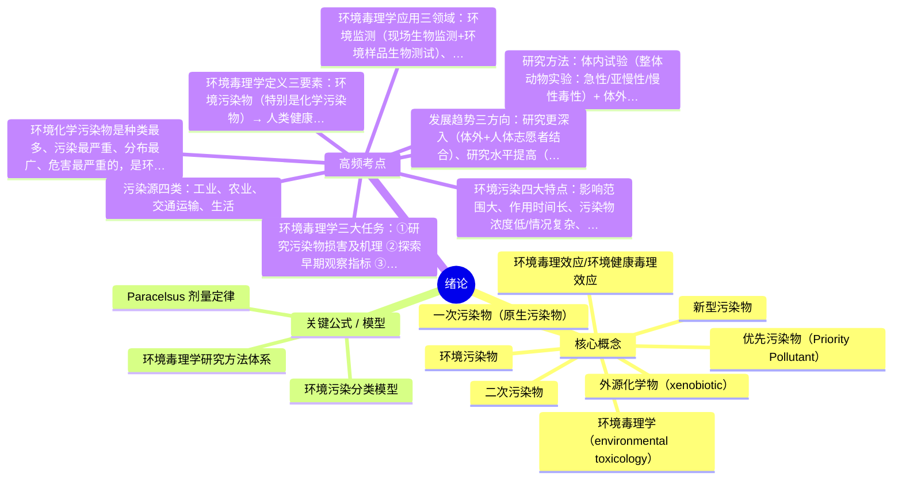
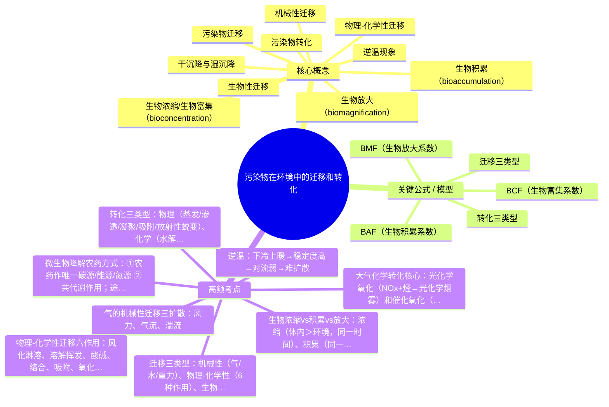
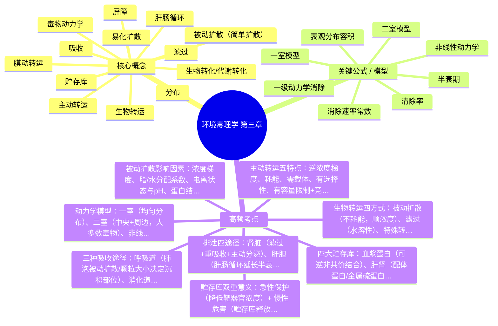
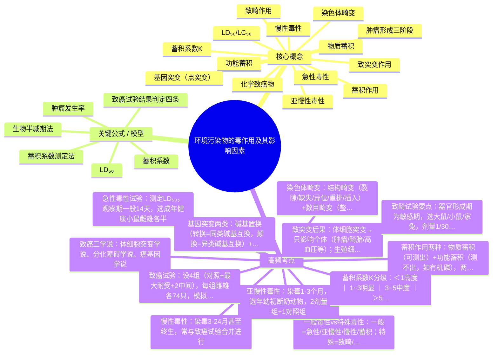
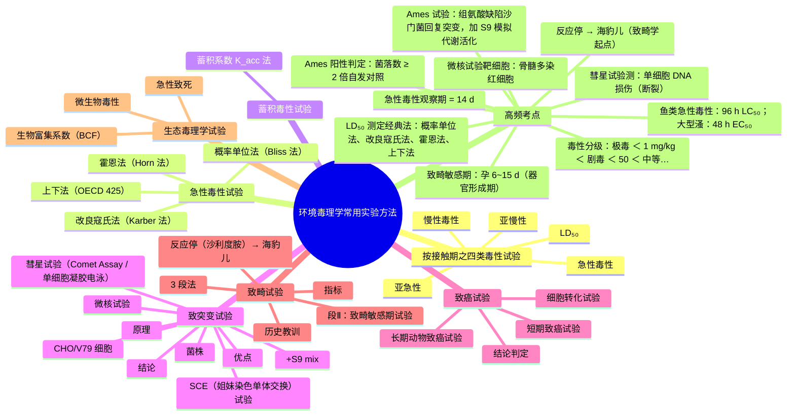
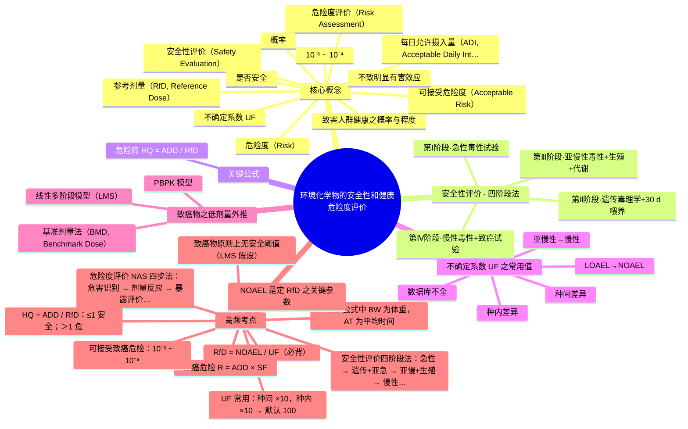
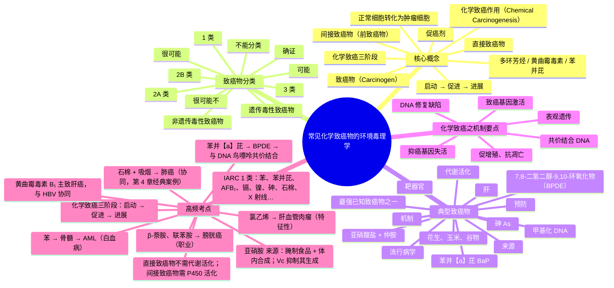

# 环境毒理学 · 综合复习资料

> 教师: 森巴提·叶尔肯 · 学期: 2026春
> 链路：原始 PDF → 页图集（多图提取）→ 章节图谱 → LLM 协填要点 → 思维导图 → **本资料**
> 完成度：复习要点 **7/7** 章 · 嵌入子图 **0** 张 · 思维导图 **7/7** 章

---

## 一 · 章级入口

| 章 | 标题 | 主版页 | 子图 | 要点 | 图谱 | 素材 |
| ---: | ---- | -----: | ---: | :--: | :--: | ---- |
| 1 | 绪论 | 40 | 0 | ✓ | ✓ | [_第01章_绪论.md](./_第01章_绪论.md) |
| 2 | 污染物在环境中的迁移和转化 | 35 | 0 | ✓ | ✓ | [_第02章_污染物在环境中的迁移和转化.md](./_第02章_污染物在环境中的迁移和转化.md) |
| 3 | 环境毒理学 第三章 | 51 | 0 | ✓ | ✓ | [_第03章_环境毒理学_第三章.md](./_第03章_环境毒理学_第三章.md) |
| 4 | 环境污染物的毒作用及其影响因素 | 82 | 0 | ✓ | ✓ | [_第04章_环境污染物的毒作用及其影响因素.md](./_第04章_环境污染物的毒作用及其影响因素.md) |
| 5 | 环境毒理学常用实验方法 | 82 | 0 | ✓ | ✓ | [_第05章_环境毒理学常用实验方法.md](./_第05章_环境毒理学常用实验方法.md) |
| 6 | 环境化学物的安全性和健康危险度评价 | 52 | 0 | ✓ | ✓ | [_第06章_环境化学物的安全性和健康危险度评价.md](./_第06章_环境化学物的安全性和健康危险度评价.md) |
| 7 | 常见化学致癌物的环境毒理学 | 52 | 0 | ✓ | ✓ | [_第07章_常见化学致癌物的环境毒理学.md](./_第07章_常见化学致癌物的环境毒理学.md) |

## 二 · 全章综合汇编

### 第 1 章 · 绪论

> 素材：[_第01章_绪论.md](./_第01章_绪论.md) · 主版 40 页

#### 一、核心概念（名词解释）

- [x] **环境毒理学（environmental toxicology）**：研究环境物理性、化学性和生物污染物，特别是环境化学性污染物对人类健康的毒性作用及其机理的科学。也称"环境健康毒理学"。
- [x] **环境污染物**：由于人为或自然原因进入环境并使环境的正常组成和性质发生改变、直接或间接有害于人类与其他生物的物质。
- [x] **一次污染物（原生污染物）**：由污染源直接排入环境，其物理和化学性状未发生变化的污染物。
- [x] **二次污染物**：一次污染物之间或与正常大气组分发生化学反应（含光化学反应）而产生的新污染物，常比一次污染物危害更严重。
- [x] **优先污染物（Priority Pollutant）**：在众多污染物中筛选出的潜在危险大的作为优先研究和控制对象的污染物，亦称优先控制污染物。针对有毒有机化学污染物、生物难降解性物质、具有生物积累性、三致性（致畸、致癌、致突变）的污染物。
- [x] **外源化学物（xenobiotic）**：不是人体组成成分，也非人体所需营养物质，但可通过一定途径与人体接触并从环境中进入人体，产生一定生物学作用的物质。
- [x] **新型污染物**：在环境中出现时间相对较短，或过去未被广泛关注但逐渐被认识到对生态环境和人体健康具有潜在危害的污染物。特点：持久性、生物累积性、潜在危害大、来源广泛。包括持久性有机污染物、内分泌干扰物、抗生素、微型塑料等。
- [x] **环境毒理效应/环境健康毒理效应**：环境污染物对人类健康的效应，属于"健康毒理效应"的范畴。

#### 二、关键公式 / 模型

- **Paracelsus 剂量定律**："所有物质都是毒物，没有物质不是毒物，唯一的区别是它们的剂量"——抛开剂量谈毒性都是耍流氓。这是毒理学最根本的原理。
- **环境污染分类模型**：按污染物性质→化学污染、物理污染、生物污染；按污染物形态→废气、废水、固体废弃物、噪声、辐射污染。
- **环境毒理学研究方法体系**：体内试验（in vivo）+ 体外试验（in vitro）+ 流行病学调查，三个层次互补。

#### 三、重要案例 / 实验 / 例题

- **八大公害事件**（必考）：
  1. 1930 马斯河谷事件（SO₂/氟化物/粉尘，死亡60人）
  2. 1948 多诺拉城事件（SO₂/金属粉尘，死亡17人）
  3. 1956 伦敦烟雾事件（SO₂/烟尘，4000余人死亡）
  4. 1943 洛杉矶光化学烟雾事件（光化学烟尘，半数人患红眼病）
  5. 1955 富山县痛痛病事件（镉，患病258人死128人）
  6. 1953 水俣病/新泻事件（甲基汞，患病2000余人死352人）
  7. 1968 米糠油事件（多氯联苯，中毒1684人死30余人）
  8. 1960 四日市哮喘事件（SO₂/烟尘/石油化工废气，患病800余人死36人）
- **毒理学发展史关键人物**：Paracelsus（提出毒物是化学物+剂量定律）、Orifila（现代毒理学奠基人）、Bernard（开创动物受控实验）。
- **中国水中优先控制污染物黑名单**：卤代烃、苯系物、氯代苯类、多氯联苯类、酚类、硝基苯类、苯胺类、多环芳烃、酞酸酯类、农药、丙烯腈、亚硝胺类、氰化物、重金属及其化合物。

#### 四、高频考点（速记）

1. 环境毒理学定义三要素：**环境污染物**（特别是化学污染物）→ **人类健康** → **毒性作用及机理**
2. 环境化学污染物是**种类最多、污染最严重、分布最广、危害最严重**的，是环境毒理学**主要研究对象**，简称环境化学物
3. 污染源四类：**工业、农业、交通运输、生活**
4. 环境污染四大特点：**影响范围大、作用时间长、污染物浓度低/情况复杂、污染容易治理难**
5. 环境毒理学三大任务：①研究污染物损害及机理 ②探索早期观察指标 ③定量评定影响（为制定卫生标准提供依据）
6. 研究方法：**体内试验**（整体动物实验：急性/亚慢性/慢性毒性）+ **体外试验**（器官/组织/细胞/亚细胞/分子水平）+ **流行病学调查**
7. 环境毒理学应用三领域：**环境监测**（现场生物监测+环境样品生物测试）、**环境风险评价**（建设项目+化学物品）、**环境健康危险度评价**
8. 发展趋势三方向：研究更深入（体外+人体志愿者结合）、研究水平提高（生物标记物等）、多种方法结合评价

#### 五、思考题 / 自测

- [x] 题：环境毒理学的研究对象是什么？ 答：B.环境污染物（包括物理性、化学性、生物性及新型污染物，以环境化学物为主）
- [x] 题：环境污染的特点？ 答：ABCD全选——影响范围大、作用时间长、浓度低/情况复杂、污染容易治理难
- [x] 题：一次污染物与二次污染物的区别？ 答：一次污染物直接排放、性状未变；二次污染物是一次污染物经化学反应（含光化学反应）产生的新污染物，危害通常更严重
- [x] 题：为什么环境化学污染物是环境毒理学的主要研究对象？ 答：种类最多、污染最严重、分布最广、对人类健康危害最严重

#### 六、与前后章之关联

- 承前章：本章为绪论，奠定基本概念框架
- 启后章：第2章"污染物在环境中的迁移和转化"深入讨论污染物在环境中的行为；第3-4章讨论毒作用及影响因素；第5章讨论实验方法；第6-7章讨论安全评价与致癌物

<details><summary>🧠 思维导图（markmap / mermaid）</summary>

### Markmap（Typora / markmap.js / Obsidian 可渲染）

```markmap
# 绪论
## 核心概念
- 环境毒理学（environmental toxicology）
- 环境污染物
- 一次污染物（原生污染物）
- 二次污染物
- 优先污染物（Priority Pollutant）
- 外源化学物（xenobiotic）
- 新型污染物
- 环境毒理效应/环境健康毒理效应
## 关键公式 / 模型
- Paracelsus 剂量定律
- 环境污染分类模型
- 环境毒理学研究方法体系
## 高频考点
- 环境毒理学定义三要素：环境污染物（特别是化学污染物）→ 人类健康 → 毒性作用及机理
- 环境化学污染物是种类最多、污染最严重、分布最广、危害最严重的，是环境毒理学主要研究对象，简称环境化学物
- 污染源四类：工业、农业、交通运输、生活
- 环境污染四大特点：影响范围大、作用时间长、污染物浓度低/情况复杂、污染容易治理难
- 环境毒理学三大任务：①研究污染物损害及机理 ②探索早期观察指标 ③定量评定影响（为制定卫生标准提供依据）
- 研究方法：体内试验（整体动物实验：急性/亚慢性/慢性毒性）+ 体外试验（器官/组织/细胞/亚细胞/分子水平）+ 流行病学
- 环境毒理学应用三领域：环境监测（现场生物监测+环境样品生物测试）、环境风险评价（建设项目+化学物品）、环境健康危险度评价
- 发展趋势三方向：研究更深入（体外+人体志愿者结合）、研究水平提高（生物标记物等）、多种方法结合评价
```

### Mermaid（GitHub Markdown 可渲染）



</details>

---

### 第 2 章 · 污染物在环境中的迁移和转化

> 素材：[_第02章_污染物在环境中的迁移和转化.md](./_第02章_污染物在环境中的迁移和转化.md) · 主版 35 页

#### 一、核心概念（名词解释）

- [x] **污染物迁移**：污染物在环境中发生的空间位置相对改变的过程
- [x] **污染物转化**：污染物在环境中通过物理、化学或生物学作用改变形态或转变为另一种物质的过程
- [x] **机械性迁移**：通过气（扩散+气流搬运）、水、重力等物理作用使污染物空间位移
- [x] **物理-化学性迁移**：通过风化淋溶、溶解挥发、酸碱、络合、吸附、氧化-还原等物化作用实现迁移
- [x] **生物性迁移**：污染物通过生物体吸附、吸收、代谢或死亡等过程发生的迁移，表现为生物浓缩、生物积累、生物放大
- [x] **生物浓缩/生物富集（bioconcentration）**：生物体内污染物浓度超出环境中浓度的现象
- [x] **生物积累（bioaccumulation）**：同一生物随生长发育，浓缩系数不断增大
- [x] **生物放大（biomagnification）**：同一食物链上，污染物浓度随营养级提高而逐步增大
- [x] **逆温现象**：对流层中上层暖下层冷，大气稳定度高，对流弱，污染物难扩散（秋冬北方雾霾成因之一）
- [x] **干沉降与湿沉降**：大气颗粒物消除过程，按是否需降水冲刷分为干沉降和湿沉降

#### 二、关键公式 / 模型

- **BCF（生物富集系数）** = 生物体内浓度(mg/kg) / 环境中浓度(mg/kg)
- **BAF（生物积累系数）** = 发育后阶段体内浓度 / 发育前阶段体内浓度
- **BMF（生物放大系数）** = 较高营养级浓度 / 较低营养级浓度
- **迁移三类型**：机械性 → 物理-化学性 → 生物性（递进）
- **转化三类型**：物理转化 → 化学转化 → 生物转化

#### 三、重要案例 / 实验 / 例题

- **汞的迁移转化**：Hg进入环境→水体大气扩散→形态变化→Hg⁺/甲基汞/二甲基汞（甲基汞致水俣病）
- **DDT生物放大**：水中0.000003ppm→浮游生物0.04→小鱼0.5→大鱼2→食鱼鸟25ppm，放大一千万倍
- **洛杉矶光化学烟雾**：NOx+碳氢化物→光化学烟雾（二次污染物典型）
- **酸雨形成**：SO₂→氧化→SO₃→水→H₂SO₄/硫酸盐→酸雨酸雾

#### 四、高频考点（速记）

1. 迁移三类型：**机械性**（气/水/重力）、**物理-化学性**（6种作用）、**生物性**（浓缩/积累/放大）
2. 气的机械性迁移三扩散：**风力、气流、湍流**
3. 物理-化学性迁移六作用：**风化淋溶、溶解挥发、酸碱、络合、吸附、氧化-还原**
4. 逆温：**下冷上暖**→稳定度高→对流弱→**难扩散**
5. 生物浓缩vs积累vs放大：**浓缩**（体内>环境，同一时间）、**积累**（同一生物随时间增大）、**放大**（食物链随营养级增大）
6. 转化三类型：**物理**（蒸发/渗透/凝聚/吸附/放射性蜕变）、**化学**（水解/氧化还原/络合/光化学）、**生物**（微生物/植物/动物降解）
7. 大气化学转化核心：**光化学氧化**（NOx+烃→光化学烟雾）和**催化氧化**（SO₂→SO₃→酸雨）
8. 微生物降解农药方式：①农药作唯一碳源/能源/氮源 ②共代谢作用；途径：脱卤、脱烃、水解、氧化、还原、环裂解、缩合

#### 五、思考题 / 自测

- [x] 题：污染物迁移方式包括？ 答：ABC——机械性、物理-化学性、生物性（无"随机迁移"）
- [x] 题：气的机械性迁移=扩散+气流搬运？ 答：A.✓
- [x] 题：逆温发生后大气稳定度低？ 答：B.×（逆温时稳定度**高**，对流弱）
- [x] 题：无机化合物常见迁移方式？ 答：ABC——吸附-解吸、氧化-还原、络合和螯合（生化分解属有机）
- [x] 题：属于二次污染物的是？ 答：C.光化学烟雾（NOx、SO₂、CO均为一次污染物）

#### 六、与前后章之关联

- 承前章：第1章定义了污染物基本概念，本章深入讨论其在环境中的行为
- 启后章：第3章讨论污染物进入生物体内的毒作用机制；第4章讨论毒作用影响因素；迁移转化是毒作用的前提

<details><summary>🧠 思维导图（markmap / mermaid）</summary>

### Markmap（Typora / markmap.js / Obsidian 可渲染）

```markmap
# 污染物在环境中的迁移和转化
## 核心概念
- 污染物迁移
- 污染物转化
- 机械性迁移
- 物理-化学性迁移
- 生物性迁移
- 生物浓缩/生物富集（bioconcentration）
- 生物积累（bioaccumulation）
- 生物放大（biomagnification）
- 逆温现象
- 干沉降与湿沉降
## 关键公式 / 模型
- BCF（生物富集系数）
- BAF（生物积累系数）
- BMF（生物放大系数）
- 迁移三类型
- 转化三类型
## 高频考点
- 迁移三类型：机械性（气/水/重力）、物理-化学性（6种作用）、生物性（浓缩/积累/放大）
- 气的机械性迁移三扩散：风力、气流、湍流
- 物理-化学性迁移六作用：风化淋溶、溶解挥发、酸碱、络合、吸附、氧化-还原
- 逆温：下冷上暖→稳定度高→对流弱→难扩散
- 生物浓缩vs积累vs放大：浓缩（体内>环境，同一时间）、积累（同一生物随时间增大）、放大（食物链随营养级增大）
- 转化三类型：物理（蒸发/渗透/凝聚/吸附/放射性蜕变）、化学（水解/氧化还原/络合/光化学）、生物（微生物/植物/动物降
- 大气化学转化核心：光化学氧化（NOx+烃→光化学烟雾）和催化氧化（SO₂→SO₃→酸雨）
- 微生物降解农药方式：①农药作唯一碳源/能源/氮源 ②共代谢作用；途径：脱卤、脱烃、水解、氧化、还原、环裂解、缩合
```

### Mermaid（GitHub Markdown 可渲染）



</details>

---

### 第 3 章 · 环境毒理学 第三章

> 素材：[_第03章_环境毒理学_第三章.md](./_第03章_环境毒理学_第三章.md) · 主版 51 页

#### 一、核心概念（名词解释）

- [x] **生物转运**：环境污染物经各种途径和方式同生物体接触而被吸收、分布和排泄等过程的总称（反复通过生物膜）
- [x] **生物转化/代谢转化**：化学物在组织细胞中发生的结构和性质的变化过程
- [x] **被动扩散（简单扩散）**：物质从高浓度→低浓度透过生物膜，纯物理过程，不耗能
- [x] **滤过**：水溶性毒物随水分子经生物膜孔状结构透过，动力为流体静压差和渗透压差
- [x] **主动转运**：载体参与下逆浓度梯度转运，需耗能，有选择性、容量限制、竞争性抑制
- [x] **易化扩散**：载体介导顺浓度梯度转运，不耗能，不能逆浓度
- [x] **膜动转运**：颗粒物/大分子通过膜变形移动摄入（胞吞/胞吐）
- [x] **吸收**：污染物通过接触部位透过生物膜进入血液循环的过程
- [x] **分布**：毒物进入血液后通过血流分布全身的过程
- [x] **屏障**：血脑屏障、胎盘屏障等阻碍外源化学物转运的体内特殊结构
- [x] **贮存库**：毒物与血浆蛋白/组织成分结合积聚的特定部位（血浆蛋白、肝肾、脂肪、骨骼）
- [x] **肝肠循环**：脂溶性毒物在小肠被重吸收经门静脉回肝再随胆汁分泌，延长半衰期、加大毒性
- [x] **毒物动力学**：运用数学方法定量研究毒物吸收、分布、排泄和代谢转化随时间动态变化的规律

#### 二、关键公式 / 模型

- **一级动力学消除**：dD/dt = -KD，D = D₀·e^(-kt)，lgD = lgD₀ - kt/2.303
- **半衰期**：T₁/₂ = 0.693/K
- **表观分布容积**：Vd = D/c（Vd大→分布广/组织吸收多/血浆浓度低；Vd小→分布少/血浆浓度高）
- **消除速率常数**：K = (dD/dt)/D（K越大消除越快）
- **清除率**：CL = 消除速度/血浆浓度 = (dD/dt)/c
- **一室模型**：毒物进入机体后立即均匀分布到所有组织达到平衡
- **二室模型**：中央室（血流丰富迅速平衡）+ 周边室（血流量少穿透慢），大多数毒物符合
- **非线性动力学**：剂量加大出现饱和现象的速率过程

#### 三、重要案例 / 实验 / 例题

- **尘肺**：呼吸道吸收颗粒物致毒——>10μm被鼻阻挡，2.5-10μm上呼吸道沉积，<2.5μm附着肺泡
- **清华铊中毒事件**：消化道吸收致毒，铊为银白色稀有金属，影响中枢神经/肠胃/肾脏
- **儿童铅中毒**：皮肤吸收致毒，铅来源包括家装、饮水、文具、汽车尾气、食品
- **DDT代谢产物DDE**：竞争性置换与蛋白结合的胆红素→游离胆红素升高→黄疸
- **铅骨骼贮存**：铅贮存于骨骼有保护作用，但缺钙/pH下降/溶骨时铅释放→慢性中毒
- **氟骨症/骨肉瘤**：氟化物/放射性锶与骨基质结合贮存致病

#### 四、高频考点（速记）

1. 生物转运四方式：**被动扩散**（不耗能，顺浓度）、**滤过**（水溶性）、**特殊转运**（主动+易化）、**膜动转运**（胞吞/胞吐）
2. 被动扩散影响因素：**浓度梯度**、**脂/水分配系数**、**电离状态与pH**、**蛋白结合亲和力**
3. 主动转运五特点：**逆浓度梯度**、**耗能**、**需载体**、**有选择性**、**有容量限制+竞争性抑制**
4. 三种吸收途径：**呼吸道**（肺泡被动扩散/颗粒大小决定沉积部位）、**消化道**（主要在小肠）、**皮肤**（穿透相+吸收相两阶段）
5. 四大贮存库：**血浆蛋白**（可逆非共价结合）、**肝肾**（配体蛋白/金属硫蛋白）、**脂肪**（有机氯农药等脂溶性）、**骨骼**（氟/铅/锶与骨基质结合）
6. 贮存库双重意义：**急性保护**（降低靶器官浓度）+ **慢性危害**（贮存库释放致慢性中毒）
7. 排泄四途径：**肾脏**（滤过+重吸收+主动分泌）、**肝胆**（肝肠循环延长半衰期）、**呼吸道**（简单扩散，取决于分压差和血气分配系数）、**其他**（乳汁/唾液/汗腺/头发指甲）
8. 动力学模型：**一室**（均匀分布）、**二室**（中央+周边，大多数毒物）、**非线性**（饱和现象）

#### 五、思考题 / 自测

- [x] 题：毒物在体内的贮藏库包括？ 答：骨骼、脂肪、肝肾（不含肠胃）
- [x] 题：一级动力学消除k=0.3465h⁻¹，c₀=100mg/L，说法错误的是？ 答：C（lgc对t作图斜率为-k/2.303而非-k）
- [x] 题：被动扩散vs主动转运区别？ 答：被动扩散顺浓度、不耗能、无载体；主动转运逆浓度、耗能、需载体、有选择性
- [x] 题：肝肠循环的毒理学意义？ 答：延长毒物在体内停留时间和半衰期，毒性加大

#### 六、与前后章之关联

- 承前章：第2章讨论污染物在环境中的迁移转化，本章转入生物体内（吸收→分布→代谢→排泄）
- 启后章：第4章讨论毒作用及影响因素，本章的吸收分布代谢排泄是毒作用的前提和基础

<details><summary>🧠 思维导图（markmap / mermaid）</summary>

### Markmap（Typora / markmap.js / Obsidian 可渲染）

```markmap
# 环境毒理学 第三章
## 核心概念
- 生物转运
- 生物转化/代谢转化
- 被动扩散（简单扩散）
- 滤过
- 主动转运
- 易化扩散
- 膜动转运
- 吸收
- 分布
- 屏障
- 贮存库
- 肝肠循环
- 毒物动力学
## 关键公式 / 模型
- 一级动力学消除
- 半衰期
- 表观分布容积
- 消除速率常数
- 清除率
- 一室模型
- 二室模型
- 非线性动力学
## 高频考点
- 生物转运四方式：被动扩散（不耗能，顺浓度）、滤过（水溶性）、特殊转运（主动+易化）、膜动转运（胞吞/胞吐）
- 被动扩散影响因素：浓度梯度、脂/水分配系数、电离状态与pH、蛋白结合亲和力
- 主动转运五特点：逆浓度梯度、耗能、需载体、有选择性、有容量限制+竞争性抑制
- 三种吸收途径：呼吸道（肺泡被动扩散/颗粒大小决定沉积部位）、消化道（主要在小肠）、皮肤（穿透相+吸收相两阶段）
- 四大贮存库：血浆蛋白（可逆非共价结合）、肝肾（配体蛋白/金属硫蛋白）、脂肪（有机氯农药等脂溶性）、骨骼（氟/铅/锶与骨基
- 贮存库双重意义：急性保护（降低靶器官浓度）+ 慢性危害（贮存库释放致慢性中毒）
- 排泄四途径：肾脏（滤过+重吸收+主动分泌）、肝胆（肝肠循环延长半衰期）、呼吸道（简单扩散，取决于分压差和血气分配系数）、
- 动力学模型：一室（均匀分布）、二室（中央+周边，大多数毒物）、非线性（饱和现象）
```

### Mermaid（GitHub Markdown 可渲染）



</details>

---

### 第 4 章 · 环境污染物的毒作用及其影响因素

> 素材：[_第04章_环境污染物的毒作用及其影响因素.md](./_第04章_环境污染物的毒作用及其影响因素.md) · 主版 82 页

#### 一、核心概念（名词解释）

- [x] **急性毒性**：机体一次接触或24h内多次接触某一化学物所引起的毒性效应（包括死亡）
- [x] **LD₅₀/LC₅₀**：半数致死量/半数致死浓度，使半数试验动物死亡的毒物剂量/浓度，数值越小毒性越强
- [x] **亚慢性毒性**：机体在相当于1/20左右生命期间，少量、反复接触有害因素引起的损害作用
- [x] **慢性毒性**：机体长期（>生命期10%）、少量、反复接触外源化学物所引起的毒性效应
- [x] **蓄积作用**：外源化学物连续进入机体，吸收速度/总量超过代谢转化排除总量，化学物在体内增加并贮留
- [x] **物质蓄积**：可用化学方法测得体内污染物或代谢物量逐渐积累增多
- [x] **功能蓄积**：污染物反复作用机体引起结构和功能变化逐渐累积加重，但测不出该物质（如有机磷化合物）
- [x] **蓄积系数K**：K = ∑LD₅₀(n) / LD₅₀(1)，多次染毒与一次染毒毒性效应之比
- [x] **致突变作用**：遗传物质发生的可改变生殖或体细胞遗传信息并产生新表型效应的改变
- [x] **基因突变（点突变）**：DNA在分子水平上碱基对组成或排列顺序改变，包括碱基置换（转换/颠换）和移码突变
- [x] **染色体畸变**：可用显微镜直接观察到的染色体结构（裂隙、缺失、异位、重排、插入）和数目（整倍体/非整倍体）改变
- [x] **致畸作用**：致畸物通过母体作用于胚胎引起胎儿畸形的现象；器官形成期最敏感
- [x] **化学致癌物**：诱发肿瘤的化学物质；人类肿瘤80-85%与化学因素有关
- [x] **肿瘤形成三阶段**：引发阶段（正常细胞→癌前细胞）→促长阶段（癌细胞增殖→肿块）→进展阶段（恶性前型→恶性型）

#### 二、关键公式 / 模型

- **LD₅₀**：半数致死量（mg/kg），数值越小毒性越强
- **蓄积系数**：K = ∑LD₅₀(n) / LD₅₀(1)
  - K<1 高度蓄积 | 1~3 明显蓄积 | 3~5 中度蓄积 | >5 轻度蓄积
- **蓄积系数测定法**：固定剂量法、剂量定期递增染毒法、剂量固定20天蓄积法
- **生物半减期法**：T₁/₂越长→越不易消除→蓄积可能性越大
- **肿瘤发生率** = 试验终了时患肿瘤动物总数 / 有效动物总数 × 100%
- **致癌试验结果判定四条**（任一条有显著性+剂量反应关系=阳性）：
  1. 受试组出现对照组没有的肿瘤类型
  2. 受试组肿瘤发生率高于对照组
  3. 受试组平均肿瘤数高于对照组
  4. 受试组肿瘤潜伏期短于对照组

#### 三、重要案例 / 实验 / 例题

- **马兜铃酸致癌致肾炎**：急性（短时间大量→急性肾衰）、慢性（持续小剂量→进行性损害）、肾小管功能障碍型（间断小量→肾小管酸中毒），同毒物不同染毒时间/剂量→不同毒性
- **反应停（沙利度胺）致畸**：导致近万名短肢畸形儿诞生，对兔和人致畸但对其他哺乳动物不致畸→种属差异
- **风疹病毒致畸**：第4周→无脑儿/脊髓裂，第5周→无肢畸形，6-9周→牙畸形→不同发育阶段敏感性不同
- **高放射本底地区**：中国阳江6.4mSv/年、印度喀拉拉邦10-20mSv/年、伊朗拉姆萨尔71mSv/年
- **Ames试验**：细菌回复突变试验，利用突变型微生物与被检化学物接触，若致突变则回复野生型（TA98/TA100等菌株）
- **微核试验**：染色体/染色单体受突变形成无着丝点短片或纺锤体损伤遗留胞质，简便快速可靠

#### 四、高频考点（速记）

1. **一般毒性vs特殊毒性**：一般=急性/亚慢性/慢性/蓄积；特殊=致畸/致癌/致突变/生殖/发育
2. **急性毒性试验**：测定LD₅₀，观察期一般14天，选成年健康小鼠雌雄各半
3. **亚慢性毒性**：染毒1-3个月，选年幼初断奶动物，2剂量组+1对照组
4. **慢性毒性**：染毒3-24月甚至终生，常与致癌试验合并进行
5. **蓄积作用两种**：物质蓄积（可测出）+功能蓄积（测不出，如有机磷），两者同时存在互为基础
6. **蓄积系数K分级**：<1高度 | 1~3明显 | 3~5中度 | >5轻度
7. **基因突变两类**：碱基置换（转换=同类碱基互换，颠换=异类碱基互换）+移码突变（插入/缺失非3倍数碱基→密码阅读框移位）
8. **染色体畸变**：结构畸变（裂隙/缺失/异位/重排/插入）+数目畸变（整倍体/非整倍体如2n+1三体）
9. **致突变后果**：体细胞突变→只影响个体（肿瘤/畸胎/高血压等）；生殖细胞突变→影响后代（遗传病/显性致死/基因库）
10. **致畸试验要点**：器官形成期为敏感期，选大鼠/小鼠/家兔，剂量1/30~1/2 LD₅₀，分娩前1-2天解剖
11. **致癌三学说**：体细胞突变学说、分化障碍学说、癌基因学说
12. **致癌试验**：设4组（对照+最大耐受+2中间），每组雌雄各74只，模拟人体接触途径

#### 五、思考题 / 自测

- [x] 题：LD₅₀数值越小毒性如何？ 答：毒性越强
- [x] 题：物质蓄积vs功能蓄积区别？ 答：物质蓄积可用化学方法测出体内量；功能蓄积测不出物质但功能累积加重（如有机磷）
- [x] 题：蓄积系数K=2属于什么蓄积？ 答：明显蓄积（1~3范围）
- [x] 题：基因突变中转换vs颠换？ 答：转换=同类碱基互换（嘧啶↔嘧啶/嘌呤↔嘌呤）；颠换=异类碱基互换（嘌呤↔嘧啶）
- [x] 题：致畸敏感期是什么？ 答：器官形成期
- [x] 题：Ames试验原理？ 答：突变型细菌与被检物接触→若致突变则回复突变成野生型

#### 六、与前后章之关联

- 承前章：第3章讨论生物转运（吸收/分布/代谢/排泄），本章在此基础上评价毒作用大小和类型
- 启后章：第5章为环境毒理学常用实验方法，本章的毒作用评价方法是实验设计的理论基础

<details><summary>🧠 思维导图（markmap / mermaid）</summary>

### Markmap（Typora / markmap.js / Obsidian 可渲染）

```markmap
# 环境污染物的毒作用及其影响因素
## 核心概念
- 急性毒性
- LD₅₀/LC₅₀
- 亚慢性毒性
- 慢性毒性
- 蓄积作用
- 物质蓄积
- 功能蓄积
- 蓄积系数K
- 致突变作用
- 基因突变（点突变）
- 染色体畸变
- 致畸作用
- 化学致癌物
- 肿瘤形成三阶段
## 关键公式 / 模型
- LD₅₀
- 蓄积系数
- 蓄积系数测定法
- 生物半减期法
- 肿瘤发生率
- 致癌试验结果判定四条
## 高频考点
- 一般毒性vs特殊毒性：一般=急性/亚慢性/慢性/蓄积；特殊=致畸/致癌/致突变/生殖/发育
- 急性毒性试验：测定LD₅₀，观察期一般14天，选成年健康小鼠雌雄各半
- 亚慢性毒性：染毒1-3个月，选年幼初断奶动物，2剂量组+1对照组
- 慢性毒性：染毒3-24月甚至终生，常与致癌试验合并进行
- 蓄积作用两种：物质蓄积（可测出）+功能蓄积（测不出，如有机磷），两者同时存在互为基础
- 蓄积系数K分级：<1高度 | 1~3明显 | 3~5中度 | >5轻度
- 基因突变两类：碱基置换（转换=同类碱基互换，颠换=异类碱基互换）+移码突变（插入/缺失非3倍数碱基→密码阅读框移位）
- 染色体畸变：结构畸变（裂隙/缺失/异位/重排/插入）+数目畸变（整倍体/非整倍体如2n+1三体）
- 致突变后果：体细胞突变→只影响个体（肿瘤/畸胎/高血压等）；生殖细胞突变→影响后代（遗传病/显性致死/基因库）
- 致畸试验要点：器官形成期为敏感期，选大鼠/小鼠/家兔，剂量1/30~1/2 LD₅₀，分娩前1-2天解剖
- 致癌三学说：体细胞突变学说、分化障碍学说、癌基因学说
- 致癌试验：设4组（对照+最大耐受+2中间），每组雌雄各74只，模拟人体接触途径
```

### Mermaid（GitHub Markdown 可渲染）



</details>

---

### 第 5 章 · 环境毒理学常用实验方法

> 素材：[_第05章_环境毒理学常用实验方法.md](./_第05章_环境毒理学常用实验方法.md) · 主版 82 页

> 本章为方法学之章——分系统介绍四类经典毒性试验（急性 / 亚慢性 / 慢性 / 特殊）+ 三致试验。

#### 一、按接触期之四类毒性试验

| 试验 | 接触期 | 主要目的 | 关键指标 |
|------|--------|---------|---------|
| **急性毒性** | 一次或 24 h 内多次 | 测 **LD₅₀** / LC₅₀，定毒性分级 | LD₅₀、症状、靶器官 |
| **亚急性** | 1~3 月（不超 1/10 寿命） | 蓄积性、靶器官、剂量反应 | NOAEL、LOAEL |
| **亚慢性** | 3~6 月 | 长期低剂量效应、剂量-反应关系 | NOAEL、慢性进程预测 |
| **慢性毒性** | ≥ 6 月或终生 | 致癌、生殖发育影响、最终 NOAEL | 终身暴露效应 |

#### 二、急性毒性试验（重点）

##### 1. LD₅₀ 测定方法
- **概率单位法（Bliss 法）**：经典，剂量取对数，反应率换概率单位，最小二乘法回归，求 LD₅₀
- **改良寇氏法（Karber 法）**：简便，相邻剂量组之间反应率差除以剂量差累积
- **霍恩法（Horn 法）**：少动物量测定，3 ~ 4 个剂量组各 4 ~ 5 只
- **上下法（OECD 425）**：现代节约动物之法

##### 2. 毒性分级标准（GB 15193 / WHO）
| 级 | 大鼠经口 LD₅₀ (mg/kg) |
|----|---------------------|
| 极毒 | < 1 |
| 剧毒 | 1 ~ 50 |
| 中等毒 | 51 ~ 500 |
| 低毒 | 501 ~ 5000 |
| 微毒 | > 5000 |

##### 3. 实验设计要点
- 受试动物：大鼠 / 小鼠为主（雌雄各半），同窝同龄
- 剂量组：5 ~ 6 组，几何级数排列
- 染毒途径：与人接触途径相符（经口 / 吸入 / 皮肤 / 注射）
- 观察期：14 d，记录死亡时间、症状、解剖

#### 三、蓄积毒性试验（联第 1 章·蓄积系数）

**蓄积系数 K_acc 法**：
$$K_{acc} = \frac{\text{多次染毒累积致 50% 死亡之总剂量}}{\text{单次 LD}_{50}}$$

| K_acc | 蓄积程度 |
|------:|---------|
| < 1 | 高度 |
| 1~3 | 明显 |
| 3~5 | 中等 |
| > 5 | 轻度 |

#### 四、致突变试验（**Ames 试验**为最经典）

##### Ames 试验（鼠伤寒沙门菌回复突变）
- **原理**：组氨酸缺陷型菌株（his⁻）在不含 His 之培养基中不能生长；致突变物诱发回复突变（his⁻ → his⁺）→ 菌落数增多
- **菌株**：TA97/TA98/TA100/TA102 等（覆盖移码与碱基置换）
- **+S9 mix**：加大鼠肝匀浆 S9（含 P450）模拟体内代谢活化（间接致突变物需此）
- **优点**：快速、便宜、对约 90% 化学致癌物敏感
- **结论**：菌落数 ≥ 2 倍自发对照 → 阳性

##### 染色体畸变试验
- **CHO/V79 细胞**或骨髓细胞，看染色体断裂、易位、倒位等
- **微核试验**：骨髓多染红细胞中微核率↑ → 阳性

##### **SCE（姐妹染色单体交换）试验**
- 用 BrdU 标记，染色显影，看交换数
- 灵敏度高，但易混淆与异常

##### **彗星试验（Comet Assay / 单细胞凝胶电泳）**
- 单细胞 DNA 损伤检测：损伤 DNA 在电泳中拖出彗星状尾巴
- 量化：尾长、尾矩

##### 显性致死试验
- 雄性动物染毒后与雌交配，统计胚胎死亡率→生殖细胞致突变

#### 五、致癌试验

- **长期动物致癌试验**：终生（大鼠 ~24 月，小鼠 ~18 月）；至少 50 雌 50 雄/组；3 个剂量 + 对照
- **短期致癌试验**：转基因小鼠（Tg.AC、p53⁺/⁻）/ 启动-促进试验
- **细胞转化试验**：BALB/c 3T3、SHE 细胞观察灶性增殖
- **结论判定**：肿瘤发生率显著高于对照、靶器官明确、剂量-反应关系存在

#### 六、致畸试验（生殖发育毒性）

- **3 段法**：
  - 段Ⅰ：生育力与早期胚胎发育
  - **段Ⅱ：致畸敏感期试验**（孕 6~15 d 染毒，此期器官形成）
  - 段Ⅲ：围产期与哺乳期
- **指标**：着床数、活胎/死胎/吸收胎、胎重、外观/内脏/骨骼畸形率
- **历史教训**：**反应停（沙利度胺）→ 海豹儿** —— 致畸学之起点

#### 七、生态毒理学试验

- **急性致死**：鱼类（斑马鱼）96 h LC₅₀；大型溞 48 h EC₅₀
- **生物富集系数（BCF）**：参第 2 章
- **微生物毒性**：发光菌（Vibrio fischeri）抑光率 → Microtox 法

#### 八、高频考点（速记）

1. LD₅₀ 测定经典法：**概率单位法、改良寇氏法、霍恩法、上下法**
2. 急性毒性观察期 = **14 d**
3. 毒性分级：极毒 < 1 mg/kg < 剧毒 < 50 < 中等 < 500 < 低 < 5000 < 微
4. **Ames 试验**：组氨酸缺陷沙门菌回复突变，加 S9 模拟代谢活化
5. Ames 阳性判定：菌落数 ≥ **2 倍**自发对照
6. 微核试验靶细胞：**骨髓多染红细胞**
7. 彗星试验测：**单细胞 DNA 损伤**（断裂）
8. 致畸敏感期：孕 **6~15 d**（器官形成期）
9. 反应停 → **海豹儿**（致畸学起点）
10. 鱼类急性毒性：**96 h LC₅₀**；大型溞：**48 h EC₅₀**

#### 九、典型思考题

**Q1**：Ames 试验的原理及为何加 S9？  
A：用组氨酸缺陷型沙门菌，在不含 His 之培养基中不能生长。受试物若致 his⁻ → his⁺ 回复突变，菌落数显著增多。S9 为大鼠肝匀浆上清，含 P450 等代谢酶，模拟体内 I 相代谢——许多致突变物为前致突变物，需代谢活化。

**Q2**：写出常用四致试验。  
A：**致突变**（Ames、SCE、微核、彗星）、**致畸**（3 段法）、**致癌**（长期动物试验、转化试验）、**致敏**（豚鼠最大化试验、局部淋巴结试验）。

**Q3**：为何长期慢性毒性试验需 ≥ 6 月？  
A：慢性效应（致癌、生殖、累积损伤）需长期低剂量暴露才显现；6 月以上方能涵盖大鼠 / 小鼠之大部分寿命，便于观察终生效应及制定 NOAEL 用于 RfD 推算。

#### 十、与前后章之关联

- **承第 4 章**（毒作用）：本章为前章毒作用类型对应之实验法
- **启第 6 章**（安全性评价）：本章测得之 NOAEL/LD₅₀ 是危险度评价之原始数据
- **启第 7 章**（致癌物）：致癌试验为评定化学致癌物之核心法

<details><summary>🧠 思维导图（markmap / mermaid）</summary>

### Markmap（Typora / markmap.js / Obsidian 可渲染）

```markmap
# 环境毒理学常用实验方法
## 按接触期之四类毒性试验
- 急性毒性
- LD₅₀
- 亚急性
- 亚慢性
- 慢性毒性
## 急性毒性试验
- 概率单位法（Bliss 法）
- 改良寇氏法（Karber 法）
- 霍恩法（Horn 法）
- 上下法（OECD 425）
## 蓄积毒性试验
- 蓄积系数 K_acc 法
## 致突变试验
- 原理
- 菌株
- +S9 mix
- 优点
- 结论
- CHO/V79 细胞
- 微核试验
- SCE（姐妹染色单体交换）试验
- 彗星试验（Comet Assay / 单细胞凝胶电泳）
## 致癌试验
- 长期动物致癌试验
- 短期致癌试验
- 细胞转化试验
- 结论判定
## 致畸试验
- 3 段法
- 段Ⅱ：致畸敏感期试验
- 指标
- 历史教训
- 反应停（沙利度胺）→ 海豹儿
## 生态毒理学试验
- 急性致死
- 生物富集系数（BCF）
- 微生物毒性
## 高频考点
- LD₅₀ 测定经典法：概率单位法、改良寇氏法、霍恩法、上下法
- 急性毒性观察期 = 14 d
- 毒性分级：极毒 < 1 mg/kg < 剧毒 < 50 < 中等 < 500 < 低 < 5000 < 微
- Ames 试验：组氨酸缺陷沙门菌回复突变，加 S9 模拟代谢活化
- Ames 阳性判定：菌落数 ≥ 2 倍自发对照
- 微核试验靶细胞：骨髓多染红细胞
- 彗星试验测：单细胞 DNA 损伤（断裂）
- 致畸敏感期：孕 6~15 d（器官形成期）
- 反应停 → 海豹儿（致畸学起点）
- 鱼类急性毒性：96 h LC₅₀；大型溞：48 h EC₅₀
```

### Mermaid（GitHub Markdown 可渲染）



</details>

---

### 第 6 章 · 环境化学物的安全性和健康危险度评价

> 素材：[_第06章_环境化学物的安全性和健康危险度评价.md](./_第06章_环境化学物的安全性和健康危险度评价.md) · 主版 52 页

> 本章为决策章——把第 1~5 章之毒理学数据转化为**安全标准**与**风险结论**。
> 核心两套体系：**安全性评价**（4 阶段）与**健康危险度评价**（NAS 4 步法）。

#### 一、核心概念（名词解释）

- **安全性评价（Safety Evaluation）**：依据毒理学试验结果，结合人群暴露资料，评定化学物在一定接触水平下对人体健康**是否安全**之过程
- **危险度评价（Risk Assessment）**：定量估测某接触水平下某化学物**致害人群健康之概率与程度**之过程
- **危险度（Risk）**：在特定条件下接触某物，发生有害效应之**概率**（单位时间、人群、效应）
- **可接受危险度（Acceptable Risk）**：社会愿接受之最大危险水平。一般定为终生致癌危险 **10⁻⁶ ~ 10⁻⁴**
- **参考剂量（RfD, Reference Dose）**：人群（含敏感人群）终生暴露而**不致明显有害效应**之每日允许摄入量
- **每日允许摄入量（ADI, Acceptable Daily Intake）**：与 RfD 类似，多用于食品添加剂/农残
- **不确定系数 UF**：从动物外推至人、个体差异、亚慢性外推至慢性等之安全裕度，常 100~1000

#### 二、安全性评价 · **四阶段法**（中国/WHO 体系）

| 阶段 | 项目 | 目的 |
|-----|------|------|
| **第Ⅰ阶段·急性毒性试验** | LD₅₀、皮肤/眼黏膜刺激、致敏 | 初筛，分级 |
| **第Ⅱ阶段·遗传毒理学+30 d 喂养** | Ames、微核、染色体畸变；亚急性毒性 | 是否进下一步 |
| **第Ⅲ阶段·亚慢性毒性+生殖+代谢** | 90 d 喂养、致畸、代谢动力学 | 找 NOAEL，估 ADI |
| **第Ⅳ阶段·慢性毒性+致癌试验** | 终生暴露、致癌长期试验 | 终极 NOAEL，是否致癌 |

> 阶段递进：每阶段阳性 → 慎重决策；阴性 → 进下阶段；新化学物原则上需走完Ⅲ或Ⅳ。

#### 三、健康危险度评价 · **NAS 四步法**（核心考点）

```
① 危害识别（Hazard Identification）
   └ 此化学物是否致害？ 致何种害？
       依据：动物试验、流行病学、构效关系（QSAR）、Ames 等
       结论：定性（"是"/"否"/"可能"）

② 剂量-反应关系评价（Dose-Response Assessment）
   └ 多大剂量致多大害？
       非致癌：从 NOAEL → RfD = NOAEL / UF
       致癌：低剂量外推（线性、Q*、BMD 法）

③ 暴露评价（Exposure Assessment）
   └ 人群实际接触多少？
       计算每日摄入量 ADD = (C × IR × ED) / (BW × AT)
       涉介质（空气/水/食物/土）、人群（普通/敏感/职业）

④ 危险表征（Risk Characterization）
   └ 综合①②③，给定量结论
       非致癌：HQ = ADD / RfD（HQ < 1 安全；> 1 有风险）
       致癌：终生超额致癌危险 = ADD × SF（SF = 致癌斜率因子）
```

#### 四、关键公式（必背）

##### 1. 非致癌物
$$RfD = \frac{NOAEL}{UF \times MF}$$
- UF：不确定系数（10×10×10×10 ≤ 10000，常见 100~1000）
- MF：修正因子（1~10）
- **危险商 HQ = ADD / RfD**：HQ ≤ 1 安全；> 1 风险升

##### 2. 暴露剂量
$$ADD = \frac{C \times IR \times EF \times ED}{BW \times AT}$$
- C：环境浓度；IR：摄入率；EF：暴露频率（d/y）；ED：暴露年限（y）
- BW：体重；AT：平均时间（非致癌取 ED×365；致癌取 70×365）

##### 3. 致癌物
$$\text{终生超额致癌危险 } R = ADD \times SF$$
- SF（致癌斜率因子）：单位剂量致癌概率
- R = 10⁻⁶（百万分之一）通常视为可接受上限

#### 五、不确定系数 UF 之常用值

| 因子 | 倍数 | 含义 |
|------|----:|------|
| **种间差异**（动物→人） | ×10 | 人比动物可能更敏感 |
| **种内差异**（人个体） | ×10 | 敏感人群（婴幼儿、孕妇、病人）|
| **亚慢性→慢性** | ×10 | 数据来自亚慢性试验时 |
| **LOAEL→NOAEL** | ×10 | 无 NOAEL 仅有 LOAEL 时 |
| **数据库不全** | ×3 | 关键试验缺时 |

> 常用合并：默认 UF = 100（种间×种内）；缺数据时叠加，最大可 ≤ 10000

#### 六、致癌物之低剂量外推

- **线性多阶段模型（LMS）**：US EPA 默认，假设无阈值
- **基准剂量法（BMD, Benchmark Dose）**：拟合剂量-反应曲线，取 BMD₁₀ 之置信下限作起点
- **PBPK 模型**：基于生理药代动力学外推

#### 七、高频考点（速记）

1. 安全性评价**四阶段法**：急性 → 遗传+亚急 → 亚慢+生殖 → 慢性+致癌
2. 危险度评价 **NAS 四步法**：危害识别 → 剂量反应 → 暴露评价 → 危险表征
3. **RfD = NOAEL / UF**（必背）
4. **HQ = ADD / RfD**：≤1 安全；>1 危
5. 致癌危险 **R = ADD × SF**
6. 可接受致癌危险：**10⁻⁶ ~ 10⁻⁴**
7. UF 常用：种间 ×10，种内 ×10 → 默认 100
8. ADD 公式中 BW 为体重，AT 为平均时间
9. NOAEL 是定 RfD 之**关键参数**
10. 致癌物原则上**无安全阈值**（LMS 假设）

#### 八、典型思考题

**Q1**：写出 NAS 危险度评价四步法及各步之核心问题。  
A：
- ① **危害识别**：此化学物是否致害？哪种害？（定性）
- ② **剂量-反应关系评价**：多大剂量致多大害？（非致癌取 NOAEL，致癌做低剂量外推）
- ③ **暴露评价**：人群实际接触多少？（计算 ADD）
- ④ **危险表征**：综合上三步给定量结论（非致癌 HQ；致癌 R = ADD × SF）

**Q2**：为何制定 RfD 要除以不确定系数 UF？  
A：① 动物试验数据外推至人需考虑**种间差异**（×10）；② 人群个体差异（含敏感人群）（×10）；③ 试验时长不足、数据缺失等需额外修正。除以 UF 留出**安全裕度**保护人群。

**Q3**：HQ = 1.5 意味着什么？应否管控？  
A：HQ = ADD/RfD = 1.5 > 1，表明实际暴露已**超过参考剂量**之 1.5 倍，长期暴露有致害风险。应：① 核实暴露评估（C/IR 等）；② 加强源头管控（减污或换品）；③ 重点保护敏感人群。

**Q4**：可接受致癌危险水平为何取 10⁻⁶ ~ 10⁻⁴？  
A：10⁻⁶ 即百万人中一人因此致癌，被视为**可忽略风险**；10⁻⁴ 是**职业暴露**等情境之上限。两值是社会与科学折衷之结果，不同国家略异。

#### 九、与前后章之关联

- **承第 5 章**（实验方法）：本章用前章测得之 LD₅₀/NOAEL/致突变性等
- **承第 4 章**（剂量-反应）：暴露评价中之剂量-反应关系正出此
- **启第 7 章**（致癌物）：本章框架在化学致癌物之具体应用

<details><summary>🧠 思维导图（markmap / mermaid）</summary>

### Markmap（Typora / markmap.js / Obsidian 可渲染）

```markmap
# 环境化学物的安全性和健康危险度评价
## 核心概念
- 安全性评价（Safety Evaluation）
- 是否安全
- 危险度评价（Risk Assessment）
- 致害人群健康之概率与程度
- 危险度（Risk）
- 概率
- 可接受危险度（Acceptable Risk）
- 10⁻⁶ ~ 10⁻⁴
- 参考剂量（RfD, Reference Dose）
- 不致明显有害效应
- 每日允许摄入量（ADI, Acceptable Daily Intake）
- 不确定系数 UF
## 安全性评价 · 四阶段法
- 第Ⅰ阶段·急性毒性试验
- 第Ⅱ阶段·遗传毒理学+30 d 喂养
- 第Ⅲ阶段·亚慢性毒性+生殖+代谢
- 第Ⅳ阶段·慢性毒性+致癌试验
## 关键公式
- 危险商 HQ = ADD / RfD
## 不确定系数 UF 之常用值
- 种间差异
- 种内差异
- 亚慢性→慢性
- LOAEL→NOAEL
- 数据库不全
## 致癌物之低剂量外推
- 线性多阶段模型（LMS）
- 基准剂量法（BMD, Benchmark Dose）
- PBPK 模型
## 高频考点
- 安全性评价四阶段法：急性 → 遗传+亚急 → 亚慢+生殖 → 慢性+致癌
- 危险度评价 NAS 四步法：危害识别 → 剂量反应 → 暴露评价 → 危险表征
- RfD = NOAEL / UF（必背）
- HQ = ADD / RfD：≤1 安全；>1 危
- 致癌危险 R = ADD × SF
- 可接受致癌危险：10⁻⁶ ~ 10⁻⁴
- UF 常用：种间 ×10，种内 ×10 → 默认 100
- ADD 公式中 BW 为体重，AT 为平均时间
- NOAEL 是定 RfD 之关键参数
- 致癌物原则上无安全阈值（LMS 假设）
```

### Mermaid（GitHub Markdown 可渲染）



</details>

---

### 第 7 章 · 常见化学致癌物的环境毒理学

> 素材：[_第07章_常见化学致癌物的环境毒理学.md](./_第07章_常见化学致癌物的环境毒理学.md) · 主版 52 页

> 本章为应用章——把前 6 章之框架应用于具体之常见环境致癌物，含其来源、机制、靶器官、人群证据。

#### 一、核心概念（名词解释）

- **化学致癌作用（Chemical Carcinogenesis）**：化学物诱发**正常细胞转化为肿瘤细胞**之过程
- **致癌物（Carcinogen）**：能引起或诱发动物或人类肿瘤之化学物
- **直接致癌物**：本身即活性形式，不需代谢活化（如烷化剂、亚硝胺活性中间体）
- **间接致癌物（前致癌物）**：本身无活性，需经体内代谢活化后致癌（**多环芳烃 / 黄曲霉毒素 / 苯并芘** 等大多数为此）
- **促癌剂**：本身不致癌，但能促进已转化细胞增殖（如佛波酯 TPA、糖精）
- **化学致癌三阶段**：**启动 → 促进 → 进展**（initiation → promotion → progression）

#### 二、化学致癌之**三阶段学说**（必背）

```
① 启动期（initiation）  
   └ 致癌物与 DNA 共价结合 → 不可逆突变  
   └ 单一暴露即可，剂量-反应明确，需 DNA 复制固定突变

② 促进期（promotion）
   └ 已转化细胞克隆性增殖
   └ 长期反复暴露，可逆，有阈值
   └ 促癌剂作用于此（不诱发突变）

③ 进展期（progression）
   └ 细胞获得侵袭、转移能力
   └ 不可逆，染色体异常加剧
```

#### 三、致癌物分类

##### 1. IARC（国际癌症研究中心）四类分级（重点）

| 类别 | 含义 | 典型例 |
|------|------|--------|
| **1 类** | 对人**确证**致癌 | 苯并芘、黄曲霉 B₁、苯、镉、镍、砷、石棉、烟草、福尔马林、X 射线 |
| **2A 类** | 对人**很可能**致癌（人证据有限+动物充分） | 丙烯酰胺、铅化合物、红肉、夜班工作 |
| **2B 类** | 对人**可能**致癌（人证据有限+动物有限） | 汽油、电焊烟、咖啡（已移出）|
| **3 类** | 现有证据**不能分类** | 咖啡因、糖精（已移出）|
| ~~4 类~~ | 对人**很可能不**致癌（已废，原仅 caprolactam）| —— |

> 2019 年起 IARC 实际只用 1/2A/2B/3 四类。

##### 2. 按化学结构与作用机制
- **遗传毒性致癌物**：直接损伤 DNA（多环芳烃、亚硝胺、烷化剂、芳香胺）
- **非遗传毒性致癌物**：不损 DNA，通过促增殖、抑凋亡等致癌（雌激素、TPA、TCDD 二噁英）

#### 四、典型致癌物（重点逐一）

##### ① 多环芳烃 PAHs（**苯并[a]芘 BaP** 为代表）
- **来源**：化石燃料不完全燃烧、烧烤焦糊食物、汽车尾气、烟草烟雾
- **代谢活化**：BaP → 7,8-环氧化物 → 7,8-二氢二醇 → **7,8-二氢二醇-9,10-环氧化物（BPDE）**——终致癌物
- **机制**：BPDE 共价结合 DNA 鸟嘌呤 N7 / N²，致 G→T 颠换突变
- **靶器官**：肺、皮肤、膀胱
- **流行病学**：吸烟与肺癌；烧烤工人

##### ② 亚硝胺类（NDMA、NDEA 等）
- **来源**：腌制食品（咸鱼、香肠）、烟草、橡胶工业；体内**亚硝酸盐 + 仲胺** → 内源生成
- **代谢活化**：CYP 羟化 → α-羟基亚硝胺 → 重氮甲烷 → **甲基化 DNA**（O⁶-甲基鸟嘌呤）
- **靶器官**：肝（NDMA、NDEA）、食管、胃
- **流行病学**：林县食管癌高发与膳食硝酸盐相关
- **预防**：维生素 C 抑制亚硝胺生成

##### ③ 黄曲霉毒素 AFB₁（**最强已知致癌物之一**）
- **来源**：黄曲霉污染之**花生、玉米、谷物**（高温高湿）
- **代谢活化**：CYP1A2/3A4 → AFB₁-8,9-环氧化物 → 共价结合 DNA 鸟嘌呤
- **靶器官**：**肝**（肝细胞癌主要原因之一，特别在 HBV 阳性者协同致癌）
- **流行病学**：广西、江苏沿海肝癌高发与 AFB₁ 暴露相关

##### ④ 重金属
| 金属 | 主要靶癌 | 来源 |
|------|---------|------|
| **砷 As** | 皮肤、肺、膀胱（IARC 1）| 饮水（孟加拉、内蒙古）、农药 |
| **镉 Cd** | 肺、前列腺（IARC 1）| 电池、镀锌、烟草 |
| **镍 Ni** | 肺、鼻咽（IARC 1）| 镍精炼、不锈钢 |
| **铬 Cr⁶⁺** | 肺（IARC 1，仅 Cr⁶⁺）| 电镀、皮革鞣制 |
| **铅 Pb** | 多部位（2A）| 汽油、油漆、电池 |

##### ⑤ 芳香胺类
- **联苯胺、β-萘胺、4-氨基联苯**：染料工业 → **膀胱癌**（经典职业癌）
- **代谢**：N-羟化 → N-葡糖醛酸结合 → 尿中水解释放 → 膀胱上皮致癌

##### ⑥ 苯（benzene）
- **来源**：石油化工、汽油、油漆、橡胶
- **代谢**：苯酚 / 邻苯二酚 / 对苯二酚 / 反丁烯二醛 → 骨髓毒
- **靶器官**：**骨髓** → 再生障碍性贫血、**白血病**（AML）
- IARC 1 类

##### ⑦ 氯乙烯（VCM）
- **来源**：PVC 生产
- **代谢**：环氧氯乙烷 → 共价结合 DNA
- **靶器官**：**肝血管肉瘤**（Liver angiosarcoma，特征性肿瘤）

##### ⑧ 二噁英 TCDD
- **来源**：垃圾焚烧、氯酚生产副产物（越战橙剂）
- **机制**：通过 **AhR 受体**致癌（非遗传毒性、有阈值）
- IARC 1 类

##### ⑨ 石棉（asbestos）
- **类型**：温石棉（白）、青石棉（蓝）、铁石棉
- **靶**：肺癌、**间皮瘤**（特征性）
- **协同**：与吸烟协同致肺癌（参第 4 章联合作用）

#### 五、化学致癌之机制要点

1. **共价结合 DNA**（终致癌物 + DNA 加合物）
2. **DNA 修复缺陷**（错配未修复 → 突变固定）
3. **致癌基因激活**（如 ras、myc）
4. **抑癌基因失活**（如 p53、Rb）
5. **表观遗传**（甲基化异常 / miRNA 失调）
6. **促增殖、抗凋亡**（非遗传毒性）

#### 六、高频考点（速记）

1. 化学致癌**三阶段**：**启动 → 促进 → 进展**
2. **直接致癌物**不需代谢活化；**间接致癌物**需 P450 活化
3. **苯并[a]芘** → BPDE → 与 DNA 鸟嘌呤共价结合
4. **黄曲霉毒素 B₁** 主致**肝癌**，与 HBV 协同
5. **亚硝胺** 来源：腌制食品 + 体内合成；**Vc 抑制**其生成
6. **苯** → **骨髓** → AML（白血病）
7. **氯乙烯** → **肝血管肉瘤**（特征性）
8. **β-萘胺、联苯胺** → **膀胱癌**（职业）
9. **石棉 + 吸烟 → 肺癌**（协同，第 4 章经典案例）
10. IARC 1 类：苯、苯并芘、AFB₁、镉、镍、砷、石棉、X 射线、烟草

#### 七、典型思考题

**Q1**：写出化学致癌之三阶段及各阶段特点。  
A：① **启动**：致癌物共价结合 DNA → 不可逆突变；单一暴露即可；需 DNA 复制固定。② **促进**：已转化细胞克隆增殖；可逆；有阈值；促癌剂作用于此。③ **进展**：获侵袭、转移能力；染色体异常累积；不可逆。

**Q2**：苯并[a]芘致癌之代谢活化路径？  
A：BaP → CYP1A1 氧化 → 7,8-环氧化物 → 环氧水解酶 → 7,8-二氢二醇 → CYP 再氧化 → **BPDE（7,8-二氢二醇-9,10-环氧化物）**。BPDE 共价结合 DNA 鸟嘌呤 N²，致 G→T 颠换。这是间接致癌物代谢活化的经典例。

**Q3**：为何说黄曲霉 B₁ 是"中国肝癌"之重要因子？  
A：① AFB₁ 经 CYP 活化为 8,9-环氧化物，共价结合 p53 第 249 位密码子致 G→T 颠换（特征性突变）；② 在我国南方湿热地区粮食易污染；③ HBV 感染广泛——HBV 与 AFB₁ 协同致肝癌，OR 显著高于单一因素。

**Q4**：为何 IARC 已废 4 类？  
A：4 类（很可能不致癌）只有一种化学物（己内酰胺）入选过，实践中因数据不足难证"不致癌"，分类无操作意义。2019 年起仅保留 1/2A/2B/3 四类。

#### 八、与前章之关联

- **承第 3 章**（生物转化）：间接致癌物之 I 相代谢活化是本章核心机制
- **承第 4 章**（联合作用）：石棉 + 烟草、AFB₁ + HBV 皆典型协同案例
- **承第 5 章**（实验方法）：致癌评定依靠 Ames、致癌长期试验、流行病学
- **承第 6 章**（危险度评价）：致癌物之**低剂量外推**与 SF 计算正用于本章物质

<details><summary>🧠 思维导图（markmap / mermaid）</summary>

### Markmap（Typora / markmap.js / Obsidian 可渲染）

```markmap
# 常见化学致癌物的环境毒理学
## 核心概念
- 化学致癌作用（Chemical Carcinogenesis）
- 正常细胞转化为肿瘤细胞
- 致癌物（Carcinogen）
- 直接致癌物
- 间接致癌物（前致癌物）
- 多环芳烃 / 黄曲霉毒素 / 苯并芘
- 促癌剂
- 化学致癌三阶段
- 启动 → 促进 → 进展
## 致癌物分类
- 1 类
- 确证
- 2A 类
- 很可能
- 2B 类
- 可能
- 3 类
- 不能分类
- 很可能不
- 遗传毒性致癌物
- 非遗传毒性致癌物
## 典型致癌物
- 苯并[a]芘 BaP
- 来源
- 代谢活化
- 7,8-二氢二醇-9,10-环氧化物（BPDE）
- 机制
- 靶器官
- 流行病学
- 亚硝酸盐 + 仲胺
- 甲基化 DNA
- 预防
- 最强已知致癌物之一
- 花生、玉米、谷物
- 肝
- 砷 As
## 化学致癌之机制要点
- 共价结合 DNA
- DNA 修复缺陷
- 致癌基因激活
- 抑癌基因失活
- 表观遗传
- 促增殖、抗凋亡
## 高频考点
- 化学致癌三阶段：启动 → 促进 → 进展
- 直接致癌物不需代谢活化；间接致癌物需 P450 活化
- 苯并[a]芘 → BPDE → 与 DNA 鸟嘌呤共价结合
- 黄曲霉毒素 B₁ 主致肝癌，与 HBV 协同
- 亚硝胺 来源：腌制食品 + 体内合成；Vc 抑制其生成
- 苯 → 骨髓 → AML（白血病）
- 氯乙烯 → 肝血管肉瘤（特征性）
- β-萘胺、联苯胺 → 膀胱癌（职业）
- 石棉 + 吸烟 → 肺癌（协同，第 4 章经典案例）
- IARC 1 类：苯、苯并芘、AFB₁、镉、镍、砷、石棉、X 射线、烟草
```

### Mermaid（GitHub Markdown 可渲染）



</details>

---


> **正言若反**：最终资料不离底层图像；凡疑处，复归章节素材与原始 PDF。
> 每章之链：原始 PDF → `02_解析成果/<PDF_stem>/page_*.jpg` → 章节素材 md → 本资料。
