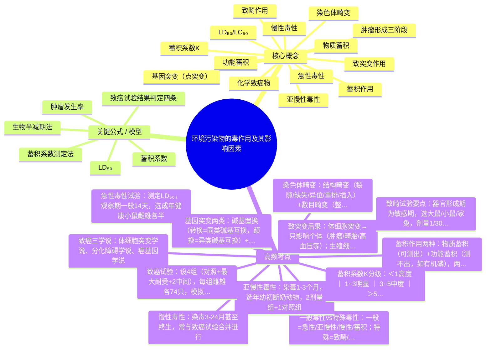

# 环境毒理学 · 第 4 章 · 环境污染物的毒作用及其影响因素 · 素材

> 教师: 森巴提·叶尔肯 · 学期: 2026春
> 章下 PDF: 4 个 · 总页: 232
> 主版: 第 8 节 · 82 页

---

## 主版课件 · 第 8 节

> `008-第四章 环境污染物的毒作用及其影响因素（3）-第五章 环境毒理学常用实验方法.pdf`

<details><summary>展开 82 页图链</summary>

- [p001](../008-第四章 环境污染物的毒作用及其影响因素（3）-第五章 环境毒理学常用实验方法/page_001.jpg)  · 环境毒理学
- [p002](../008-第四章 环境污染物的毒作用及其影响因素（3）-第五章 环境毒理学常用实验方法/page_002.jpg)  · 第五章环境毒理学常用实验方法
- [p003](../008-第四章 环境污染物的毒作用及其影响因素（3）-第五章 环境毒理学常用实验方法/page_003.jpg)  · 5.1 概述
- [p004](../008-第四章 环境污染物的毒作用及其影响因素（3）-第五章 环境毒理学常用实验方法/page_004.jpg)  · 概述
- [p005](../008-第四章 环境污染物的毒作用及其影响因素（3）-第五章 环境毒理学常用实验方法/page_005.jpg)  · 概述
- [p006](../008-第四章 环境污染物的毒作用及其影响因素（3）-第五章 环境毒理学常用实验方法/page_006.jpg)  · 概述
- [p007](../008-第四章 环境污染物的毒作用及其影响因素（3）-第五章 环境毒理学常用实验方法/page_007.jpg)  · 概述
- [p008](../008-第四章 环境污染物的毒作用及其影响因素（3）-第五章 环境毒理学常用实验方法/page_008.jpg)  · 概述
- [p009](../008-第四章 环境污染物的毒作用及其影响因素（3）-第五章 环境毒理学常用实验方法/page_009.jpg)  · 概述
- [p010](../008-第四章 环境污染物的毒作用及其影响因素（3）-第五章 环境毒理学常用实验方法/page_010.jpg)  · 概述
- [p011](../008-第四章 环境污染物的毒作用及其影响因素（3）-第五章 环境毒理学常用实验方法/page_011.jpg)  · 概述
- [p012](../008-第四章 环境污染物的毒作用及其影响因素（3）-第五章 环境毒理学常用实验方法/page_012.jpg)  · 概述
- [p013](../008-第四章 环境污染物的毒作用及其影响因素（3）-第五章 环境毒理学常用实验方法/page_013.jpg)  · 概述
- [p014](../008-第四章 环境污染物的毒作用及其影响因素（3）-第五章 环境毒理学常用实验方法/page_014.jpg)  · 概述
- [p015](../008-第四章 环境污染物的毒作用及其影响因素（3）-第五章 环境毒理学常用实验方法/page_015.jpg)  · 概述
- [p016](../008-第四章 环境污染物的毒作用及其影响因素（3）-第五章 环境毒理学常用实验方法/page_016.jpg)  · 概述
- [p017](../008-第四章 环境污染物的毒作用及其影响因素（3）-第五章 环境毒理学常用实验方法/page_017.jpg)  · 概述
- [p018](../008-第四章 环境污染物的毒作用及其影响因素（3）-第五章 环境毒理学常用实验方法/page_018.jpg)  · 概述
- [p019](../008-第四章 环境污染物的毒作用及其影响因素（3）-第五章 环境毒理学常用实验方法/page_019.jpg)  · 概述
- [p020](../008-第四章 环境污染物的毒作用及其影响因素（3）-第五章 环境毒理学常用实验方法/page_020.jpg)  · 概述
- [p021](../008-第四章 环境污染物的毒作用及其影响因素（3）-第五章 环境毒理学常用实验方法/page_021.jpg)  · 概述
- [p022](../008-第四章 环境污染物的毒作用及其影响因素（3）-第五章 环境毒理学常用实验方法/page_022.jpg)  · 概述
- [p023](../008-第四章 环境污染物的毒作用及其影响因素（3）-第五章 环境毒理学常用实验方法/page_023.jpg)  · 概述
- [p024](../008-第四章 环境污染物的毒作用及其影响因素（3）-第五章 环境毒理学常用实验方法/page_024.jpg)  · 概述
- [p025](../008-第四章 环境污染物的毒作用及其影响因素（3）-第五章 环境毒理学常用实验方法/page_025.jpg)  · 概述
- [p026](../008-第四章 环境污染物的毒作用及其影响因素（3）-第五章 环境毒理学常用实验方法/page_026.jpg)  · 环境化学物一般毒性及其评价
- [p027](../008-第四章 环境污染物的毒作用及其影响因素（3）-第五章 环境毒理学常用实验方法/page_027.jpg)  · 环境化学物一般毒性及其评价
- [p028](../008-第四章 环境污染物的毒作用及其影响因素（3）-第五章 环境毒理学常用实验方法/page_028.jpg)  · 环境化学物一般毒性及其评价
- [p029](../008-第四章 环境污染物的毒作用及其影响因素（3）-第五章 环境毒理学常用实验方法/page_029.jpg)  · 1.环境化学物一般毒性及其评价
- [p030](../008-第四章 环境污染物的毒作用及其影响因素（3）-第五章 环境毒理学常用实验方法/page_030.jpg)  · 1.环境化学物一般毒性及其评价
- [p031](../008-第四章 环境污染物的毒作用及其影响因素（3）-第五章 环境毒理学常用实验方法/page_031.jpg)  · 1.环境化学物一般毒性及其评价
- [p032](../008-第四章 环境污染物的毒作用及其影响因素（3）-第五章 环境毒理学常用实验方法/page_032.jpg)  · 1.环境化学物一般毒性及其评价
- [p033](../008-第四章 环境污染物的毒作用及其影响因素（3）-第五章 环境毒理学常用实验方法/page_033.jpg)  · 1.环境化学物一般毒性及其评价
- [p034](../008-第四章 环境污染物的毒作用及其影响因素（3）-第五章 环境毒理学常用实验方法/page_034.jpg)  · 1.环境化学物一般毒性及其评价
- [p035](../008-第四章 环境污染物的毒作用及其影响因素（3）-第五章 环境毒理学常用实验方法/page_035.jpg)  · 1.环境化学物一般毒性及其评价
- [p036](../008-第四章 环境污染物的毒作用及其影响因素（3）-第五章 环境毒理学常用实验方法/page_036.jpg)  · 1.环境化学物一般毒性及其评价
- [p037](../008-第四章 环境污染物的毒作用及其影响因素（3）-第五章 环境毒理学常用实验方法/page_037.jpg)  · 1.环境化学物一般毒性及其评价
- [p038](../008-第四章 环境污染物的毒作用及其影响因素（3）-第五章 环境毒理学常用实验方法/page_038.jpg)  · 1.环境化学物一般毒性及其评价
- [p039](../008-第四章 环境污染物的毒作用及其影响因素（3）-第五章 环境毒理学常用实验方法/page_039.jpg)  · 1.环境化学物一般毒性及其评价
- [p040](../008-第四章 环境污染物的毒作用及其影响因素（3）-第五章 环境毒理学常用实验方法/page_040.jpg)  · 1.环境化学物一般毒性及其评价
- [p041](../008-第四章 环境污染物的毒作用及其影响因素（3）-第五章 环境毒理学常用实验方法/page_041.jpg)  · 1.环境化学物一般毒性及其评价
- [p042](../008-第四章 环境污染物的毒作用及其影响因素（3）-第五章 环境毒理学常用实验方法/page_042.jpg)  · 1.环境化学物一般毒性及其评价
- [p043](../008-第四章 环境污染物的毒作用及其影响因素（3）-第五章 环境毒理学常用实验方法/page_043.jpg)  · 1.环境化学物一般毒性及其评价
- [p044](../008-第四章 环境污染物的毒作用及其影响因素（3）-第五章 环境毒理学常用实验方法/page_044.jpg)  · 1.环境化学物一般毒性及其评价
- [p045](../008-第四章 环境污染物的毒作用及其影响因素（3）-第五章 环境毒理学常用实验方法/page_045.jpg)  · 1.环境化学物一般毒性及其评价
- [p046](../008-第四章 环境污染物的毒作用及其影响因素（3）-第五章 环境毒理学常用实验方法/page_046.jpg)  · 1.环境化学物一般毒性及其评价
- [p047](../008-第四章 环境污染物的毒作用及其影响因素（3）-第五章 环境毒理学常用实验方法/page_047.jpg)  · 1.环境化学物一般毒性及其评价
- [p048](../008-第四章 环境污染物的毒作用及其影响因素（3）-第五章 环境毒理学常用实验方法/page_048.jpg)  · 2.环境化学物特殊毒性及其评价
- [p049](../008-第四章 环境污染物的毒作用及其影响因素（3）-第五章 环境毒理学常用实验方法/page_049.jpg)  · 2.环境化学物特殊毒性及其评价
- [p050](../008-第四章 环境污染物的毒作用及其影响因素（3）-第五章 环境毒理学常用实验方法/page_050.jpg)  · 2.环境化学物特殊毒性及其评价
- [p051](../008-第四章 环境污染物的毒作用及其影响因素（3）-第五章 环境毒理学常用实验方法/page_051.jpg)  · 2.环境化学物特殊毒性及其评价
- [p052](../008-第四章 环境污染物的毒作用及其影响因素（3）-第五章 环境毒理学常用实验方法/page_052.jpg)  · 2.环境化学物特殊毒性及其评价
- [p053](../008-第四章 环境污染物的毒作用及其影响因素（3）-第五章 环境毒理学常用实验方法/page_053.jpg)  · 2.环境化学物特殊毒性及其评价
- [p054](../008-第四章 环境污染物的毒作用及其影响因素（3）-第五章 环境毒理学常用实验方法/page_054.jpg)  · 2.环境化学物特殊毒性及其评价
- [p055](../008-第四章 环境污染物的毒作用及其影响因素（3）-第五章 环境毒理学常用实验方法/page_055.jpg)  · 2.环境化学物特殊毒性及其评价
- [p056](../008-第四章 环境污染物的毒作用及其影响因素（3）-第五章 环境毒理学常用实验方法/page_056.jpg)  · 2.环境化学物特殊毒性及其评价
- [p057](../008-第四章 环境污染物的毒作用及其影响因素（3）-第五章 环境毒理学常用实验方法/page_057.jpg)  · 2.环境化学物特殊毒性及其评价
- [p058](../008-第四章 环境污染物的毒作用及其影响因素（3）-第五章 环境毒理学常用实验方法/page_058.jpg)  · 2.环境化学物特殊毒性及其评价
- [p059](../008-第四章 环境污染物的毒作用及其影响因素（3）-第五章 环境毒理学常用实验方法/page_059.jpg)  · 2.环境化学物特殊毒性及其评价
- [p060](../008-第四章 环境污染物的毒作用及其影响因素（3）-第五章 环境毒理学常用实验方法/page_060.jpg)  · 2.环境化学物特殊毒性及其评价
- [p061](../008-第四章 环境污染物的毒作用及其影响因素（3）-第五章 环境毒理学常用实验方法/page_061.jpg)  · 2.环境化学物特殊毒性及其评价
- [p062](../008-第四章 环境污染物的毒作用及其影响因素（3）-第五章 环境毒理学常用实验方法/page_062.jpg)  · 2.环境化学物特殊毒性及其评价
- [p063](../008-第四章 环境污染物的毒作用及其影响因素（3）-第五章 环境毒理学常用实验方法/page_063.jpg)  · 2.环境化学物特殊毒性及其评价
- [p064](../008-第四章 环境污染物的毒作用及其影响因素（3）-第五章 环境毒理学常用实验方法/page_064.jpg)  · 2.环境化学物特殊毒性及其评价
- [p065](../008-第四章 环境污染物的毒作用及其影响因素（3）-第五章 环境毒理学常用实验方法/page_065.jpg)  · 2.环境化学物特殊毒性及其评价
- [p066](../008-第四章 环境污染物的毒作用及其影响因素（3）-第五章 环境毒理学常用实验方法/page_066.jpg)  · 2.环境化学物特殊毒性及其评价
- [p067](../008-第四章 环境污染物的毒作用及其影响因素（3）-第五章 环境毒理学常用实验方法/page_067.jpg)  · 2.环境化学物特殊毒性及其评价
- [p068](../008-第四章 环境污染物的毒作用及其影响因素（3）-第五章 环境毒理学常用实验方法/page_068.jpg)  · 2.环境化学物特殊毒性及其评价
- [p069](../008-第四章 环境污染物的毒作用及其影响因素（3）-第五章 环境毒理学常用实验方法/page_069.jpg)  · 2.环境化学物特殊毒性及其评价
- [p070](../008-第四章 环境污染物的毒作用及其影响因素（3）-第五章 环境毒理学常用实验方法/page_070.jpg)  · 2.环境化学物特殊毒性及其评价
- [p071](../008-第四章 环境污染物的毒作用及其影响因素（3）-第五章 环境毒理学常用实验方法/page_071.jpg)  · 2.环境化学物特殊毒性及其评价
- [p072](../008-第四章 环境污染物的毒作用及其影响因素（3）-第五章 环境毒理学常用实验方法/page_072.jpg)  · 2.环境化学物特殊毒性及其评价
- [p073](../008-第四章 环境污染物的毒作用及其影响因素（3）-第五章 环境毒理学常用实验方法/page_073.jpg)  · 2.环境化学物特殊毒性及其评价
- [p074](../008-第四章 环境污染物的毒作用及其影响因素（3）-第五章 环境毒理学常用实验方法/page_074.jpg)  · 2.环境化学物特殊毒性及其评价
- [p075](../008-第四章 环境污染物的毒作用及其影响因素（3）-第五章 环境毒理学常用实验方法/page_075.jpg)  · 2.环境化学物特殊毒性及其评价
- [p076](../008-第四章 环境污染物的毒作用及其影响因素（3）-第五章 环境毒理学常用实验方法/page_076.jpg)  · 2.环境化学物特殊毒性及其评价
- [p077](../008-第四章 环境污染物的毒作用及其影响因素（3）-第五章 环境毒理学常用实验方法/page_077.jpg)  · 2.环境化学物特殊毒性及其评价
- [p078](../008-第四章 环境污染物的毒作用及其影响因素（3）-第五章 环境毒理学常用实验方法/page_078.jpg)  · 2.环境化学物特殊毒性及其评价
- [p079](../008-第四章 环境污染物的毒作用及其影响因素（3）-第五章 环境毒理学常用实验方法/page_079.jpg)  · 2.环境化学物特殊毒性及其评价
- [p080](../008-第四章 环境污染物的毒作用及其影响因素（3）-第五章 环境毒理学常用实验方法/page_080.jpg)  · 2.环境化学物特殊毒性及其评价
- [p081](../008-第四章 环境污染物的毒作用及其影响因素（3）-第五章 环境毒理学常用实验方法/page_081.jpg)  · 2.环境化学物特殊毒性及其评价
- [p082](../008-第四章 环境污染物的毒作用及其影响因素（3）-第五章 环境毒理学常用实验方法/page_082.jpg)  · 2.环境化学物特殊毒性及其评价

</details>

<details><summary>展开 82 页图文对照（每图配其识别文本）</summary>

**p001** 

环境毒理学
授课人：森巴提?叶尔肯

---

**p002** 

第五章环境毒理学常用实验方法
本章将讨论以下内容：
5.1概述
5.2环境化学物等一般毒性试验
5.3致畸、致癌、致突变等毒性试验

---

**p003** 

5.1 概述
毒理学研究的主要手段
动物实验
借助于动物模型模拟人体接触环境化学品的各种
条件，观察实验动物的毒性反应，再外推到人

---

**p004** 

概述
毒理学研究的主要手段
体内实验 动物实验 体外实验
采用整体动物、动物器官、组织及细胞等进行

---

**p005** 

概述
一、实验动物的选择
人工培育 科学研究
控制其携带微生物、遗传背景明确，来源清楚。

---

**p006** 

概述
1.物种的选择--－基本原则
对外源的毒性反应及代谢特点与人类接近的物种
自然寿命不太长的物种
易于饲养和实验操作的物种
经济并易于获得的物种

---

**p007** 

概述
1.物种的选择--－常用动物
选用两个物种进行试验、评价毒性反应的物种差异

---

**p008** 

概述
2.品系的选择
品系 用计划交配的方法获得的起源于共同祖先的一群动物。
具有共同的遗传来源、相似的外貌特征、独特的生物
同一品系
学特性及稳定的遗传性能
类别 遗传特性 繁殖方式 应用场景
近交系动物 基因高度纯 连续兄妹/亲 遗传研究、
近交系动物 合 子交配
药物测试
突变系动物 疾病模型、
根据实验需要 携带特定基 选择性交配或基
突变系动物 基因功能研
因突变 因编辑 究
杂交群动物
F1代杂合 干细胞研究、
杂交群动物 两个近交系杂交
封闭群动物 子 免疫实验
遗传多样性 毒理学、行
封闭群动物 群体内随机交配
高 为学研究

---

**p009** 

概述
3.微生物控制的选择
为确保实验结果的真实性、可靠性和增加可比性、可
微生物控制
重复性及科学性。
应对实验动物携带的微生物控制，根据对动物微生物
实验动物分类
控制的净化水平，我国将实验动物分为无菌动物、悉
生动物、无特定病原体动物和清洁动物。
等级 微生物控制 饲养环境 应用场景
无菌动物 完全无微生物 无菌隔离器 微生物组、免疫机制研究
悉生动物 已知特定微生物 无菌隔离器 特定菌群功能研究
SPF动物 排除特定病原体 屏障环境 生物医学研究、疫苗开发
清洁动物 排除常见病原体 普通屏障环境 基础实验、教学

---

**p010** 

概述
4.个体选择
实验动物对毒物的反应存在差异
选择实验动物时，需要考虑实验动物的年龄、性别、 生理状态和
健康状态等。
年龄 毒理学试验选用的实验动物的年龄取决于实验
的类型
成年动物 急性试验
年幼或初断乳动物 亚慢性、慢性试验
实际工作中常以动物的体重粗略的判断动物的年龄

---

**p011** 

概述
4.个体选择
实验动物对毒物的反应存在差异
选择实验动物时，需要考虑实验动物的年龄、性别、 生理状态和
健康状态等。
性别 同物种、同品系但不同性别的实验动物对化学
物毒性的敏感程度有差别
无特殊要求 应选用雄两种性别
已知不同性别敏感程度物 选择敏感的性别
如实验中发现性别差异，应对实验结果分别统计分析

---

**p012** 

概述
4.个体选择
实验动物对毒物的反应存在差异
选择实验动物时，需要考虑实验动物的年龄、性别、 生理状态和
健康状态等。
毒理学试验一般应选用未产未孕的雌性动物
生理状态 除进行与生殖有关的试验时需有计划地合笼交
配外，雌雄动物应分笼饲养。
毒理学试验应选用健康的动物。一般在试验前
健康状态 检疫观察5-7天。对于大动物的亚慢性和慢性试
验，还应进行血液学和血液生化学检查，剔除
异常动物。
如对狗进行试验，应该常规驱除肠道寄生虫

---

**p013** 

概述
二、常用的染毒方法
使动物通过一定的途径接触毒物
根据试验的目的并结合人体的实际接触方
染毒
式、毒物的多少、理化性质以及设备条件
等来决定。
主要染毒途径：经口、经皮肤及经呼吸道吸入

---

**p014** 

概述
1.经口染毒
采用灌胃、吞服胶囊和饲喂的方式
灌胃前需要禁食；
灌胃 灌胃针从口角进入，针头轻压舌根，引起小
鼠吞咽反射；
进入食道后，继续入针时应无阻力。针头到
达胃部后推动注射器，推入需要的计量
竖直拔出针头，完成灌胃操作。
注意： 若感到阻力或动物挣扎时，应该立即停止进针或将针拔出；
参考给药量：小鼠0.1ml/10g体重，最大不超过0.5ml/10g体重

---

**p015** 

概述
1.经口染毒
采用灌胃、吞服胶囊和饲喂的方式
迫使实验动物吞服胶囊
吞服胶囊 该方法计量准确
适合不合实验动物“口味”的药物
饲喂 要求受试物占饲料的比例小于5%。

---

**p016** 

概述
2.经呼吸道染毒
静式吸入染毒和动式吸入染毒
将实验动物置于密闭的染毒柜中，加入易挥
静式吸入
发的液态或气态受试物达到一定的浓度。
动式吸入 采用机械通风装置，使实验动物在氧和二氧
化碳分压较为恒定、受试化学物浓度也较为
稳定的环境中进行

---

**p017** 

概述
3.经皮肤染毒
液态、气态、粉尘都有可能与皮肤接触
研究化合物经皮肤吸收的毒性作用，及化合物对接触化合物
皮肤的局部作用，均需使用经皮肤染毒的方式
动物的被毛有碍于与化学物的直接接触，因此，
在经皮肤染毒前需要去除染毒部位的被毛

---

**p018** 

概述
4.其他方式
根据试验目的和要求以及染毒物质的性状，还可选用腹腔注
射、皮下注射、静脉注射等。

---

**p019** 

概述
三、实验动物生物材料的收集方法
动物血液采集
检查血液，可了解受试物对血液系统的作用，反应受试物对各
器官系统功能及受试物代谢过程的影响。
实验动物采血量
动物品种 最大安全采血量（mL） 最小致死采血量（mL）
小鼠 0.10 0800
大鼠 1.00 2.005.00 10,00
免猴 10.00 40.0015,00 60.00

---

**p020** 

概述
三、实验动物生物材料的收集方法
1.动物血液采集
小鼠、大鼠：
所需血量不多时，可采用尾尖采血和眼眶静脉丛采血
用血量较多时，可采用心脏采血法
对采血后拟处死的动物，可采用断头采血法。
实验动物采血量
动物品种 最大安全采血量（mL） 最小致死采血量（mL）
小鼠 0.10 0.30
大鼠 1.00 2.00
鼠 5.00 10.00
免 10.00 40.0015,00 60.00

---

**p021** 

概述
三、实验动物生物材料的收集方法
1.动物血液采集
对豚鼠：可采用耳缘剪口采血和心脏采血
对家兔：·可采用耳静脉采血，是家兔最为常用的取血
法之一
常作多次反复取血用，故保护耳缘静脉，防
止发生栓塞。
需血量较多少，也可采用心脏采血。

---

**p022** 

概述
三、实验动物生物材料的收集方法
2.动物尿液、粪便的收集
对尿液、粪便的分析，可了解受试物的吸收代谢的特点
采用特制的容器（代谢笼）进行尿液、粪便的收集。
必须保证粪便和尿液分开，以防止相互混合
常用的粪尿分离收集器，其类型有玻璃、塘瓷、瓷器等制
品，可根据实验室条件适当选用
样品应在新鲜时进行检验
实验期间膳食成分应一致，且须在特定时间内收集样品

---

**p023** 

概述
四、实验动物处死方法
处死要求
尽量快速，不是动物集体发生与毒理试验无关的病理变化、
操作简便为原则
处死方法
（1) 脱颈椎法：适用于对小动物（大、小白鼠）处死。
(2) 断头法：适用于大、小白鼠处死。
（3）麻醉法：置于有麻醉剂（氯仿或乙醚）的密闭容器内，使动物麻醉
致死。大动物则须用注射麻醉剂法进行。
（4）空气栓塞法：用注射器向动物静脉内迅速注人一定量的空气，使动
物血管内形成大量气栓而致死。适用于大动物的处死。

---

**p024** 

概述
五、实验动物的解剖检查
病理形态学检查
，对试验动物进行大体解部，观察各脏器有无异常
准备
复查动物的编号、实验组别、称体重，进行一般的体表状况的观察。

---

**p025** 

概述
五、实验动物的解剖检查
实质器官
观察脏器的颜色、形状大小等情况。切面有无外翻，各结
构层次是否清晰等。
空腔器官
观察其内容物的量和性质等变化

---

**p026** 

环境化学物一般毒性及其评价
5.2环境化学物一般毒性及其评价
一般毒性：
包括急性毒性、亚慢性毒性和慢性毒性、蓄积毒性等
特殊毒性：
致畸、致癌、致突变、生殖、发育毒性
毒物作用时间的长短是决定其毒性效应的主要因素之一

---

**p027** 

环境化学物一般毒性及其评价
5.2环境化学物一般毒性及其评价
案例
近年来，马兜铃酸致癌致肾炎的新闻引起了人们的热议。临床上
将马兜铃酸肾病分为三种类型：急性马兜铃酸肾病、慢性马兜铃酸肾病
以及肾小管功能障碍型马兜铃酸肾病。
急性马兜铃酸肾病：多由在较短的时间内，大量服用含有马兜铃酸的药物
所致，临床表现主要为少尿或非少尿性急性肾功能衰竭。
慢性马兜铃酸肾病：多由持续或间断小剂量服用含马兜铃酸药物所致，肾
功能呈进行性损害。
肾小管功能障碍型马兜铃酸肾病：通常在间断小量服用含马兜铃酸药物后
数月出现症状，主要表现为肾小管性酸中毒等。由此可见，同样的毒物根
据其染毒时间的长短和剂量大小的不同，可能导致不同的毒性作用

---

**p028** 

环境化学物一般毒性及其评价
一、急性毒性
急性毒性是指机体一次接触或24小时内多次接触某一化学物所引1起的
毒性效应，包括死亡效应。
一次·经口或经注射染毒则为操作时瞬间染毒；
经呼吸道或经皮肤染毒则为特定期间内持续接触化学物的过程
多次·毒性过低或一次染毒剂量受生物体容量限制，需要给予实验动
物较大剂量时，可以在24h内多次染毒
目的：
是测定半数致死量（或浓度，LDso或LC5o），急性中毒國剂量（或浓度)。
另外：急性毒性研究可为亚慢性、慢性毒性研究及其他毒理试验染毒剂
量的设计和观察指标的选择提供依据，为毒性作用机制研究提供线索。

---

**p029** 

1.环境化学物一般毒性及其评价
一、急性毒性试验 ---哺乳动物的急性毒性实验：
半数致死量（LD5o）的测定
急性毒性大小常用LD表示；
指的是半数试验动物死亡所使用的毒物剂量；
若使用的是溶液，则用LC50
LDs或LCs是急性有关指标中重要的参数；
LD5o（LC5o）可能于毒性分级;
毒性大小比较的依据；
LD5o（mg/kg）、LCso（mg/kg），数值越小毒性越强。

---

**p030** 

1.环境化学物一般毒性及其评价
一、急性毒性试验---哺乳动物的急性毒性实验：
急性毒性试验的一般操作流程
·成年健康的小鼠
选择受试生物：·
雌、雄各半;
若待测化学物对性别有名感性，则根据需求调整雌雄比例
染毒方式和染毒计量的选择：
·事先查阅文献，根据毒物结构和理化性质寻找类似化学物的毒性资料

---

**p031** 

1.环境化学物一般毒性及其评价
一、急性毒性试验---哺乳动物的急性毒性实验：
急性毒性试验的一般操作流程
染毒剂量：
·取类似物种，染毒途径相同的LDso作为参考中值
·以大剂量间隔染毒，找出相应的致死剂量范围（在少量动物上试验）
·在这几个剂量范围设定几个试验组，进行正式实验。
观察周期：
·一般为14天（两周）
依据受试动物测试相关规定确定观察周期
对已知的速杀性药物，可缩短观察时间
具体观察时间，应在试验报告及结果表示中说明，如7d的LD50
根据观察期内动物的总死亡情况，计算LD50

---

**p032** 

1.环境化学物一般毒性及其评价
一、急性毒性试验 ---哺乳动物的急性毒性实验：
半数致死剂量的影响因素
?实验动物的饲养环境和营养因素
实验人员操作的熟练程度
受试化学物的浓度和稀释倍数
同一外源化学物，同一品系动物；同样接触途径测定的LD50只值会有2-3倍差异
虽然半数致死剂量是急性毒性试验最为重要的毒性指标，在试验过程中，
同样可以观察体重变化、中毒症状，对死亡个体进行病理检查等进一步确
定污染物的毒性作用方式。

---

**p033** 

1.环境化学物一般毒性及其评价
二、亚慢性和慢性毒性实验 ---亚慢性毒性试验
在通常情况下啊，人类对环境污染物接触的水平较低，不至于发生急性中毒，
却会在长期反复接触中慢性中毒。
亚慢性毒性
又称亚急性毒性，机体在相当于1/20左右生命期间，少量、反复接触有
害化学和生物因素引起的损害作用。
亚慢性毒性试验
又称亚急性毒性试验，受试动物在1/20左右生命周期，每日、反复、多
次接触受试物的毒性试验。
举例：大鼠生命为2年（24月）
需染毒：1~2个月
1/20即1～2个月

---

**p034** 

1.环境化学物一般毒性及其评价
二、亚慢性和慢性毒性实验 ---慢性毒性试验
慢性毒性
机体长期、少量、反复接触外源化学物所应期的毒性效应，接触期限一
般为大于生命期的10%；
慢性毒性试验
试验动物长期接触低剂量外来化学物，产生的生物学效应的试验称为慢
性试验;
特点：
耗费的人力、物力和时间比较大，亚慢性毒性试验常作为慢性毒性试验
的预备或筛选试验，必要时才进行慢性毒性试验
染毒期长达2年或终生染毒的慢性毒性试验，常和致癌试验合并进行

---

**p035** 

1.环境化学物一般毒性及其评价
二、亚慢性和慢性毒性实验---亚慢性和慢性毒性及其对应试验
两种试验在试验设计和方法上除染毒期限有所不同，其他基本相同
受试动物
受试动物的种属、品系，应该是在急性毒性试验中，已被确定为对受试物
敏感的动物
一般要求选择两种受试动物：啮齿类、非齿齿类动物各一类
性别为雌雄各半
建议选用年幼、初断奶的动物为试验对象，以便更全面了解受试物的毒效
应

---

**p036** 

1.环境化学物一般毒性及其评价
二、亚慢性和慢性毒性实验---亚慢性和慢性毒性及其对应试验
染毒剂量的选择
一般应设置2个剂量组和1个对照组
高剂量组：要能引起明显的中毒反应，不会让很多动物死亡
低剂量组：不引起任何中毒反应

---

**p037** 

1.环境化学物一般毒性及其评价
二、亚慢性和慢性毒性实验---亚慢性和慢性毒性及其对应试验
染毒途径
应尽量模拟人类接触受试化学物的方式
慢性、亚慢性毒性研究的染毒途径一致
经胃肠道染毒时，毒物最好采用胃饲法
受试化学物有异味或易水解时，也可采用灌胃方法染毒

---

**p038** 

1.环境化学物一般毒性及其评价
二、亚慢性和慢性毒性实验---亚慢性和慢性毒性及其对应试验
染毒期限
根据受试物的种类和试验动物的物种而定
亚慢性毒性一般染毒1-3个月
慢性毒性一般染毒3-24个月，甚至终生染毒

---

**p039** 

1.环境化学物一般毒性及其评价
二、亚慢性和慢性毒性实验---亚慢性和慢性毒性及其对应试验
试验设计、观察指标
（1）一般性指标
敏感的综合性指标，综合反映毒物对机体的毒作用（外见体征；粪便性状；
食物利用率；体重变化）
（2）试验室检查
包括血液学检查、肝功能、肾功能
（3）病理组织学检查
试验结束后，要及时解剖死亡的动物，肉眼观察大体病理变化，若有改变
则需要做组织病理学检查，对于存活的动物也要做解部检查，必要时做组
织病理学检查
（4）特异性指标
根据受试物的毒性资料，试验中的观察和受试物结构等增加其他指标的检查

---

**p040** 

1.环境化学物一般毒性及其评价
二、亚慢性和慢性毒性实验---亚慢性和慢性毒性及其对应试验
试验设计、观察指标
根据亚慢性毒性试验的结果，可以确定受试物的主要作用，靶器官对最大
无作用水平和最大剂量做出初步估计，为进一步开展慢性毒性试验提供依据
慢性毒性试验
对受试物在低剂量长时间接触机体时引起的毒性作用有更深入的了解
可以依据敏感观察指标出现异常的最小阀剂量
找出该受试物慢性毒性作用的最大无作用剂量
为受试物能否应用或为制定在环境中卫生标准提供重要的参考依据

---

**p041** 

1.环境化学物一般毒性及其评价
三、蓄积毒性试验
蓄积作用的基本概念
1）定义：
当外源化学物连续进入机体，且吸收速度或总量超过代谢转化排除的总量
或速度时，化学物质很有可能在体内增加并贮留，称为化学物的蓄积作用。
化学物质容易蓄积的部位称为储存库；
常见的储存库包括
血浆蛋白
脂肪组织
肝肾
骨骼
大多数蓄积作用都会产生蓄积毒性

---

**p042** 

1.环境化学物一般毒性及其评价
三、蓄积毒性试验
2）蓄积毒性作用
低于中毒剂量的外源化学物反复与机体接触一定时间后致使机体出现中
毒作用;
3）环境污染物体内蓄积过程
物质蓄积
·可用化学方法测得体内污染物或代谢物
污染物不断进入机体内，其吸收量大于排出量，使其在体内的量逐渐积累增多
功能蓄积
不断进入机体内的污染物，反复作用机体，引起机体一定结构和功能变化，
并逐渐累积加重，最后导致出现损害作用；
测不出该物质，例有机磷化合物。
物质蓄积和功能蓄积是相对而言，同时存在又互为基础，在史籍中难以严格区别

---

**p043** 

1.环境化学物一般毒性及其评价
三、蓄积毒性试验
评价蓄积毒性的试验方法
蓄积系数法：
定义：以生物效应为指标，用蓄积系数（k）评价蓄积作用，将多次染毒
与一次染毒毒性效应进行比较
优点：方法简便，是评价蓄积作用的常用方法；
缺点：无法区别物质蓄积还是功能蓄积
∑LD50(n）—→多次染毒使半数动物出现效应的总剂量
蓄积系数（K）=
表5-1蓄积作用强度分级（引自刘毓谷，环境毒理学教材，1987）
蓄积系数（K） 蓄积作用强度
<1 高度蓄积
1~3 明显蓄积
3~5 中度蓄积
>5 轻度蓄积

---

**p044** 

1.环境化学物一般毒性及其评价
三、蓄积毒性试验
评价蓄积毒性的试验方法
蓄积系数法：
确定蓄积系数常用的方法（固定剂量法、剂量定期递增染毒法、剂量固定的20
天蓄积法)
固定剂量法
使用大鼠或小鼠，通过经口灌胃、腹腔注射、染毒。试验周期为25-100天
先求出LD5o-->选取相同条件的至少40只试验动物
随机分为染毒组和对照组两组（每组至少20只，雌雄各半）
每天以固定剂量在相同时间和相同途径对试验组进行染毒
观察并记录动物死亡数
当试验组一半动物死亡时即可终止试验 若接触剂量依据蓄积到
计算累积的总的接触剂量(LDso(n) 5*LD5o的剂量，那么即便死
亡数未超过半数，仍要终止
根据公式计算K值 试验，此时K>5，表明蓄积作
用不明显
依据蓄积毒性强度分析进行评价

---

**p045** 

1.环境化学物一般毒性及其评价
三、蓄积毒性试验
评价蓄积毒性的试验方法
蓄积系数法：
确定蓄积系数常用的方法
剂量定期递增染毒法
大体上与固定剂量法一致，不一样的是试验开始时染毒组需要按0.1LDso剂量进行染毒
以4天为一期
按一定比例增加染毒剂量
试验期最长28天
注：试验期间需要定期（4天）一次给动物称重，按照实测体重调整染毒剂量

---

**p046** 

1.环境化学物一般毒性及其评价
三、蓄积毒性试验
评价蓄积毒性的试验方法
蓄积系数法：
确定蓄积系数常用的方法
剂量固定的20天蓄积法
口给予蓄积系数的原理设计
口通常采用经口灌胃的染毒方式 1/20 LD501/10 LD50
口将毒物随机分为5组（阴性对照*1，对照组*4）
1/5  LD50
·每组10只，雌雄各半 1/2LD50
·每天染毒一次，连续20天
口观察每组雌雄合计的死亡动物数
口试验结束后，根据各实验组的死亡数对受试物的蓄积数强弱进行评定

---

**p047** 

1.环境化学物一般毒性及其评价
三、蓄积毒性试验
评价蓄积毒性的试验方法
2）生物半减期法：
定义：用毒物动力学原理描述毒物在机体内蓄积作用的方法
简称T1/2：外来化合物通过机体的生物转运和转化作用被消除一半所需要的
时间
生物半减期越长的物质，越不容易消除；发生蓄积作用的可能性就越大
由于测定外来化学物在体内的生物半减期过程较为复杂，自实际观测中，
常常间接的通过测定其血液、尿液或器官组织中的浓度（或量）降低一半
所需的时间，用以代表该物质的生物半减期，根据测得的生物半减期的长
短，来确定受试物的蓄积作用。

---

**p048** 

2.环境化学物特殊毒性及其评价
一、致突变试验
突变基本类型及定义
1）定义：
遗传物质发生的可改变生殖或体细胞中的遗传信息，并产生新的表型效应
的改变。
2）基本类型：
自发突变：自然条件下发生，频率很低；
诱发突变：人为的或受各种因素诱发产生
环境突变/环境诱变作用：有物理、化学、生物作用（紫外线、X射线，化
学诱变剂，黄曲霉素等都可诱发突变）
突变基础：根据DNA突变的大小，将突变分为两大类
1基因突变（例如：红色花的后带变成蓝色）
②染色体畸变

---

**p049** 

2.环境化学物特殊毒性及其评价
一、致突变试验
突变基本类型及定义
1基因突变
DNA在分子水平上发生的碱基对组成或排列顺序的改变
只限于染色体上特定位点，故又称为点突变
DNA多核苷酸链上某个碱基对被另一个碱基对所取
碱基置换 代的过程
置换又分为转换和颠换两种形式
基因突变
转换：DNA多核苷酸链上同类碱基之间的取代，即密啶
移码突变 被嘧啶，嘌呤被嘌呤取代
AA 突变

---

**p050** 

2.环境化学物特殊毒性及其评价
一、致突变试验
突变基本类型及定义
1基因突变
DNA在分子水平上发生的碱基对组成或排列顺序的改变
只限于染色体上特定位点，故又称为点突变
DNA多核苷酸链上某个碱基对被另一个碱基对所取
碱基置换 代的过程
置换又分为转换和颠换两种形式
基因突变
颠换：不同类碱基之间的取代，即嘌呤被嘧啶或嘧啶被
移码突变 嘌呤取代
GAA 突变

---

**p051** 

2.环境化学物特殊毒性及其评价
一、致突变试验
突变基本类型及定义
1基因突变
DNA在分子水平上发生的碱基对组成或排列顺序的改变
只限于染色体上特定位点，故
DNA —CATCATCA ATC
翻译模板
His
编码的氨基酸
碱基置换 碱基A丢失
CATCATCA CATCAHisHHisHHis ne1
编码合成的蛋白质发生改变
基因突变
DNA序列插入或缺失除了三对以外的一对或几对碱基，而引
移码突变 起密码编组的突变
按照三联密码连续阅读的原则就会出现损伤部位以后整个遗
传密码顺序完全改变，从而形成错误的密码，并转译成为不
正常的氨基酸，细胞由此出现突变

---

**p052** 

2.环境化学物特殊毒性及其评价
一、致突变试验
突变基本类型及定义
2染色体畸变
与碱基突变不同的是，染色体畸变可用显微镜直接观察到染色体结构和数目的改变
进入 导致
化学突变物 细胞中的染色体 染色体损伤或破坏
染色体结构的畸变
染色体在致突变作用物下的畸变
染色体数目的畸变

---

**p053** 

2.环境化学物特殊毒性及其评价
一、致突变试验
突变基本类型及定义
2染色体畸变
染色体结构的畸变
染色体在职突变作用物下的畸变
染色体数目的畸变
染色体结构的畸变：裂隙、缺失、异位、重排、插入
染色体数目的畸变：1整倍的改变，称为整倍体即二倍体、三倍体或多倍体；
②非整组的单个或者多个染色体的增减（非整倍体）
染色体数目为2n+1,2n+2,2n-1,2n-2，对应的称为三体、四体、单体、缺体

---

**p054** 

2.环境化学物特殊毒性及其评价
一、致突变试验
致突变作用的后果
肿瘤
化学致突变对人类健康的影响与其作用的靶细胞有关 畸胎
体细胞发生突变时：只影响接触致突变物的个体，不影响下一代 高血压
动脉硬化
生殖细胞发生突变时会对后代变生影响
细胞老化
影响后代
遗传性疾病
显性致死 生殖细胞突变 影响人类基因库
生育能力障碍 影响遗传负荷
例如：唐纳氏综合征，多Y综合征

---

**p055** 

2.环境化学物特殊毒性及其评价
一、致突变试验
致突变作用的评价
致突变试验用于实现对致突变作用的评价
致突变试验是为了确定某种环境污染物对生物体是否具有致突变作用所进行的试验
包括基于表型改变检测基因及小的缺失
通过细胞学的方法观察大的染色体损伤
基因点突变试验
致突变试验方法根据终点反应不同 染色体畸变试验
DNA损伤试验
受试生物选择：微生物、哺乳动物、昆虫、植物等

---

**p056** 

2.环境化学物特殊毒性及其评价
一、致突变试验
致突变作用的评价
常用的致突变试验方法
1D基因点突变试验：细菌回复突变试验又称Ames试验
基本原理：利用一种突变型微生物菌株，与被检的化学物质接触，如果这
个化学物有致突变性，则会使细菌回复成野生状态，即可回复突变
TA100、TA102均符合Ames实验要求。
TA100 TA100
沙门氏菌、大肠杆菌
TA98 TA102
TA98 TA102
TA97 TA97
图1.组氨酸营养缺陷实验

---

**p057** 

2.环境化学物特殊毒性及其评价
一、致突变试验
致突变作用的评价
常用的致突变试验方法
②微核试验
微核：染色体或染色单体收到突变作用的影响想，形成无着丝点的短片，或者纺锤
体受到损伤失去染色体，在细胞分裂的后期无法随着纺锤丝到达两级而遗留在细胞
质中，形成N个规则的小体，这些小体的嗜染性同细胞核相似但比主核小的多。
Micronucleus
简便、
快速、
可靠

---

**p058** 

2.环境化学物特殊毒性及其评价
一、致突变试验
致突变作用的评价
常用的致突变试验方法
③染色体畸变试验
基本原理：利用显微镜直接观察，生物体细胞受致突变物作用后，染
色体发生数目和结构改变的情况

---

**p059** 

2.环境化学物特殊毒性及其评价
一、致突变试验
致突变作用的评价
常用的致突变试验方法
④显性致突变试验
检测生殖细胞染色体的突变
如染色体断裂所导致的缺失或重复
如染色体重排形成的不平衡染色体的分离或不分离，即非整倍体
注意：干扰因素多、灵敏性不够高、可校正体外实验或其他系统所得到的阳性
结果，在实际工作中，为了得到更准确的结论，往往需要做一组致死突变试验
在安全毒理学评价程序中，致死突变试验要求对上述四种试验中的任意三项进
行实验，最后再根据结果进行判定，得出实验结论。

---

**p060** 

2.环境化学物特殊毒性及其评价
二、致畸、致癌试验
基本概念
短肢畸形
反应停导致近万名畸形儿的诞生，因此世界上开始大规模的研究致畸药物
发现不少药物具有不同程度的致畸作用，如抗生素类，性激素类药物。

---

**p061** 

2.环境化学物特殊毒性及其评价
二、致畸、致癌试验
基本概念
把凡是在一定剂量下，能通过母体对胚胎正常反应过程造成干扰，引起胚
胎发育障碍而导致子代出生后，发生畸形的物质称为致畸物或致畸原
把致畸物通过母体作用于胚胎而引起胎儿畸形的现象称为致畸作用
评定外来化学物是否具有致畸作用的试验称为致畸试验

---

**p062** 

2.环境化学物特殊毒性及其评价
二、致畸、致癌试验
基本概念
致畸作用
致畸作用也是毒作用的一种表现，具有一定的毒理学特点
胚胎于致畸物发生接触时，因为发育阶段不同，导致敏感性不同
器官形成期中胚胎对致畸物最为敏感，因此称为敏感期或危险期
同一致畸物与胚胎接触时，因胚胎发育阶段不同，引起不同的致畸;
风疹病毒，孕妇在不同时期感染，可引起不同的先天畸形;
妊娠第四周感染可引起无脑儿或脊髓裂
妊娠第五周感染可引起无肢畸形
妊娠6-9周感染可引起牙畸形

---

**p063** 

2.环境化学物特殊毒性及其评价
二、致畸、致癌试验
基本概念
致畸作用
致畸作用也是毒作用的一种表现，具有一定的毒理学特点
致畸作用表现出明显的种属差异
不同种属的动物对致畸物的代谢过程和本身胎盘结构均不同，从而导致不
同种系的动物表现出不同的敏感性
反应停对兔子和人有致畸作用，但对其他的哺乳动物不能引起致畸

---

**p064** 

2.环境化学物特殊毒性及其评价
二、致畸、致癌试验
基本概念
致畸作用
致畸作用也是毒作用的一种表现，具有一定的毒理学特点
现实生物中引起的致畸作用
物理因素中的电离辐射（x光射片）
生物因素中病毒的感染
天然条件下的出生缺陷
水硬度有关的中枢系统畸形的发生；
水气象有关的胎儿畸形
高放射本底地区与畸形率（天然辐射水平显著高于全球平均水平的区域）
化学因素（甲基汞、环境激素）

---

**p065** 

2.环境化学物特殊毒性及其评价
二、致畸、致癌试验
基本概念
致畸作用
致畸作用也是毒作用的一种表现，具有一定的毒理学特点
现实生物中引起的致畸作用
天然条件下的出生缺陷
高放射本底地区与畸形率（天然辐射水平显著高于全球平均水平的区域）
高放射本底地区的辐射主要来自地壳中的铀、针、钾－40等放射性核素，以及宇宙射线。例如：
·中国阳江：年有效剂量约6.4mSv（全球平均为2.4mSv），主要由地表射线和氢气贡献。
·印度喀拉拉邦：沿海地区因独居石砂矿（富含铀、针）导致辐射水平达10-20mSv/年。
·伊朗拉姆萨尔：部分居民区室内氢浓度高达31，000Bq/m²，年有效剂量达71mSv。

---

**p066** 

2.环境化学物特殊毒性及其评价
二、致畸、致癌试验
试验操作
致畸试验
用于检测某些环境污染物能否通过妊娠母体引起胚胎畸形的一种动物实验方法。
致畸试验步骤
代谢过程要与人类相近
受试生物的选择
胎盘与人类胚胎构造相似（包括胚胎的层数和厚度）
体型小
动物试验选取原则 易繁殖 多采用大鼠、小鼠和家兔实验动物
价格低廉

---

**p067** 

2.环境化学物特殊毒性及其评价
二、致畸、致癌试验
试验操作
致畸试验
剂量分组：通常根据试验目的和要求决定
）只做有无致畸作用的定性检测，则剂量组较少；
若还需要探讨毒性作用的靶器官，则剂量组增多；
在正式试验前要先做预实验，用于确定实验所需试验剂量范围
若未做预实验，则一般以1/30-1/2的LD5o为最高剂量组，
1/30-1/100LD50为低剂量组，
按等比例差在高低剂量组之间插入中间剂量组
5以交配后确定已受精的雌性动物为计数对象（鼠类：15-20只；家兔：7-8只）
6在进行实验时，除了各试验组外，还应同时设立阴性和阳性对照组

---

**p068** 

2.环境化学物特殊毒性及其评价
二、致畸、致癌试验
试验操作
致畸试验
剂量分组：通常根据试验目的和要求决定
7实验处理上，需要先将性成熟但为交配过的雌鼠和雄鼠同笼过夜，确定雌鼠受
孕后，推算孕龄，在胚胎的“敏感期”进行受试物暴露
致畸实验常用的终点指标：暴露完之后的解部，观察
实验动物的解剖时间为分娩前1-2天为宜，对胚胎的外部骨骼和内脏进行检查，
并且通过多方面分析致畸试验结果。

---

**p069** 

2.环境化学物特殊毒性及其评价
恶性肿瘤怎么产生的
：框在点击“”时会进行转换，用时则会变为可点击的视频。框移位和

---

**p070** 

2.环境化学物特殊毒性及其评价
二、致畸、致癌试验
基本概念
致癌
恶性的肿瘤，严重威胁人类健康的主要疾病之一；
人类肿瘤80-90%与环境因素有关，包括物理、化学、生物因素；
病因分析，人类肿瘤80-85%与化学因素有关
把诱发肿瘤的化学物质称为化学致癌物
（①有机化学物，②天然化学物，③无机化学物，4合成化学物）

---

**p071** 

2.环境化学物特殊毒性及其评价
二、致畸、致癌试验
基本概念
致癌
肿瘤形成过程：
1引发阶段：指正常细胞在化学致癌物直接或间接作用下转变为癌前细胞的过程
2促长阶段：经过引发的癌细胞不断增殖，直至形成临床上可被检出的肿块过程
③进展阶段：指引发细胞群进一步的表型改变；包括恶性前型转变为恶性型细胞等过程
毒性方面化学致癌物的致癌作用与一般毒性作用在许多方面有一定的相似之处

---

**p072** 

2.环境化学物特殊毒性及其评价
二、致畸、致癌试验
基本概念
致癌作用
化学致癌物在体内也进行生物转化，但同时也有其自身的特点
1化学致癌物引起的生物学效应，具有持久性和迟发性
②在动物实验中，当剂量相等时，多次给予受试物比一次给予所产生的效应更大
③从机理来看致癌作用和宿主细胞的遗传物质或其他细胞大分子的相互作用有关
致癌作用的本质是致癌物通过DNA加合物形成、氧化损伤或
表观遗传调控，引发体细胞突变并破坏细胞生长调控网络。这
一过程具有剂量依赖性和时间依赖性

---

**p073** 

2.环境化学物特殊毒性及其评价
二、致畸、致癌试验
基本概念
致癌作用
化学致癌机理，目前尚未完全明了，因此出现不同角度研究的多种致癌学说
①体细胞突变学说
化学
突变
致癌因素 物理 体细胞((DNA) →致癌
生物
致癌形成的基础是体细胞发生突变

---

**p074** 

2.环境化学物特殊毒性及其评价
二、致畸、致癌试验
基本概念
致癌作用
化学致癌机理，目前尚未完全明了，因此出现不同角度研究的多种致癌学说
②分化障碍学说
干扰 分化
致癌因素 细胞 ?紊乱 癌变
增殖
细胞癌变只需要细胞分化过程有关的基因调控过程受致癌因素感染，
使细胞分化和增殖发生素乱

---

**p075** 

2.环境化学物特殊毒性及其评价
二、致畸、致癌试验
基本概念
致癌作用
化学致癌机理，目前尚未完全明了，因此出现不同角度研究的多种致癌学说
③癌基因学说
正常情况下，癌基因处于阻遏状态，只有当细胞内有关的调节机
制遭到破坏的情况下，癌基因才能表达，导致癌变形成肿瘤;
不同的致癌学只是侧重点不同，互有交叉，可能是在致癌作用的不同阶段
所起作用不同而已。

---

**p076** 

2.环境化学物特殊毒性及其评价
二、致畸、致癌试验
基本概念
致癌试验
致癌试验是一种特殊的慢性毒性试验，目的是检验环境污染物或其代谢物是否具
有致癌或诱发肿瘤作用
致癌试验重要方法：完整的哺乳动物长期试验
一些短期快速筛检试验方法：满足大量外来化合物进行致癌试验
1哺乳动物细胞体外转化法：有无致癌性的重要方法
2优点：周期短、经济、方便、能直接与靶细胞作用
当一种化学物已经通过短期试验证明其具有潜在致癌性或者其化学结构与某种已
知致癌物十分近似，又在人类社会中具有实际应用价值时，应进行长期动物诱癌
实验

---

**p077** 

2.环境化学物特殊毒性及其评价
二、致畸、致癌试验
基本概念
致癌试验
诱癌动物试验与慢性试验类似
首选啮齿类动物为受试生物：具有诱发肿瘤的感受性强、生物周期短、繁殖快、
费用低等优点。
存在问题
1高剂量的动物诱癌试验结果与人类实际接触的“低剂量“致癌物不同
2其次人体和动物体内代谢酶系统存在着差别
③动物“自发”肿瘤率在不同动物种系之间差别很大，人与动物之间可能也存在很大差别
因此动物试验的结果不能完全代表人体的生物学改变

---

**p078** 

2.环境化学物特殊毒性及其评价
二、致畸、致癌试验
基本概念
致癌试验
剂量分组及染毒途径和期限
设置对照组、最大耐受剂量和两个中间剂量（共4组）
设置对照组、最大耐受剂量和半数最大耐受剂量（共3组）
每组雌雄动物各74只
体重变化不应超过平均体重的±20%
染毒途径要模拟人体接触途径

---

**p079** 

2.环境化学物特殊毒性及其评价
二、致畸、致癌试验
基本概念
致癌试验
观察指标
①一般情况
试验头三个月每周称一次动物体重，以后每两周称一次。
消化道染毒时应计算食物或饮水消耗量
每天观察两次动物，发现死亡、垂死的和临床异常的动物，应详细记载。
试验第15个月时每组雌雄动物各处死10只，其余在第24个月处死，详细尸检
和病理检查，同时进行血液生化检查
②肿瘤发生情况
记录肿瘤出现时间、部位、大小、数目、外形、硬度和发展情况

---

**p080** 

2.环境化学物特殊毒性及其评价
二、致畸、致癌试验
基本概念
致癌试验
观察指标
③病理学检查
·作完整的尸体解剖，检查所有器官组织。
4肿瘤发生率
肿瘤发生率三天 试验终了时患肿瘤动物总数
有效动物总数（最早出现肿瘤时的存活动物总数） X100%
5潜伏期
以各试验组第一例肿瘤发现的时间作潜伏期。
6平均肿瘤数
一个器官出现多个肿瘤或多个器官出现肿瘤，都可使平均肿瘤数增加，此数表示肿瘤的多
发性。

---

**p081** 

2.环境化学物特殊毒性及其评价
二、致畸、致癌试验
基本概念
致癌试验
结果判定
①肿瘤只发生在受试组动物，对照组无肿瘤，或受试组出现对照组没有的肿瘤类型
2受试组与对照组动物均发生肿瘤，但受试组发生率高
③受试组的平均肿瘤数高于对照组
4受试组与对照组的肿瘤发生率虽无显著差异，但受试组肿瘤发生的潜伏期短。
上述四条中，通过统计学分析，任何一条有显著性差异并存在剂量反应关系是即
可认为受试物的致癌试验为阳性

---

**p082** 

2.环境化学物特殊毒性及其评价
谢谢

---

</details>

## 辅版课件

> 共 3 个辅版（同章不同次/不同侧重）。每辅版仅列前 3 页之链，余者参 主版 即可。

### 辅 1 · 第 6 节 · 50 页

> `006-第四章 环境污染物的毒作用及其影响因素-第四章 环境污染物的毒作用及其影响因素.pdf` · 涉章 [4]

- [p001](../006-第四章 环境污染物的毒作用及其影响因素-第四章 环境污染物的毒作用及其影响因素/page_001.jpg)  · 第四章 环境污染物的毒作
- [p002](../006-第四章 环境污染物的毒作用及其影响因素-第四章 环境污染物的毒作用及其影响因素/page_002.jpg)  · 主要内容：
- [p003](../006-第四章 环境污染物的毒作用及其影响因素-第四章 环境污染物的毒作用及其影响因素/page_003.jpg)  · 第四章
- ...余 47 页, 参 [`006-第四章 环境污染物的毒作用及其影响因素-第四章 环境污染物的毒作用及其影响因素/`](../006-第四章 环境污染物的毒作用及其影响因素-第四章 环境污染物的毒作用及其影响因素/)

### 辅 2 · 第 7 节 · 50 页

> `007-第四章 环境污染物的毒作用及其影响因素（2）-第四章 环境污染物的毒作用及其影响因素.pdf` · 涉章 [4]

- [p001](../007-第四章 环境污染物的毒作用及其影响因素（2）-第四章 环境污染物的毒作用及其影响因素/page_001.jpg)  · 第四章 环境污染物的毒作
- [p002](../007-第四章 环境污染物的毒作用及其影响因素（2）-第四章 环境污染物的毒作用及其影响因素/page_002.jpg)  · 主要内容：
- [p003](../007-第四章 环境污染物的毒作用及其影响因素（2）-第四章 环境污染物的毒作用及其影响因素/page_003.jpg)  · 2009年2月20日，因自来水水源受到酚类化合物污染，江苏盐城大面积断水近67
- ...余 47 页, 参 [`007-第四章 环境污染物的毒作用及其影响因素（2）-第四章 环境污染物的毒作用及其影响因素/`](../007-第四章 环境污染物的毒作用及其影响因素（2）-第四章 环境污染物的毒作用及其影响因素/)

### 辅 3 · 第 8 节 · 50 页

> `008-第四章 环境污染物的毒作用及其影响因素（3）-第四章 环境污染物的毒作用及其影响因素.pdf` · 涉章 [4]

- [p001](../008-第四章 环境污染物的毒作用及其影响因素（3）-第四章 环境污染物的毒作用及其影响因素/page_001.jpg)  · 第四章 环境污染物的毒作
- [p002](../008-第四章 环境污染物的毒作用及其影响因素（3）-第四章 环境污染物的毒作用及其影响因素/page_002.jpg)  · 主要内容：
- [p003](../008-第四章 环境污染物的毒作用及其影响因素（3）-第四章 环境污染物的毒作用及其影响因素/page_003.jpg)  · 2009年2月20日，因自来水水源受到酚类化合物污染，江苏盐城大面积断水近67
- ...余 47 页, 参 [`008-第四章 环境污染物的毒作用及其影响因素（3）-第四章 环境污染物的毒作用及其影响因素/`](../008-第四章 环境污染物的毒作用及其影响因素（3）-第四章 环境污染物的毒作用及其影响因素/)

## 跨章节备注

此章之课件亦覆盖 第 5 章, 复习时宜与彼章互参。

---

## 思维导图 · LLM 生成

### Markmap（Typora / markmap.js / Obsidian 可渲染）

```markmap
# 环境污染物的毒作用及其影响因素
## 核心概念
- 急性毒性
- LD₅₀/LC₅₀
- 亚慢性毒性
- 慢性毒性
- 蓄积作用
- 物质蓄积
- 功能蓄积
- 蓄积系数K
- 致突变作用
- 基因突变（点突变）
- 染色体畸变
- 致畸作用
- 化学致癌物
- 肿瘤形成三阶段
## 关键公式 / 模型
- LD₅₀
- 蓄积系数
- 蓄积系数测定法
- 生物半减期法
- 肿瘤发生率
- 致癌试验结果判定四条
## 高频考点
- 一般毒性vs特殊毒性：一般=急性/亚慢性/慢性/蓄积；特殊=致畸/致癌/致突变/生殖/发育
- 急性毒性试验：测定LD₅₀，观察期一般14天，选成年健康小鼠雌雄各半
- 亚慢性毒性：染毒1-3个月，选年幼初断奶动物，2剂量组+1对照组
- 慢性毒性：染毒3-24月甚至终生，常与致癌试验合并进行
- 蓄积作用两种：物质蓄积（可测出）+功能蓄积（测不出，如有机磷），两者同时存在互为基础
- 蓄积系数K分级：<1高度 | 1~3明显 | 3~5中度 | >5轻度
- 基因突变两类：碱基置换（转换=同类碱基互换，颠换=异类碱基互换）+移码突变（插入/缺失非3倍数碱基→密码阅读框移位）
- 染色体畸变：结构畸变（裂隙/缺失/异位/重排/插入）+数目畸变（整倍体/非整倍体如2n+1三体）
- 致突变后果：体细胞突变→只影响个体（肿瘤/畸胎/高血压等）；生殖细胞突变→影响后代（遗传病/显性致死/基因库）
- 致畸试验要点：器官形成期为敏感期，选大鼠/小鼠/家兔，剂量1/30~1/2 LD₅₀，分娩前1-2天解剖
- 致癌三学说：体细胞突变学说、分化障碍学说、癌基因学说
- 致癌试验：设4组（对照+最大耐受+2中间），每组雌雄各74只，模拟人体接触途径
```

### Mermaid（GitHub Markdown 可渲染）



## 复习要点

### 一、核心概念（名词解释）

- [x] **急性毒性**：机体一次接触或24h内多次接触某一化学物所引起的毒性效应（包括死亡）
- [x] **LD₅₀/LC₅₀**：半数致死量/半数致死浓度，使半数试验动物死亡的毒物剂量/浓度，数值越小毒性越强
- [x] **亚慢性毒性**：机体在相当于1/20左右生命期间，少量、反复接触有害因素引起的损害作用
- [x] **慢性毒性**：机体长期（>生命期10%）、少量、反复接触外源化学物所引起的毒性效应
- [x] **蓄积作用**：外源化学物连续进入机体，吸收速度/总量超过代谢转化排除总量，化学物在体内增加并贮留
- [x] **物质蓄积**：可用化学方法测得体内污染物或代谢物量逐渐积累增多
- [x] **功能蓄积**：污染物反复作用机体引起结构和功能变化逐渐累积加重，但测不出该物质（如有机磷化合物）
- [x] **蓄积系数K**：K = ∑LD₅₀(n) / LD₅₀(1)，多次染毒与一次染毒毒性效应之比
- [x] **致突变作用**：遗传物质发生的可改变生殖或体细胞遗传信息并产生新表型效应的改变
- [x] **基因突变（点突变）**：DNA在分子水平上碱基对组成或排列顺序改变，包括碱基置换（转换/颠换）和移码突变
- [x] **染色体畸变**：可用显微镜直接观察到的染色体结构（裂隙、缺失、异位、重排、插入）和数目（整倍体/非整倍体）改变
- [x] **致畸作用**：致畸物通过母体作用于胚胎引起胎儿畸形的现象；器官形成期最敏感
- [x] **化学致癌物**：诱发肿瘤的化学物质；人类肿瘤80-85%与化学因素有关
- [x] **肿瘤形成三阶段**：引发阶段（正常细胞→癌前细胞）→促长阶段（癌细胞增殖→肿块）→进展阶段（恶性前型→恶性型）

### 二、关键公式 / 模型

- **LD₅₀**：半数致死量（mg/kg），数值越小毒性越强
- **蓄积系数**：K = ∑LD₅₀(n) / LD₅₀(1)
  - K<1 高度蓄积 | 1~3 明显蓄积 | 3~5 中度蓄积 | >5 轻度蓄积
- **蓄积系数测定法**：固定剂量法、剂量定期递增染毒法、剂量固定20天蓄积法
- **生物半减期法**：T₁/₂越长→越不易消除→蓄积可能性越大
- **肿瘤发生率** = 试验终了时患肿瘤动物总数 / 有效动物总数 × 100%
- **致癌试验结果判定四条**（任一条有显著性+剂量反应关系=阳性）：
  1. 受试组出现对照组没有的肿瘤类型
  2. 受试组肿瘤发生率高于对照组
  3. 受试组平均肿瘤数高于对照组
  4. 受试组肿瘤潜伏期短于对照组

### 三、重要案例 / 实验 / 例题

- **马兜铃酸致癌致肾炎**：急性（短时间大量→急性肾衰）、慢性（持续小剂量→进行性损害）、肾小管功能障碍型（间断小量→肾小管酸中毒），同毒物不同染毒时间/剂量→不同毒性
- **反应停（沙利度胺）致畸**：导致近万名短肢畸形儿诞生，对兔和人致畸但对其他哺乳动物不致畸→种属差异
- **风疹病毒致畸**：第4周→无脑儿/脊髓裂，第5周→无肢畸形，6-9周→牙畸形→不同发育阶段敏感性不同
- **高放射本底地区**：中国阳江6.4mSv/年、印度喀拉拉邦10-20mSv/年、伊朗拉姆萨尔71mSv/年
- **Ames试验**：细菌回复突变试验，利用突变型微生物与被检化学物接触，若致突变则回复野生型（TA98/TA100等菌株）
- **微核试验**：染色体/染色单体受突变形成无着丝点短片或纺锤体损伤遗留胞质，简便快速可靠

### 四、高频考点（速记）

1. **一般毒性vs特殊毒性**：一般=急性/亚慢性/慢性/蓄积；特殊=致畸/致癌/致突变/生殖/发育
2. **急性毒性试验**：测定LD₅₀，观察期一般14天，选成年健康小鼠雌雄各半
3. **亚慢性毒性**：染毒1-3个月，选年幼初断奶动物，2剂量组+1对照组
4. **慢性毒性**：染毒3-24月甚至终生，常与致癌试验合并进行
5. **蓄积作用两种**：物质蓄积（可测出）+功能蓄积（测不出，如有机磷），两者同时存在互为基础
6. **蓄积系数K分级**：<1高度 | 1~3明显 | 3~5中度 | >5轻度
7. **基因突变两类**：碱基置换（转换=同类碱基互换，颠换=异类碱基互换）+移码突变（插入/缺失非3倍数碱基→密码阅读框移位）
8. **染色体畸变**：结构畸变（裂隙/缺失/异位/重排/插入）+数目畸变（整倍体/非整倍体如2n+1三体）
9. **致突变后果**：体细胞突变→只影响个体（肿瘤/畸胎/高血压等）；生殖细胞突变→影响后代（遗传病/显性致死/基因库）
10. **致畸试验要点**：器官形成期为敏感期，选大鼠/小鼠/家兔，剂量1/30~1/2 LD₅₀，分娩前1-2天解剖
11. **致癌三学说**：体细胞突变学说、分化障碍学说、癌基因学说
12. **致癌试验**：设4组（对照+最大耐受+2中间），每组雌雄各74只，模拟人体接触途径

### 五、思考题 / 自测

- [x] 题：LD₅₀数值越小毒性如何？ 答：毒性越强
- [x] 题：物质蓄积vs功能蓄积区别？ 答：物质蓄积可用化学方法测出体内量；功能蓄积测不出物质但功能累积加重（如有机磷）
- [x] 题：蓄积系数K=2属于什么蓄积？ 答：明显蓄积（1~3范围）
- [x] 题：基因突变中转换vs颠换？ 答：转换=同类碱基互换（嘧啶↔嘧啶/嘌呤↔嘌呤）；颠换=异类碱基互换（嘌呤↔嘧啶）
- [x] 题：致畸敏感期是什么？ 答：器官形成期
- [x] 题：Ames试验原理？ 答：突变型细菌与被检物接触→若致突变则回复突变成野生型

### 六、与前后章之关联

- 承前章：第3章讨论生物转运（吸收/分布/代谢/排泄），本章在此基础上评价毒作用大小和类型
- 启后章：第5章为环境毒理学常用实验方法，本章的毒作用评价方法是实验设计的理论基础
