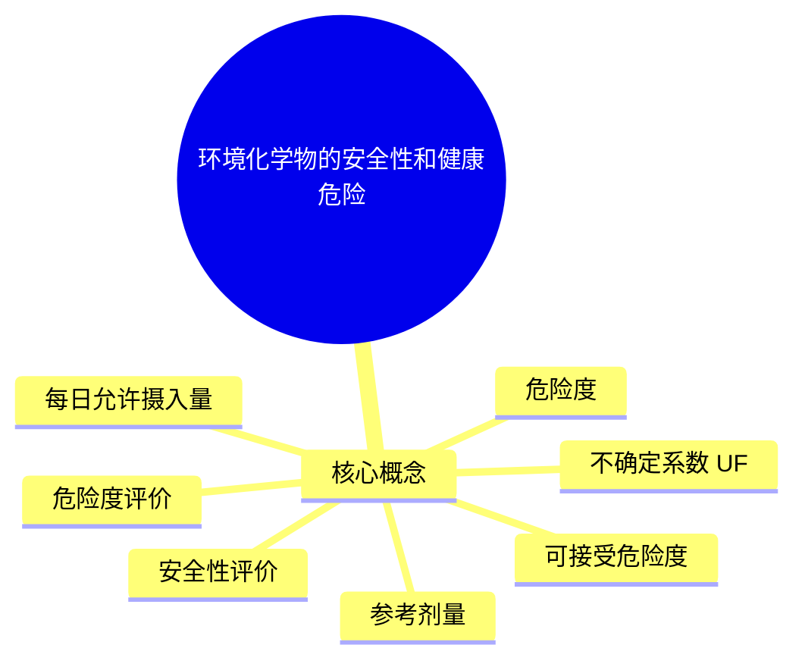

# 环境毒理学 · 第 6 章 · 环境化学物的安全性和健康危险度评价 · 素材

> 教师: 森巴提·叶尔肯 · 学期: 2026春
> 章下 PDF: 3 个 · 总页: 131
> 主版: 第 11 节 · 52 页

---

## 主版课件 · 第 11 节

> `011-6-第六章环境化学物的安全性和健康危险度评价-第七章 常见化学致癌物的环境毒理学.pdf`

<details><summary>展开 52 页图链</summary>

- [p001](../011-6-第六章环境化学物的安全性和健康危险度评价-第七章 常见化学致癌物的环境毒理学/page_001.jpg)  · 第七章 常见化学致癌
- [p002](../011-6-第六章环境化学物的安全性和健康危险度评价-第七章 常见化学致癌物的环境毒理学/page_002.jpg)  · 主要内容
- [p003](../011-6-第六章环境化学物的安全性和健康危险度评价-第七章 常见化学致癌物的环境毒理学/page_003.jpg)  · 新理大学
- [p004](../011-6-第六章环境化学物的安全性和健康危险度评价-第七章 常见化学致癌物的环境毒理学/page_004.jpg)  · 新理大学
- [p005](../011-6-第六章环境化学物的安全性和健康危险度评价-第七章 常见化学致癌物的环境毒理学/page_005.jpg)  · 投票量 最多可选1项
- [p006](../011-6-第六章环境化学物的安全性和健康危险度评价-第七章 常见化学致癌物的环境毒理学/page_006.jpg)  · 第一节多环芳烃类
- [p007](../011-6-第六章环境化学物的安全性和健康危险度评价-第七章 常见化学致癌物的环境毒理学/page_007.jpg)  · 新理大学
- [p008](../011-6-第六章环境化学物的安全性和健康危险度评价-第七章 常见化学致癌物的环境毒理学/page_008.jpg)  · 多环芳烃的来源
- [p009](../011-6-第六章环境化学物的安全性和健康危险度评价-第七章 常见化学致癌物的环境毒理学/page_009.jpg)  · 多环芳香烃（PAHs)可能存在的材料
- [p010](../011-6-第六章环境化学物的安全性和健康危险度评价-第七章 常见化学致癌物的环境毒理学/page_010.jpg)  · 食品中多环芳烃的污染来源
- [p011](../011-6-第六章环境化学物的安全性和健康危险度评价-第七章 常见化学致癌物的环境毒理学/page_011.jpg)  · 某些食品中3，4-苯并花含量（MG/KG）
- [p012](../011-6-第六章环境化学物的安全性和健康危险度评价-第七章 常见化学致癌物的环境毒理学/page_012.jpg)  · 序号 中文名 简称
- [p013](../011-6-第六章环境化学物的安全性和健康危险度评价-第七章 常见化学致癌物的环境毒理学/page_013.jpg)  · 按其化学结构特点可以分为三类：
- [p014](../011-6-第六章环境化学物的安全性和健康危险度评价-第七章 常见化学致癌物的环境毒理学/page_014.jpg)  · 新理大学
- [p015](../011-6-第六章环境化学物的安全性和健康危险度评价-第七章 常见化学致癌物的环境毒理学/page_015.jpg)  · 新理大学
- [p016](../011-6-第六章环境化学物的安全性和健康危险度评价-第七章 常见化学致癌物的环境毒理学/page_016.jpg)  · 苯环类
- [p017](../011-6-第六章环境化学物的安全性和健康危险度评价-第七章 常见化学致癌物的环境毒理学/page_017.jpg)  · 苯环类
- [p018](../011-6-第六章环境化学物的安全性和健康危险度评价-第七章 常见化学致癌物的环境毒理学/page_018.jpg)  · 、荧蒽及胆蒽类
- [p019](../011-6-第六章环境化学物的安全性和健康危险度评价-第七章 常见化学致癌物的环境毒理学/page_019.jpg)  · 新理大学
- [p020](../011-6-第六章环境化学物的安全性和健康危险度评价-第七章 常见化学致癌物的环境毒理学/page_020.jpg)  · 香烟烟雾中多环芳香烃致癌物及其含量
- [p021](../011-6-第六章环境化学物的安全性和健康危险度评价-第七章 常见化学致癌物的环境毒理学/page_021.jpg)  · 单选题1分
- [p022](../011-6-第六章环境化学物的安全性和健康危险度评价-第七章 常见化学致癌物的环境毒理学/page_022.jpg)  · 三.多环芳烃的致癌作用
- [p023](../011-6-第六章环境化学物的安全性和健康危险度评价-第七章 常见化学致癌物的环境毒理学/page_023.jpg)  · （2）湾区理论
- [p024](../011-6-第六章环境化学物的安全性和健康危险度评价-第七章 常见化学致癌物的环境毒理学/page_024.jpg)  · 新理大学
- [p025](../011-6-第六章环境化学物的安全性和健康危险度评价-第七章 常见化学致癌物的环境毒理学/page_025.jpg)  · 芳烃环氧化酶 芳烃水化酶HO H07.8-ePoxB(a)P 7.8-dioLB(a)PB(a)P
- [p026](../011-6-第六章环境化学物的安全性和健康危险度评价-第七章 常见化学致癌物的环境毒理学/page_026.jpg)  · （3）双区理论
- [p027](../011-6-第六章环境化学物的安全性和健康危险度评价-第七章 常见化学致癌物的环境毒理学/page_027.jpg)  · 双区理论要点：
- [p028](../011-6-第六章环境化学物的安全性和健康危险度评价-第七章 常见化学致癌物的环境毒理学/page_028.jpg)  · 2.多环芳烃类物质的致癌机理
- [p029](../011-6-第六章环境化学物的安全性和健康危险度评价-第七章 常见化学致癌物的环境毒理学/page_029.jpg)  · 三.多环芳烃在环境中的迁移转化行为及降解作用
- [p030](../011-6-第六章环境化学物的安全性和健康危险度评价-第七章 常见化学致癌物的环境毒理学/page_030.jpg)  · 新理大学
- [p031](../011-6-第六章环境化学物的安全性和健康危险度评价-第七章 常见化学致癌物的环境毒理学/page_031.jpg)  · 芳香胺类化合物
- [p032](../011-6-第六章环境化学物的安全性和健康危险度评价-第七章 常见化学致癌物的环境毒理学/page_032.jpg)  · 新疆大学 CCTV13 FTXinji 国家标准规定
- [p033](../011-6-第六章环境化学物的安全性和健康危险度评价-第七章 常见化学致癌物的环境毒理学/page_033.jpg)  · CCTV13 CCTV13 IT
- [p034](../011-6-第六章环境化学物的安全性和健康危险度评价-第七章 常见化学致癌物的环境毒理学/page_034.jpg)  · 一、芳香胺类化合物的污染来源
- [p035](../011-6-第六章环境化学物的安全性和健康危险度评价-第七章 常见化学致癌物的环境毒理学/page_035.jpg)  · 新理大学
- [p036](../011-6-第六章环境化学物的安全性和健康危险度评价-第七章 常见化学致癌物的环境毒理学/page_036.jpg)  · NHCOCH2-秦胺 2-乙酰氨基笏
- [p037](../011-6-第六章环境化学物的安全性和健康危险度评价-第七章 常见化学致癌物的环境毒理学/page_037.jpg)  · 2.芳香胺的致癌机理
- [p038](../011-6-第六章环境化学物的安全性和健康危险度评价-第七章 常见化学致癌物的环境毒理学/page_038.jpg)  · N一亚硝基化合物
- [p039](../011-6-第六章环境化学物的安全性和健康危险度评价-第七章 常见化学致癌物的环境毒理学/page_039.jpg)  · 新理大学
- [p040](../011-6-第六章环境化学物的安全性和健康危险度评价-第七章 常见化学致癌物的环境毒理学/page_040.jpg)  · 橡胶、切削、轧钢、处理胺类的工业
- [p041](../011-6-第六章环境化学物的安全性和健康危险度评价-第七章 常见化学致癌物的环境毒理学/page_041.jpg)  · 3.食品中的来源
- [p042](../011-6-第六章环境化学物的安全性和健康危险度评价-第七章 常见化学致癌物的环境毒理学/page_042.jpg)  · 特点
- [p043](../011-6-第六章环境化学物的安全性和健康危险度评价-第七章 常见化学致癌物的环境毒理学/page_043.jpg)  · （2）动物性食品中的硝酸盐和亚硝酸盐
- [p044](../011-6-第六章环境化学物的安全性和健康危险度评价-第七章 常见化学致癌物的环境毒理学/page_044.jpg)  · 新雅大学
- [p045](../011-6-第六章环境化学物的安全性和健康危险度评价-第七章 常见化学致癌物的环境毒理学/page_045.jpg)  · ·鱼、肉制品中的N一亚硝基化合物
- [p046](../011-6-第六章环境化学物的安全性和健康危险度评价-第七章 常见化学致癌物的环境毒理学/page_046.jpg)  · 新理大学
- [p047](../011-6-第六章环境化学物的安全性和健康危险度评价-第七章 常见化学致癌物的环境毒理学/page_047.jpg)  · 新事大
- [p048](../011-6-第六章环境化学物的安全性和健康危险度评价-第七章 常见化学致癌物的环境毒理学/page_048.jpg)  · 3.致畸作用
- [p049](../011-6-第六章环境化学物的安全性和健康危险度评价-第七章 常见化学致癌物的环境毒理学/page_049.jpg)  · 新理大学
- [p050](../011-6-第六章环境化学物的安全性和健康危险度评价-第七章 常见化学致癌物的环境毒理学/page_050.jpg)  · 新理大学
- [p051](../011-6-第六章环境化学物的安全性和健康危险度评价-第七章 常见化学致癌物的环境毒理学/page_051.jpg)  · 3.致癌机理
- [p052](../011-6-第六章环境化学物的安全性和健康危险度评价-第七章 常见化学致癌物的环境毒理学/page_052.jpg)  · 谢谢观赏

</details>

<details><summary>展开 52 页图文对照（每图配其识别文本）</summary>

**p001** 

第七章 常见化学致癌
物的环境毒理学
2025年4月

---

**p002** 

主要内容
多环芳烃类
芳香胺类化合物
N-亚硝基化合物
烷化剂
黄曲霉毒素

---

**p003** 

新理大学
2022年3月至4月，全国多省市公示
不合格化妆品共计82批次，面膜、染
发膏为不合格产品“重灾区
在82批次不合格化妆品中，26批次为面膜，占31.7%。不合格项
目大部分是菌落总数超标问题，包括霉菌和酵母菌总数超标。
染发类产品，本轮抽检不合格化妆品里，24批次为染发膏，占
29.3%。大部分抽检不合格染发膏的问题在于，被检测出标签
（批件）未标识对苯二胺、间氨基苯酚、间苯二酚等成分。

---

**p004** 

新理大学
抽检发现女装致癌物超标2多倍，服
装为什么致癌物超标？
深圳市安若依电子商务有限公司生产的时尚女装，被检出一种名为“联苯
胺”的可致癌芳香胺染料超标，而且超标非常严重。检测工程师表示，该
产品的可致癌芳香胺染料实测高达540毫克每千克，超标27倍，这意味着致
癌染料具有较高浓度，对人体健康带来的安全风险也更高。
东莞市曼邦电子商务有限公司生产的牛仔马甲，也被检出可致癌芳香胺染
料含量超过标准数值，达到30毫克每千克。

---

**p005** 

投票量 最多可选1项
买化妆品你会注意查看化妆品的配料表吗？
完全不看，因为看不懂
B 看一下，但不是看配料表，看生产日期或保质期
会看，知道哪些成分的作用是什么
会看，对化妆品配料表有一定的了解

---

**p006** 

第一节多环芳烃类
最早认识：
数量最多：致癌物中占1/3以上
分布最广
与人类关系密切

---

**p007** 

新理大学
什么是多环芳烃 （PAHS)
PAHs（多环芳烃，一种致癌物质）：多环芳烃是分子中含
有两个以上的苯环的炭氢化合物，包括茶、蒽、菲等150
余种化合物。英文全称为PolycyclicAromaticHydrocarbons
简称PAHs。
性状：纯的PAH通常是无色，白色，或浅黄绿色的固体

---

**p008** 

多环芳烃的来源
自然源：生物合成，火山爆发等
人为源：
1.家庭及生活炉灶，工业锅炉等产生烟灰，占51%。
2.各种产生和使用焦油的工业过程，如炼焦、石油热裂、煤焦油提炼、
柏油铺路等，占20%。
3.各种人为原因的露天焚烧和失火、抽烟等，占27%。
4.各种机车车辆及内然机排出的废气，占0.9%。
5.各种碳水化合物、氨基酸和酯肪酸在700C热解过程均有苯并（A）蒽
产生，地面水中的BAP除了工业排污外，主要来自洗刷大气的雨水。
在日常生活中，多环芳烃进人人体的最直接的途径是香烟烟雾和食
品的吸食。

---

**p009** 

多环芳香烃（PAHs)可能存在的材料
木炭，原油，木馏油，焦油 (天然)
药物，染料，塑料，橡胶，农药 (人为)
润滑油，脱膜剂，电容电解液，矿物油，柏油 (人为)
杀虫剂、杀菌剂、蚊香、吸烟、汽油阻凝剂(人为)
其它
多环芳香烃（PAHs)可能存在的产品
塑料手柄
塑料包装箱
橡胶手柄
有异味塑料、橡胶产品
电子电气设备中的塑料橡胶制件

---

**p010** 

食品中多环芳烃的污染来源
①食品在用煤、炭和植物燃料烘烤或熏制时直接受到污染；
②食品成分在高温烹调加工时发生热解或热聚反应所形成，这是食品
中多环芳烃的主要来源；
③植物性食品可吸收土壤、水和大气中污染的多环芳烃；
④食品加工中受机油和食品包装材料等的污染，在柏油路上晒粮食使
粮食受到污染；
5污染的水可使水产品受到污染；
植物和微生物可合成微量多环芳烃。

---

**p011** 

某些食品中3，4-苯并花含量（MG/KG）
食品 3，4-苯并花含量
烟熏鱼 1~10
冰岛式熏肉 23~107
火褪、香肠 0.02~14.6
烤牛排 8.0（美）
鲜鱼、青花鱼 9.7（日)
沙丁鱼 6.5（意大利）
雪鱼 15（格陵兰）
贻贝 40~50（格陵兰）
菠菜 7.4
甘蓝 12.6~48.1
苹果 0.1~0.5
茶叶 3.9~21.3
大豆 3.1
精制植物油 0.4~36

---

**p012** 

序号 中文名 简称
1 萘 Nap2 烯 AcPy3 Acp4 Flu5 菲 PA6 葱 Ant7 荧葱 FL8 Pyr9 苯并（a）蒽 BaA10 屈 CHR11 苯并（b）荧蒽 BbF12 苯并（k）荧蒽 BkF13 苯并（a）芘 BaP14 苯（1,2,3-cd）花 IND15 苯并（a,n）葱 DBA16 苯并（ghi）花（二萘嵌苯） Bghip

---

**p013** 

按其化学结构特点可以分为三类：
(1)苯环类
(2)苏、荧蒽及胆蒽类；
(3)杂环类
其中，（1）、（2）类为苯环类多环芳烃

---

**p014** 

新理大学
Naphthalin(CtoHe) Acenaphtylen(C2He)Acenaphthen(C2H1o) Fluoren(C13H1o)
Phenanthren(C14H1o) Anthracen(C14H1o) Fluoranthen(CteH1o)*
Pyren(C18H10) Benz(a)anthracen(CteH12) Chrysen(Ct8H12)

---

**p015** 

新理大学
Benzo(b)fluoranthen(C2oH12)* Benzo（k)fluoranthen(C2oH12)* Benzo（a)pyren(C2oH12)*
Dibenz（a,h)anthracen(C22H14) Benzo(ghi)perylen(C22H12)* Indeno（1,2,3-cd）pyren（C22H12）*

---

**p016** 

苯环类
1）二环芳香烃不致癌
2）三环以上的多环芳香烃有致癌性。三环芳烃的两异构体蒽和菲
都无致癌性。但它们的某些甲基衍生物有致癌性。
3）四环芳香烃有六个异构体，实验证明只有3，4-苯并菲有中等
强度的致癌性，1，2-苯并葱具有极弱的致癌性。它们的甲基衍
生物中2-甲基-3，4-苯并菲是强致癌物。1，2-苯并蒽的许多甲基、
烷基及多种其他取代基的衍生物都有一定的致癌性，如9，10-二
甲基-1，2-苯并葱是目前已知致癌性多环芳香烃中作用最快、活
性最大的皮肤致癌物之一。

---

**p017** 

苯环类
4）五环芳香烃，五环芳香烃有十五个异构体，其中五个有致癌性。3，4-苯并
花为特强致癌物，1，2，5，6-二苯并蒽为强致癌物，1，2，3，4-二苯并菲
为中强致癌物，1，2，7，8-二苯并蒽和1，2，5，6-二苯并菲为弱致癌物。
5）六环芳香烃，六环芳香烃的异构体比五环芳香烃的更多，但进行过致癌
实验的仅十多种。其中3，4，8，9-二苯并花是强致癌物，1，2，3，4-二苯
并花致癌性很强，3，4，9，10-二苯并花及1，2，3，4-二苯并花的7-甲基
衍生物也有明显致癌作用，其余六环芳香烃无致癌作用或仅有弱的致癌性。
6）七环以上的芳香烃研究得较少

---

**p018** 

、荧蒽及胆蒽类
本身无致癌性，但其某些衍生物具有致癌性。
例如，1，2，5，6-二苯并、1，2，1，8-二苯并和1，2，3，4-二苯并
等已被证实具有一定的致癌性，如可使小鼠发生皮肤癌。2，3-苯并蒽
和7，8-苯并葱具有强致癌作用，对小鼠皮肤的致癌作用仅次于3，4-苯并
花。
胆葱类
胆葱具有较强的致癌性，它的许多甲基及其他烷基衍生物也具有较强的
致癌性。例如3-甲基胆蒽是极强的致癌物，可致小鼠皮肤、宫颈、肺癌等
癌症。在肠道，由细菌作用脱氧胆酸可转化为甲基胆蒽这一化学致癌物可
能对人体有致癌作用。

---

**p019** 

新理大学
杂环类
多环芳烃的环中碳原子被氮、氧、硫等原子取代而成的化合物为杂
环多环芳香烃。杂环类多芳香烃中有一些化合物具有一定的致癌性。如
苯并吖啶、二苯并吖啶、咔唑。如苯并吖淀：葱分子环中10位的碳原子
被氮原子取代的化合物为吖淀。苯并（A）吖啶、苯并（C）吖啶均无致
癌性，它们的某些甲基衍生物却有致癌性。例如，8，10，12-三甲基苯
并（A）吖啶和9，10，12-三甲基苯并（A）吖啶均为强致癌物，7，9-二
甲基苯并（C）吖啶和7，10-二甲基苯并（C）吖啶均为极强的致癌物。
后二者的致癌力比3-甲基胆葱还强。二苯并吖啶：二苯并吖啶中研究
较多的有三个异构体，医学教育网搜集整理即二苯并（A，H）吖啶、及
二苯并（C，H）吖啶，三者均有致癌性。

---

**p020** 

香烟烟雾中多环芳香烃致癌物及其含量
多环芳香烃 含量（ug/10支） 致癌活性
3，4-苯并花 0.12~0.04 皮肤涂抹诱发皮肤癌
苯并（b）荧蒽 0.01~0.02 仅次于3，4-苯并花的致癌作用
苯并（j）荧蒽 0.06 皮肤涂抹诱发皮肤癌及乳头状瘤
二苯并（a,h）葱 0.005~0.04 不同途径、数种试验表明有局部和全
身致癌作用
二苯并（a,h）吖啶 0.001 涂抹及皮下注射都有致癌作用
二苯并（a,j）吖淀 0.027~0.1 涂抹及皮下注射都有致癌作用
7-H-二苯并（c,g）味唑 0.007 有局部及全身致癌作用
苯并（e）芘 0.02~0.2 致癌活性比3，4-苯比弱
二苯并（a,i）花 0.0002~0.1 皮肤涂抹及皮下注射都有致癌作用
苯并（a,h）花 微量 皮肤涂抹入皮下注射都有致癌作用
屈 0.006~0.6 皮肤癌
葫并芘 0.04~0.2 全能致癌物

---

**p021** 

单选题1分
以下哪种多环芳烃是不致癌的
六环芳烃
七环芳烃
三环芳烃
二环芳烃
提交

---

**p022** 

三.多环芳烃的致癌作用
1.结构与致癌活性
（1）K区理论 苯并[a]葱
K区：易与核酸、蛋白质反应→致癌
苯并[a]蕙
L区：对致癌反应起拮抗作用的区域
图7-1多环芳烃类的K区和L区
苯并（A）蒽：L区活泼=不致癌；第7、12位被甲基取代，L区
不活泼>致癌

---

**p023** 

（2）湾区理论
湾区理论由JERINA等于七十年代提出。
多环芳香烃分子的末端环与分子的其他环
形成的凹形结构为分子的湾区。形成湾区 湾区
的末端环为湾区的角环。
湾区环氧化→环氧化物→氧环打开
K区
>正碳离子=与嘌呤环的N共价结合 苯并[a]芘
DNA损伤
湾区正碳离子稳定性越高一致癌性越强

---

**p024** 

新理大学
湾区理论认为湾区的角环在代谢活化过程中对致
癌性能起关键作用。代谢活化过程中湾区的角环
形成的环氧化物是多环芳香烃的最终致癌形式，
由湾区的环氧化物进一步形成湾区正碳离子。湾
区正碳离子可与细胞内大分子结合，使细胞癌变。
湾区正碳离子稳定性愈高，致癌性愈强。

---

**p025** 

芳烃环氧化酶 芳烃水化酶HO H07.8-ePoxB(a)P 7.8-dioLB(a)PB(a)P
芳烃环 N-2鸟嘌呤-苯并花
氧化酶 HOHOH H dRHO7.8-dioL-9.10-ep0x HHB(a)P HQHOHN-6腺嘌呤-苯并花
HOHOH
苯并花与碱基的叠合物
图7-2苯并（a）花可能的致癌机理（引自朱世能，1986）

---

**p026** 

（3）双区理论
我国学者戴乾圆于1979年总结分析了致癌机理的“K区理论”和“湾区理论”后，
用计算机证明多环芳烃分子显示致癌活性的必要和充分条件是分子中存在两个
亲电活性区域，提出了“多环芳烃致癌性能的定量分子轨道模型----双区理
论”。双区理论又称双官能亲电理论。用于阐明或预言分子结构与致癌活性之
间关系的一种理论。
对已有致癌活性数据的全部多环芳烃母体，系统地进行了微扰分子轨道（PMO）计
算，包括湾区碳原子和K区碳原子的离域能，多环芳烃各个位置上的活性指数
等，根据近代多环芳烃代谢研究资料，通过数据处理得出。
双区理论认为：多环芳烃在体内致癌的关键步骤应是DNA互补碱对间的横
向交联。此理论现已推广应用于烷基多环芳烃、非交变烃、偶氮染料、
芳香胺等有机化合物的致癌活性预测。

---

**p027** 

双区理论要点：
（1）多环芳烃致癌作用的必要条件是其结构中要有两个，且只需两个
活性区域（即双区），也即是致癌剂在代谢过程中产生的两个亲电活性
中心。
（2）有利于致癌潜力的两个亲电烷化中心的最优距离为0.28一0.30NM，
若两个中心远远偏离这一距离，则该多环芳烃将丧失致癌活性。由于
DIVA互补碱对间以氢键结合的成对负性原子间的距离，正好为0.28一
0.30NM，因此，戴乾圆指出：DNA互补碱对间的共价交联，是启动细胞
癌变的关键步骤，并将此种认识定名为双区理论。
（3）用多环芳烃分子中两个活性区亲电正碳原子的离域能作参数，提
出了高精度的结构致癌活性关系的定量公式：
10gK=4.75/△E,△E22-0.05/2nE2
（活化项） （脱毒项）

---

**p028** 

2.多环芳烃类物质的致癌机理
（1)多环芳香烃的代谢活化
英国BOYLAND从1930年起研究芳香烃代谢与致癌作用问题，他
认为芳香烃首先经过环氧化过程才能有致癌能力。
(2)多环芳香烃与DNA、RNA及蛋白质的结合
3，4-苯并花，经代谢活化后的终致癌物为7，8-二氢二醇-9，10-
环氧苯并（A）花，分子中的环氧环打开后，10位氧为亲电子中心，
可与DNA和RNA碱基的亲核部位以共价键结合。根据研究得知3，4-
苯并花的代谢活化终致癌物主要是与鸟嘌呤的2-氨基结合。

---

**p029** 

三.多环芳烃在环境中的迁移转化行为及降解作用
1.多环芳烃在环境中的迁移转化
多环芳烃
大气
工业废水 →水体一人体 土壤
植物
动物

---

**p030** 

新理大学
2.多环芳烃在环境中的降解 降解
光氧化 生物还原
大气：光氧化作用
水体、土壤：生物、微生物分解
生物合成 多环芳烃 碳氢化合物
火山活动 高温裂解
大气
CO, H,O 呼
Visibie 1.0 吸
水 土壤
0.8 人体
Fe-smecsteC/CO 0.6 Fe-laolinite Fe-vemicuiteNa-smecite Na-vemiculite 植物
中 la-laolinite 食物
动物
0.0 10 121416
Time(h)
图7-3多环芳烃在环境中的循环（引自周明耀，1992）

---

**p031** 

芳香胺类化合物
芳香胺类化合物（AROMATICAMINOCOMPOUND）
·苯或其同系物芳香烃环上的氢原子被
氨基取代而形成芳香胺类化合物
固体、液体、挥发性低、易溶于脂肪；
氨基可在芳香环上单独取代，也可与
对-溴苯胺 邻-溴苯胺 间-溴苯胺 卤素、羟基、烃基在芳香环上的任何
m-bromcariline 位置进行取代
p-bromcarine o-bromcariline
属于中等毒性或低毒类药物， ，经呼吸
道、消化道进入人体。

---

**p032** 

新疆大学 CCTV13 FTXinji 国家标准规定
禁止使用含有能分解致癌芳香胺物质的染料
因为含有可分解致癌芳香胺物质的染料在穿
央视曝光的9种可致癌童装 着过程中会被还原分解出可致癌的芳香胺
这些染料在接触皮肤过程中可以引起病变甚
至请发症潜伏期可以长达20年
>圆领衫：上海胜茂服饰有限公司贝蒂130/64150/72140/68偶氮染料
>运动套装：上海达悦妇幼用品有限公司哈奇90/56偶氮染料、PH值、标签1项
>儿童迷彩中裤：深圳市古特实业有限公司古特120/54110/53偶氮染料、成份
>儿童套装：佛山南海衡星材料有限公司雅丽贝柔100-115偶氮染料、成份、标签4项（可致癌）
>中国风福禄套装：福绩（惠州）纺织综合厂有限公司e.Baby90/5280/48100/52偶氮染料、PH
值（可致癌）
>针织单衫：广州市荔湾区米娜童装行MINA1218偶氮染料、标签2项（可致癌）
>针织短袖T恤：石狮市苗杰儿服饰有限公司苗杰儿141618偶氮染料、成份、标签4项（可致癌）
>短袖T恤：汕头经济特区粤东海外贸易有限公司D.D.Cat叮当猫160/76150/68偶氮染料（可致
癌
儿童针织衫：佛山市超发制衣有限公司小方块135120130偶氮染料（可致癌）

---

**p033** 

CCTV13 CCTV13 IT
新间 新间
联苯胺
3.3'-二甲氧基联苯胺
一种染料合成的中间体有强烈的致癌作用
对人体有刺激性
可经呼吸道胃肠道皮肤进入人体
也是一种可疑致癌物
长期接触可引起出血性膀胱炎
严重的可引起膀胱癌
报质
报质
告量
告量

---

**p034** 

一、芳香胺类化合物的污染来源
芳香胺类化合物在工业上应用广泛，
从事有关化学工业（如芳香胺染料工业、橡胶工业、电缆电线制造业）的工人，
实验室使用芳香胺的实验人员，使用“安妥”（1一萘基硫尿）的专业灭鼠人员等，
如防护不当，均有可能接触芳香胺；
含有氨基酸的化学物质在700℃以上温度燃烧时，也有可能产生芳香胺，因此，在
焦化、煤气、沥青等作业中均有接触芳香胺的机会；
许多实用色素、香精、糖精等都是以芳香胺为原料的产物，其致癌性也应引起注
意。

---

**p035** 

新理大学
二、芳香胺的致癌作用
1.芳香胺的化学结构与致癌活性
（1）氨基位于多环芳烃中相当于萘的2位和联苯的对位上的化合物，均有较强致癌性：
（2）氨基位于萘的1位或联苯的间位上的化合物，有弱活性；
（3）芳香环上氨基的对位或邻位上的氢被甲基、甲氧基、氟或氯取代的化合物，致
癌性增强。

---

**p036** 

NHCOCH2-秦胺 2-乙酰氨基笏
联苯胺 4一氨基联苯
2-萘胺、联苯胺：膀胱癌，肝癌
2-乙酰氨基：肝癌、膀胱癌、乳腺癌
4氨基联苯：膀胱癌

---

**p037** 

2.芳香胺的致癌机理
芳香胺是间接致癌物质，先需经过代谢活化，其活化过程如下：
（1）氨基中的氮发生羟化，然后经重排形成邻位羟基化衍生物；
（2）羟化后的活化产物发生酯化，主要是硫酯化。酯化后的产物是水溶
性的，此时排到尿液中，储存于膀胱内，因而膀胱就成了靶器官；
（3）酯化后的活化产物与核酸中的碱基作用，使细胞的DNA发生结构与
功能的改变。

---

**p038** 

N一亚硝基化合物
N—亚硝基化合物（N—NITROSO—COMPOUND）是一类很强的化学致癌物，
其化学通式为：
亚硝胺：R、R为烷基、芳基或杂环
N-N=O
亚硝酰胺：R为烷基，R为酰基
目前，已知的N一亚硝基化合物有300余种，其中经动物实验证明具有致癌作
用的约占90%。主要导致：食道癌、肝癌、胃癌、膀胱癌。

---

**p039** 

新理大学
N一亚硝基化合物是引起人类恶性肿瘤的一类重要的致癌物质，他之所以比其他致癌物
质更引人注意，原因在于：
（1）这类物质在人类生活环境中的量虽不大，但却广泛存在；
2 易于在环境中形成，不仅可以在环境中外源性合成，还可以在生物体内进行内源
性合成；
（3）对从水生动物到人类的大多数动物都有致癌性，亦具有明显的致突变性和致畸性
（4）能诱发多种器官的肿瘤，有些N一亚硝基化合物能通过胎盘影响子代或二代发生
肿瘤，并能产生遗传致畸的作用。

---

**p040** 

橡胶、切削、轧钢、处理胺类的工业
I-亚硝基化合物的来源 人和动物体内生物合成
食品加工过程中合成
1.工业生产及应用
现代工业上生产及应用N一亚硝基化合物较少，主要用于染料、橡胶、
皮革、制药和电气工业，有的用作实验试剂。N一二甲基亚硝胺还可用于合成
火箭的动力燃料。
2.环境中及体内合成
N一亚硝基化合物由亚硝酸及胺或酰胺化合形成，化合作用可在环境及人
体内进行。N一亚硝胺的化合反应为：
NH+IINO N-NO+HO

---

**p041** 

3.食品中的来源
前体物：亚硝酸盐、胺类，硝酸盐可被硝基还原剂转化为亚硝酸盐，
故也是前体物。
（1）蔬菜中的硝酸盐和亚硝酸盐
微生物
氮（土壤、肥料） 硝酸盐、 植物体内
一氨 氨基酸和蛋白质
酶 光合作用

---

**p042** 

特点
A.新鲜蔬菜中硝酸盐含量与作物种类、栽培条件和
光照等因素有关。
B.蔬菜在储藏或腌制过程中，亚硝酸盐含量会增加
硝酸盐在微生物的硝基还原酶作用下转化为亚硝
酸盐）。

---

**p043** 

（2）动物性食品中的硝酸盐和亚硝酸盐
古老方法：腌制鱼、肉时添加硝酸盐，细菌作用下转化为亚硝酸
盐，达到防腐和着色（红色）双重目的。
现代方法：直接使用亚硝酸盐代替硝酸盐作为肉制品加工的着色
剂。

---

**p044** 

新雅大学
（3）食品中的胺类（胺可以看作是氨（NH3）分子中的氢原子被烃基
取代所生成的化合物。）
食品腐败变质过程中蛋白质的分解产物。
医药、农药和化工生产大量使用胺类物质，通过环境污染造成食
品污染胺类。
仲胺合成N一亚硝基化合物的能力最强。

---

**p045** 

·鱼、肉制品中的N一亚硝基化合物
■腌制、烘烤
油煎、油炸 胺类
腐败变质 +
亚硝酸
盐
N一亚硝基化合物

---

**p046** 

新理大学
二、N—亚硝基化合物的毒性
1.急性毒性
各种N一亚硝基化合物的急性毒性有很大的差异，多数为低毒或中等毒，少数为剧毒。
对称性烷基亚硝胺，其碳原子数目越多，毒性越小。
2.致癌作用：动物实验结果
能诱发各种实验动物的肿瘤：大鼠、小鼠、地鼠、豚鼠、兔、猪、狗等。
能诱发多种组织器官的肿瘤：致癌靶器官以肝、食管和胃为主，其它器官也可发生。
多途径致癌：呼吸道吸入，消化道摄入，皮下注射，皮肤接触性等。
通过胎盘屏障引起子代致癌。
亚硝酰胺为直接致癌物。亚硝酰胺类化合物水解生成烷基偶氮羟基化物（R一N=N一OH），对接触部位
直接致癌。
亚硝胺为间接致癌物。亚硝胺需在体内肝脏微粒体细胞色素P450代谢为烷基偶氮羟基化物，进而致癌。

---

**p047** 

新事大
Umive
二.M-亚硝基化合物的致癌作用
河南林县：食道癌高发区
酸菜汤浓缩液、酸菜提取液→成功诱发
大鼠食道癌
江苏启东县：肝癌高发区
采集59份腌菜：
病人家腌菜亚硝胺检出率100%
非病人家腌菜亚硝胺检出率60%
腌菜提取液饲喂大鼠=85%诱发肝癌

---

**p048** 

3.致畸作用
亚硝酰胺有一定的致畸作用，如甲基亚硝基脲可致胎鼠的脑、眼、肋骨
和脊柱的畸形。
亚硝胺的致畸作用较弱。
4.致突变作用
亚硝酰胺具有直接的致突变作用。
亚硝胺需经肝脏微粒体混合功能氧化酶系统代谢活化才有致突变作用。
致癌作用和致突变性没有相关性。
致突变作用强弱与致癌作用强弱也没有相关性。

---

**p049** 

新理大学
三、N一亚硝基化合物的致癌作用
1.化学结构与靶器官
N一亚硝基化合物可因化学结构的不同而有不同的靶器官，而引起不同部位的肿瘤。
N一亚硝基化合物的R1和R2对称时，如二甲基或二乙基亚硝胺，在大鼠通常引起肝癌，
二丁基亚硝酸胺引起膀胱癌，二戊基亚硝酸胺引起肺癌；
R1和R2不对称时，尤以其中一个为甲基者，如甲基戊基亚硝胺或甲基苯基亚硝胺，经常
引起食管癌；
含有环仲胺基的亚硝胺，如亚硝基哌啶、二硝基哌嗪等亦引起食管癌。
特定结构的N一亚硝基化合物的致癌活性。因此，这些N一亚硝基化合物对某些特定的器
官具有亲和性。

---

**p050** 

新理大学
2.N—亚硝基化合物的致癌特点
亚硝胺仅在代谢活跃的组织有致癌作用，
亚硝酰胺可任意分布在所有组织中，能在许多不同的器官引起肿瘤。
N一亚硝基化合物的致癌活性强，致癌剂量远远小于芳香胺及偶氮染料。
它能通过胎盘对子代动物产生致癌作用，还可通过母动物的乳汁传递给子代动物。

---

**p051** 

3.致癌机理
亚硝胺的化学性质比较稳定，对器官和组织的细胞并没有直接的致突变作用。它
一般要代谢转化，通过微粒体羟化酶，使一侧烷基的A一碳羟化，生成甲醛和甲基
亚硝胺，后者再转化为重氮羟化物，最后分解成烷基正离子，使核酸烷基化，此
作用多数发生在鸟嘌呤的7位氮上，生成7一烷基鸟嘌呤。
核酸的烷基化改变了细胞的遗传性，使体内蛋白质合成受到干扰，这是组织破坏
和致癌作用的前奏。
亚硝酰胺不需活化而直接致癌，这是因为它在生理PH条件下性质不稳定，分解后
产生与亚硝胺经活化产生的相同中间体而具致癌作用。

---

**p052** 

谢谢观赏

---

</details>

## 辅版课件

> 共 2 个辅版（同章不同次/不同侧重）。每辅版仅列前 3 页之链，余者参 主版 即可。

### 辅 1 · 第 10 节 · 40 页（跨章）

> `010-第五章 环境毒理学常用实验方法（2）-6-第六章环境化学物的安全性和健康危险度评价.pdf` · 涉章 [5, 6]

- [p001](../010-第五章 环境毒理学常用实验方法（2）-6-第六章环境化学物的安全性和健康危险度评价/page_001.jpg)  · 第六章环境化学物的安全性
- [p002](../010-第五章 环境毒理学常用实验方法（2）-6-第六章环境化学物的安全性和健康危险度评价/page_002.jpg)  · 引言
- [p003](../010-第五章 环境毒理学常用实验方法（2）-6-第六章环境化学物的安全性和健康危险度评价/page_003.jpg)  · 反应停
- ...余 37 页, 参 [`010-第五章 环境毒理学常用实验方法（2）-6-第六章环境化学物的安全性和健康危险度评价/`](../010-第五章 环境毒理学常用实验方法（2）-6-第六章环境化学物的安全性和健康危险度评价/)

### 辅 2 · 第 11 节 · 39 页

> `011-6-第六章环境化学物的安全性和健康危险度评价-6-第六章环境化学物的安全性和健康危险度评价.pdf` · 涉章 [6]

- [p001](../011-6-第六章环境化学物的安全性和健康危险度评价-6-第六章环境化学物的安全性和健康危险度评价/page_001.jpg)  · 第六章环境化学物的安全性
- [p002](../011-6-第六章环境化学物的安全性和健康危险度评价-6-第六章环境化学物的安全性和健康危险度评价/page_002.jpg)  · 引言
- [p003](../011-6-第六章环境化学物的安全性和健康危险度评价-6-第六章环境化学物的安全性和健康危险度评价/page_003.jpg)  · 反应停
- ...余 36 页, 参 [`011-6-第六章环境化学物的安全性和健康危险度评价-6-第六章环境化学物的安全性和健康危险度评价/`](../011-6-第六章环境化学物的安全性和健康危险度评价-6-第六章环境化学物的安全性和健康危险度评价/)

## 跨章节备注

此章之课件亦覆盖 第 5 章, 第 7 章, 复习时宜与彼章互参。

---

## 思维导图 · LLM 生成

### Markmap（Typora / markmap.js / Obsidian 可渲染）

```markmap
# 环境化学物的安全性和健康危险度评价
## 核心概念
- 安全性评价
- 危险度评价
- 危险度
- 可接受危险度
- 参考剂量
- 每日允许摄入量
- 不确定系数 UF
```

### Mermaid（GitHub Markdown 可渲染）



---

## 复习要点 · 已填

> 本章为决策章——把第 1~5 章之毒理学数据转化为**安全标准**与**风险结论**。
> 核心两套体系：**安全性评价**（4 阶段）与**健康危险度评价**（NAS 4 步法）。

### 一、核心概念（名词解释）

- **安全性评价（Safety Evaluation）**：依据毒理学试验结果，结合人群暴露资料，评定化学物在一定接触水平下对人体健康**是否安全**之过程
- **危险度评价（Risk Assessment）**：定量估测某接触水平下某化学物**致害人群健康之概率与程度**之过程
- **危险度（Risk）**：在特定条件下接触某物，发生有害效应之**概率**（单位时间、人群、效应）
- **可接受危险度（Acceptable Risk）**：社会愿接受之最大危险水平。一般定为终生致癌危险 **10⁻⁶ ~ 10⁻⁴**
- **参考剂量（RfD, Reference Dose）**：人群（含敏感人群）终生暴露而**不致明显有害效应**之每日允许摄入量
- **每日允许摄入量（ADI, Acceptable Daily Intake）**：与 RfD 类似，多用于食品添加剂/农残
- **不确定系数 UF**：从动物外推至人、个体差异、亚慢性外推至慢性等之安全裕度，常 100~1000

### 二、安全性评价 · **四阶段法**（中国/WHO 体系）

| 阶段 | 项目 | 目的 |
|-----|------|------|
| **第Ⅰ阶段·急性毒性试验** | LD₅₀、皮肤/眼黏膜刺激、致敏 | 初筛，分级 |
| **第Ⅱ阶段·遗传毒理学+30 d 喂养** | Ames、微核、染色体畸变；亚急性毒性 | 是否进下一步 |
| **第Ⅲ阶段·亚慢性毒性+生殖+代谢** | 90 d 喂养、致畸、代谢动力学 | 找 NOAEL，估 ADI |
| **第Ⅳ阶段·慢性毒性+致癌试验** | 终生暴露、致癌长期试验 | 终极 NOAEL，是否致癌 |

> 阶段递进：每阶段阳性 → 慎重决策；阴性 → 进下阶段；新化学物原则上需走完Ⅲ或Ⅳ。

### 三、健康危险度评价 · **NAS 四步法**（核心考点）

```
① 危害识别（Hazard Identification）
   └ 此化学物是否致害？ 致何种害？
       依据：动物试验、流行病学、构效关系（QSAR）、Ames 等
       结论：定性（"是"/"否"/"可能"）

② 剂量-反应关系评价（Dose-Response Assessment）
   └ 多大剂量致多大害？
       非致癌：从 NOAEL → RfD = NOAEL / UF
       致癌：低剂量外推（线性、Q*、BMD 法）

③ 暴露评价（Exposure Assessment）
   └ 人群实际接触多少？
       计算每日摄入量 ADD = (C × IR × ED) / (BW × AT)
       涉介质（空气/水/食物/土）、人群（普通/敏感/职业）

④ 危险表征（Risk Characterization）
   └ 综合①②③，给定量结论
       非致癌：HQ = ADD / RfD（HQ < 1 安全；> 1 有风险）
       致癌：终生超额致癌危险 = ADD × SF（SF = 致癌斜率因子）
```

### 四、关键公式（必背）

#### 1. 非致癌物
$$RfD = \frac{NOAEL}{UF \times MF}$$
- UF：不确定系数（10×10×10×10 ≤ 10000，常见 100~1000）
- MF：修正因子（1~10）
- **危险商 HQ = ADD / RfD**：HQ ≤ 1 安全；> 1 风险升

#### 2. 暴露剂量
$$ADD = \frac{C \times IR \times EF \times ED}{BW \times AT}$$
- C：环境浓度；IR：摄入率；EF：暴露频率（d/y）；ED：暴露年限（y）
- BW：体重；AT：平均时间（非致癌取 ED×365；致癌取 70×365）

#### 3. 致癌物
$$\text{终生超额致癌危险 } R = ADD \times SF$$
- SF（致癌斜率因子）：单位剂量致癌概率
- R = 10⁻⁶（百万分之一）通常视为可接受上限

### 五、不确定系数 UF 之常用值

| 因子 | 倍数 | 含义 |
|------|----:|------|
| **种间差异**（动物→人） | ×10 | 人比动物可能更敏感 |
| **种内差异**（人个体） | ×10 | 敏感人群（婴幼儿、孕妇、病人）|
| **亚慢性→慢性** | ×10 | 数据来自亚慢性试验时 |
| **LOAEL→NOAEL** | ×10 | 无 NOAEL 仅有 LOAEL 时 |
| **数据库不全** | ×3 | 关键试验缺时 |

> 常用合并：默认 UF = 100（种间×种内）；缺数据时叠加，最大可 ≤ 10000

### 六、致癌物之低剂量外推

- **线性多阶段模型（LMS）**：US EPA 默认，假设无阈值
- **基准剂量法（BMD, Benchmark Dose）**：拟合剂量-反应曲线，取 BMD₁₀ 之置信下限作起点
- **PBPK 模型**：基于生理药代动力学外推

### 七、高频考点（速记）

1. 安全性评价**四阶段法**：急性 → 遗传+亚急 → 亚慢+生殖 → 慢性+致癌
2. 危险度评价 **NAS 四步法**：危害识别 → 剂量反应 → 暴露评价 → 危险表征
3. **RfD = NOAEL / UF**（必背）
4. **HQ = ADD / RfD**：≤1 安全；>1 危
5. 致癌危险 **R = ADD × SF**
6. 可接受致癌危险：**10⁻⁶ ~ 10⁻⁴**
7. UF 常用：种间 ×10，种内 ×10 → 默认 100
8. ADD 公式中 BW 为体重，AT 为平均时间
9. NOAEL 是定 RfD 之**关键参数**
10. 致癌物原则上**无安全阈值**（LMS 假设）

### 八、典型思考题

**Q1**：写出 NAS 危险度评价四步法及各步之核心问题。  
A：
- ① **危害识别**：此化学物是否致害？哪种害？（定性）
- ② **剂量-反应关系评价**：多大剂量致多大害？（非致癌取 NOAEL，致癌做低剂量外推）
- ③ **暴露评价**：人群实际接触多少？（计算 ADD）
- ④ **危险表征**：综合上三步给定量结论（非致癌 HQ；致癌 R = ADD × SF）

**Q2**：为何制定 RfD 要除以不确定系数 UF？  
A：① 动物试验数据外推至人需考虑**种间差异**（×10）；② 人群个体差异（含敏感人群）（×10）；③ 试验时长不足、数据缺失等需额外修正。除以 UF 留出**安全裕度**保护人群。

**Q3**：HQ = 1.5 意味着什么？应否管控？  
A：HQ = ADD/RfD = 1.5 > 1，表明实际暴露已**超过参考剂量**之 1.5 倍，长期暴露有致害风险。应：① 核实暴露评估（C/IR 等）；② 加强源头管控（减污或换品）；③ 重点保护敏感人群。

**Q4**：可接受致癌危险水平为何取 10⁻⁶ ~ 10⁻⁴？  
A：10⁻⁶ 即百万人中一人因此致癌，被视为**可忽略风险**；10⁻⁴ 是**职业暴露**等情境之上限。两值是社会与科学折衷之结果，不同国家略异。

### 九、与前后章之关联

- **承第 5 章**（实验方法）：本章用前章测得之 LD₅₀/NOAEL/致突变性等
- **承第 4 章**（剂量-反应）：暴露评价中之剂量-反应关系正出此
- **启第 7 章**（致癌物）：本章框架在化学致癌物之具体应用
