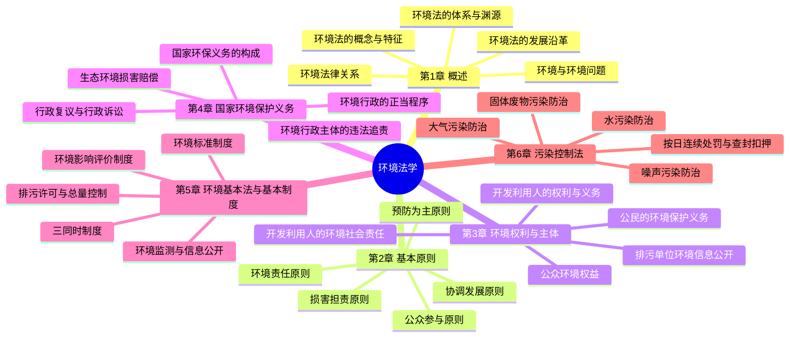
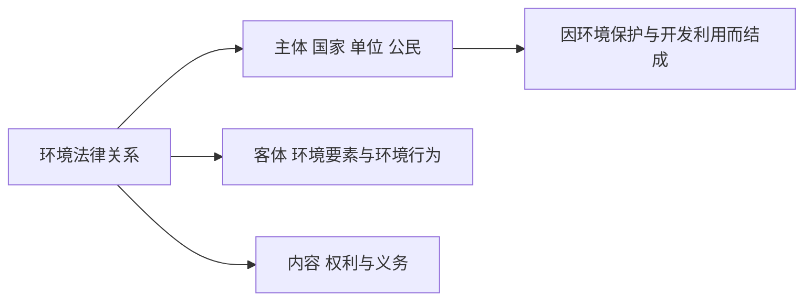
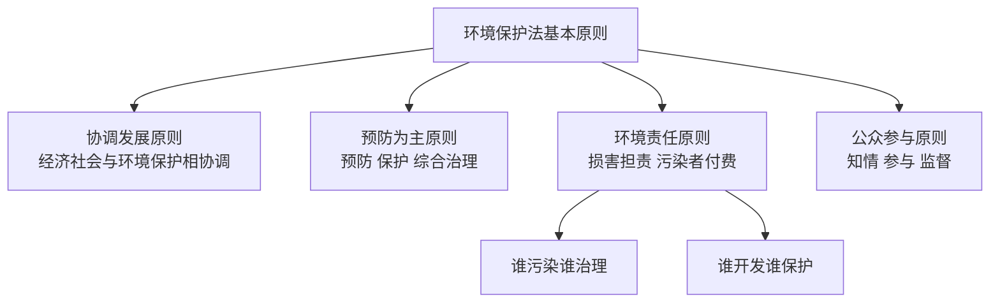
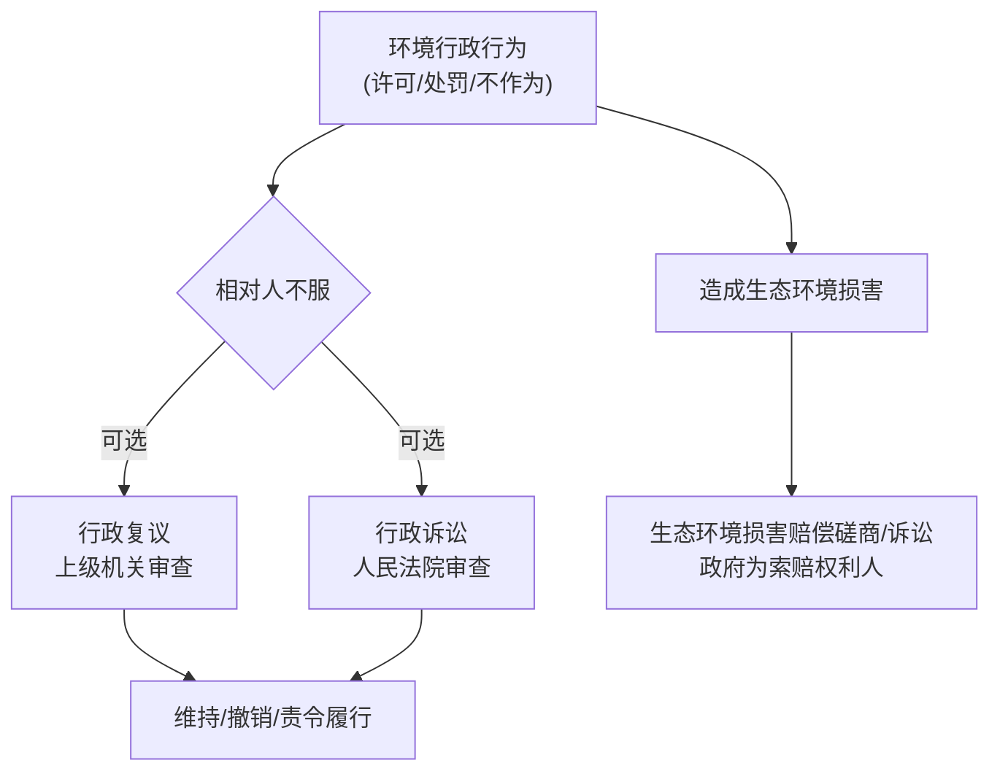
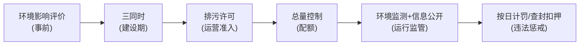
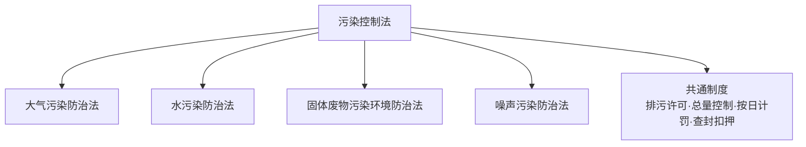

# 环境法学 · 核心例题精解 · 图示深化

> 本篇为**深化层**：在「综合复习资料」的概念与法条之上，逐章给出**名词解释 / 简答 / 案例分析 + 参考答案**，并配**思维导图 / 体系示意图**（mermaid 矢量图，非纯文字）。
> 法学题作答遵循"亮明观点 → 援引法条/原则 → 涵摄事实 → 得出结论"四步（IRAC 法律三段论）。

---

## 全课知识结构 · 思维导图

---

## 第 1 章 · 环境法概述

### 体系示意 · 环境法律关系三要素

### 例题 1-1（名词解释）
**题**：简述环境法的概念与基本特征。
**参考答案**：
- 概念：环境法是调整人们在**开发、利用、保护、改善环境与自然资源**过程中所产生的社会关系的法律规范的总称。
- 特征：① **综合性**（横跨行政、民事、刑事，自然科学与社会科学交叉）；② **科学技术性**（以环境科学规律和环境标准为依据）；③ **社会公益性**（保护的是不特定多数人的环境公共利益）；④ **共同性与区域性并存**（全球共治与因地制宜）。

### 例题 1-2（简答）
**题**：环境法的渊源（形式）有哪些？
**参考答案**：① 宪法中的环境保护条款；② 环境保护**基本法**（《环境保护法》）；③ 环境保护**单行法**（大气、水、固废、噪声等）；④ 环境保护**行政法规、部门规章与地方性法规**；⑤ 环境标准；⑥ 我国缔结或参加的**国际环境条约**。

### 例题 1-3（辨析）
**题**：判断并说明——"环境法只调整人与自然的关系"。
**参考答案**：**错误**。法律只能调整**人与人之间的社会关系**。环境法表面"保护环境"，实质是调整人们在开发利用与保护环境过程中**结成的人与人的社会关系**；人与自然的关系是其调整社会关系时所遵循的**自然规律基础**，而非法律调整对象本身。

---

## 第 2 章 · 环境保护法基本原则

### 体系示意 · 五项基本原则

### 例题 2-1（简答）
**题**：试述"预防为主"原则的内涵及其制度体现。
**参考答案**：
- 内涵：环境损害往往**不可逆、难恢复、代价高**，故应在行为发生**之前**采取措施防止或减轻损害，辅以综合治理。
- 制度体现：① **环境影响评价制度**（事前评价）；② **"三同时"制度**（防治设施与主体工程同时设计、施工、投产）；③ **规划环评**；④ **排污许可**与**总量控制**。

### 例题 2-2（论述）
**题**：论述"损害担责（污染者负担）"原则及其与传统"谁污染谁治理"的发展关系。
**参考答案**：
1. 含义：**造成环境污染和生态破坏的主体，应承担治理责任和赔偿责任**，将环境成本**内部化**。
2. 发展：早期表述为"谁污染谁治理"，侧重**末端治理**；2014 年《环境保护法》确立"**损害担责**"，扩展至**全过程、全要素**（含生态破坏、生态环境损害赔偿），责任形式涵盖行政、民事乃至刑事。
3. 意义：纠正"企业获利、社会买单"的外部性，倒逼清洁生产与源头减量。

### 例题 2-3（案例分析）
**题**：某化工厂长期超标排放废水致下游农田绝收。当地政府以"招商引资重点企业"为由不予处罚。请运用基本原则分析。
**参考答案**：
- 涉**协调发展原则**：经济发展不得以牺牲环境为代价，"重点企业"不构成免责事由。
- 涉**环境责任/损害担责原则**：超标排放者应承担**停止侵害、消除危险、赔偿损失**的民事责任及**罚款、责令整改**的行政责任。
- 涉**公众参与/监督**：受损农户有权举报、提起**环境民事公益诉讼**或私益诉讼；政府"不予处罚"属**行政不作为**，可申请复议或提起行政诉讼。

---

## 第 3 章 · 环境权利、行政相对人的权利义务

### 例题 3-1（名词解释）
**题**：什么是公众的环境权益？包含哪些内容？
**参考答案**：公众环境权益指公民、法人和其他组织依法享有的**在健康、适宜环境中生活，并参与环境治理**的权益。内容包括：① **环境知情权**；② **环境参与权**（决策参与）；③ **环境监督权**（举报、检举）；④ 受到损害时的**救济权**（诉讼、赔偿）。

### 例题 3-2（简答）
**题**：重点排污单位在环境信息公开方面负有哪些义务？
**参考答案**：① 如实**公开主要污染物名称、排放方式、浓度与总量、超标情况**；② 公开**污染防治设施的建设与运行情况**；③ 通过**统一平台**实时或定期公开监测数据；④ 不得**篡改、伪造**监测数据。未依法公开的，由环保主管部门责令公开、处罚并记入信用记录。

### 例题 3-3（案例分析）
**题**：某企业拒绝公开其废气在线监测数据，称属"商业秘密"。是否成立？
**参考答案**：**不成立**。污染物排放数据涉及**环境公共利益与公众知情权**，依法属**强制公开**信息，不属于可豁免的商业秘密。企业拒绝公开，环保主管部门可**责令公开、处以罚款并公开违法信息**；构成弄虚作假的，依法从重处理。

---

## 第 4 章 · 国家的环境保护义务

### 体系示意 · 救济路径

### 例题 4-1（简答）
**题**：环境行政主体应遵循的"正当程序"包含哪些基本要求？
**参考答案**：① **告知**（说明理由、权利义务）；② **听取意见/听证**（重大处罚前）；③ **回避**；④ **公开**（信息与依据）；⑤ **说明理由**；⑥ **救济告知**（复议、诉讼途径与期限）。

### 例题 4-2（辨析）
**题**：行政复议与行政诉讼的主要区别。
**参考答案**：
| 维度 | 行政复议 | 行政诉讼 |
|---|---|---|
| 审查机关 | 上级**行政机关** | **人民法院** |
| 审查范围 | 合法性**与合理性** | 原则上**合法性**为主 |
| 程序 | 相对简便、免费、较快 | 严格司法程序 |
| 关系 | 多数可**自由选择**；少数**复议前置** | — |

### 例题 4-3（案例分析）
**题**：某企业违法倾倒危废致土壤、地下水严重污染。除行政处罚外，国家可主张何种责任？由谁主张？
**参考答案**：可启动**生态环境损害赔偿**。① 权利主体：省级、市地级政府（及其指定部门）作为国家利益代表；② 方式：先**磋商**，磋商不成提起**生态环境损害赔偿诉讼**；③ 责任内容：修复生态环境（无法修复时赔偿修复费用）、赔偿期间服务功能损失、调查评估费用等。与行政罚款、刑事责任**可并行不悖**。

---

## 第 5 章 · 环境基本法与综合性环境法律制度

### 体系示意 · 全过程管控制度链

### 例题 5-1（名词解释）
**题**：什么是"三同时"制度？
**参考答案**：建设项目中**防治污染和保护环境的设施**，必须与主体工程**同时设计、同时施工、同时投产使用**的制度。它是预防为主原则在建设期的核心落实，与环评制度首尾衔接。

### 例题 5-2（简答）
**题**：简述环境影响评价制度的对象与基本程序。
**参考答案**：
- 对象：**规划**（综合性/专项规划）与**建设项目**。
- 程序：① 筛选分类（报告书 / 报告表 / 登记表）；② 编制环评文件；③ **公众参与**（重大项目）；④ 主管部门**审批**；⑤ 跟踪评价与**环保验收**。

### 例题 5-3（案例分析）
**题**：某项目未批先建、主体工程已投产但未建污染防治设施。涉及哪些制度违法？如何处理？
**参考答案**：① 违反**环评制度**（未批先建）——责令停止建设、罚款，可责令恢复原状；② 违反**三同时制度**（防治设施未同时投产）——责令限期建设配套设施、罚款；③ 若已排污，违反**排污许可**——责令停止排污、按日连续处罚直至改正。体现"预防为主 + 损害担责"。

---

## 第 6 章 · 污染控制法（要素法）

### 体系示意 · 单行法与共通制度

### 例题 6-1（简答）
**题**：《环境保护法》（2014）新增的"四大利剑"（强力执法手段）是什么？
**参考答案**：① **按日连续处罚**（违法持续，罚款按日累加，上不封顶）；② **查封、扣押**（对违法排污设施设备）；③ **限制生产、停产整治**；④ **行政拘留**（对情节严重的违法责任人，移送公安）。另含**环境公益诉讼**与企业违法信息**信用惩戒**。

### 例题 6-2（案例分析 · 按日计罚）
**题**：某厂超标排污被责令改正并罚款 10 万元；30 日后复查仍未改正。按日连续处罚如何计算？
**参考答案**：自**责令改正之日的次日**起，到**再次检查发现仍未改正之日**，按**原处罚数额按日累加**计罚。若期间为 30 日，则加罚 $10\text{ 万} \times 30 = 300\text{ 万元}$（与原 10 万元合并），且可同时采取**查封扣押、停产整治**等措施。其立法目的在于**消除"守法成本高、违法成本低"**的倒挂。

### 例题 6-3（辨析）
**题**：固体废物污染防治为何强调"减量化、资源化、无害化"三原则的顺位？
**参考答案**：① **减量化**居首——从源头减少产生量，治本；② **资源化**次之——对已产生废物循环利用，化害为利；③ **无害化**兜底——对无法利用者进行安全处置，防止二次污染。三者构成**从源头到末端**的递进式管控逻辑，契合"预防为主、综合治理"。

---

> **正言若反**：法条不离原则，原则不离事实，事实不离原始 PDF 课件之图表。本篇为"考场上写得出"的一层；遇疑，回归「综合复习资料」与各章素材，并核对最新法律文本。
