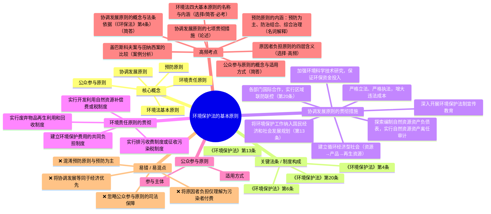
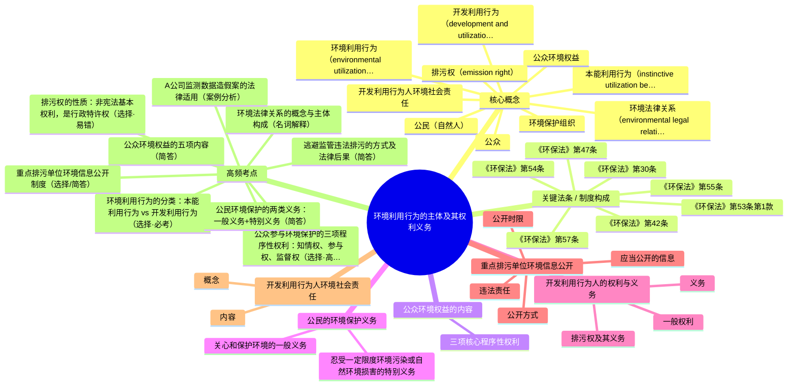
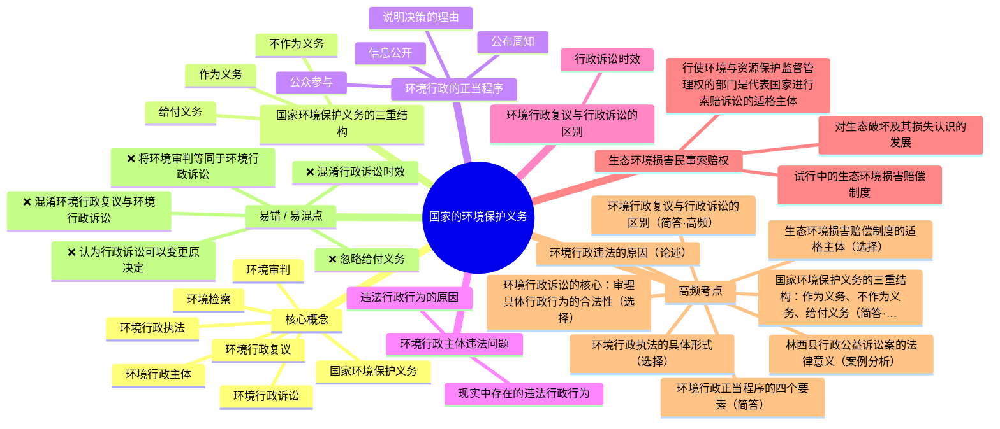
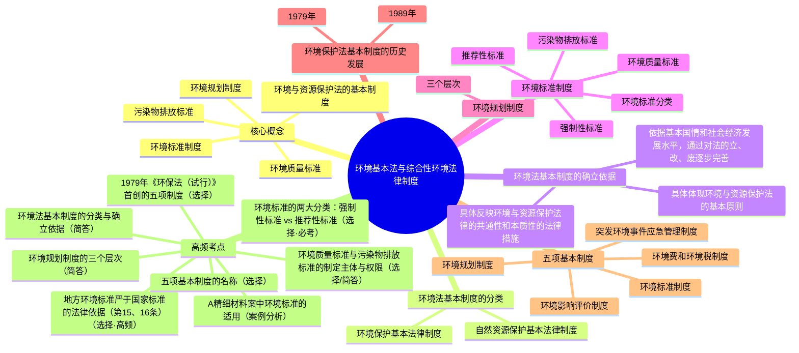

# 环境法学 · 综合复习资料

> 教师: 杨建英 · 学期: 2026春
> 链路：原始 PDF → 页图集（多图提取）→ 章节图谱 → LLM 协填要点 → 思维导图 → **本资料**
> 完成度：复习要点 **4/4** 章 · 嵌入子图 **0** 张 · 思维导图 **4/4** 章

---

## 一 · 章级入口

| 章 | 标题 | 主版页 | 子图 | 要点 | 图谱 | 素材 |
| ---: | ---- | -----: | ---: | :--: | :--: | ---- |
| 2 | 环境保护法的基本原则 | 35 | 0 | ✓ | ✓ | [_第02章_环境保护法的基本原则.md](./_第02章_环境保护法的基本原则.md) |
| 3 | 环境利用行为的主体及其权利义务 | 36 | 0 | ✓ | ✓ | [_第03章_环境利用行为的主体及其权利义务.md](./_第03章_环境利用行为的主体及其权利义务.md) |
| 4 | 国家的环境保护义务 | 17 | 0 | ✓ | ✓ | [_第04章_国家的环境保护义务.md](./_第04章_国家的环境保护义务.md) |
| 5 | 环境基本法与综合性环境法律制度 | 23 | 0 | ✓ | ✓ | [_第05章_环境基本法与综合性环境法律制度.md](./_第05章_环境基本法与综合性环境法律制度.md) |

## 二 · 全章综合汇编

### 第 2 章 · 环境保护法的基本原则

> 素材：[_第02章_环境保护法的基本原则.md](./_第02章_环境保护法的基本原则.md) · 主版 35 页

> 以下内容均从课件PDF的OCR识别文本中迁移整理，去芜存菁。

#### 一、核心概念（名词解释）

- **环境法基本原则**：调整因开发利用、保护和改善环境而产生的社会关系的指导思想和基本准则，是环境法本质和特征的集中体现，具有普遍指导作用。（p002）
- **预防原则**（预防为主，防治结合，综合治理）：强调在环境问题发生前采取预防措施，避免环境损害的发生和扩大。（p002）
- **协调发展原则**（经济、社会发展与环境保护相协调）：在发展经济的同时加强保护和改善环境，使环境保护和经济建设同步发展，坚持在发展中保护、在保护中发展，实现经济效益、社会效益、环境效益的统一。（p003）
- **环境责任原则**（原因者负担原则）：污染者付费、利用者补偿、开发者保护、破坏者恢复。（p002、p031）
- **公众参与原则**：公众有权通过一定程序或途径参与一切与公众环境权益相关的开发决策等活动，并有权得到相应的法律保护和救济，以防止决策的盲目性。（p033）

#### 二、关键法条 / 制度构成

- **《环境保护法》第4条**：保护环境是国家的基本国策。国家采取有利于节约和循环利用资源、保护和改善环境、促进人与自然和谐的经济、技术政策和措施，使经济社会发展与环境保护相协调。（p003）
- **《环境保护法》第6条**：一切单位和个人都有保护环境的义务。地方各级人民政府应当对本行政区域的环境质量负责。企业事业单位和其他生产经营者应当防止、减少环境污染和生态破坏，对所造成的损害依法承担责任。（p031）
- **《环境保护法》第13条**：县级以上人民政府应当将环境保护工作纳入国民经济和社会发展规划。环境保护规划与主体功能区规划、土地利用总体规划和城乡规划等相衔接。（p016）
- **《环境保护法》第20条**：国家建立跨行政区域的重点区域、流域环境污染和生态破坏联合防治协调机制，实行统一规划、统一标准、统一监测、统一的防治措施。（p019 · 区域联防联控）

#### 三、重要案例

- **盖巴斯科夫-拉基玛洛大坝案**（p005-p006）：匈牙利与捷克在多瑙河修建大坝，匈牙利认定生态效益高于经济利益而停工。国际法院判决指出"可持续发展充分表达了将经济发展与环境保护相协调的需要"。→ 协调发展原则的国际法实践
- **田纳西流域管理局诉希尔案**（p011-p015）：美国联邦最高法院以6:3判决保护濒危蜗牛镖优先于耗资一亿多美元的大坝完工。→ 环境保护优先于经济利益的经典判例
- **中国东部沿海癌症村**（p007-p010）：浙江绍兴滨海工业区纺织企业污染致多个癌症村出现，"化工企业开到哪里，癌症村便出现在哪里"。→ 先污染后治理的惨痛教训
- **株洲河西高新区案例**（p028-p029）：57个建设项目仅9个执行"三同时"，色拉油厂废水直排湘江造成严重农业损失。→ 有法不依、执法不严的典型

#### 四、协调发展原则的贯彻措施（p016-p030）

1. 将环境保护工作纳入国民经济和社会发展规划（第13条）
2. 各部门国际合作，实行区域联防联控（第20条）
3. 深入开展环境保护法制宣传教育
4. 加强环境科学技术研究，保证环保资金投入
5. 建立循环经济型社会（资源→产品→再生资源）
6. 严格立法、严格执法，增大违法成本
7. 探索编制自然资源资产负债表，实行自然资源资产离任审计

#### 五、环境责任原则的贯彻（p032）

1. 实行排污收费制度或征收污染税制度
2. 实行废弃物品再生利用和回收制度
3. 实行开发利用自然资源补偿费或税制度
4. 建立环境保护费用的共同负担制度

#### 六、公众参与原则（p033-p035）

- **参与主体**：居民、各类专业人士、社会团体、与拟议行为有关的行政机关
- **适用方式**：①环境影响评价中的公众参与制度；②决策信息公开与披露制度；③鼓励非政府环境组织代表公众参与；④公众参与的行政和司法保障制度

#### 七、高频考点（速记）

1. 环境法四大基本原则的名称与内涵（选择/简答·必考）
2. 协调发展原则的概念与法条依据（《环保法》第4条）（简答）
3. 预防原则的内涵：预防为主、防治结合、综合治理（名词解释）
4. 原因者负担原则的四层含义（选择·高频）
5. 公众参与原则的概念与适用方式（简答）
6. 协调发展原则的七项贯彻措施（论述）
7. 盖巴斯科夫案与田纳西案的比较（案例分析）

#### 八、易错 / 易混点

- ❌ 将"协调发展"等同于"经济优先"：协调发展强调同步，非经济优先
- ❌ 混淆"预防原则"与"预防为主"：前者是基本原则，后者是其内涵之一
- ❌ 将"原因者负担"仅理解为"污染者付费"：还包括利用者补偿、开发者保护、破坏者恢复
- ❌ 忽略公众参与原则的司法保障：公众参与不仅限于行政程序，还包括司法救济

#### 九、与前后章之关联

- **← 第1章**：第1章环境法概述为基本原则提供理论基础
- **→ 第3章**：第3章环境利用行为主体是公众参与原则的具体化
- **→ 第5章**：第5章环境基本制度是基本原则的制度化落实
- **→ 第6章**：第6章污染控制法是原因者负担原则的具体适用

<details><summary>🧠 思维导图（markmap / mermaid）</summary>

### Markmap（Typora / markmap.js / Obsidian 可渲染）

```markmap
# 环境保护法的基本原则
## 核心概念
- 环境法基本原则
- 预防原则
- 协调发展原则
- 环境责任原则
- 公众参与原则
## 关键法条 / 制度构成
- 《环境保护法》第4条
- 《环境保护法》第6条
- 《环境保护法》第13条
- 《环境保护法》第20条
## 协调发展原则的贯彻措施
- 将环境保护工作纳入国民经济和社会发展规划（第13条）
- 各部门国际合作，实行区域联防联控（第20条）
- 深入开展环境保护法制宣传教育
- 加强环境科学技术研究，保证环保资金投入
- 建立循环经济型社会（资源→产品→再生资源）
- 严格立法、严格执法，增大违法成本
- 探索编制自然资源资产负债表，实行自然资源资产离任审计
## 环境责任原则的贯彻
- 实行排污收费制度或征收污染税制度
- 实行废弃物品再生利用和回收制度
- 实行开发利用自然资源补偿费或税制度
- 建立环境保护费用的共同负担制度
## 公众参与原则
- 参与主体
- 适用方式
## 高频考点
- 环境法四大基本原则的名称与内涵（选择/简答·必考）
- 协调发展原则的概念与法条依据（《环保法》第4条）（简答）
- 预防原则的内涵：预防为主、防治结合、综合治理（名词解释）
- 原因者负担原则的四层含义（选择·高频）
- 公众参与原则的概念与适用方式（简答）
- 协调发展原则的七项贯彻措施（论述）
- 盖巴斯科夫案与田纳西案的比较（案例分析）
## 易错 / 易混点
- ❌ 将"协调发展"等同于"经济优先"
- ❌ 混淆"预防原则"与"预防为主"
- ❌ 将"原因者负担"仅理解为"污染者付费"
- ❌ 忽略公众参与原则的司法保障
```

### Mermaid（GitHub Markdown 可渲染）



</details>

---

### 第 3 章 · 环境利用行为的主体及其权利义务

> 素材：[_第03章_环境利用行为的主体及其权利义务.md](./_第03章_环境利用行为的主体及其权利义务.md) · 主版 36 页

> 以下内容均从课件PDF的OCR识别文本中迁移整理，去芜存菁。

#### 一、核心概念（名词解释）

- **环境利用行为（environmental utilization behavior）**：人类为满足生存需要有意识地获取环境要素或者从环境要素中谋取利益的活动。（p003）
- **本能利用行为（instinctive utilization behavior）**：行为人在自然状态下为了生存繁衍、适应环境变化所进行的利用和改变环境的活动。以基本生存为目的——产生了环境权。（p003）
- **开发利用行为（development and utilization behavior）**：行为人以谋取环境容量与自然资源的经济利益为目的，向环境排放或处理废弃物质与能量或开发自然资源与能源等利用和改变环境状况的活动。分为环境容量利用行为和自然资源利用行为两大类。（p004）
- **环境法律关系（environmental legal relation）**：环境利用行为主体间发生的具有权利义务内容的社会关系。实质是受法律调整的环境利用关系，以主体在环境利用行为中的权利义务为基本内容。（p005）
- **公民（自然人）**：环境和自然资源的享受者或者是环境质量和生态效益的受益者。（个人）（p006）
- **公众**：与开发利用环境行为及其结果有直接和间接利害关系的各种主体的统称。（群体）（p006）
- **环境保护组织**：依法在设区的市级以上人民政府民政部门登记，专门从事环境保护公益活动连续五年以上且无违法记录的社会组织。（p006）
- **公众环境权益**：既是公民基本权利中与享受优美环境相关的、非独占性的权利和利益的集合，也是公民对其正常生活和工作环境享有的不受他人干扰和侵害的权利与利益。（包括共益权和自益权）（p007）
- **排污权（emission right）**：环境主管部门依法赋予排污者依照法律规定的污染物排放（控制）标准向环境排放污染物的权利，而非宪法上的基本权利。（p019）
- **开发利用行为人环境社会责任**：从事开发利用行为人作为一类社会群体对社会以及其他公众除强制性法律规范外的环境保护义务。具有道义性特征。（p035）

#### 二、关键法条 / 制度构成

- **《环保法》第53条第1款**：公民、法人和其他组织依法享有获取环境信息、参与和监督环境保护的权利。宣示了公众参与环境保护的三项程序性权利：环境知情权、参与权和监督权。（p010）
- **《环保法》第57条**：规定了公众对于环境违法行为的举报权。接受举报的机关应当对举报人的相关信息予以保密，保护举报人的合法权益。（p011）
- **《环保法》第54条**：规定了政府机关和其他公共服务机构的环境信息发布职责。国务院环境保护主管部门统一发布国家环境质量、重点污染源监测信息及其他重大环境信息。还规定了环境违法企业的"黑名单"制度。（p012、p015）
- **《环保法》第30条**：开发利用自然资源，应当合理开发，保护生物多样性，保障生态安全，依法制定有关生态保护和恢复治理方案并予以实施。（p018）
- **《环保法》第42条**：排放污染物的企业事业单位和其他生产经营者应当采取措施防治污染；应建立环境保护责任制度；重点排污单位应安装使用监测设备；严禁通过暗管、渗井、渗坑、灌注或篡改伪造监测数据等逃避监管方式违法排放污染物。（p020-p023）
- **《环保法》第55条**：重点排污单位应当如实向社会公开其主要污染物的名称、排放方式、排放浓度和总量、超标排放情况，以及防治污染设施的建设和运行情况，接受社会监督。（p024）
- **《环保法》第47条**：各级人民政府及其有关部门和企业事业单位应当做好突发环境事件的风险控制、应急准备、应急处置和事后恢复等工作。企业事业单位应制定突发环境事件应急预案。（p031）

#### 三、公众环境权益的内容（p008-p009）

1. 优美、舒适环境的享受权
2. 开发利用环境决策与行为知悉权
3. 开发利用环境决策建言权
4. 监督开发利用环境行为及其举报权
5. 环境权益侵害救济请求权

**三项核心程序性权利**：环境知情权、参与权和监督权（第53条）

#### 四、公民的环境保护义务（p016）

1. **关心和保护环境的一般义务**：《环保法》规定一切单位和个人都有保护环境的义务
2. **忍受一定限度环境污染或自然环境损害的特别义务**：容忍的判断标准是排放行为是否具有合法性，以是否构成实质性影响为判断标准。是否应当忍受实质性影响取决于两个条件：①行为是否为当地通行；②影响是否可以通过经济上可行的措施克服

#### 五、开发利用行为人的权利与义务（p017-p031）

**一般权利**：
- 取得政府特许的自然资源开发利用权或向环境排放污染物的权利
- 按照自然资源规划或环境保护规划实施开发和利用环境的行为

**义务**：
- 接受国家宏观调控和管理监督
- 触犯法律法规时接受制裁
- 造成环境损害时承担民事责任

**排污权及其义务**（p019-p023）：
- 遵守排污范围、方法、途径及标准
- 履行环境影响评价和"三同时"、排污许可、缴纳排污费税、接受现场检查等法定义务
- 企业环保责任制：单位负责人为总负责人，环境监督员具体负责
- 重点排污单位环境监测义务：安装使用监测设备，保证正常运行，保存原始监测记录
- 严禁逃避监管违法排污：暗管、渗井、渗坑、灌注、篡改伪造监测数据等 → 行政拘留5-15日，构成犯罪追究刑事责任

#### 六、重点排污单位环境信息公开（p024-p030）

- **应当公开的信息**（第9条）：基础信息、排污信息、防治污染设施建设和运行情况、环评及环保行政许可情况、突发环境事件应急预案、其他
- **公开方式**（第10条）：网站、企业环境信息公开平台、当地报刊等便于公众知晓的方式
- **公开时限**（第11条）：名录公布后90日内公开；新生成或变更信息30日内公开
- **违法责任**：责令公开，处3万元以下罚款，并予以公告

#### 七、重要案例

- **A公司环境监测数据弄虚作假案**（p032-p034）：A公司高浓度焦化废水未经处理直接用于熄焦（恶意偷排），自动监控数据造假（SO₂显示35-90mg/m³，实测166-172mg/m³）。B市环保局处罚145万元+没收保证金100万元；主管经理和仪表部经理被行政拘留7日。→ 体现《环保法》第42条对监测数据造假的严厉制裁

#### 八、开发利用行为人环境社会责任（p035-p036）

- **概念**：除强制性法律规范外的环境保护义务，具有道义性
- **内容**：①通过环境保护质量体系认证或获得绿色标签认定；②推行清洁生产；③主动对外宣示环境保护守则

#### 九、高频考点（速记）

1. 环境利用行为的分类：本能利用行为 vs 开发利用行为（选择·必考）
2. 环境法律关系的概念与主体构成（名词解释）
3. 公众环境权益的五项内容（简答）
4. 公众参与环境保护的三项程序性权利：知情权、参与权、监督权（选择·高频）
5. 公民环境保护的两类义务：一般义务+特别义务（简答）
6. 排污权的性质：非宪法基本权利，是行政特许权（选择·易错）
7. 逃避监管违法排污的方式及法律后果（简答）
8. 重点排污单位环境信息公开制度（选择/简答）
9. A公司监测数据造假案的法律适用（案例分析）

#### 十、易错 / 易混点

- ❌ 将"公众"等同于"公民"：公众是群体概念，包括公民、法人、其他组织
- ❌ 混淆"排污权"与"环境权"：排污权是行政特许权，非宪法基本权利
- ❌ 忽略"忍受义务"的两个条件：当地通行+经济上可行措施可克服
- ❌ 将"环境社会责任"等同于"法律义务"：前者是道义性的，非强制性
- ❌ 混淆"本能利用行为"与"开发利用行为"：前者以基本生存为目的，后者以经济利益为目的

#### 十一、与前后章之关联

- **← 第2章**：第2章公众参与原则在本章具体化为公众环境权益
- **→ 第4章**：本章开发利用行为人的义务对应第4章国家的环境保护义务
- **→ 第5章**：本章排污权、环境信息公开放在第5章制度体系中落实

<details><summary>🧠 思维导图（markmap / mermaid）</summary>

### Markmap（Typora / markmap.js / Obsidian 可渲染）

```markmap
# 环境利用行为的主体及其权利义务
## 核心概念
- 环境利用行为（environmental utilization behavior）
- 本能利用行为（instinctive utilization behavior）
- 开发利用行为（development and utilization behavior）
- 环境法律关系（environmental legal relation）
- 公民（自然人）
- 公众
- 环境保护组织
- 公众环境权益
- 排污权（emission right）
- 开发利用行为人环境社会责任
## 关键法条 / 制度构成
- 《环保法》第53条第1款
- 《环保法》第57条
- 《环保法》第54条
- 《环保法》第30条
- 《环保法》第42条
- 《环保法》第55条
- 《环保法》第47条
## 公众环境权益的内容
- 三项核心程序性权利
## 公民的环境保护义务
- 关心和保护环境的一般义务
- 忍受一定限度环境污染或自然环境损害的特别义务
## 开发利用行为人的权利与义务
- 一般权利
- 义务
- 排污权及其义务
## 重点排污单位环境信息公开
- 应当公开的信息
- 公开方式
- 公开时限
- 违法责任
## 开发利用行为人环境社会责任
- 概念
- 内容
## 高频考点
- 环境利用行为的分类：本能利用行为 vs 开发利用行为（选择·必考）
- 环境法律关系的概念与主体构成（名词解释）
- 公众环境权益的五项内容（简答）
- 公众参与环境保护的三项程序性权利：知情权、参与权、监督权（选择·高频）
- 公民环境保护的两类义务：一般义务+特别义务（简答）
- 排污权的性质：非宪法基本权利，是行政特许权（选择·易错）
- 逃避监管违法排污的方式及法律后果（简答）
- 重点排污单位环境信息公开制度（选择/简答）
- A公司监测数据造假案的法律适用（案例分析）
```

### Mermaid（GitHub Markdown 可渲染）



</details>

---

### 第 4 章 · 国家的环境保护义务

> 素材：[_第04章_国家的环境保护义务.md](./_第04章_国家的环境保护义务.md) · 主版 17 页

> 以下内容均从课件PDF的OCR识别文本中迁移整理，去芜存菁。

#### 一、核心概念（名词解释）

- **国家环境保护义务**：国家对环境保护承担的作为义务、不作为义务和给付义务的总称。（p002目录）
- **环境行政主体**：依法享有国家行政职权、能代表国家独立进行环境行政管理并独立参加环境行政公益诉讼的组织。（p005）
- **环境行政执法**：环境行政主体依照法定职权与程序对环境行政相对人所实施的具有法律约束力的具体行政行为。形式包括：环境行政许可、排污收费、现场检查、"三同时"验收、环境行政确认、环境行政处罚等。（p005）
- **环境行政复议**：公民、法人或其他组织认为环境具体行政行为侵犯其合法权益，向环境行政机关提出行政复议申请，行政复议机关依法对该具体行政行为进行合法性、合理性审查并作出行政复议决定的活动。（p011）
- **环境行政诉讼**：公民、法人或其他组织认为环境行政机关的具体行政行为侵犯其合法权益时，依法向人民法院提起诉讼，由人民法院进行审理并作出裁判的活动。核心是审理具体行政行为的合法性，一般不包括合理性审查。（p011）
- **环境审判**：人民法院依照法定程序对涉及环境污染和生态破坏的行政、民事和刑事诉讼案件进行审理并判决的活动。2014年6月最高人民法院成立了环境资源审判庭。（p014）
- **环境检察**：人民检察院依照法定程序审查被检举的破坏环境与资源保护犯罪事实并提起诉讼，依法认定和处理违反环境保护法规的玩忽职守罪和直接受理立案侦查的环境监管失职罪，以及依法提起环境公益诉讼等活动。（p015）

#### 二、国家环境保护义务的三重结构（p002目录）

1. **作为义务**（4.1.1）：国家必须积极采取行动保护环境
2. **不作为义务**（4.1.2）：国家不得实施破坏环境的行为
3. **给付义务**（4.1.3）：国家应向公民提供环境保护的公共物品和服务

#### 三、环境行政的正当程序（p004）

1. 信息公开
2. 公众参与
3. 说明决策的理由
4. 公布周知

#### 四、环境行政主体违法问题（p006-p009）

**现实中存在的违法行政行为**：执法主体滥用职权、违反法定程序、越权行政、执法主体不适合、失职或不作为、证据不确实充分、定性不准确、适用法律不准确、行政处罚不恰当等。

**违法行政行为的原因**：
1. 环保立法障碍：部门本位主义思想严重；环境立法之间关系不协调
2. 环境管理体制不完善：管理机构设置重复；政府行使了环保部门的部分职权
3. 环保部门执法权限设置问题：各职能部门执法权配置不恰当；环保部门缺乏必要的强制执行权
4. 环保部门的民主性、透明度不高
5. 未形成强有力的监督机制
6. 环保部门自身建设落后：法制机构欠缺；投入不足；人员专业化素养不高

#### 五、环境行政复议与行政诉讼的区别（p012）

| 区别点 | 行政复议 | 行政诉讼 |
|--------|---------|---------|
| 性质 | 行政行为 | 司法行为 |
| 审查范围 | 合法性+合理性 | 仅合法性（一般） |
| 审查结果 | 可维持或变更原决定 | 一般只能维持或撤销，不能变更 |
| 不服后续 | 向法院起诉（一审程序） | 提起上诉（上诉程序） |

**行政诉讼时效**：《环保法》15天；《森林法》《渔业法》30天

#### 六、生态环境损害民事索赔权（p013）

- 对生态破坏及其损失认识的发展——生态补偿制度
- 行使环境与资源保护监督管理权的部门是代表国家进行索赔诉讼的适格主体
- 试行中的生态环境损害赔偿制度

#### 七、重要案例

- **林西县人民检察院诉林西县国土资源局行政公益诉讼案**（p016-p017）：李殿有自1999年起非法开采沸石，面积28亩，矿坑最深7.8米。林西县国土局多次下达行政处罚但违法行为人上交罚款后并未停止采矿，国土局存在怠于履行职责行为。检察院提起行政公益诉讼，法院当庭宣判支持全部诉讼请求，确认国土局未积极履行职责违法，判令继续履行监督管理法定职责。→ 环境行政公益诉讼的典型判例

#### 八、高频考点（速记）

1. 国家环境保护义务的三重结构：作为义务、不作为义务、给付义务（简答·必考）
2. 环境行政执法的具体形式（选择）
3. 环境行政正当程序的四个要素（简答）
4. 环境行政违法的原因（论述）
5. 环境行政复议与行政诉讼的区别（简答·高频）
6. 环境行政诉讼的核心：审理具体行政行为的合法性（选择）
7. 生态环境损害赔偿制度的适格主体（选择）
8. 林西县行政公益诉讼案的法律意义（案例分析）

#### 九、易错 / 易混点

- ❌ 混淆"环境行政复议"与"环境行政诉讼"：前者审查合法性+合理性，后者一般仅审查合法性
- ❌ 将"环境审判"等同于"环境行政诉讼"：环境审判包括行政、民事、刑事三类诉讼
- ❌ 忽略"给付义务"：国家义务不仅是作为和不作为，还包括提供公共物品和服务
- ❌ 混淆行政诉讼时效：环保法15天 vs 森林法/渔业法30天
- ❌ 认为行政诉讼可以变更原决定：一般只能维持或撤销，不能变更

#### 十、与前后章之关联

- **← 第3章**：第3章开发利用行为人的义务对应本章国家的监督管理义务
- **→ 第5章**：本章环境行政管理手段在第5章制度体系中具体展开
- **→ 第6章**：本章环境行政处罚在污染控制法中具体适用

<details><summary>🧠 思维导图（markmap / mermaid）</summary>

### Markmap（Typora / markmap.js / Obsidian 可渲染）

```markmap
# 国家的环境保护义务
## 核心概念
- 国家环境保护义务
- 环境行政主体
- 环境行政执法
- 环境行政复议
- 环境行政诉讼
- 环境审判
- 环境检察
## 国家环境保护义务的三重结构
- 作为义务
- 不作为义务
- 给付义务
## 环境行政的正当程序
- 信息公开
- 公众参与
- 说明决策的理由
- 公布周知
## 环境行政主体违法问题
- 现实中存在的违法行政行为
- 违法行政行为的原因
## 环境行政复议与行政诉讼的区别
- 行政诉讼时效
## 生态环境损害民事索赔权
- 对生态破坏及其损失认识的发展
- 行使环境与资源保护监督管理权的部门是代表国家进行索赔诉讼的适格主体
- 试行中的生态环境损害赔偿制度
## 高频考点
- 国家环境保护义务的三重结构：作为义务、不作为义务、给付义务（简答·必考）
- 环境行政执法的具体形式（选择）
- 环境行政正当程序的四个要素（简答）
- 环境行政违法的原因（论述）
- 环境行政复议与行政诉讼的区别（简答·高频）
- 环境行政诉讼的核心：审理具体行政行为的合法性（选择）
- 生态环境损害赔偿制度的适格主体（选择）
- 林西县行政公益诉讼案的法律意义（案例分析）
## 易错 / 易混点
- ❌ 混淆"环境行政复议"与"环境行政诉讼"
- ❌ 将"环境审判"等同于"环境行政诉讼"
- ❌ 忽略"给付义务"
- ❌ 混淆行政诉讼时效
- ❌ 认为行政诉讼可以变更原决定
```

### Mermaid（GitHub Markdown 可渲染）



</details>

---

### 第 5 章 · 环境基本法与综合性环境法律制度

> 素材：[_第05章_环境基本法与综合性环境法律制度.md](./_第05章_环境基本法与综合性环境法律制度.md) · 主版 23 页

> 以下内容均从课件PDF的OCR识别文本中迁移整理，去芜存菁。

#### 一、核心概念（名词解释）

- **环境与资源保护法的基本制度**：调整环境资源社会关系的行政、经济、技术等手段和措施法律化的体现，是一个综合各种调整手段的法律规范体系。具有法律效力，一切享用生态环境和开发利用自然资源的组织和个人都必须严格遵守。（p004）
- **环境标准制度**：为保护人群健康、防治环境污染、维护生态平衡，由法定机关依法制定和颁布的关于环境质量、污染物排放、环境监测方法等的各种技术规范的总称。（p009）
- **环境质量标准**：在一定时间和空间范围内，对环境中的有害物质或因素所规定的容许限值。按环境要素分为水质量标准、大气质量标准、土壤质量标准和生物质量标准四类。（p012-p013）
- **污染物排放标准**：为实现环境质量标准，对污染源排入环境的污染物或有害因素的浓度或数量所作的限量规定。（p018）
- **环境规划制度**：为使环境与经济、社会协调发展，对一定时期内环境保护目标和措施所作的规定和安排。（p022）

#### 二、环境法基本制度的分类（p005）

- **环境保护基本法律制度**
- **自然资源保护基本法律制度**

> 划分是相对的，如规划制度、许可证制度既是环境保护的基本法律制度，又是自然资源保护的基本法律制度，只是侧重点不同。

#### 三、环境法基本制度的确立依据（p008）

1. 具体体现环境与资源保护法的基本原则
2. 具体反映环境与资源保护法律的共通性和本质性的法律措施
3. 依据基本国情和社会经济发展水平，通过对法的"立、改、废"逐步完善

#### 四、环境标准制度（p009-p021）

**环境标准分类**：
- **强制性标准**：环境质量标准、污染物排放（控制）标准——必须执行
- **推荐性标准**：环境监测方法标准、环境标准样品标准、环境基础标准——被强制性标准引用后也必须强制执行

**环境质量标准**（p012-p017）：
- 《环保法》第15条：国务院环保主管部门制定国家环境质量标准；省级政府可制定严于国标的地方标准，报国务院备案
- 按环境要素分：水质量标准、大气质量标准、土壤质量标准、生物质量标准
- 水质量标准按水体类型分：地面水、海水、地下水等；按用途分：生活饮用水、渔业用水、农业用水、娱乐用水、工业用水等
- 大气环境质量标准：一类区（自然保护区、风景名胜区等）适用一级浓度限值；二类区（居住区、商业区、工业区、农村等）适用二级浓度限值

**污染物排放标准**（p018）：
- 《环保法》第16条：国务院环保主管部门根据国家环境质量标准和国家经济、技术条件制定国家污染物排放标准；省级政府可制定严于国标的地方标准，报国务院备案

#### 五、环境规划制度（p022-p023）

- 《环保法》第13条：县级以上人民政府应当将环境保护工作纳入国民经济和社会发展规划
- **三个层次**：
  1. 国民经济和社会发展五年规划纲要（总体）→ 环境保护篇章
  2. 重点专项规划（国务院主管部门）
  3. 行业规划和地区规划（各部门、各地区）
- 环境保护规划的内容应当包括生态保护和污染防治的目标、任务、保障措施等，并与主体功能区规划、土地利用总体规划和城乡规划等相衔接

#### 六、环境保护法基本制度的历史发展（p006）

- **1979年**《环境保护法（试行）》首先规定了：环境影响评价制度（第6条）、环境规划制度（第7条）、征收排污费制度（第18条）、"三同时"制度（第6条）、环境标准制度（第18、19条）
- **1989年**《环境保护法》在第二章专章对环境法基本制度作出规定，使体系进一步丰富

#### 七、五项基本制度（p007）

1. 环境标准制度
2. 环境规划制度
3. 环境影响评价制度
4. 环境费和环境税制度
5. 突发环境事件应急管理制度

#### 八、重要案例

- **A精细材料有限公司诉B区人民政府环保行政处罚案**（p019-p021）：A公司排放废气臭气浓度超标，被限期治理后两次监测仍未达标《恶臭污染物排放标准》。B区政府作出停业、关闭处罚。A公司主张采样点与频次不合法。法院认定：采样点为厂界敏感点符合标准规定；频次间隔不足2小时存在瑕疵但不足以推翻结论。判决驳回原告诉讼请求，二审维持。→ 污染物排放标准在行政处罚中的适用

**核心问题**：
1. 《恶臭污染物排放标准》属于何种类型的环境标准？→ 污染物排放标准（强制性标准）
2. 在行政处罚案件中是否需要其他类型环境标准配合使用？
3. 标准适用的疑难问题由谁解释？

#### 九、高频考点（速记）

1. 环境法基本制度的分类与确立依据（简答）
2. 环境标准的两大分类：强制性标准 vs 推荐性标准（选择·必考）
3. 环境质量标准与污染物排放标准的制定主体与权限（选择/简答）
4. 地方环境标准严于国家标准的法律依据（第15、16条）（选择·高频）
5. 环境规划制度的三个层次（简答）
6. 五项基本制度的名称（选择）
7. 1979年《环保法（试行）》首创的五项制度（选择）
8. A精细材料案中环境标准的适用（案例分析）

#### 十、易错 / 易混点

- ❌ 混淆"强制性标准"与"推荐性标准"的范围：环境质量标准和污染物排放标准是强制性，其余为推荐性
- ❌ 忽略推荐性标准被强制性标准引用后也必须强制执行
- ❌ 混淆国家环境质量标准与国家污染物排放标准的制定依据：前者直接制定，后者需考虑"国家经济、技术条件"
- ❌ 将环境规划仅理解为环境保护规划：还包括纳入国民经济和社会发展规划
- ❌ 混淆环境质量标准按环境要素的分类与按用途的分类

#### 十一、与前后章之关联

- **← 第2章**：第2章基本原则在本章具体化为基本制度
- **← 第4章**：第4章环境行政管理手段在本章制度体系中展开
- **→ 第6章**：本章环境标准、排污许可等制度在污染控制法中具体适用

<details><summary>🧠 思维导图（markmap / mermaid）</summary>

### Markmap（Typora / markmap.js / Obsidian 可渲染）

```markmap
# 环境基本法与综合性环境法律制度
## 核心概念
- 环境与资源保护法的基本制度
- 环境标准制度
- 环境质量标准
- 污染物排放标准
- 环境规划制度
## 环境法基本制度的分类
- 环境保护基本法律制度
- 自然资源保护基本法律制度
## 环境法基本制度的确立依据
- 具体体现环境与资源保护法的基本原则
- 具体反映环境与资源保护法律的共通性和本质性的法律措施
- 依据基本国情和社会经济发展水平，通过对法的"立、改、废"逐步完善
## 环境标准制度
- 环境标准分类
- 强制性标准
- 推荐性标准
- 环境质量标准
- 污染物排放标准
## 环境规划制度
- 三个层次
## 环境保护法基本制度的历史发展
- 1979年
- 1989年
## 五项基本制度
- 环境标准制度
- 环境规划制度
- 环境影响评价制度
- 环境费和环境税制度
- 突发环境事件应急管理制度
## 高频考点
- 环境法基本制度的分类与确立依据（简答）
- 环境标准的两大分类：强制性标准 vs 推荐性标准（选择·必考）
- 环境质量标准与污染物排放标准的制定主体与权限（选择/简答）
- 地方环境标准严于国家标准的法律依据（第15、16条）（选择·高频）
- 环境规划制度的三个层次（简答）
- 五项基本制度的名称（选择）
- 1979年《环保法（试行）》首创的五项制度（选择）
- A精细材料案中环境标准的适用（案例分析）
```

### Mermaid（GitHub Markdown 可渲染）



</details>

---


> **正言若反**：最终资料不离底层图像；凡疑处，复归章节素材与原始 PDF。
> 每章之链：原始 PDF → `02_解析成果/<PDF_stem>/page_*.jpg` → 章节素材 md → 本资料。
