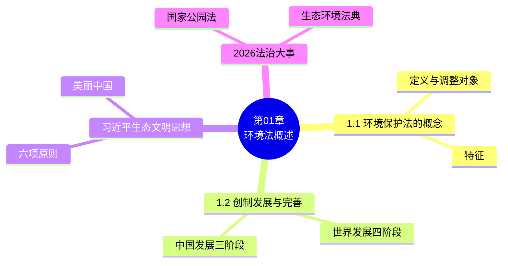

# 第01章 · 环境法概述

> 教师: 杨建英 · 学期: 2026春
> 主版页: 22+7=29 页（PDF 001 + PDF 003-1）
> 辅版页: 0 页

---

## 一 · 主版页图链

### PDF 001 — 开学第一课（含第1章实质内容）
| 页 | 图链 |
|---|---|
| 1-22 | `../001-1-2026年3月4日-杨建英-开学第一课-1-2026年3月4日-杨建英-开学第一课/page_XXX.jpg` |

### PDF 003-1 — 开学第一课（2）（第1章续）
| 页 | 图链 |
|---|---|
| 1-7 | `../003-1-2026年3月4日-杨建英-开学第一课（2）-1-2026年3月4日-杨建英-开学第一课/page_XXX.jpg` |

> 注：PDF 001 前9页为课堂引入，第10页起含第1章实质内容；PDF 003-1 含环境法创制发展完善内容。

---

## 二 · 思维导图

```markmap
# 第01章 环境法概述
## 1.1 环境保护法的概念
### 环境保护法的定义
### 环境保护法的特征
## 1.2 环境保护法的创制、发展和完善
### 世界环境法的发展
#### 18世纪中叶-20世纪初：民法+零散污染防治立法
#### 20世纪初-60年代：大量污染防治立法
#### 20世纪70年代至今：爆炸式增长
### 中国环境法的发展
#### 1979年试行法
#### 1989年正式法
#### 2014年修订
## 1.3 习近平生态文明思想
### 六项原则
#### 人与自然和谐共生
#### 绿水青山就是金山银山
#### 良好生态环境是最普惠的民生福祉
#### 山水林田湖草是生命共同体
#### 用最严格制度最严密法治保护生态环境
#### 共谋全球生态文明建设
## 2026年环境法治三件大事
### 《国家公园法》(2026.1.1)
### 《生态环境法典》(2026.3.12 通过 · 8.15 施行)
```



---

## 三 · 复习要点

### 核心概念

- **环境保护法（韩德培教授定义）**：调整因保护和改善生活环境和生态环境，防治污染和其他公害而产生的各种社会关系的法律规范的总称。
- **理解定义的三个要点**：① 目的是在人类与环境之间建立一种协调和谐的关系——只适用于次生环境问题；② 主要通过保护和改善环境、防治污染和其他公害等途径实现目的；③ 是由一系列有关的法律法规共同组成的、若干法律规范的总称。
- **环境保护法的特征**：① 科技性——基本原则、管理制度和法律规范都是从环境科学的研究成果和技术规范中提炼出来的，体现了生态规律和经济规律的要求；② 综合性——从法律关系看涉及社会关系广，从规范构成看由多种法律规范综合而成，从法的渊源看包括宪法、法律、行政法规、地方性法规等；③ 保护法益确立的共同性——环境是一个整体，不因国家和地区的划分而分割，环境法旨在保护社会乃至全体人类的利益。
- **其他代表性定义（了解·对比）**：金瑞林——保护环境和自然资源、防治污染和其他公害的法律规范总称；周珂——为实现经济和社会可持续发展，调整有关保护和改善环境、合理利用自然资源、防治污染和其他公害的法律规范总称；汪劲——以保护和改善环境、警惕和预防人为环境侵害为目的，调整与环境相关人类行为的法律规范总称。
- **教师总结（PDF原句）**：环境保护法，是生态文明的保障法，是美丽中国的护航法。
- **环境法的发展阶段（世界）**：
  1. 18世纪中叶至20世纪初：民法和零散污染防治立法并用，出现专门资源保护立法
  2. 20世纪初至60年代：大量污染防治立法，出现偏向污染防治的基本立法，国际环境法开始发展
  3. 20世纪70年代至今：国内环境立法爆炸式增长，环境法理念较大发展，国际与国内交互融合
- **环境法的发展阶段（中国）**：
  1. 1979年《环境保护法（试行）》——首次确立环评制度、排污收费制度、"三同时"制度等
  2. 1989年《环境保护法》——正式颁布，专章规定基本制度
  3. 2014年修订——强化政府责任，完善公众参与，加大处罚力度
- **习近平生态文明思想六项原则**：
  1. 坚持人与自然和谐共生
  2. 绿水青山就是金山银山
  3. 良好生态环境是最普惠的民生福祉
  4. 山水林田湖草是生命共同体
  5. 用最严格制度最严密法治保护生态环境
  6. 共谋全球生态文明建设
- **美丽中国**：中共十八大提出的执政理念，强调生态文明建设融入经济、政治、文化、社会建设各方面和全过程。2027年目标：绿色低碳发展深入推进；2035年目标：美丽中国基本实现；本世纪中叶：美丽中国全面建成。

### 核心法条 / 制度构成

- **《环境保护法》第4条**：保护环境是国家的基本国策。国家采取有利于节约和循环利用资源、保护和改善环境、促进人与自然和谐的经济、技术政策和措施，使经济社会发展与环境保护相协调。
- **《国家公园法》(2026.1.1)**：首次用法律形式划定"核心保护区+一般控制区"双轨格局
- **《生态环境法典》（2026.3.12 通过，2026.8.15 施行）**：继《民法典》后第二部以"典"命名的法律，共 5 编 1242 条（总则、污染防治、生态保护、绿色低碳发展、法律责任和附则），同时废止《环境保护法》等 10 部法律；单设绿色低碳发展编为重要创新。详见「真题与网络资源 · 生态环境法典2026要点」。

### 典型案例 / 裁判要旨

- **长江流域非法捕捞生态损害赔偿案**：多人电鱼破坏渔业资源与水环境，依刑法+长江保护法+环境公益诉讼法追究生态损害赔偿。裁判要旨：生态没有替代品，用之不觉，失之难存；用法治守住生态红线，就是守住民生底线。
- **校园/生活场景快判**：私自砍校园古树→违法；乱扔危废电池/乱倒实验废液→违法；垃圾回收造成污染→违法

### 高频考点

1. 环境保护法的概念与特征（名词解释/简答）
2. 世界环境法发展的三个阶段及其特点（简答/论述）
3. 中国环境法的发展历程（1979→1989→2014）（简答）
4. 习近平生态文明思想六项原则（论述题高频）
5. 美丽中国的目标与时间节点（2027/2035/本世纪中叶）（选择/简答）
6. 2026年环境法治三件大事（选择/简答）

### 易错 / 易混点

- ❌ 混淆"环境法发展阶段"的世界与中国分期：世界分三期，中国分三法（试行→正式→修订）
- ❌ 将"美丽中国"仅理解为生态概念：实际是政治、经济、文化、社会、生态五位一体
- ❌ 忽略"用最严格制度最严密法治保护生态环境"原则——这是环境法与生态文明的桥梁
- ❌ 将1979年试行法与1989年正式法混淆：试行法首次确立制度，正式法专章规定

### 思考题 / 自测（含定制答案）

> 先合上书自答，再展开“参考答案”对照。

**1. 根据韩德培教授对环境保护法的定义，理解该定义需把握哪三个要点？环境保护法具有哪些基本特征？**

<details><summary>参考答案</summary>

韩德培教授定义：环境保护法是调整因保护和改善生活环境和生态环境，防治污染和其他公害而产生的各种社会关系的法律规范的总称。
**三个要点**：① 目的是在人类与环境之间建立一种协调和谐的关系——只适用于次生环境问题；② 主要通过保护和改善环境、防治污染和其他公害等途径实现目的；③ 是由一系列有关的法律法规共同组成的、若干法律规范的总称。
**基本特征**：① 科技性——基本原则、管理制度和法律规范都从环境科学研究成果和技术规范中提炼，体现生态规律和经济规律的要求；② 综合性——从法律关系看涉及社会关系广，从规范构成看由多种法律规范综合而成，从法的渊源看包括宪法、法律、行政法规、地方性法规等；③ 保护法益确立的共同性——环境是一个整体，不因国家和地区的划分而分割，环境法旨在保护社会乃至全体人类的利益。
教师总结（PDF原句）：环境保护法是生态文明的保障法、美丽中国的护航法。

</details>

**2. 比较世界环境法发展三个阶段与中国环境法发展三个阶段的异同。**

<details><summary>参考答案</summary>

**世界环境法三阶段**：① 18世纪中叶至20世纪初——民法和零散污染防治立法并用，出现专门资源保护立法；② 20世纪初至60年代——大量污染防治立法，出现偏向污染防治的基本立法，国际环境法开始发展；③ 20世纪70年代至今——国内环境立法爆炸式增长，环境法理念较大发展，国际与国内交互融合。
**中国环境法三阶段（三法）**：① 1979年《环境保护法（试行）》——首次确立环评、排污收费、“三同时”等制度；② 1989年《环境保护法》——正式颁布，专章规定基本制度；③ 2014年修订——强化政府责任、完善公众参与、加大处罚力度（“史上最严”）。
**相同**：均沿“资源保护/分散立法→污染防治集中立法→体系化与理念升级”的脉络演进，均反映环境问题加剧后立法的回应。
**不同**：世界以“阶段/世纪”分期、起步早、由发达国家引领并推动国际环境法；中国以“三部法律的立改”为标志、起步晚但后发跟进快，并最终走向《生态环境法典》的法典化。

</details>

**3. 习近平生态文明思想六项原则如何体现在现行环境法制度中？**

<details><summary>参考答案</summary>

六项原则及其制度体现：① 人与自然和谐共生——《环保法》第1条立法目的、协调发展原则；② 绿水青山就是金山银山——生态补偿、自然资源资产负债表与离任审计；③ 良好生态环境是最普惠的民生福祉——环境质量标准、信息公开与公众参与制度；④ 山水林田湖草是生命共同体——统一规划、区域联防联控（第20条）、生态保护红线；⑤ 用最严格制度最严密法治保护生态环境——按日连续处罚、行政拘留、环境公益诉讼、《生态环境法典》；⑥ 共谋全球生态文明建设——国际合作与履约。即六项原则分别落实为目的条款、基本原则、基本制度和法律责任。

</details>

**4. 《生态环境法典》编纂对环境法体系有何意义？**

<details><summary>参考答案</summary>

《生态环境法典》（2026.3.12通过、2026.8.15施行）是继《民法典》后第二部以“典”命名的法律，共5编1242条（总则、污染防治、生态保护、绿色低碳发展、法律责任和附则），同时整合并废止《环境保护法》等10部法律。意义：① 体系化——结束环境单行法分散、交叉、冲突的局面，形成统一协调的法律体系；② 创新——单设“绿色低碳发展编”，呼应“双碳”目标；③ 提升法治权威与可适用性，标志中国环境法治从“单行法时代”迈入“法典化时代”。

</details>

### 与前后章之关联

- **→ 第2章**：第1章确立的环境法概念和发展脉络，是理解第2章"基本原则"的基础
- **→ 第5章**：第1章提到的1979年试行法首次确立的制度（环评、排污收费、"三同时"），在第5章"基本制度"中详细展开
- **→ 第6章**：第1章的环境法体系概述，为第6章"污染控制法"的单行法体系提供框架
