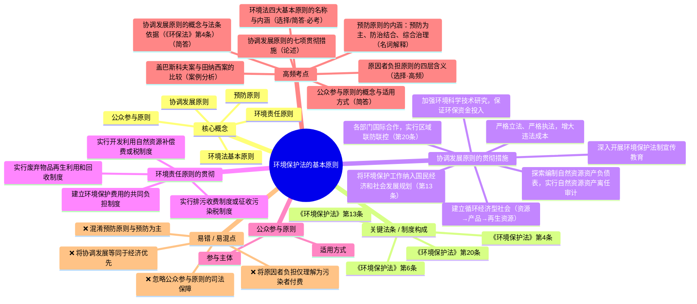

# 环境法学 · 第 2 章 · 环境保护法的基本原则 · 素材

> 教师: 杨建英 · 学期: 2026春
> 章下 PDF: 6 个 · 总页: 132
> 主版: 第 6 节 · 35 页

---

## 主版课件 · 第 6 节

> `006-2.环境保护法的基本原则（4）-2.环境保护法的基本原则.pdf`

<details><summary>展开 35 页图链</summary>

- [p001](../006-2.环境保护法的基本原则（4）-2.环境保护法的基本原则/page_001.jpg)  · 2.环境保护法的基本原则
- [p002](../006-2.环境保护法的基本原则（4）-2.环境保护法的基本原则/page_002.jpg)  · 环境法的基本原则是调整因开发利用、保护和改善环境而产生的
- [p003](../006-2.环境保护法的基本原则（4）-2.环境保护法的基本原则/page_003.jpg)  · 2.3协调发展原则
- [p004](../006-2.环境保护法的基本原则（4）-2.环境保护法的基本原则/page_004.jpg)  · 2.3协调发展原则
- [p005](../006-2.环境保护法的基本原则（4）-2.环境保护法的基本原则/page_005.jpg)  · 2.3协调发展原则
- [p006](../006-2.环境保护法的基本原则（4）-2.环境保护法的基本原则/page_006.jpg)  · 2.3协调发展原则
- [p007](../006-2.环境保护法的基本原则（4）-2.环境保护法的基本原则/page_007.jpg)  · 2.3协调发展原则
- [p008](../006-2.环境保护法的基本原则（4）-2.环境保护法的基本原则/page_008.jpg)  · 2.3协调发展原则
- [p009](../006-2.环境保护法的基本原则（4）-2.环境保护法的基本原则/page_009.jpg)  · 2.3协调发展原则
- [p010](../006-2.环境保护法的基本原则（4）-2.环境保护法的基本原则/page_010.jpg)  · 2.3协调发展原则
- [p011](../006-2.环境保护法的基本原则（4）-2.环境保护法的基本原则/page_011.jpg)  · 2.3协调发展原则
- [p012](../006-2.环境保护法的基本原则（4）-2.环境保护法的基本原则/page_012.jpg)  · 2.3协调发展原则
- [p013](../006-2.环境保护法的基本原则（4）-2.环境保护法的基本原则/page_013.jpg)  · 2.3协调发展原则
- [p014](../006-2.环境保护法的基本原则（4）-2.环境保护法的基本原则/page_014.jpg)  · 2.3协调发展原则
- [p015](../006-2.环境保护法的基本原则（4）-2.环境保护法的基本原则/page_015.jpg)  · 2.3协调发展原则
- [p016](../006-2.环境保护法的基本原则（4）-2.环境保护法的基本原则/page_016.jpg)  · 2.3协调发展原则
- [p017](../006-2.环境保护法的基本原则（4）-2.环境保护法的基本原则/page_017.jpg)  · 2.3协调发展原则
- [p018](../006-2.环境保护法的基本原则（4）-2.环境保护法的基本原则/page_018.jpg)  · 2.3协调发展原则
- [p019](../006-2.环境保护法的基本原则（4）-2.环境保护法的基本原则/page_019.jpg)  · （二）各部门、国际合作，实行交流与援助，联合处理环境问题
- [p020](../006-2.环境保护法的基本原则（4）-2.环境保护法的基本原则/page_020.jpg)  · 2.3协调发展原则
- [p021](../006-2.环境保护法的基本原则（4）-2.环境保护法的基本原则/page_021.jpg)  · 2.3协调发展原则
- [p022](../006-2.环境保护法的基本原则（4）-2.环境保护法的基本原则/page_022.jpg)  · 2.3协调发展原则
- [p023](../006-2.环境保护法的基本原则（4）-2.环境保护法的基本原则/page_023.jpg)  · 2.3协调发展原则
- [p024](../006-2.环境保护法的基本原则（4）-2.环境保护法的基本原则/page_024.jpg)  · 2.3协调发展原则
- [p025](../006-2.环境保护法的基本原则（4）-2.环境保护法的基本原则/page_025.jpg)  · 2.3协调发展原则
- [p026](../006-2.环境保护法的基本原则（4）-2.环境保护法的基本原则/page_026.jpg)  · 2.3协调发展原则
- [p027](../006-2.环境保护法的基本原则（4）-2.环境保护法的基本原则/page_027.jpg)  · 2.3协调发展原则
- [p028](../006-2.环境保护法的基本原则（4）-2.环境保护法的基本原则/page_028.jpg)  · 2.3协调发展原则
- [p029](../006-2.环境保护法的基本原则（4）-2.环境保护法的基本原则/page_029.jpg)  · 2.3协调发展原则
- [p030](../006-2.环境保护法的基本原则（4）-2.环境保护法的基本原则/page_030.jpg)  · 2.3协调发展原则
- [p031](../006-2.环境保护法的基本原则（4）-2.环境保护法的基本原则/page_031.jpg)  · 2.环境保护法的基本原则
- [p032](../006-2.环境保护法的基本原则（4）-2.环境保护法的基本原则/page_032.jpg)  · 2.环境保护法的基本原则
- [p033](../006-2.环境保护法的基本原则（4）-2.环境保护法的基本原则/page_033.jpg)  · 2.环境保护法的基本原则
- [p034](../006-2.环境保护法的基本原则（4）-2.环境保护法的基本原则/page_034.jpg)  · 2.环境保护法的基本原则
- [p035](../006-2.环境保护法的基本原则（4）-2.环境保护法的基本原则/page_035.jpg)  · 2.环境保护法的基本原则

</details>

<details><summary>展开 35 页图文对照（每图配其识别文本）</summary>

**p001** 

2.环境保护法的基本原则
新疆大学生态与环境学院
杨建英
2026年3月

---

**p002** 

环境法的基本原则是调整因开发利用、保护和改善环境而产生的
社会关系的指导思想和基本准则，是环境法本质和特征的集中体现，
是对环境保护实行法律调整的基本指导方针。（3.25)
它贯穿于整个环境法中，具有普遍的指导作用。
我国环境法的基本原则主要有：
预防原则（内涵：预防为主，防治结合，综合治理原则）；
协调发展原则（内涵：经济、社会发展与环境保护相协调原则）；
原因者负担原则（内涵：污染者付费，利用者补偿，开发者保护，破
坏者恢复原则）；
公众参与原则。

---

**p003** 

2.3协调发展原则
2.3.1概念和意义
【经济、社会发展和环境保护相协调的原则】 （P52-
53）指在发展经济的同时，加强保护和改善环境，使环境保护和
经济建设同步发展，坚持在发展中保护，在保护中发展。实现经济
效益、社会效益、环境效益的统一。
这一原则，正确地反映了经济建设和环境保护的关系，同时也
明确了如何正确对待和处理二者之间的关系。环境和自然资源是经
济发展的物质基础，离开了环境和自然资源，任何形式的生产都无
法进行。
《环境保护法》第4条保护环境是国家的基本国策。国家采取有利
于节约和循环利用资源、保护和改善环境、促进人与自然和谐的经
济、技术政策和措施，使经济社会发展与环境保护相协调。

---

**p004** 

2.3协调发展原则
讨论二：如何看待经济建设与环境保护的关系？
由此可见，经济建设与环境保护并不矛盾，经济建设和
环境保护之间是相互影响、相互制约、又相互促进的辩证统
一的关系。
我们决不能走“先污染后治理”的老路，不能用消耗大
量的资源、破坏环境来实现经济增长的高速度。这就要求我
们找到一个平衡点，既能保持经济一定速度的增长，又不以
破坏环境为代价。

---

**p005** 

2.3协调发展原则
2.3.1概念和意义盖巴斯科夫拉基玛洛大坝案 （4.8)
1977年，匈牙利和捷克签订《布达佩斯条约》在多瑙河上修
建盖巴斯科夫一拉基玛洛大坝，将河水截至两条运河后回注于
多瑙河。
1988年，牙利国会认定该河流的生态效益高于该项目的经
济利益，命令政府重新评价该项目。1989年，匈牙利宣布在项目
的环境影响得到充分评价之前停止执行该工程。1991年捷克决定
继续建设该项目，并单方面将近2/3的多瑙河河水截引至其领土。
1992年10月，牙利向国际法院提出申请。

---

**p006** 

2.3协调发展原则
2.3.1概念和意义
国际法院本案判决书140段：“通观历史，人类由于经济或其
他原因一直不断地干扰自然。人类过去从事这种干扰时，从不
考虑其对环境的影响。由于新的科学知识和日益认识到以欠考
虑和未减缓的速度从事这种干扰对人类一当代人及其后代所
带来的危险。可持续发展充分表达了将经济发展与环境保护相
协调的需要。对本案而言，双方都应重新审视盖巴斯科夫电厂
运行对环境的影响。尤其是，它们必须为多瑙河故道和该河两
岸支流所释放的水量找到一个满意的解决办法。”

---

**p007** 

2.3协调发展原则
中国东商滨海经济带应症村际意图
沿海多个省份出现癌症村
浙江萧山坞里村，江苏盐
城东兴村，山东肥城肖家店
随着工业化的进程，一个
山东阳
接一个癌症村出现在东部滨海 头利刘铁丘村
村、部楼村
经济活跃地带。名单上还有无 西汉庄村 山东省肥城市肖家店村
锡广丰村，常州新北区，阜宁 江苏省阜宁县杨
集镇东兴村 宜州
县洋桥村，安徽宿州张庄村，
阳谷县西关村、邵楼村、西汉 南苏车
庄村、国庄村，天津西堤头村、 www.nddaily.c
刘快庄村等。

---

**p008** 

2.3协调发展原则
中国大陆在改革开放后出现的群体疾病现象。由于环境污染，大
多是饮用了上游企业排出的未经处理的污水，以致环境受污染，导致
人体内部机制严重受损，造成某一村庄大规模的癌症病发。
浙江癌症村（浙江省绍兴市绍兴县）：公开资料显示，中国共有164
个纺织工业集群，拥有超过5万家纺织工厂，主要集中于东部、东南部
沿海地区。绍兴市绍兴县便是其中之一，这里的纺织企业9000余家，
印染产能约占全国30%，因而也被誉为“建在布匹上的城市”。然而，
这个GDP功劳簿上的大功臣却变成了水乡恶变的罪魁祸首，在规划面
积100平方公里的绍兴滨海工业区及周边已经有多个“癌症村”出现。

---

**p009** 

2.3协调发展原则
同样沦为生态难民的还有毗邻的杭州市萧山临江工业园
区及周边的村民，在那里同样集聚纺织及其相关的化工企
业。绍兴滨海工业区的排污口再往东，绍兴上虞市的道墟
镇亦有不少村民反映，他们那里也有“癌症村”。化工企
业开到哪里，“癌症村”似乎便会出现在哪里。

---

**p010** 

2.3协调发展原则
从2003年12月29日开始，萧
山南阳镇坞里村村民韦东英，开
始了长达4年的“环保日记”写作。
记录了坞里村遭受的环境污染侵
袭，在恶臭气味和污水包围的日
子里，一个个村民因患癌症死去。
当韦东英的证据照片累积到5
斤多重时，南阳化工园区还没有
搬迁的迹象。她给萧山市、浙江
省两级环保局打去电话咨询，得
到的答复是：南阳的环境监测在
2006年已达标，化工园不用搬迁。

---

**p011** 

2.3协调发展原则
田纳西流域管理局诉希尔案
1967年，美国联邦议会批准在小田纳西河上修建一座水库，
作为配套设施，TVA开始在小田纳西河上修建泰利库大坝。
1975年生物学家发现小田纳西河有一种濒临灭绝的鲈鱼
（蜗牛镖），联邦内政部将其列入了濒危物种名单，从而使其
进入1973年生效的《美国濒危物种法》保护范围之内。不巧的
是，蜗牛镖只能生活在泰利库大坝附近，大坝建成的话，将影
响蜗牛镖的栖息地而导致灭绝，由此发生了“要小鱼，还是要
大坝”的二难决择。

---

**p012** 

2.3协调发展原则
以希尔等为首的环保组织和一些公民以TVA为被告向联邦
地方法院提起诉讼，认为TVA违反了《美国濒危物种法》3的
规定，要求法院确认其违法并终止大坝的修建。
联邦地方法院认为，虽然大坝的修建将会对蜗牛鱼的栖息
地造成不利影响和破坏，但大坝在该法案生效前七年就开始动
工，到蜗牛镖被列入濒危物种名单时，大坝已经接近完工，以
牺牲纳税人一亿多美元的利益为代价来保护一个微不足道、没
有重大经济价值且生态价值也不明显的鱼种是很不明智的。

---

**p013** 

2.3协调发展原则
原告不服，将案件上诉至联邦巡回法院。巡回法院的
法官认为，是否豁免被告遵守该法案，只有国会或内政部
才能做出决定，因而判令联邦地方法院永久禁止大坝继续
完工，“除非国会通过适当立法豁免泰利库大坝遵循《美国
危物种法》或者蜗牛镖从濒危物种名单上取消或有新的
关键栖息地生存”，否则《美国濒危物种法》不允许进行
利益平衡，必须将保护生物多样性置于绝对优先地位。

---

**p014** 

2.3协调发展原则
1997年4月18日，TVA将案件上诉到联邦最高法院，
要求撤销上诉法院的判决。初审原告希尔等人申请法庭在诉
讼期间作出裁定，暂停大坝的修建，以免造成不可逆转的结
果。最高法院于同年6月15日做出了终审判决，9位大法官
以6：3的优势支持了希尔等人的诉求，认为停工禁令是最合
适的救济手段。
从此，小鱼儿在田纳西河里过着快乐的生活，它们身边
则是那座耗资一亿多美元的废弃大坝作为永远的见证。

---

**p015** 

2.3协调发展原则
我国葛洲坝刚建成时，阻隔了中华鲟上溯产卵，中华鲟
在坝上撞得头破血流，非常惨烈。中华鲟数量锐减，不得不
进行人工孵化养殖。同时，大坝还破坏了青、草、鲢、鳙四
大家鱼的天然产卵繁殖场，长江由过去年产四大家鱼200多
亿尾降为仅10亿尾。名贵的鱼，因大坝建在其产卵场，十
多年前就已在长江里消失了。
美国最高法院的判决具有深厚的民意积淀，本案之后90
%的民众说：“发电站可以建在别处，而蜗牛镖一旦灭绝将
永不再生”。

---

**p016** 

2.3协调发展原则
2.3.2贯彻
（一）将环境保护工作切实纳入国民经济和社会发展规划
我国是以公有制为基础的社会主义国家，环境保护是经济建
设的重要组成部分。因此，在制定和实施发展规划时必须把环境
保护目标和措施纳入国民经济和社会发展规划中，并加强监督指
导。
《环境保护法》第13条关于“县级以上人民政府应当将环境保护
工作纳入国民经济和社会发展规划。环境保护规划与主体功能区
规划、土地利用总体规划和城乡规划等相衔接”的规定。

---

**p017** 

2.3协调发展原则
2.3.2贯彻
从1953年开始的“一五”计划算起，中国编制实施国民经济
和社会发展五年计划的框架体制，已有50多年的历史。从1953年
到1982年我国实行的前五个五年计划中，都没有将环境保护列为
国民经济和社会发展的一项内容，因此在这30年间，环境保护是
各项建设比例失调中最严重的一环。
1982年公布的第六个五年计划（1980-1985）中，首次将环境
保护列为专门的一章，制定了“加强环境保护，制止环境污染的
进一步发展”的目标，并提出了政策、法规、监督、管理和资金
等五项措施。此后的“七五”、“八五”和“九五”计划中也都
把环境保护列入了国民经济和社会发展计划，在“十五”计划
（2000-2005）中，更是制定了“可持续发展”的战略方针。

---

**p018** 

2.3协调发展原则
2.3.2贯彻
例如，我国在“十五”计划中，规定了环境保护的任务
和计划指标、对环境保护的方针政策、环境保护投资、主要
保护措施等都作了具体的规定，这样，就可以从宏观上进行
综合平衡、协调好经济、社会发展和环境保护之间的关系。
同时，在国民经济和社会发展计划中，必须确定环境保
护的资金数额或所占比例，以确保经济建设和环境保护协调
发展。

---

**p019** 

（二）各部门、国际合作，实行交流与援助，联合处理环境问题
《环境保护法》第20条国家建立跨行政区域的重点区域、
流域环境污染和生态破坏联合防治协调机制，实行统一规划、
统一标准、统一监测、统一的防治措施。前款规定以外的
跨行政区域的环境污染和生态破坏的防治，由上级人民政府
协调解决，或者由有关地方人民政府协商解决。（区域联防
联控）

---

**p020** 

2.3协调发展原则
2.3.2贯彻
（三）深入开展环境保护法制宣传教育
我国目前已颁布了大量的环境保护方面的法律法规，而
且都体现了经济、社会发展与环境保护相协调的原则。
但实践中人们对环境保护认识不足，执法力度不够。有
法不依、执法不严的现象较普遍。有些人特别是领导干部环
境保护意识淡薄，缺乏生态观念，因而在建设项目中不是把
环境保护设施挤掉了，就是上一些不配套的环保设施，并时
常处于“休息”状态。

---

**p021** 

2.3协调发展原则
2.3.2贯彻
（三）深入开展环境保护法制宣传教育
因此必须加强环境法制宣传教育，提高全民族的环境意识，
特别是提高处在政治、经济决策地位的领导干部的环境意识。
使人们明确认识到保护环境是我国的一项基本国策，认清经
济、社会发展与环境保护相协调是客观规律的要求，正确处理环
境保护与经济建设和社会发展的关系，把眼前利益和长远利益、
局部利益和整体利益结合起来，遵守生态规律和经济规律，保证
和促进环境保护和经济建设协调发展。

---

**p022** 

2.3协调发展原则
2.3.2贯彻
（四）加强环境科学技术研究、提高环境科学技术水平、保
证环境保护资金的投入
环境科学技术是解决环境问题的重要手段，实现经济的发
展与环境的改善只能依靠环境科学技术的进步。
因此，必须加强环境科学技术方面的研究，针对当前存在
的和将来可能出现的重大环境问题，重点研究开发、利用各种
应用技术，并吸收国外的先进经验和技术，同时，要培养更多
的环境方面的科技人才，并增加环境保护的资金投入。

---

**p023** 

2.3协调发展原则
2.3.2贯彻
（四）加强环境科学技术研究、提高环境科学技术水平、保
证环境保护资金的投入
环境问题的解决，尤其是环境污染的治理，在根本上取
决于环境科学技术的水平。只有不断地进行环境科学研究，
开发出节能低耗、变废为宝、清洁生产的生产工艺以及能控
制和治理环境污染、保护生态平衡的科研成果，才能使环境
保护与经济、社会发展协调成为现实。

---

**p024** 

2.3协调发展原则
2.3.2贯彻
（四）加强环境科学技术研究、提高环境科学技术水平、保
证环境保护资金的投入
秸秆是一种常见的农业生产废料，秸秆由草变宝的技术目前已
经十分成熟。首先，秸秆可以变乙醇。华东理工大学颜涌捷教授负
责的国家863重大课题 “纤维素废弃物制取乙醇技术”，已经
可以从7吨至8吨秸秆中提炼出1吨燃料乙醇，如果普通汽油中加
入10%到15%的燃料乙醇，燃烧效果仍同汽油一样；如果改一
改发动机，燃料乙醇就能代替85%的汽油。其次，秸秆还可以发
电。2吨秸秆的热值，相当于1吨煤，目前我国可作为能源用途的
农作物秸秆近3亿吨，至少可替代近1.5亿吨煤炭。此外，秸秆还
可以发酵“生”气、制成人造板材、新型轻质墙材以及造纸等。

---

**p025** 

2.3协调发展原则
2.3.2贯彻
（五）建立循环经济型社会
环境问题的解决，尤其是环境污染的治理，在根本上取决
于环境科学技术的水平。只有不断地进行环境科学研究，开发
出节能低耗、变废为宝、清洁生产的生产工艺以及能控制和治
理环境污染、保护生态平衡的科研成果，才能使环境保护与经
济、社会发展协调成为现实。

---

**p026** 

2.3协调发展原则
2.3.2贯彻
（五）建立循环经济型社会
传统经济遵循的是“资源一生产—消费一废弃物排放”，循环经
济本质上是一种生态经济，它要求运用生态学规律来指导人类社会的
经济活动；倡导的是一种建立在物质不断循环利用基础上的经济发展
模式，它要求把经济活动组成一个“资源一产品一再生资源”的反馈
流程，所有的物质和能源在这个不断进行的循环中得到合理持久的利
用，以把经济对自然环境的影响降低到尽可能小的程度。
例如，生态工业园区：通过模拟生态系统建立工业系统，生产
者一消费者一分解者的循环途径和食物链网，采用废物交换，清洁生
产等手段使一个企业生产的副产品或废物可用作另一个工厂的投入或
原料，实现循环使用。

---

**p027** 

2.3协调发展原则
2.3.2贯彻
（六）严格立法、严格执法
根据经济建设的发展、适时的修改我国现行《环境保护法》
的有关条款。例如，将“环境保护同经济、社会发展相协调原
则”修改为“使经济社会发展与环境保护相协调”原则。从根本
上解决有法不依、执法不严的问题，保证环境保护工作有序健
康地发展。

---

**p028** 

2.3协调发展原则
（六）严格立法、严格执法
强化环境监督管理，一方面要做到环境管理的科学化，另一方
面要加大环境污染与环境破坏的处罚力度，增大违法成本。
株洲市的河西高新技术开发区，在创建之初，开发区管委会只
考虑如何招商引资，把开发区办起来，但环境意识非常淡薄，国家
明文规定的开发区环境影响评价，是在开发区建成两年之后，在市
政府的严厉批评下才拨出钱上了马。经过检查发现，在开发区两年
内引进的57个建设项目中仅有9个按国家规定进行了“三同时”建
设。不少企业开始投产后，即给当地的环境造成了很严重影响。

---

**p029** 

2.3协调发展原则
（六）严格立法、严格执法
其中一耗资6000万元，生产色拉油的厂家，于1996年6月开始试生
产，但未上任何环保设施，废水直排湘江，造成了严重的农业损失；另
有一家橡胶厂，未办理任何环保手续，小锅炉造成工厂四周浓烟滚滚，
附近居民苦不堪言。
株洲市的河西高新开发区就是因为招商引资不够理想，在项目选择
上有些“饥不择食”，忽视了经济、社会发展与环境保护的协调，造成
了生态破坏和环境污染，其教训是十分惨痛的。近些年株洲市已在下大
力气对其进行整治，对一些对环境造成污染的企业予以关、停、整、改。

---

**p030** 

2.3协调发展原则
2.3.2贯彻
（七）探索编制自然资源资产负债表
用绿色GDP的方法取代传统GDP以衡量国民经济与社会的发展。
中共十八届三中全会提出要“探索编制自然资源资产负债表，对领
导干部实行自然资源资产离任审计。”编制自然资源资产负债表，
有助于全面揭示政府对各项资源的占有使用情况及负担能力，并明
确相应的权利和责任主体，反映潜在的风险状况。
通过对领导干部实行自然资源资产离任审计，将对政绩考核制
度产生重大影响，并提高经济社会管理水平。

---

**p031** 

2.环境保护法的基本原则
2.4环境责任原则（原因者负担原则）
2.4.1概念
《环境保护法》第6条：一切单位和个人都有保护环境的义
务。地方各级人民政府应当对本行政区域的环境质量负责。
企业事业单位和其他生产经营者应当防止、减少环境污染和
生态破坏，对所造成的损害依法承担责任。公民应当增强
环境保护意识，采取低碳、节俭的生活方式，自觉履行环境
保护义务。

---

**p032** 

2.环境保护法的基本原则
2.4环境责任原则（原因者负担原则）
2.4.2贯彻
（一）实行排污收费制度或征收污染税制度；
（二）实行废弃物品再生利用和回收制度；
（三）实行开发利用自然资源补偿费或税制度；
（四）建立环境保护费用的共同负担制度。

---

**p033** 

2.环境保护法的基本原则
2.5公众参与原则
2.5.1概念
【公众参与原则】 （P61）：指公众有权通过一定的程
序或途径参与一切与公众环境权益相关的开发决策等活动，
并有权得到相应的法律保护和救济，以防止决策的盲目性、
使得该项决策符合广大公众的切身利益和需要。

---

**p034** 

2.环境保护法的基本原则
2.5公众参与原则
2.5.1概念
参与决策的公众的范围（P62-64）：
（1）居民；
（2）各类专业人士；
（3）社会团体；
（4）与拟议行为有关的行政机关。

---

**p035** 

2.环境保护法的基本原则
2.5公众参与原则
2.5.2适用
（一）在环境影响评价和其他涉及公众利益的许可程序中
建立公众参与制度；
建立决策信息公开与披露制度；
鼓励各类非政府的环境组织代表公众参与环境决策；
（四）建立公众参与的行政和司法保障制度。

---

</details>

## 辅版课件

> 共 5 个辅版（同章不同次/不同侧重）。每辅版仅列前 3 页之链，余者参 主版 即可。

### 辅 1 · 第 2 节 · 31 页

> `002-2.环境保护法的基本原则-1-2026年3月4日-杨建英-开学第一课.pdf` · 涉章 [2]

- [p001](../002-2.环境保护法的基本原则-1-2026年3月4日-杨建英-开学第一课/page_001.jpg)  · 大家！早上好！
- [p002](../002-2.环境保护法的基本原则-1-2026年3月4日-杨建英-开学第一课/page_002.jpg)  · 讨论1：污染环境、破坏生态，仅仅
- [p003](../002-2.环境保护法的基本原则-1-2026年3月4日-杨建英-开学第一课/page_003.jpg)  · 讨论2：为什么要学《环境保护法》？
- ...余 28 页, 参 [`002-2.环境保护法的基本原则-1-2026年3月4日-杨建英-开学第一课/`](../002-2.环境保护法的基本原则-1-2026年3月4日-杨建英-开学第一课/)

### 辅 2 · 第 4 节 · 23 页

> `004-2.环境保护法的基本原则（2）-2.环境保护法的基本原则.pdf` · 涉章 [2]

- [p001](../004-2.环境保护法的基本原则（2）-2.环境保护法的基本原则/page_001.jpg)  · 2.环境保护法的基本原则
- [p002](../004-2.环境保护法的基本原则（2）-2.环境保护法的基本原则/page_002.jpg)  · 2.1什么是基本原则？
- [p003](../004-2.环境保护法的基本原则（2）-2.环境保护法的基本原则/page_003.jpg)  · 在理解环境法的基本原则时，要注意如下几个问题：
- ...余 20 页, 参 [`004-2.环境保护法的基本原则（2）-2.环境保护法的基本原则/`](../004-2.环境保护法的基本原则（2）-2.环境保护法的基本原则/)

### 辅 3 · 第 5 节 · 22 页

> `005-2.环境保护法的基本原则（3）-2.环境保护法的基本原则.pdf` · 涉章 [2]

- [p001](../005-2.环境保护法的基本原则（3）-2.环境保护法的基本原则/page_001.jpg)  · 2.环境保护法的基本原则
- [p002](../005-2.环境保护法的基本原则（3）-2.环境保护法的基本原则/page_002.jpg)  · 目录
- [p003](../005-2.环境保护法的基本原则（3）-2.环境保护法的基本原则/page_003.jpg)  · 2.2预防原则（3.25）
- ...余 19 页, 参 [`005-2.环境保护法的基本原则（3）-2.环境保护法的基本原则/`](../005-2.环境保护法的基本原则（3）-2.环境保护法的基本原则/)

### 辅 4 · 第 6 节 · 8 页（跨章）

> `006-2.环境保护法的基本原则（4）-3. 环境利用行为的主体及其权利义务.pdf` · 涉章 [2, 3]

- [p001](../006-2.环境保护法的基本原则（4）-3. 环境利用行为的主体及其权利义务/page_001.jpg)  · 目录
- [p002](../006-2.环境保护法的基本原则（4）-3. 环境利用行为的主体及其权利义务/page_002.jpg)  · 3.1环境利用行为与环境法律关系 遭受2万倍辐射的人，究竟多痛苦？
- [p003](../006-2.环境保护法的基本原则（4）-3. 环境利用行为的主体及其权利义务/page_003.jpg)  · 3.1环境利用行为与环境法律关系
- ...余 5 页, 参 [`006-2.环境保护法的基本原则（4）-3. 环境利用行为的主体及其权利义务/`](../006-2.环境保护法的基本原则（4）-3. 环境利用行为的主体及其权利义务/)

### 辅 5 · 第 11 节 · 13 页

> `011-第二编 污染控制法-第二编 污染控制法.pdf` · 涉章 [2]

- [p001](../011-第二编 污染控制法-第二编 污染控制法/page_001.jpg)  · 第二编污染控制法
- [p002](../011-第二编 污染控制法-第二编 污染控制法/page_002.jpg)  · 6.污染控制法概述
- [p003](../011-第二编 污染控制法-第二编 污染控制法/page_003.jpg)  · 6.污染控制法概述
- ...余 10 页, 参 [`011-第二编 污染控制法-第二编 污染控制法/`](../011-第二编 污染控制法-第二编 污染控制法/)

## 跨章节备注

此章之课件亦覆盖 第 3 章, 复习时宜与彼章互参。

---

## 思维导图 · LLM 生成

### Markmap（Typora / markmap.js / Obsidian 可渲染）

```markmap
# 环境保护法的基本原则
## 核心概念
- 环境法基本原则
- 预防原则
- 协调发展原则
- 环境责任原则
- 公众参与原则
## 关键法条 / 制度构成
- 《环境保护法》第4条
- 《环境保护法》第6条
- 《环境保护法》第13条
- 《环境保护法》第20条
## 协调发展原则的贯彻措施
- 将环境保护工作纳入国民经济和社会发展规划（第13条）
- 各部门国际合作，实行区域联防联控（第20条）
- 深入开展环境保护法制宣传教育
- 加强环境科学技术研究，保证环保资金投入
- 建立循环经济型社会（资源→产品→再生资源）
- 严格立法、严格执法，增大违法成本
- 探索编制自然资源资产负债表，实行自然资源资产离任审计
## 环境责任原则的贯彻
- 实行排污收费制度或征收污染税制度
- 实行废弃物品再生利用和回收制度
- 实行开发利用自然资源补偿费或税制度
- 建立环境保护费用的共同负担制度
## 公众参与原则
- 参与主体
- 适用方式
## 高频考点
- 环境法四大基本原则的名称与内涵（选择/简答·必考）
- 协调发展原则的概念与法条依据（《环保法》第4条）（简答）
- 预防原则的内涵：预防为主、防治结合、综合治理（名词解释）
- 原因者负担原则的四层含义（选择·高频）
- 公众参与原则的概念与适用方式（简答）
- 协调发展原则的七项贯彻措施（论述）
- 盖巴斯科夫案与田纳西案的比较（案例分析）
## 易错 / 易混点
- ❌ 将"协调发展"等同于"经济优先"
- ❌ 混淆"预防原则"与"预防为主"
- ❌ 将"原因者负担"仅理解为"污染者付费"
- ❌ 忽略公众参与原则的司法保障
```

### Mermaid（GitHub Markdown 可渲染）



## 复习要点 · 从OCR迁移

> 以下内容均从课件PDF的OCR识别文本中迁移整理，去芜存菁。

### 一、核心概念（名词解释）

- **环境法基本原则**：调整因开发利用、保护和改善环境而产生的社会关系的指导思想和基本准则，是环境法本质和特征的集中体现，具有普遍指导作用。（p002）
- **预防原则**（预防为主，防治结合，综合治理）：强调在环境问题发生前采取预防措施，避免环境损害的发生和扩大。（p002）
- **协调发展原则**（经济、社会发展与环境保护相协调）：在发展经济的同时加强保护和改善环境，使环境保护和经济建设同步发展，坚持在发展中保护、在保护中发展，实现经济效益、社会效益、环境效益的统一。（p003）
- **环境责任原则**（原因者负担原则）：污染者付费、利用者补偿、开发者保护、破坏者恢复。（p002、p031）
- **公众参与原则**：公众有权通过一定程序或途径参与一切与公众环境权益相关的开发决策等活动，并有权得到相应的法律保护和救济，以防止决策的盲目性。（p033）

### 二、关键法条 / 制度构成

- **《环境保护法》第4条**：保护环境是国家的基本国策。国家采取有利于节约和循环利用资源、保护和改善环境、促进人与自然和谐的经济、技术政策和措施，使经济社会发展与环境保护相协调。（p003）
- **《环境保护法》第6条**：一切单位和个人都有保护环境的义务。地方各级人民政府应当对本行政区域的环境质量负责。企业事业单位和其他生产经营者应当防止、减少环境污染和生态破坏，对所造成的损害依法承担责任。（p031）
- **《环境保护法》第13条**：县级以上人民政府应当将环境保护工作纳入国民经济和社会发展规划。环境保护规划与主体功能区规划、土地利用总体规划和城乡规划等相衔接。（p016）
- **《环境保护法》第20条**：国家建立跨行政区域的重点区域、流域环境污染和生态破坏联合防治协调机制，实行统一规划、统一标准、统一监测、统一的防治措施。（p019 · 区域联防联控）

### 三、重要案例

- **盖巴斯科夫-拉基玛洛大坝案**（p005-p006）：匈牙利与捷克在多瑙河修建大坝，匈牙利认定生态效益高于经济利益而停工。国际法院判决指出"可持续发展充分表达了将经济发展与环境保护相协调的需要"。→ 协调发展原则的国际法实践
- **田纳西流域管理局诉希尔案**（p011-p015）：美国联邦最高法院以6:3判决保护濒危蜗牛镖优先于耗资一亿多美元的大坝完工。→ 环境保护优先于经济利益的经典判例
- **中国东部沿海癌症村**（p007-p010）：浙江绍兴滨海工业区纺织企业污染致多个癌症村出现，"化工企业开到哪里，癌症村便出现在哪里"。→ 先污染后治理的惨痛教训
- **株洲河西高新区案例**（p028-p029）：57个建设项目仅9个执行"三同时"，色拉油厂废水直排湘江造成严重农业损失。→ 有法不依、执法不严的典型

### 四、协调发展原则的贯彻措施（p016-p030）

1. 将环境保护工作纳入国民经济和社会发展规划（第13条）
2. 各部门国际合作，实行区域联防联控（第20条）
3. 深入开展环境保护法制宣传教育
4. 加强环境科学技术研究，保证环保资金投入
5. 建立循环经济型社会（资源→产品→再生资源）
6. 严格立法、严格执法，增大违法成本
7. 探索编制自然资源资产负债表，实行自然资源资产离任审计

### 五、环境责任原则的贯彻（p032）

1. 实行排污收费制度或征收污染税制度
2. 实行废弃物品再生利用和回收制度
3. 实行开发利用自然资源补偿费或税制度
4. 建立环境保护费用的共同负担制度

### 六、公众参与原则（p033-p035）

- **参与主体**：居民、各类专业人士、社会团体、与拟议行为有关的行政机关
- **适用方式**：①环境影响评价中的公众参与制度；②决策信息公开与披露制度；③鼓励非政府环境组织代表公众参与；④公众参与的行政和司法保障制度

### 七、高频考点（速记）

1. 环境法四大基本原则的名称与内涵（选择/简答·必考）
2. 协调发展原则的概念与法条依据（《环保法》第4条）（简答）
3. 预防原则的内涵：预防为主、防治结合、综合治理（名词解释）
4. 原因者负担原则的四层含义（选择·高频）
5. 公众参与原则的概念与适用方式（简答）
6. 协调发展原则的七项贯彻措施（论述）
7. 盖巴斯科夫案与田纳西案的比较（案例分析）

### 八、易错 / 易混点

- ❌ 将"协调发展"等同于"经济优先"：协调发展强调同步，非经济优先
- ❌ 混淆"预防原则"与"预防为主"：前者是基本原则，后者是其内涵之一
- ❌ 将"原因者负担"仅理解为"污染者付费"：还包括利用者补偿、开发者保护、破坏者恢复
- ❌ 忽略公众参与原则的司法保障：公众参与不仅限于行政程序，还包括司法救济

### 九、与前后章之关联

- **← 第1章**：第1章环境法概述为基本原则提供理论基础
- **→ 第3章**：第3章环境利用行为主体是公众参与原则的具体化
- **→ 第5章**：第5章环境基本制度是基本原则的制度化落实
- **→ 第6章**：第6章污染控制法是原因者负担原则的具体适用
