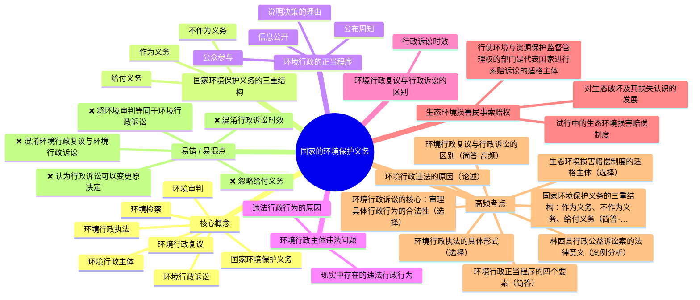

# 环境法学 · 第 4 章 · 国家的环境保护义务 · 素材

> 教师: 杨建英 · 学期: 2026春
> 章下 PDF: 3 个 · 总页: 33
> 主版: 第 9 节 · 17 页

---

## 主版课件 · 第 9 节

> `009-4. 国家的环境保护义务 （2）-4. 国家的环境保护义务.pdf`

<details><summary>展开 17 页图链</summary>

- [p001](../009-4. 国家的环境保护义务 （2）-4. 国家的环境保护义务/page_001.jpg)  · 4.国家的环境保护义务
- [p002](../009-4. 国家的环境保护义务 （2）-4. 国家的环境保护义务/page_002.jpg)  · 目录
- [p003](../009-4. 国家的环境保护义务 （2）-4. 国家的环境保护义务/page_003.jpg)  · 4.2环境行政
- [p004](../009-4. 国家的环境保护义务 （2）-4. 国家的环境保护义务/page_004.jpg)  · 4.2环境行政
- [p005](../009-4. 国家的环境保护义务 （2）-4. 国家的环境保护义务/page_005.jpg)  · 4.2环境行政
- [p006](../009-4. 国家的环境保护义务 （2）-4. 国家的环境保护义务/page_006.jpg)  · 4.2环境行政
- [p007](../009-4. 国家的环境保护义务 （2）-4. 国家的环境保护义务/page_007.jpg)  · 4.2环境行政
- [p008](../009-4. 国家的环境保护义务 （2）-4. 国家的环境保护义务/page_008.jpg)  · 4.2环境行政
- [p009](../009-4. 国家的环境保护义务 （2）-4. 国家的环境保护义务/page_009.jpg)  · 4.2环境行政
- [p010](../009-4. 国家的环境保护义务 （2）-4. 国家的环境保护义务/page_010.jpg)  · 4.2环境行政
- [p011](../009-4. 国家的环境保护义务 （2）-4. 国家的环境保护义务/page_011.jpg)  · 4.2环境行政
- [p012](../009-4. 国家的环境保护义务 （2）-4. 国家的环境保护义务/page_012.jpg)  · 环境行政复议和环境行政诉讼的区别？
- [p013](../009-4. 国家的环境保护义务 （2）-4. 国家的环境保护义务/page_013.jpg)  · 4.2环境行政
- [p014](../009-4. 国家的环境保护义务 （2）-4. 国家的环境保护义务/page_014.jpg)  · 4.3环境司法
- [p015](../009-4. 国家的环境保护义务 （2）-4. 国家的环境保护义务/page_015.jpg)  · 4.3环境司法
- [p016](../009-4. 国家的环境保护义务 （2）-4. 国家的环境保护义务/page_016.jpg)  · 4.3环境司法
- [p017](../009-4. 国家的环境保护义务 （2）-4. 国家的环境保护义务/page_017.jpg)  · 4.3环境司法

</details>

<details><summary>展开 17 页图文对照（每图配其识别文本）</summary>

**p001** 

4.国家的环境保护义务
新疆大学生态与环境学院
杨建英
2026年4月

---

**p002** 

目录
4.国家的环境保护义务
4.1国家的环境保护义务概述
4.1.1作为义务
4.1.2不作为义务
4.1.3给付义务
4.2环境行政
4.2.1环境行政管理体制
4.2.2环境保护的行政管理手段
4.2.3生态环境损害民事索赔权
4.3环境司法
4.3.1环境审判
4.3.2环境检察
4.4执政党中央与中央政府履行国家环境保护义务的政策手段

---

**p003** 

4.2环境行政

---

**p004** 

4.2环境行政
4.2.2环境保护的行政管理手段
（五）不服环境、资源与能源行政的救济（P97-100）
1.环境行政的正当程序
包括：（1）信息公开；
（2）公众参与；
（3）说明决策的理由；
（4）公布周知。

---

**p005** 

4.2环境行政
4.2.2环境保护的行政管理手段
（五）不服环境、资源与能源行政的救济（P97-100）
环境行政主体：是依法享有国家行政职权、能代表国家独立
进行环境行政管理并独立参加环境行政公益诉讼的组织。
环境行政执法：是行政执法活动的重要组成部分，是指环境
行政主体依照法定的职权与程序对环境行政相对人所实施的
具有法律约束力的具体行政行为。
环境行政执法的具体形式有：环境行政许可、排污收费、现
场检查、“三同时”验收、环境行政确认、环境行政处罚等。

---

**p006** 

4.2环境行政
4.2.2环境保护的行政管理手段
（五）不服环境、资源与能源行政的救济（P97-100）
环境行政主体违法问题：
1.现实中存在的违法行政行为
执法主体滥用职权，在执法的过程中违反法定程序，越
权行政，执法主体不适合，失职或不作为，使用的证据不确
实充分，定性不准确，适用法律不准确，行政处罚不恰当等。
2.违法行政行为的原因：
（1）环保立法障碍
1环保立法中部门本位主义思想严重。
）环境立法之间关系的不协调。

---

**p007** 

4.2环境行政
4.2.2环境保护的行政管理手段
2.违法行政行为的原因：
《环境保护法》着重于解决环境污染问题，行政诉讼时效为15
天。“当事人对行政处罚决定不服的，可以在接到处罚通知之日起
十五日内，同作出处罚决定的机关的上一级机关申请复议；对复议
决定不服的，可以在接到复议决定之白起十五日内，向人民法院起
诉。当事人也可以在接到处罚通知之日起十五日内，直接向人民法
院起诉。当事人逾期不申请复议、也不向人民法院起诉、又不履行
处罚决定的，由作出处罚决定的机关申请人民法院强制执行。
《森林法》《渔业法》为30天《森林法》第十七条当事人对
人民政府的处理决定不服的，可以在接到通知之日起一个月内，
向人民法院起诉。

---

**p008** 

4.2环境行政
4.2.2环境保护的行政管理手段
2.违法行政行为的原因：
（2）环境管理体制不完善
①环境管理机构设置重复
各部门分工管理----统一监督管理与分工负责相结合。
环境监测数据不一致
②政府行使了环保部门的部分职权
《大气污染防治法》第二十条在大气受到严重污染，危害人体健康
和安全的紧急情况下，当地人民政府应当及时向当地居民公告，采
取强制性应急措施，包括责令有关排污单位停止排放污染物。

---

**p009** 

4.2环境行政
4.2.2环境保护的行政管理手段
2.违法行政行为的原因：
（3）环保部门执法权限的设置问题
①各职能部门执法权的配置不恰当
如：各部门利益冲突 法律规定项目建设要先由环保部门先审批通过，其
他部门再审批，而现实中.....
②环保部门缺乏必要的强制执行权
（4）环保部门的民主性，透明度不高
（5）未形成强有力的监督机制
（6）环保部门自身建设落后
①环保法制机构欠缺；②环保投入不足；
2000- 2005年我国环保投入为5800亿元，占同GDP的1.2%
③环境行政人员专业化素养不高

---

**p010** 

4.2环境行政
问卷
4.2.2环境保护的行政管理手段
（五）不服环境、资源与能源行政的救济 （P97-100)
2.不服环境行政的救济措施
【环境行政纠纷】的焦点：环境行政主体的行政行为是否合
法、合理（是否侵权）。
环境行政复议：依申请的行为，环境行政机关只能依据公民、
法人或者其他组织的申请而作出行政复议行为，不能在无申
请的情况下主动作出。

---

**p011** 

4.2环境行政
4.2.2环境保护的行政管理手段
2.不服环境行政的救济措施
【环境行政复议】：指公民、法人或者其他组织认为环境具体行政行
为侵犯其合法权益，向环境行政机关提出行政复议申请，行政复议机
关依法对该具体行政行为进行合法性、合理性审查并作出行政复议决
定的活动。
【环境行政诉讼】：指公民、法人或者其他组织认为环境行政机关的
具体行政行为侵犯其合法权益时，依法向人民法院提起诉讼，由人民
法院进行审理并作出裁判的活动。
环境行政诉讼的核心是，审理具体行政行为的合法性，一般不包括对
具体行政行为合理性的审查。

---

**p012** 

环境行政复议和环境行政诉讼的区别？
·不同点：
（1）性质不同
（2）解决行政争议的过程不同
（3）当事人不服行政复议决定时，向人民法院起诉，起诉一经人
民法院受理，就引起第一审程序的开始，不服行政复议的一方当事
人为原告；而当事人不服人民法院一审判决时，只能依法提起上诉，
引起上诉程序的开始，不服第一审法院判决的一方当事人此时称为
上诉人而不再称为原告。
（4）审查结果不同，行政复议决定可以维持、也可以变更原决定，
而行政诉讼判决一般不能变更原决定，原则上只能维持或者撤消被
诉的具体行政行为。

---

**p013** 

4.2环境行政
4.2.3代表国家行使生态环境损害民事索赔权
（一）对生态破坏及其损失认识的发展一生态补偿制度
探索中国特色生态补偿制度体系_光明网
12/17/c0ntent33406914.htm
千岛湖，生态补偿的惊艳之作好看视频
生态环境部部长：去年中央拿出50亿元推动长江流域生态补偿2019两会3月11日精彩视频腾
讯视频
（二）行使环境与资源保护监督管理权的部门是代表国家进行索赔诉
讼的适格主体
（三）试行中的生态环境损害赔偿制度

---

**p014** 

4.3环境司法
4.3.1环境审判
【环境审判】是人民法院依照法定程序对涉及环境污染和生态破坏
的行政、民事和刑事诉讼案件进行审理并判决的活动。
2014年6月，最高人民法院成立了环境资源审判庭。
审理方式：原有审判机构承担和专门审判机构承担两种方式。
最高法召开环境资源审判庭成立五周年发布会-中华人民共和国最高人民法院
最高人民法院发布《中国环境资源审判（2016-2017）》（白皮书）
中国庭审公开网
cityCode=&caseCause=&unUnionIds=&label=-
1&courtCode=&catalogId=&dataType=&pageSize=15&address=&timeFlag=&caseType=&courtType=&
pageNumber=1&extType=&isOts=

---

**p015** 

4.3环境司法
4.3.2环境检察
【环境检察】是人民检察院依照法定程序审查被检举的破坏环境与
资源保护犯罪事实并提起诉讼，依法认定和处理违反环境保护法规的
玩忽职守罪和直接受理立案侦查的环境监管失职罪，为履行民事和行
政法律监督职责审查一定法律事实以及依法提起环境公益诉讼等的活
动。

---

**p016** 

4.3环境司法
4.3.2环境检察
案例4.3.2内蒙古自治区林西县人民检察院诉林西县国土资源局行政
公益诉讼案
基本案情
内蒙古自治区林西县人民检察院在履行职责中发现，李殿有自
1999年起与林西县隆平农场、林西县大井镇多次签订沸石开采合同，
在未办理采矿许可证及其他相关手续的情况下，在大井镇红星村牧场
后山非法开采沸石，每年生产沸石大约2000吨，总面积为28亩，矿
坑最深处达到7.8米。林西县国土资源局多次向李殿有下达了责令停
产、没收非法开采矿产品并处罚金的行政处罚决定，而违法行为人李
殿有上交罚款后，并未停止采矿，林西县国土资源局存在怠于履行职
责行为。

---

**p017** 

4.3环境司法
4.3.2环境检察
案例4.3.2内蒙古自治区林西县人民检察院诉林西县国土资源局行政
公益诉讼案
诉讼过程：为保护国家矿产资源，营造良好的矿山地质和生态环
境，促进行政机关依法行政，全面履职，维护国家利益。林西县人民
检察院于2016年12月9日依法向林西县人民法院提起行政公益诉讼，
请求确认林西县国土资源局对李殿有的非法采矿行为未积极履行职责
违法，并判令林西县国土资源局继续履行对李殿有非法采矿行为进行
监督管理的法定职责。2016年12月23日，林西县人民法院对本案进行
了公开开庭审理，查清案件事实后当庭宣判，支持林西县人民检察院
的全部诉讼请求，判决确认林西县国土资源局未积极履行职责违法，
并判令其对李殿有的非法采矿行为继续履行监督管理法定职责。

---

</details>

## 辅版课件

> 共 2 个辅版（同章不同次/不同侧重）。每辅版仅列前 3 页之链，余者参 主版 即可。

### 辅 1 · 第 8 节 · 12 页

> `008-4. 国家的环境保护义务-4. 国家的环境保护义务.pdf` · 涉章 [4]

- [p001](../008-4. 国家的环境保护义务-4. 国家的环境保护义务/page_001.jpg)  · 4.国家的环境保护义务
- [p002](../008-4. 国家的环境保护义务-4. 国家的环境保护义务/page_002.jpg)  · 目录
- [p003](../008-4. 国家的环境保护义务-4. 国家的环境保护义务/page_003.jpg)  · 环境资源法学中国大学MOOC（慕课）
- ...余 9 页, 参 [`008-4. 国家的环境保护义务-4. 国家的环境保护义务/`](../008-4. 国家的环境保护义务-4. 国家的环境保护义务/)

### 辅 2 · 第 9 节 · 4 页（跨章）

> `009-4. 国家的环境保护义务 （2）-5. 环境基本法与综合性环境法律制度.pdf` · 涉章 [4, 5]

- [p001](../009-4. 国家的环境保护义务 （2）-5. 环境基本法与综合性环境法律制度/page_001.jpg)  · 5.环境基本法与综合性环境法律制度
- [p002](../009-4. 国家的环境保护义务 （2）-5. 环境基本法与综合性环境法律制度/page_002.jpg)  · 5.1概述
- [p003](../009-4. 国家的环境保护义务 （2）-5. 环境基本法与综合性环境法律制度/page_003.jpg)  · 5.1.2环境保护法的基本制度
- ...余 1 页, 参 [`009-4. 国家的环境保护义务 （2）-5. 环境基本法与综合性环境法律制度/`](../009-4. 国家的环境保护义务 （2）-5. 环境基本法与综合性环境法律制度/)

## 跨章节备注

此章之课件亦覆盖 第 5 章, 复习时宜与彼章互参。

---

## 思维导图 · LLM 生成

### Markmap（Typora / markmap.js / Obsidian 可渲染）

```markmap
# 国家的环境保护义务
## 核心概念
- 国家环境保护义务
- 环境行政主体
- 环境行政执法
- 环境行政复议
- 环境行政诉讼
- 环境审判
- 环境检察
## 国家环境保护义务的三重结构
- 作为义务
- 不作为义务
- 给付义务
## 环境行政的正当程序
- 信息公开
- 公众参与
- 说明决策的理由
- 公布周知
## 环境行政主体违法问题
- 现实中存在的违法行政行为
- 违法行政行为的原因
## 环境行政复议与行政诉讼的区别
- 行政诉讼时效
## 生态环境损害民事索赔权
- 对生态破坏及其损失认识的发展
- 行使环境与资源保护监督管理权的部门是代表国家进行索赔诉讼的适格主体
- 试行中的生态环境损害赔偿制度
## 高频考点
- 国家环境保护义务的三重结构：作为义务、不作为义务、给付义务（简答·必考）
- 环境行政执法的具体形式（选择）
- 环境行政正当程序的四个要素（简答）
- 环境行政违法的原因（论述）
- 环境行政复议与行政诉讼的区别（简答·高频）
- 环境行政诉讼的核心：审理具体行政行为的合法性（选择）
- 生态环境损害赔偿制度的适格主体（选择）
- 林西县行政公益诉讼案的法律意义（案例分析）
## 易错 / 易混点
- ❌ 混淆"环境行政复议"与"环境行政诉讼"
- ❌ 将"环境审判"等同于"环境行政诉讼"
- ❌ 忽略"给付义务"
- ❌ 混淆行政诉讼时效
- ❌ 认为行政诉讼可以变更原决定
```

### Mermaid（GitHub Markdown 可渲染）



## 复习要点 · 从OCR迁移

> 以下内容均从课件PDF的OCR识别文本中迁移整理，去芜存菁。

### 一、核心概念（名词解释）

- **国家环境保护义务**：国家对环境保护承担的作为义务、不作为义务和给付义务的总称。（p002目录）
- **环境行政主体**：依法享有国家行政职权、能代表国家独立进行环境行政管理并独立参加环境行政公益诉讼的组织。（p005）
- **环境行政执法**：环境行政主体依照法定职权与程序对环境行政相对人所实施的具有法律约束力的具体行政行为。形式包括：环境行政许可、排污收费、现场检查、"三同时"验收、环境行政确认、环境行政处罚等。（p005）
- **环境行政复议**：公民、法人或其他组织认为环境具体行政行为侵犯其合法权益，向环境行政机关提出行政复议申请，行政复议机关依法对该具体行政行为进行合法性、合理性审查并作出行政复议决定的活动。（p011）
- **环境行政诉讼**：公民、法人或其他组织认为环境行政机关的具体行政行为侵犯其合法权益时，依法向人民法院提起诉讼，由人民法院进行审理并作出裁判的活动。核心是审理具体行政行为的合法性，一般不包括合理性审查。（p011）
- **环境审判**：人民法院依照法定程序对涉及环境污染和生态破坏的行政、民事和刑事诉讼案件进行审理并判决的活动。2014年6月最高人民法院成立了环境资源审判庭。（p014）
- **环境检察**：人民检察院依照法定程序审查被检举的破坏环境与资源保护犯罪事实并提起诉讼，依法认定和处理违反环境保护法规的玩忽职守罪和直接受理立案侦查的环境监管失职罪，以及依法提起环境公益诉讼等活动。（p015）

### 二、国家环境保护义务的三重结构（p002目录）

1. **作为义务**（4.1.1）：国家必须积极采取行动保护环境
2. **不作为义务**（4.1.2）：国家不得实施破坏环境的行为
3. **给付义务**（4.1.3）：国家应向公民提供环境保护的公共物品和服务

### 三、环境行政的正当程序（p004）

1. 信息公开
2. 公众参与
3. 说明决策的理由
4. 公布周知

### 四、环境行政主体违法问题（p006-p009）

**现实中存在的违法行政行为**：执法主体滥用职权、违反法定程序、越权行政、执法主体不适合、失职或不作为、证据不确实充分、定性不准确、适用法律不准确、行政处罚不恰当等。

**违法行政行为的原因**：
1. 环保立法障碍：部门本位主义思想严重；环境立法之间关系不协调
2. 环境管理体制不完善：管理机构设置重复；政府行使了环保部门的部分职权
3. 环保部门执法权限设置问题：各职能部门执法权配置不恰当；环保部门缺乏必要的强制执行权
4. 环保部门的民主性、透明度不高
5. 未形成强有力的监督机制
6. 环保部门自身建设落后：法制机构欠缺；投入不足；人员专业化素养不高

### 五、环境行政复议与行政诉讼的区别（p012）

| 区别点 | 行政复议 | 行政诉讼 |
|--------|---------|---------|
| 性质 | 行政行为 | 司法行为 |
| 审查范围 | 合法性+合理性 | 仅合法性（一般） |
| 审查结果 | 可维持或变更原决定 | 一般只能维持或撤销，不能变更 |
| 不服后续 | 向法院起诉（一审程序） | 提起上诉（上诉程序） |

**行政诉讼时效**：《环保法》15天；《森林法》《渔业法》30天

### 六、生态环境损害民事索赔权（p013）

- 对生态破坏及其损失认识的发展——生态补偿制度
- 行使环境与资源保护监督管理权的部门是代表国家进行索赔诉讼的适格主体
- 试行中的生态环境损害赔偿制度

### 七、重要案例

- **林西县人民检察院诉林西县国土资源局行政公益诉讼案**（p016-p017）：李殿有自1999年起非法开采沸石，面积28亩，矿坑最深7.8米。林西县国土局多次下达行政处罚但违法行为人上交罚款后并未停止采矿，国土局存在怠于履行职责行为。检察院提起行政公益诉讼，法院当庭宣判支持全部诉讼请求，确认国土局未积极履行职责违法，判令继续履行监督管理法定职责。→ 环境行政公益诉讼的典型判例

### 八、高频考点（速记）

1. 国家环境保护义务的三重结构：作为义务、不作为义务、给付义务（简答·必考）
2. 环境行政执法的具体形式（选择）
3. 环境行政正当程序的四个要素（简答）
4. 环境行政违法的原因（论述）
5. 环境行政复议与行政诉讼的区别（简答·高频）
6. 环境行政诉讼的核心：审理具体行政行为的合法性（选择）
7. 生态环境损害赔偿制度的适格主体（选择）
8. 林西县行政公益诉讼案的法律意义（案例分析）

### 九、易错 / 易混点

- ❌ 混淆"环境行政复议"与"环境行政诉讼"：前者审查合法性+合理性，后者一般仅审查合法性
- ❌ 将"环境审判"等同于"环境行政诉讼"：环境审判包括行政、民事、刑事三类诉讼
- ❌ 忽略"给付义务"：国家义务不仅是作为和不作为，还包括提供公共物品和服务
- ❌ 混淆行政诉讼时效：环保法15天 vs 森林法/渔业法30天
- ❌ 认为行政诉讼可以变更原决定：一般只能维持或撤销，不能变更

### 十、与前后章之关联

- **← 第3章**：第3章开发利用行为人的义务对应本章国家的监督管理义务
- **→ 第5章**：本章环境行政管理手段在第5章制度体系中具体展开
- **→ 第6章**：本章环境行政处罚在污染控制法中具体适用
