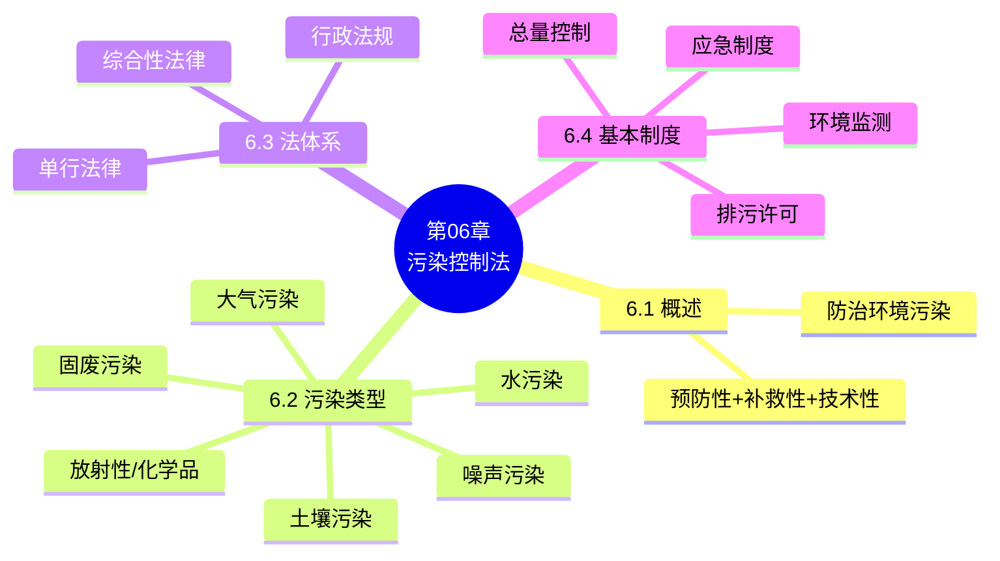

# 第06章 · 污染控制法

> 教师: 杨建英 · 学期: 2026春
> 主版页: 13 页（PDF 011）
> 辅版页: 0 页
> 注：原归类为"第2章/第二编"，实际为独立第6章内容

---

## 一 · 主版页图链

### PDF 011 — 主版（13页）

<details><summary>展开图链</summary>

- [p001](../011-第二编%20污染控制法-第二编%20污染控制法/page_001.jpg) ~ [p013](../011-第二编%20污染控制法-第二编%20污染控制法/page_013.jpg)

</details>

---

## 二 · 思维导图

```markmap
# 第06章 污染控制法
## 6.1 污染控制法概述
### 概念：防治环境污染的法律规范
### 特征：预防性+补救性+技术性
## 6.2 污染类型
### 大气污染
### 水污染
### 土壤污染
### 固体废物污染
### 环境噪声污染
### 放射性污染
### 有毒化学品污染
## 6.3 污染控制法体系
### 综合性法律
### 单行法律
#### 大气污染防治法
#### 水污染防治法
#### 土壤污染防治法
#### 固体废物污染环境防治法
#### 环境噪声污染防治法
### 行政法规与部门规章
## 6.4 污染控制基本制度
### 排污许可制度
### 总量控制制度
### 环境监测制度
### 污染事故应急制度
```



---

## 三 · 复习要点

### 核心概念

- **污染控制法**：调整因防治环境污染而产生的社会关系的法律规范的总称，是环境法体系的重要组成部分。具有预防性、补救性和技术性特征。
- **大气污染**：由于人类活动或自然过程引起某些物质进入大气，呈现出足够浓度、达到足够时间，危害人体健康和生态环境的现象。
- **水污染**：水体因某种物质的介入而导致其化学、物理、生物或放射性等方面特性的改变，影响水的有效利用，危害人体健康或破坏生态环境的现象。
- **土壤污染**：因人为因素导致某种物质进入陆地表层土壤，引起土壤化学、物理、生物等方面特性的改变，影响土壤功能和有效利用，危害公众健康或破坏生态环境的现象。
- **固体废物污染**：在生产、生活和其他活动中产生的丧失原有利用价值或虽未丧失利用价值但被抛弃或放弃的固态、半固态和置于容器中的气态物品、物质，对环境造成污染的现象。
- **总量控制制度**：根据环境质量目标，确定一定区域内污染物排放总量控制指标，并分配到排污单位的制度。

### 核心法条 / 制度构成

- **《大气污染防治法》**：以改善大气环境质量为目标，实行大气污染物排放总量控制和许可制度
- **《水污染防治法》**：防治水污染，保护地表水和地下水环境，实行排污许可制度
- **《土壤污染防治法》(2018)**：预防为主、保护优先、分类管理、风险管控、污染担责、公众参与
- **《固体废物污染环境防治法》**：减量化、资源化、无害化原则，实行固体废物污染环境防治责任制度
- **《环境噪声污染防治法》**：防治环境噪声污染，保障城乡居民正常生活和工作环境

### 典型案例 / 裁判要旨

- **紫金矿业水污染案**：紫金矿业集团因含铜酸性废水渗漏致汀江水污染，被判处罚金3000万元，相关责任人获刑。→ 水污染防治法的严厉执行
- **天津港爆炸固废案**：危险废物违规储存导致重大爆炸事故，相关责任人被追究刑事责任。→ 固体废物污染环境防治法的适用

### 高频考点

1. 污染控制法的概念与特征（预防性/补救性/技术性）（名词解释/简答）
2. 七种污染类型及其对应单行法（选择·高频）
3. 污染控制法体系的层级结构（综合性法律→单行法律→行政法规）（简答）
4. 总量控制制度与排污许可制度的关系（简答）
5. 《土壤污染防治法》的基本原则（选择/简答）
6. 固体废物"三化"原则（减量化/资源化/无害化）（选择·必考）

### 易错 / 易混点

- ❌ 将"污染控制法"等同于"环境保护法"：前者是单行法体系，后者是基本法
- ❌ 混淆大气污染与温室气体排放：温室气体排放受气候变化法调整，不完全等同于大气污染防治
- ❌ 忽略土壤污染防治法的"风险管控"原则：不同于其他污染防治法的"达标排放"思路
- ❌ 将固体废物"三化"顺序颠倒：正确顺序是减量化→资源化→无害化
- ❌ 混淆排污许可与排污收费：许可是准入制度，收费（现改为环保税）是经济手段

### 思考题 / 自测

1. 污染控制法体系与环境保护基本法的关系是什么？
2. 总量控制制度与浓度控制制度有何区别？
3. 《土壤污染防治法》为何采用"风险管控"而非"达标排放"？
4. 固体废物"三化"原则如何体现预防原则和环境责任原则？

### 与前后章之关联

- **← 第2章**：第2章的环境责任原则在污染控制法中具体适用
- **← 第5章**：第5章的排污许可、环境标准在污染控制法中具体落实
- **← 第4章**：第4章的环境行政处罚在污染控制执法中适用
