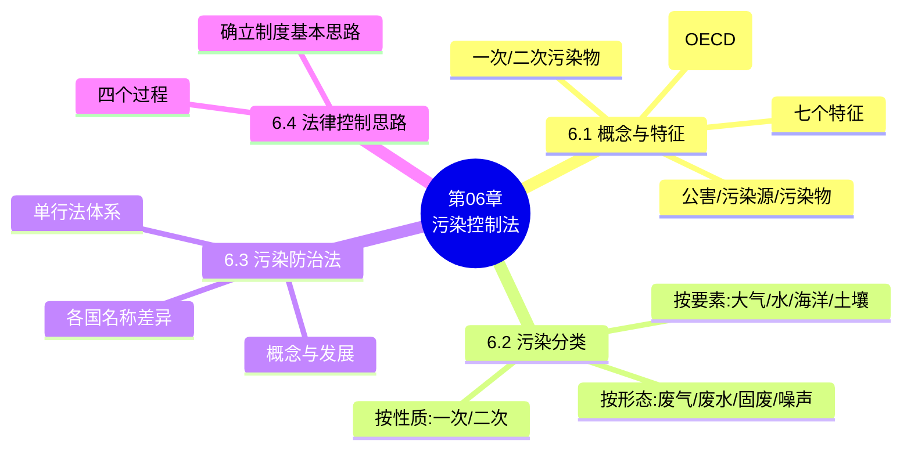

# 第06章 · 污染控制法

> 教师: 杨建英 · 学期: 2026春
> 主版页: 13 页（PDF 011）
> 辅版页: 0 页
> 注：原归类为"第2章/第二编"，实际为独立第6章内容

---

## 一 · 主版页图链

### PDF 011 — 主版（13页）

<details><summary>展开图链</summary>

- [p001](../011-第二编%20污染控制法-第二编%20污染控制法/page_001.jpg) ~ [p013](../011-第二编%20污染控制法-第二编%20污染控制法/page_013.jpg)

</details>

---

## 二 · 思维导图

```markmap
# 第06章 污染控制法
## 6.1 环境污染的概念与特征
### 环境污染（1974 OECD 定义）
### 公害 / 污染源 / 污染物
### 一次污染物 / 二次污染物
### 环境污染的七个特征
## 6.2 环境污染的分类
### 按物理化学性质：一次/二次污染物
### 按环境要素：大气/水质/海洋/土壤
### 按污染物形态：废气/废水/固废/噪声/放射性/电磁波
## 6.3 污染控制法体系
### 综合性法律
### 单行法律
#### 大气污染防治法
#### 水污染防治法
#### 土壤污染防治法
#### 固体废物污染环境防治法
#### 环境噪声污染防治法
### 行政法规与部门规章
## 6.4 污染控制基本制度
### 排污许可制度
### 总量控制制度
### 环境监测制度
### 污染事故应急制度
```



---

## 三 · 复习要点

### 核心概念

- **环境污染**（1974年OECD经济合作与发展组织环境委员会最早提出）：被人们利用的物质或者能量直接或间接地进入环境，导致对自然的有害影响，以致危及人类健康、危害生命资源和生态系统，以及损害或者妨害舒适性和环境的其他合法用途的现象。
- **公害**：一般认为，公害就是环境污染。我国《环境保护法》（2014修订版）第三章"防治污染和其他公害"第42条列举：在生产建设或者其他活动中产生的废气、废水、废渣、医疗废物、粉尘、恶臭气体、放射性物质以及噪声、振动、光辐射、电磁辐射等对环境的污染和危害。
- **污染源**：造成环境污染的污染物的发生源，如向环境排放污染物或对环境产生有害影响的场所、设备和装置。
- **污染物**：进入环境后使环境的正常组成和性质发生直接或间接有害于人类的物质和能量。
- **一次污染物**：由污染源直接与环境接触、进入环境而导致的污染，污染物的物理、化学性质并未改变。
- **二次污染物**：进入环境的一次污染物的物理、化学性质发生变化而形成的新污染物；在一定条件和范围内，二次污染物比一次污染物的污染更具破坏性、危害程度更大。
- **环境污染防治法（污染控制法）**：国家为预防和治理环境污染和其他公害，对产生或可能产生环境污染和其他公害的原因活动（包括各种对环境不利的人为活动）实施管理，以达到保护生活环境和生态环境、进而达到保护人体健康和财产安全的目的而制定的同类法律的总称。

### 环境污染的特征（PDF p5）

1. 是人类正常活动的有害副作用
2. 须为物质、能量从一定的设施设备向外界排放或者泄漏
3. 以环境为媒介对不特定人体造成危害
4. 具有综合性和积累性
5. 往往同时侵害多种权益
6. 危及的范围广
7. 引起的疾病往往难以发现和治疗

### 环境污染的分类（PDF p6）

- 按物理、化学性质：一次污染物、二次污染物
- 按介入环境的要素：大气污染、水质污染、海洋环境污染、土壤污染
- 按污染物的形态：废气污染、废水污染、固体废物污染、噪声污染、放射性污染、电磁波辐射污染等

### 核心法条 / 制度构成

- **污染控制法体系**：环境污染防治法律法规体系在形式上表现为环境保护基本法下属的单行法及其配套法规——单行法律 → 国务院行政法规 → 主管部门规章/环境标准 → 地方性法规规章。
- **环境污染防治单行法律（PDF p10）**：《大气污染防治法》（2015年修订）、《水污染防治法》（2017年修正）、《海洋环境保护法》（2017年修正）、《环境噪声污染防治法》（2018年修正）、《固体废物污染环境防治法》（2016年修正）、《放射性污染防治法》（2003年）、《清洁生产促进法》（2002年）等。
- **各国（地区）法律名称的差异**：美国在环境要素前冠以"清洁"二字（《清洁空气法》《清洁水法》）；日本采用"环境要素+污染因子+防止（规制）"（《大气污染防止法》《水质污浊防止法》《噪音规制法》）；中国台湾地区命名突出预防、管制、整治、清理、管理等目的。

### 典型案例 / 裁判要旨

- **紫金矿业水污染案**：紫金矿业集团因含铜酸性废水渗漏致汀江水污染，被判处罚金3000万元，相关责任人获刑。→ 水污染防治法的严厉执行
- **天津港爆炸固废案**：危险废物违规储存导致重大爆炸事故，相关责任人被追究刑事责任。→ 固体废物污染环境防治法的适用

### 高频考点

1. 环境污染的概念（1974 OECD）与七个特征（名词解释/简答）
2. 公害、污染源、污染物、一次/二次污染物的区别（名词解释）
3. 环境污染防治法的概念与单行法体系（简答）
4. 环境污染的三种分类维度（性质/要素/形态）（选择·高频）
5. 各国（美/日/中台）污染防治法律名称的差异（选择）
6. 污染从发生到危害的四个过程与法律控制思路（简答）

### 易错 / 易混点

- ❌ 将"污染控制法"等同于"环境保护法"：前者是单行法体系，后者是基本法
- ❌ 混淆大气污染与温室气体排放：温室气体排放受气候变化法调整，不完全等同于大气污染防治
- ❌ 忽略土壤污染防治法的"风险管控"原则：不同于其他污染防治法的"达标排放"思路
- ❌ 将固体废物"三化"顺序颠倒：正确顺序是减量化→资源化→无害化
- ❌ 混淆排污许可与排污收费：许可是准入制度，收费（现改为环保税）是经济手段

### 思考题 / 自测

1. 污染控制法体系与环境保护基本法的关系是什么？
2. 总量控制制度与浓度控制制度有何区别？
3. 《土壤污染防治法》为何采用"风险管控"而非"达标排放"？
4. 固体废物"三化"原则如何体现预防原则和环境责任原则？

### 与前后章之关联

- **← 第2章**：第2章的环境责任原则在污染控制法中具体适用
- **← 第5章**：第5章的排污许可、环境标准在污染控制法中具体落实
- **← 第4章**：第4章的环境行政处罚在污染控制执法中适用
