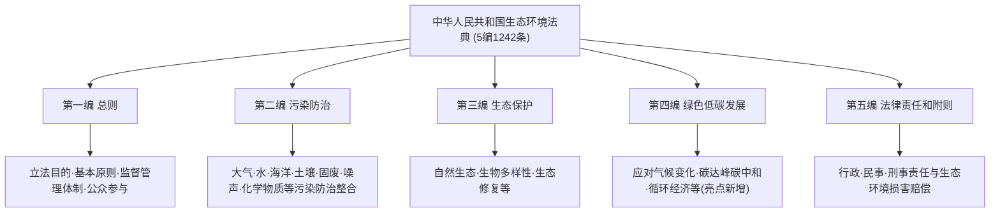

# 生态环境法典（2026）要点 · 新疆大学环境法学相关资料

> 据全国人大、新华社、人民日报、生态环境部公开文本整理；新疆大学院校特色部分标 `[推断]`，以本校教学大纲与任课教师讲义为准。

---

## 一 · 《中华人民共和国生态环境法典》核心要点（重大立法更新）

| 项 | 内容 |
|---|---|
| 通过 | 2026 年 3 月 12 日，第十四届全国人民代表大会第四次会议表决通过 |
| 公布 | 国家主席令第 70 号 |
| 施行 | **2026 年 8 月 15 日起施行** |
| 体量 | 共 **5 编、1242 条** |
| 同时废止 | 《环境保护法》等 **10 部法律** |
| 指导思想 | 以习近平生态文明思想为引领 |

### 1.1 法典编目（5 编）

### 1.2 编纂意义（高频论述点）

1. **系统整合**：对现行分散的环境单行法（环保法、大气/水/固废/噪声/土壤污染防治法等）进行编订纂修、集成升华，消除规范冲突、填补空白。
2. **首创"绿色低碳发展"编**：将应对气候变化、碳达峰碳中和、绿色低碳转型纳入法典，回应"双碳"战略，是重要制度创新。
3. **法典化里程碑**：继《民法典》后我国又一部以"典"命名的法律，标志生态环境法治体系化、现代化。
4. **价值引领**：体现中国特色、时代特点，反映人民意愿，系统规范协调。

> **复习提示**：法典施行后，原"环境保护法"等表述应更新为"生态环境法典相应编/条"；但**基本原则、基本制度、法律责任的实体内容总体延续并升级**，原有复习要点仍然适用，重点掌握"整合 + 新增绿色低碳发展编"两条主线。

---

## 二 · 新疆大学开课背景

新疆大学**生态与环境学院**（博达校区，乌鲁木齐市水磨沟区华瑞街777号）设环境科学（理学）、环境工程（工学）专业。环境法学/环境与资源保护法学常作为环境类专业的**专业基础/选修课**，或由法学院开设。`[推断]`

- 培养目标含**环境规划管理、环境影响评价**等，环境法治素养是其重要组成。
- 区域特色：服务"一带一路"新疆核心区与干旱区生态环境保护，强调生态文明与依法治污。

---

## 三 · 新疆区域特色考点（结合本地实际）`[推断]`

1. **干旱区生态保护立法适用**：荒漠化防治、绿洲与水资源保护、生态红线的法律保障。
2. **流域与跨界环境治理**：塔里木河等流域水资源与水污染防治的法律协调（协同合作原则）。
3. **生态保护补偿**：草原、森林、湿地生态补偿制度在新疆的应用。
4. **环境公益诉讼与生态环境损害赔偿**：本地典型案例（如非法排污、破坏草原/林地）的责任认定。
5. **"双碳"与绿色低碳发展编**：结合新疆能源结构（煤电、新能源）讨论绿色低碳转型的法律制度。

---

## 四 · 备考与资源建议

### 4.1 复习路径

1. 以汪劲教材建立"概念—原则—制度—责任—救济"主干，再用「核心例题精解」「名词解释与简答速查」自测。
2. **务必新增法典专题**：背熟法典 5 编结构、施行日期、废止范围、编纂意义与"绿色低碳发展"编亮点。
3. 准备 1–2 道案例（环境侵权 + 公益诉讼/损害赔偿）的答题模板。

### 4.2 推荐补充资源（公开、权威）

- **法典原文**：全国人大网、生态环境部（mee.gov.cn）、新华网受权全文、维基文库《中华人民共和国生态环境法典》。
- **官方解读**：人民日报、新华社关于法典通过的报道与释义文章。
- **教材**：汪劲《环境法学》（北大社）、金瑞林《环境与资源保护法学》。
- **案例库**：最高人民法院环境资源审判典型案例、检察机关公益诉讼典型案例。

---

## 五 · 常见问题

**Q：法典施行后，老教材还能用吗？**
A：能。基本原理、原则、制度、责任的**实体内容总体延续**；只需把法律依据更新为"生态环境法典"，并补学"绿色低碳发展"编等新增内容。

**Q：法典会怎么考？**
A：多以名词解释（生态环境法典）、简答（结构与意义）、论述（编纂意义/对单行法的整合/绿色低碳发展编的创新）形式出现；案例题仍以责任认定为主。

**Q：与环境规划与管理课程如何衔接？**
A：环境法学提供制度的**法律依据与责任后果**；环境规划与管理侧重制度的**技术实现与管理流程**。环评、三同时、排污许可、总量控制等是两课的共同交汇点。

---

> 法以时移，典以纲举。紧扣 2026《生态环境法典》最新坐标，兼顾新疆区域实际，方为"取天下资源为我所用"。院校特色多为依公开信息的合理推断，务必与任课教师要求核对。
