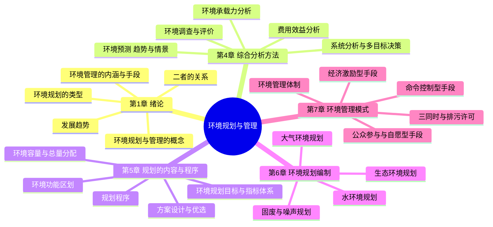
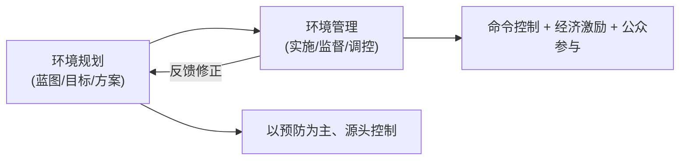
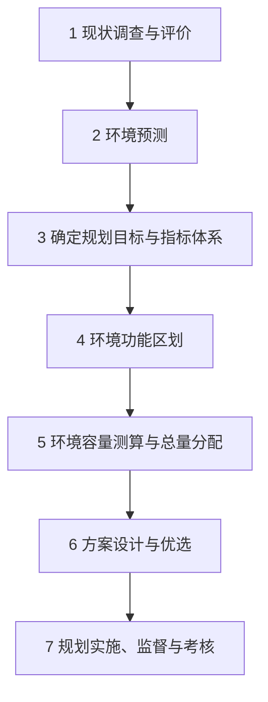
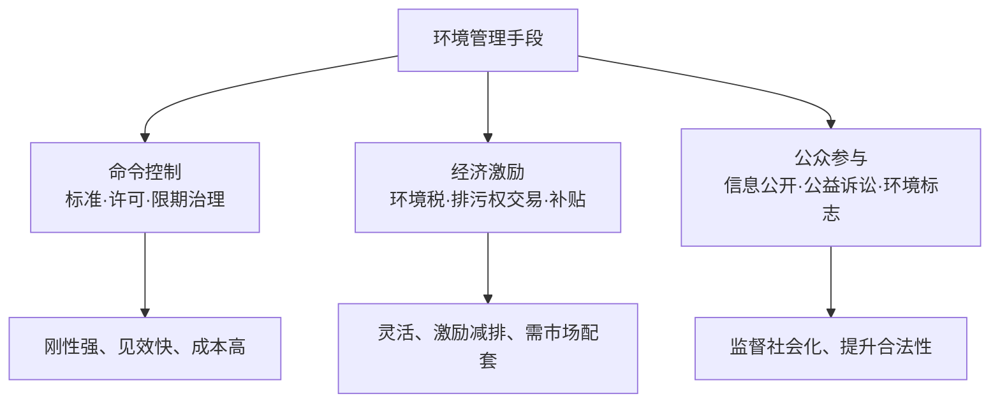

# 环境规划与管理 · 核心例题精解 · 图示深化

> 本篇为**深化层**：在「综合复习资料」之上，逐章给出**名词解释 / 简答 / 计算与案例 + 参考答案**，并配**思维导图 / 程序示意图**（mermaid 矢量图，非纯文字）。
> 规划计算遵循"先判目标 → 列模型/公式 → 代入数据 → 得值与对策"四步。

---

## 全课知识结构 · 思维导图

---

## 第2章 · 绪论

### 体系示意 · 规划与管理的关系

### 例题 1-1（名词解释）
**题**：什么是环境规划？什么是环境管理？二者关系如何？
**参考答案**：
- **环境规划**：为协调环境与社会经济发展、合理利用环境容量，对一定时期一定区域的环境保护**目标、任务与措施**所作的**总体部署**。
- **环境管理**：运用**行政、法律、经济、技术、教育**等手段，对影响环境的活动进行**调控**，使经济社会发展与环境相协调。
- 关系：规划是管理的**前提与依据**（定目标、绘蓝图）；管理是规划的**实施与保障**（落地、监督、反馈），二者构成"计划—执行—检查—改进"闭环。

### 例题 1-2（简答）
**题**：环境管理的三大类手段及其代表措施。
**参考答案**：① **命令控制型**（标准、许可、限期治理、关停）；② **经济激励型**（排污收费/环境税、排污权交易、补贴、押金返还）；③ **公众参与/自愿型**（信息公开、环境标志、自愿协议、公益诉讼）。

---

## 第4章 · 综合分析方法

### 流程示意 · 环境预测与决策

### 例题 4-1（名词解释）
**题**：什么是环境承载力？什么是环境容量？
**参考答案**：
- **环境承载力**：在一定时期和区域，环境系统在维持其结构功能不被破坏的前提下，所能**承受人类社会经济活动的阈值**（综合、相对）。
- **环境容量**：在满足环境目标值（标准）的前提下，区域环境所能容纳某种污染物的**最大允许排放量**。前者综合、宏观，后者针对具体污染物、可量化。

### 例题 4-2（计算 · 水环境容量·零维稀释）
**题**：某河段流量 $Q=10\ \mathrm{m^3/s}$，上游本底浓度 $C_0=2\ \mathrm{mg/L}$，水质目标 $C_s=5\ \mathrm{mg/L}$（COD，暂不计降解）。求该河段对 COD 的最大允许排放量（容量，$\mathrm{kg/d}$）。
**解**：
1. 单位换算：$Q=10\ \mathrm{m^3/s}=10\times86400=8.64\times10^{5}\ \mathrm{m^3/d}$。
2. 可利用浓度增量 $\Delta C=C_s-C_0=3\ \mathrm{mg/L}=3\ \mathrm{g/m^3}$。
3. 环境容量 $W=Q\cdot\Delta C=8.64\times10^{5}\times3=2.592\times10^{6}\ \mathrm{g/d}\approx 2592\ \mathrm{kg/d}$。

$$\boxed{W=Q(C_s-C_0)\approx 2.59\times10^{3}\ \mathrm{kg/d}}$$

### 例题 4-3（计算 · 费用效益）
**题**：某治理方案投资现值 $C=800\ \mathrm{万元}$，预期环境效益现值 $B=1200\ \mathrm{万元}$。求效益费用比并判断经济可行性。
**解**：$\dfrac{B}{C}=\dfrac{1200}{800}=1.5>1$，效益大于费用，**经济可行**。

$$\boxed{B/C=1.5>1\ \Rightarrow\ \text{方案经济上可行}}$$

---

## 第 5 章 · 环境规划的内容与程序

### 程序示意 · 环境规划编制流程

### 例题 5-1（简答）
**题**：环境规划的目标指标体系一般包含哪几类指标？
**参考答案**：① **环境质量指标**（大气、水、声、土壤达标率）；② **污染物总量控制指标**（COD、氨氮、SO₂、NOₓ 排放总量）；③ **环境治理/建设指标**（污水处理率、垃圾无害化率、绿化覆盖率）；④ **相关社会经济指标**（万元 GDP 能耗/排放强度）。

### 例题 5-2（计算 · 总量分配·等比例削减）
**题**：区域 COD 现状排放 $1.0\times10^{4}\ \mathrm{t/a}$，环境容量（允许排放）$=0.8\times10^{4}\ \mathrm{t/a}$。求需削减总量与削减率；若按等比例分配，某企业现排 $500\ \mathrm{t/a}$ 应削减多少？
**解**：
1. 需削减 $=1.0\times10^{4}-0.8\times10^{4}=2.0\times10^{3}\ \mathrm{t/a}$；削减率 $=\dfrac{2000}{10000}=20\%$。
2. 企业削减 $=500\times20\%=100\ \mathrm{t/a}$，分配后允许排放 $400\ \mathrm{t/a}$。

$$\boxed{削减率 20\%;\ 该企业削减 100\ \mathrm{t/a}\to 允许 400\ \mathrm{t/a}}$$

### 例题 5-3（名词解释）
**题**：什么是环境功能区划？意义何在？
**参考答案**：根据区域的**自然条件、环境容量、社会经济功能与保护目标**，将区域划分为不同**环境功能区**（如大气一类/二类区、地表水 I–V 类水域、声环境功能区），分别执行**不同的环境质量标准与管理要求**。意义：实现**分区分类、差别化管理**，是总量分配与排污许可的空间依据。

---

## 第6章 · 规划编制与管理模式

### 体系示意 · 管理手段组合

### 例题 6-1（案例分析 · 排污权交易）
**题**：A 企业减排边际成本 $200\ \mathrm{元/t}$，B 企业 $600\ \mathrm{元/t}$。区域需再削减 COD $100\ \mathrm{t}$。比较"平均分摊"与"排污权交易"两种方式的总成本。
**参考答案**：
- **平均分摊**（各减 $50\ \mathrm{t}$）：$200\times50+600\times50=10000+30000=4.0\times10^{4}\ \mathrm{元}$。
- **交易**：由**低成本的 A 企业多减**（A 减 $100\ \mathrm{t}$），总成本 $200\times100=2.0\times10^{4}\ \mathrm{元}$；B 向 A 购买配额，双方与社会均获益。
- 结论：排污权交易使减排在**边际成本最低处**完成，**总治理成本最省**，体现经济激励手段的效率优势。

$$\boxed{交易方式总成本 2.0\times10^{4}\ \mathrm{元} < 平均分摊 4.0\times10^{4}\ \mathrm{元}}$$

### 例题 6-2（简答）
**题**：简述"三同时"制度与排污许可制度在环境管理中的作用。
**参考答案**：
- **三同时**：建设项目防治污染设施与主体工程**同时设计、施工、投产**，是**建设期**的源头预防。
- **排污许可**：以许可证形式明确企业**允许排放的污染物种类、浓度、总量与监测要求**，是**运营期**的"一证式"核心管理制度，承接总量控制并衔接执法。

---

> **正言若反**：方案不离容量，容量不离标准，标准不离原始 PDF 课件之图表。本篇为"算得出、议得透"的一层；遇疑，回归「综合复习资料」与各章素材。