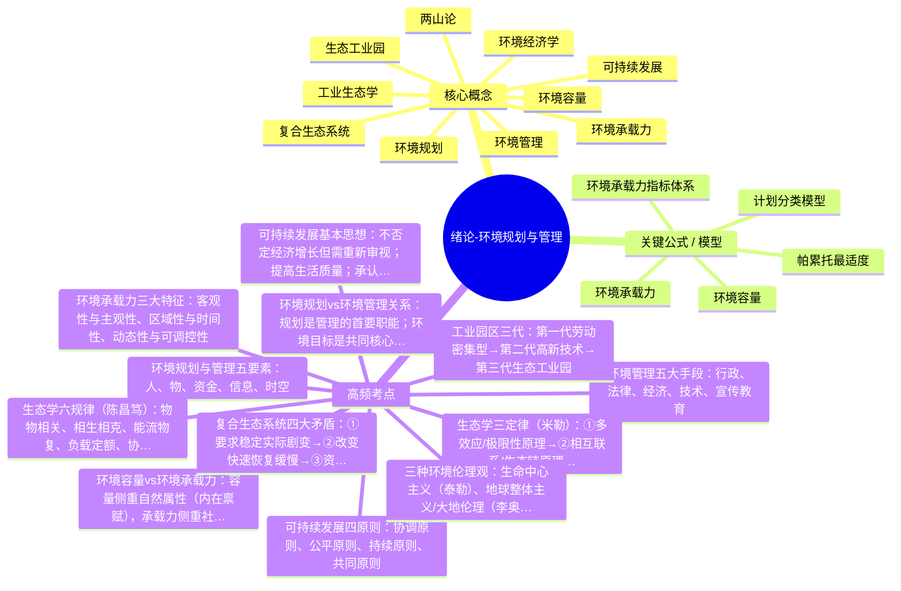
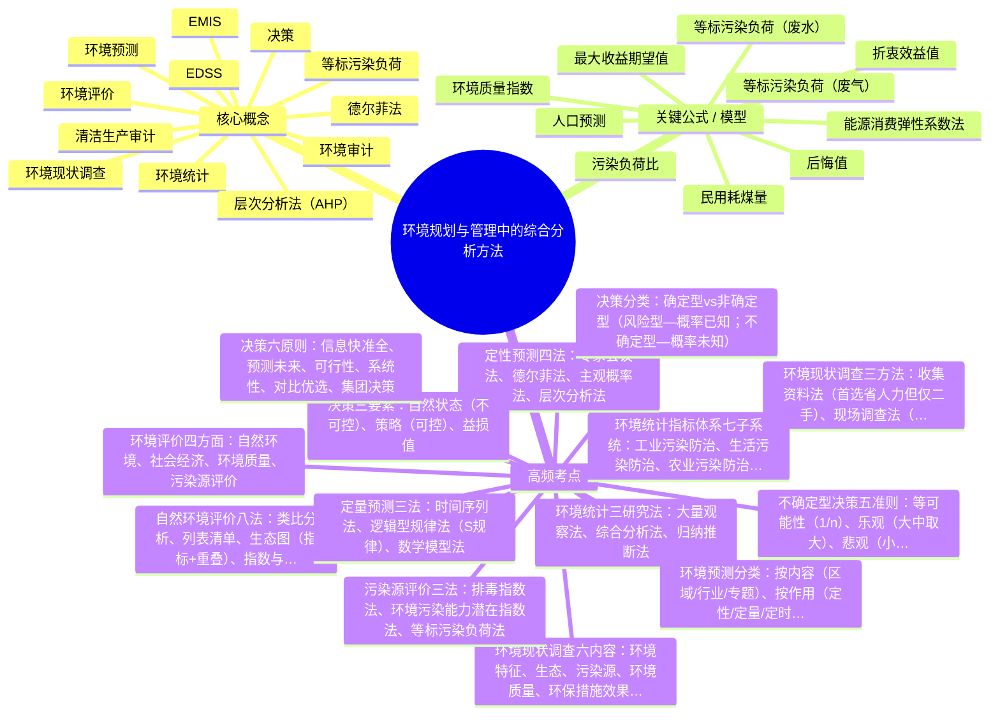
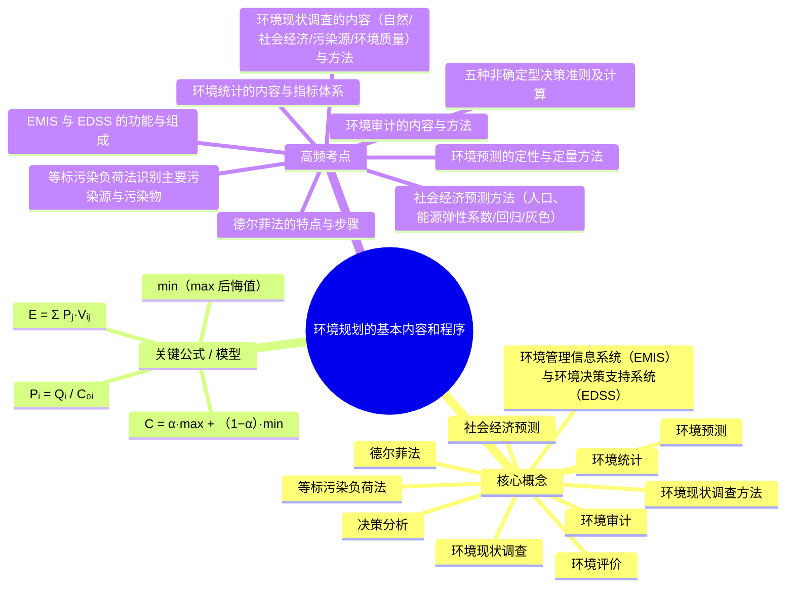
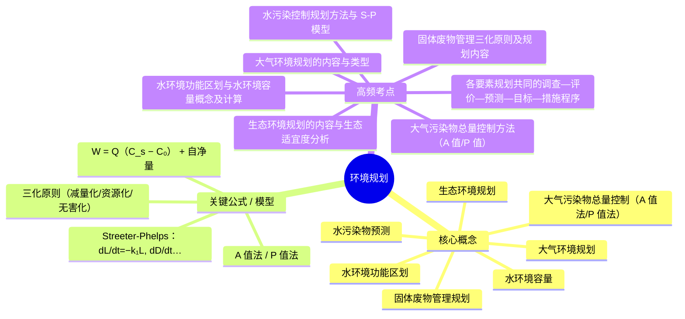
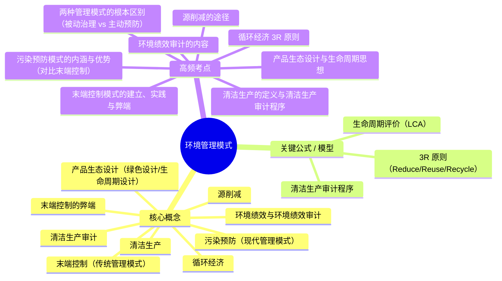

# 环境规划与管理 · 综合复习资料

> 教师: 王思雨 · 学期: 2026春
> 链路：原始 PDF → 页图集（多图提取）→ 章节图谱 → LLM 协填要点 → 思维导图 → **本资料**
> 完成度：复习要点 **6/6** 章 · 嵌入子图 **0** 张 · 思维导图 **6/6** 章

---

## 一 · 章级入口

| 章 | 标题 | 主版页 | 子图 | 要点 | 图谱 | 素材 |
| ---: | ---- | -----: | ---: | :--: | :--: | ---- |
| 0 | 绪论-环境规划与管理 | 129 | 0 | ✓ | ✓ | [_第00章_绪论-环境规划与管理.md](./_第00章_绪论-环境规划与管理.md) |
| 2 | 绪论-环境规划与管理 | 129 | 0 | ✓ | ✓ | [_第02章_绪论-环境规划与管理.md](./_第02章_绪论-环境规划与管理.md) |
| 4 | 环境规划与管理中的综合分析方法 | 135 | 0 | ✓ | ✓ | [_第04章_环境规划与管理中的综合分析方法.md](./_第04章_环境规划与管理中的综合分析方法.md) |
| 5 | 环境规划的基本内容和程序 | 126 | 0 | ✓ | ✓ | [_第05章_环境规划的基本内容和程序.md](./_第05章_环境规划的基本内容和程序.md) |
| 6 | 环境规划 | 115 | 0 | ✓ | ✓ | [_第06章_环境规划.md](./_第06章_环境规划.md) |
| 7 | 环境管理模式 | 106 | 0 | ✓ | ✓ | [_第07章_环境管理模式.md](./_第07章_环境管理模式.md) |

## 二 · 全章综合汇编

### 绪论 · 绪论-环境规划与管理

> 素材：[_第00章_绪论-环境规划与管理.md](./_第00章_绪论-环境规划与管理.md) · 主版 129 页

#### 一、核心概念（名词解释）

- [x] **环境管理**：协调发展与环境关系，运用各种手段限制人类损害环境质量的行为，是跨学科新兴综合学科，也是动态过程，需各国协调合作
- [x] **环境规划**：国民经济和社会发展的有机组成部分，环境管理的首要职能，环境决策在时间空间上的具体安排，带有指令性的环境保护方案
- [x] **环境容量**：某环境单元在给定环境功能区目标和环境质量目标下所允许承纳的污染物质的最大数量；M=K+R（基本/稀释容量+可变/自净容量）
- [x] **环境承载力**：不破坏自然环境情况下，自然环境能够承载和支撑的人类社会活动的强度和总量；EBC=f(T,S,B)
- [x] **可持续发展**：既能满足当代人的需要，又不对后代人满足其需要的能力构成危害的发展（1987《我们共同的未来》）
- [x] **两山论**：绿水青山就是金山银山；三阶段：①既要绿水青山也要金山银山→②宁要绿水青山不要金山银山→③绿水青山就是金山银山
- [x] **复合生态系统**：自然子系统+社会子系统+经济子系统；功能包括生产、生活、还原、信息传递
- [x] **工业生态学**：研究社会生产活动中自然资源从源、流到汇的全代谢过程，含"从摇篮到坟墓"全过程管理系统观
- [x] **生态工业园**：制造和服务企业形成的企业社区，通过物流/能流传递形成产业共生组合，模拟自然系统"生产者-消费者-分解者"循环
- [x] **环境经济学**：研究合理调节人与自然之间物质变换，使社会经济活动符合自然生态平衡和物质循环规律的学科

#### 二、关键公式 / 模型

- **环境容量**：M = K + R（K=稀释容量，R=自净容量）
- **环境承载力**：EBC = f(T, S, B)，T=时间，S=空间，B=人类经济行为的规模与方向
- **环境承载力指标体系**：资源供给指标+社会影响指标+污染容纳指标
- **帕累托最适度**：资源配置效率理论，寻求个人、集体和社会之间经济效率的协调统一
- **计划分类模型**：按时间（长/中/短期）、约束力（指令性/指导性）、制定者层次（战略/管理/作业）、性质（综合/局部/项目）

#### 三、重要案例 / 实验 / 例题

- **丹麦卡伦堡生态工业园**：世界上最早最著名的生态工业园，主体企业为发电厂、炼油厂、制药厂、石膏板生产厂，通过贸易方式利用对方废弃物和副产品
- **广西贵港国家生态工业（制糖）示范园区**：2001年8月我国第一个国家级生态工业示范园区
- **美国生态工业园示范点**：1994年指定4个社区——巴尔的摩、查尔斯、布郎斯、恰塔努加
- **两山论实践**：黑河（生态发展带动绿色崛起）、福建长汀（水土治理提升农民收入）、海南海口（大环保模式+海绵城市）
- **中国总量控制历程**：1996年"九五"总量控制→1998年"一控双达标"→"十五"三大任务→"十一五"SO₂和COD控制→"十二五"主要污染物减排

#### 四、高频考点（速记）

1. **环境规划与管理五要素**：人、物、资金、信息、时空
2. **环境管理五大手段**：行政、法律、经济、技术、宣传教育
3. **环境规划vs环境管理关系**：规划是管理的首要职能；环境目标是共同核心；共同理论基础
4. **环境容量vs环境承载力**：容量侧重自然属性（内在禀赋），承载力侧重社会属性（外在禀赋）；两者均可通过人类环保行为调控
5. **环境承载力三大特征**：客观性与主观性、区域性与时间性、动态性与可调控性
6. **生态学三定律（米勒）**：①多效应/极限性原理→②相互联系/生态链原理→③勿干扰/生物多样性原理
7. **生态学六规律（陈昌笃）**：物物相关、相生相克、能流物复、负载定额、协调稳定、时空有宜
8. **可持续发展四原则**：协调原则、公平原则、持续原则、共同原则
9. **可持续发展基本思想**：不否定经济增长但需重新审视；提高生活质量；承认自然环境价值；以自然资源为基础同环境承载力协调
10. **复合生态系统四大矛盾**：①要求稳定实际剧变→②改变快速恢复缓慢→③资源有限需求无限→④地球有限人口增长无限
11. **三种环境伦理观**：生命中心主义（泰勒）、地球整体主义/大地伦理（李奥波德）、代际均等伦理观
12. **工业园区三代**：第一代劳动密集型→第二代高新技术→第三代生态工业园

#### 五、思考题 / 自测

- [x] 题：环境容量与环境承载力的区别？ 答：环境容量侧重自然属性（内在禀赋），反映环境净化能力；环境承载力侧重社会属性（外在禀赋），反映环境支撑人类活动的强度和总量
- [x] 题：环境规划与管理的根本目的是什么？ 答：通过传播可持续发展思想，创建可持续的发展模式和消费模式，使人与自然和谐相处
- [x] 题：两山论三个阶段？ 答：①既要绿水青山也要金山银山→②宁要绿水青山不要金山银山→③绿水青山就是金山银山
- [x] 题：复合生态系统的组成与功能？ 答：自然+社会+经济三个子系统；生产、生活、还原、信息传递四大功能
- [x] 题：环境经济学在环境管理中的经济手段？ 答：税收、财政、信贷等经济杠杆，调节经济活动与环境保护关系

#### 六、与前后章之关联

- 承前章：本章为绪论，奠定基本概念和理论基础
- 启后章：第2章深入环境规划与管理的政策方针法律法规，第4章进入综合分析方法，第5-7章为规划与管理实务

<details><summary>🧠 思维导图（markmap / mermaid）</summary>

### Markmap（Typora / markmap.js / Obsidian 可渲染）

```markmap
# 绪论-环境规划与管理
## 核心概念
- 环境管理
- 环境规划
- 环境容量
- 环境承载力
- 可持续发展
- 两山论
- 复合生态系统
- 工业生态学
- 生态工业园
- 环境经济学
## 关键公式 / 模型
- 环境容量
- 环境承载力
- 环境承载力指标体系
- 帕累托最适度
- 计划分类模型
## 高频考点
- 环境规划与管理五要素：人、物、资金、信息、时空
- 环境管理五大手段：行政、法律、经济、技术、宣传教育
- 环境规划vs环境管理关系：规划是管理的首要职能；环境目标是共同核心；共同理论基础
- 环境容量vs环境承载力：容量侧重自然属性（内在禀赋），承载力侧重社会属性（外在禀赋）；两者均可通过人类环保行为调控
- 环境承载力三大特征：客观性与主观性、区域性与时间性、动态性与可调控性
- 生态学三定律（米勒）：①多效应/极限性原理→②相互联系/生态链原理→③勿干扰/生物多样性原理
- 生态学六规律（陈昌笃）：物物相关、相生相克、能流物复、负载定额、协调稳定、时空有宜
- 可持续发展四原则：协调原则、公平原则、持续原则、共同原则
- 可持续发展基本思想：不否定经济增长但需重新审视；提高生活质量；承认自然环境价值；以自然资源为基础同环境承载力协调
- 复合生态系统四大矛盾：①要求稳定实际剧变→②改变快速恢复缓慢→③资源有限需求无限→④地球有限人口增长无限
- 三种环境伦理观：生命中心主义（泰勒）、地球整体主义/大地伦理（李奥波德）、代际均等伦理观
- 工业园区三代：第一代劳动密集型→第二代高新技术→第三代生态工业园
```

### Mermaid（GitHub Markdown 可渲染）



</details>

---

### 第 2 章 · 绪论-环境规划与管理

> 素材：[_第02章_绪论-环境规划与管理.md](./_第02章_绪论-环境规划与管理.md) · 主版 129 页

#### 一、核心概念（名词解释）

- [x] **环境管理**：协调发展与环境关系，运用各种手段限制人类损害环境质量的行为，是跨学科新兴综合学科，也是动态过程，需各国协调合作
- [x] **环境规划**：国民经济和社会发展的有机组成部分，环境管理的首要职能，环境决策在时间空间上的具体安排，带有指令性的环境保护方案
- [x] **环境容量**：某环境单元在给定环境功能区目标和环境质量目标下所允许承纳的污染物质的最大数量；M=K+R（基本/稀释容量+可变/自净容量）
- [x] **环境承载力**：不破坏自然环境情况下，自然环境能够承载和支撑的人类社会活动的强度和总量；EBC=f(T,S,B)
- [x] **可持续发展**：既能满足当代人的需要，又不对后代人满足其需要的能力构成危害的发展（1987《我们共同的未来》）
- [x] **两山论**：绿水青山就是金山银山；三阶段：①既要绿水青山也要金山银山→②宁要绿水青山不要金山银山→③绿水青山就是金山银山
- [x] **复合生态系统**：自然子系统+社会子系统+经济子系统；功能包括生产、生活、还原、信息传递
- [x] **工业生态学**：研究社会生产活动中自然资源从源、流到汇的全代谢过程，含"从摇篮到坟墓"全过程管理系统观
- [x] **生态工业园**：制造和服务企业形成的企业社区，通过物流/能流传递形成产业共生组合，模拟自然系统"生产者-消费者-分解者"循环
- [x] **环境经济学**：研究合理调节人与自然之间物质变换，使社会经济活动符合自然生态平衡和物质循环规律的学科

#### 二、关键公式 / 模型

- **环境容量**：M = K + R（K=稀释容量，R=自净容量）
- **环境承载力**：EBC = f(T, S, B)，T=时间，S=空间，B=人类经济行为的规模与方向
- **环境承载力指标体系**：资源供给指标+社会影响指标+污染容纳指标
- **帕累托最适度**：资源配置效率理论，寻求个人、集体和社会之间经济效率的协调统一
- **计划分类模型**：按时间（长/中/短期）、约束力（指令性/指导性）、制定者层次（战略/管理/作业）、性质（综合/局部/项目）

#### 三、重要案例 / 实验 / 例题

- **丹麦卡伦堡生态工业园**：世界上最早最著名的生态工业园，主体企业为发电厂、炼油厂、制药厂、石膏板生产厂，通过贸易方式利用对方废弃物和副产品
- **广西贵港国家生态工业（制糖）示范园区**：2001年8月我国第一个国家级生态工业示范园区
- **美国生态工业园示范点**：1994年指定4个社区——巴尔的摩、查尔斯、布郎斯、恰塔努加
- **两山论实践**：黑河（生态发展带动绿色崛起）、福建长汀（水土治理提升农民收入）、海南海口（大环保模式+海绵城市）
- **中国总量控制历程**：1996年"九五"总量控制→1998年"一控双达标"→"十五"三大任务→"十一五"SO₂和COD控制→"十二五"主要污染物减排

#### 四、高频考点（速记）

1. **环境规划与管理五要素**：人、物、资金、信息、时空
2. **环境管理五大手段**：行政、法律、经济、技术、宣传教育
3. **环境规划vs环境管理关系**：规划是管理的首要职能；环境目标是共同核心；共同理论基础
4. **环境容量vs环境承载力**：容量侧重自然属性（内在禀赋），承载力侧重社会属性（外在禀赋）；两者均可通过人类环保行为调控
5. **环境承载力三大特征**：客观性与主观性、区域性与时间性、动态性与可调控性
6. **生态学三定律（米勒）**：①多效应/极限性原理→②相互联系/生态链原理→③勿干扰/生物多样性原理
7. **生态学六规律（陈昌笃）**：物物相关、相生相克、能流物复、负载定额、协调稳定、时空有宜
8. **可持续发展四原则**：协调原则、公平原则、持续原则、共同原则
9. **可持续发展基本思想**：不否定经济增长但需重新审视；提高生活质量；承认自然环境价值；以自然资源为基础同环境承载力协调
10. **复合生态系统四大矛盾**：①要求稳定实际剧变→②改变快速恢复缓慢→③资源有限需求无限→④地球有限人口增长无限
11. **三种环境伦理观**：生命中心主义（泰勒）、地球整体主义/大地伦理（李奥波德）、代际均等伦理观
12. **工业园区三代**：第一代劳动密集型→第二代高新技术→第三代生态工业园

#### 五、思考题 / 自测

- [x] 题：环境容量与环境承载力的区别？ 答：环境容量侧重自然属性（内在禀赋），反映环境净化能力；环境承载力侧重社会属性（外在禀赋），反映环境支撑人类活动的强度和总量
- [x] 题：环境规划与管理的根本目的是什么？ 答：通过传播可持续发展思想，创建可持续的发展模式和消费模式，使人与自然和谐相处
- [x] 题：两山论三个阶段？ 答：①既要绿水青山也要金山银山→②宁要绿水青山不要金山银山→③绿水青山就是金山银山
- [x] 题：复合生态系统的组成与功能？ 答：自然+社会+经济三个子系统；生产、生活、还原、信息传递四大功能
- [x] 题：环境经济学在环境管理中的经济手段？ 答：税收、财政、信贷等经济杠杆，调节经济活动与环境保护关系

#### 六、与前后章之关联

- 承前章：本章为绪论/概述，奠定基本概念和理论基础
- 启后章：第4章深入综合分析方法，第5-7章为规划与管理实务

<details><summary>🧠 思维导图（markmap / mermaid）</summary>

### Markmap（Typora / markmap.js / Obsidian 可渲染）

```markmap
# 绪论-环境规划与管理
## 核心概念
- 环境管理
- 环境规划
- 环境容量
- 环境承载力
- 可持续发展
- 两山论
- 复合生态系统
- 工业生态学
- 生态工业园
- 环境经济学
## 关键公式 / 模型
- 环境容量
- 环境承载力
- 环境承载力指标体系
- 帕累托最适度
- 计划分类模型
## 高频考点
- 环境规划与管理五要素：人、物、资金、信息、时空
- 环境管理五大手段：行政、法律、经济、技术、宣传教育
- 环境规划vs环境管理关系：规划是管理的首要职能；环境目标是共同核心；共同理论基础
- 环境容量vs环境承载力：容量侧重自然属性（内在禀赋），承载力侧重社会属性（外在禀赋）；两者均可通过人类环保行为调控
- 环境承载力三大特征：客观性与主观性、区域性与时间性、动态性与可调控性
- 生态学三定律（米勒）：①多效应/极限性原理→②相互联系/生态链原理→③勿干扰/生物多样性原理
- 生态学六规律（陈昌笃）：物物相关、相生相克、能流物复、负载定额、协调稳定、时空有宜
- 可持续发展四原则：协调原则、公平原则、持续原则、共同原则
- 可持续发展基本思想：不否定经济增长但需重新审视；提高生活质量；承认自然环境价值；以自然资源为基础同环境承载力协调
- 复合生态系统四大矛盾：①要求稳定实际剧变→②改变快速恢复缓慢→③资源有限需求无限→④地球有限人口增长无限
- 三种环境伦理观：生命中心主义（泰勒）、地球整体主义/大地伦理（李奥波德）、代际均等伦理观
- 工业园区三代：第一代劳动密集型→第二代高新技术→第三代生态工业园
```

### Mermaid（GitHub Markdown 可渲染）


</details>

---

### 第 4 章 · 环境规划与管理中的综合分析方法

> 素材：[_第04章_环境规划与管理中的综合分析方法.md](./_第04章_环境规划与管理中的综合分析方法.md) · 主版 135 页

#### 一、核心概念（名词解释）

- [x] **环境现状调查**：掌握和了解某区域环境现状，发现和识别主要环境问题，确定主要污染源和主要污染物，为环境规划与管理的制定和实施创造条件
- [x] **环境评价**：对被评价对象的优劣、好坏作定量或定性描述，一般以定量为主；含自然环境评价、社会经济评价、环境质量评价和污染源评价4方面
- [x] **等标污染负荷**：将不同种类、不同量纲的污染物排放量标准化处理的方法，Pᵢ=Cᵢ/C₀ᵢ×Qᵢ
- [x] **环境统计**：用数字反映并计量人类活动引起的环境变化；指标体系含7个子系统
- [x] **环境预测**：借助数学、计算理论和信息处理技术，对未来环境质量变化趋势进行定性和定量分析；预测是决策的基础
- [x] **决策**：从若干可能策略中选取最好策略的过程；具有多目标性、长期性、不确定性、方案多样性、一次性等特点
- [x] **环境审计**：对特定项目环保情况进行系统的、有文字记录的、定期的、客观的评定
- [x] **EMIS**：以现代数据库技术为核心，实现环境信息输入输出修改删除传输检索计算等操作的技术工程系统
- [x] **EDSS**：将决策支持系统引入环境规划管理决策，对结构化/未结构化问题进行描述组织，协助完成管理决策
- [x] **德尔菲法**：又称"专家调查法"，以无记名方式数轮函询征求专家意见，具不具名、反馈性、统计性特点
- [x] **层次分析法（AHP）**：用递阶层次结构和矩阵方程将思维过程数学化，1~9标度构造判断矩阵，求特征向量得权重
- [x] **清洁生产审计**：对产品生产全过程重点环节污染定量监测，找高物耗高能耗高污染原因，提出对策减少污染物产生

#### 二、关键公式 / 模型

- **环境质量指数**：Iᵢ = Cᵢ/C₀ᵢ（监测值/标准值）
- **等标污染负荷（废水）**：Pᵢ = (Cᵢ/C₀ᵢ)×Qᵢ；Cᵢ=实测浓度(mg/L)，Qᵢ=废水排放量(m³/d)
- **等标污染负荷（废气）**：Pᵢ = (Cᵢ/C₀ᵢ)×qᵢ；qᵢ=废气介质排放流量(m³/d)
- **污染负荷比**：Kⱼ = Pⱼ/Pₜ×100%，累计>80%的污染源为主要污染源
- **人口预测**：算术级数法Nₜ=N₀+b(t-t₀)；几何级数法Nₜ=N₀(1+K)^(t-t₀)；指数法Nₜ=N₀·e^(K(t-t₀))
- **能源消费弹性系数法**：β=e·α（e=0.4~1.1），Eₜ=E₀(1+β)^(t-t₀)
- **民用耗煤量**：Eₛ=Aₛ·S
- **最大收益期望值**：Aₙ=max(∑Pᵢaᵢ)；最小机会损失期望值：Aₙ=min(∑PᵢOᵢ)
- **折衷效益值**：Cᵢ=α·max{aᵢ}+(1-α)·min{aᵢ}（α=乐观系数）
- **后悔值**：某状态下最大效益值与各方案效益值之差；选各方案最大后悔值中最小者

#### 三、重要案例 / 实验 / 例题

- **例4-1（风险型决策）**：某厂开发环保产品，三种市场状态P₁=0.4/P₂=0.5/P₃=0.1，三方案；最大收益期望值选A₂(=64)，最小机会损失亦选A₂(=8)
- **例4-2（不确定型决策）**：五方案四状态——乐观选A₂(max=9)、悲观选A₁(max of min=4)、折衷(α=0.45)选A₁(C=5.35)、后悔值选A₄(最小最大后悔值=2)
- **例4-3（防噪耳机生产）**：5种日产量×5种销售量——小中取大选A₁、大中取大选A₅、等可能性选A₄(2400)、最小机会损失选A₃
- **石家庄污染源动态管理系统**：EMIS实例
- **云南省地质环境管理信息系统**：含地质灾害、地下水、矿山地质环境等业务管理
- **中国环境信息网络**：1个国家中心+23个省级中心+110个城市中心

#### 四、高频考点（速记）

1. **环境现状调查三方法**：收集资料法（首选省人力但仅二手）、现场调查法（第一手但量大）、遥感法（远距离综合探测）
2. **环境现状调查六内容**：环境特征、生态、污染源、环境质量、环保措施效果、环境管理现状
3. **环境评价四方面**：自然环境、社会经济、环境质量、污染源评价
4. **自然环境评价八法**：类比分析、列表清单、生态图（指标+重叠）、指数与综合指数、景观生态学、AHP、生物生产力、其他（回归/聚类等）
5. **污染源评价三法**：排毒指数法、环境污染能力潜在指数法、等标污染负荷法
6. **环境统计指标体系七子系统**：工业污染防治、生活污染防治、农业污染防治、治理投资、自然生态保护、环境管理、自身建设
7. **环境统计三研究法**：大量观察法、综合分析法、归纳推断法
8. **环境预测分类**：按内容（区域/行业/专题）、按作用（定性/定量/定时/定比/评价）、按时间（短期<5/中期5~15/长期20年）
9. **定性预测四法**：专家会议法、德尔菲法、主观概率法、层次分析法
10. **定量预测三法**：时间序列法、逻辑型规律法（S规律）、数学模型法
11. **决策分类**：确定型vs非确定型（风险型—概率已知；不确定型—概率未知）
12. **决策三要素**：自然状态（不可控）、策略（可控）、益损值
13. **不确定型决策五准则**：等可能性(1/n)、乐观(大中取大)、悲观(小中取大/Wald)、折衷(α系数)、后悔值(最小最大/Savage)
14. **决策六原则**：信息快准全、预测未来、可行性、系统性、对比优选、集团决策
15. **环境审计七内容**：符合性、环保管理系统、过渡、有害物质处理存放清理、污染预防、环境效益、产品审计
16. **EMIS四功能**：查询检索、空间分析+模型加工、决策支持、降低成本提高效益
17. **EDSS五组成**：数据库、模型库、知识库、人机交互界面、决策分析模块
18. **EMIS设计四阶段**：可行性研究→系统分析→系统设计→实施与评价
19. **EMIS设计七原则**：实用性、标准性、先进性、动态性、开放性、经济性、安全性

#### 五、思考题 / 自测

- [x] 题：环境现状调查三种方法优缺点？ 答：①收集资料法—范围广省人力但仅二手不全面；②现场调查法—第一手数据但工作量大受条件限；③遥感法—远距离综合探测技术要求高
- [x] 题：等标污染负荷法如何确定主要污染源？ 答：按等标污染负荷排序，计算累计百分比，累计>80%的污染源为主要污染源
- [x] 题：乐观准则vs悲观准则vs折衷准则？ 答：乐观=大中取大（冒险）；悲观=小中取大（保守/Wald准则）；折衷=α·max+(1-α)·min（α=0为悲观，α=1为乐观）
- [x] 题：风险型决策与不确定型决策区别？ 答：风险型—各自然状态概率可预先估计计算；不确定型—各状态概率一无所知，靠主观倾向决策
- [x] 题：EMIS与EDSS区别？ 答：EMIS侧重信息存储检索和模型加工，是数据库+应用软件系统；EDSS侧重对结构化/未结构化问题提供决策支持，含数据库+模型库+知识库+决策分析模块

#### 六、与前后章之关联

- 承前章：第0/2章奠定基本概念和理论基础（环境容量、环境承载力、可持续发展等），本章提供具体分析方法工具
- 启后章：第5章环境规划基本内容和程序将运用本章的调查、评价、预测、决策方法；第7章清洁生产审计是环境审计的深入展开

<details><summary>🧠 思维导图（markmap / mermaid）</summary>

### Markmap（Typora / markmap.js / Obsidian 可渲染）

```markmap
# 环境规划与管理中的综合分析方法
## 核心概念
- 环境现状调查
- 环境评价
- 等标污染负荷
- 环境统计
- 环境预测
- 决策
- 环境审计
- EMIS
- EDSS
- 德尔菲法
- 层次分析法（AHP）
- 清洁生产审计
## 关键公式 / 模型
- 环境质量指数
- 等标污染负荷（废水）
- 等标污染负荷（废气）
- 污染负荷比
- 人口预测
- 能源消费弹性系数法
- 民用耗煤量
- 最大收益期望值
- 折衷效益值
- 后悔值
## 高频考点
- 环境现状调查三方法：收集资料法（首选省人力但仅二手）、现场调查法（第一手但量大）、遥感法（远距离综合探测）
- 环境现状调查六内容：环境特征、生态、污染源、环境质量、环保措施效果、环境管理现状
- 环境评价四方面：自然环境、社会经济、环境质量、污染源评价
- 自然环境评价八法：类比分析、列表清单、生态图（指标+重叠）、指数与综合指数、景观生态学、AHP、生物生产力、其他（回归/
- 污染源评价三法：排毒指数法、环境污染能力潜在指数法、等标污染负荷法
- 环境统计指标体系七子系统：工业污染防治、生活污染防治、农业污染防治、治理投资、自然生态保护、环境管理、自身建设
- 环境统计三研究法：大量观察法、综合分析法、归纳推断法
- 环境预测分类：按内容（区域/行业/专题）、按作用（定性/定量/定时/定比/评价）、按时间（短期<5/中期5~15/长期2
- 定性预测四法：专家会议法、德尔菲法、主观概率法、层次分析法
- 定量预测三法：时间序列法、逻辑型规律法（S规律）、数学模型法
- 决策分类：确定型vs非确定型（风险型—概率已知；不确定型—概率未知）
- 决策三要素：自然状态（不可控）、策略（可控）、益损值
- 不确定型决策五准则：等可能性(1/n)、乐观(大中取大)、悲观(小中取大/Wald)、折衷(α系数)、后悔值(最小最大/
- 决策六原则：信息快准全、预测未来、可行性、系统性、对比优选、集团决策
```

### Mermaid（GitHub Markdown 可渲染）



</details>

---

### 第 5 章 · 环境规划的基本内容和程序

> 素材：[_第05章_环境规划的基本内容和程序.md](./_第05章_环境规划的基本内容和程序.md) · 主版 126 页

#### 一、核心概念

- **环境现状调查**：调查区域自然环境、社会经济、污染源与环境质量现状，掌握本底资料，为规划提供依据。  *（要：规划的起点与数据基础）*
- **环境现状调查方法**：收集资料法、现场调查法、遥感法三类。  *（要：由粗到细、相互补充）*
- **环境评价**：对自然、社会经济、环境质量、污染源现状作出价值判断。  *（要：为规划目标设定提供依据）*
- **等标污染负荷法**：以污染物排放量除以其评价标准 Pᵢ=Qᵢ/C₀ᵢ，识别主要污染源与主要污染物。  *（要：按 P 值大小排序）*
- **环境统计**：用统计方法收集、整理、分析环境数据，反映环境状况与保护工作的活动。  *（要：有固定的指标体系与上报流程）*
- **社会经济预测**：对人口、经济发展、能源消耗等进行预测（弹性系数法、回归分析法、灰色预测）。  *（要：规划情景设定的依据）*
- **环境预测**：把环境视为系统，预测未来环境质量变化趋势；分定性（德尔菲法、主观概率法）与定量（时间序列、回归分析）。  *（要：预测内容含大气、水、固废、噪声）*
- **德尔菲法**：匿名、多轮函询、反馈收敛的专家调查法。  *（要：匿名避免权威与从众影响）*
- **决策分析**：在确定型、风险型（期望值准则）、非确定型（乐观/悲观/等可能/折衷/后悔值准则）条件下选优。  *（要：系统工程的核心）*
- **环境审计**：对环境管理活动的真实性、合规性、效益性进行审查。  *（要：财务审计与环保技术相结合）*
- **环境管理信息系统（EMIS）与环境决策支持系统（EDSS）**：对环境信息进行收集、存储、检索、分析以支持管理与决策的系统。  *（要：信息化支撑手段）*

#### 二、关键公式 / 模型

| 公式 | 含义 |
|------|------|
| `Pᵢ = Qᵢ / C₀ᵢ` | 等标污染负荷，Qᵢ 为排放量，C₀ᵢ 为评价标准 |
| `E = Σ Pⱼ·Vᵢⱼ` | 风险型决策的期望值准则 |
| `C = α·max + (1−α)·min` | 非确定型决策折衷准则，α 为乐观系数 |
| `min(max 后悔值)` | 后悔值（最小机会损失）准则 |

#### 三、重要案例 / 例题

- 例 4-1：用期望值准则在多个环保产品方案中选最优。
- 例 4-2：对同一效益矩阵分别用乐观、悲观、等可能、折衷准则决策并比较。
- 例 4-3：防噪耳机产量决策，构建收益矩阵与机会损失（后悔值）矩阵。

#### 四、高频考点（速记）

1. 环境现状调查的内容（自然/社会经济/污染源/环境质量）与方法
2. 等标污染负荷法识别主要污染源与污染物
3. 环境统计的内容与指标体系
4. 社会经济预测方法（人口、能源弹性系数/回归/灰色）
5. 环境预测的定性与定量方法
6. 德尔菲法的特点与步骤
7. 五种非确定型决策准则及计算
8. 环境审计的内容与方法
9. EMIS 与 EDSS 的功能与组成

#### 五、思考题 / 自测

- **Q**：等标污染负荷法如何确定主要污染源？
  **A**：分别计算各源各污染物的等标污染负荷 Pᵢ=Qᵢ/C₀ᵢ 并求和，按 P 值大小排序，累计贡献大者即为主要污染源或主要污染物。

- **Q**：德尔菲法相比一般专家会议有何优点？
  **A**：匿名可避免权威与从众影响，多轮函询与反馈使专家意见逐步收敛，结果更客观可靠。

- **Q**：乐观、悲观、折衷准则的决策思想有何差异？
  **A**：乐观（大中取大）取各方案最大收益再取最大；悲观（小中取大）取各方案最小收益再取最大；折衷用乐观系数 α 对二者加权。


#### 六、与前后章之关联

- **承前**：在前章环境规划基本概念与程序的基础上提供技术支撑。
- **启后**：调查、预测、决策、审计等方法直接服务于第 6 章各环境要素规划与第 7 章管理模式。

<details><summary>🧠 思维导图（markmap / mermaid）</summary>

### Markmap（Typora / markmap.js / Obsidian 可渲染）

```markmap
# 环境规划的基本内容和程序
## 核心概念
- 环境现状调查
- 环境现状调查方法
- 环境评价
- 等标污染负荷法
- 环境统计
- 社会经济预测
- 环境预测
- 德尔菲法
- 决策分析
- 环境审计
- 环境管理信息系统（EMIS）与环境决策支持系统（EDSS）
## 关键公式 / 模型
- Pᵢ = Qᵢ / C₀ᵢ
- E = Σ Pⱼ·Vᵢⱼ
- C = α·max + (1−α)·min
- min(max 后悔值)
## 高频考点
- 环境现状调查的内容（自然/社会经济/污染源/环境质量）与方法
- 等标污染负荷法识别主要污染源与污染物
- 环境统计的内容与指标体系
- 社会经济预测方法（人口、能源弹性系数/回归/灰色）
- 环境预测的定性与定量方法
- 德尔菲法的特点与步骤
- 五种非确定型决策准则及计算
- 环境审计的内容与方法
- EMIS 与 EDSS 的功能与组成
```

### Mermaid（GitHub Markdown 可渲染）



</details>

---

### 第 6 章 · 环境规划

> 素材：[_第06章_环境规划.md](./_第06章_环境规划.md) · 主版 115 页

#### 一、核心概念

- **大气环境规划**：在大气环境容量约束下，对污染源排放进行总量控制与优化布局的规划。  *（要：以环境容量定排放总量）*
- **大气污染物总量控制（A 值法/P 值法）**：A 值法基于区域允许排放总量自上而下分配；P 值法基于单源允许排放率自下而上控制。  *（要：总量控制两条技术路线）*
- **水环境功能区划**：按水体使用功能与保护目标对水域分区并确定水质目标。  *（要：水环境规划的前提）*
- **水环境容量**：在满足水质目标前提下水体所能容纳污染物的最大允许量。  *（要：确定允许纳污量的依据）*
- **水污染物预测**：用稀释自净、Streeter-Phelps（BOD-DO）等模型预测水质。  *（要：S-P 模型描述 BOD 衰减与 DO 变化）*
- **固体废物管理规划**：以减量化、资源化、无害化（三化）为原则的固废管理规划。  *（要：三化原则）*
- **生态环境规划**：以生态适宜度、生态承载力分析进行土地利用与生态功能区划。  *（要：强调系统性与可持续）*

#### 二、关键公式 / 模型

| 公式 | 含义 |
|------|------|
| `A 值法 / P 值法` | 大气污染物总量控制的两种分配方法 |
| `W = Q(C_s − C₀) + 自净量` | 水环境容量（稀释+自净）的基本构成 |
| `Streeter-Phelps：dL/dt=−k₁L, dD/dt=k₁L−k₂D` | 河流 BOD 衰减与溶解氧亏缺耦合模型 |
| `三化原则（减量化/资源化/无害化）` | 固体废物管理的核心目标 |

#### 三、重要案例 / 例题

- 某区域大气污染物允许排放总量的分配。
- 河流允许纳污量（水环境容量）计算。
- 城市生活垃圾按三化原则的处理处置规划。

#### 四、高频考点（速记）

1. 大气环境规划的内容与类型
2. 大气污染物总量控制方法（A 值/P 值）
3. 水环境功能区划与水环境容量概念及计算
4. 水污染控制规划方法与 S-P 模型
5. 固体废物管理三化原则及规划内容
6. 生态环境规划的内容与生态适宜度分析
7. 各要素规划共同的调查—评价—预测—目标—措施程序

#### 五、思考题 / 自测

- **Q**：什么是环境容量？在规划中起何作用？
  **A**：环境容量是在满足环境质量目标前提下区域（水/大气）所能容纳污染物的最大允许量，是确定允许排放总量、实施总量控制与分配的依据。

- **Q**：固体废物管理的三化原则指什么？
  **A**：减量化（源头减少产生）、资源化（回收利用）、无害化（安全处置），是固废规划的核心目标。

- **Q**：大气总量控制 A 值法与 P 值法有何区别？
  **A**：A 值法基于区域允许排放总量自上而下分配；P 值法基于单个污染源的允许排放率（与烟囱高度等有关）自下而上控制。


#### 六、与前后章之关联

- **承前**：运用第 5 章调查、预测、决策与容量计算等技术方法。
- **启后**：各要素规划的落实需第 7 章环境管理模式（总量控制、清洁生产）来保障。

<details><summary>🧠 思维导图（markmap / mermaid）</summary>

### Markmap（Typora / markmap.js / Obsidian 可渲染）

```markmap
# 环境规划
## 核心概念
- 大气环境规划
- 大气污染物总量控制（A 值法/P 值法）
- 水环境功能区划
- 水环境容量
- 水污染物预测
- 固体废物管理规划
- 生态环境规划
## 关键公式 / 模型
- A 值法 / P 值法
- W = Q(C_s − C₀) + 自净量
- Streeter-Phelps：dL/dt=−k₁L, dD/dt=k₁L−k₂D
- 三化原则（减量化/资源化/无害化）
## 高频考点
- 大气环境规划的内容与类型
- 大气污染物总量控制方法（A 值/P 值）
- 水环境功能区划与水环境容量概念及计算
- 水污染控制规划方法与 S-P 模型
- 固体废物管理三化原则及规划内容
- 生态环境规划的内容与生态适宜度分析
- 各要素规划共同的调查—评价—预测—目标—措施程序
```

### Mermaid（GitHub Markdown 可渲染）



</details>

---

### 第 7 章 · 环境管理模式

> 素材：[_第07章_环境管理模式.md](./_第07章_环境管理模式.md) · 主版 106 页

#### 一、核心概念

- **末端控制（传统管理模式）**：污染产生后在排放末端进行治理（先污染后治理）。  *（要：被动、成本高、易转移污染）*
- **末端控制的弊端**：治标不治本、资源浪费、污染转移、治理成本高。  *（要：促成向预防模式转变）*
- **污染预防（现代管理模式）**：从源头和生产全过程减少或消除污染物的产生（预防为主）。  *（要：主动、经济、可持续）*
- **源削减**：在源头减少或消除废物与污染物的产生。  *（要：污染预防的首要途径）*
- **循环经济**：遵循减量化、再利用、再循环（3R）原则，实现物质闭路循环的经济模式。  *（要：3R 原则）*
- **产品生态设计（绿色设计/生命周期设计）**：在产品设计阶段考虑全生命周期环境影响并使之最小化。  *（要：源头预防的设计手段）*
- **清洁生产**：对生产全过程采取整体预防性环境策略，以提高生态效率、减少风险。  *（要：全过程预防）*
- **清洁生产审计**：系统审查生产全过程，识别高耗高污环节并提出削减方案。  *（要：清洁生产的实施工具）*
- **环境绩效与环境绩效审计**：对组织环境表现进行评价（绩效）并审查其真实性与有效性（绩效审计）。  *（要：管理闭环的反馈环节）*

#### 二、关键公式 / 模型

| 公式 | 含义 |
|------|------|
| `3R 原则（Reduce/Reuse/Recycle）` | 循环经济减量化、再利用、再循环 |
| `清洁生产审计程序` | 筹划组织→预评估→评估→方案产生与筛选→实施→持续改进 |
| `生命周期评价（LCA）` | 对产品全生命周期的资源消耗与环境影响进行评价 |

#### 三、重要案例 / 例题

- 某企业清洁生产审计削减物耗、能耗与污染物排放。
- 生态工业园（循环经济园区）内企业间的物质循环利用。
- 产品生态设计降低产品全生命周期的资源消耗与排放。

#### 四、高频考点（速记）

1. 末端控制模式的建立、实践与弊端
2. 污染预防模式的内涵与优势（对比末端控制）
3. 源削减的途径
4. 循环经济 3R 原则
5. 产品生态设计与生命周期思想
6. 清洁生产的定义与清洁生产审计程序
7. 环境绩效审计的内容
8. 两种管理模式的根本区别（被动治理 vs 主动预防）

#### 五、思考题 / 自测

- **Q**：末端控制与污染预防的根本区别是什么？
  **A**：末端控制在污染产生后被动治理（先污染后治理）；污染预防从源头与全过程主动减少污染产生（预防为主），后者更经济高效且能避免污染转移。

- **Q**：循环经济的 3R 原则指什么？
  **A**：减量化（Reduce）、再利用（Reuse）、再循环（Recycle），实现资源高效利用与物质闭路循环。

- **Q**：清洁生产审计的核心目的是什么？
  **A**：通过系统审查生产全过程，识别物耗能耗高、污染重的环节，提出并实施削减方案，实现源头预防与生态效率提升。


#### 六、与前后章之关联

- **承前**：是第 5 章决策/审计方法与第 6 章要素规划在管理制度层面的落实。
- **启后**：全书收尾，构建规划—实施—绩效—持续改进的环境管理闭环。

<details><summary>🧠 思维导图（markmap / mermaid）</summary>

### Markmap（Typora / markmap.js / Obsidian 可渲染）

```markmap
# 环境管理模式
## 核心概念
- 末端控制（传统管理模式）
- 末端控制的弊端
- 污染预防（现代管理模式）
- 源削减
- 循环经济
- 产品生态设计（绿色设计/生命周期设计）
- 清洁生产
- 清洁生产审计
- 环境绩效与环境绩效审计
## 关键公式 / 模型
- 3R 原则（Reduce/Reuse/Recycle）
- 清洁生产审计程序
- 生命周期评价（LCA）
## 高频考点
- 末端控制模式的建立、实践与弊端
- 污染预防模式的内涵与优势（对比末端控制）
- 源削减的途径
- 循环经济 3R 原则
- 产品生态设计与生命周期思想
- 清洁生产的定义与清洁生产审计程序
- 环境绩效审计的内容
- 两种管理模式的根本区别（被动治理 vs 主动预防）
```

### Mermaid（GitHub Markdown 可渲染）



</details>

---


> **正言若反**：最终资料不离底层图像；凡疑处，复归章节素材与原始 PDF。
> 每章之链：原始 PDF → `02_解析成果/<PDF_stem>/page_*.jpg` → 章节素材 md → 本资料。
