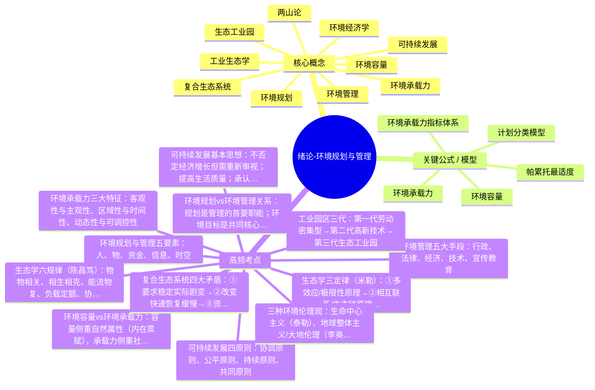

# 环境规划与管理 · 第 2 章 · 绪论-环境规划与管理 · 素材

> 教师: 王思雨 · 学期: 2026春
> 章下 PDF: 2 个 · 总页: 202
> 主版: 第 2 节 · 129 页

---

## 主版课件 · 第 2 节

> `002-part02-绪论-环境规划与管理.pdf`

<details><summary>展开 129 页图链</summary>

- [p001](../002-part02-绪论-环境规划与管理/page_001.jpg)  · 环境规划与管理
- [p002](../002-part02-绪论-环境规划与管理/page_002.jpg)  · 第一章
- [p003](../002-part02-绪论-环境规划与管理/page_003.jpg)  · 课前回顾
- [p004](../002-part02-绪论-环境规划与管理/page_004.jpg)  · 课前回顾
- [p005](../002-part02-绪论-环境规划与管理/page_005.jpg)  · 课前回顾
- [p006](../002-part02-绪论-环境规划与管理/page_006.jpg)  · 课前回顾
- [p007](../002-part02-绪论-环境规划与管理/page_007.jpg)  · 课前回顾
- [p008](../002-part02-绪论-环境规划与管理/page_008.jpg)  · 课前回顾
- [p009](../002-part02-绪论-环境规划与管理/page_009.jpg)  · 课前回顾
- [p010](../002-part02-绪论-环境规划与管理/page_010.jpg)  · 课前回顾
- [p011](../002-part02-绪论-环境规划与管理/page_011.jpg)  · 课前回顾
- [p012](../002-part02-绪论-环境规划与管理/page_012.jpg)  · 课前回顾
- [p013](../002-part02-绪论-环境规划与管理/page_013.jpg)  · 课前回顾
- [p014](../002-part02-绪论-环境规划与管理/page_014.jpg)  · 课前回顾
- [p015](../002-part02-绪论-环境规划与管理/page_015.jpg)  · 四环境规划与管理的理论基础
- [p016](../002-part02-绪论-环境规划与管理/page_016.jpg)  · 四环境规划与管理的理论基础
- [p017](../002-part02-绪论-环境规划与管理/page_017.jpg)  · 四环境规划与管理的理论基础
- [p018](../002-part02-绪论-环境规划与管理/page_018.jpg)  · 四五 环境规划与管理的理论基础
- [p019](../002-part02-绪论-环境规划与管理/page_019.jpg)  · 四环境规划与管理的理论基础
- [p020](../002-part02-绪论-环境规划与管理/page_020.jpg)  · 四 环境规划与管理的理论基础
- [p021](../002-part02-绪论-环境规划与管理/page_021.jpg)  · 四 环境规划与管理的理论基础
- [p022](../002-part02-绪论-环境规划与管理/page_022.jpg)  · 四 环境规划与管理的理论基础
- [p023](../002-part02-绪论-环境规划与管理/page_023.jpg)  · 四 环境规划与管理的理论基础
- [p024](../002-part02-绪论-环境规划与管理/page_024.jpg)  · 四环境规划与管理的理论基础
- [p025](../002-part02-绪论-环境规划与管理/page_025.jpg)  · 四环境规划与管理的理论基础
- [p026](../002-part02-绪论-环境规划与管理/page_026.jpg)  · 四环境规划与管理的理论基础
- [p027](../002-part02-绪论-环境规划与管理/page_027.jpg)  · 四 环境规划与管理的理论基础
- [p028](../002-part02-绪论-环境规划与管理/page_028.jpg)  · 四 环境规划与管理的理论基础
- [p029](../002-part02-绪论-环境规划与管理/page_029.jpg)  · 四 环境规划与管理的理论基础
- [p030](../002-part02-绪论-环境规划与管理/page_030.jpg)  · 四 环境规划与管理的理论基础
- [p031](../002-part02-绪论-环境规划与管理/page_031.jpg)  · 四环境规划与管理的理论基础
- [p032](../002-part02-绪论-环境规划与管理/page_032.jpg)  · 四环境规划与管理的理论基础
- [p033](../002-part02-绪论-环境规划与管理/page_033.jpg)  · 四 环境规划与管理的理论基础
- [p034](../002-part02-绪论-环境规划与管理/page_034.jpg)  · 四环境规划与管理的理论基础
- [p035](../002-part02-绪论-环境规划与管理/page_035.jpg)  · 四环境规划与管理的理论基础
- [p036](../002-part02-绪论-环境规划与管理/page_036.jpg)  · 四五 环境规划与管理的理论基础
- [p037](../002-part02-绪论-环境规划与管理/page_037.jpg)  · 四环境规划与管理的理论基础
- [p038](../002-part02-绪论-环境规划与管理/page_038.jpg)  · 四环境规划与管理的理论基础
- [p039](../002-part02-绪论-环境规划与管理/page_039.jpg)  · 四环境规划与管理的理论基础
- [p040](../002-part02-绪论-环境规划与管理/page_040.jpg)  · 四环境规划与管理的理论基础
- [p041](../002-part02-绪论-环境规划与管理/page_041.jpg)  · 四环境规划与管理的理论基础
- [p042](../002-part02-绪论-环境规划与管理/page_042.jpg)  · 四环境规划与管理的理论基础
- [p043](../002-part02-绪论-环境规划与管理/page_043.jpg)  · 四环境规划与管理的理论基础
- [p044](../002-part02-绪论-环境规划与管理/page_044.jpg)  · 四 环境规划与管理的理论基础
- [p045](../002-part02-绪论-环境规划与管理/page_045.jpg)  · 四 环境规划与管理的理论基础
- [p046](../002-part02-绪论-环境规划与管理/page_046.jpg)  · 四五 环境规划与管理的理论基础
- [p047](../002-part02-绪论-环境规划与管理/page_047.jpg)  · 四环境规划与管理的理论基础
- [p048](../002-part02-绪论-环境规划与管理/page_048.jpg)  · 四 环境规划与管理的理论基础
- [p049](../002-part02-绪论-环境规划与管理/page_049.jpg)  · 四环境规划与管理的理论基础
- [p050](../002-part02-绪论-环境规划与管理/page_050.jpg)  · 四环境规划与管理的理论基础
- [p051](../002-part02-绪论-环境规划与管理/page_051.jpg)  · 四环境规划与管理的理论基础
- [p052](../002-part02-绪论-环境规划与管理/page_052.jpg)  · 四环境规划与管理的理论基础
- [p053](../002-part02-绪论-环境规划与管理/page_053.jpg)  · 四环境规划与管理的理论基础
- [p054](../002-part02-绪论-环境规划与管理/page_054.jpg)  · 四环境规划与管理的理论基础
- [p055](../002-part02-绪论-环境规划与管理/page_055.jpg)  · 四环境规划与管理的理论基础
- [p056](../002-part02-绪论-环境规划与管理/page_056.jpg)  · 四 环境规划与管理的理论基础
- [p057](../002-part02-绪论-环境规划与管理/page_057.jpg)  · 四 环境规划与管理的理论基础
- [p058](../002-part02-绪论-环境规划与管理/page_058.jpg)  · 四环境规划与管理的理论基础
- [p059](../002-part02-绪论-环境规划与管理/page_059.jpg)  · 四环境规划与管理的理论基础
- [p060](../002-part02-绪论-环境规划与管理/page_060.jpg)  · 四 环境规划与管理的理论基础
- [p061](../002-part02-绪论-环境规划与管理/page_061.jpg)  · 四环境规划与管理的理论基础
- [p062](../002-part02-绪论-环境规划与管理/page_062.jpg)  · 四环境规划与管理的理论基础
- [p063](../002-part02-绪论-环境规划与管理/page_063.jpg)  · 八 环境规划与管理的理论基础
- [p064](../002-part02-绪论-环境规划与管理/page_064.jpg)  · 四环境规划与管理的理论基础
- [p065](../002-part02-绪论-环境规划与管理/page_065.jpg)  · 四 环境规划与管理的理论基础
- [p066](../002-part02-绪论-环境规划与管理/page_066.jpg)  · 四环境规划与管理的理论基础
- [p067](../002-part02-绪论-环境规划与管理/page_067.jpg)  · 四 环境规划与管理的理论基础
- [p068](../002-part02-绪论-环境规划与管理/page_068.jpg)  · 四环境规划与管理的理论基础
- [p069](../002-part02-绪论-环境规划与管理/page_069.jpg)  · 四 环境规划与管理的理论基础
- [p070](../002-part02-绪论-环境规划与管理/page_070.jpg)  · 四环境规划与管理的理论基础
- [p071](../002-part02-绪论-环境规划与管理/page_071.jpg)  · 四 环境规划与管理的理论基础
- [p072](../002-part02-绪论-环境规划与管理/page_072.jpg)  · 四 环境规划与管理的理论基础
- [p073](../002-part02-绪论-环境规划与管理/page_073.jpg)  · 四 环境规划与管理的理论基础
- [p074](../002-part02-绪论-环境规划与管理/page_074.jpg)  · 四 环境规划与管理的理论基础
- [p075](../002-part02-绪论-环境规划与管理/page_075.jpg)  · 四 环境规划与管理的理论基础
- [p076](../002-part02-绪论-环境规划与管理/page_076.jpg)  · 四环境规划与管理的理论基础
- [p077](../002-part02-绪论-环境规划与管理/page_077.jpg)  · 四 环境规划与管理的理论基础
- [p078](../002-part02-绪论-环境规划与管理/page_078.jpg)  · 四 环境规划与管理的理论基础
- [p079](../002-part02-绪论-环境规划与管理/page_079.jpg)  · 四环境规划与管理的理论基础
- [p080](../002-part02-绪论-环境规划与管理/page_080.jpg)  · 四环境规划与管理的理论基础
- [p081](../002-part02-绪论-环境规划与管理/page_081.jpg)  · 四 环境规划与管理的理论基础
- [p082](../002-part02-绪论-环境规划与管理/page_082.jpg)  · 四 环境规划与管理的理论基础
- [p083](../002-part02-绪论-环境规划与管理/page_083.jpg)  · 四 环境规划与管理的理论基础
- [p084](../002-part02-绪论-环境规划与管理/page_084.jpg)  · 四环境规划与管理的理论基础
- [p085](../002-part02-绪论-环境规划与管理/page_085.jpg)  · 环境规划与管理的理论基础
- [p086](../002-part02-绪论-环境规划与管理/page_086.jpg)  · 四环境规划与管理的理论基础
- [p087](../002-part02-绪论-环境规划与管理/page_087.jpg)  · 四 环境规划与管理的理论基础
- [p088](../002-part02-绪论-环境规划与管理/page_088.jpg)  · 四 环境规划与管理的理论基础
- [p089](../002-part02-绪论-环境规划与管理/page_089.jpg)  · 环境规划与管理的理论基础
- [p090](../002-part02-绪论-环境规划与管理/page_090.jpg)  · 四环境规划与管理的理论基础
- [p091](../002-part02-绪论-环境规划与管理/page_091.jpg)  · 四环境规划与管理的理论基础
- [p092](../002-part02-绪论-环境规划与管理/page_092.jpg)  · 四 环境规划与管理的理论基础
- [p093](../002-part02-绪论-环境规划与管理/page_093.jpg)  · 四环境规划与管理的理论基础
- [p094](../002-part02-绪论-环境规划与管理/page_094.jpg)  · 四环境规划与管理的理论基础
- [p095](../002-part02-绪论-环境规划与管理/page_095.jpg)  · 四 环境规划与管理的理论基础
- [p096](../002-part02-绪论-环境规划与管理/page_096.jpg)  · 四 环境规划与管理的理论基础
- [p097](../002-part02-绪论-环境规划与管理/page_097.jpg)  · 四环境规划与管理的理论基础
- [p098](../002-part02-绪论-环境规划与管理/page_098.jpg)  · 四环境规划与管理的理论基础
- [p099](../002-part02-绪论-环境规划与管理/page_099.jpg)  · 四环境规划与管理的理论基础
- [p100](../002-part02-绪论-环境规划与管理/page_100.jpg)  · 四 环境规划与管理的理论基础
- [p101](../002-part02-绪论-环境规划与管理/page_101.jpg)  · 四 环境规划与管理的理论基础
- [p102](../002-part02-绪论-环境规划与管理/page_102.jpg)  · 四 环境规划与管理的理论基础
- [p103](../002-part02-绪论-环境规划与管理/page_103.jpg)  · 四环境规划与管理的理论基础
- [p104](../002-part02-绪论-环境规划与管理/page_104.jpg)  · 四环境规划与管理的理论基础
- [p105](../002-part02-绪论-环境规划与管理/page_105.jpg)  · 四环境规划与管理的理论基础
- [p106](../002-part02-绪论-环境规划与管理/page_106.jpg)  · 四环境规划与管理的理论基础
- [p107](../002-part02-绪论-环境规划与管理/page_107.jpg)  · 四环境规划与管理的理论基础
- [p108](../002-part02-绪论-环境规划与管理/page_108.jpg)  · 四环境规划与管理的理论基础
- [p109](../002-part02-绪论-环境规划与管理/page_109.jpg)  · 四环境规划与管理的理论基础
- [p110](../002-part02-绪论-环境规划与管理/page_110.jpg)  · 四环境规划与管理的理论基础
- [p111](../002-part02-绪论-环境规划与管理/page_111.jpg)  · 四环境规划与管理的理论基础
- [p112](../002-part02-绪论-环境规划与管理/page_112.jpg)  · 四环境规划与管理的理论基础
- [p113](../002-part02-绪论-环境规划与管理/page_113.jpg)  · 四环境规划与管理的理论基础
- [p114](../002-part02-绪论-环境规划与管理/page_114.jpg)  · 四环境规划与管理的理论基础
- [p115](../002-part02-绪论-环境规划与管理/page_115.jpg)  · 四环境规划与管理的理论基础
- [p116](../002-part02-绪论-环境规划与管理/page_116.jpg)  · 四 环境规划与管理的理论基础
- [p117](../002-part02-绪论-环境规划与管理/page_117.jpg)  · 四环境规划与管理的理论基础
- [p118](../002-part02-绪论-环境规划与管理/page_118.jpg)  · 环境规划与管理的理论基础
- [p119](../002-part02-绪论-环境规划与管理/page_119.jpg)  · 四环境规划与管理的理论基础
- [p120](../002-part02-绪论-环境规划与管理/page_120.jpg)  · 四环境规划与管理的理论基础
- [p121](../002-part02-绪论-环境规划与管理/page_121.jpg)  · 四环境规划与管理的理论基础
- [p122](../002-part02-绪论-环境规划与管理/page_122.jpg)  · 四 环境规划与管理的理论基础
- [p123](../002-part02-绪论-环境规划与管理/page_123.jpg)  · 四 环境规划与管理的理论基础
- [p124](../002-part02-绪论-环境规划与管理/page_124.jpg)  · 四环境规划与管理的理论基础
- [p125](../002-part02-绪论-环境规划与管理/page_125.jpg)  · 四环境规划与管理的理论基础
- [p126](../002-part02-绪论-环境规划与管理/page_126.jpg)  · 四环境规划与管理的理论基础
- [p127](../002-part02-绪论-环境规划与管理/page_127.jpg)  · 四环境规划与管理的理论基础
- [p128](../002-part02-绪论-环境规划与管理/page_128.jpg)  · 四环境规划与管理的理论基础
- [p129](../002-part02-绪论-环境规划与管理/page_129.jpg)  · 四环境规划与管理的理论基础

</details>

<details><summary>展开 129 页图文对照（每图配其识别文本）</summary>

**p001** 

环境规划与管理
授课教师：王思雨副教授
联系方式：
eswangsiyu@hotmail.com
办公地点：生态与环境学院208办公室

---

**p002** 

第一章
概述
第一节 环境规划与管理的基本概念
第二节 环境规划与管理的产生和发展
第三节 环境规划与管理的对象和内容
第四节 环境规划与管理的理论基础

---

**p003** 

课前回顾

---

**p004** 

课前回顾
1.环境管理的含义
根据国内外学者的研究成果，要比较全面地理解环境管理的含义，应
该意以下几个基本问题：
第一，协调发展与环境的关系。
第二，动用各种手段限制人类损害环境质量的行为。
第三，环境管理是跨学科领域的新兴综合学科。
第四，环境管理和任何管理活动一样，也是一个动态过程。
第五，环境管理需要各国采取协调合作的行动。

---

**p005** 

课前回顾
2.环境规划的含义
》环境规划是国民经济和社会发展的有机组成部分，是环境管理的首要职
能，是环境决策在时间、空间上的具体安排，是规划管理者对一定时期
内环境保护目标和措施作出的具体规定，是一种带有指令性的环境保护
方案。
》环境规划的目的是在发展经济的同时保护环境，使经济与社会协调发展。
>环境规划的实质是一种克服人类经济社会活动和环境保护活动盲目和主
观随意性的科学决策活动。

---

**p006** 

课前回顾
3.环境规划与管理的对象
1.现代系统管理的“五要素论”
>对于环境规划与管理，其研究对象也应包括人、物、资
金、信息和时空5个方面：
(1）人是第一个主要对象。
(2）物也是重要研究对象。

---

**p007** 

课前回顾
3.环境规划与管理的对象
（3）资金是系统赖以实现其目标的重要物质基础，也是规
划与管理的研究对象。
（4）信息是系统的“神经”，信息也是规划与管理的重要
对象。
（5）任何管理活动都是在一定的时空条件下进行的，环境
规划与管理的一个突出特点是时空特性日益突出，则时
空条件亦应成为重要的研究对象。

---

**p008** 

课前回顾
4. 环境规划与管理的手段
1.行政手段
根据国家行政法规所赋予的组织和指挥权力，对环境资源
保护工作实施规划与管理
2.法律手段
是环境规划与管理的一种强制性手段
3.经济手段
是指利用价值规律，运用价格、税收、信贷等经济杠杆，
充分发挥价值规律在环境管理过程的杠杆作用。

---

**p009** 

课前回顾
4.技术手段
指借助那些既能提高生产率，又能把对环境污染和生态破坏
控制到最小限度的工艺技术以及先进的污染治理技术等来达
到保护环境目标的手段。
5.宣传教育手段
是环境管理不可缺少的手段。环境宣传既是普及环境科学知
识，又是一种思想动员。

---

**p010** 

课前回顾
5.环境管理与环境规划的关系
规划职能是环境管理的首要职能。
2） 环境目标是环境规划与环境管理的共同核心。
(3) 环境规划与管理具有共同的理论基础。

---

**p011** 

课前回顾
6.环境规划与管理的目的
环境规划与管理的根本目的就是通过对可持续发展思想的传播，使人类社会
的组织形式、运行机制以至管理部门和生产部门的决策、计划和个人的日
常生活等各种活动，符合人与自然和谐相处的原则，并以制度、法律、体
制和观念的形式体现出来，创建一种可持续的发展模式和消费模式

---

**p012** 

课前回顾
7.环境规划与管理的任务
环境管理的基本任务应该是：转变人类社会的基本观念和
调整人类社会的行为。
环境文化的建设是环境规划与管理的一项长期的根本的任
务。文化决定着人类的行为，只有转变了过去那种视环境
为征服对象的文化，才能从根本上去解决环境问题。

---

**p013** 

课前回顾
人类的社会行为分为政府行为、市场行为和公众行为三种。
》政府行为是总的国家的管理行为，诸如制定政策、法律、法令、发
展计划并组织实施等；
>市场行为是指各种市场主体包括企业和生产者个人在市场规律的支
配下，进行商品生产和交换的行为；
》公众行为则是指公众在日常生活中诸如消费、休闲和旅游等方面的
行为。
>这三种行为都可能会对环境产生不同程度的影响。

---

**p014** 

课前回顾
8.环境规划与管理的作用
1.促进环境与经济、社会可持续发展
2.保障环境保护活动纳入国民经济和社会发展计划
3.实施环境政策、法规和制度的主要途径
4.实现以较小的投资获取较佳的环境效益

---

**p015** 

四环境规划与管理的理论基础
生态文明建设之生态学理论
生态文明建设之可持续发展原理
生态文明建设之“两山论”原理
生态文明建设之环境经济学原理
生态文明建设之系统论原理
生态文明建设之管理二重性原理

---

**p016** 

四环境规划与管理的理论基础
（2）计划类型
由于人类活动的复杂性与多元性，计划的种类也十分复杂和多样。人
们根据不同的背景、不同的需要编制出各种各样的计划，常见的分类
方法见图表。
分类原则 计划种类 分类原则 计划种类
长期计划 政策
按计划的时间界限划分 中期计划 按计划的范围划分 程序
短期计划 方法
战略计划
按计划的约束力划 指令性计划
按计划制定者层次划分 管理计划
分 指导性计划
作业计划
经济发展计划
综合计划
按计划的对象划分 环境保护计划
局部计划 按计划的性质划分
土地利用计划
项目计划 其他

---

**p017** 

四环境规划与管理的理论基础
美国环境学家米勒总结的生态学三定律是：
生态学第一定律：任何行动都不是孤立的，对自然界的
任何侵犯都具有无数效应，其中许多效应是不可逆的。该定
律为哈定所提出，可称之为多效应原理或极限性原理；
生态学第二定律：每一种事物无不与其他事物相互联系
和相互交融。此定律可称为相互联系原理或生态链原理；
生态学第三定律：我们生产的任何物质均不应对地球上
自然的生物地球化循环有任何干扰。此定律可称之为勿干扰
原理或生物多样性原理

---

**p018** 

四五 环境规划与管理的理论基础
我国生态学家马世骏先生提出了生态学五规律：相互制约和相
互依赖的互生规律、相互补偿和相互协调的共生规律、物质循环转
化的再生规律、相互适应与选择的协同化规律和物质输入输出的平
衡规律。
陈昌笃提出了六条生态学一般规律：物物相关、相生相克、能
流物复、负载定额、协调稳定和时空有宜。

---

**p019** 

四环境规划与管理的理论基础
2012年11月，党的十八大从新的历史起点出发，做出“大力推
进生态文明建设”的战略决策，从10个方面绘出生态文明建设的宏伟
蓝图。建设生态文明，是关系人民福祉、关乎民族未来的长远大计。
面对资源约束趋紧、环境污染严重、生态系统退化的严峻形势，必
须树立尊重自然、顺应自然、保护自然的生态文明理念，把生态文
明建设放在突出地位，融入经济建设、政治建设、文化建设、社会
建设各方面和全过程，努力建设美丽中国，实现中华民族永续发展。

---

**p020** 

四 环境规划与管理的理论基础
生态系统的极限性原理：
生态环境系统中的一切资源都是有限的，对于污染
和破坏带来的影响，生态环境系统也只有一定限度
的承受能力。
如果超过这个限度，就会使自然系统失去平衡稳定
的能力，引起质量上的衰退，并造成严重的后果。
人类对环境资源的开发利用，必须维持自然资源的
再生功能和环境质量的恢复能力，不充许超过生物
圈的承载能力或容许极限。
环境容量和环境承载力：
在进行环境规划与管理时，根据极限性原理，对生态
环境系统中各因素（水、气、土地等）的功能限度进
行定义。

---

**p021** 

四 环境规划与管理的理论基础
1、环境容量
环境容量是一个复杂的反映环境净化能力的量，其
数值应能表征污染物在环境中的物理、化学变化及空
间机械运动的性质。
《环境科学大辞典》
某环境单元给定环境功能区目标和环境质量目标下
所充许承纳的污染物质的最大数量
环境容量是反映生态平衡规律，污染物在自然环境
中的迁移转化规律，以及生物与生态环境之间的物
质能量交换规律的综合性指标
环境容量是自然生态环境的基本属性之一，由自然
生态环境特征和污染物质特征共同决定。

---

**p022** 

四 环境规划与管理的理论基础
1、环境容量
环境容量值大小，与该环境单元本身的组成和结构
有关，其变化具有明显的地带性规律和地区性差异
环境容量的准确测量需要较长的研究、监测时间，
在实际应用中通常采用简化的计算方式。
M=K+R
基本环境容量 可变环境容量
/稀释容量 /自净容量
由于环境容量的自净机制，可用环境浓度标准值与
背景值之差，通过一定的输入输出关系转换成排放量，
即以污染物的充许排放量作为环境容量。

---

**p023** 

四 环境规划与管理的理论基础
1、环境容量
M=K+R
基本环境容量 可变环境容量
/稀释容量 /自净容量
例如：水环境容量
稀释容量：在给定水域的来水污染物浓度高于
出水水质目标时，依靠稀释作用达到水质目标
自净 所能承纳的污染物量
K 自净容量：由于沉降、生化、吸附等物理、化
稀释 学和生物作用，给定水域达到水质目标所能自
净的污染物量

---

**p024** 

四环境规划与管理的理论基础
1、环境容量
环境容量是一种环境资源，但随着社会的快速发展
绝大部分地区的环境容量已经很小，许多地区污染排
放量已经远远超过环境容量允许的排放量。
基于环境容量进行区域污染物排放总量控制是目前较
为通用的方法
基于总量控制的城市环境整治规划的模式：
根据污染源调查结果和已制定的社会经济发展规划，
调用各种模型预测未来的环境质量；
根据预测结果和已制定的环境目标，通过浓度、排
放量转换关系计算环境容量；
根据环境容量和污染物总削减量，最后得到综合治
理方案。

---

**p025** 

四环境规划与管理的理论基础
1、环境容量
1996年7月，第四次全国环境保护会议提出《国家环境保护“九五”计
划和2010年远景目标》，明确“实施污染物排放总量控制计划”。
1998年，《全国环境保护工作（1998-2002）纲要》，提出了“一控
双达标” 全国主要污染物实施总量控制。
2002年1月，《国家环境保护“十五”计划》，明确了“十五”期间努
力完成控制污染物排放总量等三大任务。
十一五环境保护规划：到2010年，二氧化硫和化学需氧量排放得到控
制，重点地区和城市的环境质量有所改善，生态环境恶化趋势基本遏制。
十二五环境保护规划：到2015年，主要污染物排放总量显著减少：城
乡饮用水水源地环境安全得到有效保障，水质大幅提高；重金属污染得
到有效控制，持久性有机污染物、危险化学品、危险废物等污染防治成
效明显；城镇环境基础设施建设和运行水平得到提升。

---

**p026** 

四环境规划与管理的理论基础
1、环境容量
环境容量应是一个系统性的、与人类社会行为息息
相关的动态变化量。环境容量的概念表述了环境容纳
污染物的能力，但这只是环境功能的一部分。
除此之外，环境还为人类提供了生存和发展所必需
的资源、能源，为人类提供各种精神财富和文化载体。
环境对人类社会的支持作用远大于环境容量
这一概念的内涵。

---

**p027** 

四 环境规划与管理的理论基础
2、环境承载力
环境承载力：
是指不破坏自然环境的情况下，自然环境能够承载和
支撑的人类社会活动的强度和总量
环境承载力原理：
只有将人类社会各种生存和发展的活动的强度和总量，
控制在自然环境的承载力范围之内，才能认为这种生存
与发展活动才具有可持续性。环境承载力是判断一项人
类活动是否对自然环境构成威胁或破坏的基本标准。

---

**p028** 

四 环境规划与管理的理论基础
2、环境承载力
环境承载力是一个最低标准，是人类活动不能超过的
界限，一旦超过这个界面，自然环境系统将发生不可
逆转的破坏，进而对人类的健康生存和发展构成危害。
科学地确定一个地区、城市
的环境承载力，确定人类活
动的环境限制底线，是环境
管理最重要的基础工作之一

---

**p029** 

四 环境规划与管理的理论基础
2、环境承载力
环境承载力是环境系统固有功能的表现，它不仅与环
境系统本身的结构有关，还与外界（人类社会经济活
动）的输入输出有关。
环境承载力的描述
EBC = f(T,S,B)。 人类经济行为
的规模与方向
时间 空间

---

**p030** 

四 环境规划与管理的理论基础
2、环境承载力
人类积极的环保行为可在一定程度上提高环境承载
力。如人类通过优化自己的活动，可以提高某一区
域的环境承载力，使其承载更多的人口和发展活动。
人类可以通过修建污水处理厂，
废弃物处理中心、绿色造林等
生态环境保护和建设产业，进
一步提高环境承载力。这是人
类环境管理行为合理性的依据

---

**p031** 

四环境规划与管理的理论基础
2、环境承载力
环境承载力指标体系
环境系统与人类社会经济系统：物质、能量和信息的代谢，可以分为三部分指标：
资源供给指标。如水资源、土地资源和生物资源的数量、质量和开发利用程度；
社会影响指标。如经济总量、污染治理投资、公用设施水平和人口密度等；
污染容纳指标。如污染物的排放量、绿化状况和污染物净化能力等。
通过环境承载力指标体系，可以间接量化表达某一区域的环境承载量和环境承载力。

---

**p032** 

四环境规划与管理的理论基础
2、环境承载力
环境承载力的特征
客观性和主观性：客观性体现在一定时期和状态下的环境承载力
是客观存在的，是可以衡量和评价的；主观性体现在人们对环境
承载里的评价分析具有主观性。
区域性和时间性：指不同时期、不同区域的环境承载力是不同的，
相应的评价指标的选取和量化评价方法也应有所不同。
动态性和可调控性：指其大小是随着时间、空间和生产力水平的
变化而变化的。人类可以通过改变经济增长方式、提高技术水平
等手段来提高区域环境承载力，使其向有利于人类的方向发展。

---

**p033** 

四 环境规划与管理的理论基础
环境容量与环境承载力的区别与联系
环境容量 环境承载力
区别
是自然生态环境的基本属性之一 既不是纯粹描述自然环境特征的量
也不是一个描述人类社会的量
侧重反映环境系统的自然属性，即内 侧重体现和反映环境系统的社会属性，
在的自然票赋和性质 即外在的社会票赋和性质
联系
在科学技术和社会关系发展的一定阶 一定时期、一定状态下的环境承载力
段，环境容量具有相对的确定性、有 也是有限的，但可以通过人类环境保
限性 护行为动态的、可调控的

---

**p034** 

四环境规划与管理的理论基础
生态系统的生态链原理
所谓生态链原理系指按照生态学第二定律“每一种
事物无不与其他事物相互联系和相互交融”的原理，模
仿生态系统物质循环和能量流动的规律重构工业（产业）
系统，推行循环经济模式，研究现代工业系统运行机制
的耦合思想，是环境规划与管理的重要理论基础。
1.工业生态学
2.生态工业园

---

**p035** 

四环境规划与管理的理论基础
1、工业生态学
（1）工业生态学的定义
工业生态学是”人类在经济、文化和技术不断发展的前提下，
有目的、合理地去探索和维护可持续发展的方法”，“要求不是孤立而
是协调地看待产业系统与其周围环境的关系”。
工业生态学又称产业生态学，是一门研究社会生产活动中自然
资源从源、流到汇的全代谢过程、组织管理体制以及生产、消费、调
控行为的动力学机制、控制论方法及其与生命支持系统相互关系的系
统科学。

---

**p036** 

四五 环境规划与管理的理论基础
工业生态学实践者界定的工业的外延非常广泛，涵盖了人类的各种活动，
其研究范围不仅仅局限在一个企业的围墙之内，而是扩展到人类生存和活动
对地球造成的各种影响，包括社会对资源的利用，成为循环经济理论产生的
基础。它认为工业系统中的物质、能源、信息的流动和储存不是孤立的简单
叠加关系，而是像自然生态系统那样可以循环运行，他们之间相互依赖、相
互作用、相互影响，形成复杂的、相互连接的网络系统。

---

**p037** 

四环境规划与管理的理论基础
工业生态学的思想包含了”从摇篮到坟墓”的全过程管理系统观，即在产
品的整个生命周期内不应对环境和生态系统造成危害，产品生命周期包括原
材料采掘、原材料生产、产品制造、产品使用以及产品用后处理。工业代谢
分析和生命周期评价是目前工业生态学中普遍使用的有效方法。
工业生态学以生态学的理论观点考察工业代谢过程，亦即从取自环境到
返回环境的物质转化全过程，研究工业活动和生态环境的相互关系，以研究
调整、改进当前工业生态链结构的原则和方法，建立新的物质闭路循环，使
工业生态系统与生物圈兼容并持久生存下去。

---

**p038** 

四环境规划与管理的理论基础
（2）特征及趋势
工业生态学领域开始社群化，目前已经出现了专注于物质流
分析的分会和专注于生态工业发展的分会两大子群。发达国家占
据工业生态学领域的主导地位，且欧、美、日三足鼎立的格局日
益明显。其中，美国强于概念体系、理论构建和全球视野，欧洲
强于大项自主导和系统实践，日本则精于刻画并看眼于亚洲视角。
工业生态学的理论基础和学科体系仍然比较模糊，社会物质代谢
和生态工业发展成为学科的主体构成，但前者偏于还原视角，后
者理论建构不足。生态工业园区、城市代谢、节能减排与气候变
化等都成为了工业生态学应用的热点领域，

---

**p039** 

四环境规划与管理的理论基础
2、生态工业园
生态工业园是建立在一块固定地域上的由制造企业和服务企
业形成的企业社区。在该社区内，各成员单位通过物流或能流传
递等方式把不同工厂或企业连接起来，形成共享资源和互换副产
品的产业共生组合，使一家工厂的废弃物或副产品成为另一家工
厂的原料或能源，模拟自然系统，在产业系统中建立”生产者一消
费者一分解者”的循环途径。并通过共同管理环境事宜和经济事宜
来获取更大的环境效益、经济效益和社会效益。整个企业社区能
获得比单个企业通过个体行为的最优化所能获得的效益之和更大
的效益。

---

**p040** 

四环境规划与管理的理论基础
（2）生态工业园的建设实践
一般认为，生态工业园的形是工业共生体，丹麦的卡伦堡共生
体就是工业共生体的成功典范。卡伦堡生态工业园是世界上最早
也是最著名的生态工业园，其主体企业是发电厂、炼油厂、制药
厂、石膏板生产厂。以这4个企业为核心，通过贸易方式利用对方
生产过程中产生的废弃物和副产品，不仅减少了废物产生量和处
理的费用，还产生了较好的经济效益，形成了经济发展与环境保
护的良性循环。这是生态工业园发展的形，也是工业生态学的
第一次实践。

---

**p041** 

四环境规划与管理的理论基础
美国是世界上最为积极投身于生态工业园规划和建设的国家。
在1994年，总统可持续发展理事会指定了4个社区作为生态工业
园区的示范点，即马里兰州的巴尔的摩、弗吉尼亚州的查尔斯、
德克萨斯州的布郎斯和田纳西州的恰塔努加。美国的生态工业园，
涉及生物能源开发、废物处理、清洁工业、固体和液体废物的再
循环等多种行业多个层次，并且各具特色。

---

**p042** 

四环境规划与管理的理论基础
我国的工业园区发展经历了三个阶段，其中第一代园区内主
要以劳动密集型的”三来一补“型企业为主，技术含量低；第二代
园区的企业以高新技术应用为特征；第三代园区则是生态工业园，
其基本功能是解决经济、环境和社会三者协调发展问题。
2001年8月，我国第一个国家级生态工业示范园区一广西贵
港国家生态工业（制糖）示范园区由原国家环保总局授牌建设。之后，
辽宁、江苏、山东、天津、新疆、内蒙古、注江、广东等省、直
辖市、自治区分别开展了生态工业园区建设的试点，试点不仅覆
盖制糖、造纸、化工、水泥、冶金等传统行业，也有电子、环保、
汽车、生物化工等高科技行业

---

**p043** 

四环境规划与管理的理论基础
2003年12月国家环保总局把生态工业示范园区（生态工业园
区）定义为依据清洁生产要求、循环经济理念和工业生态学原理
而设计建立的一种新型工业园区。它通过物流或能流传递等方式
把不同工厂或企业连接起来，形成共享资源和互换副产品的产业
共生组合，使一家工厂的废弃物或副产品成为另一家工厂的原料
或能源，模拟自然系统，在产业系统中建立“生产者一消费者一分
解者”的循环途径。

---

**p044** 

四 环境规划与管理的理论基础
生物多样性原理 一与自然和谐相处的环境伦理观
1、生命中心主义
·生命中心主义的代表人物之一保罗?泰勒在《尊重自然》一
书中写到：“采取尊重自然的态度，就是把地球自然生态
系统中的野生动物看做是具有固有价值的东西。“根据他
的意见，所谓”尊重自然”就是尊重”作为整体的生物共同
体”，而尊重”生物共同体”就是承认构成共同体的每个动
植物体的”固有的价值”。并认为，人类不是万物的中心，
所有生命都应该受到尊重

---

**p045** 

四 环境规划与管理的理论基础
提出生命中心主义的环境伦理观，
其目的是为了保护野生的动物，
避免被人类伤害。由于人类在组
成社会、进行生产和发展文化的
过程中，已经具备了其他生物无
与伦比的力量和优势，因此，只
有从价值观上肯定野生动植物也
像人一样具有它不可剥夺的“权
利”与“价值”，才能避免人类对
自然生物的进一步伤害，并使人
类承担起对自然的伦理责任。

---

**p046** 

四五 环境规划与管理的理论基础
2、地球整体主义
李奥波德提出”大地伦理”，是指”规范人与大地以及人与依存
于大地的动植物之间关系的伦理规则”，其基本主张是要将人
“从大地这一共同体的征服者转变成为这一共同体的平凡一员、
一个构成要素”。
“大地伦理”的特征是将”共同体”的概念从以往伦理学所研究的
人类社会共同体的关系扩展到了大地。这里”大地”包括土壤、
水、植物、动物等，其实是整个自然生态系统。

---

**p047** 

四环境规划与管理的理论基础
3、代际均等的环境伦理观
与生命中心主义及地球整体主义不同，持这种观点的人的立场
是以人类为中心的。
它只考虑人类各成员的均等，而将自然环境和其他生命有机体
看做是人类均等义务，最终都源于我们人类各成员相互间所应
承担的义务。
·这一伦理观不同于传统的伦理观之处，是它把人类各成员间的平
等关系从“代内”扩展到”代际”，认为在享有自然资源与拥有良好
的环境上，我们的子孙后代与我们当代人具有同等的权利。

---

**p048** 

四 环境规划与管理的理论基础
阅读材料一生物多样性
①什么是生物多样性？
生物多样性（biologicaldiversity）是指地球上的生物（包括
动物、植物、微生物）在所有形式、层次和联合体中生命的多样
化，包括生态系统多样性、物种多样性和基因多样性。生物多
样性是地球上生命经过几十亿年发展进化的结果，是人类赖以
生存的物质基础。

---

**p049** 

四环境规划与管理的理论基础
如果你学过生物学，你会知道这是一种研究有生命的物体的学科，
从研究最微小的生命组成部分，到植物和动物。而”多样性”简单来说
就是”各种各样”的意思。生物多样性包括所有自然世界的资源，包括
植物、动物、昆虫、微生物和它们生存的生态系统。它同样包括构造
出生命的重要基石一一染色体、基因和脱氧核糖核酸。
你也是生物多样性的一部分。生物多样性使生命在这个行星上变
得可能。没有生物多样性，你也不能在这个行星上生存。就算你可以
生存下来，你也不可能喜欢这个灰暗的、无生气的、光秃秃的、无聊
的世界。没有生物多样性，你不会感受到树林带给你的绿意、海洋带
给你的蓝色，也不会有你呼吸的空气、吃的食物、喝的水。

---

**p050** 

四环境规划与管理的理论基础
②为什么生物多样性如此重要？
生物多样性带给我们无尽美丽的自然世界。生物多样性可以帮
助清洁我们呼吸的空气以及喝的水。人类还利用生物多样性得到了
所需的全部食品、许多药物和工业原料。物种为人类提供了食物的
来源，作为人类基本食物的农作物、家禽和家畜等均源自野生物种。
野生物种是培育新品种不可缺少的原材料，特别是随着近代遗传工
程的兴起和发展，物种的保存有着更深远的意义。物种是多种药物
的来源，随着医学研究的深入，越来越多的物种被发现可作药用。

---

**p051** 

四环境规划与管理的理论基础
以上的例子是人们所熟知的直接价值，而间接价值也非同小可：
物种多样性对科学技术的发展是不可或缺的。仿生学的发展离不开丰富
而奇异的生物世界。生物多样性是维持生态系统相对平衡的必要条件，某（些）
物种的消亡可能引起整个系统失衡甚至崩溃。
生物多样性的间接价值主要与其功能有关：固定太阳能、调节水文、防
止水土流失、调节气候、吸收分解污染物、贮存营养元素并促进养分循环和
维持进化过程等方面都与生物多样性间接相关。许多自前认为无足轻重的物
种，可能有着重要的价值。

---

**p052** 

四环境规划与管理的理论基础
③生物多样性现在的状况如何？
地球上的生物种类非常丰富，自前科学家们估计现存的生物物
种数量在870万种左右，其中包括777万种动物、29.8万种植物、
61.1万种真菌、3.64万种原生动物和2.75万种藻类等。然而，这只
是一个估计值，实际的物种数量可能会更多。不过经人类研究和加
以利用的只是其中的一小部分。很多物种还没来得及定名就已灭绝。
据估计，全球原始森林的面积仅占地球表面的2%左右。需要注
意的是，原始森林的面积正在不断缩小，这对生物多样性和生态系
统造成了严重威胁。无数的动植物在人类还没认识它们之前就随着
原始森林的砍伐、污染、围湖填海等原因提前从地球上消失了。

---

**p053** 

四环境规划与管理的理论基础
不同类型的生态系统面积锐减，无法再现的基因、物种和生态系统正
以前所未有的速度消失。如果不立即采取有效措施，人类将面临能否继续
以其固有方式生活的挑战。生物多样性的研究、保护和持续合理利用待
加强，刻不容缓。
1994年12月29日，联合国大会49/119号决议案宣布12月29日为“国
际生物多样性日”。从2001年起，根据第55届联合国大会第201号决议，
国际生物多样性日由原来的每年12月29日改为5月22日。这个国际纪念日
的确立，说明生物多样性问题已经引起各国政府的广泛关注。生物多样性
保护与持续利用已成为人类与环境领域的中心议题。

---

**p054** 

四环境规划与管理的理论基础
④中国采取了哪些措施？
中国是生物多样性特别丰富的国家，以高等植物为例，中国约有3万
种，美国约1.8万种，整个欧洲仅1.2万种。
由于中国是人口最多的国家，对生物多样性具有很大的依赖性。中国
经济的高速发展和庞大的人口压力给生物多样性造成很大影响，致使中国
成为生物多样性受到严重威胁的国家。在《濒危野生动植物种国际贸易公
约》列出的640个世界性濒危物种中，中国就占了约25%，共156种，形
势十分严峻。

---

**p055** 

四环境规划与管理的理论基础
截止到1995年末，全国已建成各级各类自然保护区799处，面
积达7185万hm2，约占国土面积的7.48%，其中10处自然保护区
加入”人与生物圈保护网络”，6处被列入《国际重要湿地名录》。到
1995年底，全国建立珍稀濒危物种繁育基地200多处，国家濒危物
种进出口管理中心在全国主要口岸城市设立了17个办事处。
同时还组织实施了对大熊猫、朱、扬子鳄、海南坡鹿、野马、
麋鹿、高鼻羚羊的”七大拯救工程”。
面对全国范围内的生物物种危机，这些努力无疑是远远不够的，
还需要全体国民的重视和对物种栖息地的持续改善

---

**p056** 

四 环境规划与管理的理论基础
我们可以做些什么？
作为普通公民，我们能为生物
多样性保护做些什么呢？
最显而易见的是反对、监督、
制止偷猎、采摘珍稀野生动植物的
行为，让野生动植物远离我们的餐
桌。穿着野生动物皮毛服装也是我
们反对的行为。同时，在发展生产
的同时，尽可能保护野生动植物的
栖息地。

---

**p057** 

四 环境规划与管理的理论基础
生态文明建设之可持续发展理论
一、可持续发展的定义
二、可持续发展的原则
三、可持续发展研究的主要内容

---

**p058** 

四环境规划与管理的理论基础
1、可持续发展的定义
1987年，在《我们共同的未来》报告中正式使用了“可持续发
展”的概念，即”既能满足当代人的需要，又不对后代人满足其需要
的能力构成危害的发展”。
1992年6月联合国环境与发展会议通过了以可持续发展为核心
的《里约环境与发展宣言》和《21世纪议程》等重要文件。
1994年3月，国务院第16次常务会议讨论通过了《中国21世纪
议程-中国21世纪人口、环境与发展白皮书》，首次把可持续发展战
略纳入我国经济和社会发展的长远规划。
1997年把可持续发展战略确定为我国”现代化建设中必须实施
的战略，与科教兴国战略一起被确定为中国走向21世纪的两大国家
战略

---

**p059** 

四环境规划与管理的理论基础
可持续发展包含需要和限制两层含义，需要是指世界各国人们
的基本需要，应将此放在特别优先的地位来考虑；限制是指当前的
技术状况和社会组织对环境满足现在和将来需要的能力施加的限制
可持续发展理论的形成是以唯物史观为基础的，其直接目的是
解决生态恶化的困境，寻求克服传统发展模式对生态环境产生负面
影响的有效途径。可持续发展理论强调把环境保护作为发展进程的
一个重要组成部分，作为衡量发展质量、发展水平和发展程度的客
观标准之一。注重环境与经济的协调，人与自然的和谐，认为健康
的经济发展应建立在生态可持续、社会公正和人民积极参与自身发
展决策的基础上。

---

**p060** 

四 环境规划与管理的理论基础
2、可持续发展的原则
1.协调原则：社会、经济、环境。
2.公平原则：自然资源、社会财富
3.持续原则：当前利益、长远利益
4.共同原则：协调、公平、持续。

---

**p061** 

四环境规划与管理的理论基础
3、可持续发展的主要内容
1.环境保护与可持续发展
环境保护是可持续发展的重要方面；可持续发展的核心是发
展，但要求在严格控制人口、提高人口素质和保护环境、资
源永续利用的前提下进行经济和社会的发展。环境保护是区
分可持续发展与传统发展的分水岭和试金石
现代发展不仅满足于物质和精神消费，还把建设舒适、安全、
清洁、优美的环境作为实现的重要目标。可持续发展把环境
保护作为衡量发展质量、发展水平和发展程度的客观标准之

---

**p062** 

四环境规划与管理的理论基础
可持续发展要求加快环保新技术研制和普及，只有大量使用
先进科技才能使单位生产量的能耗、物耗大幅度下降，减轻
环境的污染负荷。环境保护是可持续发展进程的一个部分，
可持续发展非常重视环境保护，把环境保护作为它积极追求
实现的最基本的目的之一。
可持续发展一方面要求人们在生产时少投入，多产出；另一
方面要求人们消费时尽可能多利用，少排放。因此，我们必
须纠正过去单纯靠增加投入、加大消耗实现发展和以牺牲环
境来增加产出的做法，从而使发展更少的依赖有限的资源，
更多的与环境容量有机的协调

---

**p063** 

八 环境规划与管理的理论基础
2.经济与可持续发展
人类要走可持续发展之路，经济系统的生态化是必由之路。
经济生态化核心是经济系统向自然生态系统有选择性的学习
重新定位经济系统，保持经济系统索取和资源环境供给之间
协调，经济系统废弃物排放和环境承载力协调。
构建循环型经济，更是可持续发展的工具和钥匙。

---

**p064** 

四环境规划与管理的理论基础
3.社会与可持续发展
对人口资源的正确估计是可持续发展战略考虑的前提
之一。要考虑人口的绝对数量与粮食问题、人口老化
及养老保障、城市化带来的农业人口过剩、妇女问题
和社会分工、人口素质、教育和社会结构的完善、人
口信息的开发与利用及家庭结构问题。另外灾害防治
和环境法制的研究也是可持续发展的重要方面。

---

**p065** 

四 环境规划与管理的理论基础
社会发展要和谐发展，和谐发展的核心是科学发展观，即”坚持以
人为本，树立全面、协调、可持续的发展观，促进经济社会和人
的全面发展”和”统筹城乡发展、统筹区域发展、统筹经济社会发
展、统筹人与自然发展、统筹国内发展与对外开放的要求”。和谐
发展强调”各明其位”、“各得其所”和“各尽所能”。

---

**p066** 

四环境规划与管理的理论基础
4.区域的可持续发展
区域可持续发展的核心就是经济增长点。
首先其规模应相对地大，才能产生充分的直接效应和间接效
应;
其次，应当是增长最快的产业和地区；
第三，应同其他产业部门之间具有高强度的投入产出关系，
能够是增长效应被传递分散；
第四，它应是创新的”朝阳式”产业或企业。新经济增长点
的作用已被中国经济发展的实际所证实。

---

**p067** 

四 环境规划与管理的理论基础
可持续发展的基本思想
（1）可持续发展并不否定经济增长，尤其
是不能否定欠发达国家的经济增长，但需
要重新审视如何实现经济增长
·经济增长一一主要指GNP或GDP增长是
一种数量上扩大的范式；

---

**p068** 

四环境规划与管理的理论基础
必须正确认识GDP的数量和质量
·GDP的局限性：不能反映社会成本、社会分配和社会公正
资源环境代价；不能衡量经济增长的效率、效益和质量
5岁以下要儿死亡率的下降%） 成人识字率变化(%)
预期寿命变化（%)
人均GDP变化(%) 20 人均GDP变化（%) 人均GDP变化（%)
数据：133个国家（1970-2002年），作者计算
·只注重经济总量和速度的增长，而不顾资源损失、环境污染、生态破坏，
有可能造成经济增长了，人民生活质量（HDI）却下降了的局面，经济也不能
持续增长。

---

**p069** 

四 环境规划与管理的理论基础
可持续发展的基本思想
（2）以提高生活质量为目标，同社会进步相适应
(3) 承认自然环境的价值，而且这种价值不仅体现在
环境对经济系统的支撑和服务价值上，也体现在环
境对生命支持系统的不可缺少的存在价值上
（4）以自然资源为基础、同环境承载能力相协调
"可持续性”可以通过适当的经济手段、技术措施
和政府干预得以实现
目的是减少自然资源的耗竭速率，使之低于资源再
生速率

---

**p070** 

四环境规划与管理的理论基础
生态文明建设之”两山论“原理
一、“两山论"的含义
二、“两山论"的发展和生态文明思想

---

**p071** 

四 环境规划与管理的理论基础
生态文明建设之”两山论“原理
习近平总书记多次强调“绿水青山就是金山银山”，
更进一步指出“树立正确的政绩观，不能只要金山银
山，不要绿水青山”。“绿水青山就是金山银山"已经
成为习近平生态文明思想的重要组成部分，对我国生
态环境和经济发展产生了深远的影响。

---

**p072** 

四 环境规划与管理的理论基础
发展历程
2005年8月 2013年月 2015年月
时任浙江省委书 习总书记提出两山论三个阶段 《关于加快推进生态
记的习近平同志 1.既要绿水青山，也要金山银 文明建设的意见》将
在浙江安吉考察 山。 “坚持绿水青山就是
时提出：“绿水 2.宁要绿水青山，不要金山银 金山银山”写进了中
青山就是金山银 山。 央文件，成为中国生
山"的科学论断。 3.绿水青山就是金山银山。 态文明建设的指导思
想。

---

**p073** 

四 环境规划与管理的理论基础
2016年月 2017年10月 2018年月
联合国环境大会发布 习总书记在全国生态环
十九大将其写入党代会报告
了《绿水青山就是金 保大会上提出了六项重
同时《中国共产党章程（修
山银山：中国生态文 要原则，其中两山论就
正案）》在总纲中也增加了
明战略行动》，为世 是六大重要原则之一，
两山论这一表述，称为我党
界可持续发展理念提 为我国生态文明建设指
的重要执政理念之一。
供了“中国方案”。 明了方向。

---

**p074** 

四 环境规划与管理的理论基础
2016年月 2017年10月 2018年月
联合国环境大会发布 习总书记在全国生态环
十九大将其写入党代会报告
了《绿水青山就是金 保大会上提出了六项重
同时《中国共产党章程（修
山银山：中国生态文 要原则，其中两山论就
正案）》在总纲中也增加了
明战略行动》，为世 是六大重要原则之一，
两山论这一表述，称为我党
界可持续发展理念提 为我国生态文明建设指
的重要执政理念之一。
供了“中国方案”。 明了方向。

---

**p075** 

四 环境规划与管理的理论基础
2019年6月 2020年03月
中国的发展绝不会以牺牲环境为代 绿水青山就是金山银山”理念已
价。我们将秉持绿水青山就是金山 成为全党全社会的共识和行动，成
银山的发展理念，坚决打赢蓝天、 为新发展理念的重要组成部分。实
碧水、净土三大保卫战，鼓励发展 践证明，经济发展不能以破坏生态
绿水环保产业，大力发展可再生能 为代价，生态本身就是经济，保护
源，促进资源节约和循环利用。 生态就是发展生产力。

---

**p076** 

四环境规划与管理的理论基础
绿水青山就是金山银山
绿水青山 指的是结构和功能良好的生态系统。
金山银山：指的是满足人类需求的各种财富和福社。
人类生态系统是人与自然相互依存、相互影响的有机整体，维持人与自
然和谐健康发展的基本导向是以人的福社为目标，而人的福社既包含了对物
质财富和精神财富的需求，也包含了对良好生态环境的需求。

---

**p077** 

四 环境规划与管理的理论基础
绿水青山就是金山银山
生动诠释了生态经济的自然资本观
“绿水青山"是支撑人类发展的基础，不仅 习近平总书记这样论述
绿水青山就是
为人类提供各种物质原料，还创造与维持 金山银山
了地球生命支持系统，具有重要生态价
值。
习近平论大力推进生态文明建设
如果将生态系统转化为生态经济优势，
自然资本将会成为国家财富的重要组成
部分，绿水青山就变成了金山银山。

---

**p078** 

四 环境规划与管理的理论基础
绿水青山就是金山银山
绿水青山就是金山银山 生态文明
本质 核心思想 核心 根本问题
回答什么是绿 实现经济发展与 正确处理好经济
人与自然
色发展，怎样 生态环境保护互 发展和生态环境
和谐共处。
实现绿色发展。 动双赢。 保护的关系。

---

**p079** 

四环境规划与管理的理论基础
科学内涵
“两山?理论所蕴含的绿色发展新理
念，人类的发展不仅要发展好经济而
且要保护好生态环境，要努力做到在
发展经济的同时保护好生态环境，在
保护生态环境的同时发展好经济。

---

**p080** 

四环境规划与管理的理论基础
探索和实践
党的十八大以来，生态文明建设纳入中国特色
绿水青山代星
社会主义“五位一体”总体布局和“四个全面”战略布
金银山
局，实行最严格的生态环境保护制度，着力将生态
文明建设纳入制度化、法制化轨道，使得生态文明
理念日趋深入人心，绿色发展理念一步步转化为各
地各部门的切实行动。各地响应号召进行了创新生
态治理、加强生态文明的探索实践。

---

**p081** 

四 环境规划与管理的理论基础
黑河
以“生态发展”带动“绿色崛起”
1.开展自然生态修复工作 2.改善环保基础设 3.创造生态产业
施设备，探索农村 打造绿色增长极。
生态文明建设，积
极开展生态乡镇、
生态村建设。

---

**p082** 

四 环境规划与管理的理论基础
福建长汀
稳步推进水土治理，提升农民收入
坚持把水土流失治理 因地制宜、分类实施、 水土流失治理与提
放在突出的战略地位 科学规划、科学治理 升百姓收入同行。

---

**p083** 

四 环境规划与管理的理论基础
海南海口
围绕大环保”模式多措并举走可持续发展之路
海绵城市示意图
雨水花园
构建“大环保”管 多管齐下改善空 用“海绵城市”理念
理模式，建立完善 气土壤质量，加 治理内河，重视保护
生态环保机制。 大环境执法力度 湿地生物多样性。

---

**p084** 

四环境规划与管理的理论基础
生态文明建设之复合生态系统论原理
一、复合生态系统的功能
二、复合生态系统的内部矛盾
三、复合生态系统理论在环境规划与管理中的应用

---

**p085** 

环境规划与管理的理论基础
自然子
·生物和环境
系统 ·自然物质基础
复合生态系统：在
社会子 ·人、产业、社会组织等
一定空间内生物群落
·稳定、优质的生活是全
与非生命环境相互作 系统
用的统一体。 人类的共同追求
·产品的供需平衡、资金
经济子 积累的速率与利润等
系统 ·社会进步和环境保护的
必要条件

---

**p086** 

四环境规划与管理的理论基础
复合生态系统的功能
生产 ·为社会提供丰富的物质和信息产品
·人类提高了自然的生产力，但同时也产出了对自然
无用甚至有害的产品
生活 ·为人们提供方便的生活条件和舒适的栖息环境
·人类不断改善自己的生活水平，但产生的环境问题，
也给人类生活带来了负面影响
还原 ·保证畅想自然资源的永续利用和社会、经济、环境
的协调持续发展
·这一功能保证了生产和生活两个功能的持续
·利用生物与生物、生物与环境之间的信息传递为人
信息传递
类服务
·应用现代科学技术，操纵生物的活动

---

**p087** 

四 环境规划与管理的理论基础
生产污染
科技 景观
通讯 金融 资源利用 植物 能源
工业 经济系统 贸易 水体 自然系统 矿产
农业 运输 管理 土地 动物
决策
建筑 大气
人
类 环
劳 品 服务 活
动 境
旅游 教育 影
力
居住 社会系统 文娱 响
能流和物流
饮食 医疗 信息流
供应

---

**p088** 

四 环境规划与管理的理论基础
复合生态系统的内部矛盾
1.要求自然环境相对稳定而实际剧变
2.自然环境改变的快速性和恢复调节的缓慢性
人类改造自然的能力越来越强，但恢复
调节本领还不够
3.资源有限而人类需求无限；
4.地球体积、物质有限而人口增长无限；
需要进行环境规划与管理

---

**p089** 

环境规划与管理的理论基础
复合生态系统理论在环境规划与管理中的应用
不要将现有环境当作纯碎自然环境来规划与管理
规划要以生态为导向，注重生态保护。
规划中要注重社会、经济因素，应根据社会经济发
展变化而相应地调整
一 复合生态系统中，最活跃的积极因素是人，最强烈
的破坏因素也是人。
一复合生态系统是一类特殊的人工生态系统，兼有复
杂的社会属性和自然属性两方面的内容。

---

**p090** 

四环境规划与管理的理论基础
生态文明建设之经济学原理
一、环境经济学的基本观念
二、环境经济学的基本理论和方法

---

**p091** 

四环境规划与管理的理论基础
环境规划与管理的任务是协调环境保护和经济建设的同
步发展，实现经济效益、社会效益和环境效益的统一。环境
问题实质上是一个经济问题。为了增强综合国力和提高人民
生活水平，我国必须实现持续的经济增长，同时又不能破坏
经济发展所依赖的资源和环境基础。因此，资源、环境和经
济政策必须相辅相成。随看我国向社会主义市场经济体制的
转变，在政府的宏观调控下，市场经济机制在规范对环境的
态度和行为方面将起到越来越重要的作用，经济杠杆作用在
强化环境管理过程中，也将发挥日益重要的作用。

---

**p092** 

四 环境规划与管理的理论基础
环境经济学就是研究合理调节人与自然之间的物质变换，使
社会经济活动符合自然生态平衡和物质循环规律，不仅能取得近
期的直接效果，又能取得远期的间接效果。
建立可持续发展的经济体系、社会体系和保持与之相适应的
可持续利用的资源和环境基础，是环境经济学研究的主要任务。
GREEN

---

**p093** 

四环境规划与管理的理论基础
（1）环境经济学的基本理论
为了保障环境资源的持续利用，也必须改变对环境资源无偿
使用的状况，对环境资源进行计量，实行有偿使用，使社会不经
济性内在化，使经济活动的环境效应能以经济信息的形式反馈到
国民经济核算体系中，保证经济决策既考虑直接的近期效果，又
考虑间接的长远效果，促进经济发展符合自然生态规律的要求。
具体包括环境经济学理论在可持续发展条件下的修正和应用，完
善国民经济核算体系，环境资源价值评估等。

---

**p094** 

四环境规划与管理的理论基础
（2）社会生产力的合理组织
合理开发和利用资源，合理规划和组织社会生产力，是保护
环境最根本、最有效的措施。为此必须以科学发展观为指导，改
变单纯以GDP衡量经济发展成就的传统方法，把环境质量的改善
作为经济发展成就的重要内容，使生产和消费的决策同生态学的
要求协调一致；要研究把环境保护纳入经济发展计划的方法，保
证基本生产部门和消除污染部门按比例地协调发展；要研究生产
布局和环境保护的关系，按照经济观点和生态观点相统一的原则，
拟定各类资源开发利用方案，确定国家或地区的产业结构，以及
社会生产力的合理布局。

---

**p095** 

四 环境规划与管理的理论基础
（3）环境保护的经济效果
包括环境污染、生态失调的经济
损失估价的理论和方法，各种生产生
活废弃物最优治理和利用途径的经济
循环
选择，区域环境污染综合防治优化方 经济
案的经济分析，各种污染物排放标准
确定的经济准则，各类环境经济数学
模型的建立等。

---

**p096** 

四 环境规划与管理的理论基础
（4）运用经济手段进行环境管理
经济手段在环境管理中是与行政、法律、教育手段相互配合使用的一
种方法。它通过税收、财政、信贷等经济杠杆，调节经济活动与环境保护
之间的关系、污染者与受污染者之间的关系，促使企业和个人的生产和消
费方式符合可持续发展的需要。当前，更应加强对市场经济条件下环境经
济政策的研究，建立适合中国国情的环境税收制度、资源有偿使用制度和
资源定价政策，依靠价值规律和供求关系来强化环境规划与管理。
环保 创新
可持续
实在

---

**p097** 

四环境规划与管理的理论基础
2、环境经济学的基本理论与方法
1.基本理论
（1）经济效率理论
意大利社会学家、经济学家帕累托在20
世纪初从经济学理论出发探讨资源配置
效率问题，提出了著名的”帕累托最适 v381234191/?vdsource=024b2
度“理论。 3e8a203cda77162896ddf36a118
经济效率理论认为，经济效率应该是社会
经济效率，既不是传统生产力理论中的”产
出最大化”，也不是传统消费者理论中的
效用最大化”，而应寻求个人、集体和社
会之间经济效率的协调与统一。

---

**p098** 

四环境规划与管理的理论基础
（2）外部性理论
价格 MSC
由马歇尔提出，经庇古等学者深入研究 MC
后形成的外部性理论，为环境经济学的
建立和发展奠定了理论基础。分为正外 MEC
部性（或称外部经济）和负外部性（或 D
称外部不经济）。 Q1Q 上游林木欧伐量
图1上游林木砍伐的负外部效应
·外部性理论认为，在没有市场力的作用下，
外部性表现为财经独立的两个经济单位（如 价格 MSB
公司和消费者）的相互作用。并应用一般均
衡分析法，分析环境问题产生的经济根源， MC
即生产和消费的外部性和它的影响范围，提
出解决环境污染这个外部不经济性问题的各
Q Q1 造林水平
种方法。 图2上游植树造林的正外部效应

---

**p099** 

四环境规划与管理的理论基础
(1）外部经济性(效益，正)
口环境质量改善；
口生态系统功能与价值的恢复与提高；
口提高人体健康水平（或降低健康风险）；
口资产增值和美学景观享受等。
(2）外部不经济性（费用，负）
口环境污染
口生态破坏（退化）等。

---

**p100** 

四 环境规划与管理的理论基础
（3）物质平衡理论
在20世纪60年代中期，鲍尔丁依据热力学定律，提出了一个最基本的环
境经济学问题：环境与经济相互作用关系问题。他指出，首先，根据热力学
第一定律，生产和消费过程产生的废弃物，其物质形态并没有消失，必然存
在于物质系统之中，因此，在规划经济活动时，必须同时考虑环境吸纳废弃
物的容量；第二，虽然回收利用可以减少对环境容量的压力，但是根据热力
学第二定律，不断增加的熵意味着100%的回收利用是不可能的。

---

**p101** 

四 环境规划与管理的理论基础
·物质平衡理论的一个现代经济系统由物质加工、能量转换、污染物处理和
最终消费四个部门（或部分）组成。在这四个部门之间及由这四个部门组成
的经济系统与自然环境之间，存在着物质流动关系。为了使人类经济步入可
持续发展的轨道，减少经济系统对自然环境的污染，最根本的办法是提高物
质及其能量的利用效率和循环使用率，减少自然资源的开采量和使用量，从
而降低污染物的排放量。循环经济的提出和发展，正是物质平衡理论在可持
续条件下的实践
循环
经济

---

**p102** 

四 环境规划与管理的理论基础
·物质平衡理论的一个现代经济系统由物质加工、能量转换、污染物处理和
最终消费四个部门（或部分）组成。在这四个部门之间及由这四个部门组成
的经济系统与自然环境之间，存在着物质流动关系。为了使人类经济步入可
持续发展的轨道，减少经济系统对自然环境的污染，最根本的办法是提高物
质及其能量的利用效率和循环使用率，减少自然资源的开采量和使用量，从
而降低污染物的排放量。循环经济的提出和发展，正是物质平衡理论在可持
续条件下的实践
循环
经济

---

**p103** 

四环境规划与管理的理论基础
（4）自然环境价值理论
约翰?克鲁蒂拉提出了“舒适型资源的经济价值理论”。一些稀有的生物物种、
珍奇的自然景观、重要的生态环境系统，这些资源称为舒适型资源
保护好舒适型资源，或者将这类资源的使用严格限制在可再生的限度之内是
十分必要的。舒适型资源具有损坏的单向性，被破坏就意味着永远丧失
如果承认舒适型资源是不可逆的，那么就应当重新认识舒适型资源的价值构
成。当代人直接或间接利用舒适型资源获得的经济收益是舒适型资源的”使
用价值”；当代人为了保证后代人能够利用资源而做出的支付和后代人因此
而获得的收益，是舒适型资源的”选择价值”；人类不是出于任何功利的考虑，
只是为了资源的存在而表现出的支付意愿是舒适型资源的“存在价值”，这一
理论最重要的责献在于为定量评价舒适型资源的经济价值奠定了坚实的理论
基础。

---

**p104** 

四环境规划与管理的理论基础
（5）排污交易权理论
1960年，科斯提出科斯定理，即”在设计和选择社会格局时，我们应
当考虑总的效果”，“关键在避免较严重的损害”。著名经济学家戴尔
期提出的排污交易权理论就是在科斯定理的基础上发展起来的。
排污交易权理论认为，环境资源是一种商品，政府是所有权，政府可
以在专家帮助下组织实施排污权交易，通过市场竞争机制，促使外部
性内部化，达到避免较严重的损害的自的。也就是政府有效地使用其
对环境资源这个特殊商品的产权，使市场机制在环境资源优化配置和
外部性内部化问题上发挥最佳作用。这就是著名的排污交易权理论。

---

**p105** 

四环境规划与管理的理论基础
2.主要分析方法
（1）环境退化的宏观经济评估
?环境退化包括自然资源耗竭和环境质量恶化两部分。环境退
化的经济评估，主要研究如何确定环境资源价值核算的指标
体系、核算方法，将环境退化纳入到国民收入核算体系中，
争取改进现行的国民收入核算体系，在经济增长中考虑环境
资源的消耗。

---

**p106** 

四环境规划与管理的理论基础
（2）环境质量的费用效益分析
这是环境经济学的核心内容，包括环境资源的价值核算理论
和方法；环境污染和生态破坏的经济损失评估技术；环境质
量改善的效益评估；污染控制的费用评估；环境质量影响的
剂量反应关系；环境规划、政策和标准制定中费用效益分析
方法的应用；环境效果分析和风险分析等。

---

**p107** 

四环境规划与管理的理论基础
（3）环境经济系统的投入产出分析
?投入产出分析可以用定量方式来描述环境与经济的协调关系，
可以是宏观的定量描述，将环境保护纳入国民经济综合平衡计
划；也可以是微观的定量描述，描述一个企业各生产工序间环
境与经济的投入产出关系。这是建立环境管理最优化模型和循
环经济发展模式的基本方法。
（4）环境资源开发项目的经济评价
在考察费用和效益时要考虑到间接（外部）费用和间接效益
间接费用和效益的计算要涉及到环境质量费用效益分析技术
以及资源的机会成本或影子价格计算

---

**p108** 

四环境规划与管理的理论基础
生态文明建设之管理二重性原理
一、管理的二重性特点
二、管理的职能

---

**p109** 

四环境规划与管理的理论基础
1.管理二重性的涵义
管理作为一种社会活动，必然有其质的特性。管理的本质
具有二重性，它既有同生产力、社会化大生产相联系的自然属
性，又有同生产关系、社会制度相联系的社会属性。
生产力 自然属性
生产活动
统一性
生产关系 社会属性

---

**p110** 

四环境规划与管理的理论基础
（1）管理的自然属性
管理的自然属性表明，管理之所以必要，是由劳动的社会化和生产力发
展水平所决定的。管理是分工协作的共同劳动得以顺利进行的必要条件。
管理的自然属性就是管理的技术性，技术性是管理本质的一个重要方面。
管理是生产力的要素之一，不进行有效的管理，生产就无法顺利地进行，
更谈不上发展。

---

**p111** 

四环境规划与管理的理论基础
（2）管理的社会属性
管理的社会属性是与生产关系、社会制度的性质紧密相关的。因
为管理是一种社会活动，管理必须且只能在一定的社会历史条件
下和一定的社会关系中进行，因而也必然采取一定的社会组织形
式来执行管理的职能。
管理学中的组织目标、组织道德、领导作风、激励方式、管理理
念、人际关系、群体价值观、组织文化等，主要是对人的管理，
具有较强的意识形态色彩，属于生产关系和社会关系的范畴。

---

**p112** 

四环境规划与管理的理论基础
2.自然属性和社会属性的关系
管理的二重性是相互联系、相互制约的。
一方面，管理的自然属性不可能孤立存在，总是在一定的社会制
度和生产关系条件下发挥作用。而管理的社会属性也不可能脱离
管理的自然属性而存在，否则管理的社会属性就会成为没有内容
的形式。
另一方面，两者又是相互制约的。管理的自然属性要求具有一定
的社会属性的组织形式和生产关系与其适应。同样，管理的社会
属性也必然对管理的科学技术等方面发生影响或制约作用。
管理的自然属性和社会属性是两位一体的，不能把它们截然分开。
就像一辆车的两个轮子，两个轮子一起转动，车辆才能前进

---

**p113** 

四环境规划与管理的理论基础
管理过程
我国的许多学者把管理的自
然属性称为管理的一般职能，管
生产力 生产关系
理的社会属性称为管理的特殊职
能，而把管理的各项工作称为管
管理的 管理的
自然属性 社会属性 理的基本职能。
管理的一般职能和管理的特
管理的 管理的
一般职能 特殊职能 殊职能总是结合在一起，在管理
的基本职能中体现出来并一起发
管理的基本职能：计划、组织、控制 挥作用。

---

**p114** 

四环境规划与管理的理论基础
二、管理的职能
前已述及，法约尔将管理分为计划、组织、指挥、协调、控
制5种职能，而在法约尔管理思想基础上发展起来的管理过程学
派进一步将管理职能归为计划、组织和控制三大职能，为我们提
供了一个研究管理核心功能的框架。
1.计划职能
2.组织职能
3.控制职能

---

**p115** 

四环境规划与管理的理论基础
1.计划职能
（1）计划的性质
计划的目标性。任何组织或个人制定计划都是为了有效地达到某种目
标。可以说，没有目标的行动计划或多或少是一种盲目的行动。
计划的首要性。计划是管理的首要职能。管理过程当中的其他职能都
是为了支持、保证目标的实现。而这些职能只有在计划工作确定了目
标之后才能进行。
计划的普遍性。任何管理者或多或少都有某些制定计划的权力和责任
高层管理者不可能也不必要对自己组织内的一切活动作出确切的说明，
这也是有效的管理者所必须遵循的一条原则。也就是说，计划不仅仅
是领导的职责，也是组织成员的普遍职责。

---

**p116** 

四 环境规划与管理的理论基础
2.组织职能
（1）组织的含义
古典管理学派的定义将组织
定义为：“组织是为了达到某些特
定目标经由分工与合作及不同层
次的权力和责任制度，而构成的
人的集合。“这个含义具有3层意
思：①组织必须具有目标；②没
有分工与合作也不能称其为组织；
③组织要有不同层次的权力与责
任制度。

---

**p117** 

四环境规划与管理的理论基础
（2）组织环境
任何组织都是在一定的环境下生存和发展的。环境给组织提供资
源，吸收组织的产出，同时又给予组织许多约束。
一个组织要保持持续的发展，它就必须适合其周围的环境。
组织环境包括许多要素，其中最主要的是人力、物质、资金、气
候、市场、文化、政府政策和法律。环境总是处于变化之中，有时变
化剧烈，有时变化缓慢。当环境变到足以阻碍组织的发展时，就必须
对组织进行调整和改革，以适应环境的变化。

---

**p118** 

环境规划与管理的理论基础
3.控制职能
（1）控制与控制系统
①控制的含义：
法约尔认为，控制是监视各
人是否依照计划、命令及原则执
行工作。
孔茨则认为，控制是按照计
划标准衡量计划的完成情况和纠
正计划执行中的偏差以确保计划
目标的实现。

---

**p119** 

四环境规划与管理的理论基础
②控制系统
a.控制的目标体系。任何控制活动和行为都是有一定目标取向的，
无目标的控制是不存在的。
b.控制的主体。控制系统的主体是各级管理者以及他们所属的职
能部门。一般而言，中低层管理层执行的主要是例行的、程序性
的控制，而高层管理者执行的主要是例外的、非程序性的控制。
c.控制的客体（对象）。控制系统的控制对象是整个组织的活动
即在控制活动中是把管理活动当作一个总体来控制的，而不是把
各项活动孤立地看待。只有统一的控制才能使整体协调一致，达
到整体的优化，实现总的组织目标，否则就会顾此失彼。

---

**p120** 

四环境规划与管理的理论基础
d.控制方法、手段和工具。控制的方法有末端控制和源头控制、浓
度控制和总量控制、分散控制和集中控制、静态控制和动态控制相
结合的方法。控制的手段采用综合性手段，有法律手段、经济手段、
行政手段、教育手段等。在现代环境管理系统中，控制的工具主要
是电子计算机。
e.控制机构。从纵向看，可分为不同地区、不同层次的控制；从横
向看，可分为不同性质的专业控制，例如开发建设项目控制、自然
保护区控制、污染源控制、环境监测控制以及环境监理控制等。
f.信息控制系统。是控制活动的神经。控制系统的活动是按照所获
得的信息来进行的。随看当代社会与经济发展的复杂化，信息量日
趋增大，管理中的信息处理工作也逐渐发展形成了管理信息系统。

---

**p121** 

四环境规划与管理的理论基础
③控制的类型
按照控制职能的需要，可分为五种控制类型。第一，按照控
制活动的性质可以划分为预防性控制和更正性控制；第二，根据
控制点位于整个活动过程中的位置划分为预先控制、过程控制和
事后控制；第三，根据实施控制的来源划分为正式组织控制、群
体控制和自我控制；第四，根据控制信息的性质划分为反馈控制
和前馈控制；第五，根据控制所采用的手段划分为直接控制和间
接控制。

---

**p122** 

四 环境规划与管理的理论基础
（2）控制的原则
控制所牵涉的范围是十分广泛的。
从总体上看，它既包括对人的控制，也
包括了对物的控制，这就增加了控制的
复杂性。为了进行有效的控制，要遵循
以下原则：①公众参与原则：②系统控
制的原则；③一致与比较的原则；④预
防性原则；例外与重点原则；灵活
性原则；经济合理原则；8反馈原则。

---

**p123** 

四 环境规划与管理的理论基础
（2）控制的原则
控制所牵涉的范围是十分广泛的。
从总体上看，它既包括对人的控制，也
包括了对物的控制，这就增加了控制的
复杂性。为了进行有效的控制，要遵循
以下原则：①公众参与原则；②系统控
制的原则；③一致与比较的原则；④预
防性原则；例外与重点原则；灵活
性原则；经济合理原则；⑧反馈原则

---

**p124** 

四环境规划与管理的理论基础
（3）控制的程序
①控制的条件：
任何形式的控制，都有一定的前提条件，这些前提条件是否
充分，对于控制过程能否顺利展开有很大的影响。这些前提条件
主要有以下几个方面：一是要有一个科学的、切实可行的计划；
二是健全组织结构，完善责任制度；控制工作的主要内容，是根
据各种信息，纠正计划执行中出现的偏差，以确保计划的实现；
三是做好各种信息资料的收集、整理与分析工作；四是控制要有
反馈渠道。

---

**p125** 

四环境规划与管理的理论基础
②控制的程序：
a.制定标准。制定控制标准是实施控制的前提。一个好的标准应
符合可行性、稳定性、简明性和一致性的要求；
b.检查、对照、评价。控制过程的第二个步骤是检查、对照、评
价实际工作与标准之间的差异。这个过程的工作要求对工作进程
做深入调查，调查详细程度应与标准相吻合，在调查取得资料数
据的基础上开展综合性分析评价。分析评价应综合运用统计分析
系统分析、经济分析等方法。并将分析评价结果及时反馈；
c.纠正偏差。首先应确定偏差产生的原因，其次制定补救措施。

---

**p126** 

四环境规划与管理的理论基础
修订
控制① 控制③
计划 执行过程
制定标准 修正标准
控制②
检查、衡量
控制的程序

---

**p127** 

四环境规划与管理的理论基础
（4）反馈控制和前馈控制
①反馈控制：所谓信息反馈控制就是用过去的情况来指导现在和将
来。在环境管理中通过制订环境质量标准来实现对环境质量的控制
方式就是一种反馈控制，而建立环境管理信息系统则是将反控制
贯穿于管理全过程的基础
②前馈控制：所谓前馈控制又可称为指导将来的控制，它的具体办
法是不断利用最新的信息进行预测，把所期望的结果同预测的结果
进行比较，采取措施使投入和实施活动与期望的结果相吻合。前馈
控制的着眼点是通过预测被控对象的投入或者过程进行控制，以保
证获得所期望的产出。这就解决了时滞现象所带来的问题。环境规
划和环境影响评价是前馈控制方式在环境管理中的具体应用。

---

**p128** 

四环境规划与管理的理论基础
干扰
前馈信息
输出
控制器 系统
控制
(1)前馈控制方式
干扰
控制 输出
控制器 系统
反馈信息
(2)反馈控制方式

---

**p129** 

四环境规划与管理的理论基础
什么是管理的二重性特点，试采用管理二重性性质部析我国环境管
理中存在的主要问题？
简述计划职能、组织职能和控制职能的含义和作用
什么是环境容量？什么是环境承载力？试分析两者关系
简述工业生态学的定义及其内涵

---

</details>

## 辅版课件

> 共 1 个辅版（同章不同次/不同侧重）。每辅版仅列前 3 页之链，余者参 主版 即可。

### 辅 1 · 第 1 节 · 73 页（跨章）

> `001-part02-绪论-环境规划与管理.pdf` · 涉章 [0, 2]

- [p001](../001-part02-绪论-环境规划与管理/page_001.jpg)  · 环境规划与管理
- [p002](../001-part02-绪论-环境规划与管理/page_002.jpg)  · 》联系方式：
- [p003](../001-part02-绪论-环境规划与管理/page_003.jpg)  · 教材
- ...余 70 页, 参 [`001-part02-绪论-环境规划与管理/`](../001-part02-绪论-环境规划与管理/)

## 跨章节备注

此章之课件亦覆盖 第 0 章, 复习时宜与彼章互参。

---

## 思维导图 · LLM 生成

### Markmap（Typora / markmap.js / Obsidian 可渲染）

```markmap
# 绪论-环境规划与管理
## 核心概念
- 环境管理
- 环境规划
- 环境容量
- 环境承载力
- 可持续发展
- 两山论
- 复合生态系统
- 工业生态学
- 生态工业园
- 环境经济学
## 关键公式 / 模型
- 环境容量
- 环境承载力
- 环境承载力指标体系
- 帕累托最适度
- 计划分类模型
## 高频考点
- 环境规划与管理五要素：人、物、资金、信息、时空
- 环境管理五大手段：行政、法律、经济、技术、宣传教育
- 环境规划vs环境管理关系：规划是管理的首要职能；环境目标是共同核心；共同理论基础
- 环境容量vs环境承载力：容量侧重自然属性（内在禀赋），承载力侧重社会属性（外在禀赋）；两者均可通过人类环保行为调控
- 环境承载力三大特征：客观性与主观性、区域性与时间性、动态性与可调控性
- 生态学三定律（米勒）：①多效应/极限性原理→②相互联系/生态链原理→③勿干扰/生物多样性原理
- 生态学六规律（陈昌笃）：物物相关、相生相克、能流物复、负载定额、协调稳定、时空有宜
- 可持续发展四原则：协调原则、公平原则、持续原则、共同原则
- 可持续发展基本思想：不否定经济增长但需重新审视；提高生活质量；承认自然环境价值；以自然资源为基础同环境承载力协调
- 复合生态系统四大矛盾：①要求稳定实际剧变→②改变快速恢复缓慢→③资源有限需求无限→④地球有限人口增长无限
- 三种环境伦理观：生命中心主义（泰勒）、地球整体主义/大地伦理（李奥波德）、代际均等伦理观
- 工业园区三代：第一代劳动密集型→第二代高新技术→第三代生态工业园
```

### Mermaid（GitHub Markdown 可渲染）



## 复习要点

### 一、核心概念（名词解释）

- [x] **环境管理**：协调发展与环境关系，运用各种手段限制人类损害环境质量的行为，是跨学科新兴综合学科，也是动态过程，需各国协调合作
- [x] **环境规划**：国民经济和社会发展的有机组成部分，环境管理的首要职能，环境决策在时间空间上的具体安排，带有指令性的环境保护方案
- [x] **环境容量**：某环境单元在给定环境功能区目标和环境质量目标下所允许承纳的污染物质的最大数量；M=K+R（基本/稀释容量+可变/自净容量）
- [x] **环境承载力**：不破坏自然环境情况下，自然环境能够承载和支撑的人类社会活动的强度和总量；EBC=f(T,S,B)
- [x] **可持续发展**：既能满足当代人的需要，又不对后代人满足其需要的能力构成危害的发展（1987《我们共同的未来》）
- [x] **两山论**：绿水青山就是金山银山；三阶段：①既要绿水青山也要金山银山→②宁要绿水青山不要金山银山→③绿水青山就是金山银山
- [x] **复合生态系统**：自然子系统+社会子系统+经济子系统；功能包括生产、生活、还原、信息传递
- [x] **工业生态学**：研究社会生产活动中自然资源从源、流到汇的全代谢过程，含"从摇篮到坟墓"全过程管理系统观
- [x] **生态工业园**：制造和服务企业形成的企业社区，通过物流/能流传递形成产业共生组合，模拟自然系统"生产者-消费者-分解者"循环
- [x] **环境经济学**：研究合理调节人与自然之间物质变换，使社会经济活动符合自然生态平衡和物质循环规律的学科

### 二、关键公式 / 模型

- **环境容量**：M = K + R（K=稀释容量，R=自净容量）
- **环境承载力**：EBC = f(T, S, B)，T=时间，S=空间，B=人类经济行为的规模与方向
- **环境承载力指标体系**：资源供给指标+社会影响指标+污染容纳指标
- **帕累托最适度**：资源配置效率理论，寻求个人、集体和社会之间经济效率的协调统一
- **计划分类模型**：按时间（长/中/短期）、约束力（指令性/指导性）、制定者层次（战略/管理/作业）、性质（综合/局部/项目）

### 三、重要案例 / 实验 / 例题

- **丹麦卡伦堡生态工业园**：世界上最早最著名的生态工业园，主体企业为发电厂、炼油厂、制药厂、石膏板生产厂，通过贸易方式利用对方废弃物和副产品
- **广西贵港国家生态工业（制糖）示范园区**：2001年8月我国第一个国家级生态工业示范园区
- **美国生态工业园示范点**：1994年指定4个社区——巴尔的摩、查尔斯、布郎斯、恰塔努加
- **两山论实践**：黑河（生态发展带动绿色崛起）、福建长汀（水土治理提升农民收入）、海南海口（大环保模式+海绵城市）
- **中国总量控制历程**：1996年"九五"总量控制→1998年"一控双达标"→"十五"三大任务→"十一五"SO₂和COD控制→"十二五"主要污染物减排

### 四、高频考点（速记）

1. **环境规划与管理五要素**：人、物、资金、信息、时空
2. **环境管理五大手段**：行政、法律、经济、技术、宣传教育
3. **环境规划vs环境管理关系**：规划是管理的首要职能；环境目标是共同核心；共同理论基础
4. **环境容量vs环境承载力**：容量侧重自然属性（内在禀赋），承载力侧重社会属性（外在禀赋）；两者均可通过人类环保行为调控
5. **环境承载力三大特征**：客观性与主观性、区域性与时间性、动态性与可调控性
6. **生态学三定律（米勒）**：①多效应/极限性原理→②相互联系/生态链原理→③勿干扰/生物多样性原理
7. **生态学六规律（陈昌笃）**：物物相关、相生相克、能流物复、负载定额、协调稳定、时空有宜
8. **可持续发展四原则**：协调原则、公平原则、持续原则、共同原则
9. **可持续发展基本思想**：不否定经济增长但需重新审视；提高生活质量；承认自然环境价值；以自然资源为基础同环境承载力协调
10. **复合生态系统四大矛盾**：①要求稳定实际剧变→②改变快速恢复缓慢→③资源有限需求无限→④地球有限人口增长无限
11. **三种环境伦理观**：生命中心主义（泰勒）、地球整体主义/大地伦理（李奥波德）、代际均等伦理观
12. **工业园区三代**：第一代劳动密集型→第二代高新技术→第三代生态工业园

### 五、思考题 / 自测

- [x] 题：环境容量与环境承载力的区别？ 答：环境容量侧重自然属性（内在禀赋），反映环境净化能力；环境承载力侧重社会属性（外在禀赋），反映环境支撑人类活动的强度和总量
- [x] 题：环境规划与管理的根本目的是什么？ 答：通过传播可持续发展思想，创建可持续的发展模式和消费模式，使人与自然和谐相处
- [x] 题：两山论三个阶段？ 答：①既要绿水青山也要金山银山→②宁要绿水青山不要金山银山→③绿水青山就是金山银山
- [x] 题：复合生态系统的组成与功能？ 答：自然+社会+经济三个子系统；生产、生活、还原、信息传递四大功能
- [x] 题：环境经济学在环境管理中的经济手段？ 答：税收、财政、信贷等经济杠杆，调节经济活动与环境保护关系

### 六、与前后章之关联

- 承前章：本章为绪论/概述，奠定基本概念和理论基础
- 启后章：第4章深入综合分析方法，第5-7章为规划与管理实务
