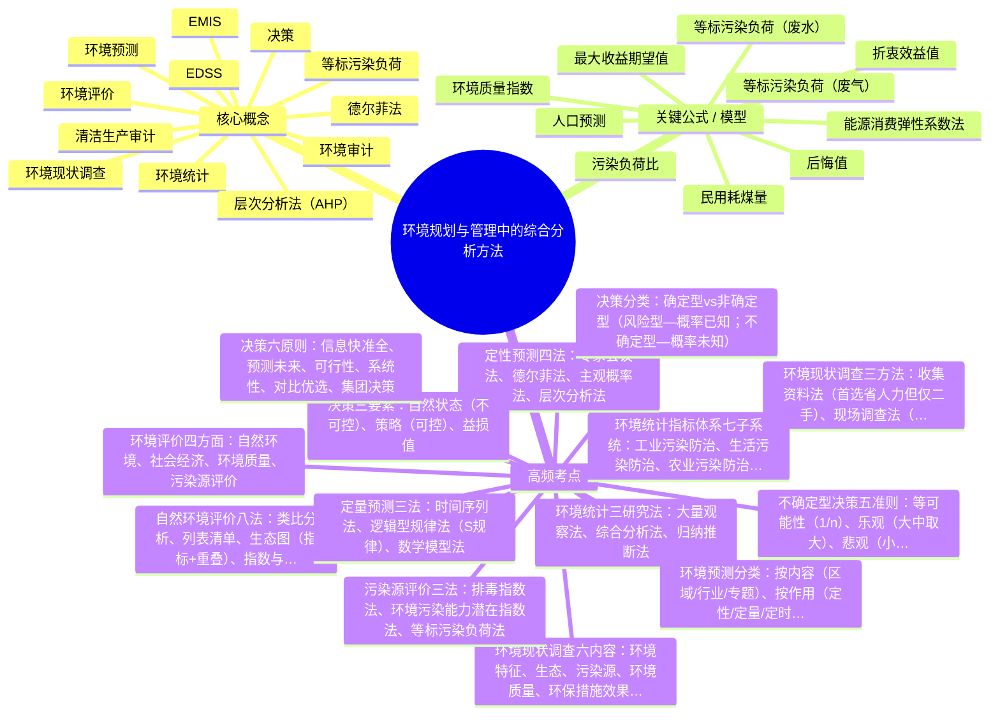

# 环境规划与管理 · 第 4 章 · 环境规划与管理中的综合分析方法 · 素材

> 教师: 王思雨 · 学期: 2026春
> 章下 PDF: 4 个 · 总页: 513
> 主版: 第 4 节 · 135 页

---

## 主版课件 · 第 4 节

> `004-第四章环境规划与管理中的综合分析方法-第四章环境规划与管理中的综合分析方法.pdf`

<details><summary>展开 135 页图链</summary>

- [p001](../004-第四章环境规划与管理中的综合分析方法-第四章环境规划与管理中的综合分析方法/page_001.jpg)  · 第四章
- [p002](../004-第四章环境规划与管理中的综合分析方法-第四章环境规划与管理中的综合分析方法/page_002.jpg)  · 学习要点
- [p003](../004-第四章环境规划与管理中的综合分析方法-第四章环境规划与管理中的综合分析方法/page_003.jpg)  · 第一节 环境现状调查与评价
- [p004](../004-第四章环境规划与管理中的综合分析方法-第四章环境规划与管理中的综合分析方法/page_004.jpg)  · 环境现状调查与评价的目的是为了掌握和了解某区域环境现状，发现和识
- [p005](../004-第四章环境规划与管理中的综合分析方法-第四章环境规划与管理中的综合分析方法/page_005.jpg)  · 一、环境现状调查内容
- [p006](../004-第四章环境规划与管理中的综合分析方法-第四章环境规划与管理中的综合分析方法/page_006.jpg)  · （2）社会环境特征和经济社会发展规
- [p007](../004-第四章环境规划与管理中的综合分析方法-第四章环境规划与管理中的综合分析方法/page_007.jpg)  · ②区域内相关的社会因素：
- [p008](../004-第四章环境规划与管理中的综合分析方法-第四章环境规划与管理中的综合分析方法/page_008.jpg)  · （3）环境污染因素调查
- [p009](../004-第四章环境规划与管理中的综合分析方法-第四章环境规划与管理中的综合分析方法/page_009.jpg)  · 2.生态调查
- [p010](../004-第四章环境规划与管理中的综合分析方法-第四章环境规划与管理中的综合分析方法/page_010.jpg)  · 3.污染源调查
- [p011](../004-第四章环境规划与管理中的综合分析方法-第四章环境规划与管理中的综合分析方法/page_011.jpg)  · 4、环境质量调查
- [p012](../004-第四章环境规划与管理中的综合分析方法-第四章环境规划与管理中的综合分析方法/page_012.jpg)  · 二、环境现状调查的方法
- [p013](../004-第四章环境规划与管理中的综合分析方法-第四章环境规划与管理中的综合分析方法/page_013.jpg)  · 2.现场调查法
- [p014](../004-第四章环境规划与管理中的综合分析方法-第四章环境规划与管理中的综合分析方法/page_014.jpg)  · 3.遥感的方法
- [p015](../004-第四章环境规划与管理中的综合分析方法-第四章环境规划与管理中的综合分析方法/page_015.jpg)  · 三、五 环境评价
- [p016](../004-第四章环境规划与管理中的综合分析方法-第四章环境规划与管理中的综合分析方法/page_016.jpg)  · 1.环境评价的主要内
- [p017](../004-第四章环境规划与管理中的综合分析方法-第四章环境规划与管理中的综合分析方法/page_017.jpg)  · （2）社会经济评价
- [p018](../004-第四章环境规划与管理中的综合分析方法-第四章环境规划与管理中的综合分析方法/page_018.jpg)  · （3）环境质量评价
- [p019](../004-第四章环境规划与管理中的综合分析方法-第四章环境规划与管理中的综合分析方法/page_019.jpg)  · （4）污染源评价
- [p020](../004-第四章环境规划与管理中的综合分析方法-第四章环境规划与管理中的综合分析方法/page_020.jpg)  · 2.环境评价的主要方法
- [p021](../004-第四章环境规划与管理中的综合分析方法-第四章环境规划与管理中的综合分析方法/page_021.jpg)  · ④指数法与综合指数法：在生态环境评价中用得最多，必须建
- [p022](../004-第四章环境规划与管理中的综合分析方法-第四章环境规划与管理中的综合分析方法/page_022.jpg)  · ①生物生产力评价法：用三个基本生物学参数（生物生长
- [p023](../004-第四章环境规划与管理中的综合分析方法-第四章环境规划与管理中的综合分析方法/page_023.jpg)  · （2）社会经济评价方法
- [p024](../004-第四章环境规划与管理中的综合分析方法-第四章环境规划与管理中的综合分析方法/page_024.jpg)  · 山
- [p025](../004-第四章环境规划与管理中的综合分析方法-第四章环境规划与管理中的综合分析方法/page_025.jpg)  · （4）污染源评价方法
- [p026](../004-第四章环境规划与管理中的综合分析方法-第四章环境规划与管理中的综合分析方法/page_026.jpg)  · 等标污染负荷法
- [p027](../004-第四章环境规划与管理中的综合分析方法-第四章环境规划与管理中的综合分析方法/page_027.jpg)  · 按调查区域内污染源的等标污染负荷（P-)大
- [p028](../004-第四章环境规划与管理中的综合分析方法-第四章环境规划与管理中的综合分析方法/page_028.jpg)  · 第二节 环境统计方法
- [p029](../004-第四章环境规划与管理中的综合分析方法-第四章环境规划与管理中的综合分析方法/page_029.jpg)  · 一、环境统计
- [p030](../004-第四章环境规划与管理中的综合分析方法-第四章环境规划与管理中的综合分析方法/page_030.jpg)  · 1.一般的统计工作程序
- [p031](../004-第四章环境规划与管理中的综合分析方法-第四章环境规划与管理中的综合分析方法/page_031.jpg)  · 2.环境统计的内容
- [p032](../004-第四章环境规划与管理中的综合分析方法-第四章环境规划与管理中的综合分析方法/page_032.jpg)  · 3.环境统计的指标体系
- [p033](../004-第四章环境规划与管理中的综合分析方法-第四章环境规划与管理中的综合分析方法/page_033.jpg)  · 4.中国现行环境统计指标体系框架
- [p034](../004-第四章环境规划与管理中的综合分析方法-第四章环境规划与管理中的综合分析方法/page_034.jpg)  · 5.中国环境统计范围
- [p035](../004-第四章环境规划与管理中的综合分析方法-第四章环境规划与管理中的综合分析方法/page_035.jpg)  · 6.环境统计的作用
- [p036](../004-第四章环境规划与管理中的综合分析方法-第四章环境规划与管理中的综合分析方法/page_036.jpg)  · 7.环境统计专业报表上报流程
- [p037](../004-第四章环境规划与管理中的综合分析方法-第四章环境规划与管理中的综合分析方法/page_037.jpg)  · 二、环境统计的调查方法
- [p038](../004-第四章环境规划与管理中的综合分析方法-第四章环境规划与管理中的综合分析方法/page_038.jpg)  · 三、环境统计的研究方法
- [p039](../004-第四章环境规划与管理中的综合分析方法-第四章环境规划与管理中的综合分析方法/page_039.jpg)  · 延伸材料-我国环境统计缺口性指标
- [p040](../004-第四章环境规划与管理中的综合分析方法-第四章环境规划与管理中的综合分析方法/page_040.jpg)  · 以下是一些可能存在缺口性指标的领域：
- [p041](../004-第四章环境规划与管理中的综合分析方法-第四章环境规划与管理中的综合分析方法/page_041.jpg)  · 为了减少环境统计缺口性指标，可以采取以下措施：
- [p042](../004-第四章环境规划与管理中的综合分析方法-第四章环境规划与管理中的综合分析方法/page_042.jpg)  · 第三节 社会经济预测方法
- [p043](../004-第四章环境规划与管理中的综合分析方法-第四章环境规划与管理中的综合分析方法/page_043.jpg)  · 社会发展预测
- [p044](../004-第四章环境规划与管理中的综合分析方法-第四章环境规划与管理中的综合分析方法/page_044.jpg)  · 常见的人口预测模型
- [p045](../004-第四章环境规划与管理中的综合分析方法-第四章环境规划与管理中的综合分析方法/page_045.jpg)  · 二、 经济发展预测
- [p046](../004-第四章环境规划与管理中的综合分析方法-第四章环境规划与管理中的综合分析方法/page_046.jpg)  · 能源消耗预测方法
- [p047](../004-第四章环境规划与管理中的综合分析方法-第四章环境规划与管理中的综合分析方法/page_047.jpg)  · 目前，耗煤量的预测可分为民用耗煤量预测和工业耗煤量
- [p048](../004-第四章环境规划与管理中的综合分析方法-第四章环境规划与管理中的综合分析方法/page_048.jpg)  · 工业耗煤量预测方法有弹性系数法、回归分析法、灰色预测
- [p049](../004-第四章环境规划与管理中的综合分析方法-第四章环境规划与管理中的综合分析方法/page_049.jpg)  · 第四节 环境预测方法
- [p050](../004-第四章环境规划与管理中的综合分析方法-第四章环境规划与管理中的综合分析方法/page_050.jpg)  · 环境预测
- [p051](../004-第四章环境规划与管理中的综合分析方法-第四章环境规划与管理中的综合分析方法/page_051.jpg)  · 把需要进行预测的客观环境看成一个系统，根据一般系统的整
- [p052](../004-第四章环境规划与管理中的综合分析方法-第四章环境规划与管理中的综合分析方法/page_052.jpg)  · 2、分类
- [p053](../004-第四章环境规划与管理中的综合分析方法-第四章环境规划与管理中的综合分析方法/page_053.jpg)  · 二、常用预测方法
- [p054](../004-第四章环境规划与管理中的综合分析方法-第四章环境规划与管理中的综合分析方法/page_054.jpg)  · 2、环境预测内容和基本程序
- [p055](../004-第四章环境规划与管理中的综合分析方法-第四章环境规划与管理中的综合分析方法/page_055.jpg)  · （1）环境预测的内容
- [p056](../004-第四章环境规划与管理中的综合分析方法-第四章环境规划与管理中的综合分析方法/page_056.jpg)  · 3、环境预测的方法
- [p057](../004-第四章环境规划与管理中的综合分析方法-第四章环境规划与管理中的综合分析方法/page_057.jpg)  · ②德尔菲法又称“专家调查法”或“函询调查法”，以无记名方式，通过数
- [p058](../004-第四章环境规划与管理中的综合分析方法-第四章环境规划与管理中的综合分析方法/page_058.jpg)  · 德尔菲法一般情况下包括设计调查表、发放调查表实施调查、回收调查
- [p059](../004-第四章环境规划与管理中的综合分析方法-第四章环境规划与管理中的综合分析方法/page_059.jpg)  · ③主观概率法首选允许专家在预测时可以提出几个估计值，并
- [p060](../004-第四章环境规划与管理中的综合分析方法-第四章环境规划与管理中的综合分析方法/page_060.jpg)  · （2）定量预测方
- [p061](../004-第四章环境规划与管理中的综合分析方法-第四章环境规划与管理中的综合分析方法/page_061.jpg)  · ①时间序列法
- [p062](../004-第四章环境规划与管理中的综合分析方法-第四章环境规划与管理中的综合分析方法/page_062.jpg)  · ①时间序列法
- [p063](../004-第四章环境规划与管理中的综合分析方法-第四章环境规划与管理中的综合分析方法/page_063.jpg)  · ②逻辑型规律法
- [p064](../004-第四章环境规划与管理中的综合分析方法-第四章环境规划与管理中的综合分析方法/page_064.jpg)  · （3）回归分析法
- [p065](../004-第四章环境规划与管理中的综合分析方法-第四章环境规划与管理中的综合分析方法/page_065.jpg)  · 4、环境预测的常见类型
- [p066](../004-第四章环境规划与管理中的综合分析方法-第四章环境规划与管理中的综合分析方法/page_066.jpg)  · （2）水环境质量预测
- [p067](../004-第四章环境规划与管理中的综合分析方法-第四章环境规划与管理中的综合分析方法/page_067.jpg)  · （3）固体废物环境质量预测
- [p068](../004-第四章环境规划与管理中的综合分析方法-第四章环境规划与管理中的综合分析方法/page_068.jpg)  · （4）噪声环境质量预测
- [p069](../004-第四章环境规划与管理中的综合分析方法-第四章环境规划与管理中的综合分析方法/page_069.jpg)  · 三、环境预测的工作程序
- [p070](../004-第四章环境规划与管理中的综合分析方法-第四章环境规划与管理中的综合分析方法/page_070.jpg)  · 第五节 决策分析方法
- [p071](../004-第四章环境规划与管理中的综合分析方法-第四章环境规划与管理中的综合分析方法/page_071.jpg)  · 一、决策
- [p072](../004-第四章环境规划与管理中的综合分析方法-第四章环境规划与管理中的综合分析方法/page_072.jpg)  · 决策是系统工程的核心，也是管理
- [p073](../004-第四章环境规划与管理中的综合分析方法-第四章环境规划与管理中的综合分析方法/page_073.jpg)  · 2、分类
- [p074](../004-第四章环境规划与管理中的综合分析方法-第四章环境规划与管理中的综合分析方法/page_074.jpg)  · 二、决策因素
- [p075](../004-第四章环境规划与管理中的综合分析方法-第四章环境规划与管理中的综合分析方法/page_075.jpg)  · 三、决策方法
- [p076](../004-第四章环境规划与管理中的综合分析方法-第四章环境规划与管理中的综合分析方法/page_076.jpg)  · 2.非确定型决策的方法
- [p077](../004-第四章环境规划与管理中的综合分析方法-第四章环境规划与管理中的综合分析方法/page_077.jpg)  · 例4-1某厂开发环保产品，其市场状态E；，发生概率P和各方案
- [p078](../004-第四章环境规划与管理中的综合分析方法-第四章环境规划与管理中的综合分析方法/page_078.jpg)  · 解：据式（4-5）
- [p079](../004-第四章环境规划与管理中的综合分析方法-第四章环境规划与管理中的综合分析方法/page_079.jpg)  · （1）等可能性准则
- [p080](../004-第四章环境规划与管理中的综合分析方法-第四章环境规划与管理中的综合分析方法/page_080.jpg)  · 例4-2
- [p081](../004-第四章环境规划与管理中的综合分析方法-第四章环境规划与管理中的综合分析方法/page_081.jpg)  · 对于A:max（4，4，6，7)=7
- [p082](../004-第四章环境规划与管理中的综合分析方法-第四章环境规划与管理中的综合分析方法/page_082.jpg)  · （3）悲观准则
- [p083](../004-第四章环境规划与管理中的综合分析方法-第四章环境规划与管理中的综合分析方法/page_083.jpg)  · 仍以例4-2为例：
- [p084](../004-第四章环境规划与管理中的综合分析方法-第四章环境规划与管理中的综合分析方法/page_084.jpg)  · (4)折衷准则
- [p085](../004-第四章环境规划与管理中的综合分析方法-第四章环境规划与管理中的综合分析方法/page_085.jpg)  · 上例中，假设a=0.45，则1-a=0.55。折衷效益值C的公式为：
- [p086](../004-第四章环境规划与管理中的综合分析方法-第四章环境规划与管理中的综合分析方法/page_086.jpg)  · （5）后悔值准则（最小后悔值准
- [p087](../004-第四章环境规划与管理中的综合分析方法-第四章环境规划与管理中的综合分析方法/page_087.jpg)  · 表4-17 效益矩阵对应的后悔矩阵
- [p088](../004-第四章环境规划与管理中的综合分析方法-第四章环境规划与管理中的综合分析方法/page_088.jpg)  · 对于不确定型问题，采用不同的决策准则做出的决策往往
- [p089](../004-第四章环境规划与管理中的综合分析方法-第四章环境规划与管理中的综合分析方法/page_089.jpg)  · [例4-3]某厂试制一种防噪耳机，新产品成本每件3元，销售价每件5
- [p090](../004-第四章环境规划与管理中的综合分析方法-第四章环境规划与管理中的综合分析方法/page_090.jpg)  · ①采用小中取大准则的收益矩阵（表4-19）
- [p091](../004-第四章环境规划与管理中的综合分析方法-第四章环境规划与管理中的综合分析方法/page_091.jpg)  · ②采用大中取大准则的收益矩阵（表4-20）
- [p092](../004-第四章环境规划与管理中的综合分析方法-第四章环境规划与管理中的综合分析方法/page_092.jpg)  · ③等可能性原则
- [p093](../004-第四章环境规划与管理中的综合分析方法-第四章环境规划与管理中的综合分析方法/page_093.jpg)  · ④最小机会损失决策准则
- [p094](../004-第四章环境规划与管理中的综合分析方法-第四章环境规划与管理中的综合分析方法/page_094.jpg)  · 代
- [p095](../004-第四章环境规划与管理中的综合分析方法-第四章环境规划与管理中的综合分析方法/page_095.jpg)  · 四、决策原则和决策程序
- [p096](../004-第四章环境规划与管理中的综合分析方法-第四章环境规划与管理中的综合分析方法/page_096.jpg)  · 表4-22决策程序
- [p097](../004-第四章环境规划与管理中的综合分析方法-第四章环境规划与管理中的综合分析方法/page_097.jpg)  · 第六节 环境审计方法
- [p098](../004-第四章环境规划与管理中的综合分析方法-第四章环境规划与管理中的综合分析方法/page_098.jpg)  · 一、环境审计
- [p099](../004-第四章环境规划与管理中的综合分析方法-第四章环境规划与管理中的综合分析方法/page_099.jpg)  · 环境审计是对环境管理的某些方面
- [p100](../004-第四章环境规划与管理中的综合分析方法-第四章环境规划与管理中的综合分析方法/page_100.jpg)  · 二、 环境审计的内容
- [p101](../004-第四章环境规划与管理中的综合分析方法-第四章环境规划与管理中的综合分析方法/page_101.jpg)  · 4.有害物质的处理、存放及清理的审计
- [p102](../004-第四章环境规划与管理中的综合分析方法-第四章环境规划与管理中的综合分析方法/page_102.jpg)  · 6.环境效益审计
- [p103](../004-第四章环境规划与管理中的综合分析方法-第四章环境规划与管理中的综合分析方法/page_103.jpg)  · 三、环境审计方法
- [p104](../004-第四章环境规划与管理中的综合分析方法-第四章环境规划与管理中的综合分析方法/page_104.jpg)  · 目前在环境审计专业人才缺乏的情况下如何开展环境审计，我们
- [p105](../004-第四章环境规划与管理中的综合分析方法-第四章环境规划与管理中的综合分析方法/page_105.jpg)  · 2.将财务收支审计与经济效益审计相结合
- [p106](../004-第四章环境规划与管理中的综合分析方法-第四章环境规划与管理中的综合分析方法/page_106.jpg)  · 3.将审计人员与环保专业技术人员相结合
- [p107](../004-第四章环境规划与管理中的综合分析方法-第四章环境规划与管理中的综合分析方法/page_107.jpg)  · 目前环境审计刚刚起步，企业环境审计是最基本的，其中企业清
- [p108](../004-第四章环境规划与管理中的综合分析方法-第四章环境规划与管理中的综合分析方法/page_108.jpg)  · 第七节 环境管理信息系统
- [p109](../004-第四章环境规划与管理中的综合分析方法-第四章环境规划与管理中的综合分析方法/page_109.jpg)  · 一、环境信息及其系统
- [p110](../004-第四章环境规划与管理中的综合分析方法-第四章环境规划与管理中的综合分析方法/page_110.jpg)  · 2.环境信息的检索
- [p111](../004-第四章环境规划与管理中的综合分析方法-第四章环境规划与管理中的综合分析方法/page_111.jpg)  · 序号
- [p112](../004-第四章环境规划与管理中的综合分析方法-第四章环境规划与管理中的综合分析方法/page_112.jpg)  · 序
- [p113](../004-第四章环境规划与管理中的综合分析方法-第四章环境规划与管理中的综合分析方法/page_113.jpg)  · 序号
- [p114](../004-第四章环境规划与管理中的综合分析方法-第四章环境规划与管理中的综合分析方法/page_114.jpg)  · 3.环境信息系统
- [p115](../004-第四章环境规划与管理中的综合分析方法-第四章环境规划与管理中的综合分析方法/page_115.jpg)  · （1）环境管理信息系统
- [p116](../004-第四章环境规划与管理中的综合分析方法-第四章环境规划与管理中的综合分析方法/page_116.jpg)  · 其基本功能包括：①全面准确地查询和检索各种环境信息，系
- [p117](../004-第四章环境规划与管理中的综合分析方法-第四章环境规划与管理中的综合分析方法/page_117.jpg)  · 收集 录用
- [p118](../004-第四章环境规划与管理中的综合分析方法-第四章环境规划与管理中的综合分析方法/page_118.jpg)  · 建设项目环境管理的基本目标主要包括：
- [p119](../004-第四章环境规划与管理中的综合分析方法-第四章环境规划与管理中的综合分析方法/page_119.jpg)  · 正安市流南告环撞景
- [p120](../004-第四章环境规划与管理中的综合分析方法-第四章环境规划与管理中的综合分析方法/page_120.jpg)  · （2）环境决策支持系统
- [p121](../004-第四章环境规划与管理中的综合分析方法-第四章环境规划与管理中的综合分析方法/page_121.jpg)  · 环境决策支持系统通常具有以下几个主要组成部分：
- [p122](../004-第四章环境规划与管理中的综合分析方法-第四章环境规划与管理中的综合分析方法/page_122.jpg)  · 收集、整理、贮存各种环境信息和数据
- [p123](../004-第四章环境规划与管理中的综合分析方法-第四章环境规划与管理中的综合分析方法/page_123.jpg)  · 二、环境管理信息系统的设计与评价
- [p124](../004-第四章环境规划与管理中的综合分析方法-第四章环境规划与管理中的综合分析方法/page_124.jpg)  · 2.环境管理信息系统的设计与评价
- [p125](../004-第四章环境规划与管理中的综合分析方法-第四章环境规划与管理中的综合分析方法/page_125.jpg)  · 环境管理信息系统EMIS的设计过程
- [p126](../004-第四章环境规划与管理中的综合分析方法-第四章环境规划与管理中的综合分析方法/page_126.jpg)  · 环境管理信息系统各开发程序及内容
- [p127](../004-第四章环境规划与管理中的综合分析方法-第四章环境规划与管理中的综合分析方法/page_127.jpg)  · 云南省地质环境管理信息系统 2017年12月28日周四 好，欢迎用用想环营信系统
- [p128](../004-第四章环境规划与管理中的综合分析方法-第四章环境规划与管理中的综合分析方法/page_128.jpg)  · 阶段名称
- [p129](../004-第四章环境规划与管理中的综合分析方法-第四章环境规划与管理中的综合分析方法/page_129.jpg)  · 三、环境决策支持系统的设计与评价
- [p130](../004-第四章环境规划与管理中的综合分析方法-第四章环境规划与管理中的综合分析方法/page_130.jpg)  · 四、中国的环境信息系统建设
- [p131](../004-第四章环境规划与管理中的综合分析方法-第四章环境规划与管理中的综合分析方法/page_131.jpg)  · 2.机构能力建设
- [p132](../004-第四章环境规划与管理中的综合分析方法-第四章环境规划与管理中的综合分析方法/page_132.jpg)  · 习题
- [p133](../004-第四章环境规划与管理中的综合分析方法-第四章环境规划与管理中的综合分析方法/page_133.jpg)  · 习题
- [p134](../004-第四章环境规划与管理中的综合分析方法-第四章环境规划与管理中的综合分析方法/page_134.jpg)  · 习题
- [p135](../004-第四章环境规划与管理中的综合分析方法-第四章环境规划与管理中的综合分析方法/page_135.jpg)  · 习题

</details>

<details><summary>展开 135 页图文对照（每图配其识别文本）</summary>

**p001** 

第四章
环境规划与管理中的综合分析方法
第一节 环境现状调查与评价的基本程序和方法
第二节 环境统计方法
第三节 社会经济预测方法
第四节 环境预测方法
第五节 决策分析方法
第六节 环境审计方法
第7节 环境管理信息系统

---

**p002** 

学习要点
掌握环境现状调查与评价的基本程序和方法、环境统
计方法、社会经济预测方法、环境预测方法、决策分析方
法、环境审计方法和环境管理信息系统的内容和程序。
学习重点：环境评价方法，环境预测方法，社会经济
预测方法和决策分析方法。
学习难点：环境管理信息系统的建立与应用。

---

**p003** 

第一节 环境现状调查与评价
的基本程序和方法
一、环境现状调查内容
二、环境现状调查的方法
·三、环境评价

---

**p004** 

环境现状调查与评价的目的是为了掌握和了解某区域环境现状，发现和识
别主要环境问题，从而确定主要污染源和主要污染物，为环境规划与管理的
制定和实施创造条件
环境现状调查要从信息情报的收集和分析入手，针对列出的调查清单逐项
调查，发现问题并逐步深入，可以包括必要的现场监测、勘察以及征询专家
意见等。环境评价包括自然环境评价、经济和社会评价、污染评价

---

**p005** 

一、环境现状调查内容
1.环境特征调查
（1）自然环境特征：
地质、气候水文、植被、地形
地貌、土壤、特殊价值地区及生态
环境（特别是生态敏感区或生态脆
弱区）等。

---

**p006** 

（2）社会环境特征和经济社会发展规
划
①区域相关的经济现状：
a.生产布局现状分析，生产布局是人类生产活动
存在和发展的空间形式，它对区域环境产生直接和显
著的影响。
b.生产力发展水平现状分析，生产力直接反映了
人与自然环境之间的关系，生产力发展水平则反映了
人们征服、改造、控制和适应环境的能力。

---

**p007** 

②区域内相关的社会因素：
a.社会人口状况分析，人通过生产和消费活动同
环境形成了相互联系、相互作用、相互制约的对立统
一关系。
b.社会意识状况分析，规划区内人们的思想、道
德、哲学、美学、文艺、宗教和风俗等社会意识形态，
特别是当地人们的环境意识等方面的情况，并分析这
些社会意识对区域环境所产生的影响。
c.社会制度和体制、体育等社会概况，分析对区
域环境所产生的影响。

---

**p008** 

（3）环境污染因素调查
突出重大工业污染源调查和污染源综合调查。根据污染类
型，进行单项调查，按污染物排放总量排队由此确定评价区内的
主要污染物和主要污染源。
污染调查还应酌情包括乡镇企业污染评价和生活及面源污染
分析等。污染调查还应考察现存环境设施运行情况、已有环境工
程的技术和效益，作为新规划工程项目的设计依据和参考。

---

**p009** 

2.生态调查
环境自净能力
土地开发利用情况
气象条件
绿地覆盖率
人口密度
经济密度
建设密度
能耗密度调查等

---

**p010** 

3.污染源调查
工业污染源
农业污染源
生活污染源
交通运输污染源
噪声污染源
放射性
电磁辐射污染源调查等

---

**p011** 

4、环境质量调查
环境保护部门及工厂企业历年的环境质量报告和环境监测资料。
5.环保措施效果调查
环保设施运行率、达标率和环保措施削减污染物效果以及
其综合效益进行分析评价。
6.环境管理现状调查
包括环境管理机构、环境保护工作人员业务素质、环境政
策法规实施和环境监督实施情况等。

---

**p012** 

二、环境现状调查的方法
1.收集资料法
应用范围广、收效大，比
较节省人力、物力和时间。
环境现状调查时，应首先通过
此方法获得现有的各种有关资
料，但此方法只能获得第二手
资料，而且往往不全面，不能
完全符合要求，需要其他方法
补充。

---

**p013** 

2.现场调查法
可以针对使用者的需要，直接获得第一手的数据和资料，
以弥补收集资料法的不足。
这种方法工作量大，需占用较多的人力、物力和时间，有
时还可能受季节、仪器设备条件的限制。
现场调查法能够直接获取真实、准确的环境现状信息，
但可能受到时间、人力、物力和天气等条件的限制，并且对
调查人员的专业知识和技能要求较高。

---

**p014** 

3.遥感的方法
遥感是一种综合技术，它利用航空器、卫星等远距离探
测设备获取地球表面信息。通过收集、处理和分析地球表面
的图像，从而获得关于地球环境、自然资源、人类活动等方
面的信息。这种技术通常涉及使用特定的传感器装置，在不
直接接触研究对象的情况下，收集其特征信息，并对这些信
息进行提取、加工、表达和应用。遥感技术的应用领域非常
广泛，包括电力、通信、气象、农林、海洋、勘探、摄影、
防灾减灾等。

---

**p015** 

三、五 环境评价
在环境规划中，环境评价的主要内容包括自然环境评
价、社会经济评价、环境质量评价和污染源评价等4个方
面。评价是对被评价对象的优劣、好坏作定量或定性的描
述，一般以定量描述为主。

---

**p016** 

1.环境评价的主要内
容
（1）自然环境评价
通过自然、社会、经济背景分析及社会、经济与环境的
相关分析，确定当前主要环境问题及其产生的原因，并确定
环境区划和评估环境的承载能力。
自然背景分析会考虑当地的气候条件、地形地貌、土壤
类型、水资源、植被覆盖等自然因素。社会背景分析则关注
人口结构、文化传统、教育水平、社会组织形式、生活方式
等方面。经济背景分析包括产业结构、经济发展水平、经济
增长模式、资源利用效率等内容。

---

**p017** 

（2）社会经济评价
项目 内容
人口总数、人口密度、人口分布、人口的
人口评价
年龄结构和人口的文化素质等。
产业结构、国民生产总值和人均国民收入、
经济活动评价
产品综合能耗、能源利用率等。
住房、道路、给水设施及供水管网、排水
城市基础设施
管网及污水处理设施、能源结构、供热方式、
评价
绿地及分布和电话普及率等。

---

**p018** 

（3）环境质量评价
环境质量评价是环境规划与
蓝天 绿色地球
管理的一项基础工作，其目的是正
确认识规划区的环境质量现状、环
境质量的地区差异和环境质量的变
化趋势。环境质量评价突出超标问
题，以明确环境污染的时空界域为
主要环节，指出主要环境问题的原
因和潜在的环境隐患等。

---

**p019** 

（4）污染源评价
突出重大工业污染源评价和污染源综合评价。根据污染类型
进行单项评价，按污染物等标污染负荷排序，确定评价区的主要
污染物和主要污染源。
污染评价还应酌情包括乡镇企业污染评价和生活及面源
污染分析等。
农业污染源
化肥
其他污染源

---

**p020** 

2.环境评价的主要方法
（1）自然环境评价方法：
①类比分析法：是一种常用的定性和半定量的方法，一般有生态环境
整体类比、生态因子类比、生态环境问题类比等。
②列表清单法：将各种生态环境因子分别列在同一表格的行与列里，
逐点进行分析并以正负号、数字或其他符号表示其性质、强度等。
③生态图法：即图形叠置法，是把两个以上的生态环境信息叠合在
一张图上，构成复合图，用以表示生态环境变化的方向和程度。绘
制生态图的两个基本手段是指标法和重叠法。指标法是用定量或半
定量的方法对环境主体进行评价、分级，并绘制在地图上。重叠法
是将各相关要素的图件叠合在一起以获得新的、综合性的结果

---

**p021** 

④指数法与综合指数法：在生态环境评价中用得最多，必须建
立表征生态环境因子特性的指标体系和确定评价标准，赋予各
因子权重，然后建立评价函数曲线，得出综合评价指数值。例
如用于水环境质量评价的内梅罗指数、用于大气环境质量评价
的格林大气指数、上海大气质量指数等。
③景观生态学方法：通过空间结构和功能分析与稳定性分析，
评价生态环境质量状况。
生态系统综合评价法：常用层次分析法（AHP法），又称多
层次权重分析决策法，是一种定性和定量结合的方法。

---

**p022** 

①生物生产力评价法：用三个基本生物学参数（生物生长
量、生物量和物种量）来表示，可评价生态环境质量及其
变化趋势。
⑧其他评价方法：还有多因子数量分析法、回归分析法、聚
类分析法、相关分析法、系统分析法等。
生态环境评价方法正处于蓬勃发展的时期，新的方法还在不
断出现，但不管采取什么方法，其可靠性最终取决于对生态
环境的全面认识和深刻理解。获取可靠的资料数据，仔细分
析生态环境的特点、本质和各要素之间的内在联系，是评价
成功的关键。

---

**p023** 

（2）社会经济评价方法
社会经济评价的关键是选择评价的标准和指标化的方法。由
于社会经济问题比较复杂，不易形成统一的看法，目前尚无统一
评价标准，一般是根据研究对象和研究者所选择的总的战略目标，
结合国内外相关指标体系来确定。

---

**p024** 

山
（3）环境质量评价方法
环境质量评价分为单环境要素评价、单要素综合评价
和区域环境质量综合评价。评价的方法很多，这里重点介
绍指数评价方法。某污染物在环境中监测值与标准值的比
值，称为该污染物的环境质量指数，表示污染物的超过环
境质量标准的倍数。
i污染物的环境质量指数；
P 污染物的监测值；
Cio -i污染物的环境质量标准值。

---

**p025** 

（4）污染源评价方法
在确定主要污染物和污染源的评价中多选用排放量和毒性这两
个指标作为评价主要污染物的指标。在多种污染物比较分析中，在
数学上可采用标准化法，将不同种类、不同量纲的一组值进行标准
化，使之可相互比较，主要方法有排毒指数法、环境污染能力潜在
指数法和等标污染负荷法等。

---

**p026** 

等标污染负荷法
项目 公式 备注
废水中i污染物的等标 P i污染物的等标污染负荷，t/d；
污染负荷计算公式： C i污染物的实测浓度值，mg/l;
Coi i污染物的允许排放浓度标准与C同单位的
P 数值，无因次量；
Coi Qi -污废水排放量，m3/d。
某污染物的等标污
染负荷(P)
废气中i污染物的等标 P i污染物的等标污染负荷，t/d；
污染负荷计算公式： C i污染物的实测浓度平均值，mg/mv3；
Coi -污染物的允许排放浓度标准与p同单位的
P;= 数值，无因次量；
Coi qi 一废气中i污染物的介质排放流量，mv/d。
某污染源的等标污 污染源中各污染物i=1.2， n的等标污染负荷
染负荷(P) 之和，为污染源的等标污染负荷。

---

**p027** 

按调查区域内污染源的等标污染负荷（P-)大
评价区域的等标污
染负荷(PT) P=∑P, 小排列，将累计百分比大于80%左右的污染
= 源列为区域内主要污染源。
评价区域内某污染 按评价区域内某污染物等标污染负荷（P总）大
Pi=P 小排序，分别计算百分比及累计百分比，将
物的总等标污染负
荷(Pi) j=1 累计百分比大于80%左右的污染物列为该区
域的主要污染物。
污染物排放量排序是直接评价某种污染物的
污染源污染负荷 K P ×100% 主要污染源的最简单方法。实施总量控制规
比(K) P 划时，针对区域总量控制的主要污染物，对
排放这一主要污染物的污染源进行总量排序。
区域主要污染物的选择，主要是根据区域的
主要环境问题，或是根据环境质量评价结果
污染物的污染负 =Pi ×100% 来确定。
荷比(K) 针对主要污染物的排放量，首先要有污染源
排放量清单，然后排序，再选出占污染物总
量90%以上的污染源，进行总量控制规划。

---

**p028** 

第二节 环境统计方法
环境统计
二、 环境统计的调查方法
三、环境统计的研究方法

---

**p029** 

一、环境统计
环境统计是用数字反映并计量人类活动引起的环境变化和
环境变化对人类的影响。
以环境为主要研究对象，研究范围涉及人类赖以生产和生
活的全部条件，包括影响生态平衡的诸因素及其变化带来的后
果。环境统计要调查和反映植物、动物、大气、水、土地土壤
和人类居住区等各个方面的活动和自然现象及其对环境的影响。

---

**p030** 

1.一般的统计工作程序
阶段 内容
全面调查 (报表制度、普查)
统计调查（基础）：
非全面调查（重点调查、典型调查、抽样
收集资料过程
调查)
统计表 (把资料综合成统计表)
统计整理（中间环节）： 统计图 (把资料综合成统计图)
加工资料过程 整理成各种统计指数（综合指标、回归分
析、指数、动态数列等)
统计分析（核心）： 描述性分析（利用指标数据说明问题）
分析资料过程 推断性分析（各种推断、预测）

---

**p031** 

2.环境统计的内容
自然环境：包括空气与气候、水、土地、生态环境。
特殊环境：包括能源、放射性、有害物质、噪声、自然灾害、野
生动植物。
与环境有关的生活条件：包括健康与营养、劳动条件、居住条件、
娱乐和文化条件、主观评价环境一一民意测验。
背景材料：包括直接影响环境的背景因素、间接因素、公共事业、
技术、意识形态的因素、地理的和有关的背景材料。
改善环境条件的办法：包括立法和实施、环境法的违反和起诉、
减轻环境的损害、用于环境保护的支出、环境的研究和教育等

---

**p032** 

3.环境统计的指标体系
我国现行环境统计指标体系包括七个子系统：
工业污染与防治
生活及其他污染与防治 爱护地球·保护环境
农业污染与防治
环境污染治理投资
自然生态环境保护
环境管理
·环保系统自身建设

---

**p033** 

4.中国现行环境统计指标体系框架
工业污染与防治 企业基本情况 工业污染物排放情况 工业污染治理设施 工业污染治理情况
生活及其他污染与防治 生活污水排放情况 城市污水处理厂运行情况 生活废气排放情况 城市垃圾处理情况
农业污染与防治 规模化畜禽养殖场污染排放及治理情况
环境污染治理投资 污染源治理投资 城市环境基础设施建设投资 环境污染治理投资合计
自然生态环境保护 自然保护区建设情况 野生动植物保护情况 生态示范区建设情况
生态功能保护区建设情况 农村环境污染及治理情况
环境管理 环保法规和标准 环保年度计划 绿色工程规划 环评制度 “三同时”制度
排污收费制度执行情况 排污申报登记制度及排污许可证制度 限期治理制度
环境科技工作 环保产业 环保信访工作 人大政协提案 环保档案工作情况
环保系统自身建设 环保机构 环保人员

---

**p034** 

5.中国环境统计范围
② 6
生态破坏 区域环境 环境系统
与建设统 污染与防 的自身建
计 治统计 设统计
③ 5
自然资源 区域环境 环境管理
统计 质量统计 统计

---

**p035** 

6.环境统计的作用
Green Life!
为环境管理和决策提供依据。
评价和考核各级政府及环境保
护部门环境保护的工作情况。
增加社会公众对环境状况和环
境保护的了解，提高全民的环
保护生忘环境
境意识。
拥抱绿色生活

---

**p036** 

7.环境统计专业报表上报流程
省级上报数据
总局规划司 相关司
审核并填报本级数
专业 省级
报表 汇总 上报
空白表 数据
地级上报数据
省局规划处 相关处室
审核并填报本级数
专业 市级
报表 汇总 上
空白表 数据 报
区县级上报数据
地市局规划科 相关科室
审核并填报本级数
专业 区县级
报表 汇总 上报
空白表 数据
专业报表空白表
区县级环保局 相关科室
规划部门
填报本级数

---

**p037** 

二、环境统计的调查方法
1、定期普查：1996年我国进行了全国污染源普查工作。
2、抽样调查：对重点工业企业污染源实行抽样调查，
重点污染源年度统计报表。
3、科学估算：对重点企业及社会生活污染物排放进行
科学估算。
4、专项调查：对环境保护工作中有重大意义的进行专
项调查，如乡镇企业污染调查、畜禽业专项调查、环保
产业专项调查等。

---

**p038** 

三、环境统计的研究方法
1、大量观察法：环境现象的特征与其数量表现有不同
程度的差异，建立在大量观察基础上的统计结果必然
具有较好的代表性。
2、综合分析法：综合分析法是指对大量观察所获资料
进行整理汇总，计算出总量指标、相对指标、平均指
标、变异指标等。
3、归纳推断法：所谓归纳是由个别到一般，由事实
到概括的推理方法，是统计研究常用的方法。

---

**p039** 

延伸材料-我国环境统计缺口性指标
环境统计缺口性指标是指在环境统计中存在的数据缺失
或不完整的指标。这些指标可能由于以下原因而存在缺口：
1、数据收集困难：某些环境数据可能难以收集，例如特定
污染物的排放数据、生态系统的详细信息等。
2、监测范围有限：环境监测网络可能无法覆盖所有地区或
环境要素，导致某些区域或指标的数据缺失。
3、报告和记录不完整：企业或相关部门可能未能完整报告
或记录环境数据，导致统计数据不全面。

---

**p040** 

以下是一些可能存在缺口性指标的领域：
1、危险废物产生和处置：危险废物的产生量、种类、
处置方式等数据可能存在缺口。
2、土壤污染：土壤污染的程度、范围和污染物种类等
信息可能不完整。
3、生物多样性：生物多样性的详细数据，如物种数量、
栖息地状况等，可能难以全面获取。
4、特定污染物排放：一些特定污染物的排放数据，尤
其是来自小型企业或非重点污染源的排放，可能存在
缺失。

---

**p041** 

为了减少环境统计缺口性指标，可以采取以下措施：
1、完善监测网络：扩大监测范围，提高监测频率，以获取更全面的数据。
2、加强数据收集和管理：建立健全的数据收集和报告制度，确保数据的准确
性和完整性。
3、推动信息共享：促进不同部门和机构之间的数据共享，整合各方资源，填
补数据空白。
4、开展专项调查和研究：针对特定的环境问题或指标，进行专项调查和研究，
以获取更详细的数据。
需要注意的是，具体的环境统计缺口性指标会因地区、时间和环境问题的不
同而有所差异。因此，在进行环境统计和分析时，需要充分认识到这些缺口，
并采取适当的方法来处理和解释数据。同时，持续改进和完善环境统计体系也
是解决缺口性指标问题的关键。

---

**p042** 

第三节 社会经济预测方法
一、社会发展预测
二、经济发展预测

---

**p043** 

社会发展预测
社会发展预测重点是人口预测，是指根据一个国家、一个地区现
有人口状况及可以预测到的未来发展变化趋势，测算在未来某个时
间人口的状况，是环境规划与管理的基本参数之一。进行人口预测，
主要关心的是未来的人口总数。
社会发展预测也包括规划期内区域内的人口总数、人口密度和
人口分布等方面的发展变化趋势，人们的可持续发展观念和环境意
识等各种社会意识的发展变化，人们的生活水平、居住条件、消费
倾向和对环境污染的承受能力等方面的变化等。

---

**p044** 

常见的人口预测模型
项目 公式 说明
算术级数 N 预测年的人口数量，万人；
N,=N,+b（t-to)
法 Nro 基准年的人口数量，万人；
b 逐年人口增加数（即变动一年
几何级数 N=N(1+K)（-0)
法 N的增加数），万人/a；
t.to 预测年和基准年，a；
人口自然增长率，是人口出生
指数增长 N=N2.718K（-to)
法 to 率与死亡率之差，常表示为人口每年
净增的干分数。

---

**p045** 

二、 经济发展预测
能源消耗指标
指标名称 说明
产品综合 包括单位产值综合能耗（总耗能量和产品总产值的比值）
能耗 和单位产量综合能耗（总耗能量和产品总产量的比值）。
能源利用率 有效利用的能量和供给的能量的比值。
规划期内能源消耗量增长速度与年平均经济增长速度之间
能源消费弹性
系数 的比值，年平均经济增长速度，可采用工业总产值、工农
业总产值、社会总产值或国民收入的增长速度等。

---

**p046** 

能源消耗预测方法
方法名称 说明
人均能量 按人民生活中衣食住行对能源的需求来估算生活用能的方法，
消费法 我国平均每人每年1.14t标准煤。
能源消费弹性系数e一般为0.4～1.1，由国民经济增长速度，粗
能源消费 预测能耗的增长速度β=é·α，其中α为工业产值增长速度，以
弹性系数法 此可进行规划期能耗预测E，=E。（1+β)（-），其中E为预测年的
能耗量，E为基准年的能耗量，t，t为预测年和基准年。

---

**p047** 

目前，耗煤量的预测可分为民用耗煤量预测和工业耗煤量
预测，民用耗煤量预测可用式（4-2）表示：
Es=As·S (4-
：中
Es- -预测年采暖耗煤量，x104t/a;
A 采暖耗煤系数，t/m2;
S一一预测年采暖面积，m2。

---

**p048** 

工业耗煤量预测方法有弹性系数法、回归分析法、灰色预测
等几种常用的方法。以弹性系数法为例，设工业耗煤量平均增长
率为α，工业总产值平均增长率为β，工业耗煤量弹性系数C：可用
式（4-3）表示。
(Et/E0）t-t0-1 (4-3)
β (Mt/M0)t-t0-1
式中Et一一预测年的工业耗煤量，x104t/a；
Eo一一基准年的工业耗煤量，x104t/a;
Mt一一预测年的工业总产值，x104元/a；
M。一基准年的工业总产值，x104元/a；
t，to预测年和基准年，a。

---

**p049** 

第四节 环境预测方法
、环境预测
二、常用预测方法
·三、环境预测的工作程序

---

**p050** 

环境预测
1、内涵
在环境管理过程中，经常需要对人类活动将可能引起的环境质量
变化趋势进行预测。环境预测是在调查研究和科学实验的基础上进行
的，借助于数学、计算理论和信息处理技术等工具，对未来某一时间
环境质量的变化趋势，进行定性和定量分析。或者说，预测就是根据
过去和现在来估计未来，是对研究对象的未来发展作出科学推测和估
计，预测是决策的基础。

---

**p051** 

把需要进行预测的客观环境看成一个系统，根据一般系统的整
体性、相关性和动态性等特点，把事物的过去、现在和将来看成一
个连续的、不断发展变化的辩证统一体，并依据已有资料数据，使
用预测方法，对未来的环境污染趋势、污染控制对策以及控制污染
所需的投资趋势等进行评价和估算
这种围绕系统的环境、技术和价值等未来情况进行预测，主要
为决策提供必需的未来信息，对环境管理系统开发和提高环境效益
是十分重要的。

---

**p052** 

2、分类
类别 分类子项
按预测内
区域环境预测、行业环境预测、专题环境预测
容划分
定性预测：对未来发展的定性分析（递增、递减、加快、减缓节奏）；
定量预测：占有历史和现实数据，运用数学模型预测预测；
按预测作 定时预测：寻找时间序列上的发展变化规律（过去、现在和今后）：
用划分 定比预测：定结构比例，例如环保投资结构比例分析（水、气、渣、
噪);
评价预测：对预测结果可信度、风险性进行评价
短期预测：5年内；
按预测时
中期预测：5~15年；
间划分
长期预测：20年

---

**p053** 

二、常用预测方法
1、预测的基本原则
（1）资料的完整性：预测不同于猜测，猜测是随心所欲，不负
责任，而预测必须以周密调查和详尽的统计资料为依据。
（2）数据的准确性：基础数据必须准确完整，预测结果必须给
出误差分析；由于资料数据、预测技术和预测人员素质三方面的因
素，预测结果不可能十全十美，误差总会有，但误差有大有小。
（3）方法的可靠性：对所有方法、模型进行分析、评价和检验。
（4）结果的可验性：预测应有明了的结论，且这个结论是可以
检验的。

---

**p054** 

2、环境预测内容和基本程序
环境预测是通过已取得的情报资
料和监测统计数据，对未来未知的环
境前景进行的估计和推测，也就是把
环境作为预测对象，置于一定的时间
和空间中，研究在未来一定时期经济
社会活动对环境的影响，预测环境要
素和系统将达到的运动状态及可能出
现的结果，它是环境决策的依据，也
是制定环境规划与环境管理的基础。

---

**p055** 

（1）环境预测的内容
①能源和资源消耗的增长、土地利用、资源开发的规模和速度、预
测供求矛盾及其对环境的影响；
③大气环境、水环境、土壤环境等环境要素污染状况的变化；
④开发活动可能造成的生态破坏；
③环境污染与破坏造成的经济损失和对人体健康的损害；
?主要污染物的削减量
（2）环境预测的一般程序：①确定预测的目的和任务；②收集和分析
有关资料；③选择预测方法；④建立预测模型；③进行预测计算；
?对预测结果的鉴别和分析。

---

**p056** 

3、环境预测的方法
根据预测结果一般可分为两类，即定性预测方法和定量预测方法。
（1）定性预测方法
定性预测是预测者利用直观的材料，根据掌握的专业知识和丰富
的实际经验，运用逻辑思维方法对环境变化做出定性的预计推断和环
境交叉影响分析，它主要包括专家会议法、德尔菲法、主观概率法和
层次分析法等。
①专家会议法又称”集合意见法”，是通过专家之间的信息系统，
引起”思维共振”并产生组合效应，形成宏观智能结构后进行创造性思
维的方法。这种方法可以排除折衷，对所议的问题通过客观的连续分
析，找到一组切实可行方案。

---

**p057** 

②德尔菲法又称“专家调查法”或“函询调查法”，以无记名方式，通过数
轮函询征求专家意见。好 预测领导小组对每轮的专家意见进行汇兑整理，作为
参考资料再发给专家，供其分析判断，进一步提出新的论证，并不断修正自
己的见解，如此循环反复数次，专家意见日趋一致，产生较为可靠结论。
德尔菲这一名称起源
于古希腊有关太阳神
阿波罗的神话，寓意
阿波罗预卜未来的神
谕。1946年，兰德公
司首次用这种方法做
出成功预测后，这一
方法被迅速广泛采用。

---

**p058** 

德尔菲法一般情况下包括设计调查表、发放调查表实施调查、回收调查
表进行统计处理、将所有调查对象对每项指标权重的平均估计值及本人估计
值的离差反馈给每个参加调查者并进行第二轮调查和收回调查表进行统计处
理五个基本步骤，具有不具名（应邀参加者并不了解，克服易受权威人士思
想和见解的束缚）、反馈性（一般经3~4轮，每轮统计结果反馈给每位参加者
作为下一轮参考）和预测结果统计性（每一轮采用统计方法处理预测结果，作
定量处理）等特点。

---

**p059** 

③主观概率法首选允许专家在预测时可以提出几个估计值，并
评定备选值出现的可能性；然后计算各个专家预测值的期望值；最
后，对所有专家预测期望值取平均值，得到预测结果。
④层次分析法利用递阶层次结构和矩阵方程将思维过程数学化，
采用1~9标度构造判断矩阵，通过求解矩阵特征向量及最大特征根，
求得低层因素相对目标层的相对重要性权重值，以决定其影响程度。

---

**p060** 

（2）定量预测方
法
定量预测以运筹学、系统论、
控制论、系统动态仿真和统计学
为基础，根据历史数据和资料，
应用数理统计方法来预测事物的
未来，或者利用事物发展的因果
关系来预测事物的来。常用的定
量预测方法主要有时间序列法、
逻辑型规律法和环境系统的数学
模型法等。

---

**p061** 

①时间序列法
时间序列是指同一变量按事件发生的先后顺序排列起来的一组
观察值或记录值。构成时间序列的要素有两个：一是时间，二是与
时间相对应的变量水平。
时间序列法是在时间序列变量分析的基础上，运用一定的数学
方法建立预测模型，使时间趋势向外延伸，从而预测未来市场的发
展变化趋势，确定变量预测值，它又叫历史延伸法或外推法。

---

**p062** 

①时间序列法
时间序列是指同一变量按事件发生的先后顺序排列起来的一组
观察值或记录值。构成时间序列的要素有两个：一是时间，二是与
时间相对应的变量水平。
时间序列法是在时间序列变量分析的基础上，运用一定的数学
方法建立预测模型，使时间趋势向外延伸，从而预测未来市场的发
展变化趋势，确定变量预测值，它又叫历史延伸法或外推法。

---

**p063** 

②逻辑型规律法
逻辑型规律是自然环境和社会环境中事物发展的基本规律之一
其基本线形是由一条指数曲线和一条对数曲线平滑衔接组合而成，
成S型，又称S规律。
③环境系统的数学模型
依据科学定律或者数据的统计分析，或者两者兼而有之，包括
代数方程模型、微分方程模型等。

---

**p064** 

（3）回归分析法
回归分析法是通过对历史资料的统计与分析，寻求变量之间相互
依存的相关关系的一种数量统计方法。
回归分析法的特点包括：①回归模型中的因变量和自变量之间必
须有因果关系；②自变量与因变量间必须具有强相关关系，自变量间
必须具有弱相关关系；③自变量的预测值较准确且易得到；④正确选
定回归模型的形式；回归模型必须通过各种检验后才能用于预测。
回归预测法的基本步骤包括：①进行因素分析，确定回归模型的
自变量；②绘制散点图，构造回归模型的理论形式；③利用最小平方
法估计模型参数，建立模型；④对建立的回归模型进行检验，检验的
方法包括S检验和相关检验等；利用检验后的回归模型进行预测。

---

**p065** 

4、环境预测的常见类型
（1）大气环境质量预测
大气环境质量预测是为了了解未
来一定时期的经济、社会活动对大气
环境带来的影响，以便采取改善大气
环境质量的措施。
主要内容是预测大气环境中污染
物的含量，常用方法有箱式模型法、
高斯模型法、线源扩散模式法、面源
等。

---

**p066** 

（2）水环境质量预测
水环境质量预测最基本的问题就是要找出污染排放变化与
水体控制点处主要污染物含量水平的相关关系，以此预测区域
（或城市）由于实施经济、社会发展规划而产生的环境影响。
可选用或建立水质模型，如河流模型，河口、湖泊水库模
型等均是进行水质预测最常采用的方法。

---

**p067** 

（3）固体废物环境质量预测
固体废物对环境影响是多方面的，对这类预测问题，一般
包括工业固体废物产生量、城市垃圾产生量及固体废物环境影
响预测等内容。
固体废物环境影响预测则可采用大气、水影响预测模型
以及因果关系分析法等。

---

**p068** 

（4）噪声环境质量预测
交通噪声预测方法：交通噪声预测方法常用的有多元回归预测，
即根据用车流量、道路宽度、本底噪声值与交通噪声等效声级之间的
关系，建立多元回归预测模型
环境噪声预测方法：环境噪声预测方法常见的主要有两种：一
种是多元回归预测方法，通过噪声源、本底噪声与噪声等效声级之
间的关系，建立多元回归预测模型。另一种为灰色预测方法，即根
据历年环境噪声值，建立灰色预测模型。

---

**p069** 

三、环境预测的工作程序
确定预测目的
准备阶段 确定预测时间
制定预测计划
收集预测资料
收集分析信息
资料的分析检验
选择预测方法
建立预测模型
预测分析
进行预测计算
否
预测结果检验
输出预测结果
输出结果
提交预测结果

---

**p070** 

第五节 决策分析方法
一、决策
二、决策因素
三、决策方法
四、决策原则和决策程序

---

**p071** 

一、决策
1、内涵
决策是人们为了达到一定目标，从若干可能的策略中选取最
好策略的过程。
决策分析是研究怎样才能作出科学的决策，是一种为复杂的
和结果不肯定的决策问题提供旨在改善决策过程的合乎逻辑的系
统分析方法，它的任务是为决策者提供优的或满意的决策及其可
能结果的分析，供决策时参考。
决策问题具有多目标性、决策影响的长期性、后果的不确定
性、可供选择方案的多样性及决策大多数情况下的一次性等特点。

---

**p072** 

决策是系统工程的核心，也是管理
的核心，决策是人类社会的重要活动， 运筹惟喱决胜千里
贯穿于人类各项活动之中，决策一错，
全盘皆输。1964年瑞士研制出第一只石
英电子表，决策者以为市场前途不大，
未引起重视，敏感的日本人立即从技术
到市场进行深入调研，结论是大有市场，
它利用其雄厚电子技术基础，首先推出
成批产品占领市场，刮起石英技术誉满
全球的旋风，仅七十年代后5年就挤
瑞士178家手表厂。

---

**p073** 

2、分类
决策问题通常分为确定型和非确定型。其中非确定型决策
包括风险型决策和不确定型决策。确定型决策是在决策环境完
全确定的条件下进行的，其选择的结果也是确定的。所谓风险
型情况下的决策和不确定情况下的决策，都是在决策环境不是
完全确定的情况下进行的，它们之间的区别在于：前者对于各
自然状态发生的概率，决策者是可以预先估计或计算出来的；
而后者对于各自然状态发生的概率，决策者是一无所知的，只
能靠决策者的主观倾向进行决策。

---

**p074** 

二、决策因素
一般的决策问题都包含三个最基本的因素：
1.自然状态
“产品销路好”、“产品销路一般”和“产品销路差“都是自然状态，
是决策者无法控制的因素。
2.策略
策略是决策者可以采取的行动方案。采取哪一个策略，完全由决
策者决定。
3.益损值
益损值是不同策略在不同自然状态下的收益值或损失值。

---

**p075** 

三、决策方法
1.确定型决策的方法
确定型决策法适应于处理确定型决策问题，也就是说在自然状态已
清楚而且完全确定，决策者可以凭借个人的判断，按既定目标及评价准
则选定行动方案，这样的决策就是确定形决策问题。它有四个主要特征，
①只有一个确定的自然状态；②存在决策者希望达到的一个明确的目的；
③存在着可供决策者选择的两个或两个以上的行动方案，而且每种方案
的最终结果是确定的；④不同的行动方案在确定状态下的收益值或损失
值可以计算出来。
确定型决策的方法有很多，例如单纯择优法、模型决策法、排队决
策法和盈亏平衡分析等。单纯择优法就是可以直接选择最优的决策方案；
模型决策法是利用一定的数学模型进行计算后，加以择优的方法。

---

**p076** 

2.非确定型决策的方法
对于风险型决策问题，其状态的发生或不发生是带有某种概率的，
这种概率对决策者来讲要承担一定的风险。最大收益期望值决策准则的
公式见式（4-5），最小机会损失期望值决策准则公式见式（4-6）。
An=max(∑=P;a) (4-5)
式中：
P;一某状态发生的概率；
a;一状态的期望值。
A,=min(∑²=,P;0) (4-
式中：0一状态的损失值。

---

**p077** 

例4-1某厂开发环保产品，其市场状态E；，发生概率P和各方案
不同收益a；见表4-15，对各方案A择优决策。
市场状态E及概率PE良好， E2一般， E3不佳， 收益期望
方案A;
P1=0.4 P2=0.5 P3=0.1
aij Oij aij Oij aij OijA1 80 0 50 20 20 30
A2 60 20 70 0 50 0 PanPO# n nA3 50 30 40 30 20 30
表4-15最大收益期望值方案决策矩阵（最小机会损失期望值）

---

**p078** 

解：据式（4-5）
An=max{(0.4x80+0.5x50+0.1x20),(0.4X60+0.5x70+0.1x50).
（0.4x10+0.5x40+0.1x20）}=max{59,64，42）=64选择期望值最大
的方案A2
据式(4-6)
An=min{(0.4x0+0.5x20+0.1x30),(0.4X20+0.5x0+0.1x0),(0.4x30+0.5x30+0.1x30）}=min{13，8,30}=8选择机会损失最小的方案
对于不确定型决策问题，不但状态的发生是随机的，而且各状态
发生的概率也是未知的和无法事先确定的。对于这类问题的决策，主
要取决于决策者的素质、经验和决策风格等。本书介绍几种比较常见
的处理不确定型决策问题的决策方法。

---

**p079** 

（1）等可能性准则
对于不同的自然状态，如果没有确切理由说明每个自然状态的
概率，那么只能认为它们发生的机会是相等的，即每一种自然
状态发生的概率都是1/n。将每一个自然状态的概率定为1/n
后，就可以用已经介绍过的方法了。
（2）乐观准则
按乐观准则决策时，决策者持最乐观的态度，决策时不放弃任
何一个获得最好结果的机会，愿意以承担一定风险的代价去获
得最大的利益。

---

**p080** 

例4-2
表4-16效益矩阵
效益矩阵状态SSi S2 S3 S4
方案AjA1 4 4 6 7
A2 2 4 6 9
A3 5 7 3 5
A4 3 5 6 8
A5 3 5 5 5

---

**p081** 

对于A:max（4，4，6，7)=7
对于A2:max(2，4,6，9)=9
对于A3:max(5，7，3，5）=7
对于A4:max（3，5，6，8)=8
对于As:max（3，5，5，5）=5
再从选出的5个最大效益值中，挑选一个最大值：即：max（7，9，7，8，
5)=9，故选方案A2。
按乐观准则决策，实际是瞄准整个效益矩阵中的最大者。这当然不
会丧失获得最好结果的机会，但有时也不可避免落到最坏的结局。比如
本例中选择了A2，若自然状态S4发生，则获得最好结果；而若自然状态
S发生，则将落到最坏结局。

---

**p082** 

（3）悲观准则
悲观法（最大最小准则法或瓦尔德准则法）的决策原则：“小中取大”，
是当有多种方案可供决策者选择时，先估算出每个方案在每种状态下的
收益值或收益率，然后把各个方案的最小收益值或收益率单列出来，在
这组最小收益值或收益率中，选择收益值或收益率最大的那个方案作为
最佳方案。这种决策方法，在出现不利的情况下，也可使损失减到最小。
其特点是决策者持最悲观的态度，他总是把事情估计得很不利。
乐观准则 大中取大
悲观准则 小中取大

---

**p083** 

仍以例4-2为例：
对于A:min（4，4，6，7)=4
对于A2:min(2，4，6，9)=2
对于A3:min（5，7，3，5)=3
对于A4:min（3，5，6，8)=3
对于As:min（3，5，5，5)=3
再从选出的5个最小效益值中，挑选一个最大值：
即:max（4,2，3，3，3）=4
故选方案A1。
按悲观准则决策，可能丧失掉获得最好结果的机会。但不管最终
哪个自然状态发生，决策者都能够避免最坏的结局

---

**p084** 

(4)折衷准则
乐观法与悲观法决策的缺点是：
在决策过程中所损失的信息过多，而
且决策结果也有很大的片面性。所谓
折衷，即在乐观与悲观之间折衷。在
折衷准则中，用乐观系数a表示乐观
程度（0≤a≤1），而（1-a）就是悲观系
数，它表示悲观程度。折衷法的特点：
既不非常乐观，也不非常悲观，而是
通过一个系数。（0≤a≤1）表示决策者
对客观条件估计的乐观程度。

---

**p085** 

上例中，假设a=0.45，则1-a=0.55。折衷效益值C的公式为：
C;=a·max{a)+(1-a)·min{a}(i=1,2...5)
对于A1:C=0.45x7+0.55x4=5.35
对于A2:C2=0.45x9+0.55x2=5.15
对于A3:C3=0.45x7+0.55x3=4.8
对于A4:C4=0.45x8+0.55x3=5.25
对于A5:C=0.45x5+0.55x3=3.9
再从各个方案的折衷效益值C中选择一个最大值：
即：max（c}=max(5.35，5.15，4.8，5.25，3.9)=5.35
其相应方案即所选方案。故选方案A1。
当乐观系数a取值不同时，选择的方案可能不同。当a=1时，折
衷准则即成为乐观准则，而当a=0时，折衷准则成为悲观准则。

---

**p086** 

（5）后悔值准则（最小后悔值准
则)
对于非确定型决策问题，为了避免事后遗憾没有选准效益最大
或损失最小的方案，可以采用后悔值法进行决策。后悔值（最小最大
后悔值法），是后悔值法决策的主要依据，是指某状态下的最大效益
值与各方案的效益值之差。
决策者做出决定之后，若不够理想，必有后悔之感。后悔值准
则就是把每一自然状态对应的最大效益值视为理想目标，把它与该
状态下的其他效益值之差作为未达到理想目标的后悔值，这样可得
到一个后悔矩阵。
求出后悔矩阵中每一行的最大值，这些最大值中的最小者对应
的方案，即为应选方案。上例中（表4-6），效益矩阵对应的后悔矩
阵见表4-17。

---

**p087** 

表4-17 效益矩阵对应的后悔矩阵
方案 状态（S） 最大后
(Ai) S1 S2 S3 S4 悔值
A1 1 3 0 2 3
A2 3 3 0 0 3
A3 0 0 3 4 4
A4 2 2 0 1 2
A5 2 2 1 4 4
因为各个方案的最大后悔值中最小者为2，故选择方案A1。

---

**p088** 

对于不确定型问题，采用不同的决策准则做出的决策往往
是不同的。为了使决策更准确可靠，最好设法了解各自然状态
发生的概率，以便将不确定问题转化为风险型问题，提高决策
的科学性。
alternativehigh-riskconsequencesuncertainty complexityMAKiNGinterpersonalissues

---

**p089** 

[例4-3]某厂试制一种防噪耳机，新产品成本每件3元，销售价每件5
元，若产品当天未销售出，每件损失1元，该厂日产量方案共5个，0、
1000、2000、3000、4000件，试问为使该厂收入最高，试确定采
用何种生产方案。
表4-18各种生产方案下的销售量
销售量j
产量方案
0j1 1000j22000j33000j4 4000j5
A1:0i1 0 0 0 0 0
-1000 2000 2000 2000 20001000i2
-2000 1000 4000 4000 40002000i3
-3000 0 3000 6000 60003000i4
As: -40004000 i5 -1000 2000 5000 8000

---

**p090** 

①采用小中取大准则的收益矩阵（表4-19）
An=max{min(a1j),min(a2), min(a3j), min(a4; ),min(as; ) }
表4-19采用小中取大准则的收益矩阵
方案A; 1000 2000 3000 4000
最小收
益期望 0 -1000 -2000 -3000 -4000
值
因此A=max（0,-1000,-2000,-3000,-4000)=0，收
益期望值为0所对应的方案为A1，即应停止生产。

---

**p091** 

②采用大中取大准则的收益矩阵（表4-20）
An= max{max(a1j),max(a2j) ,max(a3j),max(a4j),max(a5;)
表4-20采用大中取大准则的收益矩阵
方案A; 1000 2000 3000 4000
最小收
益期望 0 2000 4000 6000 8000
值
因此A，=max（0,2000,4000,6000,8000)=8000，收
益期望值为8000所对应的方案为A5，即日产4000件。

---

**p092** 

③等可能性原则
据表中数据可得备选方案期望值：各方案期望值即为各种自然状态可能
出现结果的算术平均值，五种市场状态所取得收益平均值如下：
0=(0)S/+(0)S/+(0)S/+(0)S/+(0）S/1:
A2:1/5(-
000=(000)+(000)+(000)+(000)+(00000=（000)+000)+000+0000+000-)
00=（0009)/+(0009)/+(0000)1+(0)1+(0000-)/:
A5:1/5(-4000)+1/5(-
最大收益期望
值:An=max{2=1 }=max（0,1400,2200,2400,2000)=2400对应A

---

**p093** 

④最小机会损失决策准则
计算每种销售量时，各备选方案的机会损失O；：
O=事件j的最大收益值-各方案i的可能收益值（表4-21）
事件1，销售量为0时，
O11=0-0-0;O21=0-(-1000)=1000 ;O31=0-(-2000)=2000 ;
O41=0-(-3000)=3000 ;O51=0-(-4000)=4000
事件2，销售量为1000时，
O12=2000-0=2000;O22=2000-2000=0;O31=2000-
1000=1000 ;O42=2000-0=2000 ;O52=2000-(-1000)=3000

---

**p094** 

代
表4-21最小机会损失决策准则下最大机会损失矩阵
销售量j
产量方 最大机
案 0j1 1000 2000 3000 4000 会损失
j2 j3 j4 js0 2000 4000 6000 8000 80001000 1000 0 2000 4000 6000 60002000 2000 1000 0 2000 4000 400030003000 3000 2000 1000 0 2000 （最小）
4000 4000 3000 2000 1000 1000 4000

---

**p095** 

四、决策原则和决策程序
1.决策原则
决策原则主要包括信息快准全原则、
预测未来原则、可行性原则、系统性原
则、对比优选原则和集团决策原则。
2.决策程序
决策作为一个过程，通常是通过调查
研究后，在了解客观实际和预测今后发
展的基础上，明确提出各种可供选择的
方案以及各种方案的效应，然后从中选
定某个最优方案。整个过程分为下列程
序(表4-22)。

---

**p096** 

表4-22决策程序
序号 决策过程 说明
1 明确问题 根据提出的问题，找出症结点，明确对问题的认识
目标是决策所要达到的结果。如果目标不明确，往往
2 确定目标 造成决策失误。当有多个目标时应分清主次，统筹兼
顾。明确目标时，要注意目标的先进性与可靠性
确定目标后，应对状态进行分析和收集信息，建立模
3 制定方案
型，提出实现目标的多种可行方案
4 方案评估 对提出的多种方案的效果进行评价，尽可能通过科学
计算，用数量分析的方法比较其优劣和得失
决策者从总体角度对各种方案的目的性、可行性和时
5 选择方案
效性进行综合的系统分析，选取使目标最优的方案
为了保证最优方案的实施，需要制定实施措施，落实
6 组织实施
执行单位，明确具体责任
在决策实施过程中可能会产生这样或那样偏离目标的
7 反馈调整 情况，因此必须及时收集决策执行中的
反馈调整信息，分析既定决策是否可以实现预定目标

---

**p097** 

第六节 环境审计方法
一、环境审计
二、环境审计的内容
三、环境审计方法

---

**p098** 

一、环境审计
环境审计是对特定项目的环境保护情况，包括组织
机构、管理、生产及环保设施运转与排污等情况进行系统
的、有文字记录的、定期的、客观的评定。
环境审计按范围可分为地区（城市）级的环境审计及
工厂、工艺、特定污染物等的环境审计。
按审计的目标可分为提高环境管理效率、有效控制污
染、提高环保资金使用效率、减少事故等环境审计。
按审计的目的可分为审查环境执法、废物减量化、实
施清洁生产等环境审计。

---

**p099** 

环境审计是对环境管理的某些方面
进行检查、检验和核实，目的一般是将
潜在的、可能出现的环境危险降到最低 审计
程度。
“环境审计”也是一种管理工具，它用
于对环境组织、环境管理和仪器设备是
否发挥作用进行系统的、定期的和客观
的评价。一般包括对管理的承诺（前
提）、环境审计小组的目标（方向）、
专业能力、环境审计程序、书面报告、
质量保证和跟踪等环节。

---

**p100** 

二、 环境审计的内容
1.符合性审计
主要为环境保护法规的符合性审计，对企业有关环境的
现状及管理当局所作的努力进行详细的、特定区域的评价，
以提高符合性，减少因不符合而造成的后果。
2.环境保护管理系统审计
确定环境管理系统是否运作良好，是否能处理当前或未
来的环境风险。
3.过渡审计
评价与不动产的获取和剥离有关的风险。企业在购买和
转让不动产时，需要对其有关环境因素加以审计，以此来降
低由此带来的风险。

---

**p101** 

4.有害物质的处理、存放及清理的审计
评价危险原料的处理、存放及清理会产生的全部负债。
有害物质如果处理、存放和清理不当，会对周边环境造成污
染，甚至会威胁人类的健康，易带来诉讼、赔偿和罚款，导
致环境成本上升、经济效益和社会效益下降，必须对其所经
历的各个环节进行审计。
5.污染预防审计
确定减少废物的机会，通过对企业可能发生污染情况的
审计预测结果，采用一系列有效的措施，减少企业在生产经
营过程中产生污染的机会。

---

**p102** 

6.环境效益审计
评价由于采取了保护环境的措施而产生的成本及其估算的合
理性、合法性和真实性，并估计环境治理的效益。由于环保设备
的价格普遍较高，而其带来的效益又具有潜在的、长期的特性，
通过环境效益审计，能提高企业的环保意识并在生产经营活动中
兼顾企业的长远发展。
7.产品审计
确定产品是否与环境政策的要求相符合。如果一个企业的产
品被列为绿色产品，就会吸引众多的消费者，企业将在激烈的竞
争中取得优势。通过产品审计，企业可以看出自己的产品与环境
政策要求的差距，并加以改进。

---

**p103** 

三、环境审计方法
环境审计是审计的一种类型，
常规审计方法对环境审计同样适
用，如在进行财务收支审计和经
审计
济效益审计中运用的：审计检查
法（包括资料检查法、实物检查
法）；审计调查法（包括查询法、
观察法、专题调查法）；审计分
析法、账户分析法、账龄分析法；
逻辑推理分析法、经济活动分析
法；经济技术分析法、数学分析
法，抽样审计法等。

---

**p104** 

目前在环境审计专业人才缺乏的情况下如何开展环境审计，我们
采取了以下几种方式：
1.将微观审计与宏观分析相结合
环境审计工作涉及面广、政策性强，要从宏观着眼，把为宏
观管理服务贯穿于审计工作全过程。在制定审计工作计划时，要
分析当前环境管理中的主要问题，以资金为主线，以重点环保项
自为对象，由浅入深选择环境污染最为严重的项自和重点污染源
治理项目实施审计。将审计中的微观经济现象与有关环境保护宏
观经济政策、法规、措施相联系，反映问题实质，并提出切实可
行的意见和建议，及时反馈给政府及有关部门，为宏观决策提供
依据。

---

**p105** 

2.将财务收支审计与经济效益审计相结合
环境审计不仅要对环保资金
的筹集及使用情况、开展财政与
财务收支的真实性和合法合规性 审计
进行审计，而且更重要的是要根
据国家各项起居室环境指标，测
评被审计单位应承担的环境保护
资金
责任、环境治理责任及工作绩效，
反映环境保护政策的落实情况
因此，在开展财务收支审计的同
时，必须开展环境绩效审计。

---

**p106** 

3.将审计人员与环保专业技术人员相结合
环境审计专业技术性很强，审计人员仅有财务、审计知识是不能
适应工作需要的，还必须熟悉国家环保法律、法规、制度和宏观经济
政策，同时还要有综合分析、判断能力，因此，现阶段开展环境审计，
一方面审计人员要通过学习和实践，尽快提高素质，成为既懂财务又
懂环保、具有宏观分析问题能力的复合型人才，提高环境审计质量；
另一方面，可以聘请环保专业技术人员参与审计组，合作开展审计，
促进审计向纵深方向发展，尽快发挥环境审计的社会功效。

---

**p107** 

目前环境审计刚刚起步，企业环境审计是最基本的，其中企业清
洁生产审计应用较广泛。清洁生产审计是指对组织产品生产或提供服
务全过程的重点或优先环节、工序产生的污染进行定量监测，找出高
物耗、高能耗、高污染的原因，然后有的放矢地提出对策、制定方案，
减少和防止污染物的产生。清洁生产审计的一个重要内容就是通过提
高能源、资源利用效率，减少废物产生量，达到环境效益和经济效益
的和谐统一。清洁生产审计方法详见本书第7章。

---

**p108** 

第七节 环境管理信息系统
一、环境信息及其系统
二、环境管理信息系统的设计与评价
·三、环境决策支持系统的设计与评价

---

**p109** 

一、环境信息及其系统
1.环境信息
环境信息是在环境管理工作中应用的经收集、处理而以特定形
式存在的环境知识，以数字、字母、图像和音像等多种形式存在。
环境信息是环境系统受人类活动等外来影响作用后的反馈，是
人类认知环境状况的来源。因此，环境信息是环境规划与管理系统
的神经。
环境信息除具有一般信息的事实性、等级性、传输性、扩散性
和共享性等基本属性外，还具有时空性、综合性、连续性和随机性
的特征。

---

**p110** 

2.环境信息的检索
环境信息在各种学术刊物和内部资料上均有刊登，环境管理人
员可充分利用国内外的检索刊物，查阅相关信息。
序号
名称 说明
全国报刊索 它是全国报刊的一个分册，由上海图书馆编辑出版，
1 引科技版
以题录形式按中国图书分类法分类编制，分类号为X。
它是目前国内环境科学技术信息唯一的检索刊物，
是全国科技信息检索体系的组成部分，采用中、英、德、
法、日、俄6种文字，报道国内外百种期刊中有关环境科
学技术的最新文献资料。以文摘和题录形式向广大读者
环境科学文
2 摘 提供环境信息服务，全年报道量约3600篇，其中文摘约
占70%，题录约占30%，报道内容具有科学性、技术性、
动态性、实用性、准确性和系统性。

---

**p111** 

序号
名称 说明
它由中国环境科学研究院情报研究所编辑，中国环
境科学出版社出版，以全国环保科技情报网交流的内部
中文科技资
资料为主要资料来源，集中报道我国有关环境科学的会
3 料目录一环
议论文、科技成果、出国访问考察、来华技术座谈、学
境科学
位论文、引进技术成套资料以及中文期刊上译文资料等。
国外科技资
它由科学技术文献出版社出版，是一种题录检索工
料馆藏目
具，报道中国科技情报研究所人藏的有关环境污染与保
4 录一环境污
护方面的科技资料文献。
染与保护
它是美国生物科学情报服务社编辑出版的英文刊物，
环境污染物
按类目（水污染、微生物、食品卫生、气体污染、职业卫
对人体健康
5 影响文摘 生、农药、射线、土壤、物理污染物、植物、动物、微
粒污染及其化学原因等）编排。

---

**p112** 

序
号 名称 说明
空气与水保 它收录了世界各国300多种期刊及90种会议文件以及
护一API文摘 其他出版物中有关空气与水保护方面的文献。
它收录了美国1000余种期刊、政府文献、研究报告、
环境文摘 会议记录以及新书中有关环境污染与环境保护研究方面
7 的文献资料。
它报道各国出版的400余种环境科学技术期刊的近期
目次，主题包括人类生态学、空气、土地资源、水资源、
环境期刊文
8 营养与保健、能源等，并附有主题和作者索引及年终累
献题录
积索引。
它报道的主要类目有空气污染、水污染、土壤污染、
9 污染文摘
海洋污染、噪声污染等。

---

**p113** 

序号
名称 说明
它主要报道环境公害、水质污染、水质污染控制技
科学技术文
术、大气污染、大气污染控制技术、废弃物处理、其他
10 献速报一环
公害、污染物保护、恶臭、农药与残留农药、放射性污
境公害篇
染、自然保护等类目。
水研究中心 它摘录了世界各国关于给水、水质分析、污染和废
通报 水处理、天然水源污染等。

---

**p114** 

3.环境信息系统
环境信息系统：
环境信息从产生到应用于环境保
护工作所构成的系统。
环境信息系统的构成：
它由工作人员、设备（计算机、
网络技术、GIS技术、模型库等）
及环境原始信息等组成。
环境信息系统按内容分为：
环境管理信息系统（EMIS）
环境决策支持系统（EDSS）

---

**p115** 

（1）环境管理信息系统
环境管理信息系统（EMIS）是以现代数据库技术为核心，
将环境信息存储在电子计算机中，在计算机软、硬件支持下，
实现对环境信息的输入、输出、修改、删除、传输、检索和计
算等各种数据库技术的基本操作，并结合统计数学、优化管理
分析、制图输出、预测评价模型、规划决策模型等应用软件，
构成一个复杂而有序的、具有完整功能的技术工程系统。它既
是各种环境信息的数据库，又是环境管理政策和策略的实验室。

---

**p116** 

其基本功能包括：①全面准确地查询和检索各种环境信息，系
统提供环境科研和管理所需要的各种数据和信息并具有统一的格
式。②分析各种空间数据，利用数学模型进行数据加工，进行区
域环境质量的现状评价、污染源评价、污染控制方案预测、经济
发展对环境影响的预测以及区域环境质量控制规划等工作。③决
策支持，针对不同层次环境管理部门的不同要求，输出各种图件
和报告，为环境管理工作提供辅助决策。④有效地利用系统本身
的功能，可降低系统成本，提高效益。

---

**p117** 

收集 录用
存储 环境信息 以报表、图表、图形等形式输出信
息
加工 处理
为政府决策者、企业管理者及公众和NGO提供
数据参考

---

**p118** 

建设项目环境管理的基本目标主要包括：
①实现基本信息、污染物的预测排放量与实际排放量、区域范围
“三废”排放分布、区域范围污染物累积负荷等专题图的显示；
②实现通过地图对建设项目基础数据查询分析结果进行图文互查，
并针对专题信息能在图上进行任意选取范围进行分析、汇总，生成
专题图表。
数据采集
地理数据库 移动GIS
服务器
信息发布

---

**p119** 

正安市流南告环撞景
空气环境质量 统平台 水环境质量
AQI指数 45优 首要污染物
2021-10-15 合平合入口 欧公告 GS统 环吸监用 环乐爱素 行155841 河流23总断面50水源地21
本月优良天数 废气 废水 污水处理厂 尾气超标 考核目标 2021-09485 458 27 985 考楼日标 012 鹿·12 37 达标斯面 0
轻杂0 中方染0 达标率 0%
染0 -100% 咨控
空气质量目标考核指标 未达标站点 (0)
累计优良天数 优良率 日标优良天数 同比
247天 86% 311 天 -27%
空气质量预报 2021-09-15 2021-10-15 水质自动监测信息
46 39 31 流城断阳名际 水淡列
2942 2021-101213:050
甘泉贝 朱家沟 2021-10-1505:0006010010Z60Z60660 47
证后监管 40 36 环境执法
许可证发放
支含业 已整64 点 129 52 1347 28817 未皮321 韵化 256 53 123450
排为记 2039 始查次数问企业数
应 275 税款 处罚企业数 处罚金额
102 实报 280 25602 元 环信恒辉科技 6 2155.706万元

---

**p120** 

（2）环境决策支持系统
环境决策支持系统（EnvironmentalDecisionSupportSystems，简称EDSS）是将决策支持系统引I入环境规划、
管理、决策工作中的产物，对定结构化、未定结构化或不定
结构化问题进行描述、组织，进而协助人们完成管理决策的
支持技术。其基本功能是收集、整理、贮存并及时提供本系
统与本决策有关的各种数据，对环境信息进行加工、处理、
分析、综合、预测、评价。
科学性
效率

---

**p121** 

环境决策支持系统通常具有以下几个主要组成部分：
数据库：存储大量的环境数据，包括环境监测数据、污染源信息、地
理信息、社会经济数据等。
模型库：包含各种用于环境预测、模拟和评估的数学模型和算法，例
如大气扩散模型、水质模型、生态模型等。
知识库：积累环境领域的专业知识、法规政策、经验案例等，为决策
提供理论和实践依据。
人机交互界面：允许决策者输入问题和参数，查看分析结果，并以直
观的方式展示数据和模型输出。
决策分析模块：运用数据分析、多准则决策分析、风险评估等方法，
对不同的决策方案进行比较和评估。

---

**p122** 

收集、整理、贮存各种环境信息和数据
主要功能 灵活运用模型方法对环境信息进行加工处理、分析、综合、
预测、评价以提供决策信息
提供友好的人机界面和模型输出功能；良好的环境信息传输
功能
快速的信息加工速度及响应时间
具有定性分析和定量研究相结合的特定环境问题的方式

---

**p123** 

二、环境管理信息系统的设计与评价
1.信息系统设计的目标、任务和原则
目标：充分利用先进的GIS技术、数据库技术、网络通信技术、
分布式计算技术等，建设一个科学、高效的环境应用信息系统
为环境管理信息系统的开发目标。
根本任务：逻辑模型→物理模型（功能设计→数据库设计一应用
设计）的转变。
设计原则：①实用性（面向需求，功能完善）；②标准性（标准化、
统一化）；③先进性（紧跟技术潮流）；④动态性（动态调整、与环
境业务发展相适应）；开放性（后续开发）；6经济性（性价比）；
?安全性（数据安全，逻辑可靠）。

---

**p124** 

2.环境管理信息系统的设计与评价
环境管理信息系统设计过程可分为四个阶段：
①可行性研究。
②系统分析。
③系统设计。
④系统的实施与评价。
石家庄污染源动态管理系统
系统设置
行业类型 美注度 行政处罚
国控 t22 行政区具
451 59t
火电行业 35 印行业 35 长安区 29 451
水范行症 614 65 污水处理厂 614 65 西分比 166
行业美行

---

**p125** 

环境管理信息系统EMIS的设计过程
终止
不可行 否定 -一一 否定
提出问题 现行系统调查 明确目标 可行性分析 详细调查 信息流分析 逻辑设计 初步设计 详细设计 程序设计 系统测试 运行维护
审校 审核 审核
验收
修改目标或创造条件 修改 修改
可行性研究 系统分析 系统设计 系统设计 系统实施与评价

---

**p126** 

环境管理信息系统各开发程序及内容
阶段名称
目的或任务 步骤 主要内容 主要成果
可行性研究的前提：
明确研究的目的、要
可行性研究 (1）提出请求
为整个工作过 求、方法及评价准则 可性性
程提供一套必 用户调查：分析现有 报告；
须遵循的衡量 系统，提出系统选择 项目开发
标准 (2）可行性研究 方案进行可行性投资 计划
效益分析
(3）批准 主要审核

---

**p127** 

云南省地质环境管理信息系统 2017年12月28日周四 好，欢迎用用想环营信系统
8-19℃多云 禁票进出
安全防护管理
地质环境业务数据
地质灾害 地下水 矿山地质环境 地质遗迹 基础数据
地质环境业务管理
综合业务数据管理 数据采集系统管理 数据系统管理 政务系统管理 应急支撑管理

---

**p128** 

阶段名称
目的或任务 步骤 主要内容 主要成果
系统实施与评价 系统程序；
系统设计完成后就
各模块程序的编写； 系统测试报
应交付使用，并在
系统功能和性能的 告；
运行过程中不断完
(7）建立系 评价报告; 系统使用报
善，不断升级，因
统调试程序 实施组织管理运行 告；
而需要对其进行评
维护 系统评价验
价
收报告

---

**p129** 

三、环境决策支持系统的设计与评价
环境决策支持系统的设计分为制定行动计划、系统分析、总体结
构设计和系统的实施与评价四个步骤。
①制定行动计划，可有快速实现方案、分阶段实现方案和完整的
EDSS方案；②系统分析步骤是EDSS设计的重要步骤，包括确定系
统的组成要素，划分内在变量，分析各要素间的相互关系，确定
EDSS的基本结构和特征；③总体结构设计阶段，由用户接口、信息
子系统、模型子系统和决策支持子系统构成；④提供系统支持决策
的分析与评价的相互关联的功能子模块，进而完善该系统。

---

**p130** 

四、中国的环境信息系统建设
1.网络建设
国家环境信息网络总体框架是以国家环境信息中心网络系统为中
枢，省级环境信息中心为网络骨干，以城市环境信息中心为网络基础
国家级环境信息网络系统以国家环境保护总局信息中心计算机网络系
统为主体，系统组成还包括国家环境保护总局机关办公自动化网络系
统、中国环境科学研究院信息网络系统、中国环境监测总站环境监测
信息网络系统以及国家环境保护总局在京直属单位环境信息网络系统
等。

---

**p131** 

2.机构能力建设
基本形成了由国家级、省级、城市级信息中心组成的机构体系。
整个组织体系包括国家环境保护总局信息中心、23个省级环境信息
中心和110个城市环境信息中心。
3.系统建设
初步形成以环境统计、污染源管理、环境监测为主要信息源的
环境信息管理系统网络。形成一系列环境管理应用软件。

---

**p132** 

习题
1.简述环境现状调查的内容和方法。
2.简述环境评价的内容和方法。
3.简述环境目标的组成。
4.简述环境规划与管理指标体系的组成内容。
5.简述环境统计的内容及研究和调查方法。
6.简述社会发展预测的主要方法。
7.简述经济发展预测的主要方法。
8.简述环境质量预测的主要方法。
9.简述环境审计的方法和内容。
10.简述环境管理信息系统的组成和设计方法。

---

**p133** 

习题
1.简述我国环境与发展十大对策，并说明各项对策
包含的主要内容。
2.试分析环境政策和环境管理制度的相关关系。
3.请在三类相关政策（产业政策、技术政策、环境
经济政策）中选择一类，通过查阅资料，收集汇
总该类政策执行过程中，国家有关部门已颁布的
各项规定（列出汇总表）。
4.说明我国环境保护法规体系的构成。

---

**p134** 

习题
5.2000年4月29日第九届全国人大常委会第15次会议
审查通过的《大气污染防治法》是该法的第二次
修订，请比较该法二次修订的主要内容，并分析
我国大气污染防治的发展动向。
6.试比较1996年版《水污染防治法》与1984年版
《水污染防治法》内容的变化，并分析我国水污染
防治的发展动向。
7.试分析《环境影响评价法》规定开展规划的环境
影响评价的原因和目的。

---

**p135** 

习题
8.简述八项环境管理制度的含义和相关规定。
9.举例说明”土地利用规划制度”实施过程对污染严
重城市所采取的补救措施
10.说明我国环境标准的分类方法，并按污染控制因
子分类例表归纳常用环境标准目录。

---

</details>

## 辅版课件

> 共 3 个辅版（同章不同次/不同侧重）。每辅版仅列前 3 页之链，余者参 主版 即可。

### 辅 1 · 第 4 节 · 118 页

> `004-第四章环境规划与管理中的综合分析方法-环境规划与管理.pdf` · 涉章 [4]

- [p001](../004-第四章环境规划与管理中的综合分析方法-环境规划与管理/page_001.jpg)  · 环境规划与管理
- [p002](../004-第四章环境规划与管理中的综合分析方法-环境规划与管理/page_002.jpg)  · 第二/三章
- [p003](../004-第四章环境规划与管理中的综合分析方法-环境规划与管理/page_003.jpg)  · 课前回顾
- ...余 115 页, 参 [`004-第四章环境规划与管理中的综合分析方法-环境规划与管理/`](../004-第四章环境规划与管理中的综合分析方法-环境规划与管理/)

### 辅 2 · 第 5 节 · 134 页

> `005-第四章环境规划与管理中的综合分析方法-第四章环境规划与管理中的综合分析方法.pdf` · 涉章 [4]

- [p001](../005-第四章环境规划与管理中的综合分析方法-第四章环境规划与管理中的综合分析方法/page_001.jpg)  · 第四章
- [p002](../005-第四章环境规划与管理中的综合分析方法-第四章环境规划与管理中的综合分析方法/page_002.jpg)  · 学习要点
- [p003](../005-第四章环境规划与管理中的综合分析方法-第四章环境规划与管理中的综合分析方法/page_003.jpg)  · 第一节 环境现状调查与评价
- ...余 131 页, 参 [`005-第四章环境规划与管理中的综合分析方法-第四章环境规划与管理中的综合分析方法/`](../005-第四章环境规划与管理中的综合分析方法-第四章环境规划与管理中的综合分析方法/)

### 辅 3 · 第 6 节 · 126 页（跨章）

> `006-第五章环境规划的基本内容和程序-第四章环境规划与管理中的综合分析方法.pdf` · 涉章 [4, 5]

- [p001](../006-第五章环境规划的基本内容和程序-第四章环境规划与管理中的综合分析方法/page_001.jpg)  · 第四章
- [p002](../006-第五章环境规划的基本内容和程序-第四章环境规划与管理中的综合分析方法/page_002.jpg)  · 学习要点
- [p003](../006-第五章环境规划的基本内容和程序-第四章环境规划与管理中的综合分析方法/page_003.jpg)  · 第一节 环境现状调查与评价
- ...余 123 页, 参 [`006-第五章环境规划的基本内容和程序-第四章环境规划与管理中的综合分析方法/`](../006-第五章环境规划的基本内容和程序-第四章环境规划与管理中的综合分析方法/)

## 跨章节备注

此章之课件亦覆盖 第 5 章, 复习时宜与彼章互参。

---

## 思维导图 · LLM 生成

### Markmap（Typora / markmap.js / Obsidian 可渲染）

```markmap
# 环境规划与管理中的综合分析方法
## 核心概念
- 环境现状调查
- 环境评价
- 等标污染负荷
- 环境统计
- 环境预测
- 决策
- 环境审计
- EMIS
- EDSS
- 德尔菲法
- 层次分析法（AHP）
- 清洁生产审计
## 关键公式 / 模型
- 环境质量指数
- 等标污染负荷（废水）
- 等标污染负荷（废气）
- 污染负荷比
- 人口预测
- 能源消费弹性系数法
- 民用耗煤量
- 最大收益期望值
- 折衷效益值
- 后悔值
## 高频考点
- 环境现状调查三方法：收集资料法（首选省人力但仅二手）、现场调查法（第一手但量大）、遥感法（远距离综合探测）
- 环境现状调查六内容：环境特征、生态、污染源、环境质量、环保措施效果、环境管理现状
- 环境评价四方面：自然环境、社会经济、环境质量、污染源评价
- 自然环境评价八法：类比分析、列表清单、生态图（指标+重叠）、指数与综合指数、景观生态学、AHP、生物生产力、其他（回归/
- 污染源评价三法：排毒指数法、环境污染能力潜在指数法、等标污染负荷法
- 环境统计指标体系七子系统：工业污染防治、生活污染防治、农业污染防治、治理投资、自然生态保护、环境管理、自身建设
- 环境统计三研究法：大量观察法、综合分析法、归纳推断法
- 环境预测分类：按内容（区域/行业/专题）、按作用（定性/定量/定时/定比/评价）、按时间（短期<5/中期5~15/长期2
- 定性预测四法：专家会议法、德尔菲法、主观概率法、层次分析法
- 定量预测三法：时间序列法、逻辑型规律法（S规律）、数学模型法
- 决策分类：确定型vs非确定型（风险型—概率已知；不确定型—概率未知）
- 决策三要素：自然状态（不可控）、策略（可控）、益损值
- 不确定型决策五准则：等可能性(1/n)、乐观(大中取大)、悲观(小中取大/Wald)、折衷(α系数)、后悔值(最小最大/
- 决策六原则：信息快准全、预测未来、可行性、系统性、对比优选、集团决策
```

### Mermaid（GitHub Markdown 可渲染）



## 复习要点

### 一、核心概念（名词解释）

- [x] **环境现状调查**：掌握和了解某区域环境现状，发现和识别主要环境问题，确定主要污染源和主要污染物，为环境规划与管理的制定和实施创造条件
- [x] **环境评价**：对被评价对象的优劣、好坏作定量或定性描述，一般以定量为主；含自然环境评价、社会经济评价、环境质量评价和污染源评价4方面
- [x] **等标污染负荷**：将不同种类、不同量纲的污染物排放量标准化处理的方法，Pᵢ=Cᵢ/C₀ᵢ×Qᵢ
- [x] **环境统计**：用数字反映并计量人类活动引起的环境变化；指标体系含7个子系统
- [x] **环境预测**：借助数学、计算理论和信息处理技术，对未来环境质量变化趋势进行定性和定量分析；预测是决策的基础
- [x] **决策**：从若干可能策略中选取最好策略的过程；具有多目标性、长期性、不确定性、方案多样性、一次性等特点
- [x] **环境审计**：对特定项目环保情况进行系统的、有文字记录的、定期的、客观的评定
- [x] **EMIS**：以现代数据库技术为核心，实现环境信息输入输出修改删除传输检索计算等操作的技术工程系统
- [x] **EDSS**：将决策支持系统引入环境规划管理决策，对结构化/未结构化问题进行描述组织，协助完成管理决策
- [x] **德尔菲法**：又称"专家调查法"，以无记名方式数轮函询征求专家意见，具不具名、反馈性、统计性特点
- [x] **层次分析法（AHP）**：用递阶层次结构和矩阵方程将思维过程数学化，1~9标度构造判断矩阵，求特征向量得权重
- [x] **清洁生产审计**：对产品生产全过程重点环节污染定量监测，找高物耗高能耗高污染原因，提出对策减少污染物产生

### 二、关键公式 / 模型

- **环境质量指数**：Iᵢ = Cᵢ/C₀ᵢ（监测值/标准值）
- **等标污染负荷（废水）**：Pᵢ = (Cᵢ/C₀ᵢ)×Qᵢ；Cᵢ=实测浓度(mg/L)，Qᵢ=废水排放量(m³/d)
- **等标污染负荷（废气）**：Pᵢ = (Cᵢ/C₀ᵢ)×qᵢ；qᵢ=废气介质排放流量(m³/d)
- **污染负荷比**：Kⱼ = Pⱼ/Pₜ×100%，累计>80%的污染源为主要污染源
- **人口预测**：算术级数法Nₜ=N₀+b(t-t₀)；几何级数法Nₜ=N₀(1+K)^(t-t₀)；指数法Nₜ=N₀·e^(K(t-t₀))
- **能源消费弹性系数法**：β=e·α（e=0.4~1.1），Eₜ=E₀(1+β)^(t-t₀)
- **民用耗煤量**：Eₛ=Aₛ·S
- **最大收益期望值**：Aₙ=max(∑Pᵢaᵢ)；最小机会损失期望值：Aₙ=min(∑PᵢOᵢ)
- **折衷效益值**：Cᵢ=α·max{aᵢ}+(1-α)·min{aᵢ}（α=乐观系数）
- **后悔值**：某状态下最大效益值与各方案效益值之差；选各方案最大后悔值中最小者

### 三、重要案例 / 实验 / 例题

- **例4-1（风险型决策）**：某厂开发环保产品，三种市场状态P₁=0.4/P₂=0.5/P₃=0.1，三方案；最大收益期望值选A₂(=64)，最小机会损失亦选A₂(=8)
- **例4-2（不确定型决策）**：五方案四状态——乐观选A₂(max=9)、悲观选A₁(max of min=4)、折衷(α=0.45)选A₁(C=5.35)、后悔值选A₄(最小最大后悔值=2)
- **例4-3（防噪耳机生产）**：5种日产量×5种销售量——小中取大选A₁、大中取大选A₅、等可能性选A₄(2400)、最小机会损失选A₃
- **石家庄污染源动态管理系统**：EMIS实例
- **云南省地质环境管理信息系统**：含地质灾害、地下水、矿山地质环境等业务管理
- **中国环境信息网络**：1个国家中心+23个省级中心+110个城市中心

### 四、高频考点（速记）

1. **环境现状调查三方法**：收集资料法（首选省人力但仅二手）、现场调查法（第一手但量大）、遥感法（远距离综合探测）
2. **环境现状调查六内容**：环境特征、生态、污染源、环境质量、环保措施效果、环境管理现状
3. **环境评价四方面**：自然环境、社会经济、环境质量、污染源评价
4. **自然环境评价八法**：类比分析、列表清单、生态图（指标+重叠）、指数与综合指数、景观生态学、AHP、生物生产力、其他（回归/聚类等）
5. **污染源评价三法**：排毒指数法、环境污染能力潜在指数法、等标污染负荷法
6. **环境统计指标体系七子系统**：工业污染防治、生活污染防治、农业污染防治、治理投资、自然生态保护、环境管理、自身建设
7. **环境统计三研究法**：大量观察法、综合分析法、归纳推断法
8. **环境预测分类**：按内容（区域/行业/专题）、按作用（定性/定量/定时/定比/评价）、按时间（短期<5/中期5~15/长期20年）
9. **定性预测四法**：专家会议法、德尔菲法、主观概率法、层次分析法
10. **定量预测三法**：时间序列法、逻辑型规律法（S规律）、数学模型法
11. **决策分类**：确定型vs非确定型（风险型—概率已知；不确定型—概率未知）
12. **决策三要素**：自然状态（不可控）、策略（可控）、益损值
13. **不确定型决策五准则**：等可能性(1/n)、乐观(大中取大)、悲观(小中取大/Wald)、折衷(α系数)、后悔值(最小最大/Savage)
14. **决策六原则**：信息快准全、预测未来、可行性、系统性、对比优选、集团决策
15. **环境审计七内容**：符合性、环保管理系统、过渡、有害物质处理存放清理、污染预防、环境效益、产品审计
16. **EMIS四功能**：查询检索、空间分析+模型加工、决策支持、降低成本提高效益
17. **EDSS五组成**：数据库、模型库、知识库、人机交互界面、决策分析模块
18. **EMIS设计四阶段**：可行性研究→系统分析→系统设计→实施与评价
19. **EMIS设计七原则**：实用性、标准性、先进性、动态性、开放性、经济性、安全性

### 五、思考题 / 自测

- [x] 题：环境现状调查三种方法优缺点？ 答：①收集资料法—范围广省人力但仅二手不全面；②现场调查法—第一手数据但工作量大受条件限；③遥感法—远距离综合探测技术要求高
- [x] 题：等标污染负荷法如何确定主要污染源？ 答：按等标污染负荷排序，计算累计百分比，累计>80%的污染源为主要污染源
- [x] 题：乐观准则vs悲观准则vs折衷准则？ 答：乐观=大中取大（冒险）；悲观=小中取大（保守/Wald准则）；折衷=α·max+(1-α)·min（α=0为悲观，α=1为乐观）
- [x] 题：风险型决策与不确定型决策区别？ 答：风险型—各自然状态概率可预先估计计算；不确定型—各状态概率一无所知，靠主观倾向决策
- [x] 题：EMIS与EDSS区别？ 答：EMIS侧重信息存储检索和模型加工，是数据库+应用软件系统；EDSS侧重对结构化/未结构化问题提供决策支持，含数据库+模型库+知识库+决策分析模块

### 六、与前后章之关联

- 承前章：第0/2章奠定基本概念和理论基础（环境容量、环境承载力、可持续发展等），本章提供具体分析方法工具
- 启后章：第5章环境规划基本内容和程序将运用本章的调查、评价、预测、决策方法；第7章清洁生产审计是环境审计的深入展开
