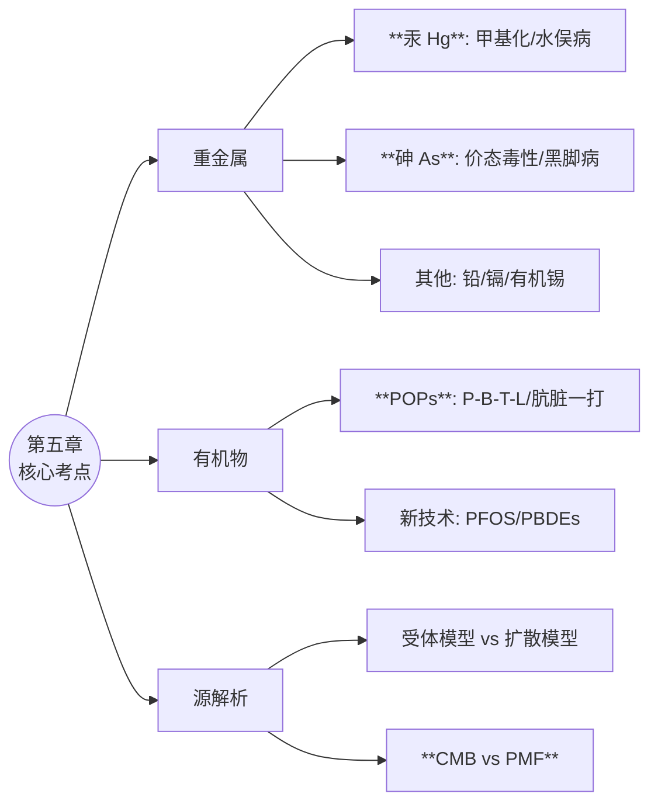

# 第五章 典型化学污染物及来源 - 核心复习笔记 (精修版)

> **文档说明**: 本文档为**30分钟考前突击版**。在保留原文档结构的基础上，对核心考点进行了完善，并补充了**常考题型**。

---

## 📚 知识框架概览

---

## 🧪 第一节：重金属与非金属 (核心考点)

### 1. 汞 (Hg) —— **必考：甲基化与循环**

* **核心反应**: **生物甲基化**
  * **条件**: **厌氧环境下**（如底泥中）。
  * **关键酶/辅酶**: **甲基钴氨素 ($CH_3CoB_{12}$)**。
  * **反应式**:
    $$
    CH_3CoB_{12} + Hg^{2+} + H_2O \rightarrow H_2OCoB_{12}^+ + CH_3Hg^+
    $$
  * **产物**: **甲基汞** ($CH_3Hg^+$)。具有**脂溶性**，易穿过血脑屏障，毒性远大于无机汞。
* **配合特性**: 汞离子与**巯基 (-SH)** 结合力极强 (logK=15.7)，这是其生物毒性的分子基础（使酶失活）。

### 2. 砷 (As) —— **必考：价态与形态**

* **毒性规律 (易错点)**:
  * **价态**: **三价 ($As^{3+}$) > 五价 ($As^{5+}$)** (毒性约强60倍)。
  * **结构**: **无机砷 > 有机砷** (注意与汞的规律相反)。
* **环境行为**:
  * **Eh (氧化还原)**: 还原条件下，$As^{5+}$ 转化为更毒的 $As^{3+}$。
  * **pH**: pH升高，$OH^-$ 竞争吸附位点，导致土壤中**砷释放**。

### 3. 其他重要元素 (案例连线题)

| 元素              | 关键特征                                  | 典型公害事件                                     |
| :---------------- | :---------------------------------------- | :----------------------------------------------- |
| **镉 (Cd)** | 生物半衰期长(10-30年)                     | **痛痛病** (骨质疏松/骨折)                 |
| **铅 (Pb)** | **儿童**吸收率是成人的5倍; 影响智力 | 汽车尾气/蓄电池                                  |
| **有机锡**  | 内分泌干扰物; 用于船底防污漆              | **海螺性畸变 (Imposex)**: 雌性长出雄性器官 |

---

## ☢️ 第二节：有机污染物 (核心考点)

### 1. 持久性有机污染物 (POPs)

#### **(1) 四大判别标准 (P-B-T-L)**

> **填空/简答高频题**

1. **持久性 (P)**: 水体 > **2个月**；土壤/沉积物 > **6个月**。
2. **生物蓄积性 (B)**: **BCF > 5000** 或 $logK_{ow} > 5$。
3. **远距离迁移 (L)**: 空气半衰期 > **2天** (全球蒸馏效应/蚱蜢跳)。
4. **毒性 (T)**: 致癌、致畸、致突变 (三致)。

#### **(2) 典型物质分类**

* **有机氯农药**: DDT、六六六 (HCH)。
* **工业化学品**: PCBs (多氯联苯，**209种**同系物)。
* **非意向副产物**: **二噁英 (PCDD/Fs)** —— 其中 **2,3,7,8-TCDD** 毒性最强。
* **新型POPs**:
  * **PBDEs** (多溴联苯醚): 阻燃剂。
  * **PFOS**: 全氟化合物，超稳定 (C-F键)，疏油疏水 (不粘锅)。

---

## 🔍 第三节：源解析技术 (核心考点)

### 1. 模型对比 (选择/判断)

| 模型类别                  | 代表方法 | 核心特点                                              |
| :------------------------ | :------- | :---------------------------------------------------- |
| **扩散模型** (正向) | 高斯模型 | 需**排放清单**，模拟气象过程 (从源推受体)。     |
| **受体模型** (反向) | CMB, PMF | **不需排放清单**，基于监测数据 (从受体反推源)。 |

### 2. CMB vs PMF (必考对比)

| 特性           | **化学质量平衡 (CMB)**    | **正定矩阵因子分解 (PMF)**  |
| :------------- | :------------------------------ | :-------------------------------- |
| **源谱** | ❌**必须已知** (依赖性强) | ✅**不需要** (未知源亦可解) |
| **原理** | 线性方程组求解 (质量守恒)       | 多元统计 (矩阵分解)               |
| **约束** | 源之间不能共线性                | 结果非负约束                      |
| **口诀** | **知己知彼** (需源谱)     | **无中生有** (自动分)       |

---

## 📝 典型习题与解析

### 题型一：名词解释与简答

**Q1: 什么是生物放大 (Biomagnification)？它在汞污染中如何体现？**

* **答**: 指同一食物链中，高营养级生物体内的污染物浓度远高于低营养级生物的现象。
* **体现**: 水体中甲基汞浓度极低，但经过藻类→小鱼→大鱼的富集，**鱼体内甲基汞浓度可比水体高数千倍** (如水俣病成因)。

**Q2: 简述 POPs 的定义及其判断依据。**

* **答**: POPs 是指具有持久性、生物蓄积性、半挥发性(远距离迁移)和高毒性的有机污染物。依据斯德哥尔摩公约，判断标准为：P(水>2月/土>6月)、B(BCF>5000)、T(高毒)、L(气>2天)。

---

### 题型二：计算题 (TEQ)

**Q: 某样品含 PCDDs 混合物，其中 2,3,7,8-TCDD 浓度为 10 pg/g (TEF=1.0)，OCDD 浓度为 1000 pg/g (TEF=0.0003)。计算总毒性当量 (TEQ)。**

* **公式**: $TEQ = \sum (C_i \times TEF_i)$
* **计算过程**:
  1. TCDD贡献: $10 \times 1.0 = 10$
  2. OCDD贡献: $1000 \times 0.0003 = 0.3$
  3. 总计: $10 + 0.3 = 10.3 \ pg/g$
* **结论**: 尽管OCDD浓度很高，但因毒性系数极低，对总毒性贡献很小。

---

### 题型三：分析判断题

**Q: 在城市土壤PAHs源解析中，若检测到 菲/蒽 < 10 且 荧蒽/芘 > 1，最可能的来源是什么？**

* **分析**:
  * **菲/蒽 < 10**: 指示**燃烧源** (而非石油挥发)。
  * **荧蒽/芘 > 1**: 细分指示**石油(液体燃料)燃烧** (如汽车尾气)。
* **结论**: 主要是**石油/燃油燃烧**来源 (如交通排放)。

---

## ⚡ 考前3分钟速览 (背诵版)

1. **汞甲基化**：厌氧 + 钴氨素(B12) $\rightarrow$ 甲基汞。
2. **毒性反转**：砷(无机>有机)、汞(有机>无机)。
3. **POPs时间**：水2(月)、土6(月)、气2(天)。
4. **源解析**：CMB一定要源谱，PMF不用。
5. **最毒物质**：2,3,7,8-TCDD。
6. **土壤汇**：多介质逸度模型显示土壤是PAHs主要储存库。
