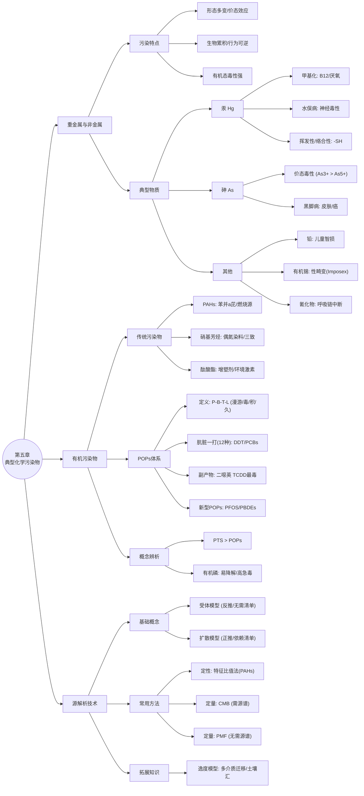

# 第五章 典型化学污染物及来源 - 复习笔记

> **文档说明**: 本文档基于《环境化学》第五章课件及PPT图片详情整理，涵盖核心考点、详细案例数据及源解析技术细节。

---

## 📚 知识框架概览

本章主要分为三个核心板块：

1. **重金属与非金属及其化合物**：重点掌握汞、砷的形态转化及与其毒性的关系。
2. **有机污染物**：涵盖传统有机污染物（酚、多环芳烃）、有机磷农药及持久性有机污染物（POPs）。
3. **源解析技术**：深入理解受体模型，掌握CMB与PMF模型的原理及应用场景。

---

## 🧪 第一节：重金属、非金属及其化合物

### 1. 重金属污染总论

* **污染特点 (十条总结)**：
  1. **形态多变**：价态不同、有机/无机态毒性差异大。
  2. **有机态毒性强**：通常 **有机态毒性 > 无机态毒性**（如甲基汞 > 无机汞）。
  3. **价态效应**：价态不同毒性不同（如 $As^{3+} > As^{5+}$）。
  4. **羰基剧毒**：金属羰基化合物常常剧毒。
  5. **迁移形式多**：在环境中迁移转化形式多样。
  6. **行为可逆**：物理化学行为多具有可逆性（如吸附-解吸）。
  7. **载体迁移**：水体迁移主要以**悬浮物和沉积物**为载体。
  8. **低浓度效应**：产生毒性效应的浓度范围低。
  9. **生物累积**：不可降解，易在生物体内积累 (Biomagnification)。
  10. **慢性毒害**：对人体的毒害主要是积累性的/慢性的。

### 2. 典型重金属与非金属细节分析

#### **(1) 汞 (Mercury, Hg)**

* **来源**：
  * **人为**：氯碱工业（每生产1t氯流失100-200g汞）、乙醛生产、采矿。
  * **天然**：火山喷发、岩石风化（自然界中元素汞因高电离势可稳定存在）。
* **形态与性质**：
  * **挥发性**：金属汞（Hg⁰）及二甲基汞（$(CH_3)_2Hg$）易挥发。
    * **数据支撑**：干空气中饱和蒸气浓度 ($ \mu g/m^3 $): 硫化汞(0.1) < 氧化汞(2.0) < 碘化汞(150)。
  * **络合性**：易与生物大分子（如蛋白质）中的**巯基(-SH)**结合。
    * **配合物稳定性 (logK)**：| 配体           | $CH_3Hg^+$          | $Hg^{2+}$ |
      | :------------- | :-------------------- | :---------- |
      | $OH^-$       | 9.5                   | 10.3        |
      | 半胱氨酸 (-SH) | **15.7** (极强) | 14          |
  * **形态转化**：
    * **甲基化 (Methylation)**：**关键考点**。
      * **条件**：厌氧环境（底泥）。
      * **载体**：**甲基钴氨素** (Methylcobalamin, Co-B12)。
      * **反应式**:

        $$
        CH_3CoB_{12} + Hg^{2+} + H_2O \rightarrow H_2OCoB_{12}^+ + CH_3Hg^+
        $$

        
      * **转化过程**：硫化物存在时，$Hg^{2+}$转化为$(CH_3)_2Hg$（二甲基汞）。
    * **去甲基化**：假单胞菌属细菌可将甲基汞还原为金属汞或降解为甲烷。
* **毒性**：
  * **生物放大**：鱼类对氯化甲基汞的浓缩系数可达3000。
  * **半衰期**：烷基汞分解半衰期约70天。

* **典型案例**：**日本水俣病 (Minamata Disease)**

  * **地点**：日本熊本县水俣湾 (1956年)。
  * **标志**：“自杀猫”（步态不稳、跳海）。
  * **病因**：化工厂排放甲基汞 -> 鱼贝类富集 -> 人食入。
  * **症状**：中枢神经系统受损（手足麻痹、视野狭窄、失智）。

  

#### **(2) 砷 (Arsenic, As)**

* **形态与毒性**：

  * 主要价态：三价砷 ($As^{3+}$, 亚砷酸盐) 和五价砷 ($As^{5+}$, 砷酸盐)。
  * **毒性规律**：**三价砷 ($As^{3+}$) > 五价砷 ($As^{5+}$)**（约60倍）；**无机砷 > 有机砷**。
  * **中毒症状**：
    * **急性**：呕吐、腹痛，伴有典型的**“蒜样气味”** (Garlic odor)。
    * **系统**：皮肤毒性（黑脚病）、神经系统、心血管系统损伤。
* **环境行为转化**：

  * **氧化还原 (Eh影响)**：Eh值下降（还原条件），有利于 $As^{5+}$ 还原为毒性更强的 $As^{3+}$ (HAsO₄ → HAsO₃)。
  * **吸附解吸 (pH影响)**：pH升高，OH⁻增多，与砷酸根竞争土壤吸附位点，导致**砷释放，溶解性增加**。
  * **沉淀**：含硫量高且还原条件下，可生成难溶的 $As_2S_3$（雌黄）。
* **典型案例**：

  * **基岩型**：地下水砷超标（“黑脚病”）。
  * **工业型**：湖南岳阳饮用水源砷超标；云南阳宗海砷污染（水质从II类降为劣V类）。

  

#### **(3) 铅 (Pb)**

* **特性**：蓝灰色，密度大，两性金属。
* **毒性**：**儿童吸收率 > 成人**。血液中铅含量 >10 μg/L 即可能导致中毒。
* **效应**：智力损伤、行为异常（如贝多芬性格阴沉可能与铅中毒有关）。

#### **(4) 有机锡 (Organotin)**

* **代表物**：三丁基锡 (TBT)。
* **用途**：船舶防污漆（杀菌、防腐）。
* **危害**：导致海洋生物（如海螺）**“性畸变” (Imposex)**——雌性长出雄性器官。
* **案例**：深圳蛇口港海域有机锡污染。

#### **(5) 氰化物 (Cyanide)**

* **结构**：$-C \equiv N$ 叁键，稳定性高。

* **毒理**：**CN⁻ 与细胞色素P450中的金属离子结合**，使其失去传递电子能力，阻断生物氧化过程（呼吸链中断），导致**细胞缺氧窒息**。

---

## ☢️ 第二节：有机污染物

### 1. 传统有机污染物

| 类别               | 代表物质                      | 关键特征/考点                                                                |
| :----------------- | :---------------------------- | :--------------------------------------------------------------------------- |
| **石油烃**   | **PX (对二甲苯)**       | 低毒，但为敏感化工项目。用于生产聚酯纤维（涤纶）、矿泉水瓶。                 |
| **酚类**     | 五氯酚、双酚A                 | 氯化后脂溶性增强。**辣根过氧化物酶**可催化氯酚转化为二噁英。           |
| **多环芳烃** | **PAHs** (苯并[a]芘)    | 16种优控PAHs。来源：煤/石油/木材**不完全燃烧**。致癌性强。             |
| **硝基芳烃** | 硝基苯、芳香胺                | **禁用偶氮染料**：可分解还原出致癌芳香胺。硝基芳烃具有“三致”毒性。   |
| **酞酸酯**   | **PAEs** (邻苯二甲酸酯) | **增塑剂**。与塑料非共价结合，易逸出。**环境激素**（影响生殖）。 |

### 2. 持久性有机污染物 (POPs)

#### **(1) 核心概念**

* **POPs 定义**：具持久性、生物蓄积性、半挥发性（远距离迁移）和高毒性。
* **PTS (持久性有毒物质)**：范围更广的概念，指在环境中不容易被降解、可以被生物蓄积的有毒物质的总称 (Persistent Toxic Substances)。

* **斯德哥尔摩公约**：
  * **首批12种 ("肮脏的一打")**：
    
    * **有机氯农药 (9种)**：DDT、六六六 (HCH)、氯丹、艾氏剂、狄氏剂、异狄氏剂、七氯、灭蚁灵、毒杀芬。
    * **工业化学品 (2种)**：多氯联苯 (**PCBs**, 共**209种**同系物)、六氯苯 (HCB)。
    * **副产物 (2类)**：二噁英 (PCDD/Fs)。其中 **2,3,7,8-TCDD** 毒性最强（被称为“世纪之毒”）。
  * **新增POPs**：PFOS, PFOA, PBDEs等。

#### **(2) 判别标准 (四大考点)**

1. **持久性 (Persistence)**：水体半衰期 > 2个月，土壤/沉积物 > 6个月。
2. **生物蓄积性 (Bioaccumulation)**：**BCF > 5000** 或 logKow > 5。
3. **远距离迁移 (Long-range Transport)**：空气半衰期 > 2天（"全球蒸馏/蚱蜢跳效应"）。
4. **毒性 (Toxicity)**：致癌、致畸、致突变。

#### **(3) 新型POPs详解**

* **PBDEs (多溴联苯醚)**：
  * **用途**：溴代阻燃剂（电子电器、纺织品）。
  * **毒性**：干扰甲状腺激素，结构类似PCBs。
* **PFOS/PFOA (全氟化合物)**：
  * **结构**：C-F键能极高，超强稳定性。**疏油疏水**。
  * **用途**：不粘锅涂层、防水服、消防泡沫。
  * **食物链传递**：地衣 -> 驯鹿 -> 狼 (**TMF > 1**, 显著生物放大)。

### 3. 有机磷农药 (Organophosphorus Pesticides)

* **结构分类**：

  * **磷酸酯**：如敌敌畏（Dichlorvos）。
  * **硫代磷酸酯**：如甲基对硫磷（P=S结构）。
  * **磷酰胺**：含-NH₂。

  
* **特性**：相比有机氯农药，有机磷**易降解**（低残留），但**急性毒性高**。

---

## 🔍 第三节：化学污染物的源解析技术

### 1. 概念与两类模型

* **源解析 (Source Apportionment)**：定量确定各类污染源对受体（环境）的贡献率。

* **扩散模型 (Dispersion Model)**：
  * **正向**：源排放 + 气象条件 $\rightarrow$ 环境浓度。
  * **缺点**：依赖精确的**排放清单 (Emission Inventory)**，难以模拟复杂化学反应。
* **受体模型 (Receptor Model)**：
  * **反向**：环境实测数据 (受体) $\rightarrow$ 反推源贡献。
  * **优点**：**不依赖排放清单**，利用现有监测数据即可分析。

### 2. 受体模型常用方法

#### **(1) 定性方法**

* **比值法 (Diagnostic Ratios)**：利用特定化合物的特征比值判断来源（**考点**）。
  * **PAHs示例**：

    * **菲/蒽 (Phe/An)**：>10 $\rightarrow$ 石油挥发；<10 $\rightarrow$ 燃烧源。
    * **荧蒽/芘 (Flu/Pyr)**：>1 $\rightarrow$ 石油燃烧；<1 $\rightarrow$ 煤/木材燃烧。

    
    

> **拓展知识：多介质逸度模型 (Multimedia Fugacity Model)**
>
> * **应用**：用于模拟有机污染物（如PAHs）在气-水-土-生等多介质间的迁移归趋。
> * **案例结论**：以乌鲁木齐为例，**土壤**往往是城市环境中PAHs最主要的**“汇” (Sink)**，储存量占比极高（可达97%以上）。

#### **(2) 定量方法：CMB vs PMF**

| 特性               | **化学质量平衡模型 (CMB)**             | **正定矩阵因子分解 (PMF)** |
| :----------------- | :------------------------------------------- | :------------------------------- |
| **基本原理** | 质量守恒$C_i = \sum m_j x_{ij}$            | 多元统计学（矩阵分解）           |
| **已知条件** | **必须已知源成分谱 (Source Profiles)** | **不需要**预先知道源谱     |
| **输入数据** | 受体浓度 + 源谱                              | 仅受体浓度 (+不确定度)           |
| **优势**     | 物理意义明确                                 | 适用于源谱未知的场景；结果非负   |
| **约束**     | 源之间不能有强共线性                         | 非负约束 (Non-negative)          |

---

## 📝 重点记忆口诀

> **[!TIP] 考前必看**
>
> 1. **汞的甲基化**：**厌氧**环境、**B12**帮忙、**甲基汞**最强（毒）。
> 2. **源解析双雄**：
>    * **CMB**：需要“知己知彼”（必须有源谱）。
>    * **PMF**：擅长“无中生有”（自动分解出源谱）。
> 3. **POPs四大特性**：**P** (持久)、**B** (富集/BCF>5000)、**T** (有毒)、**L** (远距离/半衰期>2d)。
> 4. **价态毒性反转**：
>    * **汞**：有机 > 无机 (甲基汞最毒)。
>    * **砷**：无机 > 有机 (三价最毒)。

---

## 📚 重点案例汇总

| 物质               | 事件名称                | 关键成因/机制            | 后果/症状                                    |
| :----------------- | :---------------------- | :----------------------- | :------------------------------------------- |
| **甲基汞**   | **水俣病** (日本) | 乙醛厂排污，微生物甲基化 | **中枢神经**损伤、视野向心性狭窄、失智 |
| **镉 (Cd)**  | **痛痛病** (日本) | 矿山废水污染稻田 (镉米)  | **骨骼**病变 (骨质疏松、易骨折)        |
| **多氯联苯** | 米糠油事件              | 热载体泄漏进入食用油     | 皮肤氯痤疮、肝损                             |
| **有机锡**   | 海螺性畸变              | 船舶防污漆释放 TBT       | 雌性海螺长出雄性器官 (Imposex)               |
| **二噁英**   | 越南橙剂                | 战时落叶剂含杂质 TCDD    | 严重致畸 (海豹肢)                            |

---

## 📝 课后习题与自测

### 1. 简答与论述题

* **5-1 什么是POPs？POPs的判别标准是什么？**

  * **【参考答案】**：
    1. **定义**：持久性有机污染物 (POPs) 是一类具有持久性、生物蓄积性、半挥发性（能远距离迁移）和高毒性的有机污染物。
    2. **四大判别标准**（斯德哥尔摩公约）：
       * **持久性 (Persistence)**：在水体中半衰期 > 2个月，或在土壤/沉积物中 > 6个月。
       * **生物蓄积性 (Bioaccumulation)**：生物浓缩系数 (BCF) > 5000，或辛醇-水分配系数 logKow > 5。
       * **远距离迁移 (Long-range Transport)**：在空气中半衰期 > 2天（具备“全球蒸馏/蚱蜢跳”效应）。
       * **毒性 (Toxicity)**：具有致癌、致畸、致突变（三致）效应或其他慢性毒性。
* **5-2 列举几种典型的无机污染物，说明其主要来源和危害。**

  * **【参考答案】**：
    1. **汞 (Hg)**：
       * **来源**：氯碱工业、乙醛生产、采矿。
       * **危害**：**水俣病**（中枢神经受损、视野狭窄、失智）。甲基汞毒性最强。
    2. **镉 (Cd)**：
       * **来源**：有色金属冶炼、电镀。
       * **危害**：**痛痛病**（骨质疏松、骨折、肾损伤）。
    3. **铅 (Pb)**：
       * **来源**：汽车尾气（过去）、油漆涂料、电池制造。
       * **危害**：儿童智力损伤、行为异常；血液系统毒性。
    4. **砷 (As)**：
       * **来源**：含砷农药、矿山开采。
       * **危害**：**黑脚病**（皮肤坏死）、皮肤癌；急性中毒有**蒜样气味**。
* **5-4 列举几种典型的PTS，说明其主要来源和危害。**

  * **【参考答案】**：

    * **PTS (持久性有毒物质)** 包括了 POPs 以及其他具有类似特性的污染物（如重金属、有机金属等）。

    1. **有机锡 (如TBT)**：
       * **来源**：船舶防污漆。
       * **危害**：海洋生物（如海螺）的**“性畸变” (Imposex)**，雄性化。
    2. **多环芳烃 (PAHs)**：
       * **来源**：煤、石油、木材的不完全燃烧。
       * **危害**：强致癌性（如苯并[a]芘）。
    3. **重金属 (Hg/Cd/Pb)**：见上题，均属于无机类 PTS。

### 2. 计算题：二噁英毒性当量 (TEQ) 计算

**题目**：下表给出了某样品中不同二噁英同系物 (PCDD/Fs) 的浓度及 2005年 WHO 的毒性当量因子 (TEF) 标准。请计算该样品的 PCDD/Fs 总毒性当量 (TEQ)。

**计算公式**：

$$
TEQ = \sum (Concentration_i \times TEF_i)
$$

| 同系物 (PCDD/Fs)         | 平均浓度 (pg/g 湿重) | TEF (WHO 2005) |
| :----------------------- | :------------------- | :------------- |
| **2,3,7,8-TCDD**   | 0.30                 | **1.0**  |
| 1,2,3,7,8-PeCDD          | 0.80                 | 1.0            |
| 1,2,3,4,7,8-HxCDD        | 0.23                 | 0.1            |
| 1,2,3,6,7,8-HxCDD        | 0.46                 | 0.1            |
| 1,2,3,7,8,9-HxCDD        | 0.17                 | 0.1            |
| 1,2,3,4,6,7,8-HpCDD      | 0.52                 | 0.01           |
| OCDD                     | 2.9                  | 0.0003         |
| **2,3,7,8-TCDF**   | 3.3                  | 0.1            |
| 1,2,3,7,8-PeCDF          | 0.96                 | 0.03           |
| 2,3,4,7,8-PeCDF          | 2.1                  | 0.3            |
| (其他HxCDF/HpCDF/OCDF略) | ...                  | ...            |

> **解题思路与详细步骤**：
>
> 1. **公式应用**：$TEQ = \sum (浓度 \times TEF)$。
> 2. **逐项计算**：
>    * **PCDDs组分**：
>      * TCDD: $0.30 \times 1.0 = 0.30$
>      * PeCDD: $0.80 \times 1.0 = 0.80$
>      * HxCDD(1,2,3,4,7,8): $0.23 \times 0.1 = 0.023$
>      * HxCDD(1,2,3,6,7,8): $0.46 \times 0.1 = 0.046$
>      * HxCDD(1,2,3,7,8,9): $0.17 \times 0.1 = 0.017$
>      * HpCDD: $0.52 \times 0.01 = 0.0052$
>      * OCDD: $2.9 \times 0.0003 \approx 0.0009$
>      * *PCDDs 小计* ≈ **1.1921**
>    * **PCDFs组分**：
>      * TCDF: $3.3 \times 0.1 = 0.33$
>      * 1-PeCDF: $0.96 \times 0.03 = 0.0288$
>      * 2-PeCDF: $2.1 \times 0.3 = 0.63$
>      * HxCDF (1,2,3,4,7,8): $0.29 \times 0.1 = 0.029$
>      * HxCDF (1,2,3,6,7,8): $0.33 \times 0.1 = 0.033$
>      * HxCDF (1,2,3,7,8,9): $0.10 \times 0.1 = 0.01$
>      * HxCDF (2,3,4,6,7,8): $0.39 \times 0.1 = 0.039$
>      * HpCDF (1,2,3,4,6,7,8): $0.32 \times 0.01 = 0.0032$
>      * HpCDF (1,2,3,4,7,8,9): $0.1 \times 0.01 = 0.001$
>      * OCDF: $0.2 \times 0.0003 \approx 0.0001$
>      * *PCDFs 小计* ≈ **1.1041**
> 3. **总计**：$1.1921 + 1.1041 = 2.2962$
>
> **【最终答案】**：该样品的二噁英总毒性当量 (TEQ) 约为 **2.30 pg/g** (保留两位小数)。
