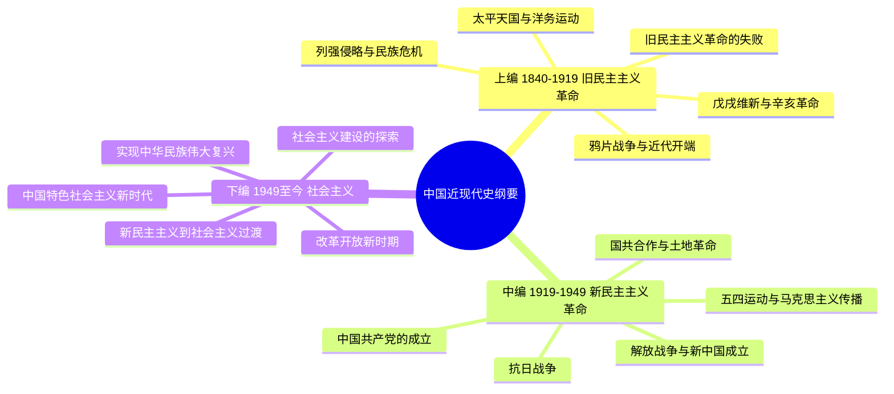
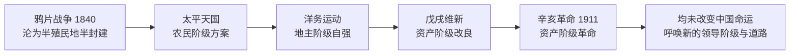
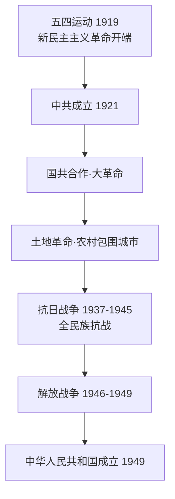
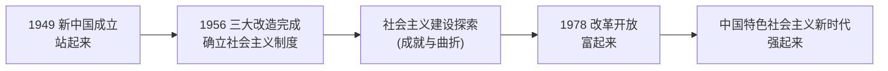

# 中国近现代史纲要 · 核心例题精解 · 图示深化

> 本篇为**深化层**：在「最终复习资料」之上，给出**时间线总图 + 名词解释 / 简答 / 论述题 + 参考答案**，并配**思维导图 / 脉络示意图**（mermaid 矢量图，非纯文字）。
> 史论题作答遵循"摆史实 → 析原因 → 论意义 → 得结论（四个选择）"的逻辑。

---

## 全课脉络 · 思维导图

---

## 上编 · 旧民主主义革命（1840–1919）

### 脉络示意 · 近代救亡探索的递进与失败

### 例题 1-1（名词解释）
**题**：解释"半殖民地半封建社会"。
**参考答案**：鸦片战争后，中国**主权不完整、受帝国主义控制与压迫**（半殖民地），同时**封建剥削制度仍占主导、又出现资本主义因素**（半封建）的社会形态。这是近代中国一切问题的总根源，决定了**反帝反封建**的双重革命任务。

### 例题 1-2（简答）
**题**：为什么说鸦片战争是中国近代史的开端？
**参考答案**：① 战后《南京条约》等使中国**领土、关税、司法主权受损**，开始沦为半殖民地半封建社会；② 社会主要矛盾变为**帝国主义与中华民族、封建主义与人民大众**的矛盾；③ 革命任务转为**反帝反封建**；④ 自然经济开始解体、近代工业与新阶级萌生。故以 1840 年为近代史起点。

### 例题 1-3（论述）
**题**：试论太平天国、洋务运动、戊戌维新、辛亥革命相继失败说明了什么。
**参考答案**：
1. **史实**：农民阶级（太平天国）、地主阶级（洋务）、资产阶级改良派（戊戌）、资产阶级革命派（辛亥）先后探索，或被镇压、或仅图器物/制度的局部变革。
2. **原因**：均未触及**反帝反封建的根本任务**，缺乏**科学理论指导**、**先进阶级领导**与**广泛的群众动员**。
3. **结论**：旧式革命无法完成救亡使命，历史呼唤**新的阶级（无产阶级）、新的政党（中国共产党）、新的理论（马克思主义）**——为"四个选择"埋下伏笔。

---

## 中编 · 新民主主义革命（1919–1949）

### 脉络示意 · 中国共产党领导革命走向胜利

### 例题 2-1（名词解释）
**题**：什么是新民主主义革命？它"新"在何处？
**参考答案**：新民主主义革命是**无产阶级领导的、人民大众的、反帝反封建**的革命。"新"在：① **领导阶级**为无产阶级（及其政党）而非资产阶级；② **指导思想**为马克思列宁主义；③ 属**世界无产阶级革命的一部分**；④ 前途是**社会主义**而非资本主义。以 1919 年五四运动为开端。

### 例题 2-2（简答）
**题**：为什么说中国共产党的成立是"开天辟地的大事变"？
**参考答案**：① 中国革命有了**坚强的领导核心**；② 有了**科学的指导思想**（马克思主义）；③ 有了**新的革命方法**（联系群众、武装斗争、统一战线）；④ 将反帝反封建与社会主义前途相联系，**中国革命面貌焕然一新**。

### 例题 2-3（论述）
**题**：抗日战争胜利的原因及历史意义。
**参考答案**：
- **原因**：① **中国共产党的中流砥柱作用**（倡导并维护抗日民族统一战线、开辟敌后战场）；② **全民族团结抗战**；③ 正面与敌后战场相互配合；④ **世界反法西斯同盟的支持**。
- **意义**：① 近代以来**第一次取得反侵略战争的完全胜利**；② 收复台湾等失地，**捍卫国家主权与领土完整**；③ 提高了中国的国际地位；④ 为新民主主义革命在全国胜利**奠定基础**。

---

## 下编 · 社会主义革命、建设与新时代（1949– ）

### 脉络示意 · 从站起来到强起来

### 例题 3-1（简答）
**题**：简述新中国成立的伟大历史意义。
**参考答案**：① **结束**了帝国主义、封建主义、官僚资本主义的统治和压迫，实现民族独立、人民解放；② 结束一盘散沙局面，实现**国家基本统一**；③ 中国人民**从此站起来**，成为国家的主人；④ 为实现由新民主主义向社会主义过渡、进而实现现代化创造了**前提**；⑤ 是马克思主义在中国的**伟大胜利**。

### 例题 3-2（名词解释）
**题**：什么是"三大改造"？其完成的意义？
**参考答案**：指 1953–1956 年对**农业、手工业和资本主义工商业**的社会主义改造。完成标志着**社会主义基本制度在中国确立**，实现了中国历史上**最深刻的社会变革**，为社会主义建设奠定制度基础。

### 例题 3-3（论述 · "四个选择"总纲）
**题**：结合史实论述近代以来历史和人民为什么选择了马克思主义、中国共产党、社会主义道路和改革开放。
**参考答案**：
1. **选择马克思主义**：各种救国方案（改良、君主立宪、资产阶级共和国）相继失败，十月革命与五四运动后，马克思主义因其**科学性与革命性**被先进分子接受。
2. **选择中国共产党**：唯有中共把马克思主义与中国实际结合，提出正确纲领、依靠人民、武装斗争，**领导革命取得胜利**。
3. **选择社会主义道路**：新民主主义革命的前途必然是社会主义；三大改造完成确立社会主义制度，**符合中国国情与人民根本利益**。
4. **选择改革开放**：社会主义建设探索中既有成就也有曲折，1978 年后改革开放**解放和发展生产力**，使中国大踏步赶上时代。
- **结论**：四个选择是历史的必然，深刻揭示"**没有共产党就没有新中国，只有社会主义才能救中国，只有改革开放才能发展中国**"。

---

> **正言若反**：史论不离史实，史实不离脉络，脉络不离原始 PDF 课件之图。本篇为"论得清、答得全"的一层；遇疑，回归「最终复习资料」与时间线核对年代与表述。
